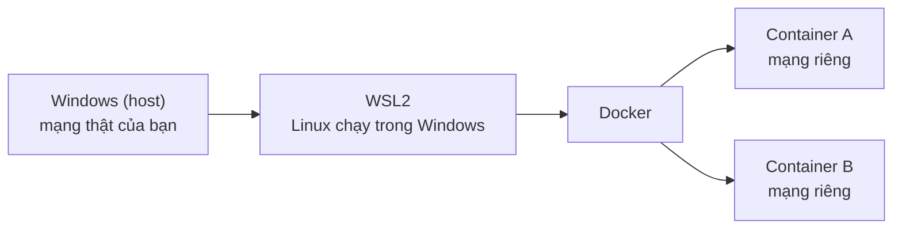

---
tags:
  - Must
  - Lab
  - Linux
  - Docker
---

# Làm sao dựng một môi trường lab mạng an toàn trên máy Windows?

## Metadata

```yaml
Chapter: lab-environment
Phase: 00 — lab-toolkit
Importance: Must
Status: draft
Prerequisites: []
Used Later:
  - Phase 00 / 02-linux-network-tools
Estimated Reading: 20 phút
Estimated Practice: 40 phút
```

## 1. Story

<!-- Mức bắt buộc (Must): Đủ -->
<!-- DRAFT: người học cần viết lại bằng lời mình -->

Bạn đọc một hướng dẫn và gõ lệnh xóa default route trên chính laptop làm việc để "xem điều gì xảy ra". Vài giây sau, họp video rớt, VPN mất, và bạn mất nửa tiếng để khôi phục cấu hình mạng mà không nhớ giá trị ban đầu.

Một lab mạng tốt cho phép bạn **phá thoải mái mà không đụng vào máy thật**: làm hỏng, quan sát, xóa đi, làm lại. Chapter này dựng môi trường như vậy trước khi bạn làm bất kỳ lab nào khác trong sách.

## 2. Objectives

<!-- Mức bắt buộc (Must): Đủ -->
<!-- DRAFT: người học cần viết lại bằng lời mình -->

Sau chapter này bạn có thể:

- Giải thích được vì sao lab mạng nên chạy trong container thay vì sửa cấu hình mạng của máy thật.
- Cài và kiểm tra được WSL2 và Docker trên Windows.
- Chạy được một container tạm thời (tự xóa khi thoát) và đọc địa chỉ mạng bên trong nó.
- Dự đoán được container thấy gì khi chạy với `--network none`, rồi kiểm chứng.
- Tuân theo quy ước lab của sách: Predict → Run → Verify → Break it → dọn dẹp.

## 3. Prerequisites

<!-- Mức bắt buộc (Must): Đủ -->
<!-- DRAFT: người học cần viết lại bằng lời mình -->

Không có chapter nào cần học trước. Bạn cần quyền cài phần mềm trên máy Windows của mình (nếu là máy công ty, hãy hỏi bộ phận IT trước).

## 4. Why it exists

<!-- Mức bắt buộc (Must): Đủ -->
<!-- DRAFT: người học cần viết lại bằng lời mình -->

Học mạng bằng cách đọc là chưa đủ; bạn cần thấy lệnh chạy ra gì và thấy lỗi trông thế nào. Nhưng thực hành trên máy thật có ba rủi ro:

- **Phá cấu hình đang dùng** (mạng, VPN, DNS) và khó khôi phục.
- **Không lặp lại được:** hôm nay chạy được, tuần sau máy khác trạng thái.
- **Dọn không sạch:** lab để lại tiến trình, file, quy tắc firewall rác.

Container giải quyết cả ba: mỗi container có **ngăn xếp mạng riêng** (địa chỉ, route riêng), khởi tạo từ cùng một ảnh nên luôn giống nhau, và biến mất khi thoát nếu bạn chạy với `--rm`.

Nếu bỏ qua bước này, bạn sẽ hoặc ngại thử "phá" (nên không học được cách chẩn đoán), hoặc thử trên máy thật rồi gánh hậu quả.

## 5. Mental model

<!-- Mức bắt buộc (Must): Đủ -->
<!-- DRAFT: người học cần viết lại bằng lời mình -->

Hình dung phòng thí nghiệm hóa học có **buồng kính cách ly**. Hóa chất nguy hiểm chỉ được trộn trong buồng; nếu nổ, bạn lau buồng chứ không phải xây lại cả tòa nhà. Container là buồng kính của bạn.

**Tóm tắt một câu:** làm hỏng mạng bên trong container, không phải trên máy thật; cần sạch thì thoát và chạy lại.

## 6. How it works

<!-- Mức bắt buộc (Must): Đủ -->
<!-- DRAFT: người học cần viết lại bằng lời mình -->

Các từ cần biết:

- **Lab environment (môi trường thực hành — nơi bạn chạy lệnh thử mà không ảnh hưởng đến máy hay hệ thống thật).**
- **Host (máy chủ vật chủ — máy thật đang chạy mọi thứ khác, ở đây là máy Windows của bạn).**
- **WSL2 (Windows Subsystem for Linux phiên bản 2 — cách chạy Linux ngay trong Windows).**
- **Container (vùng chạy riêng — một chương trình chạy tách biệt khỏi phần còn lại của máy, có mạng và hệ thống file riêng).**
- **Container image (ảnh container — gói chứa chương trình và môi trường cần để chạy container, dùng làm "khuôn" tạo container).**



**Đọc sơ đồ:** Windows là máy thật. WSL2 cho bạn một môi trường Linux để dùng công cụ mạng của Linux (chapter `00/02`). Docker chạy trên đó và tạo ra các container; mỗi container nhìn thấy một thế giới mạng riêng, tách khỏi mạng thật. Lệnh nào bạn chạy bên trong container (xóa route, đổi địa chỉ) chỉ ảnh hưởng container đó.

> Chi tiết cơ chế cách ly mạng của Linux (network namespace) được học ở `07/01`; ở chapter này bạn chỉ cần dùng nó.

**Ba quy tắc an toàn của sách:**

- Lab chỉ **đọc hoặc chạy trong container**; không đổi cấu hình mạng của Windows.
- Lệnh có thể tốn tiền (tài nguyên AWS) luôn có cảnh báo chi phí trước và bước dọn dẹp sau.
- Output dán vào repo phải được làm sạch (IP thật, tên thật → dữ liệu giả).

## 7. Key settings

<!-- Mức bắt buộc (Must): Đủ -->
<!-- DRAFT: người học cần viết lại bằng lời mình -->

| Mục | Giá trị/lệnh | Ý nghĩa |
|---|---|---|
| Cài WSL | `wsl --install` (PowerShell chạy bằng quyền administrator) | Bật WSL và cài Ubuntu mặc định |
| Kiểm tra phiên bản WSL | `wsl --list --verbose` | Xem mỗi distro dùng WSL 1 hay 2 |
| Kiểu mạng WSL2 mặc định | NAT (có tùy chọn `mirrored`) | WSL2 dùng địa chỉ riêng, ra ngoài qua NAT của Windows |
| `docker run --rm` | cờ `--rm` | Tự xóa container khi thoát — dọn dẹp tự động |
| `--cap-add NET_ADMIN` | cờ quyền | Cho phép đổi cấu hình mạng **bên trong container** (chỉ dùng khi lab cần) |
| `--network none` | cờ mạng | Container chỉ có loopback, không có kết nối ra ngoài |

<!-- verified: 2026-10-02 https://learn.microsoft.com/en-us/windows/wsl/install -->
<!-- verified: 2026-10-02 https://learn.microsoft.com/en-us/windows/wsl/networking -->
<!-- verified: 2026-10-02 https://docs.docker.com/engine/network/drivers/none/ -->

Theo Microsoft, `wsl --install` yêu cầu Windows 10 build 19041 trở lên hoặc Windows 11, bật các tính năng cần thiết và cài Ubuntu mặc định; chế độ mạng mặc định của WSL là NAT, còn `mirrored` yêu cầu Windows 11 22H2 trở lên. Theo Docker, driver mạng `none` chỉ tạo thiết bị loopback.

## 8. AWS mapping

<!-- Mức bắt buộc (Must): Đủ nếu có liên quan AWS -->
<!-- DRAFT: người học cần viết lại bằng lời mình -->

Chapter này không dùng AWS. Các quy tắc cho lab AWS ở Phase 06 được chốt sẵn từ bây giờ:

- Chỉ dùng **tài khoản sandbox riêng**, Region `ap-northeast-1`, gắn tag `Project=net-handbook`.
- Đặt **budget alert** trước khi chạy bất cứ thứ gì.
- Mỗi lab có **bước teardown** và lệnh kiểm tra đã xóa hết.
- Tài nguyên tính tiền theo giờ hoặc theo GB (NAT Gateway, Interface endpoint, ALB/NLB, VPN…) cần cảnh báo chi phí trước khi chạy; giá tra trên trang chính thức, không ghi số trong sách.

## 9. Hands-on lab

<!-- Mức bắt buộc (Must): Đủ + expected-output.txt -->
<!-- DRAFT: người học cần viết lại bằng lời mình -->

Chi tiết ở `labs/phase-00-lab-toolkit/chapter-01-lab-environment/README.md`.

**1. Predict:**

- WSL2 có địa chỉ IP giống Windows không? Nằm trong dải private nào?
- Container chạy mặc định có cùng IP với WSL2 không?
- Container chạy với `--network none` có những giao diện mạng nào?

**2. Run:**

```powershell
wsl --list --verbose
```

```powershell
wsl hostname -I
```

```powershell
docker version
```

```powershell
docker run --rm alpine ip addr
```

```powershell
docker run --rm --network none alpine ip addr
```

**3. Verify:** so sánh địa chỉ: Windows, WSL2, container mặc định, container `none`.

Output thật: `[CHƯA CHẠY]`. Khi ghi `expected-output.txt`, thay IP thật bằng IP giả.

## 10. Break it

<!-- Mức bắt buộc (Must): Đủ (≥ 1 Break it) -->
<!-- DRAFT: người học cần viết lại bằng lời mình -->

**Gây lỗi:** cho container mất mạng bằng `--network none`, rồi thử ra ngoài.

```powershell
docker run --rm -it --network none alpine sh
```

Trong container:

```sh
ip addr
ping -c 1 -W 2 192.0.2.1
```

**Dự đoán:** `ip addr` chỉ có loopback `lo`; ping báo ngay không có đường đi (không chờ timeout vì không có route). Thông báo chính xác có thể khác nhau.

**Khôi phục:** gõ `exit`. Container dùng `--rm` nên tự bị xóa. Chạy lại với mạng mặc định để thấy sự khác biệt.

Kết quả thật: `[CHƯA CHẠY]`.

## 11. Troubleshooting

<!-- Mức bắt buộc (Must): Đủ -->
<!-- DRAFT: người học cần viết lại bằng lời mình -->

| Triệu chứng | Kiểm tra theo thứ tự | Công cụ |
|---|---|---|
| `wsl --install` chỉ in trợ giúp | WSL đã được cài một phần? → liệt kê distro online rồi cài đúng tên (xem tài liệu cài đặt) | `wsl --list --online`, `wsl --install -d <tên>` |
| `docker` không chạy được | Docker đã khởi động chưa? WSL2 đã bật chưa? | `docker version`, `wsl --list --verbose` |
| Container không ra được Internet | Đang dùng `--network none`? Có mạng VPN/proxy can thiệp? | `docker run --rm alpine ip addr`, `ip route` trong container |
| Lệnh `ip route del` báo không đủ quyền | Thiếu `--cap-add NET_ADMIN` | Thêm cờ đó khi `docker run` |

Ghi thêm kết quả thật của mục 10 sau khi chạy: `[CHƯA CHẠY]`.

## 12. Security & cost

<!-- Mức bắt buộc (Must): Đủ -->
<!-- DRAFT: người học cần viết lại bằng lời mình -->

- `--cap-add NET_ADMIN` cấp thêm quyền cho container; chỉ dùng cho lab cần đổi mạng, không dùng cho container chạy dịch vụ thật.
- Chạy image từ nguồn chính thức; không chạy image lạ trên máy công việc.
- Chạy trên máy công ty: kiểm tra chính sách trước khi bật WSL/Docker.
- Chi phí: lab local **không tốn tiền**. Lab AWS (Phase 06) có quy tắc riêng ở mục 8.

## 13. Misconceptions

<!-- Mức bắt buộc (Must): Đủ -->
<!-- DRAFT: người học cần viết lại bằng lời mình -->

| Hiểu nhầm | Sự thật |
|---|---|
| "Container là máy ảo" | Container chia sẻ nhân của hệ điều hành chủ nhưng có không gian mạng và file riêng; nhẹ hơn máy ảo |
| "Sửa mạng trong container ảnh hưởng máy thật" | Mặc định thì không: thay đổi chỉ nằm trong container đó |
| "WSL2 có cùng IP với Windows" | WSL2 dùng địa chỉ riêng và ra ngoài qua NAT (chế độ mặc định) |
| "Có Docker là đủ để học mọi bài mạng" | Một số lab cần Linux thật hoặc WSL2 (ví dụ `NET_ADMIN`, namespace); luôn kiểm tra README lab |

## 14. Interview questions

<!-- Mức bắt buộc (Must): Đủ -->
<!-- DRAFT: người học cần viết lại bằng lời mình -->

### Q1 (Junior) — Vì sao nên thử lệnh mạng trong container thay vì trên máy làm việc?

**Gợi ý ý chính:**
- Rủi ro nếu cấu hình sai trên máy thật?
- Làm sao đưa môi trường về trạng thái ban đầu?

??? success "Đáp án mẫu (tự trả lời trước khi mở)"
    Container có ngăn xếp mạng riêng nên thay đổi chỉ ảnh hưởng nó; khởi tạo từ cùng một image nên lặp lại được; với `--rm` thì tự dọn khi thoát. Máy thật không bị đổi cấu hình và không để lại rác.

### Q2 (Middle) — `--network none` khác mạng mặc định thế nào, và khi nào dùng?

**Gợi ý ý chính:**
- Giao diện mạng nào tồn tại?
- Dùng để kiểm thử hay cô lập thứ gì?

??? success "Đáp án mẫu (tự trả lời trước khi mở)"
    `none` chỉ có loopback, không có đường ra ngoài. Dùng để cô lập tuyệt đối (xử lý dữ liệu không cần mạng) hoặc để mô phỏng tình huống "không có mạng" khi học chẩn đoán.

## 15. Exercises

<!-- Mức bắt buộc (Must): Đủ -->
<!-- DRAFT: người học cần viết lại bằng lời mình -->

1. **Bản đồ địa chỉ của bạn.** Chạy các lệnh ở mục 9. *Deliverable:* bảng 4 dòng (Windows / WSL2 / container mặc định / container `none`) gồm giao diện và dải địa chỉ, đã thay IP thật bằng IP giả.
2. **Ba quy tắc.** Viết lại bằng lời của bạn ba quy tắc an toàn lab ở mục 6, mỗi quy tắc kèm một ví dụ sai. *Deliverable:* danh sách 3 mục.
3. **Checklist dọn dẹp.** *Deliverable:* một checklist 5 dòng để chắc chắn sau lab không còn container hoặc file tạm.

## 16. Cheat sheet

<!-- Mức bắt buộc (Must): Đủ -->
<!-- DRAFT: người học cần viết lại bằng lời mình -->

| Việc | Lệnh |
|---|---|
| Cài WSL | `wsl --install` |
| Xem distro/phiên bản WSL | `wsl --list --verbose` |
| IP của WSL2 | `wsl hostname -I` |
| Container tạm có shell | `docker run --rm -it alpine sh` |
| Container cần đổi mạng | thêm `--cap-add NET_ADMIN` |
| Container không có mạng | thêm `--network none` |

**Quy ước lab:** Predict → Run → Verify → Break it → dọn dẹp; không dán dữ liệu thật vào repo.

## 17. Glossary terms

<!-- Mức bắt buộc (Must): Đủ -->
<!-- DRAFT: người học cần viết lại bằng lời mình -->

- Lab environment / môi trường thực hành / ラボ環境
- Host / máy chủ vật chủ / ホスト
- WSL2 / WSL phiên bản 2 / WSL2
- Container / vùng chạy riêng / コンテナ
- Container image / ảnh container / コンテナイメージ

## 18. Further reading

<!-- Mức bắt buộc (Must): Đủ -->
<!-- DRAFT: người học cần viết lại bằng lời mình -->

Kiểm tra ngày 2026-10-02:

- Cài WSL: https://learn.microsoft.com/en-us/windows/wsl/install
- Mạng trong WSL: https://learn.microsoft.com/en-us/windows/wsl/networking
- Docker network driver `none`: https://docs.docker.com/engine/network/drivers/none/
