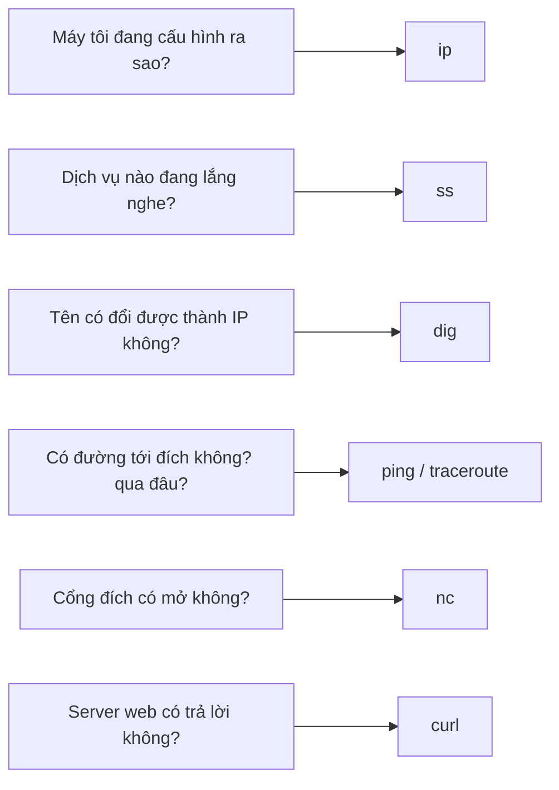

---
tags:
  - Must
  - Lab
  - Linux
  - Troubleshooting
---

# Khi mạng có vấn đề, tôi nên dùng công cụ nào để hỏi từng câu?

## Metadata

```yaml
Chapter: linux-network-tools
Phase: 00 — lab-toolkit
Importance: Must
Status: draft
Prerequisites:
  - Phase 00 / 01-lab-environment
Used Later:
  - Phase 00 / 03-packet-capture
  - Phase 02 / 01-routing-table-basics
  - Phase 03 / 04-icmp-ping-traceroute
  - Phase 07 / 01-network-namespaces
Estimated Reading: 25 phút
Estimated Practice: 45 phút
```

## 1. Story

<!-- Mức bắt buộc (Must): Đủ -->
<!-- DRAFT: người học cần viết lại bằng lời mình -->

Dịch vụ `shopnet` báo lỗi "không kết nối được database". Đồng nghiệp hỏi: "Dịch vụ có đang lắng nghe không? DNS trả về gì? Đường đi có thông không?" Bạn chỉ biết chạy `ping` và không biết hỏi tiếp.

Mỗi công cụ mạng trả lời **một câu hỏi cụ thể**. Chapter này gom các công cụ dùng hằng ngày thành một bộ, mỗi cái gắn với câu hỏi nó trả lời, để khi gặp sự cố bạn biết gõ lệnh nào trước.

## 2. Objectives

<!-- Mức bắt buộc (Must): Đủ -->
<!-- DRAFT: người học cần viết lại bằng lời mình -->

Sau chapter này bạn có thể:

- Ghép đúng công cụ (`ip`, `ss`, `curl`, `dig`, `nc`, `traceroute`) với câu hỏi mà nó trả lời.
- Xem được địa chỉ, route và các cổng đang lắng nghe trên một máy Linux.
- Phân biệt được "kết nối bị từ chối" (ngay lập tức) với "kết nối hết thời gian" (chờ rồi báo).
- Chạy được một server thử và kiểm tra nó bằng ít nhất hai công cụ khác nhau.

## 3. Prerequisites

<!-- Mức bắt buộc (Must): Đủ -->
<!-- DRAFT: người học cần viết lại bằng lời mình -->

> Xem lại: [lab-environment](01-lab-environment.md)

Bạn cần một shell Linux: WSL2 (Ubuntu) hoặc một container như `alpine`.

## 4. Why it exists

<!-- Mức bắt buộc (Must): Đủ -->
<!-- DRAFT: người học cần viết lại bằng lời mình -->

Sự cố mạng hiếm khi tự nói cho bạn biết nguyên nhân; bạn phải **hỏi từng chặng**. Công cụ có sẵn trên hầu hết máy chủ Linux, nên bạn dùng được cả trên server thật lẫn trong container, không cần cài phần mềm lớn.

Nếu chỉ biết `ping`: bạn không phân biệt được "DNS hỏng" với "đường đi hỏng" với "dịch vụ không chạy", và đoán mò mất thời gian.

## 5. Mental model

<!-- Mức bắt buộc (Must): Đủ -->
<!-- DRAFT: người học cần viết lại bằng lời mình -->

Hình dung hộp dụng cụ của thợ sửa ống nước: cờ lê, đồng hồ đo áp, camera nội soi. Mỗi dụng cụ cho một loại thông tin khác nhau; không ai dùng cờ lê để đo áp.

**Tóm tắt một câu:** công cụ nào trả lời câu hỏi nào, và hỏi từ gần đến xa.

## 6. How it works

<!-- Mức bắt buộc (Must): Đủ -->
<!-- DRAFT: người học cần viết lại bằng lời mình -->

Các từ cần biết:

- **Network interface (giao diện mạng — "cửa" mà một máy dùng để nối vào mạng, ví dụ cổng cáp hoặc Wi-Fi; mỗi cửa có địa chỉ riêng).**
- **Port (cổng — con số đánh dấu một dịch vụ trên máy; địa chỉ IP chọn máy, cổng chọn dịch vụ trong máy đó).**
- **Listening (đang lắng nghe — một dịch vụ đã mở cổng và chờ có người kết nối đến).**
- **HTTP (giao thức web — cách trình duyệt và server nói chuyện với nhau).**



**Đọc sơ đồ:** mỗi câu hỏi có một công cụ. Khi chẩn đoán, đi **từ gần đến xa**: kiểm tra máy mình (`ip`, `ss`), rồi tên (`dig`), rồi đường đi (`ping`, `traceroute`), rồi cổng (`nc`), rồi ứng dụng (`curl`). Chặng đầu tiên cho kết quả bất thường thường là nơi có lỗi.

| Công cụ | Làm gì | Lệnh thường dùng |
|---|---|---|
| `ip` | Xem/sửa địa chỉ, route, giao diện | `ip -br addr`, `ip route`, `ip route get <đích>` |
| `ss` | Liệt kê kết nối và cổng đang lắng nghe | `ss -ltn` (TCP đang lắng nghe, hiển thị số) |
| `dig` | Hỏi DNS | `dig +short <tên>`, `dig @<server> <tên>` |
| `ping` / `traceroute` | Kiểm tra đường đi | `ping -c 4 <đích>`, `traceroute -n <đích>` |
| `nc` (netcat) | Thử mở kết nối tới một cổng | `nc -zv <đích> <cổng>` (cú pháp có thể khác theo bản netcat) |
| `curl` | Gửi yêu cầu HTTP | `curl -I <url>`, `curl -v <url>` |

> Chi tiết ping/traceroute ở `03/04`; DNS ở `03/02`; cổng và kết nối TCP ở Phase 04.

## 7. Key settings

<!-- Mức bắt buộc (Must): Đủ -->
<!-- DRAFT: người học cần viết lại bằng lời mình -->

Các cờ nên nhớ (còn lại tra `--help`):

| Công cụ | Cờ | Ý nghĩa |
|---|---|---|
| `ip` | `-br` | Hiển thị gọn một dòng mỗi giao diện |
| `ss` | `-l` `-t` `-n` | Chỉ cổng đang lắng nghe, chỉ TCP, hiện số cổng thay vì tên |
| `dig` | `+short` | Chỉ in kết quả, bỏ phần thừa |
| `curl` | `-I` | Chỉ lấy phần đầu (header) của phản hồi |
| `curl` | `-v` | Hiện chi tiết quá trình kết nối |
| `traceroute` | `-n` | Không đổi IP thành tên (nhanh hơn) |

**Cài công cụ:** trên Ubuntu/WSL2, các công cụ này thường nằm trong các gói như `iproute2`, `dnsutils`, `curl`, `netcat-openbsd`, `traceroute`; trong container `alpine` dùng `apk add`. Tên gói có thể khác theo bản phân phối và thay đổi theo thời gian `[CHƯA KIỂM CHỨNG]` — tra bằng trình quản lý gói của bạn.

## 8. AWS mapping

<!-- Mức bắt buộc (Must): Đủ nếu có liên quan AWS -->
<!-- DRAFT: người học cần viết lại bằng lời mình -->

Chapter này chưa dùng dịch vụ AWS. Những công cụ này sẽ được dùng trên máy EC2 hoặc trong container ở Phase 06–07 để kiểm tra mạng bên trong VPC. Ở đó bạn sẽ bổ sung công cụ của AWS (Flow Logs, Reachability Analyzer, `06/11`) cho những gì công cụ trong máy không thấy được.

## 9. Hands-on lab

<!-- Mức bắt buộc (Must): Đủ + expected-output.txt -->
<!-- DRAFT: người học cần viết lại bằng lời mình -->

Chi tiết ở `labs/phase-00-lab-toolkit/chapter-02-linux-network-tools/README.md`. Chạy trong WSL2.

**1. Predict:**

- `ip -br addr` sẽ liệt kê những giao diện nào?
- Sau khi bật một web server thử ở cổng 8000, `ss -ltn` sẽ có dòng nào?
- `curl -I http://127.0.0.1:8000` sẽ trả mã trạng thái gì?

**2. Run:**

```bash
ip -br addr
ip route
```

```bash
python3 -m http.server 8000
```

Mở một cửa sổ shell khác:

```bash
ss -ltn
curl -I http://127.0.0.1:8000
dig +short example.com
```

**3. Verify:** cổng 8000 có xuất hiện ở trạng thái lắng nghe? `curl` có trả mã 200 không? Địa chỉ `dig` trả về có phải IP thật (làm sạch trước khi ghi vào repo)?

Output thật: `[CHƯA CHẠY]`.

## 10. Break it

<!-- Mức bắt buộc (Must): Đủ (≥ 1 Break it) -->
<!-- DRAFT: người học cần viết lại bằng lời mình -->

**Gây lỗi:** dừng web server (Ctrl+C ở cửa sổ đang chạy), rồi so hai kiểu thất bại:

```bash
curl -I --max-time 5 http://127.0.0.1:8000
curl -I --max-time 5 http://192.0.2.1:8000
```

**Dự đoán:**

- Lệnh thứ nhất: báo ngay "Connection refused" (máy đích tồn tại nhưng không có dịch vụ ở cổng đó).
- Lệnh thứ hai: chờ đến hết 5 giây rồi báo hết thời gian (`192.0.2.1` là địa chỉ tài liệu, không có ai trả lời).

**Ý nghĩa:** "bị từ chối" thường nghĩa là đến được máy nhưng dịch vụ không chạy; "hết thời gian" nghĩa là gói tin đi đâu đó và không có hồi âm (firewall, route, đích không tồn tại).

**Khôi phục:** chạy lại `python3 -m http.server 8000` nếu muốn thử tiếp.

Kết quả thật: `[CHƯA CHẠY]`.

## 11. Troubleshooting

<!-- Mức bắt buộc (Must): Đủ -->
<!-- DRAFT: người học cần viết lại bằng lời mình -->

| Triệu chứng | Kiểm tra theo thứ tự | Công cụ |
|---|---|---|
| "Không kết nối được tới service" | Máy đích có chạy dịch vụ không → dịch vụ có lắng nghe đúng cổng không → có đường tới đó không | `ss -ltn` (trên máy đích), `nc -zv`, `traceroute -n` |
| `Connection refused` (báo ngay) | Dịch vụ chưa chạy hoặc đang lắng nghe cổng/địa chỉ khác | `ss -ltn` |
| Hết thời gian (chờ lâu) | Có route không → có firewall chặn không → đích có tồn tại không | `ip route get <đích>`, `traceroute -n` |
| Tên không phân giải | DNS server nào đang được dùng, nó trả gì | `dig @<server> <tên>` |
| Lệnh không tìm thấy (`command not found`) | Công cụ chưa cài | trình quản lý gói của distro |

Ghi kết quả thật của mục 10: `[CHƯA CHẠY]`.

## 12. Security & cost

<!-- Mức bắt buộc (Must): Đủ -->
<!-- DRAFT: người học cần viết lại bằng lời mình -->

- Chỉ quét/thử kết nối trên hệ thống **của bạn hoặc được phép**; thử cổng trên máy người khác có thể bị coi là hành vi tấn công.
- `ss -p` có thể lộ tên tiến trình; đừng dán output thật vào chỗ công khai.
- `python3 -m http.server` mở thư mục hiện tại cho mọi người nối được tới máy bạn; chỉ dùng cho lab và tắt ngay sau đó.
- Chi phí: không phát sinh.

## 13. Misconceptions

<!-- Mức bắt buộc (Must): Đủ -->
<!-- DRAFT: người học cần viết lại bằng lời mình -->

| Hiểu nhầm | Sự thật |
|---|---|
| "Ping được nghĩa là dịch vụ chạy tốt" | Ping chỉ kiểm tra đích trả lời ICMP; cổng ứng dụng có thể đóng |
| "Connection refused và timeout là một" | Khác nguyên nhân: từ chối (có đến nơi) vs không hồi âm (mất ở đâu đó) |
| "`ss` cho biết máy khác có mở cổng không" | `ss` chỉ nói về máy bạn đang chạy; kiểm tra máy khác dùng `nc`/`curl` từ bên ngoài |
| "Dịch vụ lắng nghe `127.0.0.1` thì máy khác vào được" | `127.0.0.1` chỉ nhận kết nối từ chính máy đó |

## 14. Interview questions

<!-- Mức bắt buộc (Must): Đủ -->
<!-- DRAFT: người học cần viết lại bằng lời mình -->

### Q1 (Junior) — `Connection refused` khác `Connection timed out` thế nào?

**Gợi ý ý chính:**
- Gói tin có đến được máy đích không?
- Ai là bên trả lời trong từng trường hợp?

??? success "Đáp án mẫu (tự trả lời trước khi mở)"
    "Refused": gói tin đến máy đích, nhưng không có dịch vụ ở cổng đó nên máy đích từ chối ngay. "Timed out": không có hồi âm nào; gói tin bị chặn (firewall), lạc (route sai), hoặc đích không tồn tại.

### Q2 (Middle) — Dịch vụ đã chạy nhưng máy khác không vào được. Bạn kiểm tra gì trước?

**Gợi ý ý chính:**
- Dịch vụ đang lắng nghe trên địa chỉ nào?
- Có thứ gì chặn giữa hai máy?

??? success "Đáp án mẫu (tự trả lời trước khi mở)"
    `ss -ltn` trên máy chạy dịch vụ để xem địa chỉ và cổng lắng nghe (nếu là `127.0.0.1` thì máy khác không vào được). Sau đó kiểm tra từ máy kia bằng `nc -zv` hoặc `curl`, rồi nghi firewall/route.

## 15. Exercises

<!-- Mức bắt buộc (Must): Đủ -->
<!-- DRAFT: người học cần viết lại bằng lời mình -->

1. **Bảng công cụ của bạn.** *Deliverable:* bảng 6 dòng gồm công cụ, câu hỏi nó trả lời, một lệnh ví dụ, được viết lại bằng lời bạn.
2. **Hai kiểu thất bại.** Làm lại mục 10 và ghi kết quả. *Deliverable:* đoạn 3–5 câu giải thích vì sao hai kết quả khác nhau.
3. **Dịch vụ chỉ lắng nghe nội bộ.** Tìm cách chạy web server ở cổng khác và chỉ lắng nghe `127.0.0.1` (xem `--help` của server). *Deliverable:* kết quả `ss -ltn` kèm một câu giải thích máy khác có vào được không.

## 16. Cheat sheet

<!-- Mức bắt buộc (Must): Đủ -->
<!-- DRAFT: người học cần viết lại bằng lời mình -->

| Câu hỏi | Lệnh |
|---|---|
| Địa chỉ của tôi? | `ip -br addr` |
| Đường đi tới X? | `ip route get X` |
| Ai đang lắng nghe? | `ss -ltn` |
| Tên → IP? | `dig +short <tên>` |
| Có đường tới X không? | `ping -c 4 X`, `traceroute -n X` |
| Cổng của X mở không? | `nc -zv X <cổng>` |
| Server web trả lời không? | `curl -I <url>` |

**Thứ tự chẩn đoán:** máy mình → tên (DNS) → đường đi → cổng → ứng dụng.

## 17. Glossary terms

<!-- Mức bắt buộc (Must): Đủ -->
<!-- DRAFT: người học cần viết lại bằng lời mình -->

- Network interface / giao diện mạng / ネットワークインターフェース
- Port / cổng / ポート
- Listening / đang lắng nghe / リッスン
- HTTP / giao thức web / HTTP

## 18. Further reading

<!-- Mức bắt buộc (Must): Đủ -->
<!-- DRAFT: người học cần viết lại bằng lời mình -->

Kiểm tra ngày 2026-10-02:

- `ip-route(8)`: https://man7.org/linux/man-pages/man8/ip-route.8.html
- Tài liệu của từng công cụ (`ss`, `dig`, `curl`, `nc`): xem `man` hoặc `--help` trên máy bạn; phiên bản có thể khác nhau.
