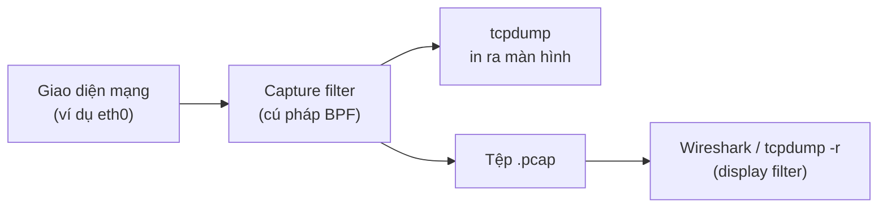

---
tags:
  - Should
  - Lab
  - Linux
  - Troubleshooting
---

# Khi lệnh không đủ để biết chuyện gì xảy ra trên đường truyền, làm sao nhìn thẳng vào gói tin? (Bắt gói tin)

## Metadata

```yaml
Chapter: packet-capture
Phase: 00 — lab-toolkit
Importance: Should
Status: draft
Prerequisites:
  - Phase 00 / 02-linux-network-tools
Used Later:
  - Phase 04 / 01-tcp-handshake-states
Estimated Reading: 20 phút
Estimated Practice: 30 phút
```

## 1. Story

<!-- Mức bắt buộc (Should): Đủ -->
<!-- DRAFT: người học cần viết lại bằng lời mình -->

Đội ứng dụng nói: "Chúng tôi đã gửi yêu cầu tới database, nhưng bị timeout". Đội database nói: "Chúng tôi không thấy yêu cầu nào đến". Cả hai đều dựa vào log của mình và không ai chứng minh được bên kia sai. Cuộc tranh luận kéo dài cả buổi chiều.

Một kỹ sư bắt gói tin ở **hai đầu** và thấy: gói đi ra khỏi máy ứng dụng nhưng không bao giờ xuất hiện ở máy database. Vấn đề nằm giữa hai đầu. Bắt gói tin cho **bằng chứng**, không phải ý kiến. Chapter này dạy cách bắt và đọc gói tin ở mức đủ dùng cho chẩn đoán.

## 2. Objectives

<!-- Mức bắt buộc (Should): Đủ -->
<!-- DRAFT: người học cần viết lại bằng lời mình -->

Sau chapter này bạn có thể:

- Giải thích bắt gói tin là gì và nó thấy được gì, không thấy gì.
- Chạy `tcpdump` với giao diện, bộ lọc và giới hạn số gói phù hợp.
- Đọc một dòng `tcpdump` và nhận ra địa chỉ, cổng và cờ TCP (`S`, `S.`, `.`, `F`, `R`, `P`).
- Phân biệt bộ lọc lúc bắt (capture filter) với bộ lọc lúc xem (display filter).
- Biết nên bắt ở đâu để chứng minh một gói tin có đến hay không, và tránh các rủi ro khi lưu và chia sẻ tệp bắt gói.

## 3. Prerequisites

<!-- Mức bắt buộc (Should): Đủ -->
<!-- DRAFT: người học cần viết lại bằng lời mình -->

> Xem lại: [linux-network-tools](02-linux-network-tools.md)

Bạn cũng cần biết địa chỉ IP, cổng và các lớp mạng ở `01/04`, `01/02` để đọc hiểu kết quả.

## 4. Why it exists

<!-- Mức bắt buộc (Should): Đủ -->
<!-- DRAFT: người học cần viết lại bằng lời mình -->

Các lệnh như `ping`, `curl`, `ss` chỉ cho **kết quả cuối** ("thành công", "timeout"). Khi kết quả mơ hồ, bạn cần xem **từng gói tin** đã xảy ra: gói nào đi, gói nào về, theo thứ tự nào, mang cờ gì. Bắt gói tin ghi lại bản sao các gói đi qua một giao diện mạng để bạn đọc sau.

Nếu không có công cụ này, bạn chỉ có thể đoán nguyên nhân từ log của từng bên, và các bên thường mâu thuẫn nhau (Story).

## 5. Mental model

<!-- Mức bắt buộc (Should): Đủ -->
<!-- DRAFT: người học cần viết lại bằng lời mình -->

Hình dung **camera an ninh ở cửa ra vào** của một tòa nhà. Camera không can thiệp, chỉ ghi lại ai ra vào và lúc nào. Muốn biết một người có vào tòa nhà hay không, bạn xem camera **ở cửa tòa nhà đó**, không xem camera của tòa khác.

**Tóm tắt một câu:** bắt gói tin là ghi lại các gói đi qua một giao diện mạng; chọn đúng giao diện và đúng vị trí thì mới thấy được gói cần tìm.

## 6. How it works

<!-- Mức bắt buộc (Should): Đủ -->
<!-- DRAFT: người học cần viết lại bằng lời mình -->

Các từ cần biết:

- **Packet capture (bắt gói tin — ghi lại bản sao các gói tin đi qua một giao diện mạng để phân tích).**
- **tcpdump (công cụ dòng lệnh để bắt và hiển thị gói tin trên Linux).**
- **Wireshark (công cụ có giao diện đồ họa để mở và phân tích gói tin).**
- **pcap file (tệp bắt gói tin — tệp lưu các gói tin đã bắt, mở lại được bằng tcpdump hoặc Wireshark).**
- **Capture filter (bộ lọc lúc bắt — điều kiện quyết định gói nào được ghi lại; gói không khớp bị bỏ ngay từ đầu).**
- **Display filter (bộ lọc lúc xem — điều kiện chỉ để lọc hiển thị trên dữ liệu đã bắt; không làm mất gói).**

Theo tài liệu của `tcpdump`, công cụ này hiển thị các gói khớp một biểu thức lọc, kèm dấu thời gian, và có thể ghi ra tệp để phân tích sau (`-w`) hoặc đọc lại từ tệp (`-r`). Bộ lọc lúc bắt dùng cú pháp BPF (libpcap), ví dụ `tcp port 80`, `host <địa chỉ>`, `icmp`. Wireshark dùng cùng cú pháp libpcap cho capture filter, và có ngôn ngữ display filter riêng.



**Đọc sơ đồ:** gói tin đi qua giao diện mạng, capture filter loại bớt những gói không cần ngay lúc bắt (giảm tải và dung lượng). Kết quả hoặc in ra màn hình, hoặc lưu vào tệp để xem lại bằng Wireshark. Ở bước xem lại, display filter chỉ ẩn/hiện gói đã có sẵn.

**Một dòng `tcpdump` trông như thế nào:**

```text
12:00:01.000000 IP 10.0.1.20.51514 > 10.0.2.15.8080: Flags [S], seq 1000, win 64240, length 0
```

- `10.0.1.20.51514` là địa chỉ nguồn và cổng nguồn; `10.0.2.15.8080` là địa chỉ và cổng đích.
- `Flags [S]` là cờ TCP: theo `tcpdump`, `S` là SYN, `F` là FIN, `P` là PUSH, `R` là RST, và dấu `.` là ACK. `[S.]` là SYN kèm ACK (SYN-ACK).
- Các cờ này cho bạn xem một kết nối bắt đầu và kết thúc thế nào (chi tiết ở `04/01`).

**Bắt ở đâu?** Chỉ thấy được các gói **đi qua giao diện bạn đang bắt**.

| Câu hỏi | Bắt ở |
|---|---|
| Gói có rời máy A không? | Giao diện của A |
| Gói có đến máy B không? | Giao diện của B |
| Gói bị mất ở giữa? | Bắt cả hai đầu và so sánh |
| Dịch vụ trong container | Bên trong container, hoặc giao diện cầu nối của máy chủ |

**Giới hạn quan trọng:**

- Nội dung được **mã hóa** (TLS, `04/06`) không đọc được dù bắt đủ gói; bạn vẫn thấy địa chỉ, cổng, kích thước và thời gian.
- Bạn chỉ thấy các gói đến giao diện của mình; trong mạng dùng switch, gói của máy khác thường không đến giao diện của bạn (xem `01/03`).
- Đọc giao diện mạng cần đặc quyền; đọc lại từ tệp thì không.

<!-- verified: 2026-10-02 https://www.tcpdump.org/manpages/tcpdump.1.html -->
<!-- verified: 2026-10-02 https://www.wireshark.org/docs/wsug_html_chunked/ChCapCaptureFilterSection.html -->

## 7. Key settings

<!-- Mức bắt buộc (Should): Đủ -->
<!-- DRAFT: người học cần viết lại bằng lời mình -->

| Tùy chọn | Ý nghĩa |
|---|---|
| `-i <giao diện>` | Bắt trên giao diện nào (`any` là mọi giao diện) |
| `-n` / `-nn` | Không đổi IP thành tên / cũng không đổi cổng thành tên (tránh sinh thêm truy vấn DNS làm rối kết quả) |
| `-c <số>` | Dừng sau khi bắt đủ số gói |
| `-w <tệp>` | Ghi ra tệp thay vì in ra màn hình |
| `-r <tệp>` | Đọc lại từ tệp |
| `-X` | Hiện nội dung gói dạng hex và ASCII |
| Biểu thức lọc | `host <IP>`, `tcp port 443`, `icmp`, `not port 22`, nối bằng `and`/`or` |

Ví dụ:

```bash
tcpdump -nn -i any -c 20 'tcp port 8080'
```

**Windows:** cách đơn giản nhất là bắt trong WSL2 hoặc trong container (như các lab ở sách này) rồi mở tệp `.pcap` bằng Wireshark trên Windows. Cài Wireshark và trình điều khiển bắt gói trên Windows có yêu cầu riêng; làm theo tài liệu chính thức của Wireshark `[CHƯA KIỂM CHỨNG]`.

## 8. AWS mapping

<!-- Mức bắt buộc (Should): Tùy chọn -->
<!-- DRAFT: người học cần viết lại bằng lời mình -->

Tùy chọn. Trên AWS, bạn có thể chạy `tcpdump` ngay trên instance (cần quyền root và quy tắc truy cập phù hợp). Công cụ giám sát ở mức luồng như Flow Logs cho biết *kết nối nào bị chấp nhận hoặc từ chối* nhưng không cho thấy nội dung từng gói; sẽ học ở `06/11`. `[CHƯA KIỂM CHỨNG]` — khả năng sao chép lưu lượng của AWS (nếu có) sẽ được kiểm tra khi cần ở Phase 06.

## 9. Hands-on lab

<!-- Mức bắt buộc (Should): Rút gọn -->
<!-- DRAFT: người học cần viết lại bằng lời mình -->

Chi tiết ở `labs/phase-00-lab-toolkit/chapter-03-packet-capture/README.md`.

**1. Predict:** khi một client mở kết nối TCP tới một server thử và gửi một dòng chữ, bạn sẽ thấy những cờ nào theo thứ tự nào?

**2. Run** (trong container, bắt trên giao diện loopback):

```powershell
docker run --rm -it alpine sh
```

Trong container:

```sh
apk add --no-cache tcpdump
(nc -l -p 8080 >/dev/null &)
(tcpdump -nn -i lo -c 10 'tcp port 8080' &)
sleep 1
echo hi | nc -w 2 127.0.0.1 8080
sleep 2
```

**3. Verify:** tìm ba gói đầu tiên (cờ `[S]`, `[S.]`, `[.]`) và gói mang dữ liệu (`[P.]`). Output thật: `[CHƯA CHẠY]`.

## 10. Break it

<!-- Mức bắt buộc (Should): Rút gọn -->
<!-- DRAFT: người học cần viết lại bằng lời mình -->

**Gây lỗi:** bắt trên **sai giao diện**. Vẫn trong container, bắt trên `eth0` trong khi lưu lượng đi qua `lo`:

```sh
(tcpdump -nn -i eth0 -c 5 'tcp port 8080' &)
sleep 1
echo hi | nc -w 2 127.0.0.1 8080
sleep 3
```

**Dự đoán:** không bắt được gói nào (tcpdump không in dòng gói nào và cuối cùng báo 0 gói được bắt), dù kết nối vẫn xảy ra.

**Ý nghĩa:** "không thấy gói" chưa chứng minh gói không tồn tại; có thể bạn đang bắt sai chỗ.

**Khôi phục:** `exit`; container `--rm` tự xóa. Chạy lại với `-i lo` hoặc `-i any` để thấy gói.

Kết quả thật: `[CHƯA CHẠY]`.

## 11. Troubleshooting

<!-- Mức bắt buộc (Should): Rút gọn -->
<!-- DRAFT: người học cần viết lại bằng lời mình -->

| Triệu chứng | Kiểm tra theo thứ tự | Công cụ |
|---|---|---|
| Không bắt được gói nào | Đúng giao diện chưa → bộ lọc có quá chặt không → có quyền chưa → lưu lượng có thực sự đi qua đó không | `-i any`, bỏ bộ lọc, chạy với quyền phù hợp |
| Quá nhiều gói, khó đọc | Thêm capture filter theo host/cổng/giao thức; dùng `-c` | `tcpdump ... 'host X and tcp port Y'` |
| Cột địa chỉ toàn tên miền, chậm | Đang phân giải tên | Thêm `-nn` |
| Thấy gói đi nhưng không thấy trả lời | Bắt ở đầu bên kia để xem gói có tới không | Bắt cả hai đầu |
| Không đọc được nội dung | Có mã hóa (TLS) | Chỉ phân tích địa chỉ/cổng/cờ/thời gian |
| Tệp `.pcap` quá lớn | Giới hạn số gói/thời gian, dùng bộ lọc | `-c`, `-w` kèm bộ lọc |

Ghi kết quả thật của mục 10: `[CHƯA CHẠY]`.

## 12. Security & cost

<!-- Mức bắt buộc (Should): Đủ -->
<!-- DRAFT: người học cần viết lại bằng lời mình -->

- **Tệp bắt gói chứa dữ liệu nhạy cảm:** với giao thức không mã hóa, mật khẩu, token, thông tin cá nhân nằm nguyên văn trong gói. Chỉ bắt ở nơi bạn **được phép**, bảo vệ tệp, xóa khi xong, và **không commit `.pcap` vào repo** (đã thêm `*.pcap`, `*.pcapng` vào `.gitignore`).
- Khi chia sẻ tệp để nhờ phân tích, che hoặc thay IP, tên máy, token thật.
- Bắt gói trên mạng của người khác, hoặc nghe lén lưu lượng không thuộc về bạn, có thể vi phạm chính sách và pháp luật.
- Bắt gói tốn CPU và đĩa trên hệ thống đang chạy; giới hạn bằng `-c` và bộ lọc, và cẩn thận khi bắt trên server production.
- Chi phí: local nên không phát sinh; trên đám mây, tệp lớn tốn dung lượng lưu trữ.

## 13. Misconceptions

<!-- Mức bắt buộc (Should): Đủ -->
<!-- DRAFT: người học cần viết lại bằng lời mình -->

| Hiểu nhầm | Sự thật |
|---|---|
| "Bắt gói thấy mọi lưu lượng trong mạng" | Chỉ thấy gói đi qua giao diện bạn đang bắt |
| "Bắt gói giải mã được HTTPS" | Không; chỉ thấy phần mã hóa (cùng địa chỉ, cổng, kích thước, thời gian) |
| "Không thấy gói nghĩa là gói không tồn tại" | Có thể bắt sai giao diện, bộ lọc quá chặt, hoặc thiếu quyền |
| "Display filter và capture filter giống nhau" | Capture filter loại gói ngay lúc bắt; display filter chỉ ẩn/hiện dữ liệu đã bắt |
| "Dấu `.` trong cờ nghĩa là không có gì" | `.` là cờ ACK (theo tcpdump) |

## 14. Interview questions

<!-- Mức bắt buộc (Should): Đủ -->
<!-- DRAFT: người học cần viết lại bằng lời mình -->

### Q1 (Junior) — Capture filter khác display filter thế nào?

**Gợi ý ý chính:**
- Gói không khớp bị làm gì ở mỗi loại?
- Loại nào giúp giảm dung lượng tệp?

??? success "Đáp án mẫu (tự trả lời trước khi mở)"
    Capture filter (cú pháp BPF) loại gói ngay lúc bắt nên gói không khớp không được lưu; display filter chỉ lọc hiển thị trên dữ liệu đã bắt. Capture filter giúp giảm tải và dung lượng.

### Q2 (Middle) — Bên A nói đã gửi, bên B nói chưa nhận. Bạn làm gì để phân xử?

**Gợi ý ý chính:**
- Bắt ở những đâu?
- So sánh gì giữa các bản bắt?

??? success "Đáp án mẫu (tự trả lời trước khi mở)"
    Bắt gói ở cả hai đầu cùng một khoảng thời gian rồi so sánh: nếu gói xuất hiện ở A nhưng không ở B thì mất ở giữa (route, firewall...); nếu cả hai đều thấy thì vấn đề nằm ở ứng dụng phía B.

## 15. Exercises

<!-- Mức bắt buộc (Should): Đủ -->
<!-- DRAFT: người học cần viết lại bằng lời mình -->

1. **Đọc một dòng.** *Deliverable:* chú thích từng phần của một dòng `tcpdump` bạn bắt được (đã thay IP thật bằng IP giả): thời gian, nguồn, đích, cờ.
2. **Chọn bộ lọc.** Viết biểu thức capture filter cho: (a) chỉ lưu lượng tới `192.0.2.10`; (b) chỉ TCP cổng 443; (c) mọi thứ trừ SSH. *Deliverable:* ba biểu thức và mô tả mỗi cái bắt gì.
3. **Kế hoạch phân xử Story.** *Deliverable:* kế hoạch bắt gói hai đầu (lệnh và bộ lọc cho mỗi đầu) và cách đọc kết quả.

## 16. Cheat sheet

<!-- Mức bắt buộc (Should): Đủ -->
<!-- DRAFT: người học cần viết lại bằng lời mình -->

| Việc | Lệnh |
|---|---|
| Bắt có giới hạn | `tcpdump -nn -i any -c 20 '<bộ lọc>'` |
| Lọc theo host / cổng / giao thức | `host X`, `tcp port N`, `icmp` |
| Ghi / đọc tệp | `-w file.pcap` / `-r file.pcap` |
| Cờ TCP | `S` SYN, `S.` SYN-ACK, `.` ACK, `P` PUSH, `F` FIN, `R` RST |

**Nhớ:** chọn đúng giao diện và vị trí; mã hóa thì không đọc được nội dung; không commit `.pcap`.

## 17. Glossary terms

<!-- Mức bắt buộc (Should): Đủ -->
<!-- DRAFT: người học cần viết lại bằng lời mình -->

- Packet capture / bắt gói tin / パケットキャプチャ
- tcpdump / công cụ bắt gói dòng lệnh / tcpdump
- Wireshark / công cụ phân tích gói đồ họa / Wireshark
- pcap file / tệp bắt gói tin / pcapファイル
- Capture filter / bộ lọc lúc bắt / キャプチャフィルタ
- Display filter / bộ lọc lúc xem / 表示フィルタ

## 18. Further reading

<!-- Mức bắt buộc (Should): Đủ -->
<!-- DRAFT: người học cần viết lại bằng lời mình -->

Kiểm tra ngày 2026-10-02:

- `tcpdump(1)`: https://www.tcpdump.org/manpages/tcpdump.1.html
- Wireshark User's Guide — Capture filters: https://www.wireshark.org/docs/wsug_html_chunked/ChCapCaptureFilterSection.html
