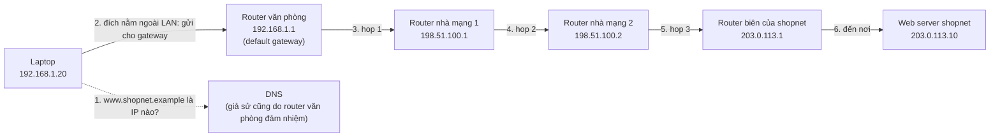

---
tags:
  - Must
  - IP
  - Concept
  - Troubleshooting
---

# Một gói tin đi từ máy bạn đến server qua những chặng nào?

## Metadata

```yaml
Chapter: packet-journey
Phase: 01 — foundation
Importance: Must
Status: reviewed
Prerequisites: []
Used Later:
  - Phase 01 / 02-osi-vs-tcpip
Estimated Reading: 20 phút
Estimated Practice: 30 phút
```

## 1. Story

<!-- Mức bắt buộc (Must): Đủ -->
<!-- DRAFT: người học cần viết lại bằng lời mình -->

Chiều thứ Sáu, bạn mở `www.shopnet.example` để kiểm tra một đơn hàng. Trình duyệt quay mãi rồi báo "không thể kết nối". Đồng nghiệp ngồi cạnh mở cùng trang đó vẫn vào được.

Bạn có ít nhất năm nghi ngờ: máy của mình, dây mạng hoặc Wi-Fi, router trong văn phòng, đường ra Internet, hoặc chính server. Nếu chỉ nghĩ "mạng bị lỗi" thì bạn không biết bắt đầu kiểm tra từ đâu. Nếu biết dữ liệu **đi qua những chặng nào**, bạn kiểm tra từng chặng và khoanh vùng lỗi trong vài phút.

Chapter này vẽ ra bản đồ đó. Đây là chapter mở đầu của cả sách: mọi chapter sau đều là phóng to một chặng trên bản đồ này.

## 2. Objectives

<!-- Mức bắt buộc (Must): Đủ -->
<!-- DRAFT: người học cần viết lại bằng lời mình -->

Sau chapter này bạn có thể:

- Liệt kê được các chặng chính từ laptop đến một web server và nói mỗi chặng làm việc gì.
- Giải thích được vì sao máy của bạn gửi gói tin ra ngoài **qua default gateway** chứ không gửi thẳng đến server.
- Đọc được kết quả `tracert`/`traceroute` và nói chặng nào đang trả lời, chặng nào im lặng.
- Dự đoán đúng hop đầu tiên của `tracert` trên máy mình, rồi chạy lệnh để đối chiếu.
- Phân biệt được "không có đường đi" với "có đường đi nhưng không có ai trả lời" khi chẩn đoán.

## 3. Prerequisites

<!-- Mức bắt buộc (Must): Đủ -->
<!-- DRAFT: người học cần viết lại bằng lời mình -->

Không có chapter nào cần học trước. Bạn chỉ cần biết dùng trình duyệt và mở được `cmd` hoặc PowerShell.

Một số khái niệm ở đây chỉ được giới thiệu để có bản đồ tổng thể; phần giải thích sâu nằm ở chapter sau (xem mục [Used Later](#metadata)).

## 4. Why it exists

<!-- Mức bắt buộc (Must): Đủ -->
<!-- DRAFT: người học cần viết lại bằng lời mình -->

Hai máy tính ở xa nhau không có dây nối trực tiếp. Giữa chúng là hàng loạt thiết bị của nhiều bên khác nhau: router nhà bạn, nhà mạng, các đường trục Internet, rồi mạng của chính công ty chạy server.

Cần một quy tắc chung để dữ liệu **tìm được đường**: gửi đi đâu, ai chuyển tiếp, khi nào thì bỏ cuộc. Quy tắc đó chính là cách các gói tin được đánh địa chỉ và chuyển tiếp từng chặng một.

Nếu bạn không nắm hành trình này:

- Bạn sẽ chỉ biết nói "mạng chậm" hoặc "mạng hỏng" mà không biết chặng nào.
- Bạn không hiểu vì sao lỗi ở router này làm hỏng một dịch vụ nhưng không làm hỏng dịch vụ khác.
- Các chapter sau (subnet, routing, NAT, DNS, Security Group, VPC…) sẽ như những mảnh rời, vì bạn chưa biết chúng nằm ở chặng nào.

## 5. Mental model

<!-- Mức bắt buộc (Must): Đủ -->
<!-- DRAFT: người học cần viết lại bằng lời mình -->

Hình dung việc gửi một bưu kiện. Bạn không mang bưu kiện đến tận nhà người nhận. Bạn đưa nó cho bưu cục gần nhà (đây là **default gateway**). Bưu cục không biết nhà người nhận, nhưng biết "bưu kiện đi hướng này thì gửi cho trạm kế tiếp". Mỗi trạm làm lại điều đó cho đến khi bưu kiện tới nơi.

Điểm ví von này chỉ đúng một nửa: bưu kiện có thể mất ngẫu nhiên, và mỗi trạm có thể chọn đường khác nhau. Mạng IP cũng vậy.

**Tóm tắt một câu:** mỗi thiết bị trên đường chỉ biết "nhìn địa chỉ đích rồi chuyển cho chặng kế tiếp", và hành trình là tổng của nhiều quyết định nhỏ như vậy.

## 6. How it works

<!-- Mức bắt buộc (Must): Đủ -->
<!-- DRAFT: người học cần viết lại bằng lời mình -->

Một vài từ cần biết trước khi xem sơ đồ:

- **Packet (gói tin — một mẩu dữ liệu được đóng gói kèm địa chỉ người gửi và người nhận, để gửi đi qua mạng).**
- **IP address (địa chỉ IP — dãy số dùng làm địa chỉ của một máy trên mạng, ví dụ `192.168.1.20`).**
- **LAN (mạng cục bộ — các máy nối chung một router hoặc switch trong nhà hay văn phòng).**
- **Router (bộ định tuyến — thiết bị nhận gói tin rồi chuyển nó đến chặng kế tiếp theo địa chỉ đích).**
- **Default gateway (cổng mặc định — router mà máy bạn gửi mọi gói tin có đích nằm ngoài LAN).**
- **Hop (chặng — mỗi lần gói tin đi qua một router trên đường đi).**
- **TTL (Time To Live — số chặng tối đa còn lại, mỗi router trừ đi 1; về 0 thì gói tin bị bỏ).**
- **DNS (hệ thống tên miền — "danh bạ" đổi tên như `www.shopnet.example` thành địa chỉ IP).**



Các địa chỉ trong sơ đồ là địa chỉ giả (dải `192.168.x.x` là private, `198.51.100.x` và `203.0.113.x` là dải dành riêng cho tài liệu).

**Đọc sơ đồ theo thứ tự:**

1. **Hỏi tên (DNS).** Laptop chỉ biết tên `www.shopnet.example`, nhưng gói tin cần địa chỉ IP. Nên bước đầu tiên là hỏi DNS "tên này ứng với IP nào?". Nếu bước này hỏng, bạn thấy lỗi kiểu "không tìm thấy máy chủ" dù đường mạng vẫn tốt. (Chi tiết ở `03/02`.)
2. **Gửi cho gateway.** Laptop so địa chỉ đích (`203.0.113.10`) với LAN của mình (`192.168.1.x`) và thấy đích ở ngoài. Nó không tự biết đường đi, nên đưa gói tin cho default gateway. (Bảng quyết định này chính là routing table, ở `02/01`.)
3. **Chuyển tiếp từng chặng.** Mỗi router nhìn địa chỉ đích, chọn router kế tiếp, **trừ TTL đi 1** rồi gửi đi. Nếu TTL về 0, router bỏ gói tin và báo ngược lại cho người gửi. Cơ chế này ngăn gói tin quay vòng vô hạn khi cấu hình sai, và `traceroute` dùng nó để liệt kê các chặng (xem mục 9).
4. **Đến nơi và quay về.** Server nhận gói tin, rồi gửi gói trả lời đi theo đường ngược lại. Đường về **không bắt buộc** giống đường đi. (Chi tiết ở `02/06`.)

**Hai chi tiết thực tế cần nhớ sớm:**

- Ở nhà hoặc văn phòng nhỏ, router thường **đổi địa chỉ nguồn** `192.168.1.20` thành một địa chỉ công khai trước khi gói tin ra Internet (gọi là NAT, học ở `02/05`). Vì thế server thấy địa chỉ công khai của router chứ không thấy laptop của bạn.
- Giữa hai chặng liền kề còn một lớp địa chỉ nữa (địa chỉ phần cứng của card mạng). Nó đổi ở mỗi chặng, còn địa chỉ IP đích thì giữ nguyên. Phần này học ở `01/03`; bản đồ tổng thể ở `01/02`.

> Xem thêm sau: [OSI vs TCP/IP](02-osi-vs-tcpip.md).

## 7. Key settings

<!-- Mức bắt buộc (Must): Đủ -->
<!-- DRAFT: người học cần viết lại bằng lời mình -->

Ba thông số mà mọi máy phải có để tham gia hành trình trên, và bạn cần xem được trên máy mình:

| Thông số | Ý nghĩa | Nếu thiếu hoặc sai |
|---|---|---|
| Địa chỉ IP của máy | "Địa chỉ nhà" của máy trên LAN | Máy không có danh tính, không gửi/nhận được |
| Default gateway | Router nhận mọi gói tin đi ra ngoài LAN | Truy cập được máy trong LAN nhưng không ra được ngoài |
| DNS server | Nơi hỏi "tên → IP" | Gõ IP thì vào được, gõ tên thì không |

Xem trên máy Windows:

```powershell
Get-NetIPConfiguration
```

Hoặc trong `cmd`:

```cmd
ipconfig /all
```

Trên Linux hoặc WSL2:

```bash
ip route show default
```

Bạn sẽ thấy dòng default gateway. Giá trị này (và cách máy bạn nhận nó) được giải thích ở `03/01` (DHCP) và `02/03` (default route).

## 8. AWS mapping

<!-- Mức bắt buộc (Must): Đủ nếu có liên quan AWS -->
<!-- DRAFT: người học cần viết lại bằng lời mình -->

Chapter này chưa đi vào AWS. Bạn chỉ cần biết sơ đồ ở mục 6 sẽ quay lại ở Phase 06, nơi mỗi chặng có một "bản sao" trên AWS:

| Chặng trong chapter này | Tương ứng trên AWS (dự kiến) |
|---|---|
| Default gateway của máy | Route table của subnet, route `0.0.0.0/0` trỏ đến thiết bị ra ngoài |
| Router/cửa ra Internet | Internet Gateway hoặc NAT Gateway |
| Web server | EC2 hoặc container phía sau Load Balancer |

`[CHƯA KIỂM CHỨNG]` — phần đối chiếu này là định hướng, chưa được kiểm tra với tài liệu AWS hiện tại. Chi tiết và kiểm chứng sẽ ở `06/02`.

## 9. Hands-on lab

<!-- Mức bắt buộc (Must): Đủ + expected-output.txt -->
<!-- DRAFT: người học cần viết lại bằng lời mình -->

Lab đầy đủ nằm ở `labs/phase-01-foundation/chapter-01-packet-journey/README.md` (trong repo, không nằm trên site). Tóm tắt:

**1. Predict (ghi ra giấy trước khi chạy):**

- Default gateway trên máy bạn là địa chỉ nào?
- Hop số 1 của `tracert` đến `example.com` sẽ là địa chỉ nào?
- Khoảng bao nhiêu hop để đến `example.com` (chọn một khoảng, ví dụ 5–10, 10–20, hơn 20)?

**2. Run:**

```powershell
Get-NetIPConfiguration
```

```cmd
tracert -d example.com
```

Trên Linux hoặc WSL2 dùng `traceroute -n example.com`.

**3. Verify:** hop 1 có trùng default gateway không? Hop nào có `*`? Tổng số hop so với dự đoán thế nào?

Theo tài liệu của Microsoft, `tracert` gửi ICMP echo với TTL tăng dần 1, 2, 3…, mỗi router làm TTL về 0 sẽ trả về thông báo "Time Exceeded", và tham số `-d` bỏ qua việc đổi IP thành tên để chạy nhanh hơn; mặc định tối đa 30 hop. Trên Linux, `traceroute` mặc định gửi gói UDP chứ không phải ICMP echo, nhưng cách dùng TTL giống nhau.
<!-- verified: 2026-10-02 https://learn.microsoft.com/en-us/windows-server/administration/windows-commands/tracert -->
<!-- verified: 2026-10-02 https://www.rfc-editor.org/rfc/rfc792 -->

**Output thật:** `[CHƯA CHẠY]` — người học chạy và dán vào `expected-output.txt` sau khi thay IP thật bằng IP giả (xem README của lab). Không đưa IP thật vào repo.

## 10. Break it

<!-- Mức bắt buộc (Must): Đủ (≥ 1 Break it) -->
<!-- DRAFT: người học cần viết lại bằng lời mình -->

Mục tiêu: thấy hai kiểu lỗi trông giống nhau nhưng khác nguyên nhân — **"không có đường đi"** và **"có đường đi nhưng không ai trả lời"**.

Làm trong một container tạm thời để không đụng cấu hình mạng thật của máy bạn. Cần Docker (lab này cần WSL2 hoặc Docker Desktop; Phase 00 sẽ hướng dẫn cài).

```bash
docker run --rm -it --cap-add NET_ADMIN alpine sh
```

Trong container, `192.0.2.1` là địa chỉ thuộc dải dành riêng cho tài liệu, nên sẽ không có máy nào trả lời. Chạy lần lượt:

```sh
ip route
ping -c 1 -W 2 192.0.2.1
ip route del default
ping -c 1 -W 2 192.0.2.1
```

**Dự đoán:**

- Lần ping thứ nhất: gói tin đi qua gateway, nhưng không ai trả lời → báo mất gói/timeout sau vài giây.
- Sau khi xóa default route: máy không biết gửi gói đi đâu → báo ngay "Network is unreachable" (không chờ timeout).

Thông báo chính xác có thể khác nhau tùy phiên bản; điều cần quan sát là **báo ngay** so với **chờ rồi báo timeout**.

**Khôi phục:** gõ `exit`. Container dùng `--rm` nên tự bị xóa, không để lại thay đổi nào.

Kết quả thật: `[CHƯA CHẠY]` — ghi lại vào mục 11 sau khi bạn chạy.

## 11. Troubleshooting

<!-- Mức bắt buộc (Must): Đủ -->
<!-- DRAFT: người học cần viết lại bằng lời mình -->

Triệu chứng: **một trang web không mở được từ máy của bạn.** Kiểm tra theo thứ tự từ gần đến xa, vì chặng nào im lặng đầu tiên sẽ cho biết lỗi nằm ở đâu:

| Bước | Kiểm tra | Công cụ | Nếu hỏng thì nghi |
|---|---|---|---|
| 1 | Máy có IP và default gateway chưa? | `ipconfig /all`, `ip route` | Máy chưa nối mạng; chưa nhận được địa chỉ |
| 2 | Có ping được gateway không? | `ping <gateway>` | Lỗi trong LAN, dây/Wi-Fi |
| 3 | Có ping được một IP ngoài Internet không? | `ping <IP công khai>` | Router/nhà mạng, hoặc không có đường ra |
| 4 | Tên có đổi được thành IP không? | `nslookup <tên>` | DNS (xem `03/02`) |
| 5 | Dừng ở chặng nào? | `tracert -d <đích>` | Chặng đầu tiên mà `*` kéo dài đến hết |
| 6 | Cổng/dịch vụ của server có mở không? | (học ở Phase 04) | Server hoặc firewall |

Phân biệt hai kiểu thất bại (từ mục 10):

- **Báo ngay "unreachable":** máy bạn (hoặc một router) không có route cho đích đó → xem route table.
- **Chờ rồi timeout:** gói tin đã đi ra nhưng không có hồi âm → nghi firewall, đích không tồn tại, hoặc đường về hỏng.

Ghi kết quả thật của mục 10 vào đây sau khi chạy: `[CHƯA CHẠY]`.

## 12. Security & cost

<!-- Mức bắt buộc (Must): Đủ -->
<!-- DRAFT: người học cần viết lại bằng lời mình -->

- **Bảo mật:** kết quả `traceroute` tiết lộ địa chỉ các router trên đường đi, nên đừng dán vào chat công khai, ticket công khai hay repo. Khi viết tài liệu, thay IP thật bằng IP giả (`10.0.x.x`, `192.0.2.x`, `203.0.113.x`).
- **Bảo mật:** nhiều mạng chặn hoặc giới hạn ICMP; thấy `*` không có nghĩa là mạng hỏng (xem mục 13).
- **Chi phí:** lab trong chapter này chạy hoàn toàn trên máy bạn và không tạo tài nguyên AWS, nên **không phát sinh chi phí**.

## 13. Misconceptions

<!-- Mức bắt buộc (Must): Đủ -->
<!-- DRAFT: người học cần viết lại bằng lời mình -->

| Hiểu nhầm | Sự thật |
|---|---|
| "Gói tin đi thẳng từ máy mình đến server" | Nó đi qua nhiều router; máy bạn chỉ biết gửi cho default gateway |
| "`tracert` hiện `*` nghĩa là hỏng ở chặng đó" | Một số router không trả lời thông báo hết TTL hoặc bị firewall chặn; chặng sau vẫn có thể trả lời bình thường |
| "Lần nào cũng đi cùng một đường" | Mỗi router tự chọn chặng kế tiếp; đường đi có thể đổi, và đường về có thể khác đường đi |
| "Địa chỉ đích đổi ở mỗi chặng" | Địa chỉ IP đích giữ nguyên (trừ khi có NAT hoặc proxy); thứ đổi ở mỗi chặng là địa chỉ lớp liên kết (học ở `01/03`) |
| "Ping được nghĩa là dịch vụ chạy tốt" | Ping chỉ cho biết đích trả lời ICMP; cổng của ứng dụng có thể vẫn đóng |

## 14. Interview questions

<!-- Mức bắt buộc (Must): Đủ -->
<!-- DRAFT: người học cần viết lại bằng lời mình -->

Tự trả lời trước, chỉ mở đáp án để đối chiếu.

### Q1 (Junior) — Điều gì xảy ra từ lúc bạn gõ một URL đến lúc trang hiện lên? (mức tổng quát)

**Gợi ý ý chính:**
- Máy cần biết gì trước khi gửi bất cứ thứ gì?
- Gói tin đầu tiên rời khỏi máy bạn đi đâu?
- Có bao nhiêu thiết bị "chuyển tiếp" ở giữa?

??? success "Đáp án mẫu (tự trả lời trước khi mở)"
    1. Trình duyệt đổi tên miền thành địa chỉ IP bằng DNS.
    2. Máy so địa chỉ đích với LAN của mình; thấy ở ngoài nên gửi gói tin cho default gateway.
    3. Các router trên đường chuyển tiếp từng chặng theo địa chỉ đích, trừ TTL mỗi chặng.
    4. Server nhận yêu cầu và gửi trả lời ngược về.
    5. (Các bước kết nối và mã hóa ở tầng cao hơn sẽ học ở Phase 04.)

### Q2 (Junior) — TTL dùng để làm gì?

**Gợi ý ý chính:**
- Chuyện gì xảy ra nếu hai router chỉ nhau chuyển qua chuyển lại?
- Ai biết TTL về 0, và họ làm gì?

??? success "Đáp án mẫu (tự trả lời trước khi mở)"
    TTL giới hạn số chặng của một gói tin. Mỗi router trừ 1; về 0 thì bị bỏ và router có thể báo "Time Exceeded" cho người gửi. Nhờ vậy gói tin không quay vòng mãi khi cấu hình sai, và `traceroute` tận dụng cơ chế này để liệt kê các chặng.

### Q3 (Middle) — `tracert` hiện `* * *` ở giữa đường nhưng chặng cuối vẫn trả lời. Điều đó nói gì?

**Gợi ý ý chính:**
- Gói tin của bạn có đi qua chặng đó không?
- Router có bắt buộc trả lời thông báo hết TTL không?

??? success "Đáp án mẫu (tự trả lời trước khi mở)"
    Gói tin vẫn đi qua chặng đó (vì chặng sau trả lời được). Router đó chỉ không trả hoặc bị chặn thông báo hết TTL, nên không phải bằng chứng của lỗi. Chỉ đáng lo khi các chặng từ đó trở đi đều là `*` và đích không trả lời.

### Q4 (Middle) — Ping được gateway nhưng không ping được một IP công khai. Bạn nghĩ đến đâu?

**Gợi ý ý chính:**
- Lỗi nằm trong LAN hay ngoài LAN?
- Máy bạn hay router mới là nơi thiếu thông tin về đường đi?

??? success "Đáp án mẫu (tự trả lời trước khi mở)"
    LAN và gateway ổn, nên nghi từ gateway trở ra: router không có đường ra Internet, nhà mạng gặp sự cố, hoặc có thiết bị chặn. Dùng `tracert -d` để xem chặng nào đầu tiên im lặng; kiểm tra thêm route của router.

## 15. Exercises

<!-- Mức bắt buộc (Must): Đủ -->
<!-- DRAFT: người học cần viết lại bằng lời mình -->

1. **Vẽ hành trình của bạn.** Chạy `tracert -d example.com`, thay mọi IP thật bằng IP giả, rồi vẽ lại thành sơ đồ Mermaid giống mục 6 (có chú thích từng chặng). *Deliverable:* một khối Mermaid kèm đoạn giải thích 3–5 câu.
2. **Hai đích, hai đường.** Chạy `tracert -d` đến hai đích khác nhau. *Deliverable:* bảng so sánh số hop và hop đầu tiên, kèm 2–3 câu giải thích vì sao khác hoặc giống.
3. **Ba tình huống.** Với mỗi tình huống: (a) ping gateway thành công nhưng không ping được IP công khai; (b) `tracert` dừng ngay hop 1; (c) gõ IP vào được, gõ tên không vào được. *Deliverable:* bảng 3 dòng gồm "nghi chặng nào" và "lệnh kiểm tra tiếp theo".

## 16. Cheat sheet

<!-- Mức bắt buộc (Must): Đủ -->
<!-- DRAFT: người học cần viết lại bằng lời mình -->

| Cần làm | Windows (`cmd`/PowerShell) | Linux / WSL2 |
|---|---|---|
| Xem IP, gateway, DNS | `ipconfig /all` hoặc `Get-NetIPConfiguration` | `ip addr`, `ip route show default` |
| Kiểm tra gateway/đích | `ping -n 4 <đích>` | `ping -c 4 <đích>` |
| Liệt kê các chặng | `tracert -d <đích>` | `traceroute -n <đích>` |
| Đổi tên thành IP | `nslookup <tên>` | `dig <tên>` |

**Hành trình:** hỏi DNS → gửi cho default gateway → các router chuyển tiếp (TTL −1 mỗi chặng) → server → đường về.
**Thứ tự debug:** IP/gateway → ping gateway → ping IP công khai → DNS → tracert.

## 17. Glossary terms

<!-- Mức bắt buộc (Must): Đủ -->
<!-- DRAFT: người học cần viết lại bằng lời mình -->

- Packet / gói tin / パケット
- IP address / địa chỉ IP / IPアドレス
- LAN / mạng cục bộ / ローカルネットワーク
- Router / bộ định tuyến / ルーター
- Default gateway / cổng mặc định / デフォルトゲートウェイ
- Hop / chặng / ホップ
- TTL / thời gian sống / 生存時間
- DNS / hệ thống tên miền / DNS（名前解決）

## 18. Further reading

<!-- Mức bắt buộc (Must): Đủ -->
<!-- DRAFT: người học cần viết lại bằng lời mình -->

Kiểm tra ngày 2026-10-02:

- RFC 791 — Internet Protocol: https://www.rfc-editor.org/rfc/rfc791 (định nghĩa trường TTL).
- RFC 792 — Internet Control Message Protocol: https://www.rfc-editor.org/rfc/rfc792 (thông báo "Time Exceeded").
- Tài liệu lệnh `tracert` của Microsoft: https://learn.microsoft.com/en-us/windows-server/administration/windows-commands/tracert
