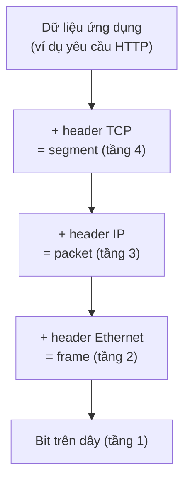

---
tags:
  - Must
  - Concept
  - Troubleshooting
---

# Vì sao mạng được chia thành các tầng, và lỗi ở tầng nào thì triệu chứng ra sao? (OSI và TCP/IP)

## Metadata

```yaml
Chapter: osi-vs-tcpip
Phase: 01 — foundation
Importance: Must
Status: draft
Prerequisites:
  - Phase 01 / 01-packet-journey
Used Later:
  - Phase 01 / 03-ethernet-mac-arp
  - Phase 01 / 04-ipv4-addressing
  - Phase 04 / 01-tcp-handshake-states
  - Phase 04 / 03-udp
  - Phase 08 / 01-troubleshooting-methodology-layered
Estimated Reading: 25 phút
Estimated Practice: 30 phút
```

## 1. Story

<!-- Mức bắt buộc (Must): Đủ -->
<!-- DRAFT: người học cần viết lại bằng lời mình -->

Trong cuộc họp xử lý sự cố, ba người cùng nói về "lỗi mạng" nhưng nói ba chuyện khác nhau. Người thứ nhất nghi dây cáp lỏng. Người thứ hai nói "DNS trả sai". Người thứ ba bảo "firewall chặn cổng 443". Cả ba đều có thể đúng, nhưng không ai biết mình đang nói về chặng nào của hành trình gói tin, và cuộc họp kéo dài một tiếng.

Mô hình tầng cho cả nhóm **một ngôn ngữ chung**: "ping được nhưng không vào được web" nghĩa là tầng thấp ổn, nghi tầng cao. Chapter này dạy ngôn ngữ đó, dựa trên hành trình ở `01/01`.

## 2. Objectives

<!-- Mức bắt buộc (Must): Đủ -->
<!-- DRAFT: người học cần viết lại bằng lời mình -->

Sau chapter này bạn có thể:

- Liệt kê được các tầng của mô hình OSI (7 tầng) và TCP/IP (4 tầng) và nói tầng nào làm việc gì.
- Mô tả quá trình đóng gói dữ liệu (encapsulation) từ ứng dụng đến dây mạng, và tên gọi của đơn vị dữ liệu ở mỗi tầng.
- Xếp được giao thức và công cụ quen thuộc (Ethernet, IP, ICMP, TCP, UDP, DNS, HTTP, `ping`, `curl`…) vào đúng tầng.
- Giải thích được điều gì thay đổi và điều gì giữ nguyên khi gói tin đi qua một router.
- Chẩn đoán theo tầng: từ triệu chứng suy ra tầng nghi ngờ và lệnh kiểm tra tiếp theo.

## 3. Prerequisites

<!-- Mức bắt buộc (Must): Đủ -->
<!-- DRAFT: người học cần viết lại bằng lời mình -->

> Xem lại: [packet-journey](01-packet-journey.md)

## 4. Why it exists

<!-- Mức bắt buộc (Must): Đủ -->
<!-- DRAFT: người học cần viết lại bằng lời mình -->

Truyền dữ liệu qua mạng là một bài toán rất lớn: đường dây vật lý, gửi trong cùng mạng, tìm đường qua nhiều mạng, truyền tin cậy, rồi mới đến ứng dụng. Nếu nhồi mọi thứ vào một khối, thay đổi một chỗ (ví dụ đổi Wi-Fi thành cáp) sẽ làm hỏng mọi thứ khác.

Cách giải quyết: **chia thành các tầng**. Mỗi tầng chỉ giải một bài toán, chỉ nói chuyện với tầng ngay trên và ngay dưới, và có thể được thay thế mà không phá tầng khác. Trình duyệt không cần biết bạn dùng cáp hay Wi-Fi; Wi-Fi không cần biết bạn đang xem web hay gửi mail.

Hệ quả khi không hiểu tầng: bạn khó chẩn đoán (không biết nên kiểm tra thứ gì trước), và dễ nhầm tầng của vấn đề, ví dụ nghi "DNS hỏng" trong khi đường truyền đang rớt.

## 5. Mental model

<!-- Mức bắt buộc (Must): Đủ -->
<!-- DRAFT: người học cần viết lại bằng lời mình -->

Hình dung gửi một lá thư qua nhiều lớp phong bì: nội dung thư (ứng dụng) được cho vào phong bì ghi địa chỉ nhà người nhận (IP), rồi phong bì đó được xếp vào thùng của xe giao hàng trong từng khu (địa chỉ phần cứng). Mỗi bên trên đường chỉ mở và đọc **lớp của mình**; người đưa thư không đọc nội dung thư.

**Tóm tắt một câu:** mỗi tầng thêm một "phong bì" riêng khi gửi và bóc nó ra khi nhận, và chẩn đoán là hỏi từng tầng từ dưới lên.

## 6. How it works

<!-- Mức bắt buộc (Must): Đủ -->
<!-- DRAFT: người học cần viết lại bằng lời mình -->

Các từ cần biết:

- **Protocol (giao thức — bộ quy tắc mà hai bên cùng tuân theo để nói chuyện, ví dụ quy tắc về dạng gói tin và thứ tự trao đổi).**
- **Layer (tầng — một nhóm chức năng giải một phần của bài toán truyền dữ liệu).**
- **OSI model (mô hình OSI — mô hình tham chiếu chia truyền thông mạng thành 7 tầng, dùng làm "ngôn ngữ chung" khi nói về mạng).**
- **TCP/IP model (mô hình TCP/IP — mô hình 4 tầng mô tả cách Internet thực sự vận hành).**
- **Header (phần đầu — thông tin điều khiển mà mỗi tầng thêm vào trước dữ liệu, như địa chỉ và loại nội dung).**
- **Encapsulation (đóng gói — việc mỗi tầng bọc dữ liệu của tầng trên bằng header của mình).**
- **Segment (đoạn — đơn vị dữ liệu ở tầng vận chuyển, bọc bởi header TCP; ở UDP thường gọi là datagram).**
- **Frame (khung — đơn vị dữ liệu ở tầng liên kết, bọc bởi header của đường truyền, ví dụ Ethernet).**

**Hai mô hình.** Mô hình OSI có 7 tầng; mô hình TCP/IP có 4 tầng (theo RFC 1122: Link, Internet, Transport, Application). Cách ghép:

| Tầng OSI | Tên | Tầng TCP/IP | Đơn vị dữ liệu | Ví dụ |
|---|---|---|---|---|
| 7 | Application (ứng dụng) | Application | Dữ liệu | HTTP, DNS, DHCP |
| 6 | Presentation (trình bày) | Application | Dữ liệu | Mã hóa, định dạng |
| 5 | Session (phiên) | Application | Dữ liệu | Quản lý phiên |
| 4 | Transport (vận chuyển) | Transport | Segment / datagram | TCP, UDP (cổng) |
| 3 | Network (mạng) | Internet | Packet (gói tin) | IP, ICMP (địa chỉ IP) |
| 2 | Data Link (liên kết dữ liệu) | Link | Frame (khung) | Ethernet, Wi-Fi (MAC) |
| 1 | Physical (vật lý) | Link | Bit | Cáp, sóng |

Trong thực tế người ta dùng số tầng OSI để nói chuyện ("lỗi tầng 3", "load balancer tầng 7") nhưng các giao thức thật chạy theo mô hình TCP/IP. Ranh giới giữa tầng 5–7 thường mờ nên chúng được gộp vào "Application".

**Đóng gói.** Khi gửi, dữ liệu đi từ trên xuống, mỗi tầng thêm header:



**Đọc sơ đồ:** header TCP thêm số cổng (chọn dịch vụ); header IP thêm địa chỉ nguồn và đích (chọn máy); header Ethernet thêm địa chỉ phần cứng của chặng kế tiếp. Bên nhận làm ngược lại, bóc từng lớp từ dưới lên.

**Router và các tầng.** Khi gói tin đi qua router (hành trình ở `01/01`), router chỉ bóc đến header IP (tầng 3): nó đọc địa chỉ đích, chọn chặng kế tiếp, trừ TTL, rồi **tạo header tầng 2 mới** cho chặng tiếp theo. Vì vậy địa chỉ IP đích giữ nguyên từ đầu đến cuối (trừ khi có NAT), còn header tầng 2 được viết lại ở mỗi chặng. Chi tiết tầng 2 ở `01/03`.

**Công cụ theo tầng:**

| Tầng | Câu hỏi | Công cụ |
|---|---|---|
| 1–2 | Dây/Wi-Fi có thông không, có biết địa chỉ phần cứng của hàng xóm không? | Đèn link, `ip link`, `arp -a` |
| 3 | Có đường tới đích không? | `ping`, `traceroute`, `ip route` |
| 4 | Cổng của đích có mở không? | `ss`, `nc`, `Test-NetConnection -Port` |
| 7 | Ứng dụng có trả lời đúng không? | `curl`, `dig`, `Resolve-DnsName` |

> Chi tiết TCP và UDP ở Phase 04; chẩn đoán có hệ thống theo tầng ở `08/01`.

<!-- verified: 2026-10-02 https://www.rfc-editor.org/rfc/rfc1122 -->

## 7. Key settings

<!-- Mức bắt buộc (Must): Đủ -->
<!-- DRAFT: người học cần viết lại bằng lời mình -->

Chapter này không có thông số cấu hình riêng; điều cần nhớ là **mỗi thông số bạn đã gặp thuộc một tầng**:

| Thông số | Tầng | Ví dụ |
|---|---|---|
| Địa chỉ phần cứng (MAC) | 2 | `ipconfig /all` hiện "Physical Address" |
| Địa chỉ IP, mask, gateway | 3 | `192.168.1.20/24` |
| Số cổng | 4 | `443`, `8000` |
| Tên miền, DNS server | 7 | `www.shopnet.example` |

Khi "đổi một thông số", hãy hỏi nó ở tầng nào; lỗi thường lan lên các tầng trên chứ không lan xuống.

## 8. AWS mapping

<!-- Mức bắt buộc (Must): Đủ nếu có liên quan AWS -->
<!-- DRAFT: người học cần viết lại bằng lời mình -->

Chapter này giữ trung lập vendor. Hướng liên hệ (kiểm chứng ở Phase 05–06):

| Khái niệm | Trên AWS (dự kiến) |
|---|---|
| Quy tắc theo địa chỉ IP, giao thức và cổng (tầng 3–4) | Security Group, Network ACL |
| Cân bằng tải theo cổng (tầng 4) hoặc theo nội dung HTTP (tầng 7) | Các loại load balancer của AWS |

`[CHƯA KIỂM CHỨNG]` — tên dịch vụ và hành vi phải kiểm tra với tài liệu AWS hiện tại.

## 9. Hands-on lab

<!-- Mức bắt buộc (Must): Đủ + expected-output.txt -->
<!-- DRAFT: người học cần viết lại bằng lời mình -->

Chi tiết ở `labs/phase-01-foundation/chapter-02-osi-vs-tcpip/README.md`.

**1. Predict:** với `example.com`, xếp các lệnh sau vào tầng 3, 4 hay 7 và dự đoán kết quả (thành công/thất bại):

- `ping example.com`
- `Test-NetConnection example.com -Port 443`
- `curl -I https://example.com`

**2. Run:**

```powershell
ping -n 2 example.com
Test-NetConnection example.com -Port 443
```

```bash
curl -sI https://example.com
```

**3. Verify:** nếu cả ba thành công, mọi tầng từ 3 đến 7 đều ổn với đích đó. Ghi lại lệnh nào dùng tầng nào.

Output thật: `[CHƯA CHẠY]`. Khi lưu output, thay IP thật bằng IP giả.

## 10. Break it

<!-- Mức bắt buộc (Must): Đủ (≥ 1 Break it) -->
<!-- DRAFT: người học cần viết lại bằng lời mình -->

**Gây lỗi ở ba tầng khác nhau** và so sánh thông báo lỗi. Làm trong container:

```powershell
docker run --rm -it --cap-add NET_ADMIN alpine sh
```

Trong container, theo thứ tự:

```sh
nslookup chapter-test.shopnet.example
wget -q -T 2 -O - http://127.0.0.1:9
ip route del default
ping -c 1 -W 2 192.0.2.1
```

**Dự đoán:**

- Lệnh 1 (tầng 7, DNS): tên không phân giải được.
- Lệnh 2 (tầng 4): "Connection refused" (đến được máy chính mình nhưng không có dịch vụ ở cổng 9).
- Lệnh 4 (tầng 3): "Network is unreachable" (không có đường đi, báo ngay).

**Ý nghĩa:** ba loại thông báo khác nhau cho ba tầng khác nhau. Đọc đúng thông báo đã cho bạn biết nên kiểm tra tầng nào.

**Khôi phục:** `exit`; container `--rm` tự xóa.

Kết quả thật: `[CHƯA CHẠY]`.

## 11. Troubleshooting

<!-- Mức bắt buộc (Must): Đủ -->
<!-- DRAFT: người học cần viết lại bằng lời mình -->

Quy tắc: **đi từ dưới lên**; chặng thấp nhất cho kết quả bất thường là nơi nghi ngờ đầu tiên.

| Triệu chứng | Tầng nghi ngờ | Kiểm tra tiếp | Công cụ |
|---|---|---|---|
| Không có đèn link, không có địa chỉ | 1–2 | Dây/Wi-Fi, card mạng | Đèn link, `ip link` |
| Có địa chỉ, ping gateway không được | 2–3 | Mask, MAC/ARP của gateway | `arp -a`, `ping <gateway>` |
| Ping gateway được, ping IP ngoài không | 3 | Route, NAT, nhà mạng | `ip route`, `traceroute` |
| Ping IP được, `Connection refused`/timeout ở cổng | 4 | Dịch vụ có chạy không, firewall | `ss`, `nc`, `Test-NetConnection` |
| Cổng mở nhưng trang trả lỗi/ nội dung sai | 7 | Ứng dụng, chứng chỉ, tên | `curl -v`, `dig` |
| Gõ IP vào được, gõ tên không | 7 (DNS) | DNS server, bản ghi | `Resolve-DnsName` |

Ghi kết quả thật của mục 10: `[CHƯA CHẠY]`.

## 12. Security & cost

<!-- Mức bắt buộc (Must): Đủ -->
<!-- DRAFT: người học cần viết lại bằng lời mình -->

- Mỗi tầng có kiểu tấn công riêng (giả mạo địa chỉ ở tầng 2/3, làm quá tải kết nối ở tầng 4, lỗ hổng ứng dụng ở tầng 7), nên phòng thủ cần nhiều lớp thay vì chỉ một firewall.
- Bảo mật ở tầng thấp không thay thế tầng cao: dữ liệu đi qua mạng "tin cậy" vẫn có thể bị đọc nếu không mã hóa ở tầng ứng dụng (xem TLS ở `04/06`).
- Không dán output có IP/MAC thật vào tài liệu công khai.
- Chi phí: không phát sinh.

## 13. Misconceptions

<!-- Mức bắt buộc (Must): Đủ -->
<!-- DRAFT: người học cần viết lại bằng lời mình -->

| Hiểu nhầm | Sự thật |
|---|---|
| "Internet chạy theo mô hình OSI 7 tầng" | Internet chạy theo TCP/IP; OSI là mô hình tham chiếu và ngôn ngữ chung |
| "Tầng 7 chỉ là web" | Tầng ứng dụng gồm mọi giao thức ứng dụng: HTTP, DNS, DHCP, SSH… |
| "Mỗi giao thức nằm gọn trong một tầng" | Ranh giới mờ (ví dụ mã hóa TLS thường xếp ở khoảng giữa tầng 4 và 7) |
| "Router chỉ làm việc ở tầng 3" | Router đọc header tầng 3 nhưng vẫn viết lại header tầng 2 ở mỗi chặng |
| "Ping được nghĩa là web chạy được" | Ping kiểm tra tầng 3; web còn cần tầng 4 và 7 |

## 14. Interview questions

<!-- Mức bắt buộc (Must): Đủ -->
<!-- DRAFT: người học cần viết lại bằng lời mình -->

### Q1 (Junior) — Encapsulation là gì? Nêu các đơn vị dữ liệu ở từng tầng.

**Gợi ý ý chính:**
- Ai thêm gì vào dữ liệu khi gửi?
- Bên nhận làm theo thứ tự nào?

??? success "Đáp án mẫu (tự trả lời trước khi mở)"
    Mỗi tầng bọc dữ liệu của tầng trên bằng header của mình. Tầng vận chuyển tạo segment (thêm cổng), tầng mạng tạo packet (thêm địa chỉ IP), tầng liên kết tạo frame (thêm địa chỉ phần cứng), cuối cùng là bit trên dây. Bên nhận bóc từng lớp từ dưới lên.

### Q2 (Junior) — `ping` hoạt động ở tầng nào? Security Group ở tầng nào?

**Gợi ý ý chính:**
- `ping` dùng giao thức nào?
- Security Group lọc theo những thông tin gì?

??? success "Đáp án mẫu (tự trả lời trước khi mở)"
    `ping` dùng ICMP, thuộc tầng 3. Security Group lọc theo địa chỉ IP, giao thức và cổng, tức là tầng 3–4 về mặt khái niệm.

### Q3 (Middle) — Khi gói tin đi qua một router, điều gì thay đổi và điều gì giữ nguyên?

**Gợi ý ý chính:**
- Router đọc header nào?
- Địa chỉ nào được viết lại ở mỗi chặng?

??? success "Đáp án mẫu (tự trả lời trước khi mở)"
    Địa chỉ IP nguồn/đích giữ nguyên (trừ NAT), TTL giảm 1. Header tầng 2 (địa chỉ phần cứng) được tạo mới cho chặng kế tiếp.

### Q4 (Middle) — "Ping được nhưng không vào được web." Bạn nghi tầng nào?

**Gợi ý ý chính:**
- Tầng nào đã được chứng minh ổn?
- Hai việc nào cần kiểm tra tiếp theo?

??? success "Đáp án mẫu (tự trả lời trước khi mở)"
    Tầng 1–3 ổn; nghi tầng 4 (cổng đích có mở/firewall) và tầng 7 (DNS, ứng dụng). Kiểm tra `Test-NetConnection -Port`/`nc` rồi `curl -v`/`dig`.

## 15. Exercises

<!-- Mức bắt buộc (Must): Đủ -->
<!-- DRAFT: người học cần viết lại bằng lời mình -->

1. **Phân loại.** Cho danh sách: Ethernet, IP, ICMP, TCP, UDP, DNS, DHCP, HTTP, ARP, `traceroute`. *Deliverable:* bảng gồm tầng OSI và tầng TCP/IP của từng mục (ghi rõ chỗ không chắc chắn).
2. **Đóng gói.** *Deliverable:* sơ đồ Mermaid (tự vẽ lại bằng lời bạn) cho một yêu cầu HTTP đi từ laptop đến server, kèm chú thích header nào thêm gì.
3. **Ba cuộc họp.** Với ba người ở Story. *Deliverable:* bảng 3 dòng: phát biểu → tầng → lệnh để chứng minh hoặc bác bỏ.

## 16. Cheat sheet

<!-- Mức bắt buộc (Must): Đủ -->
<!-- DRAFT: người học cần viết lại bằng lời mình -->

| Tầng | Đơn vị | Địa chỉ/định danh | Công cụ |
|---|---|---|---|
| 7 Application | Dữ liệu | Tên miền, URL | `curl`, `dig` |
| 4 Transport | Segment | Số cổng | `ss`, `nc` |
| 3 Network | Packet | Địa chỉ IP | `ping`, `traceroute`, `ip route` |
| 2 Data Link | Frame | MAC | `arp -a` |
| 1 Physical | Bit | — | Đèn link, cáp |

**Debug:** từ dưới lên; "ping được, web không" → nghi tầng 4 và 7.

## 17. Glossary terms

<!-- Mức bắt buộc (Must): Đủ -->
<!-- DRAFT: người học cần viết lại bằng lời mình -->

- Protocol / giao thức / プロトコル
- Layer / tầng / 階層
- OSI model / mô hình OSI / OSI参照モデル
- TCP/IP model / mô hình TCP/IP / TCP/IPモデル
- Header / phần đầu / ヘッダー
- Encapsulation / đóng gói / カプセル化
- Segment / đoạn / セグメント
- Frame / khung / フレーム

## 18. Further reading

<!-- Mức bắt buộc (Must): Đủ -->
<!-- DRAFT: người học cần viết lại bằng lời mình -->

Kiểm tra ngày 2026-10-02:

- RFC 1122 — Requirements for Internet Hosts, Communication Layers: https://www.rfc-editor.org/rfc/rfc1122
