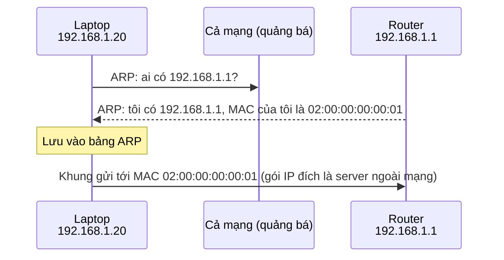

---
tags:
  - Should
  - Concept
  - Troubleshooting
---

# Trong cùng một mạng, gói tin tìm đúng máy nhận bằng cách nào? (Ethernet, MAC và ARP)

## Metadata

```yaml
Chapter: ethernet-mac-arp
Phase: 01 — foundation
Importance: Should
Status: draft
Prerequisites:
  - Phase 01 / 02-osi-vs-tcpip
Used Later:
  - Phase 02 / 01-routing-table-basics
  - Phase 03 / 01-dhcp
Estimated Reading: 20 phút
Estimated Practice: 20 phút
```

## 1. Story

<!-- Mức bắt buộc (Should): Đủ -->
<!-- DRAFT: người học cần viết lại bằng lời mình -->

Cuối tuần, bộ phận IT thay router văn phòng bằng một chiếc mới và cấu hình **cùng địa chỉ** `192.168.1.1` như cái cũ. Sáng thứ Hai, vài laptop không ra được Internet suốt mấy phút, trong khi laptop mở máy muộn hơn thì bình thường. Router mới hoạt động tốt, địa chỉ IP, mask, route đều đúng.

Nguyên nhân: các laptop đó còn nhớ "địa chỉ IP `192.168.1.1` ứng với địa chỉ phần cứng của router **cũ**" và vẫn gửi khung đến địa chỉ phần cứng cũ. Chapter này giải thích địa chỉ phần cứng là gì, vì sao máy cần nhớ nó, và nhớ ở đâu.

## 2. Objectives

<!-- Mức bắt buộc (Should): Đủ -->
<!-- DRAFT: người học cần viết lại bằng lời mình -->

Sau chapter này bạn có thể:

- Giải thích vì sao trong cùng một mạng cần cả địa chỉ IP lẫn địa chỉ MAC.
- Mô tả quá trình ARP: ai hỏi, ai trả lời, kết quả lưu ở đâu.
- Giải thích switch học và chuyển khung theo MAC như thế nào ở mức khái niệm.
- Giải thích vì sao gói tin tới một máy ngoài mạng lại được gửi tới địa chỉ MAC của gateway.
- Đọc bảng ARP và nhận ra dấu hiệu ARP lỗi thời hoặc trùng địa chỉ.

## 3. Prerequisites

<!-- Mức bắt buộc (Should): Đủ -->
<!-- DRAFT: người học cần viết lại bằng lời mình -->

> Xem lại: [osi-vs-tcpip](02-osi-vs-tcpip.md)

## 4. Why it exists

<!-- Mức bắt buộc (Should): Đủ -->
<!-- DRAFT: người học cần viết lại bằng lời mình -->

Địa chỉ IP là địa chỉ **logic**, có thể đổi và không gắn với phần cứng. Nhưng trên một đường dây hoặc một mạng Wi-Fi, card mạng chỉ nhận ra **địa chỉ phần cứng** của chính nó. Vì vậy, để chuyển một gói tin IP đến hàng xóm, máy phải biết địa chỉ phần cứng của hàng xóm đó.

**ARP (Address Resolution Protocol)** là cơ chế trả lời "địa chỉ IP này ứng với địa chỉ phần cứng nào?" trong cùng một mạng.

Nếu cơ chế này hỏng: máy có IP đúng, route đúng nhưng gửi khung tới địa chỉ phần cứng sai hoặc không biết địa chỉ phần cứng, nên không liên lạc được với hàng xóm hoặc với gateway (Story).

## 5. Mental model

<!-- Mức bắt buộc (Should): Đủ -->
<!-- DRAFT: người học cần viết lại bằng lời mình -->

Hình dung một văn phòng mở: bạn biết **tên** (IP) người cần gửi hồ sơ nhưng chưa biết **bàn** (MAC) của họ. Bạn đứng lên hỏi cả phòng "ai là Lan?"; Lan giơ tay và nói bàn của mình. Bạn ghi lại vào sổ tay (ARP cache) để lần sau không phải hỏi nữa.

**Tóm tắt một câu:** ARP hỏi cả mạng bằng quảng bá để đổi IP thành MAC, và nhớ câu trả lời trong bảng ARP.

## 6. How it works

<!-- Mức bắt buộc (Should): Đủ -->
<!-- DRAFT: người học cần viết lại bằng lời mình -->

Các từ cần biết:

- **Ethernet (chuẩn mạng có dây phổ biến — quy định dạng khung và cách các máy cùng một đường dây gửi dữ liệu cho nhau).**
- **MAC address (địa chỉ phần cứng — mã 48 bit gắn với card mạng, viết thành 6 cặp ký tự hex, ví dụ `02:00:00:00:00:01`).**
- **Switch (bộ chuyển mạch — thiết bị nối các máy trong cùng một mạng, chuyển khung theo địa chỉ MAC).**
- **ARP (giao thức phân giải địa chỉ — cách máy hỏi "IP này là MAC nào?" trong cùng một mạng).**
- **ARP cache (bảng ARP — bảng ghi nhớ các cặp IP ↔ MAC đã học).**

**Khung Ethernet** có (theo thứ tự) địa chỉ MAC đích, MAC nguồn, loại nội dung (ví dụ IP hay ARP), nội dung, và mã kiểm tra lỗi ở cuối. Địa chỉ MAC đích đặc biệt `FF:FF:FF:FF:FF:FF` nghĩa là gửi cho mọi máy trong mạng (quảng bá).

**Switch.** Switch ghi nhớ "MAC nguồn này nằm ở cổng nào" mỗi khi có khung đi qua, rồi chuyển khung đến đúng cổng theo MAC đích. Với khung quảng bá hoặc MAC chưa biết, switch gửi ra các cổng còn lại. Nhờ vậy khung chỉ đi đến nơi cần, không phát cho cả mạng.

**ARP.** Theo RFC 826, máy cần địa chỉ phần cứng của một địa chỉ IP thì **quảng bá** một yêu cầu ARP cho cả mạng; máy nào có địa chỉ IP đó **trả lời trực tiếp** với địa chỉ phần cứng của mình; người hỏi lưu kết quả vào bảng ARP.



**Đọc sơ đồ:** yêu cầu ARP đi tới mọi máy vì laptop chưa biết ai là router; chỉ router trả lời, và trả lời trực tiếp. Sau đó laptop gửi gói IP có **đích là server ngoài mạng** nhưng đặt **MAC đích là MAC của router**. Đây chính là điều ở `01/01`: máy gửi mọi thứ ngoài mạng cho default gateway; gói giữ nguyên IP đích, chỉ MAC đích là của gateway.

**Vì sao Story xảy ra:** laptop còn bản ghi cũ "192.168.1.1 → MAC của router cũ" và gửi khung tới MAC đó; router mới không nhận. Bản ghi hết hạn hoặc bị xóa thì laptop hỏi lại ARP và học MAC mới.

> Địa chỉ IP, route và gateway ở `01/04`, `02/01`, `02/03`; DHCP dùng địa chỉ MAC để nhận biết máy ở `03/01`.

<!-- verified: 2026-10-02 https://www.rfc-editor.org/rfc/rfc826 -->

## 7. Key settings

<!-- Mức bắt buộc (Should): Đủ -->
<!-- DRAFT: người học cần viết lại bằng lời mình -->

| Thông số | Ý nghĩa | Nếu sai |
|---|---|---|
| Bảng ARP | Cặp IP ↔ MAC đã học | Bản ghi lỗi thời → gửi nhầm MAC (Story) |
| Thời gian giữ bản ghi ARP | Bao lâu thì quên | Quá dài: lâu hồi phục khi đổi thiết bị; quá ngắn: nhiều quảng bá |
| MAC address của card mạng | Danh tính ở tầng 2 | Trùng MAC trong một mạng gây lỗi khó đoán |

Thời gian giữ bản ghi khác nhau theo hệ điều hành; tra tài liệu hệ điều hành của bạn.

**Xem bảng ARP:**

- Windows: `arp -a` hoặc PowerShell `Get-NetNeighbor -AddressFamily IPv4`.
- Linux: `ip neigh`.

## 8. AWS mapping

<!-- Mức bắt buộc (Should): Tùy chọn -->
<!-- DRAFT: người học cần viết lại bằng lời mình -->

Tùy chọn. Trên AWS, mỗi network interface có địa chỉ MAC, nhưng bạn hiếm khi thao tác trực tiếp với ARP; cơ chế chuyển khung trong VPC do AWS quản lý. `[CHƯA KIỂM CHỨNG]` — chi tiết ở Phase 06 nếu cần.

## 9. Hands-on lab

<!-- Mức bắt buộc (Should): Rút gọn -->
<!-- DRAFT: người học cần viết lại bằng lời mình -->

Chi tiết ở `labs/phase-01-foundation/chapter-03-ethernet-mac-arp/README.md`.

**1. Predict:** trong bảng ARP của bạn, địa chỉ IP nào chắc chắn có? (gợi ý: default gateway). MAC của nó trông thế nào?

**2. Run:**

```powershell
ping -n 1 192.168.1.1
arp -a
Get-NetNeighbor -AddressFamily IPv4
```

Thay `192.168.1.1` bằng default gateway của bạn (xem `01/01`).

**3. Verify:** gateway có trong bảng ARP chưa? Trạng thái là gì? Output thật: `[CHƯA CHẠY]`; khi lưu output, thay IP và MAC thật bằng dữ liệu giả.

## 10. Break it

<!-- Mức bắt buộc (Should): Rút gọn -->
<!-- DRAFT: người học cần viết lại bằng lời mình -->

Làm trong container (không đụng mạng máy thật): gán sai MAC cho gateway.

```powershell
docker run --rm -it --cap-add NET_ADMIN alpine sh
```

Trong container:

```sh
GW=$(ip route show default | awk '{print $3}')
ping -c 1 -W 2 $GW
ip neigh replace $GW lladdr 02:00:00:00:00:99 dev eth0 nud permanent
ping -c 1 -W 2 $GW
ip neigh del $GW dev eth0
ping -c 1 -W 2 $GW
```

**Dự đoán:** lần ping đầu thành công; sau khi gán MAC sai, ping hết thời gian dù IP và route vẫn đúng (khung gửi tới MAC không tồn tại); sau khi xóa bản ghi, máy hỏi lại ARP và ping thành công trở lại. Nếu gateway không trả lời ping ngay từ đầu, bài này không dùng được (thử trên môi trường khác).

**Khôi phục:** `exit`; container `--rm` tự xóa.

Kết quả thật: `[CHƯA CHẠY]`.

## 11. Troubleshooting

<!-- Mức bắt buộc (Should): Rút gọn -->
<!-- DRAFT: người học cần viết lại bằng lời mình -->

| Triệu chứng | Kiểm tra theo thứ tự | Công cụ |
|---|---|---|
| IP, route đúng nhưng không liên lạc được với gateway/hàng xóm | Bảng ARP có bản ghi không → MAC có đúng thiết bị không | `arp -a`, `ip neigh` |
| Sau khi thay thiết bị cùng IP, một số máy mất kết nối | Bản ghi ARP cũ | Xóa bản ghi (`arp -d`/`ip neigh del`) hoặc chờ hết hạn |
| Kết nối chập chờn | Có hai máy cùng IP không (MAC của IP thay đổi liên tục) | Quan sát `arp -a` nhiều lần |
| Mạng chậm, nhiều quảng bá | Số máy trong mạng quá lớn | Số liệu switch/capture |

Ghi kết quả thật của mục 10: `[CHƯA CHẠY]`.

## 12. Security & cost

<!-- Mức bắt buộc (Should): Đủ -->
<!-- DRAFT: người học cần viết lại bằng lời mình -->

- ARP không xác thực: một máy có thể trả lời giả để chuyển hướng lưu lượng ("ARP giả mạo"). Cơ chế phòng thủ nằm ở thiết bị mạng và ngoài phạm vi chapter này; bạn chỉ cần biết rủi ro tồn tại.
- Địa chỉ MAC có thể bị đổi nên không dùng làm xác thực.
- Không dán bảng ARP thật (MAC, IP) vào tài liệu công khai.
- Chi phí: không phát sinh.

## 13. Misconceptions

<!-- Mức bắt buộc (Should): Đủ -->
<!-- DRAFT: người học cần viết lại bằng lời mình -->

| Hiểu nhầm | Sự thật |
|---|---|
| "Có địa chỉ IP là đủ để gửi tới hàng xóm" | Còn cần biết MAC của hàng xóm (ARP) |
| "MAC đích của gói tới Internet là MAC của server" | MAC đích là của gateway; chỉ IP đích là của server |
| "ARP đi qua router sang mạng khác" | ARP là quảng bá cục bộ, không vượt qua router |
| "MAC address là duy nhất toàn cầu và không đổi được" | Thường duy nhất nhưng có thể bị thay đổi/giả mạo |

## 14. Interview questions

<!-- Mức bắt buộc (Should): Đủ -->
<!-- DRAFT: người học cần viết lại bằng lời mình -->

### Q1 (Junior) — ARP làm gì?

**Gợi ý ý chính:**
- Máy biết gì và cần biết gì?
- Yêu cầu và trả lời được gửi bằng cách nào?

??? success "Đáp án mẫu (tự trả lời trước khi mở)"
    ARP đổi một địa chỉ IP thành địa chỉ MAC trong cùng một mạng: máy quảng bá câu hỏi, máy có IP đó trả lời trực tiếp với MAC của mình, kết quả được lưu vào bảng ARP.

### Q2 (Middle) — Khi gửi tới một server ngoài mạng, MAC đích của khung là gì?

**Gợi ý ý chính:**
- Máy gửi gói cho ai đầu tiên?
- IP đích có đổi không?

??? success "Đáp án mẫu (tự trả lời trước khi mở)"
    MAC của default gateway. IP đích vẫn là của server; máy chỉ cần chuyển khung cho chặng kế tiếp (gateway), và gateway viết lại header tầng 2 cho chặng sau.

### Q3 (Middle) — Vì sao sau khi thay router cùng IP, một số máy mất mạng vài phút?

**Gợi ý ý chính:**
- Thông tin cũ nằm ở đâu?
- Khi nào máy hỏi lại?

??? success "Đáp án mẫu (tự trả lời trước khi mở)"
    Bảng ARP của các máy còn bản ghi IP → MAC của router cũ. Đến khi bản ghi hết hạn hoặc bị xóa, máy gửi khung tới MAC cũ nên không liên lạc được; sau đó chúng hỏi lại ARP và học MAC mới.

## 15. Exercises

<!-- Mức bắt buộc (Should): Đủ -->
<!-- DRAFT: người học cần viết lại bằng lời mình -->

1. **Đọc bảng ARP.** *Deliverable:* bảng gồm 3 dòng bất kỳ từ bảng ARP của bạn (đã thay IP/MAC thật bằng dữ liệu giả) kèm giải thích mỗi dòng là thiết bị gì.
2. **Gói tới Internet.** *Deliverable:* sơ đồ Mermaid cho một gói từ laptop tới server ngoài mạng, ghi rõ IP đích và MAC đích ở từng chặng.
3. **Sự cố Story.** *Deliverable:* 3 cách khắc phục (nhanh, trung bình, phòng ngừa) kèm ưu nhược điểm.

## 16. Cheat sheet

<!-- Mức bắt buộc (Should): Đủ -->
<!-- DRAFT: người học cần viết lại bằng lời mình -->

| Mục | Nội dung |
|---|---|
| MAC | 48 bit, 6 cặp hex; quảng bá `FF:FF:FF:FF:FF:FF` |
| ARP | Quảng bá hỏi; trả lời trực tiếp; lưu bảng ARP |
| Ra ngoài mạng | IP đích = server; MAC đích = gateway |
| Xem bảng ARP | `arp -a` / `ip neigh` / `Get-NetNeighbor` |
| Lỗi thường gặp | Bản ghi ARP cũ, trùng IP |

## 17. Glossary terms

<!-- Mức bắt buộc (Should): Đủ -->
<!-- DRAFT: người học cần viết lại bằng lời mình -->

- Ethernet / chuẩn mạng có dây / イーサネット
- MAC address / địa chỉ phần cứng / MACアドレス
- Switch / bộ chuyển mạch / スイッチ
- ARP / giao thức phân giải địa chỉ / ARP
- ARP cache / bảng ARP / ARPキャッシュ

## 18. Further reading

<!-- Mức bắt buộc (Should): Đủ -->
<!-- DRAFT: người học cần viết lại bằng lời mình -->

Kiểm tra ngày 2026-10-02:

- RFC 826 — An Ethernet Address Resolution Protocol: https://www.rfc-editor.org/rfc/rfc826
