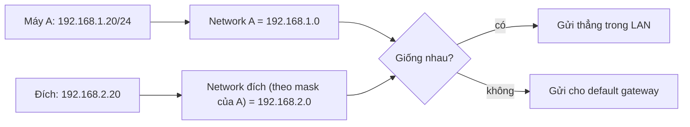

---
tags:
  - Must
  - IP
  - Concept
---

# Vì sao hai máy cắm chung một dây mạng vẫn có thể không nói chuyện được với nhau? (Địa chỉ IPv4)

## Metadata

```yaml
Chapter: ipv4-addressing
Phase: 01 — foundation
Importance: Must
Status: draft
Prerequisites:
  - Phase 01 / 02-osi-vs-tcpip
Used Later:
  - Phase 01 / 05-cidr-subnetting
  - Phase 01 / 06-private-public-ip-rfc1918
  - Phase 01 / 07-ipv6-basics
  - Phase 03 / 02-dns-resolution
  - Phase 03 / 04-icmp-ping-traceroute
  - Phase 03 / 05-ntp
  - Phase 03 / 06-syslog-logging
Estimated Reading: 25 phút
Estimated Practice: 30 phút
```

## 1. Story

<!-- Mức bắt buộc (Must): Đủ -->
<!-- DRAFT: người học cần viết lại bằng lời mình -->

Hai laptop `shopnet-dev-a` và `shopnet-dev-b` cắm chung một switch trong văn phòng. Máy A có địa chỉ `192.168.1.20`, máy B có `192.168.2.20`. Cả hai đều "có mạng", ra Internet được, nhưng A **không ping được B** dù chỉ cách nhau một sợi dây.

Điểm chung của mọi sự cố kiểu này: máy đoán sai việc "người kia có ở cùng mạng với mình không". Địa chỉ IP không phải một con số vô nghĩa; nó mang cấu trúc cho phép mỗi máy trả lời câu hỏi đó trong một phép tính. Chapter này dạy phép tính đó.

## 2. Objectives

<!-- Mức bắt buộc (Must): Đủ -->
<!-- DRAFT: người học cần viết lại bằng lời mình -->

Sau chapter này bạn có thể:

- Đọc một địa chỉ IPv4 dưới dạng 32 bit và đổi qua lại giữa nhị phân và thập phân cho từng nhóm 8 bit.
- Tách một địa chỉ thành phần mạng và phần máy khi biết subnet mask (với mặt nạ `/8`, `/16`, `/24`).
- Tính được network address và broadcast address cho các trường hợp `/8`, `/16`, `/24`.
- Quyết định được hai máy có ở cùng mạng hay không, và đoán hậu quả nếu mask sai.
- Nhận ra các địa chỉ đặc biệt: `0.0.0.0`, `127.x.x.x`, `169.254.x.x`.

## 3. Prerequisites

<!-- Mức bắt buộc (Must): Đủ -->
<!-- DRAFT: người học cần viết lại bằng lời mình -->

> Xem lại: [osi-vs-tcpip](02-osi-vs-tcpip.md)

Bạn cần nhớ hành trình gói tin ở [packet-journey](01-packet-journey.md): máy so địa chỉ đích với mạng của mình để quyết định gửi thẳng hay gửi cho gateway. Chapter này giải thích "so như thế nào".

## 4. Why it exists

<!-- Mức bắt buộc (Must): Đủ -->
<!-- DRAFT: người học cần viết lại bằng lời mình -->

Mỗi máy cần một **địa chỉ duy nhất** để gói tin tìm được đúng nó. Nhưng nếu địa chỉ chỉ là một dãy số tùy ý, mỗi router sẽ phải nhớ đường tới **từng máy** trên thế giới, điều không thể làm được.

Giải pháp: chia địa chỉ thành hai phần, **phần mạng** (máy nằm ở khu vực nào) và **phần máy** (số thứ tự trong khu vực đó). Router chỉ cần nhớ đường tới từng *khu vực*, không cần nhớ từng máy.

Nếu cấu hình sai (sai mask, trùng địa chỉ, nhầm khu vực):

- Máy gửi gói tin đi đường sai (ra gateway thay vì gửi thẳng, hoặc ngược lại).
- Hai máy trùng địa chỉ làm kết nối chập chờn.
- Máy tưởng người kia ở xa nên không bao giờ hỏi trực tiếp, hoặc tưởng ở gần nên không hỏi gateway.

## 5. Mental model

<!-- Mức bắt buộc (Must): Đủ -->
<!-- DRAFT: người học cần viết lại bằng lời mình -->

Địa chỉ IPv4 giống địa chỉ nhà: **tên đường + số nhà**. Hai người cùng tên đường thì sang nhà nhau được bằng đường nội bộ; khác đường thì phải đi qua ngã tư (router). Subnet mask là câu "tên đường dài bao nhiêu ký tự".

**Tóm tắt một câu:** IP address = phần mạng + phần máy, và subnet mask cho biết ranh giới giữa hai phần.

## 6. How it works

<!-- Mức bắt buộc (Must): Đủ -->
<!-- DRAFT: người học cần viết lại bằng lời mình -->

Các từ cần biết:

- **IPv4 (địa chỉ IP phiên bản 4 — địa chỉ dài 32 bit, viết thành bốn số cách nhau bằng dấu chấm).**
- **Bit (đơn vị nhỏ nhất của máy tính, chỉ nhận giá trị 0 hoặc 1).**
- **Octet (nhóm 8 bit — mỗi số trong địa chỉ IPv4 là một octet, nhận giá trị 0 đến 255).**
- **Subnet mask (mặt nạ mạng — dãy 32 bit cho biết bao nhiêu bit đầu của địa chỉ thuộc phần mạng).**
- **Network address (địa chỉ mạng — địa chỉ có mọi bit phần máy bằng 0, dùng để gọi tên cả khu vực).**
- **Broadcast address (địa chỉ quảng bá — địa chỉ có mọi bit phần máy bằng 1, gửi đến đó là gửi cho mọi máy trong khu vực).**

**Bước 1 — Địa chỉ là 32 bit.** `192.168.1.20` gồm bốn octet:

| Octet | 192 | 168 | 1 | 20 |
|---|---|---|---|---|
| Nhị phân | `11000000` | `10101000` | `00000001` | `00010100` |

**Bước 2 — Mask chia hai phần.** Mask `255.255.255.0` có 24 bit 1 rồi 8 bit 0, viết gọn là `/24`. Bit 1 là phần mạng, bit 0 là phần máy:

```
IP    192.168.1.20  = 11000000.10101000.00000001.00010100
Mask  255.255.255.0 = 11111111.11111111.11111111.00000000
                      |------ phần mạng ------||phần máy|
```

**Bước 3 — Network address = IP AND mask** (giữ lại bit nơi mask là 1, đặt bit còn lại bằng 0): `192.168.1.0`. **Broadcast** = đặt mọi bit phần máy bằng 1: `192.168.1.255`.

**Bước 4 — Hai máy cùng mạng không?** Tính network address của cả hai với **cùng một mask**; bằng nhau thì cùng mạng.



**Đọc sơ đồ:** máy A lấy mask của chính nó áp lên địa chỉ đích để biết đích ở đâu. `192.168.1.0` khác `192.168.2.0`, nên A không gửi thẳng mà đưa cho default gateway. Nếu máy A không có gateway (hoặc gateway không biết đường đến mạng kia), gói tin không đi tiếp được. Đó là câu trả lời cho Story: A và B ở **hai mạng khác nhau** dù cùng một dây.

**Các dải đặc biệt cần nhớ (không phải liệt kê hết):**

| Dải | Ý nghĩa |
|---|---|
| `0.0.0.0` | "Chưa có địa chỉ" hoặc "mọi địa chỉ" tùy ngữ cảnh |
| `127.0.0.0/8` (thường dùng `127.0.0.1`) | **Loopback (vòng lặp nội bộ — địa chỉ để máy nói chuyện với chính nó).** |
| `169.254.0.0/16` | **Link-local (địa chỉ cục bộ tự cấp — máy tự gán cho mình một địa chỉ trong dải này, chỉ dùng được với máy cùng đường dây).** Windows tự làm vậy khi không nhận được địa chỉ từ DHCP; hành vi trên Linux phụ thuộc cấu hình. Thấy dải này thường nghĩa là DHCP thất bại |
| `255.255.255.255` | Quảng bá trong phạm vi mạng hiện tại |

> Dải private (`10.x`, `172.16–31.x`, `192.168.x`) và public ở `01/06`; chia mạng bằng mask khác `/8 /16 /24` ở `01/05`; DHCP ở `03/01`.

## 7. Key settings

<!-- Mức bắt buộc (Must): Đủ -->
<!-- DRAFT: người học cần viết lại bằng lời mình -->

Bốn thông số cấu hình của một máy (đã gặp ở `01/01`, nay thêm mask):

| Thông số | Ví dụ | Nếu sai |
|---|---|---|
| Địa chỉ IP | `192.168.1.20` | Trùng máy khác, hoặc nằm ngoài mạng |
| Subnet mask | `255.255.255.0` (`/24`) | Máy hiểu sai ai là "hàng xóm" |
| Default gateway | `192.168.1.1` (phải nằm **cùng mạng** với IP) | Không ra ngoài LAN được |
| DNS server | `192.168.1.1` | Gõ tên không vào, gõ IP vẫn vào |

Mặc định, các thông số này thường được cấp tự động bằng DHCP (`03/01`); đặt tay gọi là **cấu hình tĩnh**.

Xem trên máy: `ipconfig /all` (Windows), `ip -br addr` (Linux).

## 8. AWS mapping

<!-- Mức bắt buộc (Must): Đủ nếu có liên quan AWS -->
<!-- DRAFT: người học cần viết lại bằng lời mình -->

Chapter này chưa dùng dịch vụ AWS. Hướng liên hệ (sẽ kiểm chứng ở Phase 06):

| Khái niệm ở chapter này | Trên AWS (dự kiến) |
|---|---|
| Dải địa chỉ của một mạng | CIDR của VPC và của subnet |
| Địa chỉ của một máy | Địa chỉ IPv4 private gắn với network interface của instance |

`[CHƯA KIỂM CHỨNG]` — chi tiết và số liệu cụ thể ở `06/01` và `06/05`.

## 9. Hands-on lab

<!-- Mức bắt buộc (Must): Đủ + expected-output.txt -->
<!-- DRAFT: người học cần viết lại bằng lời mình -->

Chi tiết ở `labs/phase-01-foundation/chapter-04-ipv4-addressing/README.md`.

**1. Predict (tính tay, chưa chạy lệnh):** tìm network address, broadcast address và mask dạng thập phân của:

- `10.20.30.40/8`
- `172.16.5.9/16`
- `192.168.1.20/24`

**2. Run:**

```bash
python3 -c "import ipaddress as i; [print(x, i.ip_interface(x).network, i.ip_interface(x).network.broadcast_address, i.ip_interface(x).netmask) for x in ('10.20.30.40/8','172.16.5.9/16','192.168.1.20/24')]"
```

Đổi một số sang nhị phân:

```powershell
[Convert]::ToString(192,2).PadLeft(8,'0')
```

**3. Verify:** so kết quả với phép tính tay. Đáp án để tự đối chiếu:

??? success "Đáp án (tính toán, không phải output lab)"
    - `10.20.30.40/8` → network `10.0.0.0`, broadcast `10.255.255.255`, mask `255.0.0.0`.
    - `172.16.5.9/16` → network `172.16.0.0`, broadcast `172.16.255.255`, mask `255.255.0.0`.
    - `192.168.1.20/24` → network `192.168.1.0`, broadcast `192.168.1.255`, mask `255.255.255.0`.

Output thật: `[CHƯA CHẠY]`.

## 10. Break it

<!-- Mức bắt buộc (Must): Đủ (≥ 1 Break it) -->
<!-- DRAFT: người học cần viết lại bằng lời mình -->

**Gây lỗi:** đặt sai mask và xem máy đổi cách gửi gói tin. Làm trong container (không đụng máy thật):

```powershell
docker run --rm -it --cap-add NET_ADMIN alpine sh
```

Trong container:

```sh
ip addr add 192.168.1.20/24 dev eth0
ip route get 192.168.1.50
ip addr del 192.168.1.20/24 dev eth0
ip addr add 192.168.1.20/32 dev eth0
ip route get 192.168.1.50
```

**Dự đoán:**

- Với `/24`: máy tự biết `192.168.1.50` ở **cùng mạng**, nên gửi thẳng ra giao diện `eth0` (không qua gateway).
- Với `/32`: mask quá hẹp, máy coi **không ai** là hàng xóm, nên `192.168.1.50` bị gửi theo default route (qua gateway của Docker).

**Ý nghĩa:** chỉ đổi mask cũng đổi hoàn toàn đường đi của gói tin.

**Khôi phục:** `exit` (container `--rm` tự xóa).

Kết quả thật: `[CHƯA CHẠY]`.

## 11. Troubleshooting

<!-- Mức bắt buộc (Must): Đủ -->
<!-- DRAFT: người học cần viết lại bằng lời mình -->

| Triệu chứng | Kiểm tra theo thứ tự | Công cụ |
|---|---|---|
| Hai máy cùng switch không ping được nhau | IP/mask hai máy → network address có bằng nhau không → có gateway/route giữa hai mạng không | `ipconfig /all`, `ip -br addr`, `ip route get` |
| Máy có địa chỉ `169.254.x.x` | DHCP có hoạt động không → dây/Wi-Fi → DHCP server | `ipconfig /all`; xem `03/01` |
| Kết nối chập chờn, lúc được lúc không | Có hai máy trùng địa chỉ không | `arp -a` (xem `01/03`), thử đổi địa chỉ |
| Ra ngoài được nhưng không vào được máy cùng LAN | Mask sai làm máy đẩy mọi thứ ra gateway | So sánh network address hai máy |
| Gateway không liên lạc được | Gateway có nằm cùng mạng với IP máy không | So sánh network address của IP và gateway |

Ghi kết quả thật của mục 10: `[CHƯA CHẠY]`.

## 12. Security & cost

<!-- Mức bắt buộc (Must): Đủ -->
<!-- DRAFT: người học cần viết lại bằng lời mình -->

- Địa chỉ IP là định danh, không phải bảo mật: đừng coi "chỉ máy trong dải này mới vào được" là đủ an toàn (xem Phase 05).
- Không dán IP/CIDR thật của mạng công ty vào tài liệu công khai; dùng dải giả.
- Dải `169.254.x.x` xuất hiện trên máy chủ thường là dấu hiệu lỗi cấp địa chỉ, nên cần kiểm tra thay vì bỏ qua.
- Chi phí: không phát sinh.

## 13. Misconceptions

<!-- Mức bắt buộc (Must): Đủ -->
<!-- DRAFT: người học cần viết lại bằng lời mình -->

| Hiểu nhầm | Sự thật |
|---|---|
| "Subnet mask chỉ là con số trang trí" | Nó quyết định máy nào là hàng xóm và máy nào phải qua gateway |
| "Một octet có 255 giá trị" | Có 256 giá trị (0–255) |
| "`/24` nghĩa là 24 máy" | `/24` là 24 bit phần mạng; còn 8 bit phần máy (256 địa chỉ) |
| "Địa chỉ `192.168.x.x` chắc chắn là mạng nhà" | Đây là dải private dùng ở nhiều nơi; xem `01/06` |
| "Máy nào cũng có thể dùng địa chỉ cuối `.255`/`.0`" | Với `/24`, `.0` là địa chỉ mạng và `.255` là quảng bá; không gán cho máy |

## 14. Interview questions

<!-- Mức bắt buộc (Must): Đủ -->
<!-- DRAFT: người học cần viết lại bằng lời mình -->

### Q1 (Junior) — Subnet mask dùng để làm gì?

**Gợi ý ý chính:**
- Nó chia địa chỉ thành mấy phần?
- Máy dùng nó để quyết định điều gì khi gửi gói tin?

??? success "Đáp án mẫu (tự trả lời trước khi mở)"
    Mask cho biết bao nhiêu bit đầu của địa chỉ là phần mạng. Máy dùng nó để tính network address của mình và của đích; nếu bằng nhau thì gửi thẳng trong LAN, nếu khác thì gửi cho default gateway.

### Q2 (Junior) — Địa chỉ `169.254.x.x` trên một máy nói lên điều gì?

**Gợi ý ý chính:**
- Máy đã cố làm gì để lấy địa chỉ?
- Ai thường cấp địa chỉ bình thường?

??? success "Đáp án mẫu (tự trả lời trước khi mở)"
    Đó là địa chỉ link-local do máy tự gán (Windows làm vậy khi không nhận được địa chỉ từ DHCP). Thường nghĩa là DHCP server không trả lời hoặc đường tới nó có vấn đề; máy chỉ nói chuyện được với máy cùng link.

### Q3 (Middle) — Hai máy cắm chung switch mà không ping được nhau. Giả thuyết đầu tiên?

**Gợi ý ý chính:**
- So sánh gì giữa hai địa chỉ?
- Còn thiếu thiết bị nào nếu họ ở hai mạng khác nhau?

??? success "Đáp án mẫu (tự trả lời trước khi mở)"
    Tính network address của cả hai theo mask của mỗi máy. Nếu khác nhau thì họ ở hai mạng khác nhau và cần router/gateway giữa chúng; nếu mask hai bên không khớp thì mỗi máy hiểu "mạng" khác nhau, và gói tin có thể đi đường sai.

## 15. Exercises

<!-- Mức bắt buộc (Must): Đủ -->
<!-- DRAFT: người học cần viết lại bằng lời mình -->

1. **Tính tay ba địa chỉ.** Chọn ba địa chỉ khác ví dụ (mask `/8`, `/16`, `/24`). *Deliverable:* bảng gồm network address, broadcast, mask thập phân và các bước nhị phân cho từng địa chỉ.
2. **Giải thích sự cố Story.** *Deliverable:* đoạn 4–6 câu giải thích vì sao A không ping được B, kèm network address của cả hai.
3. **Cấu hình sai.** Cho `IP=192.168.1.20`, `mask=255.255.255.0`, `gateway=192.168.2.1`. *Deliverable:* 3–5 câu giải thích vì sao gateway này không dùng được.

## 16. Cheat sheet

<!-- Mức bắt buộc (Must): Đủ -->
<!-- DRAFT: người học cần viết lại bằng lời mình -->

| Khái niệm | Công thức |
|---|---|
| Network address | IP AND mask |
| Broadcast | Đặt mọi bit phần máy = 1 |
| Cùng mạng? | Cùng mask → network address bằng nhau |
| `/24` | mask `255.255.255.0`, 8 bit phần máy |
| `/16` | mask `255.255.0.0`, 16 bit phần máy |
| `/8` | mask `255.0.0.0`, 24 bit phần máy |

**Dải đặc biệt:** `127.0.0.0/8` loopback; `169.254.0.0/16` link-local (DHCP thường thất bại); `0.0.0.0` chưa có địa chỉ.

## 17. Glossary terms

<!-- Mức bắt buộc (Must): Đủ -->
<!-- DRAFT: người học cần viết lại bằng lời mình -->

- IPv4 / địa chỉ IP phiên bản 4 / IPv4アドレス
- Bit / bit / ビット
- Octet / octet / オクテット
- Subnet mask / mặt nạ mạng / サブネットマスク
- Network address / địa chỉ mạng / ネットワークアドレス
- Broadcast address / địa chỉ quảng bá / ブロードキャストアドレス
- Loopback / vòng lặp nội bộ / ループバック
- Link-local / địa chỉ cục bộ tự cấp / リンクローカルアドレス

## 18. Further reading

<!-- Mức bắt buộc (Must): Đủ -->
<!-- DRAFT: người học cần viết lại bằng lời mình -->

Kiểm tra ngày 2026-10-02:

- RFC 791 — Internet Protocol: https://www.rfc-editor.org/rfc/rfc791
- RFC 4632 — CIDR (biểu diễn prefix): https://www.rfc-editor.org/rfc/rfc4632
