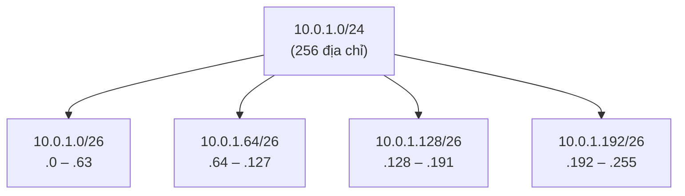

---
tags:
  - Must
  - IP
  - Subnet
  - Concept
---

# Làm sao chia một dải địa chỉ lớn thành các mạng con vừa đủ dùng? (CIDR và subnetting)

## Metadata

```yaml
Chapter: cidr-subnetting
Phase: 01 — foundation
Importance: Must
Status: draft
Prerequisites:
  - Phase 01 / 04-ipv4-addressing
Used Later:
  - Phase 01 / 06-private-public-ip-rfc1918
  - Phase 02 / 01-routing-table-basics
  - Phase 05 / 02-acl
  - Phase 06 / 01-vpc-subnet-az
Estimated Reading: 30 phút
Estimated Practice: 45 phút
```

## 1. Story

<!-- Mức bắt buộc (Must): Đủ -->
<!-- DRAFT: người học cần viết lại bằng lời mình -->

Nhóm `shopnet` được giao dải `10.0.0.0/16` cho môi trường `prd`. Một người tạo mạng con cho tầng ứng dụng bằng `/28` "cho gọn". Hai tuần sau, khi scale thêm máy, hệ thống báo hết địa chỉ trong khi cả dải `/16` còn gần như trống. Muốn nới thì phải tạo lại cả mạng con, đồng nghĩa với dừng dịch vụ.

Chọn kích thước mạng con là quyết định khó sửa. Chapter này dạy cách tính: một dải lớn chia thế nào, mỗi mạng con chứa bao nhiêu địa chỉ, và làm sao không để hai mạng chồng lên nhau.

## 2. Objectives

<!-- Mức bắt buộc (Must): Đủ -->
<!-- DRAFT: người học cần viết lại bằng lời mình -->

Sau chapter này bạn có thể:

- Đọc ký hiệu CIDR (`10.0.1.0/24`) và nói prefix, mask, số địa chỉ.
- Tính số địa chỉ và số máy dùng được của một mạng con theo công thức.
- Chia một mạng thành các mạng con cùng kích thước và liệt kê được chúng.
- Xác định một địa chỉ nằm trong mạng con nào và khoảng địa chỉ của mạng đó.
- Phát hiện hai dải CIDR có chồng lấn hay không.
- Chọn kích thước mạng con cho một nhu cầu cho trước và chừa chỗ để mở rộng.

## 3. Prerequisites

<!-- Mức bắt buộc (Must): Đủ -->
<!-- DRAFT: người học cần viết lại bằng lời mình -->

> Xem lại: [ipv4-addressing](04-ipv4-addressing.md)

Bạn cần biết đọc địa chỉ 32 bit, mask và tính network/broadcast address với `/8 /16 /24`.

## 4. Why it exists

<!-- Mức bắt buộc (Must): Đủ -->
<!-- DRAFT: người học cần viết lại bằng lời mình -->

Ngày trước, mạng chỉ có vài kích thước cố định (lớp A, B, C). Một tổ chức cần 300 địa chỉ phải xin cả dải 65.536, rất lãng phí. **CIDR (Classless Inter-Domain Routing)** bỏ các lớp cố định: bạn chọn **độ dài phần mạng tùy ý** (prefix), nên cắt được dải đúng cỡ cần dùng.

Hai việc CIDR cho phép:

- **Chia nhỏ (subnetting):** từ một dải lớn tách ra nhiều mạng con để quản lý, cô lập và đặt chính sách bảo mật theo từng nhóm.
- **Gộp (aggregation):** nhiều mạng liền nhau có thể gộp thành một dòng khi mô tả đường đi.

Nếu tính sai: hết địa chỉ giữa chừng, hai môi trường chồng lấn nhau (không nối mạng được sau này), hoặc phí địa chỉ vô ích.

## 5. Mental model

<!-- Mức bắt buộc (Must): Đủ -->
<!-- DRAFT: người học cần viết lại bằng lời mình -->

Hình dung một mảnh đất: mỗi lần thêm **1 bit** vào prefix là **chia đôi** mảnh đất đó. `/16` → hai mảnh `/17` → bốn mảnh `/18`... Prefix càng dài, mảnh càng nhỏ.

**Tóm tắt một câu:** `/n` có `2^(32−n)` địa chỉ; tăng n thêm 1 thì số địa chỉ giảm một nửa.

## 6. How it works

<!-- Mức bắt buộc (Must): Đủ -->
<!-- DRAFT: người học cần viết lại bằng lời mình -->

Các từ cần biết:

- **CIDR (định tuyến liên miền không phân lớp — cách viết dải địa chỉ bằng một địa chỉ cộng độ dài phần mạng, ví dụ `10.0.1.0/24`).**
- **Prefix length (độ dài tiền tố — số bit đầu thuộc phần mạng, số sau dấu `/`).**
- **Subnet (mạng con — một phần của mạng lớn, chia ra để quản lý và cô lập).**
- **Subnetting (chia mạng con — việc cắt một mạng thành nhiều mạng con).**
- **Block size (kích thước khối — số địa chỉ trong một mạng con, bằng `2^(32−prefix)`).**

**Công thức:**

- Số địa chỉ = `2^(32 − prefix)`.
- Số máy dùng được theo cách tính truyền thống = số địa chỉ − 2 (trừ địa chỉ mạng và địa chỉ quảng bá).
- Địa chỉ mạng của một mạng con phải là **bội số** của block size (đây là quy tắc "căn khối").

| Prefix | Mask | Số địa chỉ | Máy dùng được (truyền thống) |
|---|---|---|---|
| `/16` | `255.255.0.0` | 65.536 | 65.534 |
| `/20` | `255.255.240.0` | 4.096 | 4.094 |
| `/24` | `255.255.255.0` | 256 | 254 |
| `/25` | `255.255.255.128` | 128 | 126 |
| `/26` | `255.255.255.192` | 64 | 62 |
| `/27` | `255.255.255.224` | 32 | 30 |
| `/28` | `255.255.255.240` | 16 | 14 |
| `/30` | `255.255.255.252` | 4 | 2 |
| `/32` | `255.255.255.255` | 1 | một máy duy nhất |

> Lưu ý: dịch vụ mạng đám mây có thể giữ lại thêm một số địa chỉ trong mỗi mạng con, nên số máy dùng được ở đó **nhỏ hơn** công thức trên. Số cụ thể sẽ kiểm chứng ở `06/01` `[CHƯA KIỂM CHỨNG]`.

**Ví dụ chia mạng.** Chia `10.0.1.0/24` (256 địa chỉ) thành bốn mạng `/26` (mỗi mạng 64 địa chỉ):



**Đọc sơ đồ:** từ `/24` lên `/26` là thêm 2 bit, nên chia làm 2² = 4 phần bằng nhau. Địa chỉ đầu của mỗi phần là bội số của 64 (0, 64, 128, 192), đúng quy tắc căn khối. Một địa chỉ như `10.0.1.50/26` thuộc mạng `10.0.1.0/26`; muốn viết `10.0.1.50/26` làm *địa chỉ mạng* là sai vì 50 không phải bội của 64.

**Tìm mạng con của một địa chỉ.** `10.0.1.77/26`: block size 64; 77 nằm trong khoảng 64–127, nên mạng là `10.0.1.64/26`, quảng bá `10.0.1.127`, máy dùng được `.65` đến `.126`.

**Dải lớn hơn một octet.** `10.0.0.0/20` có 4.096 địa chỉ, từ `10.0.0.0` đến `10.0.15.255` (16 giá trị của octet thứ ba). Mạng `/20` kế tiếp bắt đầu ở `10.0.16.0`.

**Chồng lấn (overlap).** Hai dải chồng lấn khi một dải **nằm trong** dải kia hoặc có chung địa chỉ. `10.0.0.0/16` và `10.0.5.0/24` chồng lấn (`10.0.5.0/24` nằm trong `10.0.0.0/16`); `10.0.0.0/24` và `10.0.1.0/24` không chồng lấn. Chồng lấn làm router không biết gói tin thuộc mạng nào, và không nối được hai mạng này với nhau sau này.

## 7. Key settings

<!-- Mức bắt buộc (Must): Đủ -->
<!-- DRAFT: người học cần viết lại bằng lời mình -->

Khi chọn kích thước mạng con, tự hỏi:

| Câu hỏi | Gợi ý |
|---|---|
| Cần bao nhiêu máy hôm nay và 2–3 năm tới? | Tính trên số địa chỉ **có thể tăng**, không chỉ hiện tại |
| Có dịch vụ tự scale (thêm máy tự động) không? | Chừa nhiều địa chỉ trống hơn |
| Có cần nối với mạng khác (công ty, môi trường khác) không? | Dải **không được chồng lấn** với mạng đó |
| Cần tách theo mục đích (web, app, db)? | Mỗi mục đích một mạng con để đặt chính sách riêng |

Ví dụ kế hoạch giả cho `shopnet`: `prd` dùng `10.0.0.0/16`, `stg` dùng `10.1.0.0/16`: hai dải này không chồng lấn và đều còn nhiều chỗ để chia tiếp.

## 8. AWS mapping

<!-- Mức bắt buộc (Must): Đủ nếu có liên quan AWS -->
<!-- DRAFT: người học cần viết lại bằng lời mình -->

Chapter này chưa dùng dịch vụ AWS; chỉ nêu hướng liên hệ.

| Khái niệm | Trên AWS (dự kiến) |
|---|---|
| Dải CIDR của một mạng | CIDR của VPC |
| Mạng con | Subnet nằm trong VPC |
| Kích thước mạng con tối thiểu/tối đa, số địa chỉ bị giữ lại | Có giới hạn riêng do AWS quy định |

`[CHƯA KIỂM CHỨNG]` — các con số cụ thể phải kiểm tra với tài liệu AWS hiện tại ở `06/01` và `06/13`.

## 9. Hands-on lab

<!-- Mức bắt buộc (Must): Đủ + expected-output.txt -->
<!-- DRAFT: người học cần viết lại bằng lời mình -->

Chi tiết ở `labs/phase-01-foundation/chapter-05-cidr-subnetting/README.md`.

**1. Predict (tính tay):**

- `10.0.1.0/24` chia thành `/26` được bao nhiêu mạng? Địa chỉ đầu của từng mạng là gì?
- `10.0.1.77/26` thuộc mạng nào?
- `10.0.0.0/16` và `10.0.5.0/24` có chồng lấn không?

**2. Run:**

```bash
python3 -c "import ipaddress as i; n=i.ip_network('10.0.1.0/24'); print([str(s) for s in n.subnets(new_prefix=26)])"
```

```bash
python3 -c "import ipaddress as i; print(i.ip_interface('10.0.1.77/26').network)"
```

```bash
python3 -c "import ipaddress as i; print(i.ip_network('10.0.0.0/16').overlaps(i.ip_network('10.0.5.0/24')))"
```

**3. Verify:** so kết quả với phép tính tay.

Output thật: `[CHƯA CHẠY]`.

## 10. Break it

<!-- Mức bắt buộc (Must): Đủ (≥ 1 Break it) -->
<!-- DRAFT: người học cần viết lại bằng lời mình -->

Hai "lỗi thiết kế" để quan sát bằng công cụ, không động đến mạng thật:

**Lỗi 1 — mạng con quá nhỏ.** Cần 20 máy nhưng chọn `/28`:

```bash
python3 -c "import ipaddress as i; n=i.ip_network('10.0.2.0/28'); print(n.num_addresses, n.num_addresses-2)"
```

**Dự đoán:** 16 địa chỉ, 14 máy dùng được, thiếu so với 20 máy cần. Đó chính là tình huống trong Story.

**Lỗi 2 — hai môi trường chồng lấn.** Gán `prd=10.0.0.0/16` và `stg=10.0.5.0/24`:

```bash
python3 -c "import ipaddress as i; print(i.ip_network('10.0.0.0/16').overlaps(i.ip_network('10.0.5.0/24')))"
```

**Dự đoán:** `True`. Ở mạng thật, triệu chứng là: cố nối hai môi trường (VPN, peering…) không được, hoặc gói tin đến "nhầm" môi trường.

**Khôi phục:** sửa kế hoạch (`stg=10.1.0.0/16`) và kiểm tra lại không còn chồng lấn.

Kết quả thật: `[CHƯA CHẠY]`.

## 11. Troubleshooting

<!-- Mức bắt buộc (Must): Đủ -->
<!-- DRAFT: người học cần viết lại bằng lời mình -->

| Triệu chứng | Kiểm tra theo thứ tự | Công cụ |
|---|---|---|
| Không thêm được máy mới: hết địa chỉ | Mạng con còn bao nhiêu địa chỉ trống → còn chỗ để mở rộng/thay bằng mạng lớn hơn không | Bảng địa chỉ, lệnh `ipaddress` ở mục 9 |
| Hai mạng không nối được | Hai dải CIDR có chồng lấn không | `ip_network(...).overlaps(...)` |
| Máy không nói chuyện được với máy cùng mạng | Mask hai bên có khớp không → network address có bằng nhau không | `ip -br addr`, so sánh network address |
| Cấu hình bị từ chối "không đúng địa chỉ mạng" | Địa chỉ đầu của mạng có là bội số của block size không | Công thức căn khối |

Ghi kết quả thật của mục 10: `[CHƯA CHẠY]`.

## 12. Security & cost

<!-- Mức bắt buộc (Must): Đủ -->
<!-- DRAFT: người học cần viết lại bằng lời mình -->

- Chia mạng con theo vai trò (web, app, db) giúp đặt chính sách bảo mật riêng từng nhóm; mạng quá lớn và phẳng thì khó cô lập.
- Không dùng CIDR/IP thật của hệ thống thật trong tài liệu công khai.
- Chi phí: không phát sinh trong chapter này; trên đám mây, quy hoạch dải sai buộc phải tạo lại mạng, tốn công và có thể gián đoạn.

## 13. Misconceptions

<!-- Mức bắt buộc (Must): Đủ -->
<!-- DRAFT: người học cần viết lại bằng lời mình -->

| Hiểu nhầm | Sự thật |
|---|---|
| "`/24` luôn có 254 máy dùng được" | Đó là cách tính truyền thống; nền tảng đám mây có thể giữ thêm địa chỉ nên số dùng được ít hơn |
| "Prefix lớn hơn thì mạng lớn hơn" | Ngược lại: prefix **dài hơn** → ít bit máy → mạng **nhỏ hơn** |
| "Địa chỉ nào cũng có thể làm địa chỉ mạng" | Phải là bội số của block size |
| "Chồng lấn chỉ là vấn đề thẩm mỹ" | Nó làm routing mơ hồ và chặn việc nối mạng sau này |
| "Chia nhỏ càng nhiều càng tốt" | Mạng con quá nhỏ hết địa chỉ nhanh; cần cân bằng giữa cô lập và dư địa |

## 14. Interview questions

<!-- Mức bắt buộc (Must): Đủ -->
<!-- DRAFT: người học cần viết lại bằng lời mình -->

### Q1 (Junior) — `/27` có bao nhiêu địa chỉ và bao nhiêu máy dùng được?

**Gợi ý ý chính:**
- Còn lại bao nhiêu bit cho phần máy?
- Hai địa chỉ nào không gán cho máy theo cách tính truyền thống?

??? success "Đáp án mẫu (tự trả lời trước khi mở)"
    `/27` còn 5 bit cho phần máy nên có 2⁵ = 32 địa chỉ; trừ địa chỉ mạng và quảng bá thì 30 máy dùng được (theo cách tính truyền thống).

### Q2 (Junior) — `10.0.1.77/26` thuộc mạng nào? Dải máy dùng được là gì?

**Gợi ý ý chính:**
- Block size là bao nhiêu?
- 77 nằm trong khối nào?

??? success "Đáp án mẫu (tự trả lời trước khi mở)"
    Block size 64, 77 nằm trong khối 64–127, nên mạng là `10.0.1.64/26`, quảng bá `10.0.1.127`, máy dùng được `10.0.1.65` đến `10.0.1.126`.

### Q3 (Middle) — Vì sao cần quy hoạch CIDR trước khi tạo nhiều môi trường?

**Gợi ý ý chính:**
- Chuyện gì xảy ra khi muốn nối hai môi trường mà dải chồng lấn?
- Sửa dải sau khi đã triển khai khó thế nào?

??? success "Đáp án mẫu (tự trả lời trước khi mở)"
    Dải chồng lấn khiến không thể nối các mạng (routing không phân biệt được) và sửa dải sau khi đã có máy chạy thường nghĩa là phải tạo lại và di chuyển. Quy hoạch trước, chừa chỗ mở rộng, và giữ các môi trường ở dải không chồng nhau.

## 15. Exercises

<!-- Mức bắt buộc (Must): Đủ -->
<!-- DRAFT: người học cần viết lại bằng lời mình -->

1. **Chia `10.0.0.0/20`.** Chia thành các mạng `/24`. *Deliverable:* danh sách mạng con đầu và cuối, và số mạng con thu được (ghi cách tính).
2. **Chọn kích thước.** Cần 100 máy cho tầng app, 30 máy cho tầng db, 10 cho ALB, và dự trù tăng gấp đôi. *Deliverable:* bảng gồm prefix chọn cho từng tầng, số địa chỉ, và lý do.
3. **Kiểm tra chồng lấn.** Cho `10.0.0.0/16`, `10.1.0.0/16`, `10.0.128.0/17`, `172.16.0.0/20`. *Deliverable:* bảng chỉ ra các cặp chồng lấn và giải thích.

## 16. Cheat sheet

<!-- Mức bắt buộc (Must): Đủ -->
<!-- DRAFT: người học cần viết lại bằng lời mình -->

| Việc | Công thức/lệnh |
|---|---|
| Số địa chỉ | `2^(32 − prefix)` |
| Máy dùng được (truyền thống) | số địa chỉ − 2 |
| Block size theo octet cuối | `256 − giá trị mask octet cuối` (với `/25..` `/30`) |
| Mạng con của IP | lấy bội số block size lớn nhất ≤ địa chỉ |
| Thêm 1 bit prefix | chia đôi mạng |
| Chia bằng Python | `ipaddress.ip_network('10.0.1.0/24').subnets(new_prefix=26)` |
| Kiểm tra chồng lấn | `a.overlaps(b)` |

## 17. Glossary terms

<!-- Mức bắt buộc (Must): Đủ -->
<!-- DRAFT: người học cần viết lại bằng lời mình -->

- CIDR / định tuyến liên miền không phân lớp / CIDR
- Prefix length / độ dài tiền tố / プレフィックス長
- Subnet / mạng con / サブネット
- Subnetting / chia mạng con / サブネット化
- Block size / kích thước khối / ブロックサイズ

## 18. Further reading

<!-- Mức bắt buộc (Must): Đủ -->
<!-- DRAFT: người học cần viết lại bằng lời mình -->

Kiểm tra ngày 2026-10-02:

- RFC 4632 — CIDR: https://www.rfc-editor.org/rfc/rfc4632
- RFC 1918 — Address Allocation for Private Internets: https://www.rfc-editor.org/rfc/rfc1918
