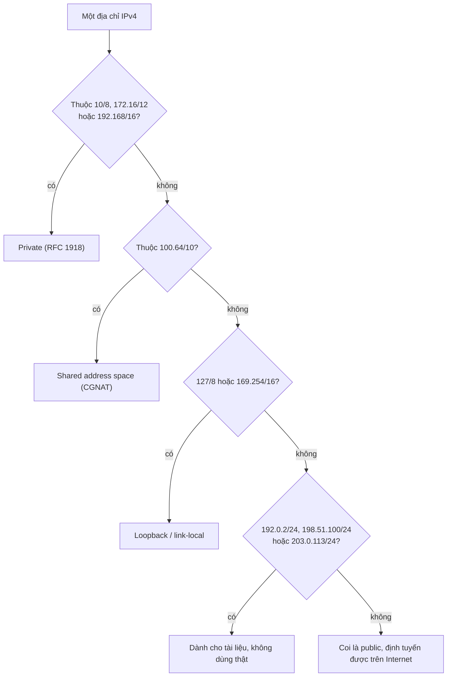

---
tags:
  - Must
  - IP
  - Concept
---

# Địa chỉ nào được dùng trong mạng nội bộ và địa chỉ nào thuộc về Internet? (Private, public và RFC 1918)

<!-- lint:allow-ip-file — chapter này cố ý nêu ví dụ sai (172.32.x.x) để minh họa -->

## Metadata

```yaml
Chapter: private-public-ip-rfc1918
Phase: 01 — foundation
Importance: Must
Status: draft
Prerequisites:
  - Phase 01 / 04-ipv4-addressing
  - Phase 01 / 05-cidr-subnetting
Used Later:
  - Phase 02 / 05-nat-pat
  - Phase 05 / 04-vpn-ipsec-site-to-site
  - Phase 06 / 01-vpc-subnet-az
  - Phase 06 / 13-cidr-planning-multi-env
Estimated Reading: 25 phút
Estimated Practice: 30 phút
```

## 1. Story

<!-- Mức bắt buộc (Must): Đủ -->
<!-- DRAFT: người học cần viết lại bằng lời mình -->

Nhóm `shopnet` dựng môi trường `stg` với dải `172.32.0.0/16` vì "trông giống `172.16`, chắc cũng là địa chỉ nội bộ". Mọi thứ chạy tốt vài tháng. Rồi một dịch vụ của nhà cung cấp bên ngoài, có địa chỉ **công khai thật** nằm đúng trong dải đó, trở nên không truy cập được từ `stg`. Gói tin gửi đến địa chỉ ấy bị mạng của `stg` coi là "địa chỉ trong nhà" và không bao giờ ra Internet.

Dải `172.16.0.0` đến `172.31.255.255` mới là private; `172.32.x.x` đã thuộc không gian công khai. Chapter này nói rõ ranh giới đó, vì chọn nhầm dải khi dựng mạng là sai lầm rất khó sửa sau này (xem `01/05`).

## 2. Objectives

<!-- Mức bắt buộc (Must): Đủ -->
<!-- DRAFT: người học cần viết lại bằng lời mình -->

Sau chapter này bạn có thể:

- Liệt kê chính xác ba dải private theo RFC 1918 kèm prefix.
- Phân loại một địa chỉ bất kỳ: private, public, loopback, link-local, shared (CGNAT), dành cho tài liệu.
- Giải thích vì sao `172.32.x.x` không phải private và hậu quả khi dùng nhầm.
- Giải thích vì sao hai mạng private cùng dải không thể nối với nhau mà không đổi địa chỉ hoặc dùng NAT.
- Chọn dải cho các môi trường để tránh xung đột và chọn địa chỉ ví dụ an toàn cho tài liệu.

## 3. Prerequisites

<!-- Mức bắt buộc (Must): Đủ -->
<!-- DRAFT: người học cần viết lại bằng lời mình -->

> Xem lại: [ipv4-addressing](04-ipv4-addressing.md)
> Xem lại: [cidr-subnetting](05-cidr-subnetting.md)

## 4. Why it exists

<!-- Mức bắt buộc (Must): Đủ -->
<!-- DRAFT: người học cần viết lại bằng lời mình -->

Số địa chỉ IPv4 công khai có hạn. Nếu mọi máy trong mọi công ty đều cần một địa chỉ công khai riêng thì sẽ hết từ lâu. Giải pháp là dành riêng một số dải để **ai cũng dùng lại trong mạng của mình** mà không cần xin phép: các dải **private** (RFC 1918). Vì ai cũng dùng lại, chúng **không được định tuyến trên Internet**; muốn ra ngoài phải qua NAT (`02/05`).

Hệ quả khi dùng sai:

- Dùng dải công khai làm dải nội bộ (Story): đích thật bên ngoài bị "che" bởi mạng của bạn.
- Hai mạng private cùng dải: khi cần nối (VPN, peering, sáp nhập) sẽ xung đột, nên phải đổi địa chỉ cả một mạng, rất tốn kém.
- Dùng IP công khai thật làm ví dụ trong tài liệu: dễ trỏ nhầm tới hệ thống của người khác (và vi phạm quy tắc dữ liệu của sách này).

## 5. Mental model

<!-- Mức bắt buộc (Must): Đủ -->
<!-- DRAFT: người học cần viết lại bằng lời mình -->

Số nhà trong từng khu chung cư có thể trùng nhau ("phòng 301" có ở nhiều khu), vì chỉ có ý nghĩa **bên trong khu**. Địa chỉ đầy đủ ghi cả quận, thành phố thì duy nhất. Private là "số phòng trong khu"; public là "địa chỉ đầy đủ".

**Tóm tắt một câu:** private dùng lại được và không ra Internet; public là duy nhất và định tuyến được; chọn nhầm hoặc trùng sẽ vỡ khi cần nối mạng.

## 6. How it works

<!-- Mức bắt buộc (Must): Đủ -->
<!-- DRAFT: người học cần viết lại bằng lời mình -->

Các từ cần biết (nhắc lại và bổ sung):

- **Private IP address (địa chỉ IP riêng — địa chỉ thuộc dải dành cho mạng nội bộ; Internet không định tuyến dải này).**
- **Public IP address (địa chỉ IP công khai — địa chỉ duy nhất toàn Internet, ai cũng gửi gói tới được).**
- **RFC 1918 (tài liệu chuẩn định nghĩa ba dải địa chỉ private).**
- **Documentation address range (dải địa chỉ dành cho tài liệu — dải cố ý không dùng thật, để dùng làm ví dụ mà không trỏ nhầm tới ai).**
- **Shared address space / CGNAT (không gian địa chỉ dùng chung / NAT cấp nhà mạng — dải mà nhà mạng dùng để nối thiết bị của họ với khách hàng; không phải private cũng không phải public).**

**Ba dải private theo RFC 1918:**

| Dải | Prefix | Phạm vi | Số địa chỉ |
|---|---|---|---|
| `10.0.0.0/8` | /8 | `10.0.0.0` – `10.255.255.255` | 16.777.216 |
| `172.16.0.0/12` | /12 | `172.16.0.0` – `172.31.255.255` | 1.048.576 |
| `192.168.0.0/16` | /16 | `192.168.0.0` – `192.168.255.255` | 65.536 |

Chú ý dải thứ hai: `/12` nghĩa là chỉ 12 bit đầu cố định, nên octet thứ hai chạy từ 16 đến 31 (16 giá trị). Hết 31 là hết dải; `172.32.0.0` trở đi là **không gian công khai**.

**Phân loại một địa chỉ:**



**Đọc sơ đồ:** kiểm tra từ trường hợp đặc biệt đến chung chung. Chỉ khi một địa chỉ không rơi vào dải nào trong số trên thì nó mới là địa chỉ công khai có thể là của một bên nào đó ngoài Internet. Ba dải tài liệu `192.0.2.0/24`, `198.51.100.0/24`, `203.0.113.0/24` (RFC 5737) được thiết kế **không xuất hiện trên Internet công khai**, nên là lựa chọn an toàn cho ví dụ. `100.64.0.0/10` (RFC 6598) dành cho nhà mạng triển khai CGNAT.

**Xung đột khi nối mạng.** Hai mạng cùng dùng `10.0.0.0/16` hoàn toàn bình thường khi tách biệt. Khi nối chúng (VPN, peering…), mỗi bên thấy địa chỉ đích "trong nhà" và không đưa ra ngoài, nên không liên lạc được. Cách chữa: đổi địa chỉ một bên hoặc dùng NAT giữa hai bên, cả hai đều tốn kém. Vì vậy cần **quy hoạch dải khác nhau cho từng mạng/môi trường ngay từ đầu** (`01/05`).

**Thực tế cần tránh:** các dải mà router gia đình hay dùng mặc định (như `192.168.0.0/24`, `192.168.1.0/24`) rất hay trùng với mạng nhà của nhân viên khi họ kết nối VPN về công ty; chọn dải ít phổ biến cho mạng công ty.

> Cách NAT cho phép máy private ra Internet ở `02/05`; chọn dải cho nhiều môi trường trên AWS ở `06/13`.

<!-- verified: 2026-10-02 https://www.rfc-editor.org/rfc/rfc1918 -->
<!-- verified: 2026-10-02 https://www.rfc-editor.org/rfc/rfc5737 -->
<!-- verified: 2026-10-02 https://www.rfc-editor.org/rfc/rfc6598 -->

## 7. Key settings

<!-- Mức bắt buộc (Must): Đủ -->
<!-- DRAFT: người học cần viết lại bằng lời mình -->

Khi chọn dải cho mạng:

| Câu hỏi | Gợi ý |
|---|---|
| Có thể nối với mạng khác sau này không? | Giả định là **có**; chọn dải không trùng mạng nào bạn có thể nối |
| Có nhiều môi trường không? | Mỗi môi trường một dải riêng (ví dụ `prd=10.0.0.0/16`, `stg=10.1.0.0/16`) |
| Dải có đủ lớn để mở rộng không? | Chừa chỗ; xem `01/05` |
| Có ai dùng dải đó ở nhà/đối tác không? | Tránh các dải mặc định phổ biến của router gia đình |
| Ví dụ trong tài liệu | Dùng RFC 5737 cho địa chỉ công khai giả |

## 8. AWS mapping

<!-- Mức bắt buộc (Must): Đủ nếu có liên quan AWS -->
<!-- DRAFT: người học cần viết lại bằng lời mình -->

Chapter này giữ trung lập vendor. Hướng liên hệ (kiểm chứng ở `06/01`, `06/13`):

| Khái niệm | Trên AWS (dự kiến) |
|---|---|
| Dải CIDR của mạng riêng | CIDR của VPC; thường chọn trong các dải RFC 1918 |
| Tránh trùng dải khi nối mạng | Quan trọng khi dùng peering, VPN, Transit Gateway |

`[CHƯA KIỂM CHỨNG]` — các giới hạn và khuyến nghị cụ thể của AWS phải kiểm tra với tài liệu hiện tại ở Phase 06.

## 9. Hands-on lab

<!-- Mức bắt buộc (Must): Đủ + expected-output.txt -->
<!-- DRAFT: người học cần viết lại bằng lời mình -->

Chi tiết ở `labs/phase-01-foundation/chapter-06-private-public-ip-rfc1918/README.md`.

**1. Predict:** địa chỉ nào dưới đây là private (RFC 1918)?

`10.255.255.254`, `172.15.255.255`, `172.16.0.1`, `172.31.255.255`, `172.32.0.1`, `192.167.1.1`, `192.168.200.5` <!-- lint:allow-ip -->

**2. Run:**

```bash
python3 - <<'PY'
import ipaddress as i
PRIVATE = [i.ip_network(n) for n in ('10.0.0.0/8', '172.16.0.0/12', '192.168.0.0/16')]
for a in ('10.255.255.254', '172.15.255.255', '172.16.0.1', '172.31.255.255', '172.32.0.1', '192.167.1.1', '192.168.200.5'):  # lint:allow-ip
    print(a, any(i.ip_address(a) in n for n in PRIVATE))
PY
```

**3. Verify:** so kết quả với dự đoán. Đáp án để tự đối chiếu:

??? success "Đáp án (tính toán, không phải output lab)"
    `10.255.255.254` private; `172.15.255.255` **không** (nằm dưới `172.16`); `172.16.0.1` private; `172.31.255.255` private; `172.32.0.1` **không**; `192.167.1.1` **không**; `192.168.200.5` private. <!-- lint:allow-ip -->

Output thật: `[CHƯA CHẠY]`.

## 10. Break it

<!-- Mức bắt buộc (Must): Đủ (≥ 1 Break it) -->
<!-- DRAFT: người học cần viết lại bằng lời mình -->

**Gây lỗi:** mô phỏng việc một mạng chiếm dải công khai (như Story) bằng một route trong container.

```powershell
docker run --rm -it --cap-add NET_ADMIN alpine sh
```

Trong container:

```sh
ip route get 172.32.0.1
ip route add blackhole 172.32.0.0/16
ip route get 172.32.0.1
```

**Dự đoán:** lần đầu `ip route get` đi theo default route (ra ngoài); sau khi thêm route `blackhole` cho `172.32.0.0/16`, gói tới mọi địa chỉ trong dải đó bị loại bỏ, đúng như mạng của `stg` "nuốt" địa chỉ công khai thật trong Story.

**Ý nghĩa:** dùng nhầm dải công khai làm dải nội bộ làm đích thật bên ngoài trở nên không truy cập được. <!-- lint:allow-ip -->

**Khôi phục:** `exit`; container `--rm` tự xóa.

Kết quả thật: `[CHƯA CHẠY]`.

## 11. Troubleshooting

<!-- Mức bắt buộc (Must): Đủ -->
<!-- DRAFT: người học cần viết lại bằng lời mình -->

| Triệu chứng | Kiểm tra theo thứ tự | Công cụ |
|---|---|---|
| Một dịch vụ công khai không truy cập được từ mạng nội bộ | Mạng nội bộ có dùng dải trùng với địa chỉ của dịch vụ đó không | `ip route get <IP dịch vụ>`; so với dải mạng nội bộ |
| Không nối được hai mạng (VPN, peering) | Hai dải CIDR có trùng/chồng lấn không | `ipaddress ... overlaps`; xem `01/05` |
| Nhân viên về nhà kết nối VPN thì mất mạng nhà hoặc mất VPN | Dải mạng nhà trùng dải công ty | `Get-NetRoute`/`ip route` khi bật VPN |
| Gặp địa chỉ `100.64.x.x` ở đâu đó | Đang sau CGNAT của nhà mạng; không phải private của bạn | Hỏi nhà mạng; `traceroute` |

Ghi kết quả thật của mục 10: `[CHƯA CHẠY]`.

## 12. Security & cost

<!-- Mức bắt buộc (Must): Đủ -->
<!-- DRAFT: người học cần viết lại bằng lời mình -->

- **Private không có nghĩa là an toàn.** Địa chỉ riêng chỉ nghĩa là không định tuyến trên Internet; máy trong mạng vẫn có thể tấn công nhau, và NAT/firewall mới là cơ chế bảo vệ (Phase 05).
- Không đưa IP/CIDR nội bộ thật của hệ thống thật vào tài liệu công khai; dùng RFC 5737 (public giả) hoặc RFC 1918 với giá trị giả.
- Rò rỉ địa chỉ nội bộ (qua log, thông báo lỗi) giúp kẻ tấn công hiểu cấu trúc mạng.
- Chi phí: chọn sai dải có thể buộc phải tạo lại mạng và gián đoạn dịch vụ; chapter này local nên không phát sinh chi phí.

## 13. Misconceptions

<!-- Mức bắt buộc (Must): Đủ -->
<!-- DRAFT: người học cần viết lại bằng lời mình -->

| Hiểu nhầm | Sự thật |
|---|---|
| "`172.x.x.x` đều là private" | Chỉ `172.16.0.0` đến `172.31.255.255` (`/12`); `172.32.x.x` là công khai |
| "Địa chỉ private an toàn vì không ai truy cập được" | Chỉ không định tuyến trên Internet; vẫn cần firewall/security group |
| "Public IP nghĩa là ai cũng vào được máy" | Địa chỉ định tuyến được, nhưng firewall vẫn chặn/mở theo chính sách |
| "Dải `192.168.x.x` của tôi là duy nhất" | Hàng triệu mạng khác dùng cùng dải; xung đột khi nối |
| "`100.64.0.0/10` là private" | Là dải dùng chung cho nhà mạng (CGNAT), không phải RFC 1918 |

## 14. Interview questions

<!-- Mức bắt buộc (Must): Đủ -->
<!-- DRAFT: người học cần viết lại bằng lời mình -->

### Q1 (Junior) — Liệt kê ba dải private của RFC 1918.

**Gợi ý ý chính:**
- Ba prefix và phạm vi của từng dải.
- Điểm dễ nhầm nhất ở dải thứ hai.

??? success "Đáp án mẫu (tự trả lời trước khi mở)"
    `10.0.0.0/8`, `172.16.0.0/12` (`172.16.0.0` đến `172.31.255.255`), `192.168.0.0/16`. Dễ nhầm: `172.32.x.x` không thuộc dải private.

### Q2 (Middle) — Vì sao hai mạng cùng dùng `10.0.0.0/16` không nối được với nhau?

**Gợi ý ý chính:**
- Máy xem địa chỉ đích là "trong nhà" hay "ngoài nhà"?
- Có cách chữa nào, chi phí ra sao?

??? success "Đáp án mẫu (tự trả lời trước khi mở)"
    Mỗi bên coi mọi địa chỉ trong `10.0.0.0/16` là mạng của mình và không chuyển ra ngoài, nên không thể phân biệt máy bên kia. Chữa bằng cách đổi địa chỉ một bên hoặc dùng NAT giữa hai bên; cả hai đều tốn kém, nên cần quy hoạch trước.

### Q3 (Middle) — Vì sao tài liệu nên dùng `192.0.2.0/24`, `198.51.100.0/24`, `203.0.113.0/24` làm ví dụ?

**Gợi ý ý chính:**
- Ai có thể sở hữu một địa chỉ công khai thật?
- Dải này có xuất hiện trên Internet không?

??? success "Đáp án mẫu (tự trả lời trước khi mở)"
    Đó là các dải dành riêng cho tài liệu (RFC 5737), cố ý không dùng thật và không được định tuyến trên Internet, nên ví dụ không vô tình trỏ tới hệ thống của ai.

## 15. Exercises

<!-- Mức bắt buộc (Must): Đủ -->
<!-- DRAFT: người học cần viết lại bằng lời mình -->

1. **Phân loại địa chỉ.** Chọn 8 địa chỉ (có cả private, public, loopback, link-local, CGNAT, tài liệu) rồi phân loại. *Deliverable:* bảng 8 dòng gồm địa chỉ, loại và lý do.
2. **Sự cố Story.** *Deliverable:* đoạn 4–6 câu giải thích vì sao `stg` không truy cập được dịch vụ ngoài, kèm đề xuất dải thay thế và cách chuyển đổi.
3. **Kế hoạch dải cho ba môi trường** (`prd`, `stg`, `dev`) và mạng nhà nhân viên. *Deliverable:* bảng dải CIDR, lý do chọn, và kiểm tra không chồng lấn (`01/05`).

## 16. Cheat sheet

<!-- Mức bắt buộc (Must): Đủ -->
<!-- DRAFT: người học cần viết lại bằng lời mình -->

| Loại | Dải |
|---|---|
| Private (RFC 1918) | `10.0.0.0/8`, `172.16.0.0/12`, `192.168.0.0/16` |
| Shared / CGNAT (RFC 6598) | `100.64.0.0/10` |
| Tài liệu (RFC 5737) | `192.0.2.0/24`, `198.51.100.0/24`, `203.0.113.0/24` |
| Loopback / link-local | `127.0.0.0/8` / `169.254.0.0/16` |

**Nhớ:** `172.16`–`172.31` là private; `172.32+` không. Quy hoạch dải khác nhau cho mỗi mạng để còn nối được.

## 17. Glossary terms

<!-- Mức bắt buộc (Must): Đủ -->
<!-- DRAFT: người học cần viết lại bằng lời mình -->

- Private IP address / địa chỉ IP riêng / プライベートIPアドレス
- Public IP address / địa chỉ IP công khai / グローバルIPアドレス
- RFC 1918 / dải địa chỉ riêng theo RFC 1918 / RFC 1918
- Documentation address range / dải địa chỉ dành cho tài liệu / ドキュメント用アドレス範囲
- Shared address space / không gian địa chỉ dùng chung / 共有アドレス空間

## 18. Further reading

<!-- Mức bắt buộc (Must): Đủ -->
<!-- DRAFT: người học cần viết lại bằng lời mình -->

Kiểm tra ngày 2026-10-02:

- RFC 1918 — Address Allocation for Private Internets: https://www.rfc-editor.org/rfc/rfc1918
- RFC 5737 — IPv4 Address Blocks Reserved for Documentation: https://www.rfc-editor.org/rfc/rfc5737
- RFC 6598 — IANA-Reserved IPv4 Prefix for Shared Address Space: https://www.rfc-editor.org/rfc/rfc6598
