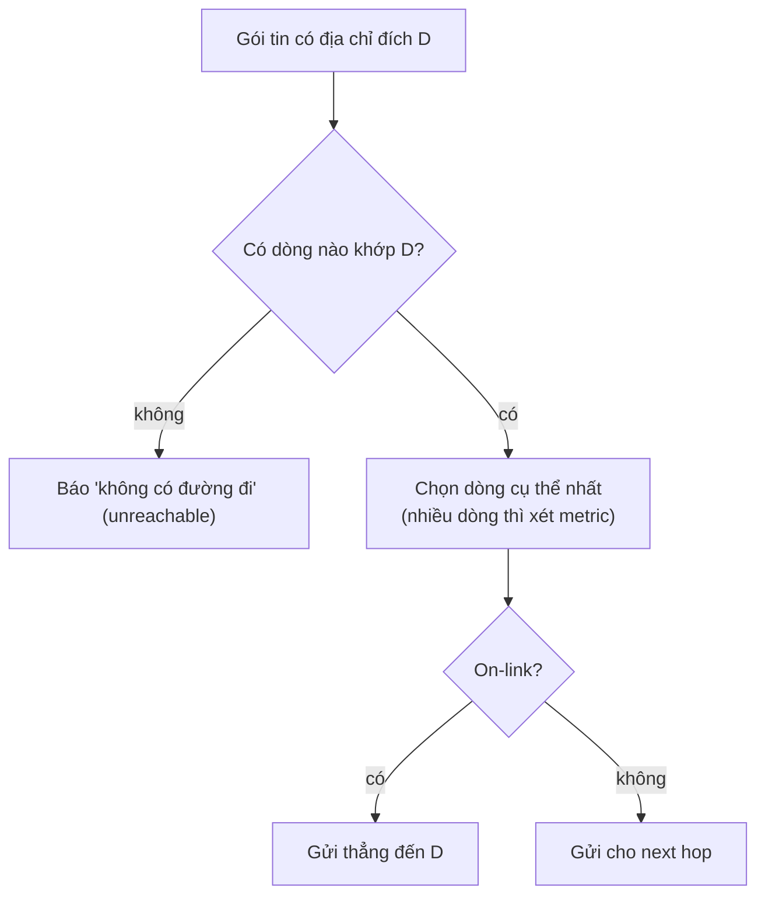

---
tags:
  - Must
  - Routing
  - Concept
  - Troubleshooting
---

# Máy tính biết gói tin này phải đi đường nào bằng cách nào? (Bảng định tuyến)

## Metadata

```yaml
Chapter: routing-table-basics
Phase: 02 — routing
Importance: Must
Status: draft
Prerequisites:
  - Phase 00 / 02-linux-network-tools
  - Phase 01 / 03-ethernet-mac-arp
  - Phase 01 / 05-cidr-subnetting
Used Later:
  - Phase 02 / 02-longest-prefix-match
  - Phase 03 / 04-icmp-ping-traceroute
  - Phase 07 / 01-network-namespaces
Estimated Reading: 25 phút
Estimated Practice: 40 phút
```

## 1. Story

<!-- Mức bắt buộc (Must): Đủ -->
<!-- DRAFT: người học cần viết lại bằng lời mình -->

Nhóm `shopnet` thêm một mạng thử nghiệm `10.1.0.0/16` và nối nó với mạng `10.0.0.0/16` bằng một router. Máy thử nghiệm `10.1.0.15` ping được router, ping được server `10.0.1.20`... nhưng **không bao giờ nhận được trả lời**. Capture cho thấy server **có nhận** gói tin và có gửi trả lời đi, nhưng trả lời không về đến máy thử nghiệm.

Nguyên nhân: server không có dòng nào trong bảng định tuyến nói "muốn đến `10.1.0.0/16` thì đi qua router này". Nó đưa gói trả lời cho đường mặc định, và gói đó đi lạc. Chapter này giải thích bảng định tuyến và vì sao **cả hai chiều** đều cần có đường.

## 2. Objectives

<!-- Mức bắt buộc (Must): Đủ -->
<!-- DRAFT: người học cần viết lại bằng lời mình -->

Sau chapter này bạn có thể:

- Đọc một bảng định tuyến và nói mỗi dòng có nghĩa gì.
- Giải thích sự khác nhau giữa route "gửi thẳng" (on-link) và route "gửi qua gateway".
- Dự đoán được một gói tin đến một địa chỉ cho trước sẽ đi qua dòng nào trong bảng.
- Dùng `ip route get` (Linux) hoặc `Find-NetRoute` (Windows) để kiểm tra dự đoán.
- Giải thích vì sao thiếu route ở **một** chiều vẫn làm hỏng kết nối.

## 3. Prerequisites

<!-- Mức bắt buộc (Must): Đủ -->
<!-- DRAFT: người học cần viết lại bằng lời mình -->

> Xem lại: [linux-network-tools](../phase-00-lab-toolkit/02-linux-network-tools.md)
> Xem lại: [ethernet-mac-arp](../phase-01-foundation/03-ethernet-mac-arp.md)
> Xem lại: [cidr-subnetting](../phase-01-foundation/05-cidr-subnetting.md)

## 4. Why it exists

<!-- Mức bắt buộc (Must): Đủ -->
<!-- DRAFT: người học cần viết lại bằng lời mình -->

Mọi thiết bị gửi gói tin đều phải trả lời một câu: "gói này gửi tiếp cho ai?". Không thể nhớ đường đến từng máy trên mạng, nên mỗi thiết bị giữ một bảng rút gọn theo **dải địa chỉ** (CIDR). Bảng đó là **routing table**.

Nếu bảng thiếu hoặc sai:

- Không có dòng nào khớp → gói tin bị bỏ và nguồn nhận lỗi "không có đường đi" (hoặc im lặng).
- Dòng sai next hop → gói tin đi lạc hoặc bị chặn.
- Chỉ có route chiều đi, thiếu chiều về → kết nối "một chiều" như trong Story.

## 5. Mental model

<!-- Mức bắt buộc (Must): Đủ -->
<!-- DRAFT: người học cần viết lại bằng lời mình -->

Hình dung biển chỉ đường ở ngã tư: "đi khu A thì rẽ trái, đi khu B thì rẽ phải, **còn lại** thì đi thẳng". Mỗi thiết bị có một tờ biển như vậy; nó đọc địa chỉ đích rồi làm theo dòng khớp.

**Tóm tắt một câu:** routing table là danh sách "đích nào thì gửi đi đâu", và mỗi thiết bị tự quyết định chặng kế tiếp.

## 6. How it works

<!-- Mức bắt buộc (Must): Đủ -->
<!-- DRAFT: người học cần viết lại bằng lời mình -->

Các từ cần biết:

- **Routing (định tuyến — quá trình chọn đường cho gói tin).**
- **Routing table (bảng định tuyến — danh sách "đích nào thì gửi qua đường nào" mà mỗi thiết bị giữ).**
- **Route (tuyến/dòng định tuyến — một dòng trong bảng định tuyến).**
- **Next hop (chặng kế tiếp — thiết bị mà gói tin được đưa cho ở bước tiếp theo).**
- **On-link (nằm ngay trên đường dây — đích ở cùng mạng, gửi thẳng không cần qua router).**
- **Metric (số đo chi phí — khi nhiều dòng cùng khớp, dòng có số nhỏ hơn được ưu tiên).**
- **Default route (tuyến mặc định — dòng `0.0.0.0/0`, khớp mọi địa chỉ; chỉ dùng khi không có dòng nào cụ thể hơn).**

**Một dòng route có bốn thành phần:** *đích* (một CIDR), *next hop* (gửi cho ai, hoặc "on-link"), *giao diện* (ra cổng nào), *metric*.

Ví dụ bảng của một laptop (Linux, dạng `ip route`):

```text
default via 192.168.1.1 dev eth0
192.168.1.0/24 dev eth0 scope link
```

- Dòng 2 (on-link): máy tự thêm dòng này khi có địa chỉ `192.168.1.20/24`. Mọi đích trong `192.168.1.0/24` được gửi thẳng.
- Dòng 1 (default): mọi đích còn lại gửi cho gateway `192.168.1.1`.

Trên Windows, `Get-NetRoute` biểu diễn tương tự: `DestinationPrefix 0.0.0.0/0` với `NextHop 192.168.1.1` là default route; `NextHop 0.0.0.0` nghĩa là on-link (cùng mạng con).



**Đọc sơ đồ:** việc đầu tiên là tìm dòng khớp. "Khớp" nghĩa là địa chỉ đích nằm trong dải CIDR của dòng đó. Nếu có nhiều dòng khớp, dòng **cụ thể nhất** (prefix dài nhất) thắng (chi tiết ở `02/02`); metric chỉ phân định khi các dòng có cùng độ cụ thể. Sau khi chọn dòng: on-link thì gửi thẳng, ngược lại đưa cho next hop (một router khác sẽ làm lại thao tác này).

**Hai chiều đều cần route.** Gói đi và gói về là hai gói tin độc lập, mỗi gói đều đi tra bảng ở từng thiết bị. Trong Story, chiều đi hoạt động nhưng server thiếu dòng cho `10.1.0.0/16`, nên chiều về rơi vào default route và lạc.

> Chi tiết "dòng cụ thể nhất" ở `02/02`; default route và gateway ở `02/03`; route cấu hình tay ở `02/04`.

## 7. Key settings

<!-- Mức bắt buộc (Must): Đủ -->
<!-- DRAFT: người học cần viết lại bằng lời mình -->

| Thành phần | Ý nghĩa | Nếu sai |
|---|---|---|
| Destination (CIDR) | Dải địa chỉ mà dòng này áp dụng | Dòng không bao giờ khớp hoặc khớp nhầm |
| Next hop | Gửi cho ai (hoặc on-link) | Gói tin đi lạc hoặc bị bỏ |
| Interface | Ra cổng/đường dây nào | Gửi nhầm đường |
| Metric | Ưu tiên khi nhiều dòng khớp như nhau | Chọn đường không mong muốn |

**Lệnh xem bảng:**

- Linux: `ip route`; hỏi một đích cụ thể: `ip route get <đích>`.
- Windows PowerShell: `Get-NetRoute -AddressFamily IPv4`; hỏi một đích cụ thể: `Find-NetRoute -RemoteIPAddress <đích>`.

<!-- verified: 2026-10-02 https://learn.microsoft.com/en-us/powershell/module/nettcpip/get-netroute -->
<!-- verified: 2026-10-02 https://learn.microsoft.com/en-us/powershell/module/nettcpip/find-netroute -->
<!-- verified: 2026-10-02 https://man7.org/linux/man-pages/man8/ip-route.8.html -->

Theo tài liệu Microsoft, `Get-NetRoute` lấy thông tin từ bảng định tuyến (đích, next hop, metric); route metric được cộng với interface metric và route có tổng nhỏ nhất được chọn; `Find-NetRoute` tìm địa chỉ nguồn và route tốt nhất để đến một địa chỉ đích. Theo man page `ip-route`, `ip route get` in route như nhân Linux nhìn thấy, và route `blackhole` loại bỏ gói tin một cách im lặng.

## 8. AWS mapping

<!-- Mức bắt buộc (Must): Đủ nếu có liên quan AWS -->
<!-- DRAFT: người học cần viết lại bằng lời mình -->

Chapter này chưa dùng dịch vụ AWS. Hướng liên hệ:

| Khái niệm | Trên AWS (dự kiến) |
|---|---|
| Routing table của một thiết bị | Route table gắn với subnet |
| Dòng "đích → next hop" | Một route: destination CIDR → target (ví dụ gateway ra Internet) |
| Default route | Route `0.0.0.0/0` |

`[CHƯA KIỂM CHỨNG]` — chi tiết và kiểm chứng ở `06/02`.

## 9. Hands-on lab

<!-- Mức bắt buộc (Must): Đủ + expected-output.txt -->
<!-- DRAFT: người học cần viết lại bằng lời mình -->

Chi tiết ở `labs/phase-02-routing/chapter-01-routing-table-basics/README.md`.

**1. Predict:** trong bảng của máy bạn:

- Dòng default route trỏ tới next hop nào?
- Một địa chỉ cùng mạng con với bạn sẽ đi qua dòng on-link hay default?
- `203.0.113.10` sẽ đi qua dòng nào?

**2. Run (Windows PowerShell):**

```powershell
Get-NetRoute -AddressFamily IPv4
```

```powershell
Find-NetRoute -RemoteIPAddress 203.0.113.10
```

**Run (Linux/WSL2 hoặc container):**

```bash
ip route
ip route get 203.0.113.10
```

**3. Verify:** dòng được chọn có đúng dự đoán không? Next hop có khớp default gateway của `01/01` không?

Output thật: `[CHƯA CHẠY]`. Khi lưu output, thay IP thật bằng IP giả.

## 10. Break it

<!-- Mức bắt buộc (Must): Đủ (≥ 1 Break it) -->
<!-- DRAFT: người học cần viết lại bằng lời mình -->

Làm trong container, không đụng máy thật:

```powershell
docker run --rm -it --cap-add NET_ADMIN alpine sh
```

Trong container:

```sh
ip route get 203.0.113.10
ip route add blackhole 203.0.113.10/32
ip route get 203.0.113.10
ping -c 1 -W 2 203.0.113.10
ip route del blackhole 203.0.113.10/32
ip route del default
ip route get 203.0.113.10
```

**Dự đoán:**

- Lần `ip route get` đầu: đi qua default route.
- Sau khi thêm `blackhole`: route `blackhole` thắng (cụ thể hơn default) và gói bị loại bỏ; ping báo lỗi ngay thay vì chờ timeout.
- Sau khi xóa blackhole và xóa default route: không còn dòng nào khớp, `ip route get` báo không có đường đi ("Network is unreachable").

**Ý nghĩa:** thêm một dòng cụ thể hơn đủ để chặn một đích; xóa dòng mặc định làm mọi đích ngoài LAN biến mất.

**Khôi phục:** `exit`; container `--rm` tự xóa.

Kết quả thật: `[CHƯA CHẠY]`.

## 11. Troubleshooting

<!-- Mức bắt buộc (Must): Đủ -->
<!-- DRAFT: người học cần viết lại bằng lời mình -->

| Triệu chứng | Kiểm tra theo thứ tự | Công cụ |
|---|---|---|
| `Network is unreachable` (báo ngay) | Có dòng nào khớp đích không → có default route không | `ip route get <đích>`, `Find-NetRoute` |
| Gửi đi được nhưng không nhận trả lời (Story) | Máy đích có route về nguồn không → router giữa hai mạng có route cả hai chiều không | `ip route get <nguồn>` trên máy đích; capture ở `00/03` |
| Gói đi qua gateway lạ | Dòng nào được chọn → có dòng cụ thể hơn không mong muốn không | `ip route`, `ip route get` |
| Hai đường cùng khớp, chọn không như ý | Metric hai dòng | `Get-NetRoute`, `ip route` (cột metric) |
| Next hop không phản hồi | Next hop có nằm trong mạng on-link của mình không → thiết bị đó có chạy không | `ip route`, `ping <next hop>` |

Ghi kết quả thật của mục 10: `[CHƯA CHẠY]`.

## 12. Security & cost

<!-- Mức bắt buộc (Must): Đủ -->
<!-- DRAFT: người học cần viết lại bằng lời mình -->

- Route sai có thể **chuyển hướng lưu lượng** qua thiết bị không mong muốn; thay đổi route trên môi trường thật cần review và có kế hoạch khôi phục.
- Route `blackhole` hữu ích để chặn đích nhưng cũng dễ làm "mất" dịch vụ nếu quên xóa.
- Không đưa bảng route/IP thật của hệ thống thật vào tài liệu công khai.
- Chi phí: không phát sinh.

## 13. Misconceptions

<!-- Mức bắt buộc (Must): Đủ -->
<!-- DRAFT: người học cần viết lại bằng lời mình -->

| Hiểu nhầm | Sự thật |
|---|---|
| "Chỉ router mới có bảng định tuyến" | Mọi máy (laptop, server, container) đều có |
| "Có route đi là gói trả về tự có đường" | Chiều về là gói khác; cần route ở phía đích |
| "Default route là route tốt nhất" | Nó là route **ít cụ thể nhất**, chỉ dùng khi không có dòng nào khác khớp |
| "Metric luôn quyết định route nào thắng" | Độ cụ thể (prefix dài hơn) được xét trước; metric chỉ phân định khi ngang nhau |
| "On-link nghĩa là cùng máy" | On-link là cùng mạng, gửi thẳng không qua router |

## 14. Interview questions

<!-- Mức bắt buộc (Must): Đủ -->
<!-- DRAFT: người học cần viết lại bằng lời mình -->

### Q1 (Junior) — Máy làm gì khi không có route nào khớp địa chỉ đích?

**Gợi ý ý chính:**
- Gói tin có được gửi đi không?
- Người dùng sẽ thấy lỗi như thế nào?

??? success "Đáp án mẫu (tự trả lời trước khi mở)"
    Máy không biết gửi gói tin cho ai, nên không gửi và báo lỗi kiểu "Network is unreachable" ngay lập tức (khác với timeout, nơi gói tin đã đi ra nhưng không có hồi âm).

### Q2 (Junior) — On-link khác "qua gateway" thế nào?

**Gợi ý ý chính:**
- Đích ở cùng mạng hay khác mạng?
- Ai là bên nhận gói tin đầu tiên?

??? success "Đáp án mẫu (tự trả lời trước khi mở)"
    On-link: đích nằm trong cùng mạng, máy gửi thẳng. Qua gateway: đích ở mạng khác, máy đưa gói cho router (next hop) và router tiếp tục chuyển.

### Q3 (Middle) — Máy A ping được B nhưng không nhận được trả lời. Bạn kiểm tra gì?

**Gợi ý ý chính:**
- Gói trả lời đi theo bảng định tuyến của ai?
- B có biết đường về A không?

??? success "Đáp án mẫu (tự trả lời trước khi mở)"
    Kiểm tra bảng định tuyến của B (và các router ở giữa) xem có route về mạng của A không; capture để xem B có gửi trả lời không và nó đi đâu. Thiếu route chiều về là nguyên nhân kinh điển của kết nối "một chiều".

## 15. Exercises

<!-- Mức bắt buộc (Must): Đủ -->
<!-- DRAFT: người học cần viết lại bằng lời mình -->

1. **Đọc bảng của bạn.** *Deliverable:* bảng 4 cột (đích, next hop, giao diện, metric) cho tối đa 5 dòng route của máy bạn (đã thay IP thật), mỗi dòng kèm 1 câu giải thích.
2. **Dự đoán đường đi.** Cho bảng ở mục 6 và đích `192.168.1.77`, `198.51.100.5`, `127.0.0.1`. *Deliverable:* với mỗi đích, ghi dòng được chọn và vì sao.
3. **Sự cố Story.** *Deliverable:* sơ đồ Mermaid hai chiều (đi và về) giữa `10.1.0.15` và `10.0.1.20`, đánh dấu chỗ thiếu route, kèm đoạn giải thích 3–5 câu.

## 16. Cheat sheet

<!-- Mức bắt buộc (Must): Đủ -->
<!-- DRAFT: người học cần viết lại bằng lời mình -->

| Cần làm | Linux | Windows PowerShell |
|---|---|---|
| Xem bảng định tuyến | `ip route` | `Get-NetRoute -AddressFamily IPv4` |
| Hỏi đường tới một đích | `ip route get <đích>` | `Find-NetRoute -RemoteIPAddress <đích>` |
| Tìm default gateway | `ip route show default` | `Get-NetRoute -DestinationPrefix 0.0.0.0/0` |

**Dòng route =** đích (CIDR) + next hop + giao diện + metric. **Quy tắc:** cụ thể nhất thắng; không khớp → unreachable; cần route cả hai chiều.

## 17. Glossary terms

<!-- Mức bắt buộc (Must): Đủ -->
<!-- DRAFT: người học cần viết lại bằng lời mình -->

- Routing / định tuyến / ルーティング
- Routing table / bảng định tuyến / ルーティングテーブル
- Route / tuyến / 経路
- Next hop / chặng kế tiếp / ネクストホップ
- On-link / nằm ngay trên đường dây / 直接接続
- Metric / số đo chi phí / メトリック
- Default route / tuyến mặc định / デフォルトルート

## 18. Further reading

<!-- Mức bắt buộc (Must): Đủ -->
<!-- DRAFT: người học cần viết lại bằng lời mình -->

Kiểm tra ngày 2026-10-02:

- `ip-route(8)`: https://man7.org/linux/man-pages/man8/ip-route.8.html
- `Get-NetRoute`: https://learn.microsoft.com/en-us/powershell/module/nettcpip/get-netroute
- `Find-NetRoute`: https://learn.microsoft.com/en-us/powershell/module/nettcpip/find-netroute
