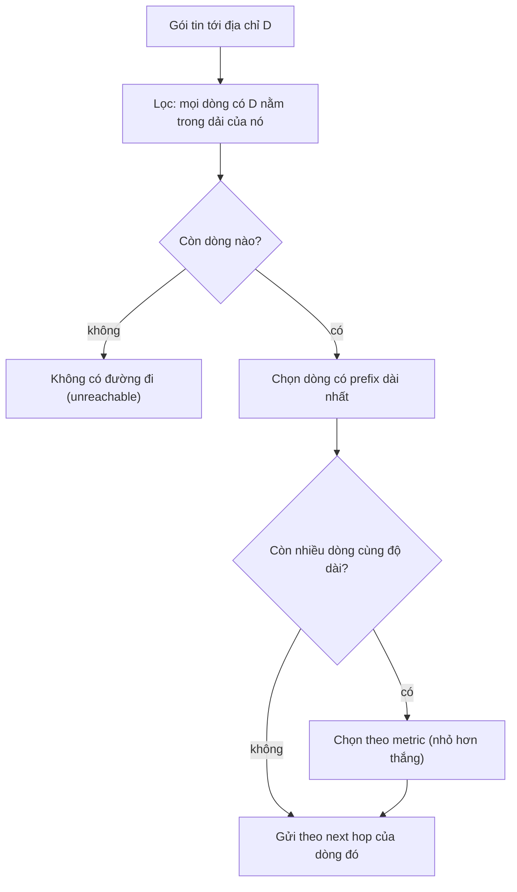

---
tags:
  - Must
  - Routing
  - Concept
  - Troubleshooting
---

# Khi nhiều dòng route cùng khớp một địa chỉ, máy chọn dòng nào? (Longest prefix match)

<!-- lint:allow-ip-file — chapter nêu địa chỉ mạng 128.0.0.0/1 như một prefix route, không phải IP máy -->

## Metadata

```yaml
Chapter: longest-prefix-match
Phase: 02 — routing
Importance: Must
Status: draft
Prerequisites:
  - Phase 02 / 01-routing-table-basics
Used Later:
  - Phase 02 / 03-default-route-gateway
  - Phase 02 / 04-static-route
  - Phase 02 / 06-asymmetric-routing
Estimated Reading: 25 phút
Estimated Practice: 40 phút
```

## 1. Story

<!-- Mức bắt buộc (Must): Đủ -->
<!-- DRAFT: người học cần viết lại bằng lời mình -->

Một server `shopnet` bỗng không ai truy cập được. Địa chỉ IP đúng, security group đúng, dịch vụ đang chạy, và route cho cả mạng `10.0.5.0/24` cũng đúng. Sau hai tiếng, một kỹ sư chạy lệnh hỏi đường đi tới đúng địa chỉ server (`10.0.5.20`) và thấy gói tin bị đẩy vào một route lạ: một dòng `10.0.5.20/32` do ai đó thêm cách đây vài tháng để thử nghiệm rồi quên xóa.

Dòng `/32` đó chỉ khớp **một** địa chỉ, nhưng nó **thắng** mọi route rộng hơn đang khớp địa chỉ ấy. Chapter này giải thích quy tắc chọn route khi có nhiều dòng cùng khớp, và vì sao quy tắc đó vừa là công cụ mạnh vừa là nguồn của những lỗi khó thấy.

## 2. Objectives

<!-- Mức bắt buộc (Must): Đủ -->
<!-- DRAFT: người học cần viết lại bằng lời mình -->

Sau chapter này bạn có thể:

- Phát biểu quy tắc longest prefix match và áp dụng nó để chọn route cho một địa chỉ đích.
- Giải thích vì sao thứ tự dòng trong bảng định tuyến không quyết định route nào thắng.
- Phân biệt "độ cụ thể" (độ dài prefix) với metric và nói thứ nào được xét trước.
- Dùng `ip route get` hoặc `Find-NetRoute` để kiểm chứng route được chọn.
- Chẩn đoán lỗi "route đúng nhưng traffic đi sai" do một route cụ thể hơn che mất route rộng.

## 3. Prerequisites

<!-- Mức bắt buộc (Must): Đủ -->
<!-- DRAFT: người học cần viết lại bằng lời mình -->

> Xem lại: [routing-table-basics](01-routing-table-basics.md)

Bạn cần biết mỗi dòng route gồm đích (CIDR), next hop, giao diện, metric (`02/01`) và cách đọc prefix `/n` (`01/05`).

## 4. Why it exists

<!-- Mức bắt buộc (Must): Đủ -->
<!-- DRAFT: người học cần viết lại bằng lời mình -->

Trong thực tế, các dòng route **chồng lên nhau là chuyện bình thường**. Ví dụ: một dòng cho cả `10.0.0.0/16`, một dòng riêng cho `10.0.5.0/24` nằm bên trong nó, và một route mặc định `0.0.0.0/0` khớp mọi thứ. Một địa chỉ như `10.0.5.7` khớp cả ba dòng. Máy cần một quy tắc **duy nhất, không mơ hồ** để chọn.

Quy tắc đó là **longest prefix match (khớp tiền tố dài nhất)**: chọn dòng có prefix dài nhất, tức là dòng **cụ thể nhất**. Nhờ vậy ta có thể:

- đặt một route rộng làm mặc định và thêm các **ngoại lệ** cụ thể bên trong;
- **gộp** nhiều mạng liền nhau thành một dòng mà vẫn giữ được ngoại lệ;
- chặn một địa chỉ cụ thể bằng một route `blackhole` (như ở `02/01`).

Nếu không hiểu quy tắc này, bạn sẽ thêm một route "rộng" và ngạc nhiên vì nó không có tác dụng với một nhóm địa chỉ (đã có route cụ thể hơn), hoặc thêm một route "hẹp" và vô tình cướp lưu lượng của route rộng (Story).

## 5. Mental model

<!-- Mức bắt buộc (Must): Đủ -->
<!-- DRAFT: người học cần viết lại bằng lời mình -->

Hình dung bản đồ có chú thích ở nhiều cấp: tỉnh, quận, phường, từng căn nhà. Khi bạn hỏi "chỗ này thuộc về ai?", bạn luôn đọc **chú thích nhỏ nhất chứa điểm đó**: nếu căn nhà có ghi riêng thì theo căn nhà, nếu không thì theo phường, rồi quận, rồi tỉnh.

**Tóm tắt một câu:** trong các dòng route cùng khớp địa chỉ đích, dòng có prefix dài nhất thắng; metric chỉ phân định khi độ dài prefix bằng nhau.

## 6. How it works

<!-- Mức bắt buộc (Must): Đủ -->
<!-- DRAFT: người học cần viết lại bằng lời mình -->

Các từ cần biết:

- **Longest prefix match (khớp tiền tố dài nhất — quy tắc chọn dòng route có độ dài prefix lớn nhất trong những dòng cùng khớp địa chỉ đích).**
- **Route aggregation (gộp tuyến — dùng một dòng prefix ngắn thay cho nhiều dòng prefix dài nằm trong nó).**
- **Blackhole route (tuyến "hố đen" — dòng route khiến gói tin tới đích bị loại bỏ thay vì chuyển đi).**

**Thuật toán** khi có gói tin tới địa chỉ `D`:

1. Lọc ra **mọi** dòng mà `D` nằm trong dải CIDR của dòng đó.
2. Trong số đó, chọn dòng có **prefix dài nhất** (`/32` dài hơn `/24` dài hơn `/16` dài hơn `/8` dài hơn `/0`).
3. Nếu còn nhiều dòng cùng độ dài prefix, mới xét **metric** (số nhỏ hơn thắng).
4. Gửi gói theo next hop của dòng được chọn; nếu không dòng nào khớp, báo không có đường đi.



**Đọc sơ đồ:** bước lọc đặt mọi dòng khớp lên bàn; sau đó **độ dài prefix được xét trước metric**. Điều này giải thích Story: dòng `/32` luôn dài hơn `/24`, bất kể metric của dòng `/24` thấp đến đâu.

**Ví dụ.** Bảng định tuyến (giả định tất cả next hop đều on-link):

| # | Đích | Next hop |
|---|---|---|
| R1 | `0.0.0.0/0` | `192.168.1.1` |
| R2 | `10.0.0.0/8` | `192.168.1.2` |
| R3 | `10.0.0.0/16` | `192.168.1.3` |
| R4 | `10.0.5.0/24` | `192.168.1.4` |
| R5 | `10.0.5.20/32` | blackhole |

| Địa chỉ đích | Các dòng khớp | Dòng thắng | Lý do |
|---|---|---|---|
| `198.51.100.5` | R1 | R1 | Chỉ default route khớp |
| `10.9.9.9` | R1, R2 | R2 | `/8` dài hơn `/0` |
| `10.0.9.9` | R1, R2, R3 | R3 | `/16` dài nhất trong các dòng khớp |
| `10.0.5.7` | R1, R2, R3, R4 | R4 | `/24` dài nhất |
| `10.0.5.20` | R1, R2, R3, R4, R5 | R5 | `/32` dài nhất; gói bị loại bỏ |

Thứ tự các dòng trong bảng **không quan trọng**; chỉ độ dài prefix quyết định.

**Hai hệ quả thực tế:**

- **Ngoại lệ trong route rộng.** Route `10.0.0.0/16` đi qua VPN không "nuốt" mạng `10.0.5.0/24` nếu mạng đó có route riêng đi đường khác. Ngược lại, đây cũng là cách một route hẹp đặt nhầm làm lệch lưu lượng.
- **Ghi đè route mặc định không cần xóa nó.** Hai dòng `0.0.0.0/1` và `128.0.0.0/1` cùng phủ hết không gian địa chỉ và dài hơn `/0`, nên cùng thắng default route. Một số phần mềm VPN dùng cách này để chuyển toàn bộ lưu lượng mà không phải xóa route mặc định cũ `[CHƯA KIỂM CHỨNG]` (phần logic "hai route `/1` thắng `/0`" thì đúng theo quy tắc ở trên; phần "VPN nào làm vậy" chưa có nguồn).

> Route mặc định và gateway ở `02/03`; route cấu hình tay ở `02/04`; định tuyến bất đối xứng ở `02/06`.

<!-- verified: 2026-10-02 https://www.rfc-editor.org/rfc/rfc1812 -->

## 7. Key settings

<!-- Mức bắt buộc (Must): Đủ -->
<!-- DRAFT: người học cần viết lại bằng lời mình -->

| Thành phần | Vai trò trong việc chọn route | Nếu sai |
|---|---|---|
| Độ dài prefix | Quyết định đầu tiên; dài hơn thắng | Route hẹp vô tình che route rộng (Story) |
| Metric | Chỉ phân định khi độ dài prefix bằng nhau | Chọn đường dự phòng thay vì đường chính |
| Route tổng hợp (rộng) | Gộp nhiều mạng thành một dòng | Quá rộng sẽ che cả các mạng không thuộc về bạn |
| Route `blackhole` | Chặn một đích | Quên xóa → đích "biến mất" |

**Kiểm tra route được chọn:**

- Linux: `ip route get <đích>`.
- Windows PowerShell: `Find-NetRoute -RemoteIPAddress <đích>`.

## 8. AWS mapping

<!-- Mức bắt buộc (Must): Đủ nếu có liên quan AWS -->
<!-- DRAFT: người học cần viết lại bằng lời mình -->

Route table của VPC cũng chọn route theo longest prefix match.

<!-- verified: 2026-10-02 https://docs.aws.amazon.com/vpc/latest/userguide/route-tables-priority.html -->

Theo tài liệu AWS, lưu lượng được chuyển theo **route cụ thể nhất** khớp với nó (longest prefix match); ví dụ `10.10.2.15/32` ưu tiên hơn `10.10.2.0/24`. Chỉ khi các route trùng đích hoặc chồng nhau thì mới có thêm quy tắc phụ (route tĩnh ưu tiên hơn route lan truyền, v.v.). Với ví dụ trong tài liệu: route `local` cho dải VPC, route tới một kết nối peering cho `172.31.0.0/16` và route `0.0.0.0/0` ra cổng Internet; lưu lượng tới `172.31.0.0/16` dùng kết nối peering vì cụ thể hơn route ra Internet.

Chi tiết các quy tắc phụ của AWS và cách đọc route table ở `06/02`. Tài liệu AWS có thể thay đổi; kiểm tra lại trước khi dựa vào chi tiết.

## 9. Hands-on lab

<!-- Mức bắt buộc (Must): Đủ + expected-output.txt -->
<!-- DRAFT: người học cần viết lại bằng lời mình -->

Chi tiết ở `labs/phase-02-routing/chapter-02-longest-prefix-match/README.md`.

**1. Predict:** với bảng R1–R5 ở mục 6, dự đoán dòng thắng cho `198.51.100.5`, `10.9.9.9`, `10.0.9.9`, `10.0.5.7`, `10.0.5.20` (đối chiếu đáp án trong bảng ở mục 6 sau khi đã tự dự đoán).

**2. Run — mô phỏng bằng Python:**

```bash
python3 - <<'PY'
import ipaddress as i

routes = {
    '0.0.0.0/0': 'R1 default',
    '10.0.0.0/8': 'R2',
    '10.0.0.0/16': 'R3',
    '10.0.5.0/24': 'R4',
    '10.0.5.20/32': 'R5 blackhole',
}

def lookup(dst):
    addr = i.ip_address(dst)
    matches = [(i.ip_network(p), name) for p, name in routes.items() if addr in i.ip_network(p)]
    return max(matches, key=lambda m: m[0].prefixlen)

for d in ('198.51.100.5', '10.9.9.9', '10.0.9.9', '10.0.5.7', '10.0.5.20'):
    net, name = lookup(d)
    print(d, '->', name, net)
PY
```

**Run — trên Linux thật (container):** xem phần Break it để dựng bảng route và dùng `ip route get`.

**3. Verify:** kết quả Python có khớp bảng ở mục 6 và dự đoán của bạn không?

Output thật: `[CHƯA CHẠY]`.

## 10. Break it

<!-- Mức bắt buộc (Must): Đủ (≥ 1 Break it) -->
<!-- DRAFT: người học cần viết lại bằng lời mình -->

**Gây lỗi:** tái hiện Story trong container: thêm một route `/32` "bị quên" che mất route `/24` đúng.

```powershell
docker run --rm -it --cap-add NET_ADMIN alpine sh
```

Trong container:

```sh
GW=$(ip route show default | awk '{print $3}')
ip route add 10.0.0.0/16 via $GW
ip route add 10.0.5.0/24 dev eth0
ip route get 10.0.5.20
ip route get 10.0.9.9
ip route add blackhole 10.0.5.20/32
ip route get 10.0.5.20
ip route get 10.0.5.21
ip route del blackhole 10.0.5.20/32
ip route get 10.0.5.20
```

**Dự đoán:**

- `10.0.5.20` ban đầu: đi thẳng ra `eth0` (route `/24` on-link thắng route `/16`).
- `10.0.9.9`: đi qua gateway (chỉ route `/16` khớp ngoài default).
- Sau khi thêm `blackhole 10.0.5.20/32`: `10.0.5.20` bị loại bỏ, trong khi `10.0.5.21` (cùng `/24`) vẫn đi bình thường: chỉ **một địa chỉ** bị ảnh hưởng.
- Sau khi xóa route `blackhole`: `10.0.5.20` trở lại đi thẳng ra `eth0`.

**Ý nghĩa:** route `/24` và `/16` đều đúng mà vẫn có một địa chỉ "biến mất" vì một route dài hơn che mất chúng; `ip route get` cho thấy chính xác route nào được chọn.

**Khôi phục:** `exit`; container `--rm` tự xóa.

Kết quả thật: `[CHƯA CHẠY]`.

## 11. Troubleshooting

<!-- Mức bắt buộc (Must): Đủ -->
<!-- DRAFT: người học cần viết lại bằng lời mình -->

Triệu chứng chính: **traffic tới một địa chỉ (hoặc một nhóm nhỏ) đi sai hoặc biến mất dù các route "chính" đều đúng.**

| Bước | Kiểm tra | Công cụ |
|---|---|---|
| 1 | Hỏi trực tiếp đường tới **đúng địa chỉ có vấn đề** (không hỏi mạng) | `ip route get <IP>`, `Find-NetRoute -RemoteIPAddress <IP>` |
| 2 | Route được chọn có prefix dài hơn route bạn mong đợi không | So sánh `/32`, `/24`, `/16`… trong bảng |
| 3 | Liệt kê mọi route chồng lên địa chỉ đó | `ip route show`, `Get-NetRoute` |
| 4 | Route lạ do ai/cái gì thêm vào (VPN, container engine, script cũ) | Tắt/bật VPN, xem `Protocol`/nguồn của route |
| 5 | Gỡ hoặc sửa route cụ thể hơn, kiểm tra lại bằng bước 1 | `ip route del`, `Remove-NetRoute` |

| Triệu chứng khác | Giả thuyết đầu tiên |
|---|---|
| Bật VPN xong mất mạng LAN hoặc ra Internet bằng đường lạ | VPN thêm route cụ thể hơn route mặc định hoặc route LAN |
| Thêm route rộng nhưng không có tác dụng với một nhóm địa chỉ | Đã có route cụ thể hơn khớp nhóm đó |
| Traffic tới một dải tự nhiên đi sang mạng khác | Một route tổng hợp quá rộng che mất dải của bạn |

Ghi kết quả thật của mục 10: `[CHƯA CHẠY]`.

## 12. Security & cost

<!-- Mức bắt buộc (Must): Đủ -->
<!-- DRAFT: người học cần viết lại bằng lời mình -->

- **Chiếm lưu lượng bằng route cụ thể hơn** là cơ chế của cả sự cố lẫn tấn công: ai (hoặc cái gì) thêm được một route dài hơn thì lái được lưu lượng của dải đó. Trên mạng thật, thay đổi bảng route cần review, ghi lại lý do và có kế hoạch gỡ.
- Route `blackhole` là công cụ chặn nhanh, nhưng quên xóa sẽ gây gián đoạn khó hiểu như Story.
- Không dán bảng route thật (IP, next hop) vào tài liệu công khai.
- Chi phí: chapter này local nên không phát sinh. Trên đám mây, route cụ thể có thể làm lưu lượng đi qua thành phần tính phí (cổng NAT, peering…); xem `06/02` và trang giá chính thức.

## 13. Misconceptions

<!-- Mức bắt buộc (Must): Đủ -->
<!-- DRAFT: người học cần viết lại bằng lời mình -->

| Hiểu nhầm | Sự thật |
|---|---|
| "Dòng đứng trước/sau trong bảng thắng" | Thứ tự không quan trọng; độ dài prefix quyết định |
| "Metric nhỏ nhất thắng trước" | Độ dài prefix được xét trước; metric chỉ phân định khi ngang nhau |
| "Route `/16` lớn hơn nên mạnh hơn `/24`" | `/24` cụ thể hơn nên thắng với địa chỉ nằm trong nó |
| "Route cụ thể hơn luôn là cải tiến" | Nó có thể che và cướp lưu lượng của route rộng |
| "Default route chỉ để ra Internet" | Nó là dòng ít cụ thể nhất; bất kỳ route khớp nào khác đều thắng nó |

## 14. Interview questions

<!-- Mức bắt buộc (Must): Đủ -->
<!-- DRAFT: người học cần viết lại bằng lời mình -->

### Q1 (Junior) — Longest prefix match là gì?

**Gợi ý ý chính:**
- Có nhiều dòng cùng khớp thì xét gì trước?
- Prefix dài nghĩa là cụ thể hay chung chung?

??? success "Đáp án mẫu (tự trả lời trước khi mở)"
    Khi nhiều route cùng khớp địa chỉ đích, router chọn route có độ dài prefix lớn nhất (cụ thể nhất). Metric chỉ được xét khi độ dài prefix bằng nhau.

### Q2 (Junior) — Cho bảng R1–R5 ở mục 6, gói tới `10.0.5.7` đi theo dòng nào?

**Gợi ý ý chính:**
- Dòng nào khớp?
- Trong số khớp, dòng nào dài nhất?

??? success "Đáp án mẫu (tự trả lời trước khi mở)"
    Khớp R1, R2, R3, R4; dòng R4 (`10.0.5.0/24`) có prefix dài nhất nên thắng.

### Q3 (Middle) — Vì sao một route `/32` cũ có thể làm một server "biến mất" dù các route khác đều đúng?

**Gợi ý ý chính:**
- Route `/32` khớp những địa chỉ nào?
- So với route `/24` của mạng chứa server thì ai thắng?

??? success "Đáp án mẫu (tự trả lời trước khi mở)"
    Route `/32` chỉ khớp một địa chỉ nhưng dài hơn mọi route rộng, nên luôn thắng với địa chỉ đó và có thể đẩy gói tin sang next hop sai hoặc vào blackhole. Cách tìm: `ip route get` đúng địa chỉ bị lỗi để thấy route được chọn.

### Q4 (Middle) — Làm sao ghi đè route mặc định mà không xóa nó?

**Gợi ý ý chính:**
- Cần những route nào để phủ hết không gian địa chỉ?
- Chúng dài hơn hay ngắn hơn `/0`?

??? success "Đáp án mẫu (tự trả lời trước khi mở)"
    Thêm hai route `0.0.0.0/1` và `128.0.0.0/1`: cùng phủ hết không gian địa chỉ và dài hơn `/0`, nên thắng default route theo longest prefix match.

## 15. Exercises

<!-- Mức bắt buộc (Must): Đủ -->
<!-- DRAFT: người học cần viết lại bằng lời mình -->

1. **Tự chọn route.** Thêm vào bảng R1–R5 một dòng `10.0.0.0/12` và một dòng `10.0.5.128/25`. *Deliverable:* bảng mới cho 6 địa chỉ đích (bạn chọn) gồm các dòng khớp, dòng thắng và lý do.
2. **Tái hiện Story.** *Deliverable:* kết quả `ip route get` trước và sau khi thêm `blackhole` (đã làm sạch IP), kèm đoạn 3–5 câu giải thích.
3. **Thiết kế ngoại lệ.** Mạng `10.0.0.0/16` đi qua VPN nhưng `10.0.5.0/24` phải ở lại LAN. *Deliverable:* hai dòng route (đích, next hop) và giải thích vì sao đủ, không cần xóa route `/16`.

## 16. Cheat sheet

<!-- Mức bắt buộc (Must): Đủ -->
<!-- DRAFT: người học cần viết lại bằng lời mình -->

| Mục | Nội dung |
|---|---|
| Quy tắc | Prefix dài nhất thắng; bằng nhau thì xét metric |
| Thứ tự dòng | Không quan trọng |
| `/0` | Ít cụ thể nhất (default route) |
| `/32` | Cụ thể nhất (một địa chỉ) |
| Kiểm tra (Linux) | `ip route get <IP>` |
| Kiểm tra (Windows) | `Find-NetRoute -RemoteIPAddress <IP>` |
| Ghi đè default | `0.0.0.0/1` + `128.0.0.0/1` |

**Debug:** hỏi đường tới **đúng địa chỉ lỗi** → xem route nào được chọn → tìm route cụ thể hơn.

## 17. Glossary terms

<!-- Mức bắt buộc (Must): Đủ -->
<!-- DRAFT: người học cần viết lại bằng lời mình -->

- Longest prefix match / khớp tiền tố dài nhất / 最長一致
- Route aggregation / gộp tuyến / 経路集約
- Blackhole route / tuyến "hố đen" / ブラックホールルート

## 18. Further reading

<!-- Mức bắt buộc (Must): Đủ -->
<!-- DRAFT: người học cần viết lại bằng lời mình -->

Kiểm tra ngày 2026-10-02:

- RFC 1812 — Requirements for IP Version 4 Routers: https://www.rfc-editor.org/rfc/rfc1812
- Amazon VPC — How route priority works: https://docs.aws.amazon.com/vpc/latest/userguide/route-tables-priority.html
- `ip-route(8)`: https://man7.org/linux/man-pages/man8/ip-route.8.html
