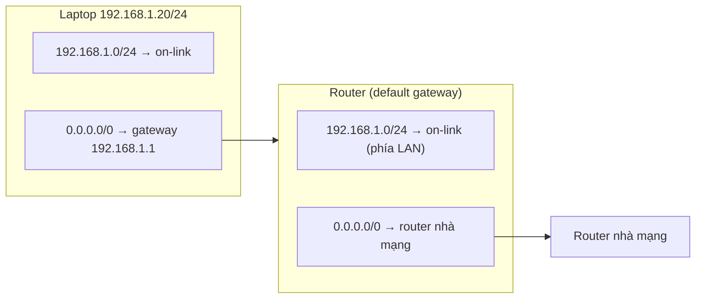

---
tags:
  - Must
  - Routing
  - Concept
  - Troubleshooting
---

# Vì sao máy trong mạng chỉ cần biết một "cửa ra" để đến mọi nơi? (Default route và default gateway)

## Metadata

```yaml
Chapter: default-route-gateway
Phase: 02 — routing
Importance: Must
Status: draft
Prerequisites:
  - Phase 02 / 02-longest-prefix-match
Used Later:
  - Phase 02 / 04-static-route
  - Phase 02 / 05-nat-pat
  - Phase 03 / 01-dhcp
  - Phase 03 / 02-dns-resolution
  - Phase 06 / 02-route-table-igw-nat-gateway
Estimated Reading: 25 phút
Estimated Practice: 35 phút
```

## 1. Story

<!-- Mức bắt buộc (Must): Đủ -->
<!-- DRAFT: người học cần viết lại bằng lời mình -->

Một server mới được cài đặt tĩnh trong mạng `10.0.1.0/24`. Nó ping được các server cùng mạng nhưng **không ra được Internet** và không cập nhật được phần mềm. Người cấu hình nhớ đã nhập địa chỉ IP và mask nhưng ô "gateway" thì để trống. Sửa lại, ô gateway nhập `10.0.2.1` (copy từ một server ở mạng khác) cũng không chạy. Chỉ khi nhập `10.0.1.1` mới ổn.

Hai lỗi, cùng một chủ đề: "đường ra" mặc định. Chapter này giải thích default route, default gateway và vì sao gateway phải nằm **cùng mạng** với máy.

## 2. Objectives

<!-- Mức bắt buộc (Must): Đủ -->
<!-- DRAFT: người học cần viết lại bằng lời mình -->

Sau chapter này bạn có thể:

- Giải thích vì sao cần default route và nó khớp khi nào.
- Phân biệt default route, default gateway và router ra Internet.
- Giải thích vì sao gateway phải nằm trong mạng on-link của máy.
- Dự đoán triệu chứng khi thiếu default route, khi gateway sai, và khi gateway không liên lạc được.
- Đọc default route trên máy Windows/Linux và hiểu vai trò của metric khi có nhiều default route.

## 3. Prerequisites

<!-- Mức bắt buộc (Must): Đủ -->
<!-- DRAFT: người học cần viết lại bằng lời mình -->

> Xem lại: [longest-prefix-match](02-longest-prefix-match.md)

Bạn cũng cần biết bảng định tuyến ở [routing-table-basics](01-routing-table-basics.md) và hành trình gói tin ở [packet-journey](../phase-01-foundation/01-packet-journey.md).

## 4. Why it exists

<!-- Mức bắt buộc (Must): Đủ -->
<!-- DRAFT: người học cần viết lại bằng lời mình -->

Một máy không thể ghi sẵn đường đến mọi mạng trên Internet. Nhưng nó luôn biết hai điều: những mạng **gần mình** (cùng đường dây) và "những chỗ khác thì nhờ một router xa hơn lo". Dòng route nói điều đó là **default route** `0.0.0.0/0`, và router được nhờ lo là **default gateway**.

Nhờ default route, bảng định tuyến của một laptop chỉ cần vài dòng thay vì hàng trăm nghìn dòng.

Khi sai hoặc thiếu:

- Không có default route: ra ngoài mạng cục bộ không được (Story).
- Gateway sai/không liên lạc được: gói tin được "giao" cho một thiết bị không tồn tại hoặc không biết đường, nên biến mất.
- Hai default route xung đột: lưu lượng đi đường ngoài ý muốn.

## 5. Mental model

<!-- Mức bắt buộc (Must): Đủ -->
<!-- DRAFT: người học cần viết lại bằng lời mình -->

Hình dung một tòa nhà chỉ có **một cổng bảo vệ ở cổng chính**. Thư gửi trong tòa nhà thì bạn tự mang tới từng phòng; thư gửi ra ngoài tòa nhà, bạn **đưa cho bảo vệ** và tin rằng họ biết cách chuyển tiếp. Bạn không cần biết đường tới thành phố khác.

**Tóm tắt một câu:** default route là dòng "mọi thứ chưa có đường riêng thì đưa cho gateway", và gateway phải là một router mà máy gửi tới được trực tiếp.

## 6. How it works

<!-- Mức bắt buộc (Must): Đủ -->
<!-- DRAFT: người học cần viết lại bằng lời mình -->

Các từ cần biết:

- **Default route (tuyến mặc định — dòng `0.0.0.0/0`, khớp mọi địa chỉ; chỉ dùng khi không có dòng nào cụ thể hơn; đã giới thiệu ở `02/01`).**
- **Default gateway (cổng mặc định — router mà default route trỏ tới; đã giới thiệu ở `01/01`).**
- **Off-link (nằm ngoài đường dây — đích hoặc địa chỉ không thuộc mạng mà máy nối trực tiếp, nên máy không gửi thẳng tới được).**

**Default route khớp mọi địa chỉ** vì `/0` nghĩa là không bit nào phải khớp. Nó cũng là dòng **ít cụ thể nhất**, nên chỉ được dùng khi không có dòng nào cụ thể hơn khớp (nguyên tắc "cụ thể nhất thắng" ở `02/02`).



**Đọc sơ đồ:** laptop chỉ có hai dòng: mạng của mình (on-link) và default route. Mọi đích khác được đưa cho gateway. Chính gateway cũng có default route riêng trỏ về phía nhà mạng; mỗi router lặp lại cùng logic. "Gateway của tôi" không có nghĩa là gateway biết mọi đường; nó chỉ là chặng kế tiếp.

**Vì sao gateway phải cùng mạng với máy.** Để gửi gói cho gateway, máy phải gửi **thẳng** tới nó (tầng 2): hỏi ARP lấy MAC của gateway rồi gửi khung (`01/03`). Chỉ hàng xóm cùng mạng mới làm được. Nếu địa chỉ gateway **off-link** (không thuộc mạng của máy), máy không có cách nào gửi thẳng đến nó, và hệ điều hành thường từ chối cấu hình đó. Đó là Story lần thứ hai: `10.0.2.1` không thuộc mạng `10.0.1.0/24`.

**Nhiều default route.** Khi có hai default route (ví dụ Wi-Fi và cáp, hoặc hai nhà mạng), máy chọn theo **metric**: route nào có tổng số nhỏ hơn thắng; với Windows, metric của route được cộng với metric của giao diện. Dùng metric để tạo đường chính và đường dự phòng, nhưng chuyển đổi tự động còn phụ thuộc vào việc phát hiện đường chính hỏng.

> "Cụ thể nhất thắng" ở `02/02`; route cấu hình tay ở `02/04`; gateway cho máy nhận địa chỉ qua DHCP ở `03/01`.

<!-- verified: 2026-10-02 https://learn.microsoft.com/en-us/powershell/module/nettcpip/get-netroute -->

## 7. Key settings

<!-- Mức bắt buộc (Must): Đủ -->
<!-- DRAFT: người học cần viết lại bằng lời mình -->

| Thông số | Ý nghĩa | Nếu sai |
|---|---|---|
| Địa chỉ gateway | Router nhận mọi gói ra ngoài | Off-link → không ra được; không liên lạc được gateway → gói biến mất |
| Metric | Ưu tiên khi có nhiều default route | Chọn nhầm đường |
| Giao diện | Cổng mà default route dùng | Gửi nhầm cổng (Wi-Fi thay vì cáp) |
| Cấp tay hay DHCP | Ai đặt gateway | Gateway sai do DHCP/cấu hình tay |

**Xem default route:**

- Windows PowerShell: `Get-NetRoute -DestinationPrefix 0.0.0.0/0`.
- Linux: `ip route show default`.

## 8. AWS mapping

<!-- Mức bắt buộc (Must): Đủ nếu có liên quan AWS -->
<!-- DRAFT: người học cần viết lại bằng lời mình -->

Chapter này giữ trung lập vendor. Hướng liên hệ (kiểm chứng ở `06/02`):

| Khái niệm | Trên AWS (dự kiến) |
|---|---|
| Default route | Route `0.0.0.0/0` trong route table của subnet |
| Default gateway | Đích (target) của route đó, ví dụ cổng ra Internet hoặc NAT |

`[CHƯA KIỂM CHỨNG]` — tên và hành vi phải kiểm tra với tài liệu AWS hiện tại.

## 9. Hands-on lab

<!-- Mức bắt buộc (Must): Đủ + expected-output.txt -->
<!-- DRAFT: người học cần viết lại bằng lời mình -->

Chi tiết ở `labs/phase-02-routing/chapter-03-default-route-gateway/README.md`.

**1. Predict:** gateway của máy bạn là địa chỉ nào? Nó có nằm cùng mạng với địa chỉ của bạn không? Ping gateway có thành công không?

**2. Run (Windows PowerShell):**

```powershell
Get-NetRoute -DestinationPrefix 0.0.0.0/0
```

```powershell
ping -n 2 <gateway>
```

**Run (Linux/WSL2/container):**

```bash
ip route show default
```

**3. Verify:** gateway và địa chỉ của bạn có cùng network address không (`01/04`)? Có một hay nhiều default route?

Output thật: `[CHƯA CHẠY]`. Khi lưu output, thay IP thật bằng IP giả.

## 10. Break it

<!-- Mức bắt buộc (Must): Đủ (≥ 1 Break it) -->
<!-- DRAFT: người học cần viết lại bằng lời mình -->

**Gây lỗi:** làm trong container, cho mất default route rồi thử đặt gateway sai.

```powershell
docker run --rm -it --cap-add NET_ADMIN alpine sh
```

Trong container:

```sh
GW=$(ip route show default | awk '{print $3}')
ip route del default
ping -c 1 -W 2 $GW
ping -c 1 -W 2 192.0.2.1
ip route add default via 192.0.2.254
ip route add default via $GW
ping -c 1 -W 2 192.0.2.1
```

**Dự đoán:**

- Sau khi xóa default route: ping gateway **vẫn thành công** (gateway on-link), ping `192.0.2.1` báo ngay "Network is unreachable".
- `ip route add default via 192.0.2.254`: bị từ chối vì `192.0.2.254` off-link (không thuộc mạng của container).
- Sau khi thêm lại default route đúng: ping `192.0.2.1` không còn báo "unreachable"; nó hết thời gian vì không có ai trả lời (địa chỉ tài liệu).

**Ý nghĩa:** "unreachable" (không có route) khác "hết thời gian" (có route, không hồi âm), và gateway off-link không được chấp nhận.

**Khôi phục:** `exit`; container `--rm` tự xóa.

Kết quả thật: `[CHƯA CHẠY]`.

## 11. Troubleshooting

<!-- Mức bắt buộc (Must): Đủ -->
<!-- DRAFT: người học cần viết lại bằng lời mình -->

| Triệu chứng | Kiểm tra theo thứ tự | Công cụ |
|---|---|---|
| Liên lạc được trong mạng, không ra ngoài (Story) | Có default route không → gateway có cùng mạng không | `ip route show default`, `Get-NetRoute -DestinationPrefix 0.0.0.0/0` |
| Ping gateway không thành công | IP/mask đúng chưa → ARP có MAC của gateway không → gateway có chạy không | `arp -a`, `ip neigh`, `ping <gateway>` |
| Có gateway nhưng vẫn không ra ngoài | Gateway có route tiếp ra ngoài không → NAT có không (`02/05`) | Kiểm tra route trên gateway, `traceroute -n` |
| Đi sai đường khi có nhiều giao diện | Có hai default route không → metric | `Get-NetRoute`, `ip route` |
| Gateway do DHCP cấp sai | DHCP trả gì | `ipconfig /all`, xem `03/01` |

Ghi kết quả thật của mục 10: `[CHƯA CHẠY]`.

## 12. Security & cost

<!-- Mức bắt buộc (Must): Đủ -->
<!-- DRAFT: người học cần viết lại bằng lời mình -->

- Gateway thấy **toàn bộ lưu lượng đi ra**; một gateway giả (qua DHCP giả hoặc ARP giả, xem `01/03`, `03/01`) có thể nghe lén hoặc chuyển hướng.
- Thêm default route thứ hai (ví dụ do VPN) có thể làm lưu lượng đi qua đường không mong muốn; kiểm tra bảng route khi bật/tắt VPN.
- Không dán gateway/bảng route thật vào tài liệu công khai.
- Chi phí: không phát sinh; trên đám mây, default route ra NAT/Internet có thể phát sinh phí lưu lượng (`06/02`).

## 13. Misconceptions

<!-- Mức bắt buộc (Must): Đủ -->
<!-- DRAFT: người học cần viết lại bằng lời mình -->

| Hiểu nhầm | Sự thật |
|---|---|
| "Default gateway là modem/ISP" | Là router bạn gửi gói tới trước tiên; có thể chỉ là chặng đầu tiên |
| "Đặt gateway là địa chỉ nào cũng được" | Phải cùng mạng (on-link) với máy |
| "Gateway chỉ dùng để ra Internet" | Dùng cho mọi đích không có route riêng, kể cả mạng nội bộ khác |
| "Có hai default route là có load balancing" | Máy chọn theo metric; không tự chia tải trừ khi cấu hình riêng |
| "Có gateway nghĩa là chắc ra được Internet" | Gateway còn cần route/NAT để chuyển tiếp |

## 14. Interview questions

<!-- Mức bắt buộc (Must): Đủ -->
<!-- DRAFT: người học cần viết lại bằng lời mình -->

### Q1 (Junior) — Default route khớp những địa chỉ nào và khi nào được dùng?

**Gợi ý ý chính:**
- `/0` nghĩa là gì?
- Nó là dòng cụ thể hay không cụ thể nhất?

??? success "Đáp án mẫu (tự trả lời trước khi mở)"
    `0.0.0.0/0` khớp mọi địa chỉ nhưng là dòng ít cụ thể nhất, nên chỉ được dùng khi không có dòng nào cụ thể hơn khớp.

### Q2 (Junior) — Vì sao gateway phải cùng mạng với máy?

**Gợi ý ý chính:**
- Máy gửi gói cho gateway bằng cách nào ở tầng 2?
- Ai phải biết MAC của gateway?

??? success "Đáp án mẫu (tự trả lời trước khi mở)"
    Máy gửi thẳng khung cho gateway nên phải hỏi ARP lấy MAC của nó; ARP chỉ chạy trong cùng mạng. Gateway off-link thì không gửi thẳng tới được.

### Q3 (Middle) — Máy ping được gateway nhưng không ra được Internet. Bạn nghi gì?

**Gợi ý ý chính:**
- Phần nào đã được chứng minh ổn?
- Việc gì còn phụ thuộc vào gateway?

??? success "Đáp án mẫu (tự trả lời trước khi mở)"
    Mạng cục bộ và gateway ổn. Nghi gateway không có route tiếp ra ngoài, thiếu NAT, nhà mạng hỏng, hoặc có firewall chặn. Dùng `traceroute -n` để xem chặng nào đầu tiên im lặng.

## 15. Exercises

<!-- Mức bắt buộc (Must): Đủ -->
<!-- DRAFT: người học cần viết lại bằng lời mình -->

1. **Bảng của bạn.** *Deliverable:* bảng 2–3 dòng default route của máy bạn (đã thay IP thật bằng IP giả) và nhận xét gateway có nằm trong mạng của máy không.
2. **Hai lỗi của Story.** *Deliverable:* bảng so sánh "thiếu gateway" và "gateway off-link": hiện tượng, vì sao, cách kiểm tra.
3. **Hai đường ra.** Máy có Wi-Fi và cáp, mỗi cái có default route riêng. *Deliverable:* đoạn 4–6 câu giải thích máy chọn đường nào và làm sao kiểm tra.

## 16. Cheat sheet

<!-- Mức bắt buộc (Must): Đủ -->
<!-- DRAFT: người học cần viết lại bằng lời mình -->

| Mục | Nội dung |
|---|---|
| Default route | `0.0.0.0/0`, khớp mọi địa chỉ, ít cụ thể nhất |
| Gateway | Next hop của default route; phải on-link |
| Xem (Windows) | `Get-NetRoute -DestinationPrefix 0.0.0.0/0` |
| Xem (Linux) | `ip route show default` |
| Triệu chứng | Không có default route → "unreachable" ngay; gateway lỗi → hết thời gian |

**Debug:** IP/mask → default route có không → gateway cùng mạng không → ping gateway → route/NAT ở gateway.

## 17. Glossary terms

<!-- Mức bắt buộc (Must): Đủ -->
<!-- DRAFT: người học cần viết lại bằng lời mình -->

- Default route / tuyến mặc định / デフォルトルート
- Default gateway / cổng mặc định / デフォルトゲートウェイ
- Off-link / nằm ngoài đường dây / 直接接続されていない

## 18. Further reading

<!-- Mức bắt buộc (Must): Đủ -->
<!-- DRAFT: người học cần viết lại bằng lời mình -->

Kiểm tra ngày 2026-10-02:

- `Get-NetRoute`: https://learn.microsoft.com/en-us/powershell/module/nettcpip/get-netroute
- `ip-route(8)`: https://man7.org/linux/man-pages/man8/ip-route.8.html
