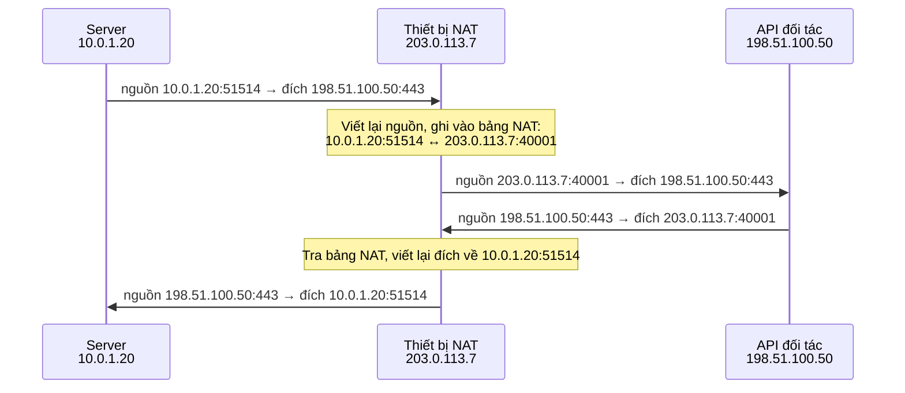

---
tags:
  - Must
  - NAT
  - Routing
  - Concept
---

# Vì sao máy trong mạng nội bộ ra được Internet dù địa chỉ của nó không dùng được trên Internet? (NAT và PAT)

## Metadata

```yaml
Chapter: nat-pat
Phase: 02 — routing
Importance: Must
Status: draft
Prerequisites:
  - Phase 01 / 06-private-public-ip-rfc1918
  - Phase 02 / 03-default-route-gateway
Used Later:
  - Phase 02 / 06-asymmetric-routing
  - Phase 04 / 07-load-balancing-l4-vs-l7
  - Phase 05 / 04-vpn-ipsec-site-to-site
  - Phase 06 / 02-route-table-igw-nat-gateway
  - Phase 07 / 02-docker-networking
Estimated Reading: 30 phút
Estimated Practice: 40 phút
```

## 1. Story

<!-- Mức bắt buộc (Must): Đủ -->
<!-- DRAFT: người học cần viết lại bằng lời mình -->

Hệ thống `shopnet` cần gọi API của một đối tác thanh toán. Đối tác yêu cầu "gửi địa chỉ IP của bên bạn để chúng tôi cho phép". Bạn đưa `10.0.1.20`, địa chỉ của server. Đối tác trả lời: "Đó là địa chỉ nội bộ, không dùng được."

Cả hai đều đúng: server dùng `10.0.1.20` nhưng khi gọi ra ngoài, đối tác thấy một địa chỉ khác. Địa chỉ đó là của thiết bị làm NAT. Chapter này giải thích vì sao có NAT, nó viết lại gì trên gói tin, và vì sao nó là thứ bạn phải hiểu khi làm việc với Internet, firewall của đối tác và hạ tầng đám mây.

## 2. Objectives

<!-- Mức bắt buộc (Must): Đủ -->
<!-- DRAFT: người học cần viết lại bằng lời mình -->

Sau chapter này bạn có thể:

- Giải thích vì sao địa chỉ private không dùng được trên Internet và NAT giải quyết việc đó thế nào.
- Mô tả từng bước NAT/PAT xử lý gói đi và gói về, và trường nào trên gói tin bị viết lại.
- Đọc một dòng trong bảng NAT và nói nó ghi nhớ điều gì.
- Giải thích vì sao kết nối từ Internet vào máy private thường không thành.
- Trả lời được "đối tác sẽ thấy địa chỉ nào" khi một server private gọi ra ngoài.

## 3. Prerequisites

<!-- Mức bắt buộc (Must): Đủ -->
<!-- DRAFT: người học cần viết lại bằng lời mình -->

> Xem lại: [private-public-ip-rfc1918](../phase-01-foundation/06-private-public-ip-rfc1918.md)
> Xem lại: [default-route-gateway](03-default-route-gateway.md)

## 4. Why it exists

<!-- Mức bắt buộc (Must): Đủ -->
<!-- DRAFT: người học cần viết lại bằng lời mình -->

Địa chỉ IPv4 công khai (dùng được trên Internet) không đủ cho mọi thiết bị. Vì vậy có các **dải private** (`10.0.0.0/8`, `172.16.0.0/12`, `192.168.0.0/16`, RFC 1918) mà **ai cũng dùng lại** trong mạng riêng của mình. Chính vì ai cũng dùng lại nên Internet không định tuyến các dải này.

Vấn đề: máy private vẫn cần ra Internet. **NAT (Network Address Translation)** là thiết bị/tính năng ở biên mạng, **đổi địa chỉ nguồn** của gói đi ra thành một địa chỉ công khai, và đổi ngược lại cho gói trả về. Nhờ vậy nhiều máy private chia sẻ một (hoặc vài) địa chỉ công khai.

Nếu không có NAT (và không có IPv6): máy private không thể liên lạc với Internet, hoặc mỗi máy phải có một địa chỉ công khai riêng, điều không khả thi với IPv4.

Hiểu sai NAT dẫn đến các lỗi quen thuộc: đưa nhầm địa chỉ cho đối tác (Story), tưởng NAT là firewall, hoặc không hiểu vì sao kết nối rớt sau một thời gian im lặng.

## 5. Mental model

<!-- Mức bắt buộc (Must): Đủ -->
<!-- DRAFT: người học cần viết lại bằng lời mình -->

Hình dung tổng đài công ty: nhiều máy nhánh (101, 102, 103) dùng chung **một số điện thoại ngoài**. Khi nhánh 101 gọi ra, tổng đài dùng số ngoài và **ghi nhớ** "cuộc gọi này đang là của nhánh 101". Khi có tiếng trả lời, tổng đài tra sổ để chuyển đúng về 101. Nếu người lạ gọi vào số ngoài mà chưa có ai gọi ra trước, tổng đài không biết chuyển cho nhánh nào.

**Tóm tắt một câu:** NAT/PAT viết lại địa chỉ (và cổng) nguồn của gói đi ra, ghi nhớ trong một bảng để viết ngược lại cho gói trả về.

## 6. How it works

<!-- Mức bắt buộc (Must): Đủ -->
<!-- DRAFT: người học cần viết lại bằng lời mình -->

Các từ cần biết (nhắc lại cho đủ ngữ cảnh):

- **Private IP address (địa chỉ IP riêng — địa chỉ thuộc dải dành cho mạng nội bộ; Internet không định tuyến dải này).**
- **Public IP address (địa chỉ IP công khai — địa chỉ duy nhất toàn Internet, ai cũng gửi gói tới được).**
- **NAT (dịch địa chỉ mạng — đổi địa chỉ IP trên gói tin khi nó đi qua một thiết bị ở biên mạng).**
- **PAT (dịch cổng và địa chỉ — dạng NAT đổi cả địa chỉ lẫn số cổng, để nhiều máy dùng chung một địa chỉ công khai; còn gọi là NAPT).**
- **NAT table (bảng NAT — danh sách các cuộc kết nối đang có, ghi "địa chỉ:cổng bên trong ↔ địa chỉ:cổng bên ngoài").**

Có hai dạng chính theo RFC 3022: **Basic NAT** chỉ đổi địa chỉ IP (cần một địa chỉ công khai cho mỗi máy đang hoạt động) và **NAPT/PAT** đổi cả cổng, cho phép nhiều máy dùng chung một địa chỉ công khai. Hầu hết NAT ở nhà và văn phòng là PAT.

**Một kết nối đi ra, từng bước** (server private `10.0.1.20` gọi API `198.51.100.50:443`, NAT có địa chỉ công khai `203.0.113.7`):



**Đọc sơ đồ:** chỉ **địa chỉ và cổng nguồn** của gói đi ra bị đổi; đích giữ nguyên (đó là lý do `traceroute` ở `01/01` thấy cùng một đích suốt đường). Đối tác chỉ thấy `203.0.113.7`, nên đó là địa chỉ cần đưa vào danh sách cho phép (Story). Ở chiều về, thiết bị NAT tra bảng để biết gói thuộc kết nối nào rồi đổi đích về đúng máy private.

**Điều gì xảy ra với kết nối từ ngoài vào?** Một gói đến `203.0.113.7:8080` mà bảng NAT chưa có dòng khớp thì NAT không biết chuyển cho máy nào, và mặc định bỏ gói đó. Đây là hệ quả phụ giúp máy private "khó bị vào" từ Internet, **nhưng NAT không được thiết kế làm firewall** và không thay thế firewall (Phase 05). Muốn cho phép kết nối vào, phải cấu hình ánh xạ tĩnh ("port forwarding").

**Hai giới hạn thực tế:**

- **Dòng NAT có thời hạn.** Kết nối im lặng quá lâu sẽ bị xóa khỏi bảng; gói đến sau đó không khớp dòng nào và bị bỏ (kết nối "tự chết", xem keepalive ở `04/02`).
- **Số cổng hữu hạn.** Mỗi kết nối dùng một cổng ngoài; quá nhiều kết nối đồng thời qua cùng địa chỉ công khai có thể làm cạn cổng.

> NAT ở AWS và vì sao máy trong subnet private phải qua NAT để ra ngoài: `06/02`. Route cho chiều về và định tuyến bất đối xứng: `02/06`.

## 7. Key settings

<!-- Mức bắt buộc (Must): Đủ -->
<!-- DRAFT: người học cần viết lại bằng lời mình -->

| Thông số | Ý nghĩa | Nếu sai |
|---|---|---|
| Dạng NAT (Basic / PAT) | Có đổi cổng không | Không đủ địa chỉ công khai cho nhiều máy (nếu Basic) |
| Địa chỉ công khai (hoặc nhóm địa chỉ) | Địa chỉ mà bên ngoài nhìn thấy | Đối tác allowlist sai địa chỉ |
| Thời gian giữ dòng NAT (idle timeout) | Bao lâu im lặng thì bị xóa | Kết nối dài ngắt bất ngờ |
| Ánh xạ tĩnh (port forwarding) | Cho phép kết nối từ ngoài vào một máy nhất định | Dịch vụ nội bộ không truy cập được từ ngoài |

## 8. AWS mapping

<!-- Mức bắt buộc (Must): Đủ nếu có liên quan AWS -->
<!-- DRAFT: người học cần viết lại bằng lời mình -->

Chapter này giữ trung lập vendor. Hướng liên hệ (sẽ kiểm chứng và học đầy đủ ở `06/02`):

| Khái niệm | Trên AWS (dự kiến) |
|---|---|
| Thiết bị NAT cho nhiều máy private ra Internet | NAT Gateway (đặt trong subnet có đường ra Internet) |
| Route đưa lưu lượng ra ngoài | Route `0.0.0.0/0` trong route table của subnet private trỏ tới NAT Gateway |
| Địa chỉ công khai mà đối tác nhìn thấy | Địa chỉ công khai gắn với NAT Gateway |

`[CHƯA KIỂM CHỨNG]` — tên dịch vụ, hành vi và chi phí phải kiểm tra với tài liệu AWS hiện tại. NAT Gateway thường tính phí theo giờ và theo lượng dữ liệu; tra giá trên trang chính thức, không ghi số trong sách.

## 9. Hands-on lab

<!-- Mức bắt buộc (Must): Đủ + expected-output.txt -->
<!-- DRAFT: người học cần viết lại bằng lời mình -->

Chi tiết ở `labs/phase-02-routing/chapter-05-nat-pat/README.md`. Dùng chính môi trường của bạn: WSL2 mặc định chạy sau NAT của Windows, và container Docker mặc định ra ngoài qua masquerade (một dạng NAT).

**1. Predict:**

- Địa chỉ IP của WSL2 có giống Windows không? Nằm trong dải private nào?
- Container mặc định có địa chỉ nằm trong dải nào? Nó có ra được Internet không?
- Default gateway của WSL2 là địa chỉ nào (gợi ý: là Windows host)?

**2. Run:**

```powershell
ipconfig
wsl hostname -I
wsl ip route show default
```

```powershell
docker run --rm alpine ip addr
docker run --rm alpine ping -c 2 example.com
```

**3. Verify:** WSL2 và container dùng địa chỉ private, nhưng vẫn ra Internet được. Nơi nào đang đổi địa chỉ nguồn?

<!-- verified: 2026-10-02 https://learn.microsoft.com/en-us/windows/wsl/networking -->
<!-- verified: 2026-10-02 https://docs.docker.com/engine/network/drivers/bridge/ -->
<!-- verified: 2026-10-02 https://www.rfc-editor.org/rfc/rfc3022 -->

Theo Microsoft, WSL mặc định dùng kiến trúc NAT; theo Docker, mạng bridge mặc định cho container ra ngoài bằng masquerade, nên thiết bị bên ngoài chỉ thấy địa chỉ của Docker host.

Output thật: `[CHƯA CHẠY]`. Khi lưu output, thay IP thật bằng IP giả và tên miền thật bằng `example.com`.

## 10. Break it

<!-- Mức bắt buộc (Must): Đủ (≥ 1 Break it) -->
<!-- DRAFT: người học cần viết lại bằng lời mình -->

**Gây lỗi:** tạo một mạng Docker **nội bộ** (không có đường ra ngoài), chạy container trong đó rồi thử ra Internet.

```powershell
docker network create --internal net-lab-internal
docker run --rm --network net-lab-internal alpine ping -c 1 -W 2 example.com
```

**Dự đoán:** ping thất bại (không phân giải được tên hoặc không có đường ra). Container trong mạng này nói chuyện được với container khác cùng mạng, nhưng không ra được mạng ngoài.

<!-- verified: 2026-10-02 https://docs.docker.com/reference/cli/docker/network/create/ -->

Theo Docker, `--internal` hạn chế truy cập ra ngoài của mạng: container trong đó liên lạc được với nhau và với gateway nhưng không ra được mạng bên ngoài.

**Ý nghĩa:** thiếu đường ra (và thiếu NAT) là lý do máy trong subnet private không ra được Internet. Đây là bản thu nhỏ của chính tình huống đó.

**Dọn dẹp (teardown):**

```powershell
docker network rm net-lab-internal
docker network ls
```

Kiểm tra `net-lab-internal` đã biến mất khỏi danh sách.

Kết quả thật: `[CHƯA CHẠY]`.

## 11. Troubleshooting

<!-- Mức bắt buộc (Must): Đủ -->
<!-- DRAFT: người học cần viết lại bằng lời mình -->

| Triệu chứng | Kiểm tra theo thứ tự | Công cụ |
|---|---|---|
| Đối tác không cho phép địa chỉ của bạn (Story) | Địa chỉ nguồn thật bên ngoài nhìn thấy là gì → có đúng là địa chỉ của NAT không | Hỏi đối tác log, hoặc kiểm tra từ máy bên ngoài; không đoán từ IP private |
| Máy private không ra được Internet | Có default route không → có thiết bị NAT trên đường ra không → NAT có địa chỉ công khai hợp lệ không | `ip route get`, `traceroute -n`, cấu hình thiết bị NAT |
| Kết nối dài tự ngắt sau thời gian im lặng | Dòng NAT có bị hết hạn không → ứng dụng có gửi keepalive không | Cấu hình timeout NAT, keepalive của ứng dụng (xem `04/02`) |
| Từ Internet không vào được dịch vụ trong mạng private | Có ánh xạ tĩnh/port forwarding không → firewall có mở không | Cấu hình NAT, firewall |
| Nhiều kết nối đồng thời bị lỗi | Số kết nối qua một địa chỉ công khai có quá lớn không | Số liệu thiết bị NAT |

Ghi kết quả thật của mục 10: `[CHƯA CHẠY]`.

## 12. Security & cost

<!-- Mức bắt buộc (Must): Đủ -->
<!-- DRAFT: người học cần viết lại bằng lời mình -->

- **NAT không phải firewall.** Việc gói từ ngoài vào bị bỏ là hệ quả của bảng NAT, không phải chính sách bảo mật; hãy dùng firewall/security group đúng nghĩa (Phase 05, 06).
- Địa chỉ công khai của NAT là thứ nhiều bên dùng để allowlist; đổi nó (ví dụ thay NAT) sẽ làm đối tác chặn bạn bất ngờ, nên cần thông báo trước.
- Không ghi địa chỉ công khai thật của hệ thống vào tài liệu công khai.
- **Chi phí (trên đám mây):** NAT thường tính phí theo thời gian chạy và theo lượng dữ liệu đi qua; kiểm tra giá hiện tại trên trang chính thức trước khi dựng, và dọn dẹp sau lab. Chapter này chạy local nên không phát sinh chi phí.

## 13. Misconceptions

<!-- Mức bắt buộc (Must): Đủ -->
<!-- DRAFT: người học cần viết lại bằng lời mình -->

| Hiểu nhầm | Sự thật |
|---|---|
| "NAT là firewall nên máy private đã an toàn" | NAT không thiết kế để bảo mật; vẫn cần firewall/security group |
| "NAT đổi địa chỉ đích" | Với gói đi ra, NAT đổi địa chỉ/cổng **nguồn**; chiều về mới đổi **đích** để trả về đúng máy |
| "Máy private không bao giờ ra được Internet" | Ra được, nhờ NAT; chỉ không **nhận kết nối vào** nếu không có ánh xạ |
| "Mỗi máy private cần một địa chỉ công khai" | PAT cho nhiều máy dùng chung một địa chỉ |
| "NAT chỉ có ở router nhà" | Cũng có trên server, container engine, và dịch vụ NAT của đám mây |

## 14. Interview questions

<!-- Mức bắt buộc (Must): Đủ -->
<!-- DRAFT: người học cần viết lại bằng lời mình -->

### Q1 (Junior) — NAT là gì và vì sao cần nó?

**Gợi ý ý chính:**
- Vì sao địa chỉ private không dùng được trên Internet?
- Gói tin bị thay đổi gì khi qua NAT?

??? success "Đáp án mẫu (tự trả lời trước khi mở)"
    Địa chỉ private (RFC 1918) bị nhiều mạng dùng lại nên Internet không định tuyến chúng. NAT ở biên mạng đổi địa chỉ nguồn của gói đi ra thành địa chỉ công khai và đổi ngược lại cho gói trả về, cho phép nhiều máy private dùng chung ít địa chỉ công khai.

### Q2 (Middle) — PAT khác Basic NAT thế nào?

**Gợi ý ý chính:**
- Cái gì được dùng để phân biệt các kết nối?
- Cần bao nhiêu địa chỉ công khai?

??? success "Đáp án mẫu (tự trả lời trước khi mở)"
    Basic NAT chỉ đổi địa chỉ IP, nên cần một địa chỉ công khai cho mỗi máy đang hoạt động. PAT đổi cả cổng, dùng cổng để phân biệt các kết nối nên nhiều máy chia sẻ một địa chỉ công khai.

### Q3 (Middle) — Vì sao kết nối từ Internet vào một máy private thường không thành?

**Gợi ý ý chính:**
- Bảng NAT được tạo khi nào?
- Gói đến mà không có dòng khớp thì sao?

??? success "Đáp án mẫu (tự trả lời trước khi mở)"
    Bảng NAT chỉ có dòng khi máy bên trong chủ động gọi ra. Gói từ ngoài vào không khớp dòng nào nên NAT không biết chuyển cho máy nào và bỏ. Muốn cho phép phải cấu hình ánh xạ tĩnh (port forwarding) và chính sách firewall tương ứng.

### Q4 (Middle) — Đối tác yêu cầu allowlist địa chỉ IP của hệ thống bạn. Bạn đưa địa chỉ nào?

**Gợi ý ý chính:**
- Đối tác nhìn thấy địa chỉ nào khi gói tin đến họ?

??? success "Đáp án mẫu (tự trả lời trước khi mở)"
    Địa chỉ công khai của thiết bị NAT mà lưu lượng đi ra qua (không phải địa chỉ private của server); và cần đảm bảo địa chỉ đó ổn định, nếu không đối tác sẽ chặn khi nó đổi.

## 15. Exercises

<!-- Mức bắt buộc (Must): Đủ -->
<!-- DRAFT: người học cần viết lại bằng lời mình -->

1. **Vẽ bảng NAT.** Cho ba máy private `10.0.1.20`, `10.0.1.21`, `10.0.1.22` cùng gọi `198.51.100.50:443` qua NAT `203.0.113.7`. *Deliverable:* bảng NAT với ba dòng (cổng nguồn trong và cổng ngoài do bạn chọn) và 3–5 câu giải thích vì sao phải đổi cổng.
2. **Sự cố Story.** *Deliverable:* đoạn 4–6 câu trả lời đối tác: bạn đưa địa chỉ nào, vì sao, và rủi ro khi địa chỉ này đổi.
3. **Chẩn đoán kết nối dài.** Một kết nối ngắt sau khoảng 5 phút im lặng. *Deliverable:* danh sách 3 giả thuyết (ưu tiên giả thuyết NAT) và cách kiểm chứng từng cái.

## 16. Cheat sheet

<!-- Mức bắt buộc (Must): Đủ -->
<!-- DRAFT: người học cần viết lại bằng lời mình -->

| Mục | Nội dung |
|---|---|
| Đổi gì | Gói đi ra: nguồn (IP, cổng); gói về: đích |
| Basic NAT vs PAT | Chỉ IP / IP + cổng |
| Dải private | `10.0.0.0/8`, `172.16.0.0/12`, `192.168.0.0/16` |
| Bảng NAT | Ghi nhớ kết nối để đổi ngược |
| Từ ngoài vào | Không có dòng khớp → bị bỏ (trừ khi có ánh xạ tĩnh) |
| Đối tác allowlist | Địa chỉ công khai của NAT |

**Debug:** route ra ngoài → có NAT trên đường ra → địa chỉ công khai → timeout NAT.

## 17. Glossary terms

<!-- Mức bắt buộc (Must): Đủ -->
<!-- DRAFT: người học cần viết lại bằng lời mình -->

- Private IP address / địa chỉ IP riêng / プライベートIPアドレス
- Public IP address / địa chỉ IP công khai / グローバルIPアドレス
- NAT / dịch địa chỉ mạng / NAT
- PAT / dịch cổng và địa chỉ / PAT
- NAT table / bảng NAT / NATテーブル

## 18. Further reading

<!-- Mức bắt buộc (Must): Đủ -->
<!-- DRAFT: người học cần viết lại bằng lời mình -->

Kiểm tra ngày 2026-10-02:

- RFC 3022 — Traditional IP Network Address Translator: https://www.rfc-editor.org/rfc/rfc3022
- RFC 1918 — Address Allocation for Private Internets: https://www.rfc-editor.org/rfc/rfc1918
- Docker bridge network: https://docs.docker.com/engine/network/drivers/bridge/
- Mạng trong WSL: https://learn.microsoft.com/en-us/windows/wsl/networking
