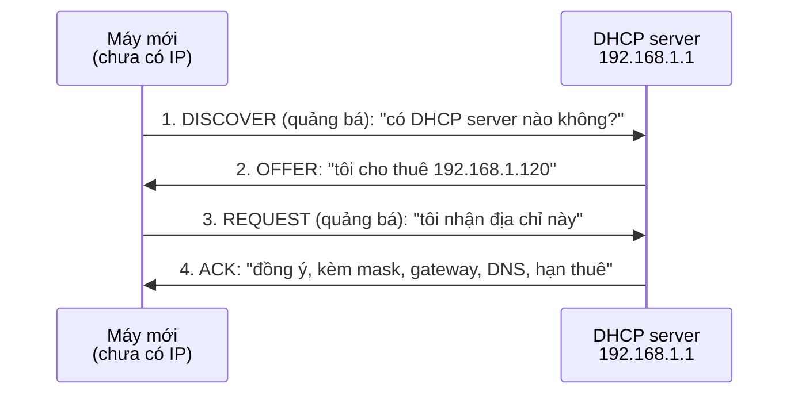

---
tags:
  - Must
  - DHCP
  - Concept
  - Troubleshooting
---

# Máy tính mới cắm mạng lấy địa chỉ IP từ đâu? (DHCP)

## Metadata

```yaml
Chapter: dhcp
Phase: 03 — core-services
Importance: Must
Status: draft
Prerequisites:
  - Phase 01 / 03-ethernet-mac-arp
  - Phase 02 / 03-default-route-gateway
Used Later:
  - Phase 06 / 05-eni-and-ip-allocation
  - Phase 06 / 06-dhcp-options-and-vpc-dns
Estimated Reading: 25 phút
Estimated Practice: 30 phút
```

## 1. Story

<!-- Mức bắt buộc (Must): Đủ -->
<!-- DRAFT: người học cần viết lại bằng lời mình -->

Sáng thứ Hai, ba nhân viên mới mở laptop và báo "có Wi-Fi nhưng không vào được gì". Bạn kiểm tra và thấy cả ba laptop đều có địa chỉ dạng `169.254.x.x`. Laptop cũ vẫn bình thường.

Văn phòng có một DHCP server cấp địa chỉ trong dải `192.168.1.100`–`192.168.1.150` (51 địa chỉ) với thời hạn thuê dài. Điện thoại, laptop khách và máy in đã dùng hết dải đó từ tuần trước nhưng không ai trả lại. Ba máy mới không còn địa chỉ để thuê, nên tự gán địa chỉ cục bộ `169.254.x.x` (chapter `01/04`) và không ra ngoài LAN được.

Chapter này giải thích DHCP cấp địa chỉ thế nào, "thuê" nghĩa là gì, và nếu nó hỏng thì triệu chứng trông ra sao.

## 2. Objectives

<!-- Mức bắt buộc (Must): Đủ -->
<!-- DRAFT: người học cần viết lại bằng lời mình -->

Sau chapter này bạn có thể:

- Giải thích vì sao cần DHCP và nó cấp những thông số nào cho máy.
- Mô tả bốn bước trao đổi DHCP (Discover, Offer, Request, Ack) và vì sao bước đầu dùng quảng bá.
- Giải thích khái niệm lease (thời hạn thuê) và gia hạn.
- Đọc thông tin DHCP trên máy của mình (server, thời điểm thuê, hết hạn).
- Chẩn đoán được các lỗi DHCP phổ biến: hết địa chỉ trong dải, trùng địa chỉ, server giả.

## 3. Prerequisites

<!-- Mức bắt buộc (Must): Đủ -->
<!-- DRAFT: người học cần viết lại bằng lời mình -->

> Xem lại: [ethernet-mac-arp](../phase-01-foundation/03-ethernet-mac-arp.md)
> Xem lại: [default-route-gateway](../phase-02-routing/03-default-route-gateway.md)

Bạn cần nhớ chapter `01/04` về địa chỉ `0.0.0.0`, địa chỉ quảng bá `255.255.255.255` và địa chỉ link-local `169.254.x.x`.

## 4. Why it exists

<!-- Mức bắt buộc (Must): Đủ -->
<!-- DRAFT: người học cần viết lại bằng lời mình -->

Mỗi máy cần địa chỉ IP, mask, default gateway và DNS server để hoạt động. Nhập tay trên hàng trăm máy thì tốn công, dễ gõ nhầm, dễ trùng địa chỉ, và đổi mạng thì phải sửa lại từng máy.

**DHCP (Dynamic Host Configuration Protocol)** để một server cấp các thông số đó **tự động** cho máy vừa vào mạng, và thu hồi khi máy không dùng nữa.

Nếu DHCP hỏng hoặc cấu hình sai:

- Máy không nhận được địa chỉ → tự gán `169.254.x.x` hoặc không có mạng.
- Hết địa chỉ trong dải → máy mới không vào được (Story).
- Nhận sai gateway/DNS (do server giả hoặc cấu hình sai) → máy có địa chỉ nhưng không ra ngoài được hoặc bị dẫn sai.

## 5. Mental model

<!-- Mức bắt buộc (Must): Đủ -->
<!-- DRAFT: người học cần viết lại bằng lời mình -->

Hình dung quầy phát **thẻ gửi xe có thời hạn**: bạn đến, quầy cấp cho một thẻ (địa chỉ), ghi hạn dùng (lease). Hết hạn mà không gia hạn thì quầy thu thẻ lại cho người khác. Nếu quầy hết thẻ, người đến sau không có chỗ.

**Tóm tắt một câu:** DHCP cho máy "thuê" một địa chỉ cùng các thông số mạng trong một thời hạn, và thu lại khi hết hạn hoặc khi máy trả.

## 6. How it works

<!-- Mức bắt buộc (Must): Đủ -->
<!-- DRAFT: người học cần viết lại bằng lời mình -->

Các từ cần biết:

- **DHCP (giao thức cấp địa chỉ tự động — cách một server cấp IP và các thông số mạng cho máy vừa vào mạng).**
- **DHCP server (máy chủ DHCP — thiết bị giữ danh sách địa chỉ và cấp cho máy xin).**
- **Address pool (dải địa chỉ cấp phát — khoảng địa chỉ mà server được phép cho thuê).**
- **Lease (thời hạn thuê — khoảng thời gian một địa chỉ được cấp cho một máy).**
- **MAC address (địa chỉ phần cứng — mã định danh của card mạng, học kỹ ở `01/03`; DHCP dùng nó để nhận biết máy).**
- **Reservation (đặt trước — luôn cấp cùng một địa chỉ cho một MAC address nhất định).**

**Bốn bước cấp địa chỉ.** Máy chưa có địa chỉ nên không thể gửi theo cách thông thường, và cũng chưa biết DHCP server ở đâu. Vì vậy bước đầu tiên là **quảng bá** (gửi cho mọi máy trong mạng) với địa chỉ nguồn `0.0.0.0`:



**Đọc sơ đồ:** bước 1 phải quảng bá vì máy không có địa chỉ và không biết server. Bước 2 là lời đề nghị. Bước 3 máy chọn một đề nghị (có thể có nhiều server trả lời) và quảng bá để các server khác biết đề nghị của họ bị bỏ. Bước 4 server xác nhận; chỉ từ lúc này máy mới dùng địa chỉ. Gói ACK mang theo các thông số khác: mask, default gateway, DNS server và thời hạn thuê.

Theo RFC 2131, server nghe ở **UDP cổng 67** và client nghe ở **cổng 68**; khái niệm cổng sẽ học kỹ ở Phase 04.

**Lease và gia hạn.** Địa chỉ được thuê trong một khoảng thời gian. Khi đã dùng một phần đáng kể thời hạn, máy hỏi lại server để gia hạn; nếu không gia hạn được thì địa chỉ hết hiệu lực và server có thể cấp lại cho máy khác. Máy cũng có thể chủ động trả địa chỉ (release). Thời điểm chính xác bắt đầu gia hạn do cấu hình/triển khai quyết định `[CHƯA KIỂM CHỨNG]`; điều cần nhớ là địa chỉ **không** thuộc về máy mãi mãi.

**Relay (DHCP relay agent).** Gói quảng bá không đi qua router. Khi mạng có nhiều mạng con, người ta đặt một **relay agent** (thường trên router) để chuyển các thông điệp DHCP giữa máy và server ở mạng khác, nhờ đó không cần một DHCP server cho mỗi mạng con.

<!-- verified: 2026-10-02 https://www.rfc-editor.org/rfc/rfc2131 -->

> DHCP trên AWS và cách VPC cấp địa chỉ cho network interface: `06/05`, `06/06`.

## 7. Key settings

<!-- Mức bắt buộc (Must): Đủ -->
<!-- DRAFT: người học cần viết lại bằng lời mình -->

| Thông số | Ý nghĩa | Nếu sai |
|---|---|---|
| Address pool (scope) | Dải địa chỉ được cấp | Dải quá nhỏ → hết địa chỉ (Story); trùng với địa chỉ đặt tay → xung đột |
| Lease time | Thời hạn thuê | Quá dài: địa chỉ bị "giữ" bởi máy không còn dùng; quá ngắn: nhiều lưu lượng gia hạn |
| Options: gateway, DNS, tên miền | Thông số cấp kèm | Máy có IP nhưng không ra ngoài hoặc phân giải tên sai |
| Reservation | Cấp cố định theo MAC | Quên đặt trước cho thiết bị cần địa chỉ cố định |
| Loại trừ (exclusion) | Địa chỉ không được cấp | Địa chỉ đặt tay nằm trong dải sẽ bị cấp cho máy khác |

**Xem thông tin DHCP trên máy Windows:**

```cmd
ipconfig /all
```

Tìm các dòng `DHCP Enabled`, `DHCP Server`, `Lease Obtained`, `Lease Expires`.

## 8. AWS mapping

<!-- Mức bắt buộc (Must): Đủ nếu có liên quan AWS -->
<!-- DRAFT: người học cần viết lại bằng lời mình -->

Chapter này giữ trung lập vendor. Hướng liên hệ (kiểm chứng ở `06/05`, `06/06`):

| Khái niệm | Trên AWS (dự kiến) |
|---|---|
| DHCP cấp thông số mạng cho máy | Máy trong VPC nhận địa chỉ và thông số qua DHCP; tập thông số do VPC cấu hình (DHCP option set) |
| Địa chỉ gắn với máy | Địa chỉ private gắn với network interface của instance |

`[CHƯA KIỂM CHỨNG]` — chi tiết phải kiểm tra với tài liệu AWS hiện tại.

## 9. Hands-on lab

<!-- Mức bắt buộc (Must): Đủ + expected-output.txt -->
<!-- DRAFT: người học cần viết lại bằng lời mình -->

Chi tiết ở `labs/phase-03-core-services/chapter-01-dhcp/README.md`.

**1. Predict:**

- Máy bạn có đang dùng DHCP không?
- Ai là DHCP server (địa chỉ nào)? Có trùng default gateway không?
- Thời điểm thuê và hết hạn cách nhau bao lâu?

**2. Run:**

```cmd
ipconfig /all
```

```powershell
Get-NetIPAddress -AddressFamily IPv4 | Select-Object IPAddress, PrefixOrigin, ValidLifetime
```

**3. Verify:** `PrefixOrigin` là `Dhcp` hay `Manual`? Hạn thuê còn bao lâu?

Output thật: `[CHƯA CHẠY]`. Khi lưu output, thay IP thật bằng IP giả.

## 10. Break it

<!-- Mức bắt buộc (Must): Đủ (≥ 1 Break it) -->
<!-- DRAFT: người học cần viết lại bằng lời mình -->

> **Cảnh báo:** bài này tạm thời làm máy bạn mất kết nối trên card mạng được chọn. Không làm khi đang họp, đang dùng VPN, hoặc trên máy công ty có chính sách riêng. Nếu không chắc, bỏ qua bài này và làm bài tập 3 ở mục 15.

**Gây lỗi:** trả địa chỉ rồi xin lại. Thay `"Wi-Fi"` bằng tên card mạng của bạn (xem `ipconfig /all`).

```cmd
ipconfig /release "Wi-Fi"
ipconfig /all
ipconfig /renew "Wi-Fi"
ipconfig /all
```

**Dự đoán:**

- Sau `/release`: card mạng mất địa chỉ IPv4 hợp lệ, không ra ngoài được.
- Sau `/renew`: máy gửi lại bốn bước DHCP và có địa chỉ lại (có thể cùng hoặc khác địa chỉ cũ); `Lease Obtained` được cập nhật.

**Khôi phục:** nếu `/renew` không có tác dụng, tắt/bật lại card mạng hoặc kết nối lại Wi-Fi.

Kết quả thật: `[CHƯA CHẠY]`.

## 11. Troubleshooting

<!-- Mức bắt buộc (Must): Đủ -->
<!-- DRAFT: người học cần viết lại bằng lời mình -->

| Triệu chứng | Kiểm tra theo thứ tự | Công cụ |
|---|---|---|
| Máy có địa chỉ `169.254.x.x` (Story) | DHCP server có chạy không → pool còn địa chỉ không → quảng bá có tới server không (cùng mạng/relay) | `ipconfig /all`; log/cấu hình server |
| Có IP nhưng không ra được Internet | Gateway và DNS nhận được là gì → có đúng không → có DHCP server giả không | `ipconfig /all`, `Get-NetRoute` |
| Địa chỉ trùng giữa hai máy | Có thiết bị đặt tay nằm trong pool không → có reservation trùng không | Bảng lease của server, `arp -a` |
| Máy ở mạng con khác không nhận được địa chỉ | Có relay agent ở router không → relay trỏ đúng server không | Cấu hình relay trên router |
| Địa chỉ đổi liên tục / hết hạn bất ngờ | Lease time → server có thu hồi sớm không | `Lease Obtained/Expires` trong `ipconfig /all` |

Ghi kết quả thật của mục 10: `[CHƯA CHẠY]`.

## 12. Security & cost

<!-- Mức bắt buộc (Must): Đủ -->
<!-- DRAFT: người học cần viết lại bằng lời mình -->

- **Server DHCP giả (rogue DHCP):** máy trong mạng nhận đề nghị từ bất kỳ server nào trả lời trước, nên một thiết bị lạ có thể phát sai gateway/DNS để chuyển hướng lưu lượng. Mạng doanh nghiệp thường có cơ chế chặn server DHCP không được phép trên thiết bị chuyển mạch; ở mức khái niệm bạn chỉ cần biết rủi ro này tồn tại.
- Không dùng DHCP làm cơ chế xác thực: MAC address có thể bị giả.
- Không dán bảng lease thật (tên máy, MAC, IP) vào tài liệu công khai.
- Chi phí: không phát sinh trong chapter này.

## 13. Misconceptions

<!-- Mức bắt buộc (Must): Đủ -->
<!-- DRAFT: người học cần viết lại bằng lời mình -->

| Hiểu nhầm | Sự thật |
|---|---|
| "DHCP chỉ cấp địa chỉ IP" | Cấp cả mask, gateway, DNS server, thời hạn thuê và các tùy chọn khác |
| "Địa chỉ DHCP là vĩnh viễn" | Chỉ là thuê có thời hạn; cùng máy có thể nhận địa chỉ khác sau này |
| "Đặt tay một địa chỉ trong dải DHCP là an toàn" | Server có thể cấp lại địa chỉ đó cho máy khác nếu không loại trừ/đặt trước |
| "Quảng bá DHCP đi qua router" | Quảng bá không qua router; cần relay agent cho nhiều mạng con |
| "Có DHCP là có Internet" | Cần thêm gateway/DNS đúng và đường ra ngoài |

## 14. Interview questions

<!-- Mức bắt buộc (Must): Đủ -->
<!-- DRAFT: người học cần viết lại bằng lời mình -->

### Q1 (Junior) — Nêu các bước máy lấy địa chỉ bằng DHCP.

**Gợi ý ý chính:**
- Máy chưa có địa chỉ thì gửi tin theo cách nào?
- Bốn thông điệp là gì và ai gửi?

??? success "Đáp án mẫu (tự trả lời trước khi mở)"
    Discover (máy quảng bá tìm server) → Offer (server đề nghị địa chỉ) → Request (máy chọn và xin địa chỉ đó) → Acknowledge (server xác nhận và gửi kèm mask, gateway, DNS, thời hạn thuê).

### Q2 (Junior) — Một máy có địa chỉ `169.254.x.x`. Điều đó nói lên gì?

**Gợi ý ý chính:**
- Máy đã thử làm gì trước khi tự gán?
- Nghi ngờ phía nào đầu tiên?

??? success "Đáp án mẫu (tự trả lời trước khi mở)"
    Máy không nhận được địa chỉ từ DHCP (nên tự gán địa chỉ cục bộ). Kiểm tra DHCP server có chạy không, pool còn địa chỉ không, và gói quảng bá có tới được server không.

### Q3 (Middle) — Vì sao cần DHCP relay?

**Gợi ý ý chính:**
- Quảng bá đi được xa tới đâu?
- Nếu không có relay thì cần gì cho mỗi mạng con?

??? success "Đáp án mẫu (tự trả lời trước khi mở)"
    Gói quảng bá không vượt qua router. Relay agent (thường trên router) chuyển thông điệp giữa máy và server ở mạng khác, nên một server phục vụ được nhiều mạng con thay vì một server mỗi mạng.

## 15. Exercises

<!-- Mức bắt buộc (Must): Đủ -->
<!-- DRAFT: người học cần viết lại bằng lời mình -->

1. **Đọc lease của bạn.** *Deliverable:* bảng gồm DHCP server, gateway, DNS, thời điểm thuê, hết hạn (đã thay IP thật bằng IP giả) và 2–3 câu nhận xét.
2. **Sự cố Story.** *Deliverable:* đoạn 4–6 câu giải thích vì sao ba máy mới có `169.254.x.x`, và hai cách khắc phục (ngắn hạn và dài hạn).
3. **Thiết kế pool.** Văn phòng có 80 laptop, 30 điện thoại, 10 máy in, 5 server đặt tay, mạng `192.168.10.0/24`. *Deliverable:* bảng chia địa chỉ (dải cho DHCP, dải loại trừ cho địa chỉ đặt tay, reservation cho máy in) kèm kiểm tra không vượt quá số địa chỉ có sẵn.

## 16. Cheat sheet

<!-- Mức bắt buộc (Must): Đủ -->
<!-- DRAFT: người học cần viết lại bằng lời mình -->

| Mục | Nội dung |
|---|---|
| Bốn bước | Discover → Offer → Request → Ack |
| Cổng | Server UDP 67, client UDP 68 |
| Cấp kèm | Mask, gateway, DNS, lease time |
| Chưa có IP | Máy gửi từ `0.0.0.0` quảng bá |
| Không qua router | Cần relay agent |
| Xem trên Windows | `ipconfig /all` |

**Debug:** thấy `169.254.x.x` → kiểm tra DHCP server, pool, đường quảng bá/relay.

## 17. Glossary terms

<!-- Mức bắt buộc (Must): Đủ -->
<!-- DRAFT: người học cần viết lại bằng lời mình -->

- DHCP / giao thức cấp địa chỉ tự động / DHCP
- DHCP server / máy chủ DHCP / DHCPサーバー
- Address pool / dải địa chỉ cấp phát / アドレスプール
- Lease / thời hạn thuê / リース
- MAC address / địa chỉ phần cứng / MACアドレス
- Reservation / đặt trước / 予約

## 18. Further reading

<!-- Mức bắt buộc (Must): Đủ -->
<!-- DRAFT: người học cần viết lại bằng lời mình -->

Kiểm tra ngày 2026-10-02:

- RFC 2131 — Dynamic Host Configuration Protocol: https://www.rfc-editor.org/rfc/rfc2131
