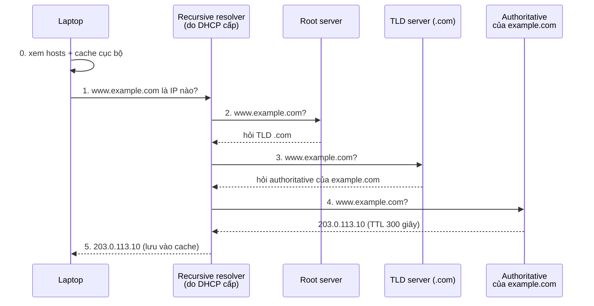

---
tags:
  - Must
  - DNS
  - Concept
  - Troubleshooting
---

# Làm sao một cái tên như www.shopnet.example biến thành địa chỉ IP? (DNS)

## Metadata

```yaml
Chapter: dns-resolution
Phase: 03 — core-services
Importance: Must
Status: draft
Prerequisites:
  - Phase 01 / 04-ipv4-addressing
  - Phase 02 / 03-default-route-gateway
Used Later:
  - Phase 03 / 03-dns-records-ttl-private-dns
  - Phase 04 / 06-tls-certificates
  - Phase 06 / 04-vpc-endpoints-gateway-interface-gwlb
  - Phase 06 / 06-dhcp-options-and-vpc-dns
  - Phase 07 / 05-service-discovery-dns-in-containers
Estimated Reading: 30 phút
Estimated Practice: 40 phút
```

## 1. Story

<!-- Mức bắt buộc (Must): Đủ -->
<!-- DRAFT: người học cần viết lại bằng lời mình -->

Đầu giờ chiều, nhiều người báo `www.shopnet.example` không vào được. Bạn thử `ping 203.0.113.10` (địa chỉ của server): **thông**. Bạn thử `ping www.shopnet.example`: báo "không tìm thấy máy chủ". Đường mạng không có vấn đề gì; thứ hỏng là bước **đổi tên thành địa chỉ**.

Gần như mọi truy cập trên Internet đều bắt đầu bằng bước đó, nên khi nó hỏng, "mọi thứ" đều hỏng dù mạng vẫn tốt. Chapter này giải thích bước đổi tên diễn ra thế nào, ai tham gia, và cách chứng minh lỗi nằm ở đâu.

## 2. Objectives

<!-- Mức bắt buộc (Must): Đủ -->
<!-- DRAFT: người học cần viết lại bằng lời mình -->

Sau chapter này bạn có thể:

- Giải thích vì sao có DNS và nó khác file hosts thế nào.
- Mô tả chuỗi truy vấn từ máy bạn đến máy chủ DNS có thẩm quyền và vai trò của từng bên.
- Giải thích caching và TTL của DNS, và vì sao thay đổi DNS không có hiệu lực tức thì.
- Dùng `Resolve-DnsName`/`nslookup`/`dig` để chứng minh DNS trả gì và từ server nào.
- Phân biệt "tên không tồn tại" với "DNS server không trả lời".

## 3. Prerequisites

<!-- Mức bắt buộc (Must): Đủ -->
<!-- DRAFT: người học cần viết lại bằng lời mình -->

> Xem lại: [ipv4-addressing](../phase-01-foundation/04-ipv4-addressing.md)
> Xem lại: [default-route-gateway](../phase-02-routing/03-default-route-gateway.md)

Máy cần đã có IP và gateway (`01/04`, `02/03`); DNS server thường được cấp kèm bởi DHCP (`03/01`).

## 4. Why it exists

<!-- Mức bắt buộc (Must): Đủ -->
<!-- DRAFT: người học cần viết lại bằng lời mình -->

Con người nhớ tên, máy truyền gói tin bằng địa chỉ IP. Thêm nữa, địa chỉ của một dịch vụ có thể đổi (chuyển server, thêm máy) trong khi tên cần giữ nguyên.

Ngày xưa, một file danh sách tên–địa chỉ được sao chép đến mọi máy. Cách đó không thể mở rộng. **DNS (Domain Name System)** thay thế bằng một cơ sở dữ liệu **phân cấp và phân tán**: không ai giữ toàn bộ, mỗi bên chỉ giữ phần của mình.

Nếu DNS hỏng:

- Gõ tên không vào được, dù gõ IP vẫn vào (Story).
- Trả sai địa chỉ → người dùng đến nhầm server.
- Chậm → mọi thao tác "đầu tiên" đều chậm vì phải chờ DNS.

## 5. Mental model

<!-- Mức bắt buộc (Must): Đủ -->
<!-- DRAFT: người học cần viết lại bằng lời mình -->

Hình dung việc **tra số điện thoại qua tổng đài**: bạn gọi tổng đài (resolver) hỏi số của "Nguyễn Văn A ở quận X". Tổng đài không nhớ hết, nên hỏi hỏi cấp trên (thành phố), rồi quận, rồi chính danh bạ của quận đó. Lần sau có người hỏi lại, tổng đài đọc luôn từ sổ ghi nhớ (cache) nếu chưa quá hạn.

**Tóm tắt một câu:** máy hỏi một resolver, resolver đi hỏi các tầng từ trên xuống cho đến máy chủ có thẩm quyền, rồi nhớ câu trả lời trong thời gian TTL.

## 6. How it works

<!-- Mức bắt buộc (Must): Đủ -->
<!-- DRAFT: người học cần viết lại bằng lời mình -->

Các từ cần biết:

- **DNS (hệ thống tên miền — "danh bạ" phân cấp đổi tên thành địa chỉ IP; đã giới thiệu ở `01/01`).**
- **Name resolution (phân giải tên — việc đổi một tên thành địa chỉ IP).**
- **FQDN (tên miền đầy đủ — tên đủ các phần tới gốc, ví dụ `www.shopnet.example`).**
- **Resolver (bộ phân giải — phần mềm hoặc máy chủ nhận câu hỏi "tên này là IP nào" rồi đi tìm câu trả lời).**
- **Recursive resolver (bộ phân giải đệ quy — máy chủ DNS nhận câu hỏi của máy bạn rồi tự hỏi các máy chủ khác thay bạn cho tới khi có đáp án).**
- **Authoritative name server (máy chủ tên có thẩm quyền — máy chủ giữ bản ghi "chính chủ" của một tên miền và trả lời chắc chắn).**
- **Root server / TLD server (máy chủ gốc / máy chủ tên miền cấp cao — tầng trên cùng của cây DNS; TLD quản lý phần đuôi như `.com`; chúng chỉ đường tới tầng dưới chứ không giữ địa chỉ của từng tên).**
- **Cache (bộ nhớ đệm — nơi lưu tạm câu trả lời để lần sau dùng lại, đỡ phải hỏi lại).**
- **DNS TTL (thời gian lưu của bản ghi DNS — số giây câu trả lời được phép nằm trong cache; khác TTL của gói tin ở `01/01`).**

Theo RFC 1034, các thành phần chính là không gian tên theo cây, **name server** (giữ từng phần dữ liệu, gọi là zone) và **resolver** (phía máy khách, chịu trách nhiệm hỏi và lưu cache). Resolver có thể hỏi theo kiểu *đệ quy* (server nhận câu hỏi tự đi tìm, trả đáp án hoặc lỗi) hoặc nhận *giới thiệu* (referral: "hãy hỏi server kia, gần đáp án hơn").



**Đọc sơ đồ:** laptop chỉ nói chuyện với **một** bên là resolver (bước 1 và 5). Resolver làm phần việc nặng: nó hỏi root, rồi TLD, rồi authoritative, mỗi bước thu hẹp phạm vi. Câu trả lời được lưu ở resolver (và ở laptop) trong thời gian TTL, nên lần hỏi tiếp theo không phải đi lại cả chuỗi. Bước 0 cho thấy máy thường kiểm tra file `hosts` và cache cục bộ **trước** khi hỏi DNS server; đây là lý do `ping tên` và `nslookup tên` đôi khi cho kết quả khác nhau.

Địa chỉ và TTL trong sơ đồ là ví dụ giả. Truy vấn DNS thường dùng cổng 53; chi tiết giao vận ở Phase 04.

> Các loại bản ghi (A, AAAA, CNAME…), TTL chi tiết và DNS nội bộ (private DNS) ở `03/03`. DNS trên AWS ở `06/06`, `06/07`.

<!-- verified: 2026-10-02 https://www.rfc-editor.org/rfc/rfc1034 -->

## 7. Key settings

<!-- Mức bắt buộc (Must): Đủ -->
<!-- DRAFT: người học cần viết lại bằng lời mình -->

| Thông số | Ý nghĩa | Nếu sai |
|---|---|---|
| DNS server của máy | Resolver mà máy hỏi (thường do DHCP cấp) | Phân giải chậm hoặc thất bại |
| File `hosts` | Bảng tên–IP cục bộ, được xem trước DNS | Ghi đè kết quả DNS một cách "âm thầm" |
| Cache cục bộ | Câu trả lời đã lưu | Còn dùng địa chỉ cũ sau khi bản ghi đã đổi |
| Hậu tố tìm kiếm (search suffix) | Phần tên tự thêm khi gõ tên ngắn | Tên ngắn phân giải sai hoặc không phân giải |

Vị trí file `hosts`: Windows `C:\Windows\System32\drivers\etc\hosts`; Linux `/etc/hosts`.

**Xóa cache cục bộ:** `ipconfig /flushdns` hoặc `Clear-DnsClientCache` (Windows).

**Lệnh hỏi DNS:**

- Windows PowerShell: `Resolve-DnsName <tên>`; chỉ định server: `-Server <IP>`; chỉ dùng DNS (bỏ hosts/LLMNR/NetBIOS): `-DnsOnly`; loại bản ghi: `-Type A`.
- `nslookup <tên>` (Windows/Linux), `dig <tên>`, `dig +short <tên>`, `dig +trace <tên>` (Linux/WSL2).

<!-- verified: 2026-10-02 https://learn.microsoft.com/en-us/powershell/module/dnsclient/resolve-dnsname -->

Theo Microsoft, `Resolve-DnsName` thực hiện truy vấn DNS và tương tự `nslookup`, mặc định hỏi các DNS server của giao diện nếu không có `-Server`; `-DnsOnly` chỉ dùng giao thức DNS.

## 8. AWS mapping

<!-- Mức bắt buộc (Must): Đủ nếu có liên quan AWS -->
<!-- DRAFT: người học cần viết lại bằng lời mình -->

Chapter này giữ trung lập vendor. Hướng liên hệ (kiểm chứng ở `06/06`, `06/07`):

| Khái niệm | Trên AWS (dự kiến) |
|---|---|
| Recursive resolver do mạng cấp | Bộ phân giải DNS có sẵn trong VPC, địa chỉ cấp qua DHCP option |
| Authoritative name server cho tên miền của bạn | Route 53 (hosted zone) |

`[CHƯA KIỂM CHỨNG]` — cách hoạt động và tên dịch vụ phải kiểm tra với tài liệu AWS hiện tại.

## 9. Hands-on lab

<!-- Mức bắt buộc (Must): Đủ + expected-output.txt -->
<!-- DRAFT: người học cần viết lại bằng lời mình -->

Chi tiết ở `labs/phase-03-core-services/chapter-02-dns-resolution/README.md`.

**1. Predict:**

- DNS server máy bạn đang dùng là địa chỉ nào? Có trùng default gateway không?
- `example.com` có bao nhiêu địa chỉ IPv4? TTL còn lại khoảng bao nhiêu?
- `dig +trace` sẽ đi qua những tầng nào?

**2. Run (Windows PowerShell):**

```powershell
Get-DnsClientServerAddress -AddressFamily IPv4
Resolve-DnsName example.com -Type A -DnsOnly
```

**Run (WSL2/Linux):**

```bash
dig example.com
dig +trace example.com
```

**3. Verify:** server nào trả lời? TTL là bao nhiêu? Thử chạy lại ngay: TTL còn lại giảm dần nếu cache đang giữ bản ghi.

Output thật: `[CHƯA CHẠY]`. Khi lưu output, thay IP thật bằng IP giả.

## 10. Break it

<!-- Mức bắt buộc (Must): Đủ (≥ 1 Break it) -->
<!-- DRAFT: người học cần viết lại bằng lời mình -->

Hai kiểu thất bại khác nhau:

**Kiểu 1 — tên không tồn tại:**

```powershell
Resolve-DnsName chapter-test.shopnet.example -DnsOnly
```

**Kiểu 2 — DNS server không trả lời** (`192.0.2.53` thuộc dải tài liệu, không có ai trả lời):

```powershell
Resolve-DnsName example.com -Server 192.0.2.53 -DnsOnly
```

**Dự đoán:**

- Kiểu 1: báo lỗi nhanh kiểu "tên không tồn tại" (DNS server **có trả lời**, và câu trả lời là "không có tên này").
- Kiểu 2: chờ một lúc rồi báo hết thời gian (**không có trả lời** từ server).

**Ý nghĩa:** "không tồn tại" nghĩa là hệ thống DNS hoạt động và nói không; "hết thời gian" nghĩa là không liên lạc được với DNS server. Hai trường hợp có nguyên nhân và cách sửa khác hẳn nhau.

**Khôi phục:** không có thay đổi nào trên máy; chạy lại truy vấn bình thường để thấy kết quả đúng.

Kết quả thật: `[CHƯA CHẠY]`.

## 11. Troubleshooting

<!-- Mức bắt buộc (Must): Đủ -->
<!-- DRAFT: người học cần viết lại bằng lời mình -->

Triệu chứng chính: **gõ IP vào được, gõ tên không vào được** (Story).

| Bước | Kiểm tra | Công cụ | Nếu bất thường |
|---|---|---|---|
| 1 | Máy dùng DNS server nào? | `Get-DnsClientServerAddress`, `ipconfig /all` | Sai/thiếu DNS server (xem DHCP `03/01`) |
| 2 | Có liên lạc được DNS server không? | `ping <dns>`, `Resolve-DnsName ... -Server <dns>` | Không trả lời → route/firewall tới DNS server |
| 3 | DNS server có trả lời đúng không? | Hỏi trực tiếp server khác, `dig @<server> <tên>` | `NXDOMAIN` (tên không tồn tại) hay sai địa chỉ |
| 4 | Có bị ghi đè cục bộ không? | File `hosts`, `Clear-DnsClientCache` | Dòng cũ trong `hosts` hoặc cache cũ |
| 5 | Có khác nhau giữa mạng/VPN không? | So sánh kết quả khi bật/tắt VPN | DNS nội bộ chỉ trả lời tên nội bộ (xem `03/03`) |

| Triệu chứng khác | Giả thuyết đầu tiên |
|---|---|
| Phân giải chậm, thỉnh thoảng | DNS server đầu tiên trong danh sách không trả lời, máy chờ rồi mới thử server tiếp |
| Trả địa chỉ cũ sau khi đã đổi | Cache còn hạn TTL (xem `03/03`) |
| `ping tên` lỗi nhưng `nslookup tên` thành công | `ping` dùng bộ phân giải của hệ điều hành (gồm `hosts`), `nslookup` hỏi DNS trực tiếp |

Ghi kết quả thật của mục 10: `[CHƯA CHẠY]`.

## 12. Security & cost

<!-- Mức bắt buộc (Must): Đủ -->
<!-- DRAFT: người học cần viết lại bằng lời mình -->

- DNS thường không mã hóa và không xác thực mặc định, nên câu trả lời giả (spoofing) hoặc cache bị đầu độc là rủi ro có thật. Cơ chế bảo vệ (DNSSEC, DNS qua kênh mã hóa) nằm ngoài phạm vi chapter này.
- Tên nội bộ (ví dụ tên server) có thể lộ qua truy vấn DNS; không để DNS công khai trả tên/địa chỉ nội bộ.
- File `hosts` bị sửa có thể chuyển hướng người dùng đến server giả; kiểm tra khi gặp hành vi lạ.
- Không dán địa chỉ DNS server nội bộ thật vào tài liệu công khai.
- Chi phí: không phát sinh trong chapter này (DNS có tính phí ở một số dịch vụ đám mây; kiểm tra trang giá chính thức khi cần).

## 13. Misconceptions

<!-- Mức bắt buộc (Must): Đủ -->
<!-- DRAFT: người học cần viết lại bằng lời mình -->

| Hiểu nhầm | Sự thật |
|---|---|
| "Không vào được web nghĩa là mạng hỏng" | Có thể chỉ DNS hỏng; thử bằng IP để phân biệt |
| "Đổi bản ghi DNS là có hiệu lực ngay" | Cache giữ câu trả lời cũ cho đến hết TTL |
| "`nslookup` và `ping` đi cùng một đường" | `nslookup` hỏi DNS trực tiếp; `ping` dùng bộ phân giải của hệ điều hành (gồm `hosts`, cache) |
| "Root server giữ địa chỉ của mọi website" | Root chỉ chỉ đường xuống TLD; không giữ địa chỉ từng tên |
| "TTL của DNS là TTL của gói tin" | Hai khái niệm khác nhau: DNS TTL là thời gian lưu cache, TTL gói tin là số chặng còn lại |

## 14. Interview questions

<!-- Mức bắt buộc (Must): Đủ -->
<!-- DRAFT: người học cần viết lại bằng lời mình -->

### Q1 (Junior) — Điều gì xảy ra khi bạn gõ `www.example.com` vào trình duyệt, ở phần DNS?

**Gợi ý ý chính:**
- Máy xem những nơi nào trước khi hỏi DNS server?
- Ai thực sự đi hỏi các tầng root/TLD/authoritative?

??? success "Đáp án mẫu (tự trả lời trước khi mở)"
    Máy xem `hosts` và cache cục bộ; nếu chưa có, gửi câu hỏi tới recursive resolver. Resolver hỏi root → TLD → authoritative name server, nhận địa chỉ IP, lưu cache theo TTL rồi trả cho máy.

### Q2 (Junior) — Vì sao đổi bản ghi DNS không có hiệu lực ngay?

**Gợi ý ý chính:**
- Câu trả lời cũ nằm ở đâu?
- Thuộc tính nào quyết định nó nằm bao lâu?

??? success "Đáp án mẫu (tự trả lời trước khi mở)"
    Resolver và máy khách lưu câu trả lời trong cache cho đến hết TTL. Trước khi hết hạn, họ vẫn dùng địa chỉ cũ. Muốn đổi nhanh nên giảm TTL **trước** khi thay đổi.

### Q3 (Middle) — `NXDOMAIN` khác "hết thời gian truy vấn" thế nào?

**Gợi ý ý chính:**
- Ai đã trả lời trong từng trường hợp?
- Hướng điều tra khác nhau ra sao?

??? success "Đáp án mẫu (tự trả lời trước khi mở)"
    `NXDOMAIN`: DNS server trả lời và nói tên không tồn tại, nên kiểm tra tên và dữ liệu DNS. Hết thời gian: không nhận được trả lời, nên kiểm tra đường tới DNS server (route, firewall, DNS server có chạy không).

### Q4 (Middle) — `ping 203.0.113.10` thông nhưng `ping www.shopnet.example` lỗi. Bạn kiểm tra gì?

**Gợi ý ý chính:**
- Lớp nào còn hoạt động, lớp nào hỏng?
- Đi theo thứ tự nào để chứng minh?

??? success "Đáp án mẫu (tự trả lời trước khi mở)"
    Mạng IP hoạt động nên nghi DNS: DNS server nào đang dùng, liên lạc được không, trả lời đúng không (`Resolve-DnsName -Server`), có bị ghi đè bởi `hosts`/cache không.

## 15. Exercises

<!-- Mức bắt buộc (Must): Đủ -->
<!-- DRAFT: người học cần viết lại bằng lời mình -->

1. **Vẽ chuỗi phân giải.** Chạy `dig +trace example.com` và vẽ lại các bước. *Deliverable:* sơ đồ Mermaid kèm đoạn giải thích 3–5 câu (đã thay IP thật bằng IP giả).
2. **Phân biệt hai lỗi.** *Deliverable:* bảng so sánh `NXDOMAIN` và hết thời gian (ai trả lời, nguyên nhân thường gặp, lệnh kiểm tra tiếp).
3. **Sự cố Story.** *Deliverable:* checklist 5 bước chẩn đoán "gõ IP vào được, gõ tên không" kèm lệnh cho từng bước.

## 16. Cheat sheet

<!-- Mức bắt buộc (Must): Đủ -->
<!-- DRAFT: người học cần viết lại bằng lời mình -->

| Cần làm | Lệnh |
|---|---|
| DNS server của máy (Windows) | `Get-DnsClientServerAddress -AddressFamily IPv4` |
| Hỏi DNS | `Resolve-DnsName <tên> -DnsOnly` / `dig <tên>` / `nslookup <tên>` |
| Hỏi server cụ thể | `Resolve-DnsName <tên> -Server <IP>` / `dig @<IP> <tên>` |
| Xem chuỗi phân giải | `dig +trace <tên>` |
| Xóa cache | `ipconfig /flushdns` / `Clear-DnsClientCache` |

**Chuỗi:** máy (hosts + cache) → recursive resolver → root → TLD → authoritative. **Lỗi:** NXDOMAIN = server nói không; timeout = không có trả lời.

## 17. Glossary terms

<!-- Mức bắt buộc (Must): Đủ -->
<!-- DRAFT: người học cần viết lại bằng lời mình -->

- Name resolution / phân giải tên / 名前解決
- FQDN / tên miền đầy đủ / FQDN
- Resolver / bộ phân giải / リゾルバー
- Recursive resolver / bộ phân giải đệ quy / 再帰リゾルバー
- Authoritative name server / máy chủ tên có thẩm quyền / 権威DNSサーバー
- Root server / máy chủ gốc / ルートサーバー
- Cache / bộ nhớ đệm / キャッシュ
- DNS TTL / thời gian lưu của bản ghi DNS / DNSのTTL

## 18. Further reading

<!-- Mức bắt buộc (Must): Đủ -->
<!-- DRAFT: người học cần viết lại bằng lời mình -->

Kiểm tra ngày 2026-10-02:

- RFC 1034 — Domain Names: Concepts and Facilities: https://www.rfc-editor.org/rfc/rfc1034
- `Resolve-DnsName`: https://learn.microsoft.com/en-us/powershell/module/dnsclient/resolve-dnsname
