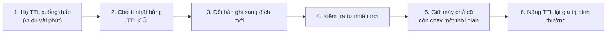
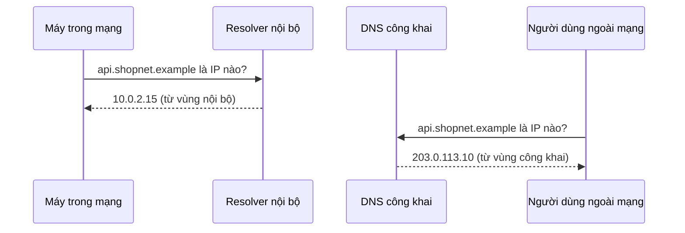

---
tags:
  - Must
  - DNS
  - Concept
  - Troubleshooting
---

# Vì sao đổi một bản ghi DNS mà người dùng vẫn vào server cũ, và làm sao để tên nội bộ không lộ ra ngoài? (Bản ghi, TTL và private DNS)

## Metadata

```yaml
Chapter: dns-records-ttl-private-dns
Phase: 03 — core-services
Importance: Must
Status: draft
Prerequisites:
  - Phase 03 / 02-dns-resolution
Used Later:
  - Phase 06 / 07-route53
Estimated Reading: 30 phút
Estimated Practice: 40 phút
```

## 1. Story

<!-- Mức bắt buộc (Must): Đủ -->
<!-- DRAFT: người học cần viết lại bằng lời mình -->

Nhóm `shopnet` chuyển `www.shopnet.example` sang một server mới. Lúc 22:00 kỹ sư đổi bản ghi A từ địa chỉ cũ sang địa chỉ mới, kiểm tra từ máy mình thấy đúng, rồi tắt server cũ. Sáng hôm sau, một nửa khách hàng báo "trang không vào được". Họ vẫn đang được dẫn tới địa chỉ cũ, vì bản ghi cũ có **TTL 24 giờ** và các resolver trên đường vẫn còn giữ nó trong cache.

Bài học: đổi DNS không phải là "bấm là xong". Chapter này giải thích các loại bản ghi, cách TTL quyết định tốc độ thay đổi, quy trình chuyển đổi an toàn, và cách dùng DNS nội bộ (private DNS) để cùng một tên có thể trả lời khác nhau bên trong và bên ngoài.

## 2. Objectives

<!-- Mức bắt buộc (Must): Đủ -->
<!-- DRAFT: người học cần viết lại bằng lời mình -->

Sau chapter này bạn có thể:

- Nói công dụng của các loại bản ghi thường gặp: A, AAAA, CNAME, NS, MX, TXT, PTR, SOA.
- Giải thích TTL và vì sao thay đổi DNS cần thời gian để lan ra.
- Lập kế hoạch chuyển đổi bản ghi DNS an toàn (hạ TTL trước, đổi, kiểm tra, nâng TTL lại).
- Giải thích hạn chế của CNAME và vì sao tên gốc của miền không đặt được CNAME.
- Giải thích private DNS và split-horizon (cùng tên, trả lời khác theo nơi hỏi), kể cả cách làm trên AWS và một lỗi thường gặp.

## 3. Prerequisites

<!-- Mức bắt buộc (Must): Đủ -->
<!-- DRAFT: người học cần viết lại bằng lời mình -->

> Xem lại: [dns-resolution](02-dns-resolution.md)

Bạn cần nhớ chuỗi phân giải (máy → resolver → root → TLD → authoritative), cache và khái niệm DNS TTL từ `03/02`.

## 4. Why it exists

<!-- Mức bắt buộc (Must): Đủ -->
<!-- DRAFT: người học cần viết lại bằng lời mình -->

DNS không chỉ đổi tên thành địa chỉ IP. Một tên miền còn cần nói: "thư gửi cho tên này đi đâu", "máy chủ nào có thẩm quyền", "tên này là bí danh của tên kia", "chứng minh tôi sở hữu tên miền này". Mỗi nhu cầu có một **loại bản ghi** riêng.

Mỗi bản ghi mang một **TTL** để cân bằng hai nhu cầu đối nghịch: TTL **dài** giảm tải cho DNS server và tăng tốc độ trả lời, nhưng thay đổi lan chậm; TTL **ngắn** thay đổi nhanh nhưng tăng lượng truy vấn.

**Private DNS** tồn tại vì tên và địa chỉ nội bộ (database, service nội bộ) không nên công khai, và nhiều khi cần cùng một tên trả lời địa chỉ nội bộ cho máy bên trong và địa chỉ công khai cho người bên ngoài.

Nếu không hiểu:

- Đổi bản ghi mà không tính TTL → một phần người dùng vào đích cũ trong nhiều giờ (Story).
- Đặt CNAME sai chỗ → bản ghi khác (như MX) bị mất tác dụng hoặc cấu hình bị từ chối.
- Tên nội bộ phân giải được từ Internet → lộ cấu trúc hệ thống; hoặc ngược lại, tên nội bộ không phân giải được trong chính mạng nội bộ.

## 5. Mental model

<!-- Mức bắt buộc (Must): Đủ -->
<!-- DRAFT: người học cần viết lại bằng lời mình -->

Hình dung một danh bạ có nhiều trường cho mỗi người: số điện thoại (A), biệt danh trỏ sang người khác (CNAME), tổng đài phụ trách khu vực (NS), địa chỉ nhận thư (MX). Mỗi tờ ghi chú ở các tổng đài trung gian có **hạn dùng** (TTL); ghi chú đã photo thì dùng đến hết hạn, dù bản gốc đã sửa.

**Tóm tắt một câu:** mỗi loại bản ghi trả lời một câu hỏi khác nhau, TTL quyết định bản sao cũ còn sống bao lâu, và private DNS cho phép cùng một tên có đáp án riêng bên trong mạng.

## 6. How it works

<!-- Mức bắt buộc (Must): Đủ -->
<!-- DRAFT: người học cần viết lại bằng lời mình -->

Các từ cần biết:

- **DNS record (bản ghi DNS — một dòng dữ liệu trong cơ sở dữ liệu DNS, gồm tên, loại, giá trị và TTL).**
- **A record / AAAA record (bản ghi địa chỉ — A đổi tên thành địa chỉ IPv4, AAAA đổi tên thành địa chỉ IPv6).**
- **CNAME record (bản ghi bí danh — nói "tên này là bí danh của tên kia", resolver đi hỏi tiếp tên đích).**
- **NS record (bản ghi máy chủ tên — chỉ ra máy chủ nào có thẩm quyền cho một miền).**
- **MX record (bản ghi thư — nơi nhận email cho miền).**
- **TXT record (bản ghi văn bản — chuỗi chữ tùy ý, thường dùng để chứng minh quyền sở hữu hoặc cấu hình xác thực email).**
- **PTR record (bản ghi tra ngược — đổi địa chỉ IP thành tên).**
- **SOA record (bản ghi khởi đầu vùng — thông tin quản trị của một zone, trong đó có giá trị dùng để quyết định thời gian nhớ câu trả lời "không tồn tại").**
- **Zone (vùng — phần của cây DNS mà một bên quản lý và giữ bản ghi).**
- **Negative caching (nhớ đáp án phủ định — resolver cũng cache câu trả lời "tên này không tồn tại").**
- **Private DNS (DNS nội bộ — vùng DNS chỉ trả lời cho máy trong một mạng nhất định, không công khai).**
- **Split-horizon DNS (DNS chân trời kép — cùng một tên miền nhưng câu trả lời khác nhau tùy máy hỏi ở bên trong hay bên ngoài mạng).**

**Các loại bản ghi thường gặp** (theo RFC 1035):

| Loại | Trả lời câu hỏi | Ví dụ |
|---|---|---|
| A | Tên này ứng với địa chỉ IPv4 nào? | `www.shopnet.example → 203.0.113.10` |
| AAAA | Tên này ứng với địa chỉ IPv6 nào? | (địa chỉ IPv6) |
| CNAME | Tên này là bí danh của tên nào? | `shop.shopnet.example → www.shopnet.example` |
| NS | Máy chủ nào có thẩm quyền cho miền? | `shopnet.example → ns1…` |
| MX | Thư của miền gửi tới đâu? | `shopnet.example → mail…` |
| TXT | Văn bản gắn với tên (xác minh, cấu hình) | chuỗi chữ |
| PTR | Địa chỉ IP này có tên gì? | `10.113.0.203.in-addr.arpa → www.shopnet.example` (tên ngược của `203.0.113.10`: các octet đảo thứ tự) |
| SOA | Thông tin quản trị của zone | số serial, thời gian làm mới… |

**TTL.** Theo RFC 1035, TTL của một bản ghi là khoảng thời gian bản ghi **có thể được cache** trước khi nguồn gốc cần được hỏi lại; giá trị 0 nghĩa là chỉ dùng cho truy vấn hiện tại, không cache. Resolver đếm ngược TTL; hết hạn thì hỏi lại authoritative server.

**Negative caching.** Câu trả lời "không tồn tại" (`NXDOMAIN`) và "tên có nhưng không có bản ghi loại này" cũng được cache. Theo RFC 2308, thời gian cache lấy từ trường MINIMUM của bản ghi SOA (và TTL của chính SOA, lấy giá trị nhỏ hơn). Hệ quả: tạo một tên **vừa có người hỏi trước đó** có thể vẫn trả về "không tồn tại" một lúc.

**Quy trình chuyển đổi bản ghi an toàn.** Muốn người dùng chuyển sang đích mới trong thời gian ngắn:



**Đọc sơ đồ:** bước 1–2 là then chốt: hạ TTL **rồi chờ hết TTL cũ**, vì các cache đang giữ bản ghi cũ phải hết hạn thì mới nhận TTL mới. Chỉ khi đó đổi bản ghi (bước 3) mới lan nhanh. Bước 5 giữ máy chủ cũ để phục vụ những người dùng chưa kịp chuyển; trong Story, việc tắt máy cũ ngay làm một nửa khách hàng gặp lỗi.

**CNAME và hạn chế.** CNAME là bí danh: resolver gặp CNAME thì đi hỏi tên đích. Theo RFC 1034, nếu một tên đã có CNAME thì **không nên có dữ liệu nào khác** ở tên đó. Hệ quả: tên gốc của miền (ví dụ `shopnet.example`) luôn có SOA và NS nên **không đặt được CNAME**; nhiều nhà cung cấp DNS có loại bản ghi riêng thay thế, hoạt động khác nhau tùy nhà cung cấp.

**Private DNS và split-horizon.**



**Đọc sơ đồ:** cùng một tên, hai câu trả lời khác nhau vì hai máy hỏi **hai resolver khác nhau**. Máy trong mạng hỏi resolver nội bộ nên nhận địa chỉ private; người bên ngoài hỏi DNS công khai nên nhận địa chỉ công khai. Đây là split-horizon DNS. Địa chỉ nội bộ không bao giờ xuất hiện ngoài mạng.

> DNS trên AWS (private hosted zone, Route 53) ở mục 8 và `06/07`; resolver do mạng cấp ở `06/06`.

<!-- verified: 2026-10-02 https://www.rfc-editor.org/rfc/rfc1035 -->
<!-- verified: 2026-10-02 https://www.rfc-editor.org/rfc/rfc2308 -->
<!-- verified: 2026-10-02 https://www.rfc-editor.org/rfc/rfc1034 -->

## 7. Key settings

<!-- Mức bắt buộc (Must): Đủ -->
<!-- DRAFT: người học cần viết lại bằng lời mình -->

| Thông số | Ý nghĩa | Nếu sai |
|---|---|---|
| TTL của bản ghi | Bản ghi nằm trong cache bao lâu | Quá dài: đổi chậm lan; quá ngắn: nhiều truy vấn, phụ thuộc mạnh vào DNS server |
| Loại bản ghi | Câu hỏi mà bản ghi trả lời | Tạo nhầm loại (A thay vì CNAME…) khiến cấu hình không như ý |
| CNAME tại tên gốc | Không hợp lệ | Cấu hình bị từ chối hoặc làm hỏng MX/NS |
| Zone công khai/nội bộ | Ai thấy bản ghi | Lộ tên nội bộ, hoặc tên nội bộ không phân giải được |
| Giá trị SOA MINIMUM | Thời gian nhớ đáp án phủ định | Tên mới tạo vẫn "không tồn tại" lâu |

**Không có con số TTL "đúng" cho mọi trường hợp.** Quy tắc: TTL ngắn khi sắp thay đổi hoặc cần phát hiện lỗi nhanh, TTL dài khi bản ghi ổn định. Chọn theo nhu cầu cụ thể và kiểm tra trên nhà cung cấp DNS của bạn.

## 8. AWS mapping

<!-- Mức bắt buộc (Must): Đủ nếu có liên quan AWS -->
<!-- DRAFT: người học cần viết lại bằng lời mình -->

| Khái niệm | Trên AWS |
|---|---|
| Zone công khai | Public hosted zone của Route 53 |
| Zone nội bộ | Private hosted zone của Route 53, gắn với một hay nhiều VPC |
| Split-horizon | Tạo zone công khai và zone riêng **cùng tên**; kết quả phụ thuộc máy hỏi ở trong VPC đã gắn hay không |
| Resolver nội bộ | Bộ phân giải do Amazon cung cấp trong VPC, địa chỉ ở "đầu dải VPC cộng 2" (ví dụ VPC `10.0.0.0/16` thì `10.0.0.2`) |

<!-- verified: 2026-10-02 https://docs.aws.amazon.com/Route53/latest/DeveloperGuide/hosted-zones-private.html -->
<!-- verified: 2026-10-02 https://docs.aws.amazon.com/Route53/latest/DeveloperGuide/hosted-zone-private-considerations.html -->

Theo tài liệu AWS:

- Private hosted zone chỉ trả lời cho máy chạy trong VPC được gắn với zone (hoặc qua inbound endpoint trong cấu hình hybrid). Truy vấn từ nơi khác được phân giải đệ quy trên Internet.
- Để dùng private hosted zone, hai thuộc tính của VPC là `enableDnsHostnames` và `enableDnsSupport` phải đặt là `true`.
- Khi có zone riêng và zone công khai chồng tên, VPC Resolver chọn theo **khớp cụ thể nhất**.
- **Lỗi thường gặp:** nếu có private hosted zone khớp tên miền trong yêu cầu nhưng **không có bản ghi** khớp tên và loại, VPC Resolver **không** chuyển lên DNS công khai mà trả `NXDOMAIN` cho máy khách. Vì vậy khi tạo zone riêng cho `shopnet.example`, mọi tên mà máy trong VPC cần phân giải (kể cả tên công khai như `www`) cũng phải có bản ghi trong zone riêng.
- Nếu có Route 53 Resolver rule chuyển tiếp cùng tên miền, rule đó ưu tiên hơn private hosted zone.
- Địa chỉ IP, tên dịch vụ và giới hạn có thể thay đổi; kiểm tra lại trước khi dựa vào chi tiết.

Chi tiết cách tạo và cấu hình ở `06/06`, `06/07`.

## 9. Hands-on lab

<!-- Mức bắt buộc (Must): Đủ + expected-output.txt -->
<!-- DRAFT: người học cần viết lại bằng lời mình -->

Chi tiết ở `labs/phase-03-core-services/chapter-03-dns-records-ttl-private-dns/README.md`.

**1. Predict:** với `example.com`:

- Loại bản ghi nào chắc chắn có (A, NS, SOA)? MX/TXT có không?
- TTL của bản ghi A là bao nhiêu? Chạy lại ngay: TTL giảm hay giữ nguyên?
- Khi hỏi một tên không tồn tại, câu trả lời có kèm bản ghi SOA không (gợi ý: negative caching)?

**2. Run (WSL2/Linux):**

```bash
dig example.com A +noall +answer
dig example.com NS +noall +answer
dig example.com MX +noall +answer
dig example.com TXT +noall +answer
dig example.com SOA +noall +answer
dig chapter-test.example.com +noall +authority +comments
```

**Run (Windows PowerShell):**

```powershell
Resolve-DnsName example.com -Type A -DnsOnly
Resolve-DnsName example.com -Type NS -DnsOnly
Resolve-DnsName example.com -Type SOA -DnsOnly
```

**3. Verify:** ghi TTL từng loại; chạy lại lệnh `A` sau vài giây để xem TTL còn lại giảm dần (nếu resolver đang cache). Đối với tên không tồn tại, quan sát bản ghi SOA ở phần authority và TTL của nó.

Output thật: `[CHƯA CHẠY]`. Khi lưu output, thay IP thật bằng IP giả, tên máy chủ thật bằng `ns1.example.com`.

## 10. Break it

<!-- Mức bắt buộc (Must): Đủ (≥ 1 Break it) -->
<!-- DRAFT: người học cần viết lại bằng lời mình -->

Lab đơn giản không dựng được resolver trung gian để thấy cache theo TTL, nên bài này mô phỏng **một bản ghi cũ còn nằm lại cục bộ** (giống cache lỗi thời): file `hosts` che mất DNS.

```powershell
docker run --rm -it alpine sh
```

Trong container:

```sh
echo "192.0.2.10 www.shopnet.example" >> /etc/hosts
ping -c 1 -W 1 www.shopnet.example
nslookup www.shopnet.example
```

**Dự đoán:**

- `ping` phân giải tên thành `192.0.2.10` (lấy từ `hosts`) rồi hết thời gian vì địa chỉ này không có ai trả lời.
- `nslookup` hỏi DNS trực tiếp và báo tên không tồn tại, vì `shopnet.example` là tên giả.

**Ý nghĩa:** hai công cụ cho hai kết quả khác nhau vì chúng tra ở hai nơi khác nhau. Một bản ghi cũ ở **bất kỳ tầng cache nào** (hosts, cache máy, cache resolver) cũng làm máy đi sai chỗ dù DNS "gốc" đã đúng, và kiểm tra bằng `nslookup` một mình không thấy được.

**Khôi phục:** `exit`; container `--rm` tự xóa.

Kết quả thật: `[CHƯA CHẠY]`.

## 11. Troubleshooting

<!-- Mức bắt buộc (Must): Đủ -->
<!-- DRAFT: người học cần viết lại bằng lời mình -->

Triệu chứng chính: **đã đổi bản ghi nhưng một số người vẫn vào đích cũ** (Story).

| Bước | Kiểm tra | Công cụ |
|---|---|---|
| 1 | Hỏi **authoritative server** (nguồn thật) xem bản ghi đã đúng chưa | `dig @<ns của miền> <tên>` |
| 2 | Hỏi **resolver** mà người dùng đang dùng, xem TTL còn lại | `dig @<resolver> <tên>` |
| 3 | TTL cũ là bao nhiêu? (đó là thời gian tối đa còn lại người dùng có thể thấy bản cũ) | `dig <tên> +noall +answer` |
| 4 | Máy người dùng có còn cache hoặc `hosts` cũ không | `Clear-DnsClientCache`, kiểm tra `hosts` |
| 5 | Trong mạng có private zone che tên không (split-horizon) | So sánh `dig` từ trong và ngoài mạng |

| Triệu chứng khác | Giả thuyết đầu tiên |
|---|---|
| Tên mới tạo vẫn báo "không tồn tại" | Negative caching (đã có người hỏi trước khi bản ghi tồn tại) |
| Trong VPC phân giải tên công khai thất bại sau khi tạo private zone cùng tên | Private zone khớp nhưng thiếu bản ghi → `NXDOMAIN` (không chuyển ra ngoài) |
| Không đặt được CNAME ở tên gốc của miền | Hạn chế của CNAME; dùng loại bản ghi thay thế của nhà cung cấp |
| Truy vấn từ ngoài thấy địa chỉ nội bộ | Tên nội bộ nằm nhầm trong zone công khai |
| Email của miền không nhận | Thiếu/sai MX, hoặc CNAME xung đột ở cùng tên |

Ghi kết quả thật của mục 10: `[CHƯA CHẠY]`.

## 12. Security & cost

<!-- Mức bắt buộc (Must): Đủ -->
<!-- DRAFT: người học cần viết lại bằng lời mình -->

- **Zone công khai là công khai:** mọi bản ghi (kể cả TXT) ai cũng đọc được; đừng đặt tên/địa chỉ nội bộ hay thông tin nhạy cảm vào đó.
- **CNAME treo (dangling CNAME):** nếu một CNAME trỏ tới tài nguyên đã bị xóa, người khác có thể đăng ký lại tài nguyên đó và chiếm tên của bạn. Dọn bản ghi khi gỡ dịch vụ.
- **Private DNS không mã hóa:** nó chỉ giới hạn *ai được hỏi*, không bảo vệ nội dung truy vấn.
- Đổi DNS là thay đổi có rủi ro cao; có kế hoạch quay lui (giữ máy chủ cũ, TTL đủ ngắn) trước khi đổi.
- **Chi phí:** TTL rất ngắn làm tăng số truy vấn, có thể tăng chi phí ở nhà cung cấp tính phí theo truy vấn; kiểm tra bảng giá chính thức. Trên đám mây, zone và truy vấn có thể tính phí; xem `06/07` và trang giá chính thức, không ghi số trong sách.

## 13. Misconceptions

<!-- Mức bắt buộc (Must): Đủ -->
<!-- DRAFT: người học cần viết lại bằng lời mình -->

| Hiểu nhầm | Sự thật |
|---|---|
| "TTL càng ngắn càng tốt" | TTL ngắn tăng tải và phụ thuộc DNS; chỉ nên ngắn khi sắp thay đổi hoặc cần phát hiện lỗi nhanh |
| "Đổi bản ghi xong là có hiệu lực ngay" | Các cache giữ bản cũ đến hết TTL; phải hạ TTL trước và chờ hết TTL cũ |
| "CNAME là chuyển hướng trang web" | CNAME là bí danh ở mức DNS; việc chuyển hướng URL là việc của HTTP |
| "Tên gốc miền đặt CNAME được" | Tên gốc có SOA/NS nên không đặt được CNAME |
| "Private DNS là mã hóa" | Chỉ giới hạn nơi trả lời; không mã hóa truy vấn |
| "Câu trả lời không tồn tại không được cache" | Có (negative caching), theo giá trị trong SOA |

## 14. Interview questions

<!-- Mức bắt buộc (Must): Đủ -->
<!-- DRAFT: người học cần viết lại bằng lời mình -->

### Q1 (Junior) — A record và CNAME khác nhau thế nào?

**Gợi ý ý chính:**
- Giá trị của A là gì, của CNAME là gì?
- Resolver làm gì khi gặp CNAME?

??? success "Đáp án mẫu (tự trả lời trước khi mở)"
    A đổi tên thành địa chỉ IPv4. CNAME nói tên này là bí danh của một tên khác; resolver đi hỏi tiếp tên đích để lấy địa chỉ.

### Q2 (Middle) — Bạn cần chuyển `www.shopnet.example` sang server mới với gián đoạn tối thiểu. Các bước?

**Gợi ý ý chính:**
- Cache đang giữ bản ghi cũ bao lâu?
- Bạn nên làm gì với TTL trước, và với server cũ sau?

??? success "Đáp án mẫu (tự trả lời trước khi mở)"
    Hạ TTL xuống thấp, chờ ít nhất bằng TTL cũ để các cache đã nhận TTL mới, đổi bản ghi, kiểm tra từ nhiều nơi, giữ server cũ còn chạy một thời gian, rồi nâng TTL lại.

### Q3 (Middle) — Vì sao không đặt CNAME ở tên gốc của miền?

**Gợi ý ý chính:**
- Tên gốc luôn có những bản ghi nào?
- Quy tắc nào cấm CNAME cùng với dữ liệu khác?

??? success "Đáp án mẫu (tự trả lời trước khi mở)"
    Tên gốc luôn có SOA và NS. Quy tắc của DNS là nếu một tên có CNAME thì không nên có dữ liệu khác tại tên đó, nên CNAME ở tên gốc xung đột với SOA/NS (và MX nếu có).

### Q4 (Middle) — Trên AWS, bạn tạo private hosted zone `shopnet.example` rồi máy trong VPC không phân giải được `www.shopnet.example` nữa. Vì sao?

**Gợi ý ý chính:**
- Zone nào khớp tên yêu cầu?
- Nếu thiếu bản ghi trong zone riêng, resolver làm gì?

??? success "Đáp án mẫu (tự trả lời trước khi mở)"
    Private hosted zone khớp tên miền nên VPC Resolver chỉ tìm trong zone đó; không có bản ghi `www` thì nó trả `NXDOMAIN` thay vì chuyển ra DNS công khai. Cần thêm bản ghi `www` (và các tên khác cần dùng) vào zone riêng.

## 15. Exercises

<!-- Mức bắt buộc (Must): Đủ -->
<!-- DRAFT: người học cần viết lại bằng lời mình -->

1. **Đọc bản ghi.** Với một tên miền công khai tùy chọn dành cho ví dụ (khuyến nghị `example.com`). *Deliverable:* bảng gồm loại bản ghi, giá trị (đã thay IP/tên thật), TTL và 1 câu giải thích mỗi dòng.
2. **Kế hoạch chuyển đổi.** Bản ghi `www.shopnet.example` đang có TTL 86.400 giây. *Deliverable:* timeline từng bước (kèm thời điểm tương đối) để chuyển sang đích mới với gián đoạn tối thiểu và kế hoạch quay lui.
3. **Thiết kế split-horizon.** `api.shopnet.example` phải trả `10.0.2.15` trong mạng và `203.0.113.10` ngoài mạng. *Deliverable:* sơ đồ Mermaid và danh sách bản ghi cho zone nội bộ và zone công khai, kèm giải thích vì sao zone nội bộ cần có cả bản ghi cho các tên công khai khác.

## 16. Cheat sheet

<!-- Mức bắt buộc (Must): Đủ -->
<!-- DRAFT: người học cần viết lại bằng lời mình -->

| Loại | Dùng cho |
|---|---|
| A / AAAA | Tên → IPv4 / IPv6 |
| CNAME | Bí danh (không đặt ở tên gốc) |
| NS | Máy chủ có thẩm quyền |
| MX | Nhận email |
| TXT | Xác minh/cấu hình |
| PTR | IP → tên |
| SOA | Thông tin zone; thời gian nhớ đáp án phủ định |

**TTL:** hạ trước → chờ hết TTL cũ → đổi → kiểm tra → nâng lại. **Debug:** hỏi authoritative → hỏi resolver → xem cache/hosts → kiểm tra split-horizon.

## 17. Glossary terms

<!-- Mức bắt buộc (Must): Đủ -->
<!-- DRAFT: người học cần viết lại bằng lời mình -->

- DNS record / bản ghi DNS / DNSレコード
- A record / bản ghi A / Aレコード
- CNAME record / bản ghi bí danh / CNAMEレコード
- NS record / bản ghi máy chủ tên / NSレコード
- MX record / bản ghi thư / MXレコード
- TXT record / bản ghi văn bản / TXTレコード
- PTR record / bản ghi tra ngược / PTRレコード
- SOA record / bản ghi khởi đầu vùng / SOAレコード
- Zone / vùng / ゾーン
- Negative caching / nhớ đáp án phủ định / ネガティブキャッシュ
- Private DNS / DNS nội bộ / プライベートDNS
- Split-horizon DNS / DNS chân trời kép / スプリットホライズンDNS

## 18. Further reading

<!-- Mức bắt buộc (Must): Đủ -->
<!-- DRAFT: người học cần viết lại bằng lời mình -->

Kiểm tra ngày 2026-10-02:

- RFC 1034 — Domain Names: Concepts and Facilities: https://www.rfc-editor.org/rfc/rfc1034
- RFC 1035 — Domain Names: Implementation and Specification: https://www.rfc-editor.org/rfc/rfc1035
- RFC 2308 — Negative Caching of DNS Queries: https://www.rfc-editor.org/rfc/rfc2308
- Route 53 — Working with private hosted zones: https://docs.aws.amazon.com/Route53/latest/DeveloperGuide/hosted-zones-private.html
- Route 53 — Considerations when working with a private hosted zone: https://docs.aws.amazon.com/Route53/latest/DeveloperGuide/hosted-zone-private-considerations.html
