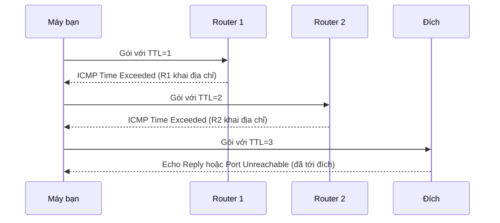

---
tags:
  - Must
  - ICMP
  - Concept
  - Troubleshooting
---

# Ping và traceroute thực sự đo điều gì, và vì sao "không ping được" chưa chắc là hỏng? (ICMP)

## Metadata

```yaml
Chapter: icmp-ping-traceroute
Phase: 03 — core-services
Importance: Must
Status: draft
Prerequisites:
  - Phase 00 / 02-linux-network-tools
  - Phase 01 / 04-ipv4-addressing
  - Phase 02 / 01-routing-table-basics
Used Later:
  - Phase 06 / 11-flow-logs-reachability-analyzer
  - Phase 08 / 01-troubleshooting-methodology-layered
Estimated Reading: 30 phút
Estimated Practice: 45 phút
```

## 1. Story

<!-- Mức bắt buộc (Must): Đủ -->
<!-- DRAFT: người học cần viết lại bằng lời mình -->

Hệ thống giám sát báo `shopnet-app-01` "chết" vì `ping` hết thời gian. Kỹ sư trực ca khởi động lại server lúc nửa đêm. Thật ra website vẫn đang phục vụ khách bình thường: server **không trả lời ping** vì quy tắc firewall mới chỉ cho phép cổng 443 và chặn ICMP. Việc khởi động lại gây gián đoạn thật, còn "sự cố" chỉ là một phép đo sai.

Ngược lại, có lần ping thông nhưng trang vẫn không mở được. Ping và traceroute là hai công cụ được dùng nhiều nhất và cũng bị hiểu sai nhiều nhất. Chapter này giải thích chúng dựa trên giao thức nào, đo được gì, **không** đo được gì, và cách đọc kết quả đúng.

## 2. Objectives

<!-- Mức bắt buộc (Must): Đủ -->
<!-- DRAFT: người học cần viết lại bằng lời mình -->

Sau chapter này bạn có thể:

- Giải thích ICMP là gì, nó nằm ở tầng nào và vì sao IP cần nó.
- Mô tả cách `ping` và `traceroute`/`tracert` hoạt động ở mức thông điệp ICMP.
- Đọc kết quả ping/traceroute và phân biệt "hết thời gian", "đích không tới được" và "hết TTL".
- Giải thích vì sao ping thất bại không chứng minh đích hỏng, và ngược lại.
- Giải thích vì sao chặn toàn bộ ICMP gây hại (path MTU) và dùng `ping` với cờ cấm phân mảnh để kiểm tra MTU.

## 3. Prerequisites

<!-- Mức bắt buộc (Must): Đủ -->
<!-- DRAFT: người học cần viết lại bằng lời mình -->

> Xem lại: [linux-network-tools](../phase-00-lab-toolkit/02-linux-network-tools.md)
> Xem lại: [ipv4-addressing](../phase-01-foundation/04-ipv4-addressing.md)
> Xem lại: [routing-table-basics](../phase-02-routing/01-routing-table-basics.md)

Bạn cần nhớ hành trình gói tin và TTL ở [packet-journey](../phase-01-foundation/01-packet-journey.md), và khác biệt "không có đường đi" với "hết thời gian" ở `02/01`.

## 4. Why it exists

<!-- Mức bắt buộc (Must): Đủ -->
<!-- DRAFT: người học cần viết lại bằng lời mình -->

IP chỉ cố gắng chuyển gói tin đi (best-effort) và **không tự báo lại** khi có chuyện: gói bị bỏ, đích không tồn tại, TTL về 0. Nếu không có cơ chế báo lỗi, người gửi chỉ thấy im lặng. **ICMP (Internet Control Message Protocol)** là giao thức đi kèm IP để các router và máy **báo ngược** những điều đó, đồng thời cung cấp phép thử đơn giản "có ai ở đó không" (echo).

Hệ quả khi không hiểu ICMP:

- Coi ping là phép thử "sống/chết" tuyệt đối (Story).
- Chặn mọi ICMP trên firewall rồi gặp lỗi kết nối kỳ lạ với gói lớn (path MTU).
- Đọc sai `* * *` trong traceroute và đi sửa nhầm chỗ.

## 5. Mental model

<!-- Mức bắt buộc (Must): Đủ -->
<!-- DRAFT: người học cần viết lại bằng lời mình -->

Hình dung người đưa thư: nếu địa chỉ không tồn tại hoặc tem hết hạn giữa đường, **một nhân viên bưu điện gửi lại cho bạn một tờ ghi chú** nói lý do. ICMP chính là các tờ ghi chú đó. `ping` là việc bạn gửi một "tờ gọi cửa" và chờ người nhận ghi lại "có nhà". Nhưng người nhận có thể không muốn trả lời (chặn), và một số bưu cục không gửi ghi chú (không trả lời).

**Tóm tắt một câu:** ICMP là kênh báo lỗi và phép thử echo của IP; không có trả lời ICMP chỉ nói rằng *không có trả lời ICMP*, chưa nói máy hay dịch vụ hỏng.

## 6. How it works

<!-- Mức bắt buộc (Must): Đủ -->
<!-- DRAFT: người học cần viết lại bằng lời mình -->

Các từ cần biết:

- **ICMP (giao thức thông điệp điều khiển Internet — giao thức đi kèm IP, dùng để báo lỗi và kiểm tra liên lạc).**
- **Ping (lệnh thử liên lạc — gửi thông điệp ICMP echo tới một đích và chờ echo trả lời).**
- **Traceroute (lệnh dò đường — liệt kê các router trên đường tới đích bằng cách gửi gói với TTL tăng dần; trên Windows là `tracert`).**
- **RTT (thời gian khứ hồi — thời gian từ lúc gửi tới lúc nhận trả lời).**
- **Packet loss (mất gói — tỷ lệ gói gửi đi mà không nhận được trả lời).**
- **MTU (kích thước gói tối đa — gói lớn nhất một đường truyền chuyển được mà không phải chia nhỏ).**
- **Path MTU Discovery (dò MTU của cả đường đi — cách máy tìm MTU nhỏ nhất trên đường tới đích nhờ thông điệp ICMP).**

ICMP không có số cổng; nó được đóng gói **trực tiếp trong IP** (giao thức số 1 cho IPv4, theo bảng quy tắc ICMP của AWS) và có **loại (type)** và **mã (code)**. Theo RFC 792, những loại quan trọng nhất:

| Type | Tên | Ý nghĩa | Hay gặp khi |
|---|---|---|---|
| 8 | Echo Request | "Có ai ở đó không?" | `ping` gửi đi |
| 0 | Echo Reply | "Có, tôi đây" | `ping` nhận về |
| 3 | Destination Unreachable | Không chuyển được gói. Code 0 mạng không tới được, 1 máy không tới được, 2 giao thức không hỗ trợ, 3 cổng không tới được, 4 cần phân mảnh nhưng cờ DF bật | Thiếu route, không có dịch vụ ở cổng, gói quá lớn |
| 11 | Time Exceeded | Code 0: TTL về 0 giữa đường | `traceroute` dùng nó |
| 5 | Redirect | "Có đường tốt hơn qua router khác" | Máy gửi nhầm router |

**Ping.** Máy gửi Echo Request (type 8); đích sẵn sàng thì gửi Echo Reply (type 0); `ping` in thời gian khứ hồi. Mặc định Windows gửi 4 gói, chờ tối đa 4 giây cho mỗi gói.

**Traceroute.** Dùng TTL để khiến từng router tự "khai danh":



**Đọc sơ đồ:** TTL=1 chỉ đi được qua một chặng nên router đầu tiên trừ về 0, bỏ gói và gửi Time Exceeded, khiến bạn biết địa chỉ của nó. TTL=2 làm lộ router thứ hai, và cứ thế đến khi gói tới đích. Đích trả lời khác nhau tùy kiểu thăm dò: Windows `tracert` dùng ICMP Echo nên đích trả Echo Reply; `traceroute` trên Linux mặc định dùng UDP tới cổng "ít khi dùng" nên đích trả Port Unreachable; có thể đổi sang ICMP (`-I`) hoặc TCP (`-T`).

**Đọc kết quả ping, và ai là người nói:**

| Thông báo | Nghĩa | Nguyên nhân thường gặp |
|---|---|---|
| `Reply from X: bytes=… time=…` | Đích trả lời | Bình thường |
| `Request timed out` (hết thời gian) | **Không có trả lời nào**; chưa biết gói bị mất ở đâu | Đích chặn ICMP, gói hoặc trả lời bị mất/chặn, đích không tồn tại |
| `Reply from X: Destination host unreachable` | Thiết bị **X** báo không chuyển tới đích được (ICMP type 3) | X là router không có đường, hoặc không phân giải được MAC của đích; **chú ý X là ai** |
| `Network is unreachable` / lỗi báo ngay tại máy | Chính máy bạn không có route | Thiếu default route (`02/01`) |
| `Time to live exceeded` | Gói hết TTL giữa đường (type 11) | Vòng lặp route hoặc TTL quá thấp |

Điểm quan trọng nhất: **"hết thời gian" không nói gì về nguyên nhân**, còn "unreachable" cho biết *ai* báo.

**Vì sao không nên chặn toàn bộ ICMP: path MTU.** Máy gửi gói với cờ "không phân mảnh" (DF); nếu một đường truyền trên đường đi chỉ chuyển được gói nhỏ hơn, router trả ICMP type 3 code 4 ("cần phân mảnh nhưng DF bật") kèm MTU cho phép; máy hạ kích thước gói theo (RFC 1191). Nếu firewall chặn thông điệp này, máy không bao giờ biết, gói lớn bị mất im lặng: kết nối chạy với gói nhỏ (handshake, ping) nhưng treo khi truyền dữ liệu lớn.

**ICMP có thể bị giới hạn.** Router thường xử lý các gói gửi *đến chính nó* (như Time Exceeded) với độ ưu tiên thấp và có thể giới hạn tốc độ. Vì vậy một chặng có thể hiện `* * *` hoặc RTT cao mà gói đi **xuyên qua** nó vẫn bình thường.

> Hành trình TTL ở `01/01`; xử lý theo tầng và `traceroute` trong chẩn đoán ở `08/01`; Flow Logs và Reachability Analyzer của AWS ở `06/11`.

<!-- verified: 2026-10-02 https://www.rfc-editor.org/rfc/rfc792 -->
<!-- verified: 2026-10-02 https://www.rfc-editor.org/rfc/rfc1191 -->
<!-- verified: 2026-10-02 https://learn.microsoft.com/en-us/windows-server/administration/windows-commands/ping -->
<!-- verified: 2026-10-02 https://linux.die.net/man/8/traceroute -->

## 7. Key settings

<!-- Mức bắt buộc (Must): Đủ -->
<!-- DRAFT: người học cần viết lại bằng lời mình -->

| Việc | Windows | Linux / WSL2 |
|---|---|---|
| Số gói | `ping -n 4 <đích>` | `ping -c 4 <đích>` |
| Chạy liên tục | `ping -t <đích>` | `ping <đích>` (Ctrl+C để dừng) |
| Thời gian chờ mỗi gói | `-w <ms>` (mặc định 4000) | `-W <giây>` |
| Kích thước dữ liệu | `-l <byte>` (mặc định 32) | `-s <byte>` |
| Cấm phân mảnh | `-f` | `-M do` |
| Dò đường | `tracert -d <đích>` (`-h` số chặng tối đa, mặc định 30) | `traceroute -n <đích>` (`-m` số chặng tối đa) |
| Đổi kiểu thăm dò | (luôn ICMP echo) | `traceroute -I` (ICMP), `-T` (TCP SYN) |

**Kiểm tra MTU của đường đi (IPv4, ví dụ MTU 1500).** Gói ICMP có 20 byte header IP và 8 byte header ICMP, nên dữ liệu tối đa không phân mảnh là `MTU − 28`. Với MTU 1500 thử `ping -f -l 1472` (Windows) hoặc `ping -M do -s 1472` (Linux): 1472 đi qua, 1473 thì thất bại.

**Trên firewall:** cho phép tối thiểu các loại ICMP cần thiết (Echo từ nguồn tin cậy, Destination Unreachable, Time Exceeded) thay vì chặn tất cả.

## 8. AWS mapping

<!-- Mức bắt buộc (Must): Đủ nếu có liên quan AWS -->
<!-- DRAFT: người học cần viết lại bằng lời mình -->

<!-- verified: 2026-10-02 https://docs.aws.amazon.com/AWSEC2/latest/UserGuide/security-group-rules-reference.html -->

Theo tài liệu AWS, `ping` là lưu lượng ICMP, nên **để ping một EC2 instance bạn phải thêm quy tắc inbound ICMP** vào security group của nó (loại "Custom ICMP - IPv4" với Echo request, hoặc "All ICMP - IPv4", nguồn là địa chỉ cho phép). Với IPv6 dùng `ping6` cần quy tắc "All ICMP - IPv6".

Hệ quả: nếu một instance "không ping được" trên AWS, đó thường là do thiếu quy tắc ICMP chứ chưa phải instance hỏng; kiểm tra bằng cổng dịch vụ (ví dụ `Test-NetConnection -Port 443`). Phần này gắn trực tiếp với Story. Chi tiết security group ở `06/03`; công cụ phân tích đường đi của AWS ở `06/11`. Tài liệu AWS có thể thay đổi; kiểm tra lại trước khi dựa vào chi tiết.

## 9. Hands-on lab

<!-- Mức bắt buộc (Must): Đủ + expected-output.txt -->
<!-- DRAFT: người học cần viết lại bằng lời mình -->

Chi tiết ở `labs/phase-03-core-services/chapter-04-icmp-ping-traceroute/README.md`.

**1. Predict:**

- Ping default gateway của bạn: RTT khoảng bao nhiêu (rất nhỏ hay lớn)? Có mất gói không?
- `tracert -d example.com` (ICMP) và `traceroute -n example.com` (UDP mặc định) có đến được đích không? Số chặng có khác nhau không?
- MTU đường đi của bạn là bao nhiêu (thử 1472 và 1473)?

**2. Run (Windows PowerShell/cmd):**

```powershell
ping -n 4 <default gateway của bạn>
ping -n 4 example.com
tracert -d example.com
ping -f -l 1472 -n 2 example.com
ping -f -l 1473 -n 2 example.com
```

**Run (WSL2/Linux):**

```bash
traceroute -n example.com
traceroute -n -I example.com
traceroute -n -T -p 443 example.com
ping -M do -s 1472 -c 2 example.com
ping -M do -s 1473 -c 2 example.com
```

**3. Verify:** so sánh ba kiểu traceroute (UDP, ICMP, TCP): chặng nào hiện `*`? Kiểu nào tới được đích? 1472 qua được và 1473 thất bại không?

Output thật: `[CHƯA CHẠY]`. Khi lưu output, thay IP thật bằng IP giả.

## 10. Break it

<!-- Mức bắt buộc (Must): Đủ (≥ 1 Break it) -->
<!-- DRAFT: người học cần viết lại bằng lời mình -->

**Gây lỗi:** tái hiện Story: chặn ICMP echo trong khi dịch vụ TCP vẫn chạy. Làm trong container (cần `--cap-add NET_ADMIN`):

```powershell
docker run --rm -it --cap-add NET_ADMIN alpine sh
```

Trong container:

```sh
apk add --no-cache iptables
ping -c 1 127.0.0.1
iptables -A INPUT -p icmp --icmp-type echo-request -j DROP
ping -c 1 -W 2 127.0.0.1
(nc -l -p 8080 >/dev/null &)
sleep 1
echo hi | nc -w 2 127.0.0.1 8080; echo "nc thoát với mã $?"
```

**Dự đoán:**

- Lần ping đầu: thành công.
- Sau khi thêm quy tắc chặn echo-request: ping hết thời gian (100% mất gói).
- Kết nối TCP tới cổng 8080 **vẫn thành công** (mã thoát 0), cho thấy dịch vụ vẫn sống dù không trả lời ping.

**Ý nghĩa:** đây chính là Story: "không ping được" nhưng dịch vụ vẫn chạy. Phép thử đúng là kết nối vào chính cổng dịch vụ.

Nếu `apk add` hoặc `iptables` không chạy được trong môi trường của bạn, ghi lại lý do và dùng bài tập 3 (mục 15) thay thế.

**Khôi phục:** `exit`; container `--rm` tự xóa.

Kết quả thật: `[CHƯA CHẠY]`.

## 11. Troubleshooting

<!-- Mức bắt buộc (Must): Đủ -->
<!-- DRAFT: người học cần viết lại bằng lời mình -->

Quy tắc: **dùng ping để loại trừ, không dùng để kết luận "chết"**. Luôn kiểm tra thêm bằng phép thử ở đúng tầng của dịch vụ.

| Triệu chứng | Kiểm tra theo thứ tự | Công cụ |
|---|---|---|
| Ping hết thời gian nhưng người dùng vẫn vào được dịch vụ | ICMP có bị chặn không → thử cổng dịch vụ | `Test-NetConnection -Port`, `nc -zv`, `curl -I` |
| `Destination host unreachable` | Đọc **ai** (`Reply from X`) báo → X có route tới đích không | `traceroute`, kiểm tra route trên X |
| Báo ngay "Network is unreachable" | Máy bạn có route không | `ip route get`, `Find-NetRoute` |
| Traceroute dừng ở chặng N, các chặng sau toàn `*` | Chặng N+1 chặn ICMP, hoặc gói không tới được | Thử `traceroute -T -p <cổng>` (TCP) và so sánh |
| Một chặng `* * *` nhưng các chặng sau vẫn trả lời | Chặng đó không gửi ICMP Time Exceeded; **không phải lỗi** | Bỏ qua, nhìn chặng cuối |
| RTT cao ở một chặng nhưng chặng sau lại thấp | Router giới hạn/ưu tiên thấp ICMP gửi đến chính nó; **không phải nghẽn thật** | So sánh RTT các chặng sau |
| Ping nhỏ chạy, truyền dữ liệu lớn bị treo | Path MTU: ICMP "cần phân mảnh" bị chặn | `ping -f -l <n>` / `ping -M do -s <n>` |

Ghi kết quả thật của mục 10: `[CHƯA CHẠY]`.

## 12. Security & cost

<!-- Mức bắt buộc (Must): Đủ -->
<!-- DRAFT: người học cần viết lại bằng lời mình -->

- **Đừng chặn tất cả ICMP.** Ít nhất giữ Destination Unreachable (có code 4 cho path MTU) và Time Exceeded; nếu không sẽ gặp lỗi kết nối rất khó chẩn đoán. Với Echo thì tùy chính sách: chỉ cho phép từ nguồn tin cậy (hệ thống giám sát, mạng quản trị).
- **ICMP tiết lộ cấu trúc mạng:** traceroute cho thấy địa chỉ các router. Cân nhắc khi công khai dịch vụ; không dán output thật vào tài liệu công khai.
- ICMP có thể bị lạm dụng để làm quá tải (gửi ping hàng loạt) nên các thiết bị thường giới hạn tốc độ; đừng chạy ping/traceroute dồn dập vào hệ thống không phải của bạn.
- **Chi phí:** lab trong chapter này chạy local nên không phát sinh. Khi dùng ping/traceroute trên hạ tầng đám mây, kiểm tra trang giá chính thức về phí lưu lượng trước khi chạy liên tục hoặc với gói lớn; không ghi số trong sách `[CHƯA KIỂM CHỨNG]`.

## 13. Misconceptions

<!-- Mức bắt buộc (Must): Đủ -->
<!-- DRAFT: người học cần viết lại bằng lời mình -->

| Hiểu nhầm | Sự thật |
|---|---|
| "Ping không được nghĩa là máy/dịch vụ chết" | Chỉ nghĩa là không nhận được Echo Reply; ICMP có thể bị chặn trong khi dịch vụ chạy tốt |
| "Ping được nghĩa là dịch vụ chạy" | Ping chỉ kiểm tra tầng 3; cổng/ứng dụng có thể hỏng |
| "`* * *` nghĩa là hỏng ở chặng đó" | Chặng đó có thể không trả Time Exceeded; gói vẫn đi xuyên qua |
| "RTT cao ở một chặng nghĩa là nghẽn ở đó" | Router có thể trả lời ICMP chậm; xem các chặng sau |
| "ICMP chỉ để ping" | Còn báo unreachable, hết TTL, path MTU, redirect |
| "Chặn ICMP cho an toàn" | Chặn hết gây lỗi path MTU và khó chẩn đoán |

## 14. Interview questions

<!-- Mức bắt buộc (Must): Đủ -->
<!-- DRAFT: người học cần viết lại bằng lời mình -->

### Q1 (Junior) — Traceroute hoạt động thế nào?

**Gợi ý ý chính:**
- Trường nào của gói được tăng dần?
- Router nào gửi gì về cho bạn?

??? success "Đáp án mẫu (tự trả lời trước khi mở)"
    Traceroute gửi các gói với TTL tăng dần 1, 2, 3…. Mỗi router làm TTL về 0 sẽ bỏ gói và gửi ICMP Time Exceeded, nhờ đó người gửi biết địa chỉ từng chặng; khi gói tới đích thì đích trả lời (Echo Reply hoặc Port Unreachable tùy kiểu thăm dò).

### Q2 (Junior) — `Request timed out` và `Destination host unreachable` khác nhau thế nào?

**Gợi ý ý chính:**
- Có ai trả lời không?
- Nếu có, ai là người báo?

??? success "Đáp án mẫu (tự trả lời trước khi mở)"
    "Timed out" là không có trả lời nào, nên chưa biết nguyên nhân. "Destination host unreachable" là một thiết bị (xem địa chỉ trong `Reply from X`) chủ động báo không chuyển được tới đích.

### Q3 (Middle) — Server không ping được. Bạn có kết luận server chết không?

**Gợi ý ý chính:**
- Còn cách nào khác để biết dịch vụ có sống không?
- ICMP có thể bị chặn ở đâu?

??? success "Đáp án mẫu (tự trả lời trước khi mở)"
    Không. ICMP có thể bị firewall/security group chặn. Phải thử kết nối tới cổng dịch vụ thật (`nc -zv`, `Test-NetConnection -Port`, `curl`) rồi mới kết luận; ping chỉ giúp loại trừ lỗi, không dùng để chứng minh máy chết.

### Q4 (Middle) — Vì sao chặn toàn bộ ICMP có thể làm treo kết nối truyền dữ liệu lớn?

**Gợi ý ý chính:**
- Router báo gì khi gói quá lớn và bị cấm phân mảnh?
- Máy nhận được thông báo đó sẽ làm gì?

??? success "Đáp án mẫu (tự trả lời trước khi mở)"
    Khi gói quá lớn với cờ DF, router trả ICMP type 3 code 4 kèm MTU cho phép để máy gửi hạ kích thước gói (path MTU discovery). Chặn thông báo này khiến máy không biết, tiếp tục gửi gói quá lớn và bị mất im lặng: handshake và gói nhỏ vẫn chạy, nhưng truyền dữ liệu lớn bị treo.

## 15. Exercises

<!-- Mức bắt buộc (Must): Đủ -->
<!-- DRAFT: người học cần viết lại bằng lời mình -->

1. **Đọc traceroute của bạn.** *Deliverable:* kết quả `tracert -d`/`traceroute -n` đã thay IP thật bằng IP giả, kèm chú thích từng chặng là gì, chặng nào `*`, và đánh giá chặng `*` có phải lỗi không.
2. **Ba kiểu thăm dò.** Chạy traceroute bằng UDP, ICMP và TCP tới cùng một đích. *Deliverable:* bảng so sánh (chặng cuối có tới không, chặng nào khác nhau) và 3–5 câu giải thích.
3. **Story không cần Docker.** *Deliverable:* kế hoạch 5 bước kiểm tra "server có sống không khi ping thất bại" (lệnh cho mỗi bước), kèm cách giải thích cho người quản lý vì sao không khởi động lại server chỉ dựa vào ping.
4. **Tìm MTU.** *Deliverable:* kết quả thử 1472/1473 (hoặc các giá trị bạn chọn), kết luận MTU và 2 câu giải thích công thức `MTU − 28`.

## 16. Cheat sheet

<!-- Mức bắt buộc (Must): Đủ -->
<!-- DRAFT: người học cần viết lại bằng lời mình -->

| Mục | Nội dung |
|---|---|
| ICMP types | 8 Echo Request, 0 Echo Reply, 3 Unreachable (code 4: cần phân mảnh), 11 Time Exceeded, 5 Redirect |
| Ping | `ping -n 4` (Win) / `ping -c 4` (Linux) |
| Traceroute | `tracert -d` / `traceroute -n` (`-I` ICMP, `-T` TCP) |
| Thử MTU | `ping -f -l 1472` / `ping -M do -s 1472` (MTU 1500) |
| "Timed out" | Không có trả lời nào; chưa biết nguyên nhân |
| "Unreachable" | Đọc `Reply from X` để biết ai báo |
| `* * *` giữa đường | Thường không phải lỗi nếu chặng cuối vẫn tới |

**Quy tắc:** ping loại trừ, không kết luận "chết"; kiểm tra bằng cổng dịch vụ thật.

## 17. Glossary terms

<!-- Mức bắt buộc (Must): Đủ -->
<!-- DRAFT: người học cần viết lại bằng lời mình -->

- ICMP / giao thức thông điệp điều khiển Internet / ICMP
- Ping / lệnh thử liên lạc / ping
- Traceroute / lệnh dò đường / traceroute
- RTT / thời gian khứ hồi / 往復遅延時間
- Packet loss / mất gói / パケットロス
- MTU / kích thước gói tối đa / MTU
- Path MTU Discovery / dò MTU của cả đường đi / パスMTUディスカバリ

## 18. Further reading

<!-- Mức bắt buộc (Must): Đủ -->
<!-- DRAFT: người học cần viết lại bằng lời mình -->

Kiểm tra ngày 2026-10-02:

- RFC 792 — Internet Control Message Protocol: https://www.rfc-editor.org/rfc/rfc792
- RFC 1191 — Path MTU Discovery: https://www.rfc-editor.org/rfc/rfc1191
- Lệnh `ping` của Microsoft: https://learn.microsoft.com/en-us/windows-server/administration/windows-commands/ping
- Lệnh `tracert` của Microsoft: https://learn.microsoft.com/en-us/windows-server/administration/windows-commands/tracert
- `traceroute(8)`: https://linux.die.net/man/8/traceroute
- Amazon EC2 — Security group rules for ping/ICMP: https://docs.aws.amazon.com/AWSEC2/latest/UserGuide/security-group-rules-reference.html
