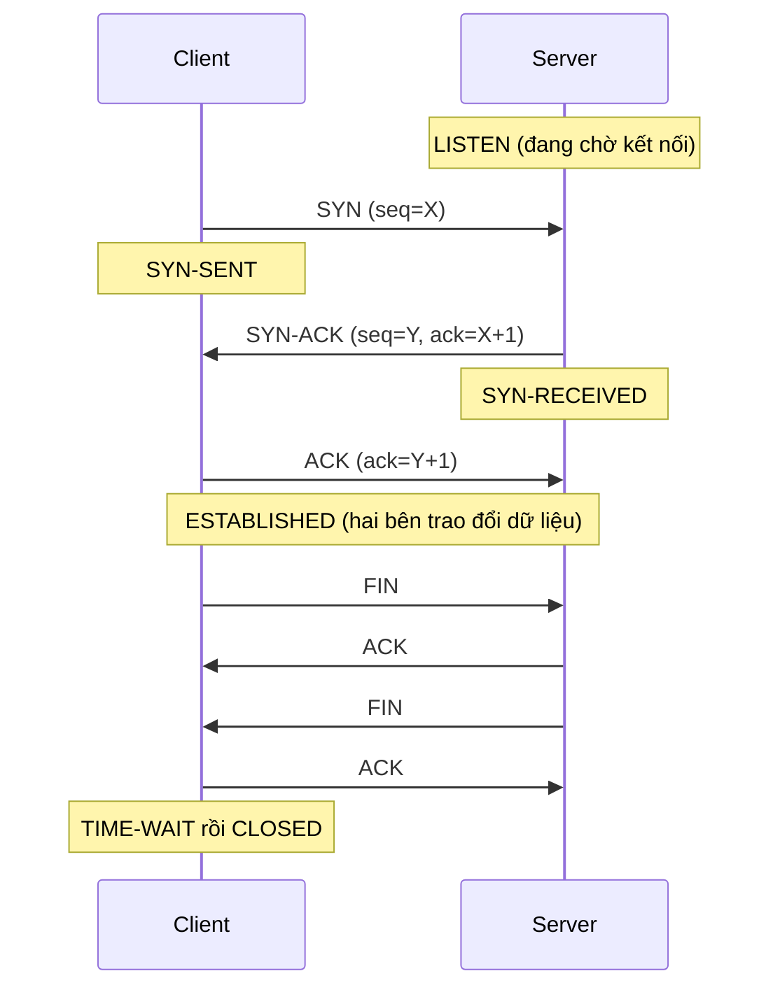

---
tags:
  - Must
  - TCP
  - Concept
  - Troubleshooting
---

# Một kết nối TCP bắt đầu, sống và kết thúc ra sao, và mỗi trạng thái cho biết điều gì khi gặp lỗi? (TCP handshake và trạng thái)

## Metadata

```yaml
Chapter: tcp-handshake-states
Phase: 04 — transport-app
Importance: Must
Status: draft
Prerequisites:
  - Phase 00 / 03-packet-capture
  - Phase 01 / 02-osi-vs-tcpip
Used Later:
  - Phase 04 / 02-tcp-timeouts-retransmission-keepalive
  - Phase 04 / 04-ports-sockets
  - Phase 04 / 05-http
  - Phase 05 / 01-firewall-stateful-vs-stateless
  - Phase 08 / 01-troubleshooting-methodology-layered
Estimated Reading: 35 phút
Estimated Practice: 50 phút
```

## 1. Story

<!-- Mức bắt buộc (Must): Đủ -->
<!-- DRAFT: người học cần viết lại bằng lời mình -->

Dịch vụ ứng dụng của `shopnet` báo "connection timed out" khi kết nối tới database. Đội database khẳng định: "Database đang chạy bình thường." Trên máy ứng dụng, kỹ sư chạy một lệnh liệt kê kết nối và thấy hàng trăm kết nối ở trạng thái `SYN-SENT`. Trên máy database thì không thấy kết nối nào đang chờ.

Hai dữ kiện này đủ để khoanh vùng: máy ứng dụng đã gửi yêu cầu bắt đầu kết nối (SYN) nhưng **không bao giờ nhận được trả lời**, và máy database không hề thấy yêu cầu đó. Có thứ gì ở giữa đang chặn hoặc làm rơi gói. Không cần đoán, chỉ cần biết ý nghĩa của từng **trạng thái TCP**. Chapter này dạy điều đó.

## 2. Objectives

<!-- Mức bắt buộc (Must): Đủ -->
<!-- DRAFT: người học cần viết lại bằng lời mình -->

Sau chapter này bạn có thể:

- Mô tả bắt tay ba bước (three-way handshake) và vì sao cần ba bước.
- Mô tả cách một kết nối TCP kết thúc (FIN, ACK) và vai trò của `TIME_WAIT` và `CLOSE_WAIT`.
- Đọc trạng thái kết nối bằng `ss`/`netstat`/`Get-NetTCPConnection` và nói mỗi trạng thái nghĩa là gì khi chúng dồn lại hàng loạt.
- Phân biệt "connection refused" (nhận RST) với "timeout" (không có trả lời) bằng cách nhìn gói SYN.
- Dùng `tcpdump` để quan sát handshake và dự đoán cờ ở từng gói.

## 3. Prerequisites

<!-- Mức bắt buộc (Must): Đủ -->
<!-- DRAFT: người học cần viết lại bằng lời mình -->

> Xem lại: [packet-capture](../phase-00-lab-toolkit/03-packet-capture.md)
> Xem lại: [osi-vs-tcpip](../phase-01-foundation/02-osi-vs-tcpip.md)

Bạn cần nhớ cách đọc cờ `tcpdump` (`S`, `S.`, `.`, `F`, `R`), ý nghĩa "refused" khác "timeout" ở `00/02`, và tầng vận chuyển ở `01/02`.

## 4. Why it exists

<!-- Mức bắt buộc (Must): Đủ -->
<!-- DRAFT: người học cần viết lại bằng lời mình -->

IP chỉ gửi gói theo kiểu cố gắng hết sức: gói có thể mất, đến lộn xộn hoặc bị lặp. Nhưng ứng dụng (web, database, SSH) cần một **luồng dữ liệu tin cậy và đúng thứ tự**. **TCP (Transmission Control Protocol)** xây dựng luồng đó trên nền IP bằng cách: thiết lập kết nối trước, đánh số dữ liệu (sequence number), yêu cầu xác nhận (ACK) và gửi lại phần bị mất.

**Bắt tay ba bước** là phần thiết lập: hai bên thống nhất số thứ tự bắt đầu và xác nhận rằng cả hai đều gửi và nhận được. Kết thúc kết nối cũng có thủ tục riêng để không cắt ngang dữ liệu còn đang bay.

Nếu hiểu sai TCP, bạn sẽ:

- Không phân biệt được "dịch vụ không chạy" (bị từ chối ngay) với "đường bị chặn" (im lặng, hết thời gian).
- Hoảng khi thấy nhiều `TIME_WAIT` (bình thường) và bỏ qua nhiều `CLOSE_WAIT` (thường là lỗi ứng dụng).
- Không đọc được `ss`/`netstat` khi chẩn đoán sự cố kết nối.

## 5. Mental model

<!-- Mức bắt buộc (Must): Đủ -->
<!-- DRAFT: người học cần viết lại bằng lời mình -->

Hình dung một **cuộc gọi điện thoại**. Bạn gọi và nói "alô, có nghe không?" (SYN). Bên kia đáp "nghe rõ, bạn nghe tôi không?" (SYN-ACK). Bạn nói "nghe rõ" (ACK) và hai bên bắt đầu nói chuyện. Cúp máy lịch sự cần **cả hai** nói lời tạm biệt (hai FIN, mỗi bên một lần). Nếu số bên kia không có ai nhấc máy, bạn nghe tiếng "máy bận" ngay (RST, "refused"); nếu đường dây đứt, chuông reo mãi không ai trả lời (timeout).

**Tóm tắt một câu:** TCP mở kết nối bằng SYN → SYN-ACK → ACK, đóng bằng FIN từ mỗi phía, và mỗi giai đoạn tương ứng một trạng thái mà bạn đọc được để biết kết nối đang kẹt ở đâu.

## 6. How it works

<!-- Mức bắt buộc (Must): Đủ -->
<!-- DRAFT: người học cần viết lại bằng lời mình -->

Các từ cần biết:

- **TCP (giao thức điều khiển truyền tải — giao thức tầng vận chuyển cung cấp luồng dữ liệu tin cậy, đúng thứ tự giữa hai máy).**
- **Three-way handshake (bắt tay ba bước — ba gói SYN, SYN-ACK, ACK để mở một kết nối TCP).**
- **SYN (cờ "đồng bộ" — gói mở đầu, đề nghị bắt đầu kết nối và nêu số thứ tự khởi đầu của mình).**
- **FIN (cờ "kết thúc" — thông báo bên gửi không còn dữ liệu để gửi nữa).**
- **RST (cờ "đặt lại" — ngắt kết nối ngay lập tức, thường vì lỗi hoặc vì không có dịch vụ ở cổng đó).**
- **Sequence number (số thứ tự — số đánh dấu từng byte dữ liệu để bên nhận sắp xếp và xác nhận).**
- **Connection state (trạng thái kết nối — giai đoạn hiện tại của một kết nối TCP, ví dụ ESTABLISHED).**

**Bắt tay ba bước** (theo RFC 9293): bên khởi tạo gửi SYN kèm số thứ tự X; bên nhận trả SYN-ACK xác nhận X+1 và nêu số thứ tự Y của mình; bên khởi tạo gửi ACK xác nhận Y+1.



**Đọc sơ đồ:** ba gói đầu là bắt tay: sau đó cả hai bên đều biết bên kia nghe được và nói được, và đã thống nhất số thứ tự bắt đầu. Dữ liệu chỉ truyền sau khi đạt `ESTABLISHED`. Khi kết thúc, **mỗi chiều đóng riêng**: bên chủ động đóng gửi FIN, bên kia ACK; sau đó bên kia gửi FIN của mình. Bên chủ động đóng (ở sơ đồ là Client) phải **chờ ở `TIME-WAIT`** trước khi giải phóng hoàn toàn.

**Vì sao ba bước chứ không phải hai?** Hai bên đều cần *đề xuất* số thứ tự của mình và *được xác nhận*. SYN của client được SYN-ACK xác nhận; SYN của server (nằm trong SYN-ACK) cần thêm một ACK để được xác nhận. Ba gói là số tối thiểu để cả hai chiều đều được đồng bộ.

**Các trạng thái chính** (theo RFC 9293, có 11 trạng thái) và ý nghĩa khi chúng dồn lại hàng loạt:

| Trạng thái | Ý nghĩa | Nếu thấy rất nhiều |
|---|---|---|
| `LISTEN` | Server đang chờ kết nối | Bình thường |
| `SYN-SENT` | Client đã gửi SYN, **chưa có SYN-ACK** | Gói SYN bị chặn/rơi, server không chạy, route hỏng (Story) |
| `SYN-RECEIVED` | Server đã nhận SYN, đã gửi SYN-ACK, chờ ACK | Client không ACK được (đường về hỏng) hoặc có người gửi SYN hàng loạt |
| `ESTABLISHED` | Kết nối đang hoạt động | Bình thường khi đang phục vụ |
| `FIN-WAIT-1`, `FIN-WAIT-2` | Mình đã gửi FIN, đang chờ phía kia | Phía kia chậm đóng |
| `CLOSE-WAIT` | **Phía kia** đã đóng, nhưng **ứng dụng của mình chưa đóng** | **Thường là lỗi ứng dụng** quên đóng kết nối (không phải lỗi mạng) |
| `LAST-ACK` | Mình đã gửi FIN cuối, chờ ACK cuối | Hiếm khi dồn |
| `TIME-WAIT` | Mình là bên chủ động đóng, đang "chờ cho sạch" | **Bình thường** nếu có nhiều kết nối ngắn; không phải rò rỉ |

**Vì sao có `TIME-WAIT`?** Theo RFC 9293, bên chủ động đóng phải chờ **2 × MSL** để các gói cũ còn lạc trên mạng tan hết, tránh nhầm với một kết nối mới dùng lại cùng địa chỉ và cổng.

**`RST` và "refused".** Gói SYN gửi tới một **cổng không có dịch vụ lắng nghe** được máy đích trả lời ngay bằng RST: ứng dụng báo "Connection refused" tức thì. Nếu **không có gì trả lời** (gói bị chặn hoặc rơi), client chờ rồi gửi lại SYN và cuối cùng báo timeout. Đây là cách phân biệt hai kiểu lỗi ở `00/02`: RST (có người từ chối) khác im lặng (không ai trả lời).

> Thời gian chờ, gửi lại và keepalive ở `04/02`; cổng và socket ở `04/04`; tường lửa theo trạng thái ở `05/01`.

<!-- verified: 2026-10-02 https://www.rfc-editor.org/rfc/rfc9293 -->

## 7. Key settings

<!-- Mức bắt buộc (Must): Đủ -->
<!-- DRAFT: người học cần viết lại bằng lời mình -->

Chapter này chủ yếu là **đọc trạng thái**, không phải chỉnh tham số:

| Việc | Linux / WSL2 | Windows PowerShell / cmd |
|---|---|---|
| Liệt kê kết nối TCP và trạng thái | `ss -tan` | `Get-NetTCPConnection`, `netstat -ano` |
| Chỉ kết nối ở một trạng thái | `ss -tan state established` | `Get-NetTCPConnection -State Established` |
| Đếm theo trạng thái | `ss -s` | `Get-NetTCPConnection` rồi nhóm theo cột `State` (`Group-Object`) |
| Quan sát handshake | `tcpdump -nn -i any 'tcp port <cổng>'` | (bắt trong WSL2/container, xem `00/03`) |

Thời gian chờ ở từng trạng thái và các tham số hệ điều hành (số lần gửi lại SYN, v.v.) thuộc `04/02`.

## 8. AWS mapping

<!-- Mức bắt buộc (Must): Đủ nếu có liên quan AWS -->
<!-- DRAFT: người học cần viết lại bằng lời mình -->

<!-- verified: 2026-10-02 https://docs.aws.amazon.com/vpc/latest/userguide/vpc-security-groups.html -->
<!-- verified: 2026-10-02 https://docs.aws.amazon.com/vpc/latest/userguide/vpc-network-acls.html -->

Cách security group và network ACL xử lý một kết nối TCP liên quan trực tiếp tới handshake:

| Thành phần | Hành vi theo tài liệu AWS | Hệ quả với TCP |
|---|---|---|
| Security group | **Stateful**: gói trả lời của một kết nối được cho phép tự động, bất kể quy tắc chiều ngược lại | Chỉ cần mở chiều **khởi tạo** (ví dụ inbound tới cổng dịch vụ) |
| Network ACL | **Stateless**: không nhớ trạng thái; mỗi chiều cần có quy tắc riêng, quy tắc đánh số và duyệt từ số nhỏ đến lớn | Phải cho phép cả chiều đi lẫn chiều **trả lời** |

Hai hệ quả khi chẩn đoán trên AWS:

- Nếu một SYN bị security group hoặc network ACL **loại bỏ im lặng**, client sẽ thấy `SYN-SENT` kéo dài rồi timeout, không phải "refused" (đúng với Story).
- Network ACL stateless dễ gây lỗi khi thiếu quy tắc cho chiều trả lời: SYN đến được nhưng SYN-ACK bị chặn nên kết nối không bao giờ `ESTABLISHED`.

Chi tiết cách phân biệt ở `05/03` và `06/03`. Tài liệu AWS có thể thay đổi; kiểm tra lại trước khi dựa vào chi tiết.

## 9. Hands-on lab

<!-- Mức bắt buộc (Must): Đủ + expected-output.txt -->
<!-- DRAFT: người học cần viết lại bằng lời mình -->

Chi tiết ở `labs/phase-04-transport-app/chapter-01-tcp-handshake-states/README.md`.

**1. Predict:** khi client kết nối tới server thử ở cổng 8080 rồi gửi một dòng chữ rồi đóng, bạn sẽ thấy các cờ nào theo thứ tự nào (từ `[S]` đến `[F.]`)? Và sau khi đóng, trạng thái nào còn lại?

**2. Run** (trong container):

```powershell
docker run --rm -it alpine sh
```

```sh
apk add --no-cache tcpdump
(nc -l -p 8080 >/dev/null &)
(tcpdump -nn -i lo -c 12 'tcp port 8080' &)
sleep 1
echo hi | nc -w 2 127.0.0.1 8080
sleep 2
netstat -tan | grep 8080
```

**3. Verify:** nhận ra `[S]`, `[S.]`, `[.]`, gói dữ liệu (`[P.]`), và các gói `[F.]`; dòng `netstat` có `TIME_WAIT` hoặc trạng thái kết thúc nào không? Output thật: `[CHƯA CHẠY]`.

## 10. Break it

<!-- Mức bắt buộc (Must): Đủ (≥ 1 Break it) -->
<!-- DRAFT: người học cần viết lại bằng lời mình -->

**Gây hai kiểu lỗi và so sánh:** từ chối ngay (RST) và im lặng (SYN bị loại bỏ). Trong container (cần `--cap-add NET_ADMIN` cho phần iptables):

```powershell
docker run --rm -it --cap-add NET_ADMIN alpine sh
```

```sh
apk add --no-cache tcpdump iptables
(tcpdump -nn -i lo -c 10 'tcp port 9' &)
sleep 1
nc -w 2 127.0.0.1 9; echo "mã thoát (cổng đóng): $?"
sleep 1
(nc -l -p 8080 >/dev/null &)
iptables -A INPUT -p tcp --dport 8080 -j DROP
(tcpdump -nn -i lo -c 6 'tcp port 8080' &)
sleep 1
nc -w 3 127.0.0.1 8080; echo "mã thoát (SYN bị loại bỏ): $?"
sleep 2
```

**Dự đoán:**

- **Cổng 9 (không có dịch vụ):** gói `[S]` được trả lời ngay bằng gói `[R.]` (RST); `nc` kết thúc nhanh với lỗi "refused".
- **Cổng 8080 sau khi thêm quy tắc DROP:** chỉ thấy gói `[S]` lặp lại nhiều lần (gửi lại) và **không có** `[S.]`; `nc` chờ đến hết 3 giây rồi thoát với lỗi hết thời gian.

**Ý nghĩa:** hai lỗi trông giống ("không kết nối được") nhưng gói tin khác hẳn: RST nghĩa là có người từ chối; chỉ có SYN lặp mà không có trả lời nghĩa là có thứ gì đó làm rơi gói. Chính là chẩn đoán trong Story.

Nếu `apk add`/`iptables` không chạy được trong môi trường của bạn, chạy riêng phần "cổng 9" (không cần iptables).

**Khôi phục:** `exit`; container `--rm` tự xóa.

Kết quả thật: `[CHƯA CHẠY]`.

## 11. Troubleshooting

<!-- Mức bắt buộc (Must): Đủ -->
<!-- DRAFT: người học cần viết lại bằng lời mình -->

Triệu chứng chính: **không kết nối được tới một dịch vụ TCP.** Bắt đầu bằng cách xem **trạng thái** và **gói SYN**.

| Bước | Kiểm tra | Công cụ | Kết luận |
|---|---|---|---|
| 1 | Báo ngay "refused" hay chờ rồi timeout? | Thông báo lỗi của ứng dụng | Refused → có RST, dịch vụ không lắng nghe; Timeout → im lặng |
| 2 | Phía client có nhiều `SYN-SENT` không | `ss -tan`, `Get-NetTCPConnection` | SYN không được trả lời |
| 3 | Gói SYN có tới phía server không | `tcpdump` ở **cả hai đầu** | Tới nhưng không trả lời → server/firewall cục bộ; không tới → mạng ở giữa |
| 4 | Server có `LISTEN` ở đúng cổng và địa chỉ không | `ss -ltn` trên server | Không → dịch vụ chưa chạy hoặc nghe sai địa chỉ |
| 5 | Có `SYN-RECEIVED` kéo dài không | `ss -tan` trên server | SYN-ACK không được ACK lại: đường về/NACL stateless (xem mục 8) |

| Triệu chứng khác | Giả thuyết đầu tiên |
|---|---|
| Nhiều `CLOSE-WAIT` trên server | Ứng dụng không đóng kết nối (lỗi code/connection leak), không phải lỗi mạng |
| Nhiều `TIME-WAIT` | Bình thường nếu có nhiều kết nối ngắn; chỉ đáng lo khi gặp cạn cổng (xem `04/02`, `04/04`) |
| Kết nối tới `ESTABLISHED` rồi treo khi gửi dữ liệu lớn | Path MTU (ICMP bị chặn, xem `03/04`) hoặc ứng dụng chậm |
| Thấy `RST` giữa chừng | Một bên ngắt đột ngột (ứng dụng sập, firewall dọn kết nối) |

Ghi kết quả thật của mục 10: `[CHƯA CHẠY]`.

## 12. Security & cost

<!-- Mức bắt buộc (Must): Đủ -->
<!-- DRAFT: người học cần viết lại bằng lời mình -->

- **SYN flood:** kẻ tấn công gửi hàng loạt SYN không hoàn tất handshake, làm đầy hàng đợi `SYN-RECEIVED` của server. Máy chủ và thiết bị phòng thủ có cơ chế giảm thiểu; ở mức khái niệm bạn cần biết rủi ro tồn tại.
- **Quét cổng** dựa vào chính các phản hồi này (RST = cổng đóng, SYN-ACK = cổng mở, im lặng = bị lọc). Chỉ quét hệ thống của bạn hoặc được phép.
- **RST giả:** gói RST giả mạo có thể ngắt kết nối; mã hóa và xác thực ở tầng cao hơn (TLS, `04/06`) giúp phát hiện.
- Firewall theo trạng thái theo dõi các trạng thái này để quyết định cho phép gói trả lời (`05/01`).
- Không dán output `ss`/`tcpdump` thật (địa chỉ, tên tiến trình) vào tài liệu công khai.
- Chi phí: local nên không phát sinh; trên đám mây, các kết nối ngắn liên tục có thể làm tăng lưu lượng và tải thiết bị trung gian (NAT, load balancer); kiểm tra trang giá chính thức.

## 13. Misconceptions

<!-- Mức bắt buộc (Must): Đủ -->
<!-- DRAFT: người học cần viết lại bằng lời mình -->

| Hiểu nhầm | Sự thật |
|---|---|
| "Bắt tay xong nghĩa là dữ liệu đã đến nơi" | Bắt tay chỉ thiết lập kết nối; dữ liệu truyền sau và vẫn có thể mất/gửi lại |
| "Nhiều `TIME-WAIT` là rò rỉ kết nối" | Là trạng thái bình thường của bên chủ động đóng, tồn tại khoảng 2×MSL |
| "`CLOSE-WAIT` là lỗi mạng" | Phía kia đã đóng nhưng ứng dụng của mình chưa đóng; thường là lỗi ứng dụng |
| "Refused nghĩa là firewall chặn" | Refused là nhận được RST (có thiết bị trả lời); firewall chặn kiểu loại bỏ thường gây timeout |
| "TCP đảm bảo dữ liệu luôn tới" | Đảm bảo giao đúng thứ tự hoặc báo lỗi; mạng đứt vẫn làm kết nối thất bại |
| "Hai bước là đủ để bắt tay" | Cần ba gói để cả hai chiều được đồng bộ và xác nhận |

## 14. Interview questions

<!-- Mức bắt buộc (Must): Đủ -->
<!-- DRAFT: người học cần viết lại bằng lời mình -->

### Q1 (Junior) — Mô tả bắt tay ba bước của TCP.

**Gợi ý ý chính:**
- Ba gói là gì và ai gửi?
- Mỗi gói xác nhận điều gì?

??? success "Đáp án mẫu (tự trả lời trước khi mở)"
    Client gửi SYN kèm số thứ tự khởi đầu; server trả SYN-ACK (xác nhận số của client và nêu số của mình); client gửi ACK xác nhận số của server. Sau đó kết nối ở trạng thái ESTABLISHED.

### Q2 (Junior) — `Connection refused` khác `Connection timed out` thế nào ở mức gói tin?

**Gợi ý ý chính:**
- Máy đích trả lời gì với SYN trong mỗi trường hợp?
- Client làm gì khi không nhận được trả lời?

??? success "Đáp án mẫu (tự trả lời trước khi mở)"
    Refused: SYN đến cổng không có dịch vụ nên máy đích trả RST ngay. Timeout: không có trả lời nào (gói bị chặn hoặc rơi), client gửi lại SYN nhiều lần rồi từ bỏ.

### Q3 (Middle) — Server có rất nhiều kết nối `CLOSE-WAIT`. Nguyên nhân thường gặp?

**Gợi ý ý chính:**
- Ai đã gửi FIN trước?
- Ai chịu trách nhiệm đóng socket ở máy này?

??? success "Đáp án mẫu (tự trả lời trước khi mở)"
    Phía kia đã đóng (gửi FIN) nhưng ứng dụng trên server chưa gọi đóng kết nối. Thường là lỗi ứng dụng (quên đóng, rò rỉ kết nối), nên cần sửa code chứ không phải sửa mạng.

### Q4 (Middle) — Vì sao có trạng thái `TIME_WAIT`?

**Gợi ý ý chính:**
- Gói cũ còn lạc trên mạng gây vấn đề gì với kết nối mới?
- Chờ bao lâu theo đặc tả?

??? success "Đáp án mẫu (tự trả lời trước khi mở)"
    Để các gói cũ của kết nối vừa đóng tan hết, tránh bị nhầm với một kết nối mới dùng lại cùng địa chỉ và cổng; bên chủ động đóng chờ 2×MSL.

## 15. Exercises

<!-- Mức bắt buộc (Must): Đủ -->
<!-- DRAFT: người học cần viết lại bằng lời mình -->

1. **Vẽ lại handshake.** *Deliverable:* sơ đồ Mermaid (tự vẽ lại bằng lời bạn) cho bắt tay và đóng kết nối, ghi trạng thái của cả hai phía ở từng bước.
2. **Bảng chẩn đoán trạng thái.** *Deliverable:* bảng 6 dòng: trạng thái dồn lại → nghi ngờ gì → lệnh kiểm tra tiếp theo (bằng lời bạn, có ví dụ).
3. **Phân tích Story.** *Deliverable:* kế hoạch 5 bước để chứng minh gói SYN bị rơi ở giữa (lệnh trên hai đầu, kết quả mong đợi từng bước) và đoạn 3–5 câu giải thích với đội database.
4. **Hai kiểu lỗi.** *Deliverable:* kết quả `tcpdump` của lỗi "cổng đóng" và lỗi "SYN bị loại bỏ" (đã thay IP/cổng thật bằng giả), kèm 3–5 câu so sánh.

## 16. Cheat sheet

<!-- Mức bắt buộc (Must): Đủ -->
<!-- DRAFT: người học cần viết lại bằng lời mình -->

| Mục | Nội dung |
|---|---|
| Mở kết nối | SYN → SYN-ACK → ACK |
| Đóng kết nối | FIN/ACK mỗi chiều; bên chủ động đóng vào `TIME-WAIT` (2×MSL) |
| Cờ `tcpdump` | `S` SYN, `S.` SYN-ACK, `.` ACK, `P` PUSH, `F` FIN, `R` RST |
| Refused | SYN → RST ngay (cổng không có dịch vụ) |
| Timeout | SYN lặp lại, không có trả lời (bị chặn/rơi) |
| Nhiều `SYN-SENT` | Không có SYN-ACK: chặn, server không chạy, route hỏng |
| Nhiều `CLOSE-WAIT` | Ứng dụng chưa đóng socket |
| Nhiều `TIME-WAIT` | Thường bình thường |
| Lệnh | `ss -tan`, `Get-NetTCPConnection`, `tcpdump -nn 'tcp port N'` |

**Debug:** refused hay timeout → trạng thái phía client → SYN có tới server không → server có LISTEN không.

## 17. Glossary terms

<!-- Mức bắt buộc (Must): Đủ -->
<!-- DRAFT: người học cần viết lại bằng lời mình -->

- TCP / giao thức điều khiển truyền tải / TCP
- Three-way handshake / bắt tay ba bước / 3ウェイハンドシェイク
- SYN / cờ đồng bộ / SYN
- FIN / cờ kết thúc / FIN
- RST / cờ đặt lại / RST
- Sequence number / số thứ tự / シーケンス番号
- Connection state / trạng thái kết nối / コネクション状態

## 18. Further reading

<!-- Mức bắt buộc (Must): Đủ -->
<!-- DRAFT: người học cần viết lại bằng lời mình -->

Kiểm tra ngày 2026-10-02:

- RFC 9293 — Transmission Control Protocol (TCP): https://www.rfc-editor.org/rfc/rfc9293
- Amazon VPC — Security groups: https://docs.aws.amazon.com/vpc/latest/userguide/vpc-security-groups.html
- Amazon VPC — Network ACLs: https://docs.aws.amazon.com/vpc/latest/userguide/vpc-network-acls.html
