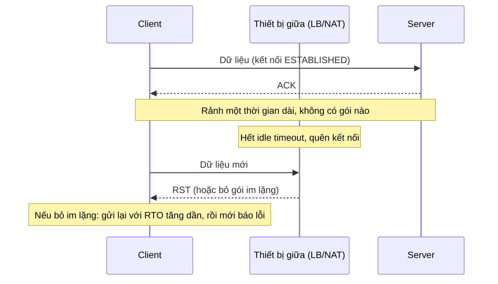

---
tags:
  - Must
  - TCP
  - Timeout
  - Troubleshooting
---

# Vì sao kết nối TCP "đứt im lặng" sau một thời gian rảnh, và timeout nào quyết định điều đó?

## Metadata

```yaml
Chapter: tcp-timeouts-retransmission-keepalive
Phase: 04 — transport-app
Importance: Must
Status: draft
Prerequisites:
  - Phase 04 / 01-tcp-handshake-states
Used Later: []
Estimated Reading: 35 phút
Estimated Practice: 40 phút
```

## 1. Story

<!-- Mức bắt buộc (Must): Đủ -->
<!-- DRAFT: người học cần viết lại bằng lời mình -->

Dịch vụ `shopnet-batch` mở một kết nối tới database, chạy xong, rồi để kết nối nằm chờ trong connection pool. Sáng hôm sau job đầu tiên chạy và báo lỗi "connection reset" hoặc treo hàng chục phút rồi mới báo "timed out". Mạng không đổi, database không khởi động lại. Chỉ có điều kết nối đã **nằm rảnh** quá lâu.

Một thiết bị ở giữa (load balancer, NAT, firewall) có bộ nhớ trạng thái: nó chỉ nhớ một kết nối trong một thời hạn **rảnh (idle timeout)**. Hết thời hạn, nó quên. Hai đầu kết nối không hề biết, vẫn tin kết nối còn sống. Lần gửi dữ liệu kế tiếp bị trả RST hoặc bị bỏ lặng lẽ, và máy gửi phải gửi lại nhiều lần trước khi bỏ cuộc. Chapter này giải thích ba nhóm timer: **gửi lại (retransmission)**, **giữ sống (keepalive)** và **idle timeout của thiết bị trung gian**, và cách chúng phối hợp.

## 2. Objectives

<!-- Mức bắt buộc (Must): Đủ -->
<!-- DRAFT: người học cần viết lại bằng lời mình -->

Sau chapter này bạn có thể:

- Giải thích TCP phát hiện mất gói và gửi lại thế nào, và vì sao chờ mãi mới báo lỗi.
- Phân biệt ba loại timeout: kết nối mới (SYN), dữ liệu không được xác nhận, và rảnh.
- Giải thích keepalive làm gì và vì sao mặc định Linux quá thưa để cứu kết nối qua LB/NAT.
- Chọn chu kỳ keepalive nhỏ hơn idle timeout của thiết bị trung gian.
- Chẩn đoán triệu chứng "kết nối chết sau khi rảnh" với các bước kiểm tra cụ thể.

## 3. Prerequisites

<!-- Mức bắt buộc (Must): Đủ -->
<!-- DRAFT: người học cần viết lại bằng lời mình -->

> Xem lại: [tcp-handshake-states](01-tcp-handshake-states.md)

Cần nhớ: bắt tay ba bước, các trạng thái `ESTABLISHED`, `FIN_WAIT`, `TIME_WAIT`, cờ `RST` (`04/01`).

## 4. Why it exists

<!-- Mức bắt buộc (Must): Đủ -->
<!-- DRAFT: người học cần viết lại bằng lời mình -->

TCP hứa giao dữ liệu đủ và đúng thứ tự trên một mạng không đáng tin. Để giữ lời hứa, mỗi đoạn dữ liệu gửi đi phải được **xác nhận (ACK)**; không thấy ACK thì **gửi lại**. Vì phải phân biệt "mạng chậm tạm thời" với "đối phương đã chết", TCP dùng các bộ đếm giờ: chờ đủ lâu để không bỏ cuộc vội, nhưng không chờ vô hạn.

TCP không tự gửi gói nào khi **hai bên không có dữ liệu** để gửi. Nên nếu thiết bị ở giữa quên kết nối, hoặc đầu bên kia biến mất (máy sập, rút dây), bên còn lại **không thể biết** cho tới khi nó gửi dữ liệu. Keepalive sinh ra để chủ động kiểm tra điều đó.

Nếu hiểu sai: kết nối nằm rảnh chết bất ngờ (Story); ứng dụng treo hàng chục phút thay vì thất bại nhanh; failover chậm vì chờ timeout mặc định; đặt timeout ứng dụng ngắn hơn timeout tầng dưới gây lỗi khó hiểu.

## 5. Mental model

<!-- Mức bắt buộc (Must): Đủ -->
<!-- DRAFT: người học cần viết lại bằng lời mình -->

Hình dung **gọi điện thoại** với một người im lặng. Bạn nói "alo?" (gửi dữ liệu), không ai đáp. Bạn nói lại sau 1 giây, rồi 2, rồi 4... (gửi lại với thời gian chờ tăng dần). Sau nhiều lần mới kết luận "đường dây hỏng". Còn nếu cả hai im lặng suốt buổi, không ai biết đường dây còn sống không; **keepalive** là lúc bạn nói "còn đó không?" định kỳ. Và tổng đài (load balancer) có quy định: im lặng quá lâu thì cắt máy mà không báo ai.

**Tóm tắt một câu:** TCP gửi lại khi không có ACK (chờ lâu dần rồi bỏ cuộc), keepalive kiểm tra kết nối rảnh, và thiết bị trung gian quên kết nối rảnh theo idle timeout riêng của chúng.

## 6. How it works

<!-- Mức bắt buộc (Must): Đủ -->
<!-- DRAFT: người học cần viết lại bằng lời mình -->

Các từ cần biết:

- **ACK (xác nhận — gói báo "đã nhận đến byte số N").**
- **Retransmission (gửi lại — gửi lần nữa đoạn dữ liệu chưa được xác nhận).**
- **RTO (Retransmission Timeout — thời gian chờ ACK trước khi gửi lại; tăng gấp đôi sau mỗi lần thất bại, gọi là exponential backoff).**
- **Keepalive (giữ sống — gói thăm dò gửi định kỳ trên kết nối rảnh để kiểm tra đối phương còn đó).**
- **Idle timeout (hết thời hạn rảnh — thời gian tối đa một thiết bị nhớ kết nối khi không có dữ liệu đi qua).**
- **Exponential backoff (lùi theo cấp số nhân — mỗi lần thử lại chờ gấp đôi lần trước).**

**Ba loại timeout cần phân biệt:**

| Loại | Khi nào xảy ra | Mặc định Linux (kiểm tra bản của bạn) |
|---|---|---|
| **Kết nối mới (SYN)** | Gửi SYN mà không có SYN-ACK | `tcp_syn_retries = 6`, tương ứng khoảng 67 giây |
| **Dữ liệu không được xác nhận** | Đang có kết nối, gửi dữ liệu mà không có ACK | `tcp_retries2 = 15`, tương ứng khoảng 924 giây (ít nhất, khoảng 15 phút) |
| **Rảnh (keepalive)** | Không có dữ liệu, keepalive bật | `tcp_keepalive_time = 2 giờ`, `intvl = 75 giây`, `probes = 9` |

Hai điểm quan trọng: (1) mặc định của hệ điều hành **rất dài**: một kết nối tới máy đã chết có thể treo hơn 15 phút trước khi báo lỗi nếu ứng dụng không tự đặt timeout; (2) keepalive mặc định chỉ bắt đầu thăm dò sau **2 giờ**, lâu hơn hẳn idle timeout của hầu hết thiết bị trung gian (vài phút).



**Đọc sơ đồ:** hai đầu không hề biết thiết bị giữa đã quên kết nối. Khi client gửi dữ liệu mới, thiết bị giữa hoặc trả RST ngay (client lập tức biết) hoặc bỏ gói lặng lẽ (client chỉ thấy không có ACK và gửi lại nhiều lần rồi mới thất bại). Cách phòng tránh là **keepalive ngắn hơn idle timeout**, để luôn có gói đi qua và thiết bị giữa nhớ kết nối.

**Cách TCP gửi lại.** Khi không có ACK trong RTO, TCP gửi lại; mỗi lần thất bại RTO tăng gấp đôi (1 giây, 2, 4, 8...). Tổng thời gian này chính là con số "SYN 67 giây" hay "dữ liệu ~15 phút" ở bảng. Ngoài ra TCP có **gửi lại nhanh (fast retransmit)** khi thấy nhiều ACK trùng lặp báo mất một đoạn, không cần chờ hết RTO `[CHƯA KIỂM CHỨNG]` chi tiết ngưỡng.

**Keepalive hoạt động ra sao.** Khi bật cho một socket, sau `tcp_keepalive_time` rảnh hệ điều hành gửi một gói thăm dò; nếu không có đáp, gửi lại mỗi `tcp_keepalive_intvl`, sau `tcp_keepalive_probes` lần thất bại thì coi kết nối chết. Keepalive **mặc định tắt** ở mức socket; ứng dụng (hoặc thư viện) phải bật bằng tùy chọn socket. Tổng thời gian phát hiện: `time + intvl × probes` (với mặc định khoảng 2 giờ + 11 phút).

**Keepalive làm hai việc khác nhau:** (a) **phát hiện đầu bên kia chết**, và (b) **giữ kết nối sống qua thiết bị trung gian** (gói đi qua làm đặt lại bộ đếm rảnh). Nếu chỉ muốn (b), chu kỳ phải nhỏ hơn idle timeout của thiết bị giữa.

**Idle timeout trên AWS (NLB).** Theo tài liệu AWS: NLB theo dõi trạng thái kết nối TCP; nếu không có dữ liệu qua lại lâu hơn idle timeout thì không theo dõi nữa, và khi một bên gửi dữ liệu sau đó, client nhận **RST**. Mặc định cho TCP là **350 giây**, có thể đổi trong khoảng 60–6000 giây; keepalive từ client hoặc target khởi động lại bộ đếm. Với listener TLS là 350 giây và không đổi được. Với UDP là 120 giây, không đổi được (`04/03`).

<!-- verified: 2026-10-05 https://docs.aws.amazon.com/elasticloadbalancing/latest/network/network-load-balancers.html -->
<!-- verified: 2026-10-05 https://www.kernel.org/doc/html/latest/networking/ip-sysctl.html -->

> Trạng thái kết nối ở firewall/NAT: `05/01`; cổng và socket: `04/04`; load balancer: `04/07`.

## 7. Key settings

<!-- Mức bắt buộc (Must): Đủ -->
<!-- DRAFT: người học cần viết lại bằng lời mình -->

| Thông số | Ý nghĩa | Nếu sai |
|---|---|---|
| `tcp_keepalive_time` | Rảnh bao lâu thì bắt đầu thăm dò | Mặc định 2 giờ: quá thưa để cứu kết nối qua LB/NAT |
| `tcp_keepalive_intvl` / `tcp_keepalive_probes` | Khoảng cách và số lần thăm dò | Quyết định thời gian phát hiện chết |
| `tcp_syn_retries` | Số lần thử SYN | Cao → nối tới máy chết treo lâu |
| `tcp_retries2` | Số lần gửi lại dữ liệu | Cao → treo ~15 phút trước khi báo lỗi |
| Timeout kết nối/đọc của ứng dụng | Ứng dụng tự bỏ cuộc sau bao lâu | Không đặt → phụ thuộc mặc định hệ điều hành |
| Idle timeout của LB/NAT/firewall | Thiết bị giữa nhớ kết nối bao lâu | Ngắn hơn keepalive/idle của ứng dụng → kết nối chết im lặng |
| Kiểm tra tình trạng kết nối của pool | Test kết nối trước khi dùng, hoặc đóng sớm | Dùng kết nối đã chết (Story) |

**Quy tắc thiết kế:** *keepalive của ứng dụng < idle timeout nhỏ nhất trên đường đi*, và thời gian nhàn rỗi tối đa của connection pool cũng nhỏ hơn idle timeout đó.

**Xem giá trị trên máy (Linux/WSL):**

```bash
sysctl net.ipv4.tcp_keepalive_time net.ipv4.tcp_keepalive_intvl net.ipv4.tcp_keepalive_probes
sysctl net.ipv4.tcp_syn_retries net.ipv4.tcp_retries2
```

**Xem timer của kết nối đang chạy:** `ss -tno` hiển thị cột `timer:(keepalive,...)` hoặc `timer:(on,...)` (đang chờ gửi lại) cho từng kết nối.

## 8. AWS mapping

<!-- Mức bắt buộc (Must): Đủ -->
<!-- DRAFT: người học cần viết lại bằng lời mình -->

| Thiết bị | Idle timeout | Ghi chú |
|---|---|---|
| NLB, TCP | Mặc định 350 giây, đổi được 60–6000 | Gửi sau khi hết hạn → client nhận RST |
| NLB, TLS | 350 giây, không đổi | LB tự gửi keepalive hai phía mỗi 20 giây khi nhận keepalive |
| NLB, UDP | 120 giây, không đổi | Hết hạn → coi là luồng mới, có thể tới target khác |
| ALB | Có idle timeout riêng cho kết nối HTTP | Xem `04/07`, `06/08` `[CHƯA KIỂM CHỨNG]` giá trị |
| NAT gateway | Có timeout cho kết nối rảnh | `[CHƯA KIỂM CHỨNG]` giá trị hiện hành, xem tài liệu NAT gateway |
| Security group | Theo dõi kết nối (connection tracking), có timeout rảnh | Xem `05/01`, `06/03` |

Điểm đáng nhớ từ tài liệu NLB: nếu bạn đặt idle timeout TCP **cao hơn 350 giây**, phải bảo đảm timeout theo dõi kết nối ở ENI của target (`TcpEstablishedTimeout`) **bằng hoặc lớn hơn**, nếu không target có thể quên kết nối trong khi LB vẫn nghĩ còn sống, dẫn tới mất gói. Đây là ví dụ "hai bên có hai đồng hồ khác nhau".

Với mọi giá trị AWS ở trên: kiểm tra tài liệu hiện hành, không dựa vào bảng này khi thiết kế.

## 9. Hands-on lab

<!-- Mức bắt buộc (Must): Đủ -->
<!-- DRAFT: người học cần viết lại bằng lời mình -->

Chi tiết ở `labs/phase-04-transport-app/chapter-02-tcp-timeouts-retransmission-keepalive/README.md`. Chạy trong WSL2/Linux.

**1. Predict:**

- Giá trị `sysctl` mặc định trên máy bạn so với bảng ở mục 6?
- Kết nối tới `192.0.2.1:80` (không ai trả lời) treo bao lâu nếu không đặt timeout? Nếu đặt `curl --connect-timeout 5` thì sao?
- Khi một kết nối TCP bật keepalive, `ss -tno` hiện timer gì?

**2. Run:** xem README lab.

**3. Verify:** đối chiếu với dự đoán; output thật `[CHƯA CHẠY]`.

## 10. Break it

<!-- Mức bắt buộc (Must): Đủ -->
<!-- DRAFT: người học cần viết lại bằng lời mình -->

**Lỗi 1 — mô phỏng "thiết bị giữa quên kết nối" bằng firewall.**
Trong container có `NET_ADMIN`: mở kết nối `nc` tới một server trong cùng container, xóa trạng thái kết nối bằng `conntrack -D` hoặc chèn quy tắc `iptables -I INPUT -p tcp --dport PORT -j DROP`, rồi gửi dữ liệu.
Dự đoán: với `DROP`, gửi dữ liệu không nhận được ACK; `ss -tno` hiện `timer:(on,...)` và số lần gửi lại tăng dần với khoảng cách tăng gấp đôi. Với quy tắc `REJECT --reject-with tcp-reset`, kết nối bị reset ngay.
Khôi phục: xóa quy tắc `iptables`.

**Lỗi 2 — không đặt timeout ứng dụng.**
Dự đoán: `curl` tới `192.0.2.1` không có `--connect-timeout` treo lâu (theo `tcp_syn_retries`, hàng chục giây trở lên); có đặt thì thất bại đúng theo giá trị đặt.

**Lỗi 3 — keepalive quá thưa.**
Dự đoán: với `tcp_keepalive_time` mặc định, một kết nối rảnh không bao giờ gửi thăm dò trong thời gian lab; chỉ khi bạn hạ giá trị (ví dụ cho socket thử) mới thấy gói keepalive trong `tcpdump`.

Kết quả thật: `[CHƯA CHẠY]`.

## 11. Troubleshooting

<!-- Mức bắt buộc (Must): Đủ -->
<!-- DRAFT: người học cần viết lại bằng lời mình -->

| Triệu chứng | Giả thuyết đầu tiên | Kiểm tra theo thứ tự | Công cụ |
|---|---|---|---|
| Kết nối nằm rảnh rồi lỗi "reset" ở lần dùng đầu tiên | Thiết bị giữa hết idle timeout, trả RST | 1) Thời gian rảnh so với idle timeout của LB/NAT/firewall 2) Pool có kiểm tra kết nối trước khi dùng không 3) Bật keepalive nhỏ hơn idle timeout | Cấu hình LB, `ss -tno`, bắt gói |
| Treo hàng chục giây tới vài phút rồi mới lỗi | Thiết bị giữa bỏ gói im lặng, hoặc đích chết, ứng dụng không đặt timeout | 1) Có timeout kết nối/đọc ở ứng dụng không 2) `ss -tno` xem timer gửi lại 3) Bắt gói xem có gửi lại lặp | `ss -tno`, `tcpdump` |
| Kết nối tới máy đã sập vẫn "sống" hàng giờ | Keepalive tắt hoặc quá thưa | Bật keepalive, hạ `time/intvl/probes` cho ứng dụng | `sysctl`, `ss -tno` |
| Thất bại khi mới nối (SYN) | Cổng đóng (refused) hoặc bị chặn (timeout) | Xem `04/04`: refused vs timeout | `nc -zv -w 3` |
| Nhiều gói gửi lại, chậm | Mất gói trên đường (mạng nghẽn, lỗi liên kết) | Bắt gói tìm gói gửi lại; so sánh hai đầu | `tcpdump`, Wireshark (`00/03`) |
| Lỗi chỉ xảy ra sau khoảng thời gian cố định | Trùng một idle timeout nào đó trên đường | Tìm con số: khoảng thời gian lỗi ≈ idle timeout của thiết bị nào | Tài liệu LB/NAT/firewall |

**Mẹo:** khi lỗi xuất hiện sau **một khoảng rảnh đều đặn** (ví dụ luôn ~350 giây), gần như chắc chắn là idle timeout; tìm thiết bị có số đó.

Ghi kết quả thật của mục 10: `[CHƯA CHẠY]`.

## 12. Security & cost

<!-- Mức bắt buộc (Must): Đủ -->
<!-- DRAFT: người học cần viết lại bằng lời mình -->

- **Giữ kết nối rảnh tốn tài nguyên** ở server và thiết bị giữa (bảng trạng thái hữu hạn). Timeout quá dài khiến kẻ tấn công mở nhiều kết nối nhàn rỗi làm cạn tài nguyên (kiểu tấn công kết nối chậm, `[CHƯA KIỂM CHỨNG]` tên gọi cụ thể). Đặt timeout hợp lý ở máy chủ web/LB.
- **Keepalive quá dày** tạo lưu lượng thừa và giữ kết nối của client đã bỏ đi; cân bằng với idle timeout.
- Không dán output `ss -tno`/bắt gói thật (IP, cổng nội bộ) vào tài liệu công khai.
- **Chi phí:** lab local không phát sinh phí; trên AWS, kết nối kéo dài và lưu lượng keepalive không đáng kể nhưng NLB tính phí theo kết nối/băng thông (kiểm tra bảng giá hiện hành).

## 13. Misconceptions

<!-- Mức bắt buộc (Must): Đủ -->
<!-- DRAFT: người học cần viết lại bằng lời mình -->

| Hiểu nhầm | Sự thật |
|---|---|
| "TCP luôn biết khi kết nối chết" | Kết nối rảnh có thể đã chết mà không bên nào hay biết cho tới khi gửi dữ liệu |
| "Keepalive bật sẵn" | Mặc định tắt ở mức socket; ứng dụng phải bật |
| "Keepalive mặc định đủ để giữ qua LB" | Mặc định Linux 2 giờ, dài hơn nhiều idle timeout của LB/NAT |
| "Timeout là một con số" | Có ít nhất ba loại: SYN, dữ liệu không ACK, rảnh; thêm idle timeout của từng thiết bị giữa |
| "Gói bị mất thì TCP lỗi ngay" | TCP gửi lại với thời gian chờ tăng dần, có thể ~15 phút |
| "Hết idle timeout thì hai đầu bị báo" | Thường không; chỉ lần gửi sau mới nhận RST hoặc im lặng |
| "Đặt timeout ứng dụng dài thì an toàn hơn" | Dài hơn các timeout tầng dưới thì vô nghĩa; ngắn hơn thì thất bại sớm đúng ý |

## 14. Interview questions

<!-- Mức bắt buộc (Must): Đủ -->
<!-- DRAFT: người học cần viết lại bằng lời mình -->

### Q1 (Junior) — TCP làm gì khi gói dữ liệu không được xác nhận?

**Gợi ý ý chính:**
- Ai quyết định gửi lại, sau bao lâu?
- Thời gian chờ thay đổi thế nào qua các lần?

??? success "Đáp án mẫu (tự trả lời trước khi mở)"
    TCP chờ ACK trong một khoảng RTO; không có thì gửi lại, và mỗi lần thất bại RTO tăng gấp đôi (exponential backoff). Sau một số lần nhất định (Linux mặc định `tcp_retries2 = 15`, khoảng 15 phút) thì bỏ cuộc và báo lỗi.

### Q2 (Middle) — Kết nối tới database nằm rảnh qua đêm rồi lỗi vào sáng hôm sau. Nguyên nhân và cách khắc phục?

**Gợi ý ý chính:**
- Ai nhớ trạng thái kết nối, trong bao lâu?
- Keepalive và pool

??? success "Đáp án mẫu (tự trả lời trước khi mở)"
    Thiết bị ở giữa (LB, NAT, firewall) quên kết nối sau idle timeout; hai đầu không biết, lần gửi sau nhận RST hoặc im lặng. Khắc phục: bật keepalive với chu kỳ nhỏ hơn idle timeout nhỏ nhất trên đường đi, đặt thời gian rảnh tối đa của pool nhỏ hơn idle timeout đó, kiểm tra kết nối trước khi dùng, và đặt timeout kết nối/đọc ở ứng dụng.

### Q3 (Middle) — Keepalive mặc định của Linux có đủ để giữ kết nối qua NLB không?

**Gợi ý ý chính:**
- Mặc định `tcp_keepalive_time`?
- Idle timeout mặc định của NLB cho TCP?

??? success "Đáp án mẫu (tự trả lời trước khi mở)"
    Không. Mặc định Linux là 2 giờ mới thăm dò, trong khi NLB quên kết nối TCP rảnh sau 350 giây (mặc định, đổi được 60–6000). Phải bật keepalive và hạ `tcp_keepalive_time` xuống dưới idle timeout, hoặc tăng idle timeout của NLB (và kiểm tra timeout theo dõi kết nối ở target).

### Q4 (Middle) — Vì sao một ứng dụng gọi tới máy đã sập có thể treo lâu, và cách giảm thời gian chờ?

**Gợi ý ý chính:**
- Có timeout ở tầng ứng dụng không?
- SYN vs dữ liệu không ACK

??? success "Đáp án mẫu (tự trả lời trước khi mở)"
    Nếu không đặt timeout, ứng dụng dựa vào mặc định hệ điều hành: SYN thử lại tới khoảng 67 giây, dữ liệu không ACK tới khoảng 15 phút. Giảm bằng cách đặt timeout kết nối và đọc ở ứng dụng/thư viện, bật keepalive với giá trị ngắn, và dùng health check/circuit breaker để loại máy chết nhanh.

## 15. Exercises

<!-- Mức bắt buộc (Must): Đủ -->
<!-- DRAFT: người học cần viết lại bằng lời mình -->

1. **Bảng timeout.** *Deliverable:* bảng 6 dòng liệt kê mọi timeout trên đường `shopnet-batch → NLB → DB` (SYN, dữ liệu không ACK, keepalive, idle của NLB, idle của pool, timeout ứng dụng), kèm giá trị bạn đề xuất và quan hệ lớn/nhỏ giữa chúng.
2. **Phân tích Story.** *Deliverable:* kế hoạch 5 bước chứng minh nguyên nhân là idle timeout (lệnh/công cụ mỗi bước) và đề xuất 2 cách sửa.
3. **Tính thời gian.** `tcp_keepalive_time=300`, `intvl=30`, `probes=4`. *Deliverable:* thời gian tối đa phát hiện đối phương chết và kiểm tra nó có nhỏ hơn idle timeout 350 giây không.
4. **Exponential backoff.** RTO ban đầu 1 giây, tăng gấp đôi, 6 lần thử. *Deliverable:* bảng thời điểm từng lần gửi và tổng thời gian; so với con số 67 giây của Linux.

## 16. Cheat sheet

<!-- Mức bắt buộc (Must): Đủ -->
<!-- DRAFT: người học cần viết lại bằng lời mình -->

| Mục | Nội dung |
|---|---|
| Gửi lại | RTO tăng gấp đôi mỗi lần |
| SYN | `tcp_syn_retries=6` ≈ 67 giây |
| Dữ liệu không ACK | `tcp_retries2=15` ≈ 15 phút |
| Keepalive mặc định | 2 giờ / 75 giây / 9 lần, mặc định tắt |
| NLB idle | TCP 350 giây (60–6000), TLS 350, UDP 120 |
| Quy tắc | keepalive < idle timeout nhỏ nhất đường đi |
| Lệnh | `sysctl net.ipv4.tcp_*`, `ss -tno` |

**Debug:** lỗi sau khoảng rảnh cố định → tìm idle timeout trùng con số → bật keepalive / giảm thời gian rảnh pool → đặt timeout ứng dụng → bắt gói xem RST hay gửi lại.

## 17. Glossary terms

<!-- Mức bắt buộc (Must): Đủ -->
<!-- DRAFT: người học cần viết lại bằng lời mình -->

- ACK / xác nhận / 確認応答
- Retransmission / gửi lại / 再送
- RTO / thời gian chờ gửi lại / 再送タイムアウト
- Keepalive / giữ sống / キープアライブ
- Idle timeout / hết thời hạn rảnh / アイドルタイムアウト
- Exponential backoff / lùi theo cấp số nhân / 指数バックオフ

## 18. Further reading

<!-- Mức bắt buộc (Must): Đủ -->
<!-- DRAFT: người học cần viết lại bằng lời mình -->

Kiểm tra ngày 2026-10-05:

- Linux IP sysctl (tham số TCP): https://www.kernel.org/doc/html/latest/networking/ip-sysctl.html
- Network Load Balancers (idle timeout): https://docs.aws.amazon.com/elasticloadbalancing/latest/network/network-load-balancers.html
- Best Practices for TCP Connection Management on EC2 (AWS blog, được trích dẫn trong tài liệu NLB): https://aws.amazon.com/blogs/networking-and-content-delivery/best-practices-for-tcp-connection-management-on-ec2/
