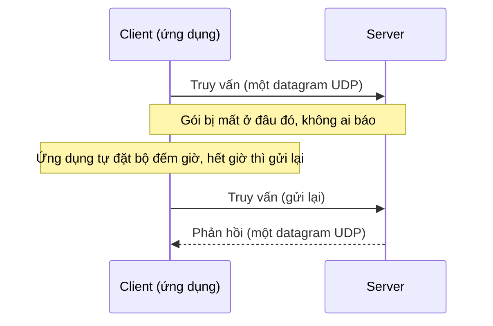

---
tags:
  - Should
  - UDP
  - Concept
  - Troubleshooting
---

# UDP khác TCP ở chỗ nào, và khi nào "không đảm bảo" lại là lựa chọn đúng?

## Metadata

```yaml
Chapter: udp
Phase: 04 — transport-app
Importance: Should
Status: draft
Prerequisites:
  - Phase 01 / 02-osi-vs-tcpip
Used Later:
  - Phase 04 / 04-ports-sockets
Estimated Reading: 25 phút
Estimated Practice: 25 phút
```

## 1. Story

<!-- Mức bắt buộc (Should): Đủ -->
<!-- DRAFT: người học cần viết lại bằng lời mình -->

Ứng dụng `shopnet` gửi log tới một máy thu log tập trung bằng syslog qua UDP. Mọi thứ bình thường cho tới giờ cao điểm: kỹ sư điều tra một sự cố lúc 20:00 và thấy log của ba phút quan trọng nhất **không có**. Ứng dụng không báo lỗi, máy thu log không báo lỗi, mạng không báo lỗi. Các bản tin đơn giản là **biến mất**.

UDP không hứa gì về việc giao hàng: nếu bộ đệm nhận đầy, nếu một router bỏ gói, hay nếu máy thu bận, gói tin bị mất mà **không ai được thông báo**. Với log thì đôi khi chấp nhận được; với dữ liệu quan trọng thì không. Chapter này giải thích UDP cung cấp gì, không cung cấp gì, vì sao nó vẫn là lựa chọn đúng cho DNS, DHCP, thoại và QUIC, và cách phát hiện mất gói im lặng.

## 2. Objectives

<!-- Mức bắt buộc (Should): Đủ -->
<!-- DRAFT: người học cần viết lại bằng lời mình -->

Sau chapter này bạn có thể:

- Liệt kê những gì UDP cung cấp (cổng, độ dài, checksum) và không cung cấp (kết nối, thứ tự, gửi lại, kiểm soát tắc nghẽn).
- So sánh UDP với TCP và chọn giao thức phù hợp cho một tình huống cho trước.
- Giải thích vì sao ứng dụng dùng UDP phải tự xử lý mất gói, trùng lặp, sai thứ tự và kích thước gói.
- Giải thích cách firewall, NAT và load balancer "nhớ" luồng UDP dù UDP không có kết nối.
- Phân biệt ba kết quả khi gửi UDP: có trả lời, bị từ chối (ICMP), im lặng.

## 3. Prerequisites

<!-- Mức bắt buộc (Should): Đủ -->
<!-- DRAFT: người học cần viết lại bằng lời mình -->

> Xem lại: [osi-vs-tcpip](../phase-01-foundation/02-osi-vs-tcpip.md)

Bạn cần nhớ vị trí tầng vận chuyển (`01/02`), cổng ở mức khái niệm (`00/02`), và so sánh với TCP (`04/01`).

## 4. Why it exists

<!-- Mức bắt buộc (Should): Đủ -->
<!-- DRAFT: người học cần viết lại bằng lời mình -->

TCP bảo đảm dữ liệu đến đủ và đúng thứ tự, nhưng phải trả giá: bắt tay trước khi gửi, chờ xác nhận, gửi lại phần mất, giữ trạng thái cho từng kết nối. Với nhiều ứng dụng, cái giá đó không đáng, hoặc thậm chí gây hại:

- **Yêu cầu/phản hồi nhỏ** (hỏi DNS): bắt tay ba bước tốn gấp mấy lần thời gian của chính câu hỏi.
- **Thời gian thực** (thoại, video): gói đến muộn thì vô dụng; gửi lại một gói cũ chỉ làm chậm các gói mới.
- **Phát cho nhiều bên** (quảng bá, multicast): không có "một kết nối".
- **Giao thức tự xây** (QUIC dùng UDP để tự quản lý độ tin cậy theo cách riêng).

**UDP (User Datagram Protocol)** cung cấp dịch vụ **tối thiểu** trên IP: thêm **số cổng** (để chọn đúng ứng dụng) và **checksum** (để phát hiện gói bị hỏng), nhưng không thêm gì khác. Theo RFC 768, UDP là dịch vụ gói tin (datagram) ít cơ chế, và "không bảo đảm giao hàng và chống trùng lặp"; ứng dụng cần luồng tin cậy thì nên dùng TCP.

Nếu hiểu sai:

- Dùng UDP cho dữ liệu cần đúng 100% mà không tự xử lý mất gói (Story).
- Tưởng "không báo lỗi" nghĩa là "đã giao thành công".
- Quên rằng UDP vẫn cần kiểm soát tắc nghẽn ở tầng ứng dụng, có thể làm nghẽn mạng.

## 5. Mental model

<!-- Mức bắt buộc (Should): Đủ -->
<!-- DRAFT: người học cần viết lại bằng lời mình -->

Hình dung **gửi bưu thiếp** và **gửi thư bảo đảm**. Bưu thiếp (UDP): bạn viết địa chỉ, bỏ vào hòm thư, **không biết** nó có tới không. Rất rẻ và nhanh; hợp để gửi lời chào hằng ngày. Thư bảo đảm (TCP): có phiếu nhận, người nhận ký xác nhận, thất lạc thì gửi lại; chậm hơn và tốn công hơn, nhưng chắc chắn.

**Tóm tắt một câu:** UDP gửi từng gói độc lập, không bắt tay, không xác nhận, không gửi lại; độ tin cậy (nếu cần) là việc của ứng dụng.

## 6. How it works

<!-- Mức bắt buộc (Should): Đủ -->
<!-- DRAFT: người học cần viết lại bằng lời mình -->

Các từ cần biết:

- **UDP (giao thức gói tin người dùng — giao thức tầng vận chuyển gửi từng gói độc lập, không kết nối, không bảo đảm giao hàng).**
- **Datagram (gói tin độc lập — một thông điệp UDP, mỗi gói tự đủ thông tin và không phụ thuộc gói khác).**
- **Connectionless (không kết nối — không có bước thiết lập trước khi gửi, hai bên không giữ trạng thái chung).**
- **Congestion control (kiểm soát tắc nghẽn — cơ chế giảm tốc độ gửi khi mạng nghẽn).**

**Tiêu đề UDP** (RFC 768) chỉ có bốn trường: **cổng nguồn**, **cổng đích**, **độ dài** (tối thiểu 8 byte, chính là kích thước tiêu đề) và **checksum** (16 bit, tính cả một "tiêu đề giả" gồm địa chỉ IP nguồn/đích). Không có số thứ tự, không có xác nhận, không có cửa sổ.

| Tiêu chí | TCP (`04/01`) | UDP |
|---|---|---|
| Kết nối | Có (bắt tay ba bước) | Không |
| Giao hàng | Bảo đảm (gửi lại phần mất) | Không bảo đảm |
| Thứ tự | Đúng thứ tự | Không đảm bảo |
| Kiểm soát tắc nghẽn và luồng | Có sẵn | Không (ứng dụng tự lo) |
| Chi phí tiêu đề | Lớn hơn | 8 byte |
| Hợp với | Web, database, truyền tệp | DNS, DHCP, NTP, syslog, thoại/video, QUIC |



**Đọc sơ đồ:** khi một gói bị mất, **tầng UDP không làm gì cả**. Chính ứng dụng (ví dụ bộ phân giải DNS) phải biết đặt giờ chờ và gửi lại. Đó là lý do một truy vấn DNS bị mất gói thường chỉ thấy "chậm hơn vài giây" chứ không có lỗi rõ ràng.

**Ứng dụng dùng UDP phải tự lo** (theo hướng dẫn RFC 8085):

- **Kiểm soát tắc nghẽn:** ứng dụng dùng UDP phải có cơ chế ngăn nghẽn mạng, ví dụ ứng dụng ít dữ liệu không nên gửi quá một gói mỗi RTT.
- **Kích thước gói:** tránh phân mảnh IP (làm giảm độ tin cậy, nhiều thiết bị trung gian bỏ gói phân mảnh); hoặc dùng path MTU discovery, hoặc giới hạn kích thước (576 byte với IPv4, 1280 byte với IPv6).
- **Mất, trùng, sai thứ tự:** ứng dụng cần độ tin cậy phải tự xử lý và chịu được gói đến trễ tới vài phút.
- **Checksum:** nên bật mặc định (với IPv6 là bắt buộc trong hầu hết trường hợp).
- **Qua NAT:** gửi gói giữ kết nối (keep-alive) không thưa hơn khoảng 15 giây một lần vì nhiều thiết bị NAT bỏ ánh xạ UDP sớm.

**UDP và DNS.** DNS thường chạy trên UDP nhưng **không chỉ UDP**: theo RFC 7766, khi phản hồi quá lớn (quá 512 byte ở bản gốc) máy chủ đặt cờ "bị cắt" (TC) và client thử lại bằng **TCP**; hỗ trợ TCP là yêu cầu bắt buộc của một cài đặt DNS đầy đủ. Vì vậy firewall phải cho phép cả UDP lẫn TCP cho cổng 53 (xem `03/02`).

**UDP và trạng thái.** UDP không có kết nối, nhưng firewall, NAT và load balancer vẫn **nhớ luồng** theo bộ năm trong một thời gian: gói trả lời có địa chỉ/cổng đảo ngược trong thời hạn thì được coi là thuộc luồng (`05/01`). Hết thời hạn nhàn rỗi, luồng bị quên; gói sau đó bị coi là luồng mới (trên một load balancer, có thể tới một đích khác).

> Cổng và socket ở `04/04`; DNS ở `03/02`; DHCP ở `03/01`; firewall theo trạng thái ở `05/01`.

<!-- verified: 2026-10-05 https://www.rfc-editor.org/rfc/rfc768 -->
<!-- verified: 2026-10-05 https://www.rfc-editor.org/rfc/rfc8085 -->
<!-- verified: 2026-10-05 https://www.rfc-editor.org/rfc/rfc7766 -->

## 7. Key settings

<!-- Mức bắt buộc (Should): Đủ -->
<!-- DRAFT: người học cần viết lại bằng lời mình -->

| Thông số | Ý nghĩa | Nếu sai |
|---|---|---|
| Thời gian chờ và số lần gửi lại (ở ứng dụng) | Khi nào bỏ cuộc/gửi lại | Quá ngắn gây bão gói; quá dài gây "chậm" khó hiểu |
| Kích thước datagram | Có bị phân mảnh không | Vượt MTU → mất gói im lặng |
| Bộ đệm nhận của socket | Chứa gói đến khi ứng dụng chưa kịp đọc | Quá nhỏ → hệ điều hành bỏ gói khi tải cao (Story) |
| Keep-alive qua NAT | Giữ ánh xạ NAT | Thưa quá → ánh xạ bị xóa, gói bị mất |
| Thời hạn nhàn rỗi của luồng (firewall/NAT/LB) | Bao lâu thì quên luồng UDP | Luồng bị quên giữa chừng |

**Công cụ quan sát:**

- `ss -u -a` (hoặc `-ulpn`: UDP đang nghe, số cổng, tiến trình) trên Linux; `netstat -an -p udp` trên Windows (Windows còn có `Get-NetUDPEndpoint`).
- Thống kê lỗi nhận UDP của hệ điều hành (ví dụ `netstat -su` trên Linux) để biết gói bị bỏ vì bộ đệm đầy `[CHƯA KIỂM CHỨNG]` về tên trường cụ thể.
- Bắt gói (`00/03`) với bộ lọc `udp port <cổng>`.

<!-- verified: 2026-10-05 https://man7.org/linux/man-pages/man8/ss.8.html -->

## 8. AWS mapping

<!-- Mức bắt buộc (Should): Tùy chọn -->
<!-- DRAFT: người học cần viết lại bằng lời mình -->

Tùy chọn. Theo tài liệu AWS:

- **Network Load Balancer** có xử lý luồng UDP: mặc dù UDP không có kết nối, load balancer vẫn giữ **trạng thái luồng UDP** theo địa chỉ và cổng nguồn/đích để các gói cùng luồng luôn tới cùng một đích. Hết thời hạn nhàn rỗi, gói đến được coi là luồng mới và có thể tới đích khác; thời hạn nhàn rỗi cho luồng UDP của NLB là **120 giây** và không đổi được (giá trị có thể thay đổi, kiểm tra tài liệu hiện hành). Instance phải trả lời một yêu cầu mới trong vòng 30 giây để thiết lập đường về.
- **Security group** quy tắc dùng số giao thức (UDP là 17); với UDP, security group cũng theo dõi luồng để cho gói trả lời đi qua (`05/01`).
- **Network ACL** là stateless nên cần quy tắc cho cả chiều đi và chiều trả lời với UDP (`05/03`).

Chi tiết ở `04/07`, `06/08`. `[CHƯA KIỂM CHỨNG]` các con số và hành vi này cần xác nhận lại trước khi dựa vào.

<!-- verified: 2026-10-05 https://docs.aws.amazon.com/elasticloadbalancing/latest/network/network-load-balancers.html -->

## 9. Hands-on lab

<!-- Mức bắt buộc (Should): Rút gọn -->
<!-- DRAFT: người học cần viết lại bằng lời mình -->

Chi tiết ở `labs/phase-04-transport-app/chapter-03-udp/README.md`. Chạy trong WSL2/Linux.

**1. Predict:** gửi một datagram UDP tới (a) một server UDP đang chạy, (b) một cổng UDP không có ai nghe trên chính máy bạn, (c) một địa chỉ không ai trả lời. Ba trường hợp sẽ cho ba kết quả khác nhau thế nào ở phía người gửi?

**2. Run:**

```bash
python3 - <<'PY'
import socket, threading

def server(port):
    s = socket.socket(socket.AF_INET, socket.SOCK_DGRAM)
    s.bind(('127.0.0.1', port))
    data, addr = s.recvfrom(1024)
    s.sendto(b'pong: ' + data, addr)
    s.close()

threading.Thread(target=server, args=(9998,), daemon=True).start()

def ask(host, port, label):
    s = socket.socket(socket.AF_INET, socket.SOCK_DGRAM)
    s.settimeout(2)
    s.connect((host, port))
    s.send(b'ping')
    try:
        print(label, '->', s.recv(100))
    except Exception as e:
        print(label, '->', type(e).__name__)
    finally:
        s.close()

ask('127.0.0.1', 9998, '(a) server đang chạy')
ask('127.0.0.1', 9, '(b) cổng đóng trên máy này')
ask('192.0.2.1', 9, '(c) địa chỉ không ai trả lời')
PY
```

**3. Verify:** ghi kết quả ba trường hợp. Output thật: `[CHƯA CHẠY]`.

## 10. Break it

<!-- Mức bắt buộc (Should): Rút gọn -->
<!-- DRAFT: người học cần viết lại bằng lời mình -->

Bài ở mục 9 chính là Break it: nó cho ba "kết quả" mà từ ngoài trông giống nhau ("không thấy phản hồi" ở (b) và (c)).

**Dự đoán (trên Linux):**

- **(a)** nhận `b'pong: ping'` (có trả lời).
- **(b)** `ConnectionRefusedError`: máy nhận trả về ICMP "port unreachable" (`03/04`, type 3 code 3), nên socket UDP đã `connect()` nhận được lỗi.
- **(c)** `timeout`: không có gì trả lời (không có ICMP, không có phản hồi), chỉ biết là im lặng.

**Ý nghĩa:** với UDP, "không có phản hồi" có hai nguyên nhân khác hẳn: bị **từ chối** (có ICMP báo về, ứng dụng biết ngay) và **im lặng** (gói mất, bị chặn, hoặc đích không có mặt). Chỉ khi có ICMP trả về thì mới phân biệt được; nếu ICMP bị chặn, trường hợp (b) cũng trở thành im lặng. Hành vi này khác nhau theo hệ điều hành (trên Windows, cổng đóng có thể báo lỗi khác).

**Khôi phục:** không có thay đổi hệ thống.

Kết quả thật: `[CHƯA CHẠY]`.

## 11. Troubleshooting

<!-- Mức bắt buộc (Should): Rút gọn -->
<!-- DRAFT: người học cần viết lại bằng lời mình -->

| Triệu chứng | Giả thuyết đầu tiên | Kiểm tra | Công cụ |
|---|---|---|---|
| Bản tin UDP "biến mất" không báo lỗi (Story) | Bộ đệm nhận đầy, gói bị mạng/thiết bị bỏ, hoặc nơi nhận bận | Thống kê lỗi nhận UDP; bắt gói ở cả hai đầu xem gói có tới không | `netstat -su`, `tcpdump 'udp port N'` |
| Truy vấn DNS thỉnh thoảng chậm vài giây | Mất gói UDP, ứng dụng chờ hết giờ rồi gửi lại | Chạy lặp, xem tỷ lệ chậm; thử server khác | `dig`, `Resolve-DnsName` (`03/02`) |
| DNS lỗi với phản hồi lớn | Phản hồi cần TCP nhưng firewall chặn TCP 53 | Cho phép cả UDP và TCP cổng 53 | `dig +tcp`, bắt gói |
| Gói lớn mất, gói nhỏ đến được | Phân mảnh bị chặn / vượt MTU | Giảm kích thước datagram; kiểm tra path MTU (`03/04`) | `ping -M do -s <n>` |
| Luồng UDP dài bị đứt sau một thời gian im lặng | Ánh xạ NAT / luồng ở load balancer hết thời hạn nhàn rỗi | Gửi keep-alive định kỳ ngắn hơn thời hạn | Cấu hình NAT/LB, bắt gói |
| Gửi được nhưng không nhận được trả lời | Security group/ACL stateless chặn chiều trả lời UDP | Quy tắc hai chiều (`05/03`) | Bắt gói, xem quy tắc |

Ghi kết quả thật của mục 10: `[CHƯA CHẠY]`.

## 12. Security & cost

<!-- Mức bắt buộc (Should): Đủ -->
<!-- DRAFT: người học cần viết lại bằng lời mình -->

- **Giả mạo địa chỉ nguồn dễ hơn với UDP** (không có bắt tay xác nhận người gửi). Điều này cho phép **tấn công khuếch đại** (kẻ tấn công gửi truy vấn nhỏ với địa chỉ nguồn giả là nạn nhân, máy chủ gửi phản hồi lớn tới nạn nhân) `[CHƯA KIỂM CHỨNG]` về các dịch vụ cụ thể bị lạm dụng nhiều nhất. Giảm thiểu: không để máy chủ DNS/NTP "mở" trả lời mọi người, giới hạn tốc độ, lọc địa chỉ giả mạo ở biên mạng.
- Ứng dụng dùng UDP **phải có kiểm soát tắc nghẽn** để không làm nghẽn mạng (RFC 8085).
- **Đừng dùng UDP cho dữ liệu quan trọng** nếu không tự bảo đảm độ tin cậy và xác thực ở tầng ứng dụng.
- Không dán output bắt gói/thống kê thật (địa chỉ, cổng nội bộ) vào tài liệu công khai.
- **Chi phí:** local nên không phát sinh; trên đám mây tính phí theo lưu lượng như thường, và lưu lượng UDP khối lượng lớn cũng tốn băng thông.

## 13. Misconceptions

<!-- Mức bắt buộc (Should): Đủ -->
<!-- DRAFT: người học cần viết lại bằng lời mình -->

| Hiểu nhầm | Sự thật |
|---|---|
| "UDP nhanh hơn TCP" | UDP ít chi phí hơn nhưng nếu ứng dụng tự xây độ tin cậy thì không nhất thiết nhanh hơn; "nhanh" chủ yếu nghĩa là không bắt tay/không chờ xác nhận |
| "UDP không báo lỗi nghĩa là đã giao thành công" | Không có xác nhận nào; có thể mất mà không ai biết |
| "UDP không có trạng thái nên firewall không theo dõi được" | Firewall/NAT/LB suy luận luồng từ bộ năm và thời hạn |
| "DNS chỉ dùng UDP" | DNS dùng UDP mặc định nhưng bắt buộc hỗ trợ TCP (phản hồi lớn, zone transfer) |
| "UDP không cần kiểm soát tắc nghẽn" | Ứng dụng dùng UDP vẫn phải ngăn nghẽn mạng |
| "Gói UDP luôn đến đúng thứ tự" | Không đảm bảo thứ tự |
| "Cổng UDP đóng luôn cho ICMP báo về" | Thường có, nhưng nếu ICMP bị chặn thì chỉ thấy im lặng |

## 14. Interview questions

<!-- Mức bắt buộc (Should): Đủ -->
<!-- DRAFT: người học cần viết lại bằng lời mình -->

### Q1 (Junior) — UDP khác TCP thế nào, và khi nào nên dùng UDP?

**Gợi ý ý chính:**
- Hai bên có thiết lập kết nối không?
- Ví dụ ứng dụng hợp với UDP?

??? success "Đáp án mẫu (tự trả lời trước khi mở)"
    UDP không kết nối, không bảo đảm giao hàng, không đảm bảo thứ tự và không có kiểm soát tắc nghẽn; TCP có tất cả những thứ đó. Dùng UDP khi ứng dụng cần độ trễ thấp hoặc là yêu cầu/phản hồi nhỏ (DNS, DHCP, NTP), thời gian thực (thoại, video), hoặc tự xử lý độ tin cậy (QUIC).

### Q2 (Middle) — Vì sao DNS dùng UDP nhưng firewall vẫn phải cho phép TCP cổng 53?

**Gợi ý ý chính:**
- Điều gì xảy ra khi phản hồi quá lớn?
- Ai quyết định chuyển sang TCP?

??? success "Đáp án mẫu (tự trả lời trước khi mở)"
    Phản hồi quá lớn bị cắt (cờ TC) nên client thử lại bằng TCP; RFC 7766 quy định hỗ trợ TCP là bắt buộc. Nếu chặn TCP 53, các phản hồi lớn thất bại.

### Q3 (Middle) — Ứng dụng của bạn mất bản tin UDP mà không có lỗi nào. Bạn kiểm tra gì?

**Gợi ý ý chính:**
- Gói có rời máy gửi và tới máy nhận không?
- Bộ đệm nhận của hệ điều hành?

??? success "Đáp án mẫu (tự trả lời trước khi mở)"
    Bắt gói ở cả hai đầu để xem gói có tới không; kiểm tra thống kê lỗi nhận UDP (bộ đệm đầy); kiểm tra MTU/phân mảnh, quy tắc firewall/security group, và tải của bên nhận. Nếu cần độ tin cậy, thêm xác nhận và gửi lại ở ứng dụng hoặc dùng TCP.

### Q4 (Middle) — Vì sao luồng UDP dài qua NAT cần keep-alive?

**Gợi ý ý chính:**
- NAT nhớ ánh xạ bao lâu?
- Chuyện gì xảy ra khi ánh xạ bị xóa?

??? success "Đáp án mẫu (tự trả lời trước khi mở)"
    NAT chỉ nhớ ánh xạ trong một thời hạn nhàn rỗi (thường ngắn với UDP). Hết thời hạn, ánh xạ bị xóa và gói đến sau không khớp nên bị mất; keep-alive định kỳ ngắn hơn thời hạn giữ ánh xạ sống. RFC 8085 khuyến nghị không thưa hơn khoảng 15 giây vì nhiều NAT xóa sớm.

## 15. Exercises

<!-- Mức bắt buộc (Should): Đủ -->
<!-- DRAFT: người học cần viết lại bằng lời mình -->

1. **So sánh TCP và UDP.** *Deliverable:* bảng chọn giao thức cho 6 ứng dụng (DNS, truyền tệp, thoại, đồng bộ đồng hồ, syslog, API thanh toán), kèm lý do bằng lời bạn.
2. **Phân tích Story.** *Deliverable:* kế hoạch 5 bước chứng minh log bị mất ở đâu (lệnh/công cụ mỗi bước) và đề xuất sửa (dùng TCP hay thêm xác nhận).
3. **Ba kết quả.** Chạy script ở mục 9. *Deliverable:* bảng 3 dòng: trường hợp, kết quả, nguyên nhân, và nói chuyện gì xảy ra nếu ICMP bị chặn.
4. **Thiết kế keep-alive.** Luồng UDP qua NAT có thời hạn nhàn rỗi 30 giây. *Deliverable:* chu kỳ keep-alive bạn chọn và lý do.

## 16. Cheat sheet

<!-- Mức bắt buộc (Should): Đủ -->
<!-- DRAFT: người học cần viết lại bằng lời mình -->

| Mục | Nội dung |
|---|---|
| Tiêu đề UDP | Cổng nguồn, cổng đích, độ dài, checksum (8 byte) |
| UDP không có | Kết nối, giao hàng bảo đảm, thứ tự, gửi lại, kiểm soát tắc nghẽn |
| Ứng dụng tự lo | Gửi lại, kích thước gói (tránh phân mảnh), kiểm soát tắc nghẽn |
| DNS | UDP mặc định; TCP khi phản hồi lớn |
| NAT/firewall/LB | Nhớ luồng UDP theo bộ năm + thời hạn; cần keep-alive |
| Ba kết quả | Trả lời / bị từ chối (ICMP) / im lặng |
| Lệnh | `ss -ulpn`, `tcpdump 'udp port N'` |

**Debug:** gói có đi/đến không (bắt gói hai đầu) → bộ đệm/thống kê lỗi → MTU → firewall/security group (hai chiều).

## 17. Glossary terms

<!-- Mức bắt buộc (Should): Đủ -->
<!-- DRAFT: người học cần viết lại bằng lời mình -->

- UDP / giao thức gói tin người dùng / UDP
- Datagram / gói tin độc lập / データグラム
- Connectionless / không kết nối / コネクションレス
- Congestion control / kiểm soát tắc nghẽn / 輻輳制御

## 18. Further reading

<!-- Mức bắt buộc (Should): Đủ -->
<!-- DRAFT: người học cần viết lại bằng lời mình -->

Kiểm tra ngày 2026-10-05:

- RFC 768 — User Datagram Protocol: https://www.rfc-editor.org/rfc/rfc768
- RFC 8085 — UDP Usage Guidelines: https://www.rfc-editor.org/rfc/rfc8085
- RFC 7766 — DNS Transport over TCP: https://www.rfc-editor.org/rfc/rfc7766
- Network Load Balancers: https://docs.aws.amazon.com/elasticloadbalancing/latest/network/network-load-balancers.html
