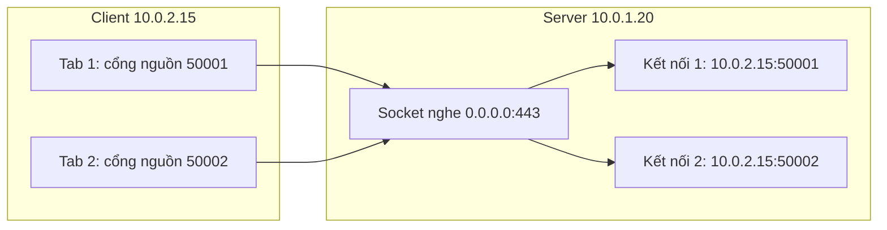

---
tags:
  - Must
  - Port
  - Socket
  - Troubleshooting
---

# Cổng và socket là gì, và vì sao "địa chỉ IP đúng" vẫn chưa đủ để kết nối?

## Metadata

```yaml
Chapter: ports-sockets
Phase: 04 — transport-app
Importance: Must
Status: draft
Prerequisites:
  - Phase 04 / 01-tcp-handshake-states
  - Phase 04 / 03-udp
Used Later:
  - Phase 04 / 07-load-balancing-l4-vs-l7
  - Phase 05 / 01-firewall-stateful-vs-stateless
Estimated Reading: 35 phút
Estimated Practice: 40 phút
```

## 1. Story

<!-- Mức bắt buộc (Must): Đủ -->
<!-- DRAFT: người học cần viết lại bằng lời mình -->

Dịch vụ `shopnet-api` vừa triển khai lên máy chủ mới. Từ chính máy đó, `curl http://localhost:8080/health` chạy tốt. Nhưng từ máy khác trong cùng subnet, `curl http://10.0.1.20:8080/health` báo "Connection refused". Security group đã mở cổng 8080, ping thông, DNS đúng. Mọi người nghi mạng.

Nguyên nhân nằm ngay trên máy chủ: ứng dụng chỉ **lắng nghe (listen)** trên `127.0.0.1:8080`, tức là chỉ nhận kết nối từ chính máy đó. Gói SYN từ máy khác tới đúng địa chỉ `10.0.1.20` nhưng **không có socket nào đang nghe** ở địa chỉ đó, nên hệ điều hành từ chối. Một lệnh `ss -tlnp` cho thấy ngay. Chapter này giúp bạn đọc được bức tranh "ai đang nghe ở đâu" và hiểu một kết nối được định danh thế nào.

## 2. Objectives

<!-- Mức bắt buộc (Must): Đủ -->
<!-- DRAFT: người học cần viết lại bằng lời mình -->

Sau chapter này bạn có thể:

- Giải thích cổng, socket và bộ năm (5-tuple) định danh một kết nối.
- Đọc output `ss -tulpn` và phân biệt `0.0.0.0`, `127.0.0.1`, địa chỉ cụ thể, `[::]`.
- Giải thích cổng tạm (ephemeral port) và vì sao nhiều kết nối tới cùng một cổng vẫn không đụng nhau.
- Chẩn đoán "Connection refused" so với "timeout" so với "Address already in use".
- Dự đoán vì sao hết cổng tạm gây lỗi khi một máy mở rất nhiều kết nối ra ngoài.

## 3. Prerequisites

<!-- Mức bắt buộc (Must): Đủ -->
<!-- DRAFT: người học cần viết lại bằng lời mình -->

> Xem lại: [tcp-handshake-states](01-tcp-handshake-states.md), [udp](03-udp.md)

Cần nhớ: trạng thái TCP `LISTEN`, `ESTABLISHED`, `TIME_WAIT` (`04/01`); UDP không kết nối (`04/03`); công cụ `ss` (`00/02`).

## 4. Why it exists

<!-- Mức bắt buộc (Must): Đủ -->
<!-- DRAFT: người học cần viết lại bằng lời mình -->

Địa chỉ IP chỉ chọn **máy**. Nhưng một máy chạy nhiều chương trình cùng lúc (web, SSH, database, agent). Khi gói tin đến, hệ điều hành phải biết giao cho **chương trình nào**. Số **cổng (port)** giải quyết việc đó: IP chọn máy, cổng chọn ứng dụng trên máy.

Nếu không có cổng, mỗi máy chỉ chạy được một dịch vụ mạng, và nhiều kết nối đồng thời từ cùng một client tới cùng một server sẽ không phân biệt được. Hiểu sai về cổng/socket dẫn tới các lỗi quen thuộc: ứng dụng chỉ nghe loopback (Story), hai tiến trình tranh một cổng, hết cổng tạm, firewall mở sai cổng.

## 5. Mental model

<!-- Mức bắt buộc (Must): Đủ -->
<!-- DRAFT: người học cần viết lại bằng lời mình -->

Hình dung **tòa nhà văn phòng**. Địa chỉ IP là địa chỉ tòa nhà; số cổng là **số phòng**; mỗi phòng có một công ty (ứng dụng) làm việc. "Đang nghe" nghĩa là phòng đó có người ngồi chờ khách. Khi bạn đến một số phòng không có ai, bảo vệ (hệ điều hành) bảo "không có ai ở đó" (**Connection refused**). Còn nếu tòa nhà đóng cửa hẳn hoặc bạn bị chặn ở cổng, bạn chỉ đứng đợi mãi (**timeout**).

**Tóm tắt một câu:** IP chọn máy, cổng chọn ứng dụng, và một kết nối được định danh bởi bộ năm (giao thức, IP nguồn, cổng nguồn, IP đích, cổng đích).

## 6. How it works

<!-- Mức bắt buộc (Must): Đủ -->
<!-- DRAFT: người học cần viết lại bằng lời mình -->

Các từ cần biết:

- **Port (cổng — số 16 bit từ 0 đến 65535, chọn ứng dụng trên máy).**
- **Socket (ổ cắm mạng — điểm đầu cuối mà chương trình dùng để gửi/nhận dữ liệu, gồm giao thức, địa chỉ IP và số cổng).**
- **Listen (lắng nghe — chương trình chờ sẵn ở một địa chỉ/cổng để nhận kết nối đến).**
- **Bind (gắn — gán một socket vào một địa chỉ IP và cổng cụ thể).**
- **Ephemeral port (cổng tạm — cổng nguồn do hệ điều hành chọn tự động cho kết nối đi ra, dùng một lần rồi trả lại).**
- **5-tuple (bộ năm — năm giá trị cùng nhau xác định một luồng: giao thức, IP nguồn, cổng nguồn, IP đích, cổng đích).**

**Ba nhóm số cổng** (theo quy ước của IANA, RFC 6335): cổng hệ thống `0–1023` (dịch vụ quen thuộc như 22, 80, 443), cổng người dùng đã đăng ký `1024–49151`, và cổng động/riêng `49152–65535`. Nhiều hệ điều hành dùng một dải cổng tạm riêng; ví dụ Linux mặc định `32768–60999` (đọc `net.ipv4.ip_local_port_range`), không trùng hẳn với khuyến nghị của IANA.

**Phía server:** chương trình gọi `bind()` gắn vào một địa chỉ+cổng rồi `listen()`. Địa chỉ gắn quyết định **ai kết nối được**:

| Gắn vào | Nghĩa | Ai kết nối được |
|---|---|---|
| `0.0.0.0:8080` (IPv4) / `[::]:8080` | Mọi địa chỉ IP của máy | Từ cả trong lẫn ngoài máy (nếu mạng cho phép) |
| `127.0.0.1:8080` | Chỉ vòng lặp (loopback) | Chỉ từ chính máy này (Story) |
| `10.0.1.20:8080` | Chỉ địa chỉ IP đó | Chỉ qua giao diện có IP đó |

**Phía client:** khi kết nối ra, hệ điều hành tự chọn **cổng tạm** làm cổng nguồn. Nhờ vậy nhiều kết nối từ cùng client tới cùng `server:443` vẫn khác nhau ở cổng nguồn, nên bộ năm khác nhau.



**Đọc sơ đồ:** server chỉ có **một** socket nghe ở cổng 443. Mỗi kết nối đến sinh ra một socket kết nối riêng, được phân biệt bằng bộ năm (khác nhau ở IP/cổng nguồn của client). Vì vậy một cổng phục vụ được hàng nghìn client cùng lúc: cổng đích chung, nhưng bộ năm riêng.

**Vì sao chạy hai chương trình cùng cổng thì lỗi?** Hai socket nghe cùng địa chỉ+cổng sẽ xung đột: `bind()` trả lỗi "Address already in use" (EADDRINUSE). Vẫn có ngoại lệ có chủ đích (ví dụ tùy chọn `SO_REUSEADDR`/`SO_REUSEPORT`), không thuộc phạm vi chapter này `[CHƯA KIỂM CHỨNG]` về chi tiết từng hệ điều hành.

**Ba kết quả khi kết nối TCP tới `host:port`:**

| Quan sát | Nghĩa thường gặp |
|---|---|
| Nhận ngay RST → "Connection refused" | Gói đã tới máy, nhưng **không có socket nghe** (hoặc firewall chủ động từ chối bằng RST) |
| Treo rồi "timed out" | Gói không có phản hồi: bị firewall DROP, mất đường, hoặc đích không tồn tại |
| Kết nối thành công | Có socket nghe và đường đi thông |

**Hết cổng tạm:** mỗi kết nối đi ra từ cùng một IP tới cùng `đích:cổng` cần một cổng nguồn khác nhau, và sau khi đóng, cổng còn bị giữ ở `TIME_WAIT` (`04/01`). Dải cổng tạm có hữu hạn (Linux mặc định khoảng 28.000 cổng), nên một máy mở/đóng rất nhiều kết nối ngắn tới cùng một đích có thể cạn cổng; thường gặp sau NAT hoặc khi một máy chủ ứng dụng gọi liên tục một database/API. Dấu hiệu: lỗi kiểu "Cannot assign requested address".

> NAT dùng cổng để ghép nhiều máy vào một IP (`02/05`); firewall lọc theo cổng (`05/01`); load balancer chuyển kết nối (`04/07`).

<!-- verified: 2026-10-05 https://www.rfc-editor.org/rfc/rfc6335 -->
<!-- verified: 2026-10-05 https://man7.org/linux/man-pages/man2/bind.2.html -->
<!-- verified: 2026-10-05 https://man7.org/linux/man-pages/man8/ss.8.html -->

## 7. Key settings

<!-- Mức bắt buộc (Must): Đủ -->
<!-- DRAFT: người học cần viết lại bằng lời mình -->

| Thông số | Ý nghĩa | Nếu sai |
|---|---|---|
| Địa chỉ bind của ứng dụng (`0.0.0.0` vs `127.0.0.1`) | Ai kết nối được | Chỉ nghe loopback → máy khác bị "refused" (Story) |
| Cổng nghe | Ứng dụng nào nhận | Trùng cổng → `EADDRINUSE`, ứng dụng không khởi động |
| `net.ipv4.ip_local_port_range` (Linux) | Dải cổng tạm | Hẹp quá → cạn cổng sớm |
| Cổng trong firewall/security group | Cổng nào được phép | Mở sai cổng → timeout dù ứng dụng đang chạy |
| Backlog của `listen()` | Hàng đợi kết nối chờ chấp nhận | Quá nhỏ → kết nối bị bỏ khi tải đột biến |

**Lệnh quan sát (nhớ ghi rõ shell):**

```bash
# Linux/WSL: TCP+UDP đang nghe, số cổng (không đổi sang tên), tiến trình
ss -tulpn

# Linux/WSL: mọi kết nối TCP đang có, đếm theo trạng thái
ss -tan | awk 'NR>1 {c[$1]++} END {for (s in c) print s, c[s]}'

# Linux/WSL: dải cổng tạm
cat /proc/sys/net/ipv4/ip_local_port_range
```

```powershell
# Windows PowerShell: TCP đang nghe + tiến trình
Get-NetTCPConnection -State Listen | Select-Object LocalAddress, LocalPort, OwningProcess
netstat -ano | findstr LISTENING
```

Cột `Local Address:Port` trong `ss -tulpn` chính là câu trả lời cho Story: `127.0.0.1:8080` khác hẳn `0.0.0.0:8080` hay `*:8080`.

## 8. AWS mapping

<!-- Mức bắt buộc (Must): Đủ -->
<!-- DRAFT: người học cần viết lại bằng lời mình -->

| Khái niệm | Trên AWS |
|---|---|
| Cổng được phép vào/ra | Security group và network ACL lọc theo giao thức + dải cổng (`05/03`) |
| Cổng nghe của ứng dụng | Phải khớp với cổng trong target group / health check của load balancer (`04/07`, `06/08`) |
| Cạn cổng tạm khi đi ra Internet | NAT gateway có giới hạn số kết nối đồng thời tới cùng một đích (kiểm tra tài liệu hiện hành) `[CHƯA KIỂM CHỨNG]` |
| Ephemeral port trong NACL | Quy tắc chiều trả lời phải cho phép dải cổng tạm (`05/03`) |

Điểm mấu chốt của Story trên AWS: security group mở cổng là điều kiện **cần**, không **đủ**. Ứng dụng phải thực sự nghe ở đúng địa chỉ/cổng, nếu không vẫn "refused". Cổng tạm của client Linux thường nằm trong `32768–60999`, còn nhiều hệ điều hành khác (và khuyến nghị IANA) dùng `49152–65535`, nên quy tắc NACL cho chiều trả lời cần rộng hơn một cổng cố định (`05/03`).

CloudFormation: không có kiểu riêng cho "cổng nghe"; cổng xuất hiện trong `AWS::EC2::SecurityGroup` (`FromPort`/`ToPort`), `AWS::EC2::NetworkAclEntry` (`PortRange`), `AWS::ElasticLoadBalancingV2::TargetGroup` (`Port`).

## 9. Hands-on lab

<!-- Mức bắt buộc (Must): Đủ -->
<!-- DRAFT: người học cần viết lại bằng lời mình -->

Chi tiết ở `labs/phase-04-transport-app/chapter-04-ports-sockets/README.md`. Chạy trong WSL2/Linux.

**1. Predict:**

- Chạy một server nghe `127.0.0.1:9000` và một server nghe `0.0.0.0:9001`. `ss -tlnp` hiển thị khác nhau thế nào?
- Chạy server thứ hai trên cùng cổng 9000 thì chuyện gì xảy ra?
- Kết nối tới một cổng không ai nghe cho kết quả gì, và khác kết quả khi kết nối tới `192.0.2.1`?

**2. Run:** xem README lab (Python `http.server`, `ss`, `curl`, `nc`).

**3. Verify:** đối chiếu với dự đoán; output thật `[CHƯA CHẠY]`.

## 10. Break it

<!-- Mức bắt buộc (Must): Đủ -->
<!-- DRAFT: người học cần viết lại bằng lời mình -->

**Lỗi 1 — nghe sai địa chỉ (Story).**
Dự đoán: server bind `127.0.0.1` thì `curl` từ chính máy (qua loopback) thành công, nhưng kết nối tới IP khác của máy (không phải loopback) bị "refused". Khôi phục: bind lại `0.0.0.0`.

**Lỗi 2 — trùng cổng.**
Dự đoán: tiến trình thứ hai bind cùng cổng báo `Address already in use` và thoát. Khôi phục: đổi cổng hoặc dừng tiến trình đầu (tìm bằng `ss -tlnp`).

**Lỗi 3 — phân biệt refused và timeout.**
Dự đoán: `nc -zv 127.0.0.1 9` (cổng đóng) trả về "refused" **ngay lập tức**, còn `nc -zv -w 3 192.0.2.1 9` (không ai trả lời) **treo** tới hết thời gian chờ. Hai triệu chứng này chỉ hai hướng chẩn đoán hoàn toàn khác nhau.

Kết quả thật: `[CHƯA CHẠY]`.

## 11. Troubleshooting

<!-- Mức bắt buộc (Must): Đủ -->
<!-- DRAFT: người học cần viết lại bằng lời mình -->

| Triệu chứng | Giả thuyết đầu tiên | Kiểm tra theo thứ tự | Công cụ |
|---|---|---|---|
| Connection refused | Không có socket nghe ở địa chỉ/cổng đó, hoặc nghe sai địa chỉ | 1) Ứng dụng có chạy không 2) `ss -tlnp` xem địa chỉ bind 3) Cổng đúng chưa | `ss -tlnp`, `Get-NetTCPConnection -State Listen` |
| Timeout (treo) | Bị chặn (security group, NACL, firewall) hoặc không có đường | 1) Ping/traceroute 2) Quy tắc firewall/SG 3) Bắt gói xem SYN có tới không | `nc -zv -w 3`, `tcpdump` |
| `Address already in use` | Tiến trình khác đang giữ cổng | `ss -tlnp` tìm PID; đổi cổng hoặc dừng | `ss -tlnp`, `lsof -i :PORT` |
| `Cannot assign requested address` khi đi ra | Hết cổng tạm (hoặc bind địa chỉ không thuộc máy) | Đếm `TIME_WAIT`, xem dải cổng tạm, giảm tạo kết nối mới (dùng keep-alive/pool) | `ss -tan`, `ip_local_port_range` |
| Health check của load balancer fail | Ứng dụng nghe sai cổng/địa chỉ so với target group | So cổng target group với `ss -tlnp` | `ss -tlnp`, console/CLI |
| Mở được từ máy này, không từ máy khác | Bind `127.0.0.1` | `ss -tlnp`: cột Local Address | `ss -tlnp` |

**Quy tắc nhớ:** *refused* = gói tới nơi, không ai nghe. *timeout* = gói không có hồi âm. Hai cái cần hai đường điều tra khác nhau.

Ghi kết quả thật của mục 10: `[CHƯA CHẠY]`.

## 12. Security & cost

<!-- Mức bắt buộc (Must): Đủ -->
<!-- DRAFT: người học cần viết lại bằng lời mình -->

- **Giảm bề mặt tấn công:** dịch vụ chỉ cần nội bộ thì bind `127.0.0.1` hoặc IP riêng, không bind `0.0.0.0`. Database mở `0.0.0.0` ra Internet là sự cố kinh điển.
- **Kiểm kê cổng nghe:** định kỳ chạy `ss -tulpn` để thấy dịch vụ không mong muốn.
- **Nguyên tắc tối thiểu:** security group chỉ mở cổng thực sự cần, từ nguồn thực sự cần (`05/03`).
- Cổng không phải cơ chế bảo mật: một dịch vụ chạy cổng lạ vẫn tìm thấy được bằng quét cổng.
- Không dán output `ss`/`netstat` thật (IP, tên tiến trình nội bộ) vào tài liệu công khai.
- **Chi phí:** lab local không phát sinh phí.

## 13. Misconceptions

<!-- Mức bắt buộc (Must): Đủ -->
<!-- DRAFT: người học cần viết lại bằng lời mình -->

| Hiểu nhầm | Sự thật |
|---|---|
| "Mở cổng trong security group là dịch vụ truy cập được" | Còn cần ứng dụng nghe đúng địa chỉ/cổng và các lớp khác không chặn |
| "Connection refused nghĩa là firewall chặn" | Thường là không có ai nghe; firewall DROP gây timeout, không phải refused (trừ khi cấu hình REJECT) |
| "Một cổng chỉ phục vụ một kết nối" | Một socket nghe sinh nhiều kết nối, mỗi kết nối một bộ năm |
| "Cổng tạm là cổng cố định" | Hệ điều hành chọn tự động, dải khác nhau theo hệ điều hành |
| "`0.0.0.0` là một địa chỉ để kết nối tới" | Khi **nghe**, nó nghĩa là mọi địa chỉ của máy; không nên dùng làm đích kết nối |
| "Cổng ≤ 1023 bảo mật hơn" | Chỉ là quy ước đặc quyền; không có bảo mật nội tại |
| "TCP cổng 53 và UDP cổng 53 là một" | Hai không gian cổng riêng biệt cho TCP và UDP |

## 14. Interview questions

<!-- Mức bắt buộc (Must): Đủ -->
<!-- DRAFT: người học cần viết lại bằng lời mình -->

### Q1 (Junior) — Cổng và socket là gì, một kết nối TCP được định danh thế nào?

**Gợi ý ý chính:**
- Vai trò của IP so với cổng?
- Năm giá trị nào?

??? success "Đáp án mẫu (tự trả lời trước khi mở)"
    IP chọn máy, cổng chọn ứng dụng trên máy. Socket là điểm đầu cuối (giao thức + IP + cổng). Một kết nối TCP được định danh bằng bộ năm: giao thức, IP nguồn, cổng nguồn, IP đích, cổng đích.

### Q2 (Junior) — "Connection refused" khác "timeout" thế nào?

**Gợi ý ý chính:**
- Gói có tới đích không?
- Ai trả lời?

??? success "Đáp án mẫu (tự trả lời trước khi mở)"
    Refused: gói tới máy đích và hệ điều hành trả RST vì không có socket nghe (hoặc firewall REJECT). Timeout: không có phản hồi, thường do DROP, mất đường hoặc đích không tồn tại. Cần hai đường điều tra khác nhau.

### Q3 (Middle) — Ứng dụng chạy tốt khi curl localhost nhưng máy khác "refused", security group đã mở. Nguyên nhân và cách kiểm tra?

**Gợi ý ý chính:**
- Địa chỉ ứng dụng bind?
- Lệnh nào cho thấy?

??? success "Đáp án mẫu (tự trả lời trước khi mở)"
    Ứng dụng có thể chỉ bind `127.0.0.1`. Kiểm tra `ss -tlnp`: nếu Local Address là `127.0.0.1:PORT` thì chỉ nhận kết nối nội bộ. Sửa cấu hình ứng dụng để bind `0.0.0.0` (hoặc IP riêng của máy) và chỉ mở cổng cần thiết trong security group.

### Q4 (Middle) — Vì sao một máy có thể cạn cổng tạm, và cách giảm?

**Gợi ý ý chính:**
- Mỗi kết nối cần gì ở phía client?
- TIME_WAIT?

??? success "Đáp án mẫu (tự trả lời trước khi mở)"
    Mỗi kết nối đi ra tới cùng đích:cổng cần một cổng nguồn khác nhau, và cổng bị giữ ở TIME_WAIT sau khi đóng. Mở/đóng rất nhiều kết nối ngắn có thể cạn dải cổng tạm. Giảm bằng cách dùng lại kết nối (keep-alive, connection pool), thêm địa chỉ nguồn (NAT gateway nhiều IP), hoặc mở rộng dải cổng tạm.

## 15. Exercises

<!-- Mức bắt buộc (Must): Đủ -->
<!-- DRAFT: người học cần viết lại bằng lời mình -->

1. **Đọc `ss`.** Chạy `ss -tulpn` trên máy WSL. *Deliverable:* bảng giải thích 5 dòng (giao thức, địa chỉ bind, ai kết nối được, tiến trình), đã làm sạch.
2. **Phân biệt refused/timeout.** *Deliverable:* sơ đồ quyết định 6 bước từ triệu chứng tới kiểm tra, dùng đúng thuật ngữ.
3. **Tính cổng tạm.** Dải 32768–60999, mỗi kết nối cần một cổng và giữ ở `TIME_WAIT` 60 giây. *Deliverable:* ước lượng số kết nối mới mỗi giây tối đa tới cùng một đích:cổng từ một IP và nêu giả định.
4. **Rà soát bề mặt.** Cho danh sách 4 dịch vụ trên một máy `shopnet`. *Deliverable:* chọn địa chỉ bind phù hợp cho từng cái (loopback hay mọi giao diện) kèm lý do.

## 16. Cheat sheet

<!-- Mức bắt buộc (Must): Đủ -->
<!-- DRAFT: người học cần viết lại bằng lời mình -->

| Mục | Nội dung |
|---|---|
| Số cổng | 0–65535; 16 bit |
| Bộ năm | giao thức, IP nguồn, cổng nguồn, IP đích, cổng đích |
| Nghe | `bind` + `listen`; `0.0.0.0` = mọi địa chỉ; `127.0.0.1` = chỉ nội bộ |
| Cổng tạm | Linux mặc định 32768–60999 |
| refused / timeout | Không ai nghe / không có hồi âm |
| Lệnh | `ss -tulpn`, `Get-NetTCPConnection -State Listen`, `nc -zv` |

**Debug:** ứng dụng chạy chưa → `ss -tlnp` (địa chỉ, cổng) → firewall/SG (có chặn không) → health check/target group → cổng tạm/TIME_WAIT.

## 17. Glossary terms

<!-- Mức bắt buộc (Must): Đủ -->
<!-- DRAFT: người học cần viết lại bằng lời mình -->

- Port / cổng / ポート
- Socket / ổ cắm mạng / ソケット
- Listen / lắng nghe / リッスン
- Bind / gắn / バインド
- Ephemeral port / cổng tạm / エフェメラルポート
- 5-tuple / bộ năm / 5タプル

## 18. Further reading

<!-- Mức bắt buộc (Must): Đủ -->
<!-- DRAFT: người học cần viết lại bằng lời mình -->

Kiểm tra ngày 2026-10-05:

- RFC 6335 — IANA Service Name and Transport Protocol Port Number Registry procedures: https://www.rfc-editor.org/rfc/rfc6335
- bind(2): https://man7.org/linux/man-pages/man2/bind.2.html
- ss(8): https://man7.org/linux/man-pages/man8/ss.8.html
