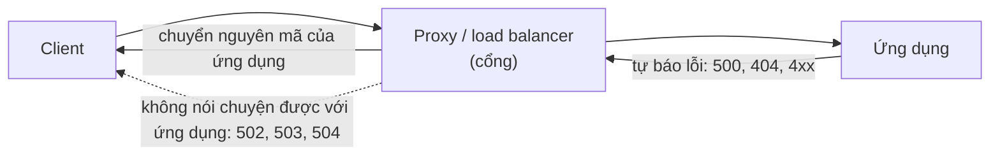
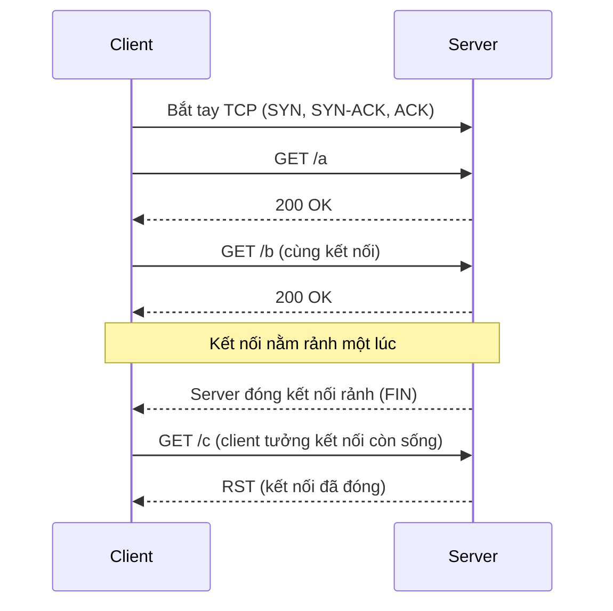

---
tags:
  - Must
  - HTTP
  - Concept
  - Troubleshooting
---

# Trình duyệt và server nói chuyện bằng HTTP như thế nào, và mã 4xx/5xx cho biết lỗi nằm ở đâu? (HTTP)

## Metadata

```yaml
Chapter: http
Phase: 04 — transport-app
Importance: Must
Status: draft
Prerequisites:
  - Phase 04 / 01-tcp-handshake-states
Used Later:
  - Phase 04 / 06-tls-certificates
  - Phase 04 / 07-load-balancing-l4-vs-l7
  - Phase 04 / 08-reverse-proxy
Estimated Reading: 35 phút
Estimated Practice: 45 phút
```

## 1. Story

<!-- Mức bắt buộc (Must): Đủ -->
<!-- DRAFT: người học cần viết lại bằng lời mình -->

Sau mỗi lần triển khai phiên bản mới của `shopnet`, người dùng thỉnh thoảng thấy lỗi **502 Bad Gateway** trong vài giây rồi tự hết. Log ứng dụng sạch sẽ, health check vẫn xanh, và đội phát triển khẳng định "ứng dụng không lỗi". Đội hạ tầng thì nói "load balancer không lỗi".

Cả hai đều đúng một nửa. Mã 502 nghĩa là **thiết bị trung gian** (cổng/proxy) nhận được một phản hồi không hợp lệ hoặc bị ngắt kết nối từ phía sau nó. Nguyên nhân thật: ứng dụng đóng các kết nối "rảnh" sớm hơn thời gian load balancer chờ, nên thỉnh thoảng load balancer gửi một yêu cầu vào kết nối vừa bị đóng. Để thấy điều đó, bạn cần hiểu HTTP cấu trúc ra sao, ai sinh ra mã trạng thái nào, và kết nối được tái sử dụng thế nào. Chapter này dạy điều đó.

## 2. Objectives

<!-- Mức bắt buộc (Must): Đủ -->
<!-- DRAFT: người học cần viết lại bằng lời mình -->

Sau chapter này bạn có thể:

- Đọc một yêu cầu và phản hồi HTTP (dòng đầu, header, nội dung) và giải thích từng phần.
- Phân biệt các phương thức GET, HEAD, POST, PUT, DELETE theo tiêu chí an toàn (safe) và lặp lại được (idempotent).
- Giải thích năm nhóm mã trạng thái và ý nghĩa của các mã hay gặp (200, 301, 302, 304, 401, 403, 404, 429, 500, 502, 503, 504).
- Nói được ai sinh ra mã nào trong chuỗi client → proxy/load balancer → ứng dụng, đặc biệt khác biệt giữa 500, 502 và 504.
- Dùng `curl` để quan sát yêu cầu/phản hồi và phân biệt lỗi mạng (không có phản hồi HTTP) với lỗi HTTP (có mã trạng thái).

## 3. Prerequisites

<!-- Mức bắt buộc (Must): Đủ -->
<!-- DRAFT: người học cần viết lại bằng lời mình -->

> Xem lại: [tcp-handshake-states](01-tcp-handshake-states.md)

Bạn cần nhớ rằng HTTP chạy **trên** một kết nối TCP đã được thiết lập (bắt tay ba bước ở `04/01`), và cách phân biệt "refused" với "timeout". Công cụ `curl` đã giới thiệu ở `00/02`.

## 4. Why it exists

<!-- Mức bắt buộc (Must): Đủ -->
<!-- DRAFT: người học cần viết lại bằng lời mình -->

TCP chỉ cho bạn một luồng byte tin cậy; nó không biết "tôi muốn lấy trang nào" hay "yêu cầu này thành công chưa". **HTTP (HyperText Transfer Protocol)** là bộ quy tắc ở tầng ứng dụng nói rõ điều đó: một bên gửi **yêu cầu** có phương thức và đích, bên kia trả **phản hồi** có mã trạng thái và nội dung.

Vì mọi bên đều dùng chung quy tắc, các thiết bị ở giữa (proxy, cache, load balancer, firewall tầng ứng dụng) hiểu được và xử lý thay cho cả hai đầu. Mã trạng thái cho phép phân loại lỗi mà không cần đọc log từng hệ thống.

Nếu hiểu sai HTTP:

- Đổ lỗi nhầm chỗ: 502/504 là lỗi của tầng trung gian hoặc đường tới ứng dụng, 500 mới là ứng dụng tự báo lỗi (Story).
- Dùng sai phương thức (ví dụ thay đổi dữ liệu bằng GET), gây tác dụng phụ khi cache hoặc thử lại.
- Nhầm "không có phản hồi" (lỗi TCP/DNS) với "phản hồi lỗi" (lỗi HTTP).

## 5. Mental model

<!-- Mức bắt buộc (Must): Đủ -->
<!-- DRAFT: người học cần viết lại bằng lời mình -->

Hình dung gọi món ở nhà hàng bằng **phiếu giấy**. Phiếu gọi món (yêu cầu) ghi "món gì" (phương thức + đường dẫn), "bàn nào" (header Host) và các ghi chú (header khác). Phiếu trả lời (phản hồi) ghi kết quả ("có món", "hết món", "bếp đang sự cố") kèm món ăn (nội dung). Người phục vụ **không nhớ** bạn là ai giữa hai lần gọi (HTTP không lưu trạng thái), nên bạn phải đưa thẻ thành viên (cookie/token) mỗi lần cần. Nếu quản lý gọi món thay bạn (proxy/load balancer) mà bếp không trả lời kịp, chính quản lý báo "bếp chưa phản hồi" (504).

**Tóm tắt một câu:** HTTP là cuộc trao đổi yêu cầu–phản hồi không lưu trạng thái trên một kết nối TCP, và mã trạng thái nói yêu cầu thành công hay thất bại ở bên nào.

## 6. How it works

<!-- Mức bắt buộc (Must): Đủ -->
<!-- DRAFT: người học cần viết lại bằng lời mình -->

Các từ cần biết:

- **HTTP (giao thức truyền siêu văn bản — quy tắc ứng dụng để gửi yêu cầu và nhận phản hồi trên web).**
- **Request / Response (yêu cầu / phản hồi — hai chiều của một lần trao đổi HTTP).**
- **Method (phương thức — động từ của yêu cầu, ví dụ GET để lấy, POST để gửi dữ liệu xử lý).**
- **Status code (mã trạng thái — số ba chữ số trong phản hồi nói kết quả, ví dụ 200, 404, 502).**
- **Header (trường đầu — cặp tên: giá trị mang thông tin kèm theo, ví dụ `Host`, `Content-Type`).**
- **Idempotent (lặp lại được — gửi nhiều lần cho kết quả như gửi một lần).**
- **Stateless (không lưu trạng thái — mỗi yêu cầu tự đủ thông tin, server không dựa vào yêu cầu trước).**
- **Persistent connection (kết nối bền — một kết nối TCP được dùng cho nhiều cặp yêu cầu/phản hồi).**

**Cấu trúc một yêu cầu và phản hồi** (theo RFC 9112, HTTP/1.1): một **dòng đầu**, các **header**, một **dòng trống**, rồi **nội dung** (có thể không có).

```text
GET /orders/42 HTTP/1.1
Host: www.shopnet.example
Accept: application/json
```

```text
HTTP/1.1 200 OK
Content-Type: application/json
Content-Length: 25

{"id":42,"status":"paid"}
```

- Dòng đầu của yêu cầu: **phương thức**, **đường dẫn**, **phiên bản**. Dòng đầu của phản hồi: **phiên bản**, **mã trạng thái**, **lý do**.
- **`Host`**: HTTP/1.1 **bắt buộc** có header này; server phải trả `400` nếu thiếu. Nhờ nó, nhiều trang web dùng chung một địa chỉ IP và server biết yêu cầu dành cho trang nào.

**Phương thức** (theo RFC 9110):

| Phương thức | Việc | An toàn (safe)? | Lặp lại được (idempotent)? |
|---|---|---|---|
| `GET` | Lấy dữ liệu | Có | Có |
| `HEAD` | Như GET nhưng không có nội dung | Có | Có |
| `POST` | Gửi dữ liệu để xử lý, có thể tạo mới | Không | Không |
| `PUT` | Thay toàn bộ trạng thái tài nguyên | Không | Có |
| `DELETE` | Xóa tài nguyên | Không | Có |

"An toàn" nghĩa là về bản chất chỉ đọc. "Lặp lại được" nghĩa là gửi hai lần giống gửi một lần: nhờ vậy client có thể **thử lại một cách an toàn** khi không rõ lần đầu có thành công không (chỉ với phương thức lặp lại được). `POST` thử lại có thể tạo hai đơn hàng.

**Mã trạng thái** có năm nhóm:

| Nhóm | Ý nghĩa | Mã hay gặp |
|---|---|---|
| 1xx | Thông tin tạm thời | — |
| 2xx | Thành công | `200` thành công |
| 3xx | Cần thao tác thêm | `301` chuyển vĩnh viễn, `302` chuyển tạm thời, `304` dùng bản đã cache |
| 4xx | Lỗi do yêu cầu | `401` cần xác thực, `403` bị từ chối, `404` không tìm thấy, `429` quá nhiều yêu cầu |
| 5xx | Lỗi phía server | `500` lỗi nội bộ, `502` cổng nhận phản hồi không hợp lệ, `503` tạm thời không phục vụ được, `504` cổng không nhận được phản hồi kịp |

**Ai sinh ra mã nào?** Đây là điểm quan trọng nhất khi chẩn đoán:



**Đọc sơ đồ:** mã do **ứng dụng** tự trả (500, 404…) được proxy chuyển nguyên cho client. Nhưng khi chính **proxy** không nói chuyện được với ứng dụng (ứng dụng ngắt kết nối, trả phản hồi hỏng, không còn máy nào sẵn sàng, hoặc quá chậm), **proxy tự sinh** 502, 503 hoặc 504. Vì vậy 502/503/504 thường chỉ về đường từ proxy tới ứng dụng, không nhất thiết do code ứng dụng.

**HTTP không lưu trạng thái, nhưng kết nối thì có.** Mỗi yêu cầu độc lập về ngữ nghĩa (RFC 9110), nên bất kỳ server nào phía sau load balancer cũng xử lý được. Tuy vậy, **HTTP/1.1 mặc định dùng kết nối bền** (RFC 9112): một kết nối TCP phục vụ nhiều yêu cầu liên tiếp cho đến khi một bên gửi `Connection: close` hoặc đóng.



**Đọc sơ đồ:** kết nối được tái sử dụng để tiết kiệm bắt tay. Nhưng nếu một bên đóng kết nối "rảnh" **sớm hơn** bên kia dự tính, bên kia có thể gửi yêu cầu vào một kết nối vừa chết và nhận lỗi. Đây đúng là Story: ứng dụng đóng kết nối rảnh sớm hơn thời gian chờ của load balancer, nên thỉnh thoảng load balancer gặp kết nối đã bị đóng và trả 502.

**Các phiên bản.** HTTP/1.1 dùng văn bản trên TCP. HTTP/2 (RFC 9113) dùng khung nhị phân và ghép nhiều luồng trên một kết nối TCP. HTTP/3 (RFC 9114) chạy trên **QUIC** (trên UDP) để tránh việc mất một gói làm đình trệ mọi luồng như ở HTTP/2 trên TCP. Ngữ nghĩa (phương thức, mã trạng thái, header) giữ nguyên qua các phiên bản.

> Mã hóa HTTP (HTTPS) và chứng chỉ ở `04/06`; cân bằng tải tầng 7 ở `04/07`; reverse proxy ở `04/08`.

<!-- verified: 2026-10-05 https://www.rfc-editor.org/rfc/rfc9110 -->
<!-- verified: 2026-10-05 https://www.rfc-editor.org/rfc/rfc9112 -->
<!-- verified: 2026-10-05 https://www.rfc-editor.org/rfc/rfc9114 -->

## 7. Key settings

<!-- Mức bắt buộc (Must): Đủ -->
<!-- DRAFT: người học cần viết lại bằng lời mình -->

**Công cụ `curl`** (theo tài liệu của `curl`):

| Tùy chọn | Ý nghĩa |
|---|---|
| `-I` | Chỉ lấy header của phản hồi (gửi `HEAD`) |
| `-i` | In header cùng nội dung |
| `-v` | Chi tiết: kết nối, header yêu cầu và phản hồi |
| `-s` / `-o <tệp>` | Im lặng / ghi nội dung ra tệp (`-o /dev/null` để bỏ) |
| `-L` | Đi theo chuyển hướng (3xx) |
| `-H "Tên: giá trị"` | Thêm header, ví dụ đổi `Host` |
| `-X <PHƯƠNG THỨC>` | Chọn phương thức |
| `--max-time <giây>` | Giới hạn tổng thời gian |
| `-w '%{http_code} %{time_total}\n'` | In mã trạng thái và thời gian sau khi xong |

**Các tham số thời gian** (khác nhau theo từng sản phẩm, đều phải khớp nhau): thời gian **kết nối rảnh (keep-alive/idle)** của ứng dụng, của proxy/load balancer và của client. Quy tắc quan trọng: bên **phía sau** (ứng dụng) nên giữ kết nối rảnh **lâu hơn** bên phía trước (proxy/load balancer) để tránh gặp kết nối vừa bị đóng (Story).

<!-- verified: 2026-10-05 https://curl.se/docs/manpage.html -->

## 8. AWS mapping

<!-- Mức bắt buộc (Must): Đủ nếu có liên quan AWS -->
<!-- DRAFT: người học cần viết lại bằng lời mình -->

<!-- verified: 2026-10-05 https://docs.aws.amazon.com/elasticloadbalancing/latest/application/load-balancer-troubleshooting.html -->

Application Load Balancer (ALB) hoạt động ở tầng HTTP nên sinh ra các mã ở sơ đồ trên. Theo tài liệu khắc phục sự cố của AWS:

| Mã do ALB sinh | Nguyên nhân được nêu (rút gọn) |
|---|---|
| `502` | ALB nhận TCP RST từ target khi kết nối; target đóng kết nối bằng RST/FIN trong khi ALB còn yêu cầu đang chờ (cần kiểm tra thời gian keep-alive của target có ngắn hơn idle timeout của ALB không); phản hồi của target sai định dạng hoặc header không hợp lệ; lỗi bắt tay TLS tới target |
| `503` | Target group không có target nào đăng ký, hoặc mọi target đều ở trạng thái `unused` |
| `504` | ALB không kết nối được tới target trước khi hết thời gian kết nối (10 giây); đã kết nối nhưng target không trả lời trước khi hết idle timeout; network ACL không cho gói từ target về nodes của ALB qua các cổng tạm thời (1024-65535) |
| `408` | Client không gửi dữ liệu trước khi hết idle timeout |
| `460` | Client đóng kết nối với ALB trước khi hết idle timeout |

- Mã do **target** tự trả (ví dụ 500 từ ứng dụng) được ALB chuyển nguyên cho client và được ghi nhận bằng chỉ số **riêng** (`HTTPCode_Target_4XX_Count`, `HTTPCode_Target_5XX_Count`), khác với mã do ALB sinh (`HTTPCode_ELB_4XX_Count`, `HTTPCode_ELB_5XX_Count`). Phân biệt hai nhóm chỉ số này là bước đầu tiên khi gặp 5xx.
- Story khớp với nguyên nhân thứ ba của `502`: **keep-alive của target ngắn hơn idle timeout của ALB**.
- Trường hợp `504` do network ACL cho thấy lý do phải cho phép chiều trả lời với network ACL stateless (xem `04/01` mục 8, `05/03`).

Chi tiết ALB và các cài đặt ở `04/07`, `06/08`. Tài liệu AWS có thể thay đổi; kiểm tra lại trước khi dựa vào chi tiết.

## 9. Hands-on lab

<!-- Mức bắt buộc (Must): Đủ + expected-output.txt -->
<!-- DRAFT: người học cần viết lại bằng lời mình -->

Chi tiết ở `labs/phase-04-transport-app/chapter-05-http/README.md`. Chạy trong WSL2/Linux.

**1. Predict:** với một server web thử trên máy bạn: `GET /` trả mã gì? `GET` một đường dẫn không tồn tại trả mã gì? `POST` tới server này trả mã gì (gợi ý: nó chỉ hỗ trợ đọc)? `curl -I` gửi phương thức nào?

**2. Run:**

```bash
mkdir -p /tmp/lab-http && cd /tmp/lab-http && echo "xin chao" > index.html
python3 -m http.server 8000
```

Ở cửa sổ shell thứ hai:

```bash
curl -v http://127.0.0.1:8000/
curl -i http://127.0.0.1:8000/khong-co
curl -I http://127.0.0.1:8000/
curl -i -X POST http://127.0.0.1:8000/
curl -s -o /dev/null -w "%{http_code} %{time_total}\n" http://127.0.0.1:8000/
```

**3. Verify:** ghi mã trạng thái, các header, kết nối có tái sử dụng không (`-v` cho biết). Tắt server bằng Ctrl+C khi xong.

Output thật: `[CHƯA CHẠY]`.

## 10. Break it

<!-- Mức bắt buộc (Must): Đủ (≥ 1 Break it) -->
<!-- DRAFT: người học cần viết lại bằng lời mình -->

**Gây ba kiểu "không được" khác nhau và so sánh bằng `curl`:**

```bash
curl -s -o /dev/null -w "http=%{http_code}\n" http://127.0.0.1:9; echo "mã thoát curl: $?"
curl -s -o /dev/null --max-time 3 -w "http=%{http_code}\n" http://192.0.2.1/; echo "mã thoát curl: $?"
curl -s -o /dev/null -w "http=%{http_code}\n" http://127.0.0.1:8000/khong-co; echo "mã thoát curl: $?"
```

(Lệnh thứ ba cần server thử ở mục 9 đang chạy.)

**Dự đoán:**

- Cổng 9 đóng: không có phản hồi HTTP, `curl` thoát với mã **7** (không kết nối được). Mã `%{http_code}` in ra là `000` `[CHƯA KIỂM CHỨNG]` (tài liệu `curl` không nêu rõ giá trị này).
- Địa chỉ `192.0.2.1` không ai trả lời: sau 3 giây `curl` thoát với mã **28** (hết thời gian).
- Đường dẫn không tồn tại trên server đang chạy: có phản hồi HTTP `404`, và `curl` thoát với mã **0** (giao dịch HTTP thành công, dù nội dung là lỗi).

**Ý nghĩa:** "lỗi HTTP" (4xx/5xx) nghĩa là **có** giao tiếp HTTP; "không có mã" nghĩa là lỗi nằm dưới HTTP (DNS, TCP). Chẩn đoán luôn bắt đầu bằng câu hỏi "có nhận được phản hồi HTTP không?".

<!-- verified: 2026-10-05 https://curl.se/libcurl/c/libcurl-errors.html -->

**Khôi phục:** không có thay đổi hệ thống; tắt server thử bằng Ctrl+C.

Kết quả thật: `[CHƯA CHẠY]`.

## 11. Troubleshooting

<!-- Mức bắt buộc (Must): Đủ -->
<!-- DRAFT: người học cần viết lại bằng lời mình -->

Bước đầu tiên: **có mã trạng thái không?** Không có → lỗi ở dưới HTTP (DNS `03/02`, TCP `04/01`). Có → đọc nhóm mã.

| Mã | Ai sinh | Kiểm tra theo thứ tự | Công cụ |
|---|---|---|---|
| `4xx` | Thường ứng dụng/proxy phản ứng với yêu cầu | Yêu cầu có đúng (URL, phương thức, header, xác thực) không | `curl -v`, log truy cập |
| `500` | Ứng dụng | Log lỗi của ứng dụng; lỗi code/phụ thuộc (DB) | Log ứng dụng |
| `502` | Proxy/LB | Ứng dụng có đóng kết nối/trả phản hồi hỏng không; keep-alive ứng dụng so với idle timeout của proxy; mạng từ proxy tới ứng dụng | Log proxy, chỉ số lỗi do proxy sinh vs do target sinh |
| `503` | Proxy/LB hoặc ứng dụng | Còn máy nào sẵn sàng phía sau không (health check); ứng dụng có quá tải/đang bảo trì không | Trạng thái target, health check |
| `504` | Proxy/LB | Ứng dụng có chậm không; có kết nối được từ proxy tới ứng dụng không; firewall/NACL chặn chiều trả lời không | Thời gian xử lý trong log, `curl --max-time`, kiểm tra security group/NACL |
| Không có mã | Dưới HTTP | Phân giải tên, kết nối TCP | `dig`, `nc -zv`, `curl -v` |

| Triệu chứng khác | Giả thuyết đầu tiên |
|---|---|
| 502 thỉnh thoảng, ngay sau deploy (Story) | Keep-alive của ứng dụng ngắn hơn idle timeout của proxy |
| 504 chỉ khi thao tác nặng | Ứng dụng xử lý vượt thời gian chờ của proxy |
| 400 từ mọi yêu cầu thử bằng IP | Thiếu hoặc sai header `Host` mà server yêu cầu |
| Mã 301/302 lặp vô hạn | Vòng chuyển hướng (ví dụ HTTP ↔ HTTPS cấu hình sai); dùng `curl -IL` |

Ghi kết quả thật của mục 10: `[CHƯA CHẠY]`.

## 12. Security & cost

<!-- Mức bắt buộc (Must): Đủ -->
<!-- DRAFT: người học cần viết lại bằng lời mình -->

- **HTTP thuần không mã hóa:** mọi thứ (cookie, token, mật khẩu trong form) đi dạng văn bản; dùng HTTPS (`04/06`).
- **Đừng nhét bí mật vào URL** (query string): URL xuất hiện trong log, lịch sử trình duyệt và proxy.
- **Phương thức và hiệu ứng phụ:** không dùng `GET` để thay đổi dữ liệu; thử lại tự động chỉ an toàn với phương thức lặp lại được.
- **Thông báo lỗi quá chi tiết** (stack trace trong 500) lộ cấu trúc hệ thống; trả thông báo chung cho người dùng, chi tiết để trong log.
- **Giới hạn kích thước và tốc độ** (mã 413, 429) bảo vệ khỏi lạm dụng.
- **Chi phí:** local nên không phát sinh. Trên đám mây, lưu lượng HTTP qua load balancer thường tính phí theo thời gian và theo lượng dữ liệu/yêu cầu; kiểm tra trang giá chính thức, không ghi số trong sách `[CHƯA KIỂM CHỨNG]`.

## 13. Misconceptions

<!-- Mức bắt buộc (Must): Đủ -->
<!-- DRAFT: người học cần viết lại bằng lời mình -->

| Hiểu nhầm | Sự thật |
|---|---|
| "Mã 5xx luôn do code ứng dụng" | 502/503/504 thường do proxy/load balancer không nói chuyện được với ứng dụng; 500 mới là ứng dụng tự báo lỗi |
| "HTTP lưu trạng thái đăng nhập" | HTTP không lưu trạng thái; trạng thái nằm ở cookie/token mà client gửi mỗi lần |
| "`curl` thoát 0 nghĩa là trang chạy tốt" | `curl` thoát 0 cả khi nhận 404/500 (giao dịch HTTP thành công); kiểm tra mã trạng thái |
| "Mỗi yêu cầu là một kết nối TCP mới" | HTTP/1.1 mặc định tái sử dụng kết nối |
| "`301` và `302` giống nhau" | 301 là chuyển vĩnh viễn (có thể cache lâu), 302 là tạm thời |
| "`401` và `403` giống nhau" | 401 là cần/xác thực sai; 403 là server hiểu nhưng từ chối |
| "HTTP/3 chạy trên TCP" | HTTP/3 chạy trên QUIC (UDP) |

## 14. Interview questions

<!-- Mức bắt buộc (Must): Đủ -->
<!-- DRAFT: người học cần viết lại bằng lời mình -->

### Q1 (Junior) — `502`, `503` và `504` khác nhau thế nào?

**Gợi ý ý chính:**
- Ai là bên sinh ra mã?
- Mỗi mã nói về tình huống nào giữa proxy và ứng dụng?

??? success "Đáp án mẫu (tự trả lời trước khi mở)"
    Cả ba thường do proxy/load balancer sinh. 502: proxy nhận phản hồi không hợp lệ hoặc kết nối bị ngắt từ phía sau. 503: tạm thời không phục vụ được (ví dụ không còn máy phía sau sẵn sàng). 504: proxy không nhận được phản hồi kịp thời từ phía sau.

### Q2 (Junior) — Phương thức nào an toàn, phương thức nào lặp lại được?

**Gợi ý ý chính:**
- "An toàn" nghĩa là gì?
- Vì sao thử lại `POST` nguy hiểm hơn thử lại `PUT`?

??? success "Đáp án mẫu (tự trả lời trước khi mở)"
    GET và HEAD an toàn (chỉ đọc) và lặp lại được; PUT và DELETE lặp lại được nhưng không an toàn; POST không an toàn và không lặp lại được, nên thử lại POST có thể tạo hai lần kết quả (ví dụ hai đơn hàng).

### Q3 (Middle) — Người dùng thỉnh thoảng gặp 502 sau mỗi lần deploy, log ứng dụng sạch. Bạn nghi gì?

**Gợi ý ý chính:**
- Kết nối giữa proxy và ứng dụng có được tái sử dụng không?
- Bên nào đóng kết nối rảnh sớm hơn?

??? success "Đáp án mẫu (tự trả lời trước khi mở)"
    Thời gian keep-alive của ứng dụng ngắn hơn thời gian chờ rảnh của proxy, nên proxy gửi yêu cầu vào kết nối vừa bị ứng dụng đóng và nhận RST/FIN, sinh 502. Kiểm tra và đặt keep-alive của ứng dụng lớn hơn idle timeout của proxy.

### Q4 (Middle) — `curl` trả lời `404` và thoát với mã 0, còn `curl` tới cổng đóng thoát với mã 7. Điều đó nói gì?

**Gợi ý ý chính:**
- Trường hợp nào có phản hồi HTTP?
- Lỗi nằm ở tầng nào trong mỗi trường hợp?

??? success "Đáp án mẫu (tự trả lời trước khi mở)"
    404 là phản hồi HTTP hợp lệ: kết nối và trao đổi HTTP thành công, lỗi là nội dung (tài nguyên không có). Mã 7 là không kết nối được: không có phản hồi HTTP, lỗi nằm dưới HTTP (cổng đóng/không có dịch vụ lắng nghe).

## 15. Exercises

<!-- Mức bắt buộc (Must): Đủ -->
<!-- DRAFT: người học cần viết lại bằng lời mình -->

1. **Đọc một phản hồi thật.** Chạy `curl -v` tới một địa chỉ công khai tùy ý (khuyến nghị `example.com`). *Deliverable:* chú thích từng dòng yêu cầu/phản hồi (đã thay IP thật), chỉ rõ phương thức, đường dẫn, `Host`, mã trạng thái, 2 header bất kỳ.
2. **Bảng "ai sinh ra mã".** *Deliverable:* bảng 8 mã (200, 301, 401, 404, 429, 500, 502, 504): nhóm, ai thường sinh, bước chẩn đoán đầu tiên.
3. **Phân tích Story.** *Deliverable:* sơ đồ Mermaid (tự vẽ) mô tả kết nối bền giữa load balancer và ứng dụng, chỗ keep-alive không khớp, và đề xuất cấu hình sửa.
4. **Ba kiểu "không được".** *Deliverable:* bảng so sánh kết quả `curl` của cổng đóng, địa chỉ không phản hồi và 404 (mã thoát, có/không có mã HTTP, tầng nghi ngờ).

## 16. Cheat sheet

<!-- Mức bắt buộc (Must): Đủ -->
<!-- DRAFT: người học cần viết lại bằng lời mình -->

| Mục | Nội dung |
|---|---|
| Yêu cầu | `METHOD /path HTTP/1.1` + `Host:` + header + dòng trống + body |
| Phản hồi | `HTTP/1.1 CODE lý do` + header + dòng trống + body |
| An toàn | GET, HEAD |
| Lặp lại được | GET, HEAD, PUT, DELETE |
| Không lặp lại được | POST |
| Mã | 2xx ok, 3xx chuyển, 4xx lỗi yêu cầu, 5xx lỗi server |
| 502 / 503 / 504 | Proxy: phản hồi hỏng / không sẵn sàng / quá chậm |
| `curl` | `-v`, `-I`, `-i`, `-L`, `-H`, `-X`, `--max-time`, `-w '%{http_code}'` |
| Mã thoát `curl` | 6 không phân giải tên, 7 không kết nối được, 28 hết thời gian, 35 lỗi TLS, 60 chứng chỉ không hợp lệ |

**Debug:** có mã HTTP không? → nhóm mã → ai sinh mã → keep-alive/idle timeout khớp chưa.

## 17. Glossary terms

<!-- Mức bắt buộc (Must): Đủ -->
<!-- DRAFT: người học cần viết lại bằng lời mình -->

- Request / yêu cầu / リクエスト
- Response / phản hồi / レスポンス
- Method / phương thức / メソッド
- Status code / mã trạng thái / ステータスコード
- Header / trường đầu / ヘッダー
- Idempotent / lặp lại được / 冪等
- Stateless / không lưu trạng thái / ステートレス
- Persistent connection / kết nối bền / 持続的接続

## 18. Further reading

<!-- Mức bắt buộc (Must): Đủ -->
<!-- DRAFT: người học cần viết lại bằng lời mình -->

Kiểm tra ngày 2026-10-05:

- RFC 9110 — HTTP Semantics: https://www.rfc-editor.org/rfc/rfc9110
- RFC 9112 — HTTP/1.1: https://www.rfc-editor.org/rfc/rfc9112
- RFC 9114 — HTTP/3: https://www.rfc-editor.org/rfc/rfc9114
- Application Load Balancer — Troubleshoot: https://docs.aws.amazon.com/elasticloadbalancing/latest/application/load-balancer-troubleshooting.html
- Tài liệu `curl`: https://curl.se/docs/manpage.html
- Mã lỗi libcurl: https://curl.se/libcurl/c/libcurl-errors.html
