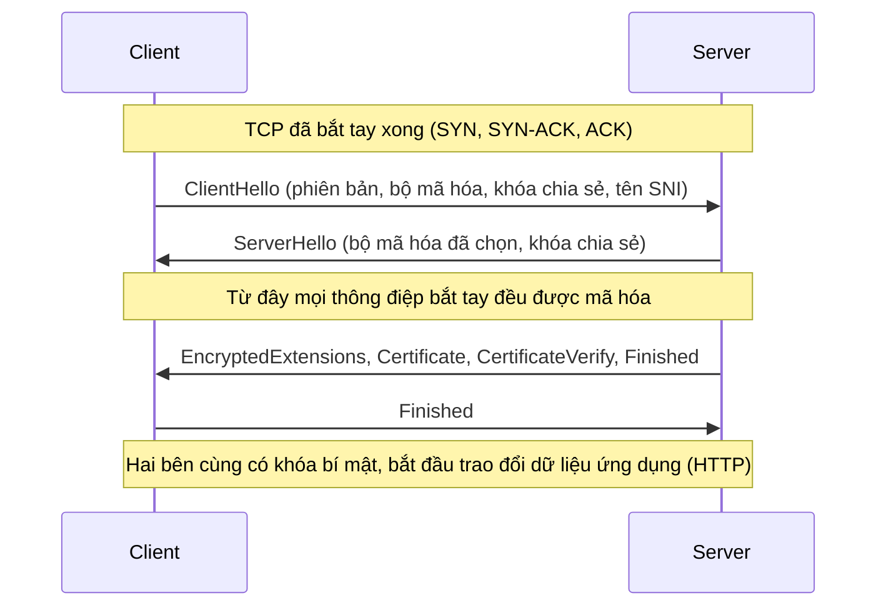
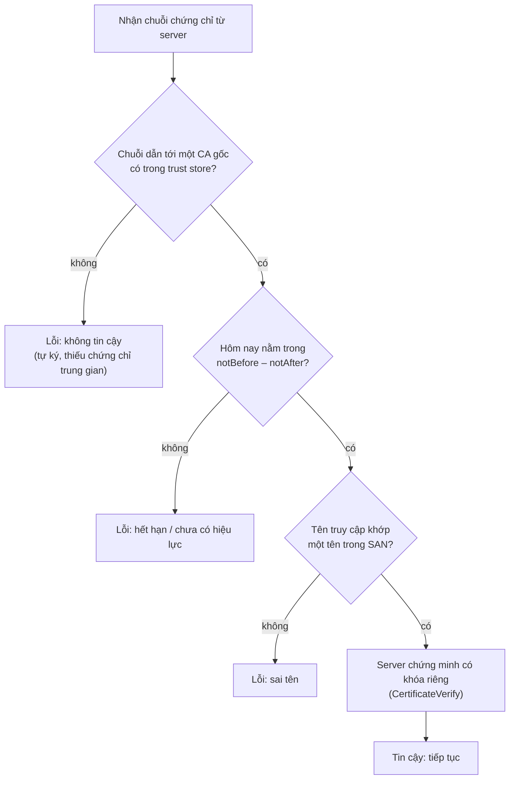

---
tags:
  - Must
  - TLS
  - Concept
  - Troubleshooting
---

# Làm sao biết mình đang nói chuyện đúng server và không ai nghe lén? (TLS và chứng chỉ)

## Metadata

```yaml
Chapter: tls-certificates
Phase: 04 — transport-app
Importance: Must
Status: draft
Prerequisites:
  - Phase 03 / 02-dns-resolution
  - Phase 04 / 05-http
Used Later:
  - Phase 05 / 04-vpn-ipsec-site-to-site
  - Phase 05 / 05-bastion-and-session-access
Estimated Reading: 40 phút
Estimated Practice: 50 phút
```

## 1. Story

<!-- Mức bắt buộc (Must): Đủ -->
<!-- DRAFT: người học cần viết lại bằng lời mình -->

Sáng thứ Bảy lúc 02:00, chứng chỉ của `www.shopnet.example` hết hạn. Từ giây đó, mọi khách hàng mở trang đều thấy cảnh báo đỏ "kết nối của bạn không riêng tư", và ứng dụng di động báo lỗi kết nối. Các lệnh `curl` gọi API nội bộ thoát với mã **60**. Máy chủ vẫn chạy tốt, mạng vẫn thông, DNS vẫn đúng, chỉ có **một ngày tháng trong một tệp** đã hết hạn. Không ai đặt cảnh báo trước hạn.

Một lần khác, chứng chỉ còn hạn nhưng trình duyệt vẫn chặn vì tên trong chứng chỉ không khớp tên người dùng gõ. Chapter này giải thích TLS bảo vệ điều gì, chứng chỉ chứng minh điều gì, client kiểm tra những gì, và vì sao mỗi kiểm tra có thể thất bại theo một cách riêng.

## 2. Objectives

<!-- Mức bắt buộc (Must): Đủ -->
<!-- DRAFT: người học cần viết lại bằng lời mình -->

Sau chapter này bạn có thể:

- Giải thích TLS cung cấp ba thứ gì (bảo mật nội dung, toàn vẹn, xác thực) và HTTPS là gì.
- Mô tả bắt tay TLS 1.3 ở mức các thông điệp chính và vị trí của nó so với bắt tay TCP.
- Liệt kê các bước client kiểm tra chứng chỉ và nhận ra lỗi nào ứng với bước nào (hết hạn, sai tên, không tin cậy).
- Giải thích SNI và vì sao một địa chỉ IP phục vụ được nhiều chứng chỉ.
- Dùng `openssl s_client`, `openssl x509`, `curl` để xem và kiểm tra chứng chỉ, và đặt cảnh báo trước hạn.
- Giải thích vị trí "kết thúc TLS" (termination) ở load balancer và hệ quả với lưu lượng phía sau.

## 3. Prerequisites

<!-- Mức bắt buộc (Must): Đủ -->
<!-- DRAFT: người học cần viết lại bằng lời mình -->

> Xem lại: [dns-resolution](../phase-03-core-services/02-dns-resolution.md)
> Xem lại: [http](05-http.md)

Bạn cần nhớ: tên được phân giải thành IP trước (`03/02`), HTTP chạy trên TCP (`04/05`, `04/01`), và `curl` thoát mã 35/60 khi lỗi TLS/chứng chỉ.

## 4. Why it exists

<!-- Mức bắt buộc (Must): Đủ -->
<!-- DRAFT: người học cần viết lại bằng lời mình -->

HTTP thuần gửi mọi thứ dưới dạng văn bản. Trên đường đi, bất kỳ thiết bị nào cũng có thể **đọc** (mật khẩu, token), **sửa** (chèn nội dung) hoặc **giả danh** server. **TLS (Transport Layer Security)** thêm một lớp bảo vệ ngay trên TCP để giải quyết ba việc (theo RFC 8446): **xác thực** (phía server luôn được xác thực), **bảo mật nội dung** (không ai nghe lén được), và **toàn vẹn** (không ai sửa được mà không bị phát hiện). **HTTPS** là HTTP chạy trên TLS.

Phần "xác thực" là lý do cần **chứng chỉ**: mã hóa mà không biết đầu kia là ai thì chỉ là nói bí mật với kẻ lạ. Chứng chỉ do một bên đáng tin (CA) ký, xác nhận "khóa công khai này thuộc về tên miền này".

Nếu thiếu hoặc sai:

- Không có TLS: nội dung lộ và có thể bị sửa.
- Chứng chỉ hết hạn, sai tên hoặc không tin cậy: client từ chối kết nối (Story), hoặc tệ hơn người dùng bị dạy cách nhấn "vẫn tiếp tục" và bỏ qua cảnh báo.

## 5. Mental model

<!-- Mức bắt buộc (Must): Đủ -->
<!-- DRAFT: người học cần viết lại bằng lời mình -->

Hình dung bạn cần gửi hồ sơ mật cho một công ty. Trước hết bạn kiểm tra **giấy phép kinh doanh** của họ: do cơ quan nhà nước cấp (CA), ghi đúng tên công ty (tên miền), còn hạn, và bạn tin cơ quan cấp. Sau khi chắc chắn, hai bên thống nhất một **mã khóa chung** chỉ hai bên biết để niêm phong mọi tài liệu gửi qua lại. Ai chặn giữa đường cũng chỉ thấy phong bì đã niêm phong.

**Tóm tắt một câu:** TLS dùng chứng chỉ để chứng minh danh tính server rồi cùng thống nhất khóa bí mật để mã hóa mọi dữ liệu sau đó.

## 6. How it works

<!-- Mức bắt buộc (Must): Đủ -->
<!-- DRAFT: người học cần viết lại bằng lời mình -->

Các từ cần biết:

- **TLS (bảo mật tầng vận chuyển — giao thức thêm mã hóa, xác thực và toàn vẹn lên trên một kết nối TCP).**
- **HTTPS (HTTP trên TLS — HTTP được mã hóa, thường dùng cổng 443).**
- **Public key / Private key (khóa công khai / khóa riêng — cặp khóa đi cùng nhau: khóa công khai ai cũng biết và nằm trong chứng chỉ; khóa riêng chỉ chủ sở hữu giữ bí mật và dùng để chứng minh mình là chủ).**
- **Certificate (chứng chỉ — tệp ghi tên chủ sở hữu, khóa công khai, thời hạn và chữ ký của bên cấp).**
- **CA / Certificate Authority (tổ chức cấp chứng chỉ — bên đáng tin ký xác nhận chứng chỉ).**
- **Certificate chain (chuỗi chứng chỉ — dãy chứng chỉ từ chứng chỉ của server đi lên qua các CA trung gian tới CA gốc).**
- **Trust store (kho tin cậy — danh sách CA gốc mà hệ điều hành hoặc trình duyệt tin sẵn).**
- **SAN / Subject Alternative Name (tên thay thế của chủ thể — danh sách các tên miền mà chứng chỉ có hiệu lực).**
- **SNI / Server Name Indication (chỉ dẫn tên máy chủ — client nói tên miền muốn truy cập ngay trong ClientHello).**
- **Self-signed certificate (chứng chỉ tự ký — chứng chỉ do chính chủ ký, không có CA đáng tin xác nhận).**
- **TLS termination (kết thúc TLS — thiết bị, thường là load balancer, giải mã TLS ở đó).**

**Bắt tay TLS 1.3** (RFC 8446) chạy **sau** bắt tay TCP:



**Đọc sơ đồ:** client đưa ra những gì nó hỗ trợ cùng một "mảnh khóa" và tên miền muốn truy cập (SNI). Server chọn thông số và gửi mảnh khóa của nó; từ ServerHello trở đi hai bên đã có thể tính cùng một khóa bí mật nên **phần còn lại của bắt tay được mã hóa**. Server gửi chứng chỉ và `CertificateVerify` (chứng minh nó giữ khóa riêng tương ứng) và `Finished`; client trả `Finished`. Tổng cộng chỉ một vòng đi–về (1-RTT) trước khi gửi dữ liệu. Sau đó mọi yêu cầu HTTP đi trong kênh đã mã hóa. TLS 1.3 so với TLS 1.2: bỏ các thuật toán lỗi thời và bắt buộc tính bí mật chuyển tiếp (forward secrecy).

**Client kiểm tra chứng chỉ thế nào?** Tách thành các bước độc lập, mỗi bước có kiểu lỗi riêng:



**Đọc sơ đồ:** (1) **chuỗi tin cậy**: chứng chỉ của server phải ký bởi một CA trung gian, và chuỗi đi lên tới một CA gốc có trong trust store của client (RFC 5280 gọi là "certification path"); thiếu một chứng chỉ trung gian hoặc là chứng chỉ tự ký thì bước này thất bại. (2) **thời hạn**: ngày hiện tại phải nằm giữa `notBefore` và `notAfter` (Story). (3) **tên**: tên người dùng truy cập phải khớp một mục `dNSName` trong **SAN**; theo RFC 9525 client phải dựa vào SAN và **không** dùng trường Common Name. (4) server phải chứng minh nó giữ khóa riêng. Chỉ khi qua cả bốn thì kết nối mới được coi là an toàn. Chứng chỉ bị thu hồi được công bố qua danh sách thu hồi (CRL, RFC 5280) nhưng việc kiểm tra thu hồi phụ thuộc client.

**Wildcard.** Chứng chỉ `*.shopnet.example` chỉ phủ **một cấp** tên con (`www.shopnet.example`, `api.shopnet.example`) chứ không phủ `a.b.shopnet.example` và cũng **không phủ tên gốc** `shopnet.example` (theo RFC 9525 và tài liệu của AWS).

**SNI.** Một server thường phục vụ nhiều tên miền trên cùng một địa chỉ IP và cổng, nhưng phải chọn chứng chỉ **trước khi** thấy yêu cầu HTTP (header `Host` ở `04/05` nằm bên trong kênh mã hóa nên chưa đọc được). SNI giải quyết điều đó: client nêu tên miền ngay trong ClientHello (RFC 6066) để server chọn đúng chứng chỉ. SNI **không** được mã hóa trong cách dùng thông thường, nên người nghe giữa đường vẫn thấy tên miền bạn truy cập.

**Kết thúc TLS ở load balancer.** Thường client nói TLS với load balancer, load balancer giải mã rồi chuyển yêu cầu tới ứng dụng. Có hai cách cho đoạn sau: gửi HTTP thuần (đơn giản nhưng đoạn trong mạng không mã hóa) hoặc mã hóa lại bằng TLS tới ứng dụng (an toàn hơn, nhưng ứng dụng cũng cần chứng chỉ, và một lỗi bắt tay ở đoạn này cũng tạo ra lỗi 5xx).

> Mã hóa trong VPN ở `05/04`; truy cập quản trị bằng phiên bảo mật ở `05/05`; load balancer ở `04/07`.

<!-- verified: 2026-10-05 https://www.rfc-editor.org/rfc/rfc8446 -->
<!-- verified: 2026-10-05 https://www.rfc-editor.org/rfc/rfc5280 -->
<!-- verified: 2026-10-05 https://www.rfc-editor.org/rfc/rfc9525 -->
<!-- verified: 2026-10-05 https://www.rfc-editor.org/rfc/rfc6066 -->

## 7. Key settings

<!-- Mức bắt buộc (Must): Đủ -->
<!-- DRAFT: người học cần viết lại bằng lời mình -->

**Cần kiểm tra trong một chứng chỉ:** Subject, Issuer, `notBefore`/`notAfter`, SAN, chuỗi chứng chỉ có đủ cấp trung gian không.

**Công cụ** (theo tài liệu OpenSSL):

| Việc | Lệnh |
|---|---|
| Xem kết nối TLS tới một server (kèm SNI) | `openssl s_client -connect <host>:443 -servername <host> -brief` |
| Xem toàn bộ chuỗi server gửi | thêm `-showcerts` |
| Đọc thông tin từ chứng chỉ | `openssl x509 -noout -subject -issuer -dates` |
| Xem SAN | `openssl x509 -noout -ext subjectAltName` |
| Còn hạn thêm ít nhất N giây không (thoát 0 nếu còn) | `openssl x509 -noout -checkend <giây>` |
| Quan sát qua `curl` | `curl -v https://<host>/` |

Ví dụ lấy thông tin chứng chỉ từ một server đang chạy:

```bash
openssl s_client -connect example.com:443 -servername example.com </dev/null 2>/dev/null | openssl x509 -noout -subject -issuer -dates
```

**Giám sát hạn:** không chờ khách báo lỗi. Có công cụ/kịch bản kiểm tra số ngày còn lại (ví dụ `-checkend`) và cảnh báo sớm; tự động gia hạn khi có thể.

**Không** dùng `curl -k` (bỏ qua mọi kiểm tra chứng chỉ) trong môi trường thật; đó là tắt hẳn lớp xác thực.

<!-- verified: 2026-10-05 https://docs.openssl.org/master/man1/openssl-s_client/ -->
<!-- verified: 2026-10-05 https://docs.openssl.org/master/man1/openssl-x509/ -->

## 8. AWS mapping

<!-- Mức bắt buộc (Must): Đủ nếu có liên quan AWS -->
<!-- DRAFT: người học cần viết lại bằng lời mình -->

<!-- verified: 2026-10-05 https://docs.aws.amazon.com/elasticloadbalancing/latest/application/https-listener-certificates.html -->
<!-- verified: 2026-10-05 https://docs.aws.amazon.com/acm/latest/userguide/acm-renewal.html -->
<!-- verified: 2026-10-05 https://docs.aws.amazon.com/elasticloadbalancing/latest/application/load-balancer-troubleshooting.html -->

| Khái niệm | Trên AWS |
|---|---|
| Cấp và quản lý chứng chỉ | AWS Certificate Manager (ACM) |
| Kết thúc TLS | HTTPS listener của Application Load Balancer, cần **ít nhất một chứng chỉ** (chứng chỉ mặc định) |
| Nhiều tên miền trên một cổng | Danh sách chứng chỉ bổ sung + SNI |
| Gia hạn | ACM tự gia hạn chứng chỉ do Amazon cấp (nếu dùng DNS validation) hoặc gửi cảnh báo |

Theo tài liệu AWS:

- Tên miền trong chứng chỉ **phải khớp** tên host mà client yêu cầu, nếu không client không xác thực được và kết nối thất bại; load balancer không phục vụ lưu lượng không mã hóa trên listener HTTPS.
- Tên đầy đủ (FQDN) hoặc tên gốc (`example.com`) đều dùng được; wildcard `*` chỉ ở **vị trí trái cùng**, chỉ phủ **một cấp** tên con và **không phủ tên gốc**.
- **Chứng chỉ mặc định** chỉ được dùng nếu client không gửi SNI hoặc không chứng chỉ nào trong danh sách khớp tên. Nếu có chứng chỉ khớp nhưng không tương thích với client, bắt tay **thất bại** và **không** quay lại chứng chỉ mặc định.
- Không dùng được tên DNS mặc định của load balancer cho HTTPS vì không xin được chứng chỉ công khai cho miền `*.amazonaws.com`; lỗi tương ứng là `NET::ERR_CERT_COMMON_NAME_INVALID`.
- Chứng chỉ ACM ở trạng thái `Pending Validation` (chưa xác thực quyền sở hữu miền) thì chưa dùng được.
- Chứng chỉ do ACM cấp và gắn với dịch vụ khác (như load balancer) **đủ điều kiện gia hạn tự động**; chứng chỉ **nhập vào (import)** **không** được ACM gia hạn: bạn phải tự theo dõi hạn và thay thế. ACM gia hạn xong thì ARN giữ nguyên. Chứng chỉ ACM là tài nguyên **theo từng Region**, mỗi Region gia hạn độc lập.
- Gia hạn hoặc thay chứng chỉ không ảnh hưởng yêu cầu đang xử lý; yêu cầu mới dùng chứng chỉ mới.
- Lỗi bắt tay TLS từ load balancer tới target (nếu mã hóa lại) là một nguyên nhân của mã `502`; bắt tay quá 10 giây là một nguyên nhân của `504` (xem `04/05` mục 8).

Chi tiết cấu hình ở `04/07`, `06/08`. Tài liệu AWS có thể thay đổi; kiểm tra lại trước khi dựa vào chi tiết.

## 9. Hands-on lab

<!-- Mức bắt buộc (Must): Đủ + expected-output.txt -->
<!-- DRAFT: người học cần viết lại bằng lời mình -->

Chi tiết ở `labs/phase-04-transport-app/chapter-06-tls-certificates/README.md`. Chạy trong WSL2/Linux (cần `openssl` và `curl`).

**1. Predict:** với `example.com`: phiên bản TLS nào được dùng? Ai ký (Issuer)? Hết hạn khi nào và còn khoảng bao nhiêu ngày? SAN có những tên nào?

**2. Run:**

```bash
openssl s_client -connect example.com:443 -servername example.com -brief </dev/null
```

```bash
openssl s_client -connect example.com:443 -servername example.com </dev/null 2>/dev/null | openssl x509 -noout -subject -issuer -dates
```

```bash
openssl s_client -connect example.com:443 -servername example.com </dev/null 2>/dev/null | openssl x509 -noout -ext subjectAltName
```

```bash
curl -sv -o /dev/null https://example.com 2>&1 | grep -iE "TLS|SSL|subject|issuer|expire|start date"
```

**3. Verify:** ghi lại phiên bản TLS, Issuer, ngày hết hạn, số ngày còn lại, SAN. Output thật: `[CHƯA CHẠY]`.

## 10. Break it

<!-- Mức bắt buộc (Must): Đủ (≥ 1 Break it) -->
<!-- DRAFT: người học cần viết lại bằng lời mình -->

**Gây ba kiểu lỗi chứng chỉ trên máy bạn, không cần Internet.** Tạo chứng chỉ tự ký cho tên giả `www.shopnet.example`, chạy server TLS thử, rồi kết nối theo nhiều cách:

```bash
cd "$(mktemp -d)"
openssl req -x509 -newkey rsa:2048 -nodes -keyout k.pem -out c.pem -days 1 -subj "/CN=www.shopnet.example" -addext "subjectAltName=DNS:www.shopnet.example"
openssl s_server -accept 8443 -cert c.pem -key k.pem -www >/dev/null 2>&1 &
SPID=$!
sleep 1
curl -sS -o /dev/null https://127.0.0.1:8443/; echo "A: mã thoát $?"
curl -sS -o /dev/null --cacert c.pem --resolve www.shopnet.example:8443:127.0.0.1 https://www.shopnet.example:8443/; echo "B: mã thoát $?"
curl -sS -o /dev/null --cacert c.pem https://127.0.0.1:8443/; echo "C: mã thoát $?"
curl -sS -o /dev/null -k https://127.0.0.1:8443/; echo "D: mã thoát $?"
openssl x509 -in c.pem -noout -checkend 172800; echo "E (còn hạn thêm 2 ngày không): mã thoát $?"
kill "$SPID"
```

**Dự đoán:**

- **A** (không tin chứng chỉ tự ký, lại truy cập bằng IP): thất bại, mã thoát **60**.
- **B** (tin chứng chỉ này qua `--cacert` và truy cập đúng tên): **thành công**, mã thoát 0.
- **C** (tin chứng chỉ nhưng truy cập bằng IP, không có trong SAN): thất bại, mã thoát **60** vì **sai tên**, dù đã tin chứng chỉ.
- **D** (`-k` bỏ qua kiểm tra): thành công, nhưng đã **tắt mọi xác thực** (nguy hiểm trong thực tế).
- **E**: chứng chỉ chỉ có hạn 1 ngày, nên "còn hạn thêm 2 ngày" là **không** (mã thoát khác 0).

**Ý nghĩa:** A và C cùng mã 60 nhưng khác bước kiểm tra (không tin cậy so với sai tên); thông báo lỗi của `curl` phân biệt được. D cho thấy vì sao không bao giờ dùng `-k` ngoài lab. E là nền tảng của việc giám sát hạn.

**Khôi phục:** tệp nằm trong thư mục tạm, server đã dừng bằng `kill`. Xóa thư mục tạm khi xong; **không commit `k.pem`/`c.pem`** vào repo (`.gitignore` đã loại `*.pem`, `*.key`).

Kết quả thật: `[CHƯA CHẠY]`.

## 11. Troubleshooting

<!-- Mức bắt buộc (Must): Đủ -->
<!-- DRAFT: người học cần viết lại bằng lời mình -->

Triệu chứng chính: **lỗi chứng chỉ / `curl` thoát 35 hoặc 60**. Xác định bước kiểm tra nào thất bại.

| Thông báo (rút gọn) | Bước nào thất bại | Kiểm tra | Công cụ |
|---|---|---|---|
| Chứng chỉ hết hạn / `expired` | Thời hạn | `notAfter` còn không; đồng hồ máy client đúng không (xem `03/05`) | `openssl x509 -noout -dates`, `date` |
| Tên không khớp / `no alternative certificate subject name matches` | Tên | Tên truy cập có trong SAN không; đang dùng IP hay tên khác? | `openssl x509 -noout -ext subjectAltName` |
| Tự ký / `unable to get local issuer certificate` / `unknown CA` | Chuỗi tin cậy | CA gốc có trong trust store không; server có gửi đủ chứng chỉ trung gian không | `openssl s_client -showcerts` |
| Handshake lỗi / `curl` thoát 35 | Bắt tay | Phiên bản TLS/bộ mã hóa hai bên có chung không; port có nói TLS không | `openssl s_client -brief` |
| Chứng chỉ sai (của miền khác) | SNI | Client có gửi SNI không; chứng chỉ mặc định bị trả về | `openssl s_client -servername ...` so sánh có/không |
| Chạy trên trình duyệt này nhưng lỗi ở công cụ khác | Trust store khác nhau | Trust store của từng công cụ/hệ điều hành | So sánh `curl`, trình duyệt |

| Triệu chứng khác | Giả thuyết đầu tiên |
|---|---|
| Lỗi chứng chỉ ngay sau khi gia hạn | Server/LB chưa nạp chứng chỉ mới, hoặc thiếu chứng chỉ trung gian |
| Chỉ một số client lỗi | Trust store cũ, hoặc client quá cũ không hỗ trợ TLS hiện đại |
| 502 từ load balancer sau khi bật mã hóa lại tới target | Bắt tay TLS tới target thất bại (xem `04/05` mục 8) |

Ghi kết quả thật của mục 10: `[CHƯA CHẠY]`.

## 12. Security & cost

<!-- Mức bắt buộc (Must): Đủ -->
<!-- DRAFT: người học cần viết lại bằng lời mình -->

- **Khóa riêng là bí mật tuyệt đối:** ai có khóa riêng có thể giả danh server. Không commit, không gửi qua chat/email, giới hạn quyền đọc, thay chứng chỉ nếu nghi lộ. (Repo này loại `*.pem`, `*.key` khỏi Git.)
- **Không tắt xác thực để "cho chạy":** `curl -k`, `verify=False`, cấu hình "tin mọi chứng chỉ" biến TLS thành mã hóa với kẻ lạ. Chỉ dùng trong lab.
- **Giám sát hạn chứng chỉ** là việc vận hành bắt buộc; chứng chỉ **nhập vào (import)** vào ACM không tự gia hạn.
- **Kết thúc TLS ở load balancer:** đoạn phía sau là HTTP thuần nếu không mã hóa lại; cân nhắc theo mức nhạy cảm của dữ liệu.
- **SNI và địa chỉ vẫn lộ** với người nghe giữa đường (họ thấy tên miền và IP, không thấy nội dung).
- **Chuẩn cũ:** tắt các phiên bản TLS và bộ mã hóa lỗi thời theo khuyến nghị hiện hành `[CHƯA KIỂM CHỨNG]` (kiểm tra chính sách bảo mật của nền tảng bạn dùng).
- **Chi phí:** local nên không phát sinh. Trên AWS, kiểm tra trang giá chính thức của ACM, load balancer và các dịch vụ liên quan; không ghi số trong sách.

## 13. Misconceptions

<!-- Mức bắt buộc (Must): Đủ -->
<!-- DRAFT: người học cần viết lại bằng lời mình -->

| Hiểu nhầm | Sự thật |
|---|---|
| "Có HTTPS nghĩa là website an toàn/đáng tin" | HTTPS chỉ bảo đảm kênh mã hóa và danh tính tên miền; nội dung site vẫn có thể độc hại |
| "Chứng chỉ tự ký không mã hóa" | Vẫn mã hóa, nhưng không có bên đáng tin xác nhận danh tính nên client không biết đầu kia là ai |
| "Chỉ cần chứng chỉ còn hạn là được" | Còn phải khớp tên (SAN) và chuỗi dẫn tới CA tin cậy |
| "Tên trong Common Name là tên được kiểm tra" | Client hiện đại dựa vào SAN, không dùng Common Name |
| "`*.example.com` phủ cả `example.com` và `a.b.example.com`" | Chỉ phủ đúng một cấp tên con, không phủ tên gốc |
| "TLS giấu việc tôi đang truy cập trang nào" | Người nghe vẫn thấy IP và thường cả tên miền (SNI); chỉ nội dung được mã hóa |
| "Mã hóa tới load balancer là mã hóa đến ứng dụng" | Nếu TLS kết thúc ở load balancer, đoạn sau có thể là HTTP thuần |
| "ACM gia hạn mọi chứng chỉ" | Không với chứng chỉ import; cần theo dõi hạn tự |

## 14. Interview questions

<!-- Mức bắt buộc (Must): Đủ -->
<!-- DRAFT: người học cần viết lại bằng lời mình -->

### Q1 (Junior) — TLS bảo vệ những gì?

**Gợi ý ý chính:**
- Ba tính chất bảo mật là gì?
- Phần "xác thực" cần cái gì?

??? success "Đáp án mẫu (tự trả lời trước khi mở)"
    Bảo mật nội dung (không ai nghe lén), toàn vẹn (không ai sửa mà không bị phát hiện) và xác thực (client biết server là ai, nhờ chứng chỉ).

### Q2 (Junior) — Client kiểm tra những gì khi nhận chứng chỉ của server?

**Gợi ý ý chính:**
- Chuỗi tin cậy, thời hạn, tên, và gì nữa?
- Tên được so với trường nào?

??? success "Đáp án mẫu (tự trả lời trước khi mở)"
    Chuỗi chứng chỉ dẫn tới CA gốc trong trust store; ngày hiện tại nằm trong thời hạn; tên truy cập khớp một tên trong SAN; và server chứng minh giữ khóa riêng. Thất bại ở bất kỳ bước nào làm kết nối bị từ chối.

### Q3 (Middle) — SNI là gì và vì sao cần?

**Gợi ý ý chính:**
- Server cần chọn chứng chỉ vào lúc nào?
- Header `Host` có dùng được ở lúc đó không?

??? success "Đáp án mẫu (tự trả lời trước khi mở)"
    Một server/IP có thể phục vụ nhiều tên miền với nhiều chứng chỉ và phải chọn chứng chỉ trước khi đọc được yêu cầu HTTP (vì nó đã mã hóa). SNI cho client nêu tên miền ngay trong ClientHello để server chọn đúng chứng chỉ.

### Q4 (Middle) — `curl` thoát mã 60. Bạn chẩn đoán thế nào?

**Gợi ý ý chính:**
- Có những bước kiểm tra nào có thể thất bại?
- Thông báo lỗi nói gì?

??? success "Đáp án mẫu (tự trả lời trước khi mở)"
    Đọc thông báo chi tiết (`curl -v`) để biết bước nào: hết hạn, sai tên (SAN), hay không tin cậy (CA lạ/thiếu chứng chỉ trung gian). Dùng `openssl s_client -showcerts` và `openssl x509 -noout -dates -ext subjectAltName` để kiểm chứng; không dùng `-k` để "sửa".

### Q5 (Middle) — Bạn nên đặt cảnh báo nào để tránh sự cố hết hạn chứng chỉ?

**Gợi ý ý chính:**
- Đo gì và cảnh báo ở mức nào?
- Chứng chỉ nào không tự gia hạn?

??? success "Đáp án mẫu (tự trả lời trước khi mở)"
    Giám sát số ngày còn lại của chứng chỉ trên từng endpoint (ví dụ kiểm tra bằng `openssl x509 -checkend`) và cảnh báo sớm; tự động gia hạn khi nền tảng cho phép (ACM với chứng chỉ do Amazon cấp), và chú ý riêng các chứng chỉ import vì chúng không được tự gia hạn.

## 15. Exercises

<!-- Mức bắt buộc (Must): Đủ -->
<!-- DRAFT: người học cần viết lại bằng lời mình -->

1. **Đọc một chứng chỉ thật.** Chạy các lệnh ở mục 9 với `example.com`. *Deliverable:* bảng gồm Subject, Issuer, `notBefore`, `notAfter`, số ngày còn lại, SAN, phiên bản TLS (đã bỏ thông tin riêng tư nếu có).
2. **Phân tích Break it.** *Deliverable:* bảng 4 dòng (A, B, C, D): kết quả, bước kiểm tra nào thất bại/qua, và vì sao A và C cùng mã 60.
3. **Kế hoạch giám sát hạn.** *Deliverable:* mô tả (hoặc kịch bản) kiểm tra hạn cho 3 endpoint và ngưỡng cảnh báo, kèm cách xử lý riêng cho chứng chỉ import.
4. **Thiết kế chứng chỉ cho `shopnet`.** Cần phục vụ `shopnet.example`, `www.shopnet.example`, `api.shopnet.example`. *Deliverable:* đề xuất chứng chỉ (một hay nhiều, có wildcard không, SAN gồm gì) và giải thích vì sao wildcard một mình không đủ.

## 16. Cheat sheet

<!-- Mức bắt buộc (Must): Đủ -->
<!-- DRAFT: người học cần viết lại bằng lời mình -->

| Mục | Nội dung |
|---|---|
| TLS cho | Mã hóa, toàn vẹn, xác thực |
| Bắt tay TLS 1.3 | ClientHello → ServerHello → (mã hóa) Certificate/Finished → Finished; 1-RTT |
| Client kiểm tra | Chuỗi → CA gốc tin cậy; thời hạn; tên trong SAN; server giữ khóa riêng |
| Wildcard | `*.x.y` chỉ một cấp, không phủ `x.y` |
| SNI | Client nêu tên miền trong ClientHello |
| Lệnh | `openssl s_client -connect H:443 -servername H -brief`; `openssl x509 -noout -subject -issuer -dates`; `-ext subjectAltName`; `-checkend N` |
| `curl` thoát | 35 lỗi TLS, 60 chứng chỉ không hợp lệ |
| Không bao giờ | `curl -k` ngoài lab; commit khóa riêng |
| ACM | Tự gia hạn chứng chỉ ACM đã gắn dịch vụ; import thì không |

**Debug:** thông báo cụ thể → bước nào (chuỗi/thời hạn/tên) → `openssl` kiểm chứng → sửa.

## 17. Glossary terms

<!-- Mức bắt buộc (Must): Đủ -->
<!-- DRAFT: người học cần viết lại bằng lời mình -->

- TLS / bảo mật tầng vận chuyển / TLS
- HTTPS / HTTP trên TLS / HTTPS
- Public key / khóa công khai / 公開鍵
- Private key / khóa riêng / 秘密鍵
- Certificate / chứng chỉ / 証明書
- CA / tổ chức cấp chứng chỉ / 認証局
- Certificate chain / chuỗi chứng chỉ / 証明書チェーン
- Trust store / kho tin cậy / トラストストア
- SAN / tên thay thế của chủ thể / サブジェクト代替名
- SNI / chỉ dẫn tên máy chủ / SNI
- Self-signed certificate / chứng chỉ tự ký / 自己署名証明書
- TLS termination / kết thúc TLS / TLS終端

## 18. Further reading

<!-- Mức bắt buộc (Must): Đủ -->
<!-- DRAFT: người học cần viết lại bằng lời mình -->

Kiểm tra ngày 2026-10-05:

- RFC 8446 — TLS 1.3: https://www.rfc-editor.org/rfc/rfc8446
- RFC 5280 — X.509 PKI Certificate and CRL Profile: https://www.rfc-editor.org/rfc/rfc5280
- RFC 9525 — Service Identity in TLS: https://www.rfc-editor.org/rfc/rfc9525
- RFC 6066 — TLS Extensions (SNI): https://www.rfc-editor.org/rfc/rfc6066
- OpenSSL `s_client`: https://docs.openssl.org/master/man1/openssl-s_client/
- OpenSSL `x509`: https://docs.openssl.org/master/man1/openssl-x509/
- OpenSSL `req`: https://docs.openssl.org/master/man1/openssl-req/
- ALB — SSL certificates: https://docs.aws.amazon.com/elasticloadbalancing/latest/application/https-listener-certificates.html
- ACM — Managed renewal: https://docs.aws.amazon.com/acm/latest/userguide/acm-renewal.html
