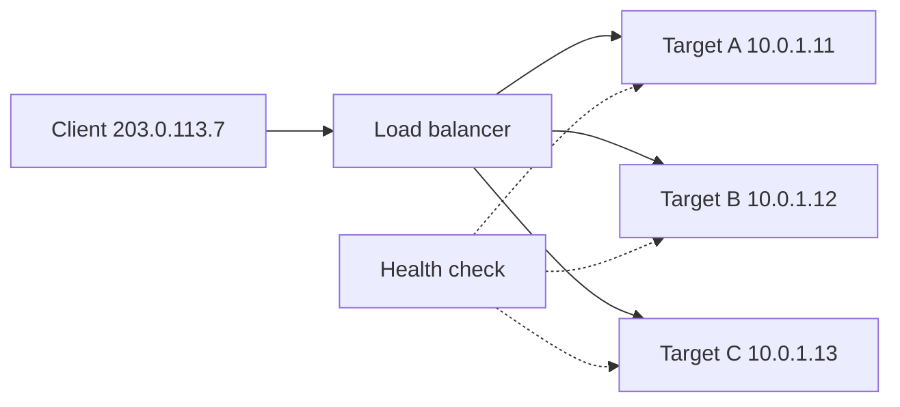

---
tags:
  - Must
  - LoadBalancer
  - L4
  - L7
  - Troubleshooting
---

# Load balancer L4 và L7 khác nhau thế nào, và vì sao server không còn thấy IP thật của client?

## Metadata

```yaml
Chapter: load-balancing-l4-vs-l7
Phase: 04 — transport-app
Importance: Must
Status: draft
Prerequisites:
  - Phase 02 / 05-nat-pat
  - Phase 04 / 04-ports-sockets
  - Phase 04 / 05-http
Used Later:
  - Phase 04 / 08-reverse-proxy
  - Phase 06 / 08-elb-alb-nlb-gwlb
Estimated Reading: 40 phút
Estimated Practice: 40 phút
```

## 1. Story

<!-- Mức bắt buộc (Must): Đủ -->
<!-- DRAFT: người học cần viết lại bằng lời mình -->

Đội `shopnet` đặt một load balancer trước ba server web. Sau khi đưa vào chạy, hai chuyện xảy ra cùng tuần. Thứ nhất, nhật ký truy cập của ứng dụng chỉ toàn một địa chỉ IP duy nhất: đội bảo mật hỏi "ai đang gọi chúng ta?" mà không ai trả lời được. Thứ hai, một server bị treo nhưng người dùng vẫn thỉnh thoảng nhận lỗi 502/504: load balancer vẫn gửi yêu cầu tới server chết trong một lúc.

Hai chuyện này có chung gốc: load balancer là một **thiết bị ở giữa**, nó đứng giữa client và server, nhìn thấy gói tin hoặc yêu cầu theo cách riêng của nó. Hiểu **nó làm việc ở tầng nào** (tầng vận chuyển L4 hay tầng ứng dụng L7) quyết định nó thấy gì, giữ IP client ra sao, kiểm tra sức khỏe thế nào và lỗi gì có thể xuất hiện.

## 2. Objectives

<!-- Mức bắt buộc (Must): Đủ -->
<!-- DRAFT: người học cần viết lại bằng lời mình -->

Sau chapter này bạn có thể:

- Giải thích load balancer làm gì và vì sao cần health check.
- So sánh L4 (theo kết nối) với L7 (theo yêu cầu HTTP) về những gì nhìn thấy và có thể quyết định.
- Giải thích vì sao server thấy IP của load balancer và cách lấy IP client (X-Forwarded-For, preserve client IP, proxy protocol).
- Chọn ALB hay NLB cho một tình huống và nêu lý do.
- Chẩn đoán sự cố phổ biến: chỉ một IP trong log, health check fail, 502/503/504, kết nối đứt sau rảnh.

## 3. Prerequisites

<!-- Mức bắt buộc (Must): Đủ -->
<!-- DRAFT: người học cần viết lại bằng lời mình -->

> Xem lại: [nat-pat](../phase-02-routing/05-nat-pat.md), [ports-sockets](04-ports-sockets.md), [http](05-http.md)

Cần nhớ: NAT thay đổi địa chỉ nguồn/đích (`02/05`); bộ năm và socket (`04/04`); cấu trúc yêu cầu HTTP, header, mã trạng thái 5xx (`04/05`); TLS (`04/06`).

## 4. Why it exists

<!-- Mức bắt buộc (Must): Đủ -->
<!-- DRAFT: người học cần viết lại bằng lời mình -->

Một server không đủ: nó có thể quá tải, hỏng, hoặc cần cập nhật. **Load balancer (bộ cân bằng tải — thiết bị/dịch vụ nhận kết nối hoặc yêu cầu từ client và chia cho nhiều server phía sau)** giải quyết ba vấn đề:

1. **Mở rộng:** chia tải cho nhiều server thay vì mua một server khổng lồ.
2. **Sẵn sàng cao:** loại server hỏng khỏi vòng chia (nhờ health check) để người dùng không thấy lỗi.
3. **Một điểm vào duy nhất:** client chỉ biết một địa chỉ; bên sau thêm/bớt server tự do, kết thúc TLS tập trung.

Nếu không hiểu tầng làm việc: kỳ vọng sai về những gì LB có thể làm (L4 không định tuyến theo đường dẫn URL), mất IP thật của client, health check sai làm đưa server hỏng vào vòng, hoặc đặt sai loại cho giao thức (dùng L7 cho giao thức không phải HTTP).

## 5. Mental model

<!-- Mức bắt buộc (Must): Đủ -->
<!-- DRAFT: người học cần viết lại bằng lời mình -->

Hình dung **quầy lễ tân của một tòa nhà văn phòng**. Loại **L4** giống lễ tân chỉ nhìn **số phòng** (địa chỉ và cổng) rồi cho khách đi vào một phòng trống, **không mở phong bì** khách mang theo. Loại **L7** giống lễ tân **mở thư ra đọc** (đường dẫn, tiêu đề, cookie) rồi mới quyết định giao cho đúng phòng chuyên trách. Lễ tân L7 thông minh hơn nhưng tốn công hơn và phải hiểu ngôn ngữ của thư.

**Tóm tắt một câu:** L4 chia **kết nối** theo địa chỉ/cổng mà không đọc nội dung; L7 chia **yêu cầu** HTTP dựa trên nội dung (đường dẫn, host, header), và vì nó đứng giữa nên server mặc định thấy IP của LB.

## 6. How it works

<!-- Mức bắt buộc (Must): Đủ -->
<!-- DRAFT: người học cần viết lại bằng lời mình -->

Các từ cần biết:

- **Load balancer (bộ cân bằng tải — chia kết nối/yêu cầu cho nhiều server).**
- **Target / backend (đích / máy chủ phía sau — server nhận việc từ load balancer).**
- **Health check (kiểm tra sức khỏe — LB định kỳ thử một target; fail thì ngừng gửi việc tới target đó).**
- **Layer 4 / L4 (tầng vận chuyển — LB quyết định theo giao thức, IP và cổng, không đọc nội dung ứng dụng).**
- **Layer 7 / L7 (tầng ứng dụng — LB hiểu giao thức như HTTP và quyết định theo đường dẫn, host, header).**
- **Sticky session (phiên dính — luôn gửi cùng một client tới cùng một target).**
- **Client IP preservation (giữ IP client — target thấy địa chỉ nguồn thật của client thay vì của LB).**
- **Proxy protocol (giao thức proxy — cách LB gửi kèm thông tin client gốc ở đầu kết nối tới target).**
- **X-Forwarded-For (tiêu đề HTTP chứa IP client gốc, mỗi proxy thêm vào cuối).**

**Hai kiểu hoạt động:**

| Tiêu chí | L4 (ví dụ NLB) | L7 (ví dụ ALB) |
|---|---|---|
| Quyết định dựa trên | Giao thức, IP, cổng | Host, đường dẫn, header, query, method |
| Đơn vị chia | Kết nối TCP/luồng UDP | Từng yêu cầu HTTP |
| Đọc nội dung | Không (có thể chuyển nguyên TLS) | Có (kết thúc TLS để đọc) |
| Giao thức hỗ trợ | TCP, UDP, TLS, QUIC | HTTP, HTTPS (kể cả WebSocket, HTTP/2) |
| IP client ở target | Có thể giữ nguyên (tùy cấu hình) | Là IP của LB; client gốc trong `X-Forwarded-For` |
| Tốc độ/chi phí xử lý | Thấp | Cao hơn (phân tích HTTP) |
| Hợp với | Giao thức không phải HTTP, hiệu năng cao, cần IP tĩnh | Web/API, định tuyến theo URL, kết thúc TLS, xác thực |

Theo tài liệu AWS: listener của ALB hỗ trợ giao thức **HTTP và HTTPS**; muốn target tự giải mã HTTPS thì dùng NLB với listener TCP cổng 443 để chuyển nguyên lưu lượng đã mã hóa. Target group của NLB hỗ trợ TCP, TLS, UDP, TCP_UDP, QUIC; mặc định địa chỉ đích được viết lại (LB đổi IP đích trước khi chuyển) trong khi IP nguồn có giữ nguyên hay không tùy thuộc cấu hình target group.



**Đọc sơ đồ:** client chỉ biết địa chỉ của LB. LB chọn một target khỏe để chuyển việc tới; đường nét đứt là health check định kỳ, kết quả quyết định target nào còn trong vòng chia. Nếu một target fail health check, LB ngừng gửi việc tới đó; nếu mọi target đều fail, hành vi phụ thuộc cấu hình (có thể "fail-open" và gửi tới tất cả).

**Vì sao server thấy IP của LB.** Với L7, LB **kết thúc kết nối của client** rồi **mở kết nối khác** tới target, nên địa chỉ nguồn mà target thấy là của LB. Theo tài liệu AWS, log truy cập của server chỉ chứa IP của LB; để biết IP client, dùng header `X-Forwarded-For`: mặc định ALB ở chế độ `append`, tức là nếu yêu cầu chưa có header thì LB tạo ra với IP client, nếu đã có thì **thêm IP vào cuối**, nên header có thể chứa nhiều IP cách nhau dấu phẩy. Có thêm `X-Forwarded-Proto` (client dùng http hay https tới LB) và `X-Forwarded-Port` (cổng client dùng).

**Cảnh báo quan trọng về `X-Forwarded-For`:** theo tài liệu AWS, các mục chỉ đáng tin nếu được thêm bởi hệ thống đã được bảo vệ trong mạng. Client có thể tự gửi header `X-Forwarded-For: 203.0.113.99` giả; với chế độ `append` mục giả nằm **bên trái** còn mục do LB thêm nằm **bên phải**. Vì vậy chỉ tin phần do hệ thống của bạn thêm (tính từ bên phải theo số lớp proxy bạn kiểm soát).

**Với L4 (NLB):** theo tài liệu AWS, `preserve_client_ip` mặc định **bật** trừ khi target group kiểu IP với giao thức TCP/TLS (khi đó mặc định tắt); với UDP, TCP_UDP, QUIC thì không tắt được. Khi tắt, target thấy IP của LB; có thể bật **proxy protocol v2** (mặc định tắt) để nhận thông tin client trong chính kết nối. Khi giữ IP client, security group của target phải cho phép IP của client chứ không chỉ IP LB `[CHƯA KIỂM CHỨNG]` về mọi tổ hợp.

**Health check.** LB gửi kiểm tra định kỳ theo giao thức (NLB hỗ trợ TCP, HTTP, HTTPS; ALB dùng HTTP/HTTPS). Hai lỗi kinh điển: (1) health check cổng/đường dẫn **sai** làm target khỏe bị loại; (2) health check **quá nông** (chỉ kiểm tra TCP mở) trong khi ứng dụng bên trong đã hỏng, nên LB vẫn gửi việc tới. Nên có endpoint `/health` kiểm tra đúng những phụ thuộc cốt lõi nhưng đủ nhẹ.

**Lỗi 5xx do LB (ALB).** Khi LB không thể nhận được phản hồi hợp lệ từ target: `502` thường là phản hồi không hợp lệ hoặc kết nối tới target bị đóng đột ngột, `503` là không có target khỏe, `504` là hết thời gian chờ target `[CHƯA KIỂM CHỨNG]` chi tiết từng nguyên nhân; xem phần khắc phục sự cố của ALB trước khi kết luận.

**Kết nối rảnh.** LB là thiết bị có trạng thái nên có idle timeout (`04/02`): NLB TCP mặc định 350 giây; sau đó gửi dữ liệu sẽ nhận RST. Idle timeout của ALB `[CHƯA KIỂM CHỨNG]` giá trị mặc định, kiểm tra tài liệu. Quy tắc thường dùng: để target không đóng kết nối trước khi LB kịp biết (gây 502), đặt timeout keepalive của ứng dụng/target **lớn hơn** idle timeout của LB `[CHƯA KIỂM CHỨNG]` cho từng loại LB; kiểm tra khuyến nghị trong tài liệu.

**Chia việc.** Thuật toán phổ biến: lần lượt (round robin), ít kết nối nhất, băm theo luồng. Sticky session gắn client vào target (dùng cookie ở L7, hoặc băm theo IP nguồn ở NLB: tài liệu AWS ghi loại stickiness của NLB là `source_ip`).

> Reverse proxy tự dựng cũng làm việc tương tự LB L7: `04/08`. Cân bằng tải trên AWS chi tiết: `06/08`.

<!-- verified: 2026-10-05 https://docs.aws.amazon.com/elasticloadbalancing/latest/application/load-balancer-listeners.html -->
<!-- verified: 2026-10-05 https://docs.aws.amazon.com/elasticloadbalancing/latest/application/x-forwarded-headers.html -->
<!-- verified: 2026-10-05 https://docs.aws.amazon.com/elasticloadbalancing/latest/network/load-balancer-target-groups.html -->

## 7. Key settings

<!-- Mức bắt buộc (Must): Đủ -->
<!-- DRAFT: người học cần viết lại bằng lời mình -->

| Thông số | Ý nghĩa | Nếu sai |
|---|---|---|
| Loại LB (L4/L7) | Tầng làm việc | Sai loại → thiếu tính năng hoặc tốn không cần thiết |
| Listener (giao thức + cổng) | LB nhận gì | Sai cổng/giao thức → client không vào được |
| Target group + cổng target | Gửi tới đâu, cổng nào | Cổng sai → health check fail (`04/04`) |
| Health check (giao thức, đường dẫn, ngưỡng, chu kỳ) | Khi nào coi target khỏe/hỏng | Quá nông hoặc sai đường dẫn → loại nhầm/giữ nhầm |
| Idle timeout | LB nhớ kết nối rảnh bao lâu | Khác với timeout phía target → RST bất ngờ (`04/02`) |
| `X-Forwarded-For` mode (ALB: append/preserve/remove) | Xử lý header IP client | Tin sai mục → giả mạo IP client |
| Preserve client IP / proxy protocol (NLB) | Target thấy IP nào | Mất IP client hoặc rule SG sai |
| Stickiness | Gắn client vào target | Phân bố tải lệch; mất khi target đổi |
| Deregistration delay (NLB mặc định 300 giây) | Thời gian chờ kết nối kết thúc khi gỡ target | Quá ngắn cắt kết nối; quá dài làm chậm triển khai |
| Cross-zone | Chia tải qua các AZ | Tắt + số target lệch AZ → tải không đều |

## 8. AWS mapping

<!-- Mức bắt buộc (Must): Đủ -->
<!-- DRAFT: người học cần viết lại bằng lời mình -->

| Khái niệm | AWS | CloudFormation |
|---|---|---|
| LB L7 | Application Load Balancer (ALB) | `AWS::ElasticLoadBalancingV2::LoadBalancer` (`Type: application`) |
| LB L4 | Network Load Balancer (NLB) | `AWS::ElasticLoadBalancingV2::LoadBalancer` (`Type: network`) |
| Listener | Listener | `AWS::ElasticLoadBalancingV2::Listener` |
| Nhóm target + health check | Target group | `AWS::ElasticLoadBalancingV2::TargetGroup` |
| Quy tắc theo đường dẫn/host | Listener rule (ALB) | `AWS::ElasticLoadBalancingV2::ListenerRule` |
| Chứng chỉ TLS | ACM (`04/06`) | `AWS::CertificateManager::Certificate` |

Điểm khác biệt cần nhớ (từ tài liệu AWS): ALB hỗ trợ HTTP/HTTPS, WebSocket, HTTP/2; NLB hỗ trợ TCP/UDP/TLS/QUIC; NLB cho phép dùng IP tĩnh theo AZ (mỗi AZ một IP) `[CHƯA KIỂM CHỨNG]` về Elastic IP; target group NLB kiểu `ip` chỉ nhận địa chỉ trong dải VPC hoặc RFC 1918/RFC 6598 (`100.64.0.0/10`), không nhận IP công khai. Chi tiết, bảng giá, giới hạn: `06/08`.

Chi phí: ALB/NLB tính phí theo giờ và theo đơn vị dung lượng; kiểm tra bảng giá hiện hành, không dựa vào trí nhớ (`CLAUDE.md` mục 10.3).

## 9. Hands-on lab

<!-- Mức bắt buộc (Must): Đủ -->
<!-- DRAFT: người học cần viết lại bằng lời mình -->

Chi tiết ở `labs/phase-04-transport-app/chapter-07-load-balancing-l4-vs-l7/README.md`. Lab hoàn toàn cục bộ, dùng Docker Compose với hai backend và một reverse proxy làm LB (nginx) để thấy chia tải, health check thụ động và `X-Forwarded-For`. Không dùng tài nguyên AWS.

**1. Predict:**

- Gọi LB 6 lần, mỗi backend nhận mấy yêu cầu?
- Tắt một backend: yêu cầu có thất bại không, và sau bao lâu LB ngừng gửi tới nó?
- Header `X-Forwarded-For` ở backend chứa gì khi client gửi thêm header giả?

**2. Run:** xem README lab.

**3. Verify:** output thật `[CHƯA CHẠY]`.

## 10. Break it

<!-- Mức bắt buộc (Must): Đủ -->
<!-- DRAFT: người học cần viết lại bằng lời mình -->

**Lỗi 1 — một backend chết.**
Dự đoán: LB vẫn thử gửi tới backend chết cho tới khi nginx đánh dấu nó lỗi (`max_fails`/`fail_timeout`); một số yêu cầu đầu thấy lỗi 502/504 hoặc được thử lại sang backend khác tùy cấu hình `proxy_next_upstream`. Sau khi bị đánh dấu, các yêu cầu đều tới backend còn lại.

**Lỗi 2 — header giả.**
Dự đoán: `curl -H "X-Forwarded-For: 203.0.113.99"` làm backend thấy `203.0.113.99, <IP thật của client>`; mục giả nằm bên trái, mục thật do LB thêm nằm bên phải. Ứng dụng tin mục đầu tiên sẽ bị lừa.

**Lỗi 3 — health check sai cổng (khái niệm, tùy chọn).**
Dự đoán: trỏ upstream vào cổng không ai nghe, mọi yêu cầu nhận 502 (không có target dùng được).

Kết quả thật: `[CHƯA CHẠY]`.

## 11. Troubleshooting

<!-- Mức bắt buộc (Must): Đủ -->
<!-- DRAFT: người học cần viết lại bằng lời mình -->

| Triệu chứng | Giả thuyết đầu tiên | Kiểm tra theo thứ tự | Công cụ |
|---|---|---|---|
| Log server chỉ thấy một IP | Server thấy IP của LB | 1) Có `X-Forwarded-For` trong log không 2) Cấu hình đọc header chưa 3) Với NLB: preserve client IP/proxy protocol | Log ứng dụng, thuộc tính target group |
| Target báo "unhealthy" dù ứng dụng chạy | Cổng/đường dẫn/giao thức health check sai, hoặc SG chặn LB | 1) `ss -tlnp` trên target (cổng, địa chỉ bind, `04/04`) 2) Gọi đường dẫn health check từ máy trong VPC 3) SG của target cho phép nguồn LB | `curl`, `ss`, SG |
| 502 | Target đóng kết nối/trả phản hồi hỏng | Log target, thời điểm lỗi, timeout keepalive so với LB | Log ALB/target |
| 503 | Không có target khỏe | Trạng thái target group | Console/CLI |
| 504 | Target quá chậm / hết thời gian chờ | Thời gian xử lý target; timeout LB | Log, metric |
| Kết nối đứt/RST sau thời gian rảnh | Idle timeout của LB | `04/02` | Tài liệu LB, bắt gói |
| Tải phân bố không đều | Cross-zone tắt, stickiness, số target lệch AZ | Cấu hình cross-zone; phân bố target theo AZ | Metric theo target |
| Mất kết nối khi triển khai | Gỡ target mà kết nối chưa kết thúc | Deregistration delay, kết thúc kết nối | Cấu hình target group |

Ghi kết quả thật của mục 10: `[CHƯA CHẠY]`.

## 12. Security & cost

<!-- Mức bắt buộc (Must): Đủ -->
<!-- DRAFT: người học cần viết lại bằng lời mình -->

- **Không tin `X-Forwarded-For` từ client**; chỉ dùng mục do hạ tầng bạn thêm (`04/05`, `04/08`).
- **Kết thúc TLS ở LB** thì lưu lượng LB → target có thể là HTTP trơn trong VPC; cân nhắc mã hóa tới target nếu yêu cầu tuân thủ (`04/06`).
- **LB hướng Internet** là bề mặt tấn công lớn: chỉ mở listener cần thiết, SG chặt, cân nhắc WAF cho ALB `[CHƯA KIỂM CHỨNG]`.
- **Target group giữ IP client** (NLB): SG của target phải cho phép nguồn là IP client; mở rộng quá có thể vô tình cho cả Internet vào.
- Health check endpoint không nên lộ thông tin nội bộ.
- Không dán tên LB, DNS name, IP thật vào tài liệu công khai.
- **Chi phí:** LB tính theo giờ và theo dung lượng/GB; LB bị bỏ quên vẫn tốn tiền. Lab local không phát sinh phí.

## 13. Misconceptions

<!-- Mức bắt buộc (Must): Đủ -->
<!-- DRAFT: người học cần viết lại bằng lời mình -->

| Hiểu nhầm | Sự thật |
|---|---|
| "Load balancer chỉ chia đều" | Còn health check, kết thúc TLS, định tuyến theo nội dung (L7) |
| "L7 luôn tốt hơn L4" | L7 chậm và tốn hơn; giao thức không phải HTTP cần L4 |
| "Server luôn thấy IP client" | Với L7 mặc định thấy IP LB; phải đọc `X-Forwarded-For` |
| "`X-Forwarded-For` luôn đúng" | Client có thể giả; chỉ tin mục do hạ tầng của bạn thêm |
| "Health check TCP mở là ứng dụng khỏe" | Cổng mở không có nghĩa ứng dụng xử lý được |
| "Một target hỏng thì người dùng chắc chắn lỗi" | Health check loại target hỏng, nhưng có cửa sổ phát hiện |
| "NLB và ALB giống nhau chỉ khác giá" | Khác tầng, giao thức, khả năng định tuyến, IP client |
| "Sticky session thay được việc quản lý phiên" | Mất khi target đổi; nên lưu phiên ngoài server |

## 14. Interview questions

<!-- Mức bắt buộc (Must): Đủ -->
<!-- DRAFT: người học cần viết lại bằng lời mình -->

### Q1 (Junior) — Load balancer L4 và L7 khác nhau thế nào?

**Gợi ý ý chính:**
- Quyết định dựa trên thông tin nào?
- Đơn vị chia là gì?

??? success "Đáp án mẫu (tự trả lời trước khi mở)"
    L4 chia kết nối theo giao thức/IP/cổng, không đọc nội dung; L7 hiểu HTTP và chia từng yêu cầu theo host, đường dẫn, header. L7 linh hoạt hơn nhưng tốn tài nguyên hơn và chỉ hợp giao thức nó hiểu.

### Q2 (Middle) — Vì sao log ứng dụng sau load balancer chỉ thấy một IP, và cách lấy IP client?

**Gợi ý ý chính:**
- LB kết thúc kết nối?
- Header nào?

??? success "Đáp án mẫu (tự trả lời trước khi mở)"
    L7 LB kết thúc kết nối client rồi mở kết nối mới tới target, nên nguồn là IP LB. Lấy IP client từ header `X-Forwarded-For` (ALB mặc định append), hoặc với NLB giữ IP client / bật proxy protocol v2. Chỉ tin mục do hạ tầng của mình thêm vì client có thể gửi header giả.

### Q3 (Middle) — Target báo unhealthy dù ứng dụng đang chạy. Bạn kiểm tra gì?

**Gợi ý ý chính:**
- Cổng/địa chỉ bind?
- Security group?

??? success "Đáp án mẫu (tự trả lời trước khi mở)"
    Kiểm tra cổng và đường dẫn health check khớp ứng dụng; `ss -tlnp` xem ứng dụng có bind đúng địa chỉ (không chỉ loopback); SG của target cho phép nguồn từ LB; ứng dụng trả mã thành công (2xx) trên đường dẫn health check; ngưỡng/timeout hợp lý.

### Q4 (Middle) — Khi nào chọn NLB thay vì ALB?

**Gợi ý ý chính:**
- Giao thức?
- Yêu cầu hiệu năng/IP tĩnh/TLS passthrough?

??? success "Đáp án mẫu (tự trả lời trước khi mở)"
    Chọn NLB khi cần giao thức không phải HTTP (TCP/UDP/QUIC), độ trễ rất thấp và thông lượng lớn, địa chỉ ổn định theo AZ, hoặc muốn target tự giải mã TLS (TCP passthrough). Chọn ALB khi cần định tuyến theo host/đường dẫn, kết thúc TLS, WebSocket/HTTP2, xác thực ở LB.

## 15. Exercises

<!-- Mức bắt buộc (Must): Đủ -->
<!-- DRAFT: người học cần viết lại bằng lời mình -->

1. **Chọn loại LB.** *Deliverable:* bảng 6 hệ thống (web `shopnet`, API nội bộ, DNS riêng, syslog UDP, gRPC, game thời gian thực) chọn L4/L7 và giải thích.
2. **Phân tích Story.** *Deliverable:* kế hoạch 5 bước để (a) lấy IP client thật vào log, (b) tránh gửi việc tới server chết, kèm lệnh/công cụ mỗi bước.
3. **Đọc XFF.** Header `X-Forwarded-For: 198.51.100.9, 203.0.113.7, 10.0.1.5` qua hai lớp proxy tin cậy. *Deliverable:* IP client thật và lý do loại từng mục còn lại.
4. **Thiết kế health check.** *Deliverable:* mô tả endpoint `/health` cho `shopnet-api` (kiểm tra gì, không kiểm tra gì), chu kỳ, ngưỡng, và hệ quả nếu quá nông hoặc quá sâu.

## 16. Cheat sheet

<!-- Mức bắt buộc (Must): Đủ -->
<!-- DRAFT: người học cần viết lại bằng lời mình -->

| Mục | Nội dung |
|---|---|
| L4 (NLB) | Theo kết nối; TCP/UDP/TLS/QUIC; giữ IP client được |
| L7 (ALB) | Theo yêu cầu HTTP; host/đường dẫn; thấy IP LB, dùng XFF |
| XFF ALB | Mặc định append; chỉ tin mục do hạ tầng mình thêm |
| Health check | Sai cổng/đường dẫn → loại nhầm; quá nông → giữ nhầm |
| Idle timeout | NLB TCP 350 giây (`04/02`) |
| 5xx | 502 phản hồi hỏng/đóng đột ngột, 503 không có target khỏe, 504 quá chậm |

**Debug:** target khỏe chưa (`ss -tlnp`, SG, health check) → LB nhìn đúng cổng/đường dẫn chưa → log LB và target → idle timeout → IP client (header/preserve).

## 17. Glossary terms

<!-- Mức bắt buộc (Must): Đủ -->
<!-- DRAFT: người học cần viết lại bằng lời mình -->

- Load balancer / bộ cân bằng tải / ロードバランサー
- Target / đích / ターゲット
- Health check / kiểm tra sức khỏe / ヘルスチェック
- Layer 4 / tầng vận chuyển / レイヤー4
- Layer 7 / tầng ứng dụng / レイヤー7
- Sticky session / phiên dính / スティッキーセッション
- Client IP preservation / giữ IP client / クライアントIPの保持
- Proxy protocol / giao thức proxy / プロキシプロトコル
- X-Forwarded-For / X-Forwarded-For / X-Forwarded-For

## 18. Further reading

<!-- Mức bắt buộc (Must): Đủ -->
<!-- DRAFT: người học cần viết lại bằng lời mình -->

Kiểm tra ngày 2026-10-05:

- ALB listeners: https://docs.aws.amazon.com/elasticloadbalancing/latest/application/load-balancer-listeners.html
- ALB X-Forwarded headers: https://docs.aws.amazon.com/elasticloadbalancing/latest/application/x-forwarded-headers.html
- NLB target groups: https://docs.aws.amazon.com/elasticloadbalancing/latest/network/load-balancer-target-groups.html
- NLB overview (idle timeout): https://docs.aws.amazon.com/elasticloadbalancing/latest/network/network-load-balancers.html
