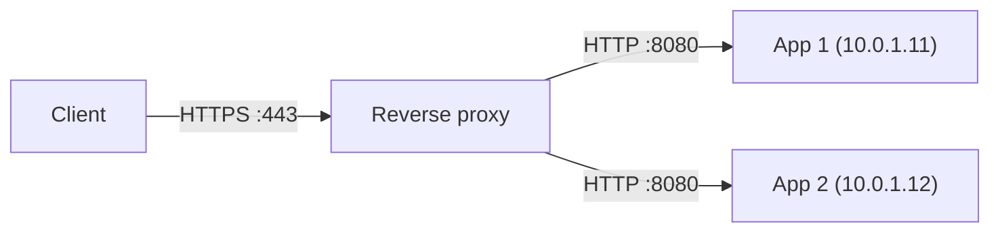

---
tags:
  - Should
  - ReverseProxy
  - HTTP
  - Troubleshooting
---

# Reverse proxy làm gì ở giữa client và ứng dụng, và cấu hình sai thì lộ gì?

## Metadata

```yaml
Chapter: reverse-proxy
Phase: 04 — transport-app
Importance: Should
Status: draft
Prerequisites:
  - Phase 04 / 05-http
  - Phase 04 / 07-load-balancing-l4-vs-l7
Used Later: []
Estimated Reading: 25 phút
Estimated Practice: 25 phút
```

## 1. Story

<!-- Mức bắt buộc (Should): Đủ -->
<!-- DRAFT: người học cần viết lại bằng lời mình -->

Nhóm `shopnet` đặt nginx phía trước ứng dụng web để kết thúc TLS. Sau khi triển khai, ứng dụng bắt đầu chuyển hướng người dùng về `http://...` (không phải `https://`) và tạo liên kết sai, trong khi người dùng thực sự đang vào bằng HTTPS. Ở một dịch vụ khác, trang quản trị nội bộ bỗng truy cập được từ Internet vì cấu hình proxy "chuyển tiếp mọi thứ" mà quên giới hạn đường dẫn.

Cả hai đều do hiểu sai vai trò của reverse proxy: nó **đứng thay** server trước mặt client, nên ứng dụng ở sau **không thấy** giao thức, địa chỉ, host mà client thật sự dùng, trừ khi proxy truyền thông tin đó đi; và nó quyết định cái gì được phép đi qua.

## 2. Objectives

<!-- Mức bắt buộc (Should): Đủ -->
<!-- DRAFT: người học cần viết lại bằng lời mình -->

Sau chapter này bạn có thể:

- Phân biệt reverse proxy với forward proxy.
- Giải thích reverse proxy làm gì (kết thúc TLS, định tuyến, đệm, nén, che backend) và so với load balancer.
- Cấu hình proxy truyền đúng `Host`, `X-Forwarded-For`, `X-Forwarded-Proto` và nêu vì sao cần.
- Giải thích hệ quả bảo mật khi tin header do client gửi.
- Chẩn đoán lỗi: redirect sai giao thức, 502/504, mất IP client, timeout.

## 3. Prerequisites

<!-- Mức bắt buộc (Should): Đủ -->
<!-- DRAFT: người học cần viết lại bằng lời mình -->

> Xem lại: [http](05-http.md), [load-balancing-l4-vs-l7](07-load-balancing-l4-vs-l7.md)

Cần nhớ: yêu cầu/phản hồi HTTP, header `Host`, mã 5xx (`04/05`); LB L7, `X-Forwarded-For`, health check (`04/07`).

## 4. Why it exists

<!-- Mức bắt buộc (Should): Đủ -->
<!-- DRAFT: người học cần viết lại bằng lời mình -->

Cho ứng dụng nhận trực tiếp lưu lượng Internet thường không hợp lý: ứng dụng phải tự lo TLS, nén, giới hạn tốc độ, xử lý client chậm. **Reverse proxy (proxy ngược — máy chủ đứng trước ứng dụng, nhận yêu cầu thay ứng dụng và chuyển tiếp xuống)** gánh những việc chung đó và cho phép nhiều ứng dụng dùng chung một địa chỉ công khai (phân biệt theo host hoặc đường dẫn).

Nếu hiểu sai: ứng dụng tạo liên kết/chuyển hướng sai (Story), mất IP client, backend lộ ra Internet, hoặc cấu hình tin header từ client.

## 5. Mental model

<!-- Mức bắt buộc (Should): Đủ -->
<!-- DRAFT: người học cần viết lại bằng lời mình -->

Hình dung **thư ký của một giám đốc**. Khách (client) chỉ nói chuyện với thư ký; thư ký quyết định ai được gặp, chuyển lời tới giám đốc (ứng dụng) và chuyển câu trả lời lại. Giám đốc không thấy mặt khách, chỉ thấy lời thư ký ghi lại; nếu thư ký quên ghi "khách đến bằng xe nào", giám đốc không biết.

**Tóm tắt một câu:** reverse proxy là bên nhận yêu cầu thay ứng dụng rồi chuyển tiếp, nên mọi thông tin về client gốc phải được proxy chủ động truyền đi.

## 6. How it works

<!-- Mức bắt buộc (Should): Đủ -->
<!-- DRAFT: người học cần viết lại bằng lời mình -->

Các từ cần biết:

- **Reverse proxy (proxy ngược — đứng trước server, thay server nhận yêu cầu từ client).**
- **Forward proxy (proxy thuận — đứng trước client, thay client đi ra Internet; ngược chiều với reverse proxy).**
- **Upstream (phía trên dòng — server hoặc nhóm server phía sau mà proxy chuyển tiếp tới).**
- **TLS termination (kết thúc TLS — proxy giải mã HTTPS rồi chuyển tiếp dạng HTTP hoặc HTTPS khác).**
- **Buffering (đệm — proxy nhận trọn phản hồi từ backend rồi mới gửi cho client chậm).**

**Reverse proxy và load balancer.** Reverse proxy L7 và load balancer L7 làm phần lớn việc giống nhau (`04/07`); khác biệt chủ yếu là cách triển khai và mục đích: LB nhấn mạnh phân tải và health check, reverse proxy nhấn mạnh xử lý yêu cầu (TLS, định tuyến, đệm, bộ nhớ đệm). Nhiều phần mềm (nginx, HAProxy) đóng cả hai vai.



**Đọc sơ đồ:** client chỉ nói chuyện HTTPS với proxy ở cổng 443. Proxy kết thúc TLS, rồi mở **kết nối riêng** tới ứng dụng (ở đây HTTP cổng 8080). Vì có hai kết nối tách biệt, ứng dụng thấy nguồn là proxy, giao thức là HTTP và host có thể khác, nên proxy phải gắn thêm header để truyền thông tin gốc.

**Header phải truyền.** Theo tài liệu nginx, mặc định proxy **không** chuyển nguyên `Host` mà gửi giá trị `$proxy_host` (tên/địa chỉ upstream), và gửi `Connection: close`. Do đó thường cấu hình rõ ràng:

```nginx
location / {
    proxy_pass http://backend;
    proxy_set_header Host              $host;
    proxy_set_header X-Forwarded-For   $proxy_add_x_forwarded_for;
    proxy_set_header X-Forwarded-Proto $scheme;
}
```

Biến `$proxy_add_x_forwarded_for` thêm IP nguồn vào cuối `X-Forwarded-For` (nếu chưa có header thì bằng chính IP nguồn). `X-Forwarded-Proto` cho ứng dụng biết client dùng http hay https; thiếu nó là nguyên nhân của Story (ứng dụng nghĩ mình chạy HTTP nên chuyển hướng về HTTP).

**Lấy IP client đúng cách.** Nếu proxy của bạn nằm sau một LB khác, IP nguồn nginx thấy là của LB. Mô-đun `realip` của nginx giải quyết: `set_real_ip_from` khai báo các địa chỉ **đáng tin** được phép cung cấp IP thay thế, `real_ip_header` chọn header (`X-Forwarded-For` hoặc `proxy_protocol`), `real_ip_recursive on` chọn **địa chỉ không đáng tin cuối cùng** trong chuỗi. Tài liệu nginx cảnh báo chỉ khai báo địa chỉ bạn hoàn toàn tin, vì sai cấu hình cho phép giả mạo IP client.

**Mặc định đáng chú ý của nginx:** timeout kết nối tới upstream và timeout đọc phản hồi đều **60 giây**; đệm phản hồi mặc định **bật**; `proxy_http_version` mặc định đã đổi qua các phiên bản (phiên bản cũ mặc định 1.0, bản mới hơn mặc định 1.1), nên nếu muốn kết nối keepalive tới upstream thì đặt rõ `proxy_http_version 1.1` `[CHƯA KIỂM CHỨNG]` phiên bản bạn đang dùng.

**Các việc proxy thường làm:** kết thúc TLS (`04/06`); định tuyến theo host/đường dẫn tới nhiều ứng dụng; chuyển WebSocket (cần header nâng cấp riêng); đệm để giải phóng backend khỏi client chậm; nén; giới hạn tốc độ; che backend (client không biết địa chỉ thật).

<!-- verified: 2026-10-05 https://nginx.org/en/docs/http/ngx_http_proxy_module.html -->
<!-- verified: 2026-10-05 https://nginx.org/en/docs/http/ngx_http_realip_module.html -->

> Hai lớp proxy (LB + nginx): mỗi lớp thêm một mục vào `X-Forwarded-For`; chỉ tin phần do hạ tầng bạn thêm (`04/07`).

## 7. Key settings

<!-- Mức bắt buộc (Should): Đủ -->
<!-- DRAFT: người học cần viết lại bằng lời mình -->

| Thông số | Ý nghĩa | Nếu sai |
|---|---|---|
| `proxy_pass` | Upstream nhận yêu cầu | Sai địa chỉ/cổng → 502 |
| `proxy_set_header Host` | Host gửi cho ứng dụng | Mặc định là tên upstream → ứng dụng/host ảo sai |
| `X-Forwarded-For` / `-Proto` | Thông tin client gốc | Thiếu → mất IP, redirect sai giao thức |
| `set_real_ip_from` + `real_ip_header` | Nguồn đáng tin cho IP client | Tin tất cả → giả mạo IP |
| `proxy_connect_timeout` / `proxy_read_timeout` (mặc định 60 giây) | Chờ upstream | Quá ngắn → 504 giả; quá dài → treo |
| Bật keepalive tới upstream | Dùng lại kết nối | Không dùng → tốn kết nối và cổng tạm (`04/04`) |
| Giới hạn đường dẫn `location` | Cái gì được chuyển tiếp | Mở quá rộng → lộ trang nội bộ (Story) |

## 8. AWS mapping

<!-- Mức bắt buộc (Should): Tùy chọn -->
<!-- DRAFT: người học cần viết lại bằng lời mình -->

Tùy chọn. Trên AWS, nhiều vai trò của reverse proxy do dịch vụ thay: ALB (kết thúc TLS, định tuyến theo đường dẫn/host, `X-Forwarded-*`, `04/07`), CloudFront (đệm/phân phối nội dung), API Gateway. Vẫn dùng nginx/Envoy trong một số trường hợp (service mesh, sidecar, chuyển tiếp tùy biến), thường chạy trên EC2/ECS sau ALB hoặc NLB. Khi có ALB phía trước nginx: nginx phải đọc `X-Forwarded-For`/`X-Forwarded-Proto` do ALB gửi (đừng ghi đè mù quáng), và cấu hình `set_real_ip_from` bằng dải IP của ALB/subnet, không phải dải công khai.

## 9. Hands-on lab

<!-- Mức bắt buộc (Should): Rút gọn -->
<!-- DRAFT: người học cần viết lại bằng lời mình -->

Chi tiết ở `labs/phase-04-transport-app/chapter-08-reverse-proxy/README.md`. Lab rút gọn, local bằng Docker Compose: một backend in ra header nhận được, một nginx làm reverse proxy.

**1. Predict:** backend nhận `Host` là gì khi proxy không đặt `proxy_set_header Host`? Khi đặt `$host`? `X-Forwarded-For` chứa gì?

**2. Run:** xem README lab. **3. Verify:** output thật `[CHƯA CHẠY]`.

## 10. Break it

<!-- Mức bắt buộc (Should): Rút gọn -->
<!-- DRAFT: người học cần viết lại bằng lời mình -->

**Lỗi — thiếu header.**
Dự đoán: bỏ `proxy_set_header Host $host` thì backend thấy `Host` là tên upstream (`backend`), khác với host client gõ; ứng dụng dùng host để tạo liên kết/chọn site sẽ sai. Bỏ `X-Forwarded-Proto` thì ứng dụng không biết client dùng HTTPS.

**Lỗi — header giả.**
Dự đoán: client tự gửi `X-Forwarded-For: 203.0.113.99`; ở cấu hình `$proxy_add_x_forwarded_for` backend thấy `203.0.113.99, <IP thật>`. Ứng dụng tin mục đầu bị lừa.

Kết quả thật: `[CHƯA CHẠY]`.

## 11. Troubleshooting

<!-- Mức bắt buộc (Should): Rút gọn -->
<!-- DRAFT: người học cần viết lại bằng lời mình -->

| Triệu chứng | Giả thuyết đầu tiên | Kiểm tra | Công cụ |
|---|---|---|---|
| Redirect về `http://` dù client dùng HTTPS | Ứng dụng không biết giao thức gốc | Có `X-Forwarded-Proto` không; ứng dụng có tin nó không | Header ở backend |
| Liên kết dùng tên upstream | `Host` không được truyền | `proxy_set_header Host $host` | `curl -v`, log backend |
| Log chỉ thấy IP proxy | Chưa đọc `X-Forwarded-For` / `realip` | Cấu hình `set_real_ip_from`, header | Log ứng dụng |
| 502 | Upstream không nghe/sai cổng/đóng kết nối | `ss -tlnp` trên upstream (`04/04`); log lỗi proxy | `curl` tới upstream, log nginx |
| 504 | Upstream chậm hơn timeout | `proxy_read_timeout`, thời gian xử lý upstream | Log, metric |
| Trang nội bộ lộ ra | `location` quá rộng | Rà các đường dẫn được proxy | Cấu hình, thử từ ngoài |

Ghi kết quả thật của mục 10: `[CHƯA CHẠY]`.

## 12. Security & cost

<!-- Mức bắt buộc (Should): Đủ -->
<!-- DRAFT: người học cần viết lại bằng lời mình -->

- **Không tin header do client gửi** (`X-Forwarded-*`, `X-Real-IP`): xóa hoặc ghi đè ở biên, chỉ tin mục do hạ tầng của bạn thêm.
- **`set_real_ip_from` chỉ gồm địa chỉ thật sự tin cậy** (tài liệu nginx cảnh báo giả mạo).
- **Giới hạn đường dẫn được chuyển tiếp**; chặn trang quản trị khỏi Internet.
- **Backend chỉ nhận từ proxy** (SG chỉ cho nguồn là proxy/LB), tránh bị gọi vòng qua proxy.
- Ẩn thông tin phiên bản, giới hạn kích thước body và tốc độ để giảm lạm dụng.
- Không dán cấu hình/log thật (host, IP nội bộ) vào tài liệu công khai.
- **Chi phí:** local không phát sinh; trên AWS, mỗi proxy tự quản lý tốn instance/ECS và vận hành.

## 13. Misconceptions

<!-- Mức bắt buộc (Should): Đủ -->
<!-- DRAFT: người học cần viết lại bằng lời mình -->

| Hiểu nhầm | Sự thật |
|---|---|
| "Reverse proxy và forward proxy giống nhau" | Ngược chiều: reverse đứng trước server, forward đứng trước client |
| "Proxy trong suốt, ứng dụng thấy mọi thứ như client" | Ứng dụng chỉ thấy proxy trừ khi proxy truyền header |
| "`X-Forwarded-For` luôn là IP thật" | Client giả được; chỉ tin phần do hạ tầng mình thêm |
| "Kết thúc TLS ở proxy thì đoạn sau cũng an toàn" | Đoạn proxy → backend có thể là HTTP trơn |
| "Reverse proxy khác hoàn toàn load balancer" | Phần lớn việc trùng nhau ở L7 |
| "Mặc định nginx đã truyền đủ" | Mặc định đổi `Host` thành tên upstream và không thêm `X-Forwarded-Proto` |

## 14. Interview questions

<!-- Mức bắt buộc (Should): Đủ -->
<!-- DRAFT: người học cần viết lại bằng lời mình -->

### Q1 (Junior) — Reverse proxy là gì, khác forward proxy ra sao?

**Gợi ý ý chính:**
- Đứng trước ai?
- Ai biết về proxy?

??? success "Đáp án mẫu (tự trả lời trước khi mở)"
    Reverse proxy đứng trước server, nhận yêu cầu thay server rồi chuyển tiếp; client thường không biết backend thật. Forward proxy đứng trước client, đi ra Internet thay client; server thường không biết client thật.

### Q2 (Middle) — Ứng dụng sau nginx chuyển hướng sai sang HTTP. Nguyên nhân và cách sửa?

**Gợi ý ý chính:**
- Hai kết nối tách biệt
- Header nào?

??? success "Đáp án mẫu (tự trả lời trước khi mở)"
    Nginx kết thúc TLS và nói HTTP với ứng dụng, nên ứng dụng không biết client dùng HTTPS. Sửa: `proxy_set_header X-Forwarded-Proto $scheme;` và cấu hình ứng dụng/framework tin header đó (chỉ từ proxy đáng tin).

### Q3 (Middle) — Vì sao không nên tin `X-Forwarded-For` mù quáng, và làm thế nào để lấy IP client đúng?

**Gợi ý ý chính:**
- Ai thêm vào header?
- Tin từ phía nào của chuỗi?

??? success "Đáp án mẫu (tự trả lời trước khi mở)"
    Client có thể tự gửi header giả, và mỗi proxy chỉ thêm vào cuối. Chỉ tin các mục do hạ tầng của mình thêm: cấu hình các proxy đáng tin (`set_real_ip_from`) và lấy địa chỉ không đáng tin cuối cùng trong chuỗi (`real_ip_recursive on`), hoặc dùng proxy protocol giữa các lớp.

## 15. Exercises

<!-- Mức bắt buộc (Should): Đủ -->
<!-- DRAFT: người học cần viết lại bằng lời mình -->

1. **Viết cấu hình.** *Deliverable:* đoạn cấu hình nginx cho `shopnet` (kết thúc TLS, hai upstream, header đúng) kèm giải thích từng dòng.
2. **Đọc XFF qua hai lớp.** Chuỗi `X-Forwarded-For: 198.51.100.9, 203.0.113.7, 10.0.1.5`, trong đó `10.0.1.5` là LB nội bộ đáng tin. *Deliverable:* IP client thật theo `real_ip_recursive on` và lý do.
3. **Rà soát bảo mật.** *Deliverable:* danh sách 5 điểm cần kiểm tra khi đưa một reverse proxy ra Internet.

## 16. Cheat sheet

<!-- Mức bắt buộc (Should): Đủ -->
<!-- DRAFT: người học cần viết lại bằng lời mình -->

| Mục | Nội dung |
|---|---|
| Vai trò | Nhận yêu cầu thay ứng dụng, chuyển tiếp |
| Header cần đặt | `Host $host`, `X-Forwarded-For $proxy_add_x_forwarded_for`, `X-Forwarded-Proto $scheme` |
| IP client sau nhiều lớp | `set_real_ip_from` + `real_ip_header` + `real_ip_recursive on` |
| Timeout mặc định nginx | connect 60 giây, read 60 giây |
| Bảo mật | Không tin header từ client; giới hạn `location` |

**Debug:** upstream nghe chưa (`ss -tlnp`) → log lỗi proxy (502/504) → header đã truyền đủ → timeout → quy tắc `location`.

## 17. Glossary terms

<!-- Mức bắt buộc (Should): Đủ -->
<!-- DRAFT: người học cần viết lại bằng lời mình -->

- Reverse proxy / proxy ngược / リバースプロキシ
- Forward proxy / proxy thuận / フォワードプロキシ
- Upstream / phía trên dòng / アップストリーム
- TLS termination / kết thúc TLS / TLS終端
- Buffering / đệm / バッファリング

## 18. Further reading

<!-- Mức bắt buộc (Should): Đủ -->
<!-- DRAFT: người học cần viết lại bằng lời mình -->

Kiểm tra ngày 2026-10-05:

- nginx `ngx_http_proxy_module`: https://nginx.org/en/docs/http/ngx_http_proxy_module.html
- nginx `ngx_http_realip_module`: https://nginx.org/en/docs/http/ngx_http_realip_module.html
- ALB X-Forwarded headers: https://docs.aws.amazon.com/elasticloadbalancing/latest/application/x-forwarded-headers.html
