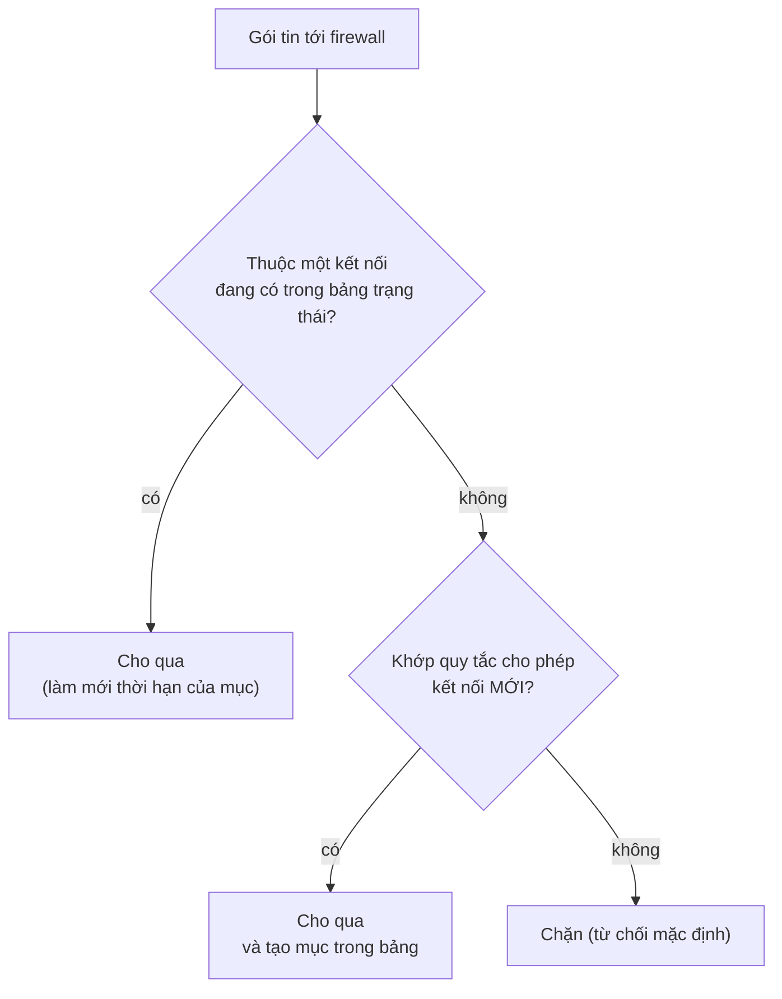

---
tags:
  - Must
  - Firewall
  - Concept
  - Troubleshooting
---

# Firewall quyết định cho gói tin đi qua bằng cách nào, và việc "nhớ kết nối" thay đổi điều gì? (Firewall stateful và stateless)

## Metadata

```yaml
Chapter: firewall-stateful-vs-stateless
Phase: 05 — security
Importance: Must
Status: draft
Prerequisites:
  - Phase 04 / 01-tcp-handshake-states
  - Phase 04 / 04-ports-sockets
Used Later:
  - Phase 05 / 02-acl
  - Phase 05 / 03-sg-vs-nacl-concept
  - Phase 05 / 05-bastion-and-session-access
Estimated Reading: 40 phút
Estimated Practice: 50 phút
```

## 1. Story

<!-- Mức bắt buộc (Must): Đủ -->
<!-- DRAFT: người học cần viết lại bằng lời mình -->

Một cựu nhân viên vừa rời `shopnet`. Kỹ sư vận hành xóa quy tắc security group cho phép SSH từ địa chỉ IP của người đó, rồi báo cáo "đã thu hồi truy cập". Nhưng cựu nhân viên vẫn đang mở một phiên SSH từ trước và **phiên đó vẫn chạy bình thường** sau khi quy tắc bị xóa. Kỹ sư kiểm tra lại: quy tắc đúng là đã biến mất, vậy mà "quy tắc đã xóa nhưng vẫn vào được".

Đây không phải lỗi của AWS. Security group là bộ lọc **có trạng thái**: nó đã ghi nhớ phiên SSH đó là một kết nối hợp lệ, và quy tắc chỉ được dùng để quyết định cho phép **kết nối mới**. Ngược lại, một kết nối không được theo dõi sẽ đứt ngay khi quy tắc bị xóa. Hiểu firewall nhớ gì, nhớ bao lâu, và quên khi nào là điều quyết định cả việc thu hồi truy cập an toàn lẫn việc chẩn đoán các kết nối "tự chết" sau một thời gian im lặng. Chapter này dạy điều đó.

## 2. Objectives

<!-- Mức bắt buộc (Must): Đủ -->
<!-- DRAFT: người học cần viết lại bằng lời mình -->

Sau chapter này bạn có thể:

- Mô tả một firewall quyết định gì (các trường của gói tin, hướng, hành động) và vai trò của chính sách mặc định.
- Phân biệt bộ lọc stateless (xét từng gói riêng) với stateful (nhớ kết nối) và hệ quả của mỗi loại với chiều trả lời.
- Đọc một bảng theo dõi kết nối và giải thích các trạng thái NEW, ESTABLISHED, RELATED, INVALID.
- Nêu được năm hệ quả thực tế của việc có trạng thái: xóa quy tắc không cắt kết nối cũ, hết thời gian chờ, bảng đầy, định tuyến bất đối xứng, và NAT.
- Phân biệt firewall lọc theo gói (tầng 3–4) với firewall tầng ứng dụng.

## 3. Prerequisites

<!-- Mức bắt buộc (Must): Đủ -->
<!-- DRAFT: người học cần viết lại bằng lời mình -->

> Xem lại: [tcp-handshake-states](../phase-04-transport-app/01-tcp-handshake-states.md)
> Xem lại: [ports-sockets](../phase-04-transport-app/04-ports-sockets.md)

Chapter `04/04` (cổng và socket) hiện chưa viết; bạn chỉ cần nhớ ý "cổng chọn dịch vụ trong một máy" ở `00/02` và khái niệm cổng tạm thời ở `05/03`. Bạn cũng cần nhớ bắt tay TCP và các trạng thái kết nối ở `04/01`.

## 4. Why it exists

<!-- Mức bắt buộc (Must): Đủ -->
<!-- DRAFT: người học cần viết lại bằng lời mình -->

Một máy nối vào mạng có thể bị bất kỳ ai trên mạng thử kết nối tới mọi cổng. Phần lớn dịch vụ chạy trên máy không nên mở cho tất cả. **Firewall (tường lửa)** là thiết bị hoặc phần mềm đặt trên đường đi của lưu lượng, **chặn lưu lượng được cho là không phù hợp hoặc nguy hiểm** và cho phần còn lại đi qua (đó cũng là cách RFC 2979 mô tả firewall).

Một firewall tốt cần cân bằng hai điều: chặn đủ để giảm bề mặt tấn công, nhưng **không phá việc sử dụng hợp lệ**. RFC 2979 nhấn mạnh rằng firewall quá khắt khe khiến người dùng tìm cách lách, làm giảm an toàn.

Vấn đề của kết nối hai chiều: để cho một người ngoài mạng truy cập dịch vụ, bạn phải mở cổng dịch vụ (chiều đi vào), nhưng chiều trả lời có cổng đích ngẫu nhiên (cổng tạm thời). Nếu firewall phải tự mở sẵn mọi cổng ngẫu nhiên thì quá lỏng; nếu không mở thì kết nối hỏng. **Firewall có trạng thái (stateful)** giải bài toán đó bằng cách **nhớ** rằng "kết nối này do một yêu cầu hợp lệ khởi tạo" nên tự cho phép gói trả lời.

Nếu hiểu sai:

- Tưởng xóa quy tắc là cắt mọi phiên đang chạy (Story) hoặc ngược lại, tưởng quy tắc "chưa kịp có hiệu lực" nên kết nối cũ vẫn an toàn.
- Mất kết nối dài hạn một cách khó hiểu khi mục theo dõi hết hạn vì im lặng.
- Thiết kế mạng mà firewall chỉ thấy một chiều của kết nối (định tuyến bất đối xứng), làm gói trả lời bị loại bỏ.

## 5. Mental model

<!-- Mức bắt buộc (Must): Đủ -->
<!-- DRAFT: người học cần viết lại bằng lời mình -->

Hình dung một **nhà hàng chỉ nhận khách đã đặt bàn**.

- **Bảo vệ không nhớ (stateless):** mỗi lần ai đó bước vào, bảo vệ đối chiếu họ với danh sách; khi khách đi vệ sinh rồi quay lại, bảo vệ phải đối chiếu lại từ đầu.
- **Bảo vệ có sổ (stateful):** bảo vệ ghi "bàn 5, khách A đã vào lúc 19:00" vào sổ; khách đi ra đi vào bàn 5 thì không hỏi lại. Nhưng **nếu ban quản lý xóa tên khách A khỏi danh sách đặt bàn lúc 19:30, khách A đã ngồi trong nhà hàng vẫn ngồi tiếp** (sổ vẫn ghi bàn 5 đang có người); chỉ khi khách rời đi hoặc sổ bị xóa thì lần sau mới bị kiểm tra lại. Và nếu khách ngồi im quá lâu, người ghi sổ có thể gạch bàn đó đi.

**Tóm tắt một câu:** firewall stateful ghi lại từng kết nối được phép vào một bảng với thời hạn; quy tắc quyết định kết nối **mới**, còn bảng quyết định các gói thuộc kết nối **đang có**.

## 6. How it works

<!-- Mức bắt buộc (Must): Đủ -->
<!-- DRAFT: người học cần viết lại bằng lời mình -->

Các từ cần biết:

- **Firewall (tường lửa — thiết bị hoặc phần mềm lọc lưu lượng theo quy tắc, cho phép hoặc chặn).**
- **Packet filtering (lọc gói tin — quyết định từng gói dựa trên các trường như địa chỉ, giao thức, cổng).**
- **5-tuple (bộ năm — năm trường xác định một luồng: địa chỉ nguồn, địa chỉ đích, giao thức, cổng nguồn, cổng đích).**
- **Ingress / Egress (chiều vào / chiều ra — lưu lượng đi vào / đi ra khỏi thứ được bảo vệ).**
- **Default deny (từ chối mặc định — chính sách chặn mọi thứ chưa được cho phép tường minh).**
- **State table (bảng trạng thái — bảng firewall dùng để nhớ các kết nối đang được theo dõi; còn gọi là bảng theo dõi kết nối hay conntrack).**
- **Flow (luồng — chuỗi gói tin cùng chung các trường của bộ năm, cùng một hướng hoặc hai hướng của một cuộc trao đổi).**
- **Application-layer firewall (firewall tầng ứng dụng — firewall hiểu nội dung giao thức tầng 7, ví dụ tên miền, đường dẫn HTTP, chữ ký tấn công).**

Các từ **stateful** (có trạng thái), **stateless** (không trạng thái), **connection tracking** (theo dõi kết nối), **implicit deny** (từ chối ngầm) và **ephemeral port** (cổng tạm thời) đã được giới thiệu ở `05/03`; ở đây chúng được giải thích sâu hơn.

**Một firewall quyết định dựa trên gì?** Mỗi quy tắc khớp các trường của gói tin (thường là bộ năm), có **hướng** (vào hay ra), và một **hành động** (cho phép hoặc chặn). Gói không khớp quy tắc nào chịu **chính sách mặc định**: tốt nhất là từ chối mặc định (chỉ cho phép những gì cần). Một số hệ thống duyệt theo thứ tự và dừng ở quy tắc đầu tiên khớp, một số xét mọi quy tắc rồi mới quyết định (xem `05/02`, `05/03`).

**Stateless:** mỗi gói được xét **riêng lẻ**, không có bộ nhớ. Muốn cho phép một cuộc trao đổi hai chiều, bạn viết quy tắc cho **cả hai chiều**, kể cả dải cổng tạm thời cho chiều trả lời (`05/03`). Nhanh, đơn giản, nhưng dễ sai và phải mở rộng.

**Stateful:** firewall duy trì **bảng trạng thái**. Gói đầu tiên của một kết nối được so với quy tắc; nếu được phép, một mục được tạo trong bảng. Các gói sau thuộc cùng kết nối (cả hai chiều) được nhận ra qua bảng và cho qua mà không xét lại quy tắc. Theo tài liệu của Linux netfilter, các gói được phân loại thành bốn trạng thái chính:

| Trạng thái | Nghĩa |
|---|---|
| `NEW` | Gói bắt đầu một kết nối mới, hoặc thuộc kết nối chưa thấy gói ở cả hai chiều |
| `ESTABLISHED` | Gói thuộc kết nối đã thấy gói ở **cả hai chiều** |
| `RELATED` | Gói bắt đầu một kết nối mới nhưng **liên quan** tới kết nối có sẵn (ví dụ gói báo lỗi ICMP) |
| `INVALID` | Gói không thuộc kết nối nào đã biết |

Lưu ý: `ESTABLISHED` của firewall nghĩa là "đã thấy hai chiều", **không** đồng nghĩa với trạng thái `ESTABLISHED` của TCP (`04/01`).



**Đọc sơ đồ:** một gói đi qua hai cổng kiểm tra theo thứ tự. Trước hết firewall hỏi bảng trạng thái: nếu gói thuộc một kết nối đã được ghi nhớ thì cho qua mà **không** xét lại quy tắc. Chỉ khi gói không thuộc kết nối nào mới xét quy tắc cho kết nối mới; nếu được phép, firewall tạo mục trong bảng để các gói sau (kể cả chiều trả lời) được nhận ra. Chính thứ tự này giải thích Story: quy tắc bị xóa không còn cho phép kết nối **mới**, nhưng kết nối đã có trong bảng vẫn đi qua nhánh đầu tiên.

**Năm hệ quả của việc có trạng thái:**

1. **Đổi quy tắc không cắt kết nối đang được theo dõi.** Đây là Story. Muốn cắt ngay, phải xóa mục trong bảng, hoặc dùng bộ lọc stateless chặn cả hai chiều.
2. **Mục trong bảng hết hạn nếu im lặng.** Mỗi mục có thời hạn nhàn rỗi (idle timeout). Kết nối bị im lặng quá thời hạn sẽ bị quên; gói đến sau đó không khớp mục nào và có thể bị chặn nên kết nối "tự chết" không có thông báo. Cách xử lý: gửi **keepalive** định kỳ (xem `04/02`).
3. **Bảng có kích thước giới hạn.** Quá nhiều kết nối đồng thời làm bảng đầy; kết nối mới bị loại bỏ.
4. **Định tuyến bất đối xứng làm hỏng firewall stateful.** Nếu gói đi qua firewall A nhưng gói trả lời về qua firewall B, mỗi firewall chỉ thấy một chiều, và gói trả lời bị coi là không thuộc kết nối nào (xem `02/06`).
5. **NAT cũng là bộ lọc có trạng thái.** Bảng NAT (`02/05`) là một loại bảng theo dõi; hai bảng này thường nằm cùng chỗ.

**Giao thức không có kết nối thật.** UDP và ICMP không có bắt tay, nên firewall suy luận "kết nối" từ cặp yêu cầu/phản hồi trong một khoảng thời gian: gói trả lời đến đúng lúc, đúng các trường (đảo nguồn/đích) thì được coi là thuộc kết nối.

**Firewall theo tầng.**

| Loại | Xét gì | Ví dụ |
|---|---|---|
| Lọc gói (stateless) | Bộ năm của từng gói | Danh sách kiểm soát truy cập, `05/02` |
| Có trạng thái (stateful) | Bộ năm + trạng thái kết nối | Security group, firewall trên máy chủ |
| Tầng ứng dụng | Nội dung giao thức (tên miền, HTTP, chữ ký) | Web application firewall, firewall có kiểm tra gói sâu |

**Đặt firewall ở đâu.** Trên **máy chủ** (host firewall, ví dụ `iptables` trên Linux), ở **ranh giới mạng** (firewall mạng), hoặc **dịch vụ của nền tảng đám mây** (security group và network ACL ở `05/03`). Nên dùng nhiều lớp.

<!-- verified: 2026-10-05 https://ipset.netfilter.org/iptables-extensions.man.html -->
<!-- verified: 2026-10-05 https://www.rfc-editor.org/rfc/rfc2979 -->

## 7. Key settings

<!-- Mức bắt buộc (Must): Đủ -->
<!-- DRAFT: người học cần viết lại bằng lời mình -->

| Thông số | Ý nghĩa | Nếu sai |
|---|---|---|
| Chính sách mặc định | Từ chối hay cho phép mọi thứ chưa khớp | Cho phép mặc định → hở; từ chối mặc định mà thiếu quy tắc → chặn nhầm |
| Quy tắc cho kết nối mới (NEW) | Ai được khởi tạo kết nối nào | Quá rộng → bề mặt tấn công lớn |
| Quy tắc cho ESTABLISHED/RELATED | Cho phép gói thuộc kết nối đang có (và lỗi ICMP liên quan) | Thiếu → chiều trả lời bị chặn |
| Xử lý INVALID | Gói không thuộc kết nối nào | Cho qua → rủi ro; thường nên chặn |
| Thời hạn nhàn rỗi | Bao lâu im lặng thì quên kết nối | Quá ngắn → kết nối dài tự chết; quá dài → bảng dễ đầy |
| Kích thước bảng | Số kết nối tối đa theo dõi cùng lúc | Đầy → kết nối mới bị loại bỏ |
| Keepalive ở ứng dụng/hệ điều hành | Giữ mục không hết hạn | Thiếu keepalive với kết nối nhàn rỗi dài |

**Công cụ quan sát trên Linux:** `iptables -L -n -v` (xem quy tắc và số gói khớp), `conntrack -L` (liệt kê bảng theo dõi kết nối; công cụ `conntrack` thuộc gói `conntrack-tools`, tên gói có thể khác theo bản phân phối `[CHƯA KIỂM CHỨNG]`).

## 8. AWS mapping

<!-- Mức bắt buộc (Must): Đủ nếu có liên quan AWS -->
<!-- DRAFT: người học cần viết lại bằng lời mình -->

<!-- verified: 2026-10-05 https://docs.aws.amazon.com/AWSEC2/latest/UserGuide/security-group-connection-tracking.html -->
<!-- verified: 2026-10-05 https://docs.aws.amazon.com/network-firewall/latest/developerguide/what-is-aws-network-firewall.html -->

| Khái niệm | Trên AWS |
|---|---|
| Firewall stateful gắn vào tài nguyên | Security group (dùng theo dõi kết nối) |
| Firewall stateless ở ranh giới subnet | Network ACL (`05/03`) |
| Firewall mạng stateful + kiểm tra sâu | AWS Network Firewall (có engine stateful và stateless) |

Theo tài liệu AWS:

- **Security group dùng theo dõi kết nối:** phản hồi của lưu lượng đã được phép tự động đi ra bất kể quy tắc outbound, và ngược lại.
- **Đổi quy tắc không cắt kết nối đang được theo dõi:** security group tiếp tục cho phép gói cho đến khi các kết nối hiện có hết thời gian. Muốn cắt ngay, dùng **network ACL** (stateless): thêm ACL chặn một chiều sẽ làm đứt kết nối hiện có.
- **Có kết nối không được theo dõi (untracked):** nếu một quy tắc cho phép luồng TCP/UDP tới **mọi địa chỉ** (`0.0.0.0/0` hoặc `::/0`) và có quy tắc chiều ngược lại cho phép **mọi phản hồi** (mọi cổng) thì luồng đó **không** được theo dõi; chiều trả lời được cho phép dựa vào chính quy tắc đó. Luồng không theo dõi **bị ngắt ngay** khi quy tắc cho phép bị xóa hoặc sửa. Ngược lại, kết nối được theo dõi (ví dụ SSH cho một IP cụ thể) vẫn sống khi quy tắc cho phép bị thu hẹp. Đây chính là Story, và nó cho thấy việc "có bị cắt hay không" phụ thuộc quy tắc rộng hay hẹp.
- **Một số đường đi luôn được theo dõi:** kết nối đi qua NAT gateway, Network Load Balancer, AWS PrivateLink (interface endpoint), Network Firewall endpoint, egress-only internet gateway, Global Accelerator, AWS Lambda; kết nối tới DynamoDB qua gateway endpoint cũng tốn mục theo dõi.
- **Giới hạn số kết nối theo dõi mỗi instance:** khi vượt, gói gửi và nhận bị loại bỏ vì không tạo được kết nối mới; có chỉ số mạng `conntrack_allowance_available` và `conntrack_allowance_exceeded` để giám sát.
- **Thời hạn nhàn rỗi có thể cấu hình** trên network interface (cho TCP established, UDP, UDP stream); giá trị mặc định **khác nhau theo loại instance**, nên đọc tài liệu hiện hành thay vì giả định một con số. Với kết nối dài (pool database, kết nối HTTP bền, streaming), AWS khuyến nghị gửi TCP keepalive với chu kỳ **dưới 5 phút**.
- **Định tuyến bất đối xứng** (vào một network interface, ra bằng interface khác) có thể làm giảm hiệu năng khi luồng bị theo dõi; nên tránh nếu được.
- **AWS Network Firewall** là firewall mạng được quản lý, có **engine stateful** (dùng Suricata, hỗ trợ quy tắc tương thích Suricata, lọc tên miền, kiểm tra gói sâu) và **engine stateless** (xét từng gói); các luồng được theo dõi trong bảng trạng thái của firewall, mục tồn tại cho đến khi bị xóa, kết thúc tự nhiên hoặc hết thời gian nhàn rỗi. Triển khai tại biên VPC (internet gateway, NAT gateway, VPN, Direct Connect) qua firewall endpoint và bảng định tuyến.

Chi tiết cấu hình ở `06/03`. Tài liệu AWS có thể thay đổi; kiểm tra lại trước khi dựa vào chi tiết.

## 9. Hands-on lab

<!-- Mức bắt buộc (Must): Đủ + expected-output.txt -->
<!-- DRAFT: người học cần viết lại bằng lời mình -->

Chi tiết ở `labs/phase-05-security/chapter-01-firewall-stateful-vs-stateless/README.md`. Lab dùng `iptables` và `conntrack` trong container (không tốn chi phí). Hành vi tương tự nhưng **không giống hệt** security group.

**1. Predict:** với firewall mặc định chặn mọi thứ vào, chỉ cho phép (a) gói thuộc kết nối đang có và (b) kết nối MỚI tới cổng 8080:

- Khi một client đã kết nối từ trước và vẫn mở, nếu bạn **xóa quy tắc (b)**, client đó còn gửi được dữ liệu không?
- Một kết nối **mới** từ chính client đó thì sao?
- Nếu bạn **xóa bảng theo dõi kết nối** (mô phỏng mục hết hạn), client cũ còn gửi được không?

**2. Run:**

```powershell
docker run --rm -it --cap-add NET_ADMIN alpine sh
```

```sh
apk add --no-cache iptables conntrack-tools
(nc -l -p 8080 >/tmp/recv.txt &)
iptables -P INPUT DROP
iptables -A INPUT -m conntrack --ctstate ESTABLISHED,RELATED -j ACCEPT
iptables -A INPUT -i lo -p tcp --dport 8080 -m conntrack --ctstate NEW -j ACCEPT
( sleep 8; echo "tin nhan tu ket noi cu" ) | nc 127.0.0.1 8080 &
sleep 2
echo "--- bảng theo dõi kết nối:"
conntrack -L 2>/dev/null | grep 8080
iptables -D INPUT -i lo -p tcp --dport 8080 -m conntrack --ctstate NEW -j ACCEPT
echo "--- kết nối MỚI sau khi xóa quy tắc:"
echo hi | nc -w 2 127.0.0.1 8080; echo "mã thoát: $?"
sleep 8
echo "--- nội dung server nhận được từ kết nối cũ:"
cat /tmp/recv.txt
```

**3. Verify:** mục `ESTABLISHED` có trong bảng không? Kết nối mới sau khi xóa quy tắc có bị chặn không? Tin nhắn từ kết nối cũ có tới server không?

Output thật: `[CHƯA CHẠY]`.

## 10. Break it

<!-- Mức bắt buộc (Must): Đủ (≥ 1 Break it) -->
<!-- DRAFT: người học cần viết lại bằng lời mình -->

Bước thứ hai: mô phỏng việc mục theo dõi bị mất (hết hạn nhàn rỗi hoặc bảng bị xóa) làm kết nối cũ "tự chết". Trong **cùng container** của bài ở mục 9 (hoặc container mới, chạy lại các bước thiết lập), thêm lại quy tắc kết nối mới rồi làm bài sau:

```sh
(nc -l -p 8081 >/tmp/recv2.txt &)
iptables -A INPUT -i lo -p tcp --dport 8081 -m conntrack --ctstate NEW -j ACCEPT
( sleep 8; echo "tin nhan sau khi xoa bang" ) | nc 127.0.0.1 8081 &
sleep 2
iptables -D INPUT -i lo -p tcp --dport 8081 -m conntrack --ctstate NEW -j ACCEPT
conntrack -F 2>/dev/null
sleep 8
echo "--- server nhận được gì từ kết nối bị xóa mục:"
cat /tmp/recv2.txt
```

**Dự đoán:**

- Bài ở mục 9: kết nối **cũ** vẫn gửi được dữ liệu (tin nhắn tới server) dù quy tắc đã bị xóa, nhưng kết nối **mới** bị chặn (hết thời gian, mã thoát khác 0). Đây là Story.
- Bài Break it này: sau khi vừa xóa quy tắc vừa xóa bảng theo dõi, gói thuộc kết nối cũ không còn khớp mục nào nên trở thành gói "mới" tới cổng 8081, mà quy tắc cho kết nối mới đã bị xóa, nên bị chặn: **tin nhắn không tới được server** (tệp nhận được rỗng).

**Ý nghĩa:** hai điều: (1) quy tắc chỉ quyết định kết nối **mới**; (2) khi mục theo dõi mất (hết hạn nhàn rỗi, bảng đầy, firewall khởi động lại), kết nối cũ chết im lặng, một nguồn gốc điển hình của "kết nối dài tự ngắt".

Lưu ý: cách nhân Linux xử lý gói TCP xuất hiện **giữa chừng** sau khi xóa bảng theo dõi có thể khác nhau tùy cấu hình (nhân có thể "nhặt" lại kết nối đang chạy); nếu kết quả của bạn khác dự đoán, đó là một quan sát đáng ghi lại chứ không phải lỗi bài. Nếu `apk add conntrack-tools`/`iptables` không chạy được trong môi trường của bạn, ghi lại lý do và làm bài tập 2 (mục 15) bằng giấy.

**Khôi phục:** `exit`; container `--rm` tự xóa (quy tắc `iptables` biến mất cùng container).

Kết quả thật: `[CHƯA CHẠY]`.

## 11. Troubleshooting

<!-- Mức bắt buộc (Must): Đủ -->
<!-- DRAFT: người học cần viết lại bằng lời mình -->

Triệu chứng chính: **kết nối khác với quy tắc.** Quy tắc nói một đằng, hành vi mạng nói một nẻo. Luôn xét **trạng thái kết nối** bên cạnh quy tắc.

| Triệu chứng | Giả thuyết đầu tiên | Kiểm tra | Công cụ |
|---|---|---|---|
| Đã xóa quy tắc nhưng phiên cũ vẫn chạy | Kết nối còn trong bảng theo dõi | Có mục `ESTABLISHED` không; quy tắc cũ rộng hay hẹp (với AWS: luồng tracked hay untracked) | `conntrack -L`; xem mục 8 |
| Kết nối dài tự chết sau một thời gian im lặng | Mục hết thời hạn nhàn rỗi | Thời gian im lặng so với thời hạn; có keepalive không | Cấu hình firewall/ENI, `ss -o` để xem keepalive |
| Kết nối mới thỉnh thoảng bị loại bỏ khi tải cao | Bảng theo dõi đầy | Số mục so với giới hạn; chỉ số `conntrack_allowance_exceeded` (AWS) | `conntrack -C`, chỉ số mạng của nền tảng |
| Gói trả lời bị loại bỏ ở một firewall stateful | Định tuyến bất đối xứng, firewall chỉ thấy một chiều | Đường đi của chiều đi và chiều về | `traceroute` hai chiều, bảng route (`02/06`) |
| Nhiều gói `INVALID` | Mục đã hết hạn hoặc định tuyến bất đối xứng | Nguồn gốc gói; bảng trạng thái | `iptables -L -n -v`, bắt gói (`00/03`) |
| Cho phép chiều đi mà chiều về hỏng (ở bộ lọc stateless) | Thiếu quy tắc chiều trả lời/cổng tạm thời | Quy tắc hai chiều | Xem `05/03` |

Ghi kết quả thật của mục 10: `[CHƯA CHẠY]`.

## 12. Security & cost

<!-- Mức bắt buộc (Must): Đủ -->
<!-- DRAFT: người học cần viết lại bằng lời mình -->

- **Thu hồi truy cập không cắt phiên đang chạy.** Khi cần chặn ngay (nhân viên rời đi, nghi bị xâm nhập), xóa quy tắc là **chưa đủ**: phải ngắt phiên (xóa mục theo dõi, hoặc dùng bộ lọc stateless chặn cả hai chiều như network ACL) và đổi thông tin xác thực. Đây là bài học chính của Story.
- **Từ chối mặc định + quyền tối thiểu:** chỉ mở đúng cổng và nguồn cần dùng; lọc cả **chiều ra** để giảm rủi ro rò rỉ dữ liệu.
- **Firewall không thay thế bảo mật ở tầng khác:** nó không biết nội dung có độc hại không (trừ firewall tầng ứng dụng); cần xác thực, mã hóa (`04/06`), cập nhật vá lỗi.
- **Ghi log các gói bị chặn** để phát hiện quét/tấn công; nhưng ghi log quá nhiều tốn chi phí và dung lượng.
- **Tấn công làm đầy bảng trạng thái** (nhiều kết nối nửa mở) là một dạng từ chối dịch vụ; thiết bị phòng thủ có cơ chế giảm thiểu.
- Không dán bảng quy tắc/bảng theo dõi thật (địa chỉ, cổng nội bộ) vào tài liệu công khai.
- **Chi phí:** lab local không phát sinh. Trên AWS, security group và network ACL không tính phí thêm (xem `05/03`); AWS Network Firewall và logging có chi phí riêng, gồm phí lưu lượng giữa các AZ nếu dùng endpoint ở AZ khác; kiểm tra trang giá chính thức, không ghi số trong sách `[CHƯA KIỂM CHỨNG]`.

## 13. Misconceptions

<!-- Mức bắt buộc (Must): Đủ -->
<!-- DRAFT: người học cần viết lại bằng lời mình -->

| Hiểu nhầm | Sự thật |
|---|---|
| "Xóa quy tắc firewall là cắt mọi kết nối liên quan" | Với firewall stateful, kết nối đã được theo dõi vẫn sống cho đến khi hết hạn hoặc bị xóa |
| "Firewall stateful xét lại quy tắc cho từng gói" | Chỉ gói đầu của kết nối (kết nối mới); các gói sau tra bảng trạng thái |
| "`ESTABLISHED` của firewall = `ESTABLISHED` của TCP" | Của firewall nghĩa là đã thấy gói ở cả hai chiều |
| "UDP không có kết nối nên firewall không theo dõi được" | Firewall suy luận "kết nối" từ cặp yêu cầu/phản hồi trong một khoảng thời gian |
| "Có firewall là an toàn" | Nó giảm bề mặt tấn công, không thay thế xác thực, mã hóa, vá lỗi |
| "Kết nối chạy rồi thì không bao giờ mất" | Mục theo dõi hết hạn nếu nhàn rỗi quá lâu; cần keepalive |
| "Stateful luôn tốt hơn stateless" | Mỗi loại có chỗ dùng: stateless ít tốn bộ nhớ và dùng làm lớp thô; stateful tiện và an toàn cho chiều trả lời |
| "Firewall đặt đâu cũng được" | Định tuyến bất đối xứng làm firewall stateful chỉ thấy một chiều và loại bỏ gói trả lời |

## 14. Interview questions

<!-- Mức bắt buộc (Must): Đủ -->
<!-- DRAFT: người học cần viết lại bằng lời mình -->

### Q1 (Junior) — Firewall stateful khác stateless thế nào?

**Gợi ý ý chính:**
- Mỗi loại xét gói tin ra sao?
- Chiều trả lời được xử lý thế nào?

??? success "Đáp án mẫu (tự trả lời trước khi mở)"
    Stateless xét từng gói riêng lẻ nên phải có quy tắc cho cả hai chiều. Stateful nhớ các kết nối đang diễn ra trong bảng trạng thái nên chỉ cần quy tắc cho chiều khởi tạo; gói trả lời thuộc kết nối đã được ghi nhớ tự động được cho phép.

### Q2 (Middle) — Bạn xóa một quy tắc cho phép SSH nhưng phiên đang mở vẫn hoạt động. Vì sao, và làm sao thu hồi ngay?

**Gợi ý ý chính:**
- Quy tắc quyết định gì, bảng trạng thái quyết định gì?
- Cách nào buộc kết nối mất hiệu lực?

??? success "Đáp án mẫu (tự trả lời trước khi mở)"
    Quy tắc chỉ quyết định kết nối mới; kết nối đang được theo dõi vẫn đi qua theo bảng trạng thái. Để thu hồi ngay: xóa mục theo dõi hoặc ngắt phiên ở máy, hoặc dùng bộ lọc stateless (như network ACL) chặn cả hai chiều, và đổi thông tin xác thực.

### Q3 (Middle) — Một kết nối database dài tự đứt sau vài phút im lặng dù ứng dụng không lỗi. Bạn nghi gì?

**Gợi ý ý chính:**
- Thiết bị nào nhớ kết nối?
- Điều gì xảy ra với mục khi im lặng quá lâu?

??? success "Đáp án mẫu (tự trả lời trước khi mở)"
    Mục theo dõi kết nối ở firewall hoặc NAT hết thời hạn nhàn rỗi nên gói đến sau đó không khớp mục nào và bị loại bỏ. Kiểm tra thời hạn nhàn rỗi và gửi keepalive định kỳ ngắn hơn thời hạn đó (AWS khuyến nghị dưới 5 phút cho kết nối dài).

### Q4 (Middle) — Vì sao định tuyến bất đối xứng gây vấn đề với firewall stateful?

**Gợi ý ý chính:**
- Firewall có thấy cả hai chiều của kết nối không?
- Gói trả lời bị coi là gì?

??? success "Đáp án mẫu (tự trả lời trước khi mở)"
    Nếu chiều đi và chiều về qua hai firewall khác nhau, mỗi firewall chỉ thấy một chiều nên gói trả lời không khớp mục nào và bị coi là không hợp lệ rồi bị loại bỏ. Cần thiết kế đường đi đối xứng hoặc đặt firewall ở nơi thấy cả hai chiều.

## 15. Exercises

<!-- Mức bắt buộc (Must): Đủ -->
<!-- DRAFT: người học cần viết lại bằng lời mình -->

1. **Tự vẽ sơ đồ quyết định.** *Deliverable:* sơ đồ Mermaid (bằng lời bạn) về cách firewall stateful xử lý một gói: tra bảng, xét quy tắc, tạo mục.
2. **Mô phỏng bằng giấy.** Cho bảng theo dõi trống và các quy tắc: cho phép NEW tới `10.0.1.10:443`; cho phép ESTABLISHED. *Deliverable:* bảng trạng thái sau từng bước của một kết nối đầy đủ (SYN, SYN-ACK, ACK, dữ liệu, FIN) và xác định gói nào khớp quy tắc nào và gói nào khớp bảng.
3. **Kế hoạch thu hồi an toàn.** Một nhà thầu có phiên SSH đang mở khi hợp đồng kết thúc. *Deliverable:* các bước (quy tắc, ngắt phiên, thông tin xác thực) và giải thích vì sao chỉ xóa quy tắc là chưa đủ.
4. **Chẩn đoán kết nối tự chết.** Kết nối bị cắt sau khoảng 6 phút im lặng. *Deliverable:* danh sách 3 giả thuyết (ưu tiên mục theo dõi hết hạn) và cách kiểm chứng từng cái; gợi ý thời gian keepalive.

## 16. Cheat sheet

<!-- Mức bắt buộc (Must): Đủ -->
<!-- DRAFT: người học cần viết lại bằng lời mình -->

| Mục | Nội dung |
|---|---|
| Stateless | Xét từng gói; quy tắc hai chiều + dải cổng tạm thời |
| Stateful | Bảng trạng thái; quy tắc cho kết nối MỚI; chiều trả lời tự qua |
| Trạng thái firewall | `NEW`, `ESTABLISHED` (hai chiều), `RELATED`, `INVALID` |
| Bộ năm | Nguồn IP, đích IP, giao thức, cổng nguồn, cổng đích |
| Đổi quy tắc | Không cắt kết nối đang được theo dõi |
| Mục hết hạn | Kết nối nhàn rỗi quá lâu tự chết → keepalive |
| Bảng đầy | Kết nối mới bị loại bỏ |
| Bất đối xứng | Firewall stateful chỉ thấy một chiều → loại bỏ gói trả lời |
| Linux | `iptables -L -n -v`, `conntrack -L` |
| AWS | SG stateful (có tracked/untracked); NACL stateless; Network Firewall stateful + stateless |

**Debug:** quy tắc nói gì → kết nối có trong bảng không → mục còn hạn không → đường đi có đối xứng không.

## 17. Glossary terms

<!-- Mức bắt buộc (Must): Đủ -->
<!-- DRAFT: người học cần viết lại bằng lời mình -->

- Firewall / tường lửa / ファイアウォール
- Packet filtering / lọc gói tin / パケットフィルタリング
- 5-tuple / bộ năm / 5タプル
- Ingress / chiều vào / インバウンド
- Egress / chiều ra / アウトバウンド
- Default deny / từ chối mặc định / デフォルト拒否
- State table / bảng trạng thái / ステートテーブル
- Flow / luồng / フロー
- Application-layer firewall / firewall tầng ứng dụng / アプリケーション層ファイアウォール

## 18. Further reading

<!-- Mức bắt buộc (Must): Đủ -->
<!-- DRAFT: người học cần viết lại bằng lời mình -->

Kiểm tra ngày 2026-10-05:

- RFC 2979 — Behavior of and Requirements for Internet Firewalls: https://www.rfc-editor.org/rfc/rfc2979
- `iptables-extensions(8)` (conntrack): https://ipset.netfilter.org/iptables-extensions.man.html
- Amazon EC2 — Security group connection tracking: https://docs.aws.amazon.com/AWSEC2/latest/UserGuide/security-group-connection-tracking.html
- AWS Network Firewall — What is AWS Network Firewall: https://docs.aws.amazon.com/network-firewall/latest/developerguide/what-is-aws-network-firewall.html
