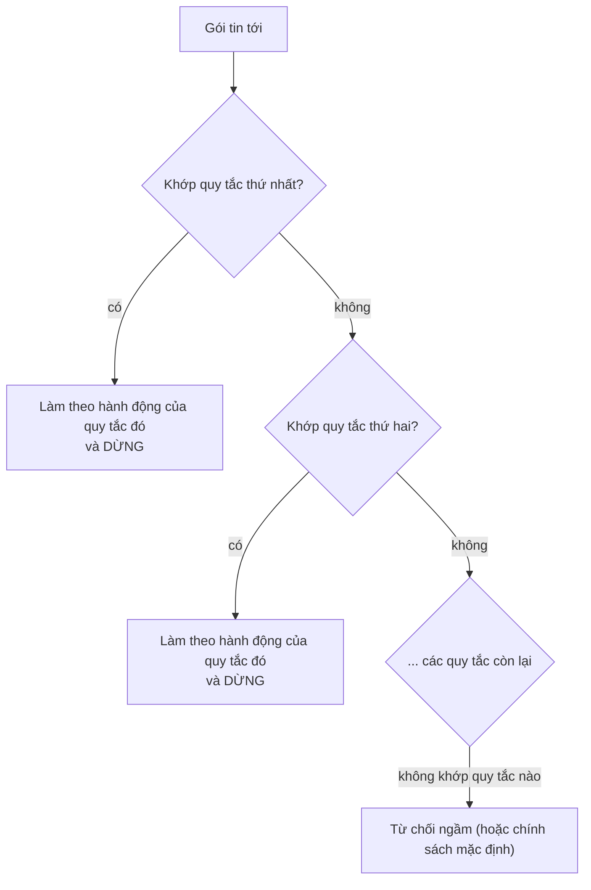

---
tags:
  - Must
  - ACL
  - Firewall
  - Concept
  - Troubleshooting
---

# Danh sách kiểm soát truy cập (ACL) xét quy tắc theo thứ tự nào, và vì sao một quy tắc "đúng" vẫn có thể không bao giờ được dùng tới?

## Metadata

```yaml
Chapter: acl
Phase: 05 — security
Importance: Must
Status: draft
Prerequisites:
  - Phase 01 / 05-cidr-subnetting
  - Phase 05 / 01-firewall-stateful-vs-stateless
Used Later:
  - Phase 05 / 03-sg-vs-nacl-concept
Estimated Reading: 30 phút
Estimated Practice: 45 phút
```

## 1. Story

<!-- Mức bắt buộc (Must): Đủ -->
<!-- DRAFT: người học cần viết lại bằng lời mình -->

Nhóm bảo mật của `shopnet` phát hiện một dải địa chỉ `203.0.113.0/24` đang quét trang web và quyết định chặn dải đó. Kỹ sư thêm một quy tắc vào ACL của subnet: **số 110, DENY, TCP 443, nguồn `203.0.113.0/24`**. Quy tắc nằm trong danh sách, tên đúng, dải đúng, cổng đúng. Nhưng nhật ký cho thấy kẻ quét vẫn truy cập được suốt hai tuần sau đó.

Nguyên nhân: ở số **100** đã có một quy tắc **ALLOW TCP 443 từ `0.0.0.0/0`**. ACL duyệt từ số nhỏ đến lớn và dừng ở quy tắc đầu tiên khớp, nên gói từ `203.0.113.5` khớp quy tắc 100 và được cho phép; quy tắc 110 **không bao giờ được xét**. Quy tắc DENY bị quy tắc ALLOW rộng hơn **che khuất** (shadowing). Chapter này giải thích ACL ra quyết định thế nào, vì sao thứ tự quan trọng đến vậy, và cách viết, kiểm tra ACL để tránh lỗi này.

## 2. Objectives

<!-- Mức bắt buộc (Must): Đủ -->
<!-- DRAFT: người học cần viết lại bằng lời mình -->

Sau chapter này bạn có thể:

- Mô tả ACL là gì và các thành phần của một quy tắc (trường khớp, hành động, thứ tự).
- Áp dụng quy tắc "khớp đầu tiên thắng" và "từ chối ngầm cuối danh sách" để dự đoán kết quả cho một gói tin.
- Nhận ra và sửa quy tắc bị che khuất (shadowing).
- Phân biệt "khớp đầu tiên" của ACL với "khớp dài nhất" của định tuyến (`02/02`).
- Kiểm tra bằng số đếm gói để biết một quy tắc có từng được dùng tới không.
- Viết một ACL đúng thứ tự cho một tình huống cho trước.

## 3. Prerequisites

<!-- Mức bắt buộc (Must): Đủ -->
<!-- DRAFT: người học cần viết lại bằng lời mình -->

> Xem lại: [cidr-subnetting](../phase-01-foundation/05-cidr-subnetting.md)
> Xem lại: [firewall-stateful-vs-stateless](01-firewall-stateful-vs-stateless.md)

Bạn cần biết đọc một dải CIDR như `203.0.113.0/24` (`01/05`), bộ năm của gói tin và khái niệm stateless (`05/01`): ACL chỉ xét **từng gói**, không nhớ kết nối.

## 4. Why it exists

<!-- Mức bắt buộc (Must): Đủ -->
<!-- DRAFT: người học cần viết lại bằng lời mình -->

Một chính sách mạng thực tế gồm nhiều điều kiện **chồng lên nhau**: "cho phép HTTPS từ mọi nơi, **trừ** dải X; cho phép SSH **chỉ** từ mạng quản trị; chặn phần còn lại". Cần một cách viết chính sách thành danh sách mà thiết bị có thể thực thi nhanh và **không mơ hồ**. **ACL (Access Control List, danh sách kiểm soát truy cập)** là danh sách có thứ tự gồm các quy tắc cho phép hoặc từ chối; thiết bị xét lần lượt và dùng quy tắc đầu tiên khớp.

Cách này đơn giản và nhanh, nhưng có một cái giá: **thứ tự là một phần của ý nghĩa**. Hai ACL gồm cùng các quy tắc nhưng khác thứ tự có thể cho kết quả hoàn toàn khác nhau.

Nếu hiểu sai:

- Quy tắc từ chối đặt sau một quy tắc cho phép rộng hơn không bao giờ có tác dụng (Story).
- Quên rằng cuối danh sách luôn có từ chối ngầm, nên thêm vài quy tắc cho phép mà không để ý chặn phần còn lại.
- Nhầm "quy tắc cụ thể hơn thắng" của định tuyến với ACL: ở ACL, **vị trí** quyết định chứ không phải độ cụ thể.

## 5. Mental model

<!-- Mức bắt buộc (Must): Đủ -->
<!-- DRAFT: người học cần viết lại bằng lời mình -->

Hình dung bảo vệ cầm **một tờ danh sách đọc từ trên xuống**. Với mỗi người đến, bảo vệ dò từng dòng; dòng đầu tiên nhắc tới người đó thì làm theo và **ngừng đọc**. Nếu dòng 1 ghi "cho tất cả mọi người vào" thì dòng 2 ghi "cấm anh A" không bao giờ được đọc tới. Muốn cấm anh A, dòng "cấm anh A" phải nằm **trước** dòng "cho tất cả vào". Cuối tờ giấy có một dòng ngầm: "những ai không có tên: từ chối".

**Tóm tắt một câu:** ACL xét quy tắc từ trên xuống và dừng ở quy tắc đầu tiên khớp, nên đặt ngoại lệ cụ thể **trước** quy tắc rộng; không khớp quy tắc nào thì bị từ chối ngầm.

## 6. How it works

<!-- Mức bắt buộc (Must): Đủ -->
<!-- DRAFT: người học cần viết lại bằng lời mình -->

Các từ cần biết:

- **ACL (danh sách kiểm soát truy cập — danh sách có thứ tự các quy tắc cho phép/từ chối dùng để lọc lưu lượng).**
- **Rule / entry (quy tắc / mục — một dòng trong ACL, gồm điều kiện khớp và hành động).**
- **First match (khớp đầu tiên — nguyên tắc dùng quy tắc đầu tiên khớp gói rồi ngừng xét).**
- **Rule shadowing (che khuất quy tắc — một quy tắc không bao giờ được dùng vì quy tắc đứng trước đã khớp mọi gói mà nó định xử lý).**
- **Rule number (số thứ tự quy tắc — số quyết định vị trí của quy tắc trong danh sách ở các hệ thống đánh số, ví dụ network ACL của AWS).**

**Một quy tắc ACL gồm:** thứ tự (hoặc số), hành động (`ALLOW`/`DENY`, đôi khi là `permit`/`deny`), và điều kiện khớp: thường là giao thức, dải địa chỉ nguồn, dải địa chỉ đích và cổng (bộ năm, `05/01`). Một số thiết bị còn phân biệt loại ACL chỉ xét địa chỉ nguồn với loại xét bộ năm đầy đủ; bạn chỉ cần nhớ ACL là danh sách có thứ tự các điều kiện.

**Cách xét một gói:**



**Đọc sơ đồ:** gói đi qua danh sách từ trên xuống; ngay khi khớp một quy tắc, hành động của quy tắc đó được áp dụng và việc xét **dừng lại**, các quy tắc phía dưới không bao giờ được xem. Chỉ khi không quy tắc nào khớp thì áp dụng mặc định cuối danh sách. Theo tài liệu `iptables`, quy tắc trong một chain được xét "từ đầu đến cuối" theo kiểu dừng ở quy tắc đầu tiên khớp, và nếu không có quy tắc nào khớp thì **chính sách của chain** quyết định số phận gói. Network ACL của AWS cũng xét theo số từ nhỏ đến lớn và dừng ở quy tắc đầu tiên khớp.

**Ví dụ.** ACL của Story (rút gọn, IP là địa chỉ tài liệu):

| Số | Hành động | Giao thức | Cổng | Nguồn |
|---|---|---|---|---|
| 100 | ALLOW | TCP | 443 | `0.0.0.0/0` |
| 110 | DENY | TCP | 443 | `203.0.113.0/24` |
| 120 | ALLOW | TCP | 22 | `192.0.2.0/24` |
| `*` (ngầm) | DENY | tất cả | tất cả | `0.0.0.0/0` |

| Gói tin | Quy tắc khớp đầu tiên | Kết quả | Ghi chú |
|---|---|---|---|
| TCP 443 từ `198.51.100.7` | 100 | ALLOW | Đúng ý |
| TCP 443 từ `203.0.113.5` | **100** | **ALLOW** | **Lẽ ra phải chặn**; quy tắc 110 không bao giờ được xét |
| TCP 22 từ `192.0.2.10` | 120 | ALLOW | Đúng ý (mạng quản trị) |
| TCP 22 từ `198.51.100.7` | `*` ngầm | DENY | Đúng ý |
| UDP 53 từ bất kỳ | `*` ngầm | DENY | Không quy tắc nào nhắc tới UDP |

**Cách sửa:** đặt quy tắc DENY **trước** quy tắc ALLOW rộng, ví dụ đổi 110 thành **90**. Khi đó gói từ `203.0.113.5` khớp 90 trước và bị DENY; mọi gói 443 khác vẫn tới quy tắc 100 và được cho phép.

**ACL "khớp đầu tiên" khác định tuyến "khớp dài nhất".** Ở định tuyến (`02/02`), nhiều dòng cùng khớp thì dòng có prefix **dài nhất** thắng, bất kể vị trí. Ở ACL, **vị trí** quyết định, bất kể độ cụ thể. Nếu quy tắc ACL ở trên được xét theo kiểu "cụ thể nhất thắng", `/24` sẽ thắng `/0` và Story không xảy ra; chính vì ACL không làm vậy mà thứ tự là nguyên nhân gây lỗi.

**ACL chỉ xét từng gói.** ACL bản thân là bộ lọc stateless (`05/01`): nếu cho phép chiều đi, bạn phải tự cho phép chiều trả lời (`05/03`). Thay đổi ACL có hiệu lực ngay trên mọi gói, kể cả gói thuộc kết nối đang chạy.

**ACL ở các nơi khác nhau:**

| Nơi | Ví dụ |
|---|---|
| Trên máy chủ | Chain `INPUT`/`OUTPUT`/`FORWARD` của `iptables` (các quy tắc được xét từ đầu đến cuối) |
| Trên giao diện của router/switch | ACL gắn vào một giao diện theo một hướng (vào hoặc ra) |
| Ở ranh giới subnet đám mây | Network ACL của AWS (`05/03`) |

> Security group (`05/03`) không dùng "khớp đầu tiên" mà xét tất cả quy tắc cho phép, nên không có hiện tượng che khuất theo thứ tự.

<!-- verified: 2026-10-05 https://ipset.netfilter.org/iptables.man.html -->
<!-- verified: 2026-10-05 https://docs.aws.amazon.com/vpc/latest/userguide/vpc-network-acls.html -->

## 7. Key settings

<!-- Mức bắt buộc (Must): Đủ -->
<!-- DRAFT: người học cần viết lại bằng lời mình -->

| Việc | Cách làm tốt |
|---|---|
| Thứ tự quy tắc | **Cụ thể và ngoại lệ trước, rộng sau**; DENY cụ thể trước ALLOW rộng |
| Đánh số | Dùng bước nhảy (10 hoặc 100) để chèn quy tắc sau này mà không phải đánh số lại |
| Quy tắc cuối | Hiểu rõ mặc định cuối (từ chối ngầm hay chính sách chain); nên tường minh nếu cần ghi log |
| Chiều | Mỗi chiều (vào/ra) có danh sách riêng; nhớ chiều trả lời (`05/03`) |
| IPv4 và IPv6 | Quy tắc riêng, không dùng chung |
| Mô tả/ghi chú | Mỗi quy tắc nêu lý do tồn tại; dễ rà soát |
| Kiểm tra | Mô phỏng trước khi áp dụng; xem số đếm gói của từng quy tắc |

**Xem số đếm trên Linux:**

```bash
iptables -L INPUT -n -v --line-numbers
```

Cột `pkts`/`bytes` cho biết **mỗi quy tắc đã khớp bao nhiêu gói**; một quy tắc có `pkts` bằng 0 trong khi bạn mong nó phải được dùng thường là dấu hiệu bị che khuất hoặc sai điều kiện. Công cụ `iptables` và `--line-numbers` được liệt kê trong tài liệu `iptables`.

## 8. AWS mapping

<!-- Mức bắt buộc (Must): Đủ nếu có liên quan AWS -->
<!-- DRAFT: người học cần viết lại bằng lời mình -->

<!-- verified: 2026-10-05 https://docs.aws.amazon.com/vpc/latest/userguide/vpc-network-acls.html -->
<!-- verified: 2026-10-05 https://docs.aws.amazon.com/vpc/latest/userguide/custom-network-acl.html -->

| Khái niệm | Trên AWS |
|---|---|
| ACL gắn vào ranh giới mạng | **Network ACL**, gắn vào subnet |
| Số thứ tự quy tắc | Mỗi quy tắc có số từ **1 đến 32766**; AWS khuyến nghị đánh số theo bước nhảy (ví dụ 10 hoặc 100) |
| Hành động | Mỗi quy tắc là ALLOW hoặc DENY |
| Từ chối ngầm | Quy tắc số `*` ở cuối, **không sửa hay xóa được**, từ chối mọi gói chưa khớp |

Theo tài liệu AWS, network ACL xét quy tắc **theo số tăng dần** và khi gói khớp một quy tắc thì quy tắc đó được áp dụng và **không xét thêm quy tắc nào khác**. Quy tắc chỉ được xét khi lưu lượng **vào hoặc ra khỏi subnet**, không xét lưu lượng trong cùng subnet. IPv4 và IPv6 được xét riêng. Ví dụ AWS đưa ra: gói tới cổng HTTPS không khớp quy tắc 100 hay 105 nhưng khớp 110 (cho phép), còn gói tới cổng 139 không khớp quy tắc nào nên bị quy tắc `*` từ chối. Câu chuyện che khuất ở Story cũng áp dụng nguyên văn cho network ACL: một quy tắc DENY có số **lớn hơn** một quy tắc ALLOW rộng khớp cùng gói sẽ không có tác dụng.

Chi tiết cấu hình và gỡ lỗi ở `06/03`, `06/11`. Tài liệu AWS có thể thay đổi; kiểm tra lại trước khi dựa vào chi tiết.

## 9. Hands-on lab

<!-- Mức bắt buộc (Must): Đủ + expected-output.txt -->
<!-- DRAFT: người học cần viết lại bằng lời mình -->

Chi tiết ở `labs/phase-05-security/chapter-02-acl/README.md`.

**1. Predict (tính tay):** với ACL ở mục 6, dự đoán kết quả cho năm gói trong bảng ví dụ, rồi cho gói TCP 443 từ `203.0.113.5` **sau khi đổi số quy tắc 110 thành 90**.

**2. Run — mô phỏng bằng Python:**

```bash
python3 - <<'PY'
import ipaddress as i

def evaluate(rules, proto, port, src):
    for num, action, r_proto, r_port, r_src in sorted(rules, key=lambda r: r[0]):
        if r_proto in ('any', proto) and r_port in ('any', port) and i.ip_address(src) in i.ip_network(r_src):
            return f"{action} (quy tắc {num})"
    return "DENY (từ chối ngầm *)"

story = [
    (100, 'ALLOW', 'tcp', 443, '0.0.0.0/0'),
    (110, 'DENY',  'tcp', 443, '203.0.113.0/24'),
    (120, 'ALLOW', 'tcp', 22,  '192.0.2.0/24'),
]
fixed = [(90 if r[0] == 110 else r[0],) + r[1:] for r in story]

packets = [('tcp', 443, '198.51.100.7'), ('tcp', 443, '203.0.113.5'),
           ('tcp', 22, '192.0.2.10'), ('tcp', 22, '198.51.100.7'), ('udp', 53, '198.51.100.7')]
for label, rules in (('GỐC (Story)', story), ('ĐÃ SỬA (110 -> 90)', fixed)):
    print('===', label)
    for p in packets:
        print(' ', p, '->', evaluate(rules, *p))
PY
```

**3. Verify:** so kết quả với dự đoán. Đáp án (phép tính) để tự đối chiếu:

??? success "Đáp án (tính toán, không phải output lab)"
    ACL gốc: `443 từ 198.51.100.7` → ALLOW (100); `443 từ 203.0.113.5` → **ALLOW (100)**, quy tắc 110 bị che; `22 từ 192.0.2.10` → ALLOW (120); `22 từ 198.51.100.7` → DENY ngầm; `UDP 53` → DENY ngầm. ACL đã sửa: chỉ khác ở gói `443 từ 203.0.113.5` → **DENY (quy tắc 90)**.

Output thật: `[CHƯA CHẠY]`.

## 10. Break it

<!-- Mức bắt buộc (Must): Đủ (≥ 1 Break it) -->
<!-- DRAFT: người học cần viết lại bằng lời mình -->

**Gây lỗi che khuất bằng `iptables` trong container** và nhìn nó qua số đếm gói:

```powershell
docker run --rm -it --cap-add NET_ADMIN alpine sh
```

Trong container (chính sách mặc định của chain là ACCEPT):

```sh
apk add --no-cache iptables
(nc -l -p 8080 >/dev/null &)
iptables -A INPUT -p tcp --dport 8080 -j ACCEPT
iptables -A INPUT -p tcp --dport 8080 -s 127.0.0.1 -j DROP
echo hi | nc -w 2 127.0.0.1 8080; echo "mã thoát (DROP bị che): $?"
iptables -L INPUT -n -v --line-numbers
iptables -D INPUT 2
iptables -I INPUT 1 -p tcp --dport 8080 -s 127.0.0.1 -j DROP
(nc -l -p 8080 >/dev/null &)
echo hi | nc -w 2 127.0.0.1 8080; echo "mã thoát (DROP đặt trước): $?"
iptables -L INPUT -n -v --line-numbers
```

**Dự đoán:**

- Lần đầu: quy tắc ACCEPT (số 1) khớp trước nên kết nối **thành công** (mã thoát 0) dù có quy tắc DROP ở số 2. Trong bảng đếm, quy tắc 1 có `pkts` lớn hơn 0 còn quy tắc DROP có `pkts` bằng **0**: bằng chứng nó chưa bao giờ được dùng tới.
- Sau khi đưa DROP lên đầu: kết nối **bị chặn** (hết thời gian, mã thoát khác 0), và quy tắc DROP (nay là số 1) có `pkts` lớn hơn 0.

**Ý nghĩa:** chính thứ tự quyết định kết quả; số đếm gói là cách nhanh nhất để thấy một quy tắc bị che.

**Khôi phục:** `exit`; container `--rm` tự xóa (quy tắc `iptables` biến mất cùng container).

Kết quả thật: `[CHƯA CHẠY]`.

## 11. Troubleshooting

<!-- Mức bắt buộc (Must): Đủ -->
<!-- DRAFT: người học cần viết lại bằng lời mình -->

Triệu chứng chính: **quy tắc "có vẻ đúng" nhưng hành vi mạng không như mong muốn.**

| Triệu chứng | Giả thuyết đầu tiên | Kiểm tra | Công cụ |
|---|---|---|---|
| Quy tắc chặn không có tác dụng (Story) | Bị quy tắc ALLOW rộng đứng trước che khuất | Liệt kê quy tắc theo thứ tự; tìm quy tắc trước đó khớp cùng gói; số đếm `pkts` của quy tắc chặn bằng 0 | `iptables -L -n -v --line-numbers`; đọc bảng ACL theo số tăng dần |
| Sau khi thêm vài quy tắc ALLOW, mọi thứ khác bỗng bị chặn | Từ chối ngầm ở cuối danh sách | Có quy tắc nào cho phép lưu lượng đó không | Đọc toàn bộ ACL |
| Chiều đi chạy, kết nối vẫn treo | Thiếu quy tắc chiều trả lời (cổng tạm thời) | Quy tắc hai chiều | `05/03`, bắt gói (`00/03`) |
| Quy tắc cho IPv4 mà người dùng IPv6 vẫn bị chặn/lọt | IPv4 và IPv6 là quy tắc riêng | Có quy tắc IPv6 tương ứng không | Đọc ACL theo từng họ địa chỉ |
| Thay đổi ACL làm đứt cả kết nối đang chạy | ACL stateless, áp dụng ngay cho mọi gói | Quy tắc vừa thêm/đổi | So sánh trước/sau khi đổi |
| Lưu lượng trong cùng subnet không bị chặn bởi network ACL | ACL của subnet chỉ xét lưu lượng vào/ra subnet | Hai máy có cùng subnet không | Dùng security group cho lưu lượng nội bộ |

Ghi kết quả thật của mục 10: `[CHƯA CHẠY]`.

## 12. Security & cost

<!-- Mức bắt buộc (Must): Đủ -->
<!-- DRAFT: người học cần viết lại bằng lời mình -->

- **Thứ tự sai là lỗ hổng âm thầm:** quy tắc chặn có thể tồn tại mà không có tác dụng (Story). Rà soát ACL định kỳ và kiểm tra bằng số đếm gói hoặc công cụ mô phỏng.
- **Từ chối mặc định:** kết thúc bằng từ chối (ngầm hoặc tường minh); chỉ cho phép những gì cần.
- **Không mở `0.0.0.0/0` cho cổng quản trị** (SSH 22, RDP 3389); chỉ mạng quản trị cụ thể.
- **Thay đổi ACL cần review và kế hoạch quay lui:** nó có hiệu lực tức thì trên mọi gói, kể cả kết nối đang chạy; một dòng sai có thể gây gián đoạn diện rộng.
- **Ghi log lưu lượng bị chặn** để phát hiện quét/tấn công, cân nhắc chi phí lưu trữ log.
- ACL chỉ lọc theo địa chỉ, giao thức và cổng; không thấy nội dung. Cần thêm các lớp khác (`05/01`, `04/06`).
- Không dán ACL thật (dải nội bộ, ID) vào tài liệu công khai.
- **Chi phí:** lab local không phát sinh. Theo tài liệu AWS, network ACL không tính phí thêm.

## 13. Misconceptions

<!-- Mức bắt buộc (Must): Đủ -->
<!-- DRAFT: người học cần viết lại bằng lời mình -->

| Hiểu nhầm | Sự thật |
|---|---|
| "Thứ tự quy tắc ACL không quan trọng" | Quy tắc đầu tiên khớp thắng; đổi thứ tự có thể đổi kết quả |
| "Quy tắc cụ thể hơn luôn thắng" | Đó là định tuyến (`02/02`). Ở ACL, **vị trí** quyết định, không phải độ cụ thể |
| "Quy tắc DENY luôn có hiệu lực" | Không nếu có quy tắc ALLOW khớp đứng trước |
| "ACL không khớp thì cho đi qua" | Thường là từ chối ngầm ở cuối (hoặc theo chính sách mặc định của chain) |
| "ACL nhớ kết nối nên chỉ cần mở một chiều" | ACL stateless; cần quy tắc cho cả chiều trả lời |
| "Đổi ACL không ảnh hưởng kết nối đang chạy" | ACL stateless nên áp dụng ngay, có thể cắt kết nối đang chạy |
| "Có ACL là đủ bảo vệ" | ACL chỉ xét địa chỉ/giao thức/cổng, không xét nội dung |

## 14. Interview questions

<!-- Mức bắt buộc (Must): Đủ -->
<!-- DRAFT: người học cần viết lại bằng lời mình -->

### Q1 (Junior) — ACL xử lý một gói tin như thế nào khi có nhiều quy tắc cùng khớp?

**Gợi ý ý chính:**
- Quy tắc nào được dùng?
- Các quy tắc phía sau có được xét nữa không?

??? success "Đáp án mẫu (tự trả lời trước khi mở)"
    ACL xét quy tắc từ trên xuống (theo số tăng dần) và dùng quy tắc đầu tiên khớp, rồi dừng; các quy tắc sau không được xét. Không khớp quy tắc nào thì áp dụng mặc định cuối (thường từ chối ngầm).

### Q2 (Junior) — ACL "khớp đầu tiên" khác định tuyến "khớp dài nhất" thế nào?

**Gợi ý ý chính:**
- Cái gì quyết định ở mỗi cơ chế: vị trí hay độ cụ thể?

??? success "Đáp án mẫu (tự trả lời trước khi mở)"
    Định tuyến chọn route có prefix dài nhất (cụ thể nhất) bất kể vị trí. ACL chọn quy tắc đầu tiên khớp theo thứ tự, bất kể độ cụ thể; vì vậy người viết ACL phải tự đặt quy tắc cụ thể trước quy tắc rộng.

### Q3 (Middle) — Bạn cần chặn một dải địa chỉ trong khi vẫn cho phép HTTPS từ mọi nơi. Bạn đặt quy tắc ở đâu?

**Gợi ý ý chính:**
- DENY cụ thể và ALLOW rộng, cái nào đứng trước?
- Làm sao kiểm tra quy tắc có hiệu lực?

??? success "Đáp án mẫu (tự trả lời trước khi mở)"
    Đặt quy tắc DENY cho dải đó **trước** quy tắc ALLOW HTTPS rộng (số nhỏ hơn). Kiểm tra bằng mô phỏng hoặc số đếm gói của quy tắc DENY (phải lớn hơn 0 khi có lưu lượng từ dải đó) và bằng thử nghiệm từ một địa chỉ thuộc dải.

### Q4 (Middle) — Quy tắc DENY của bạn có `pkts` bằng 0 dù đã có lưu lượng từ dải đó. Bạn nghi gì?

**Gợi ý ý chính:**
- Có quy tắc nào đứng trước khớp cùng gói không?
- Điều kiện của quy tắc có đúng không?

??? success "Đáp án mẫu (tự trả lời trước khi mở)"
    Quy tắc bị che khuất bởi một quy tắc ALLOW rộng đứng trước, hoặc điều kiện khớp sai (dải, cổng, giao thức, chiều). Đọc ACL theo thứ tự, so quy tắc trước đó với một gói mẫu, và sửa thứ tự/điều kiện.

## 15. Exercises

<!-- Mức bắt buộc (Must): Đủ -->
<!-- DRAFT: người học cần viết lại bằng lời mình -->

1. **Đánh giá bằng tay.** Cho ACL: 10 ALLOW TCP 443 từ `10.0.0.0/8`; 20 DENY TCP 443 từ `10.0.5.0/24`; 30 ALLOW TCP 22 từ `192.0.2.0/24`. *Deliverable:* bảng kết quả cho 6 gói bạn chọn (có gói từ `10.0.5.9` tới 443), và chỉ ra quy tắc bị che khuất cùng cách sửa.
2. **Tự viết ACL.** Dịch vụ HTTPS công khai, SSH chỉ từ mạng quản trị `192.0.2.0/24`, chặn dải `198.51.100.0/24`. *Deliverable:* bảng quy tắc đúng thứ tự (số, hành động, giao thức, cổng, nguồn), kèm quy tắc cho chiều trả lời nếu là ACL stateless (`05/03`).
3. **Mô phỏng nâng cao.** Mở rộng script Python ở mục 9 để in ra các quy tắc **không bao giờ được khớp** bởi bất kỳ gói nào trong một tập gói mẫu. *Deliverable:* đoạn mã và kết quả chạy với ACL của Story.
4. **Phân tích Story.** *Deliverable:* đoạn 4–6 câu giải thích cho quản lý vì sao quy tắc chặn không có tác dụng trong hai tuần, và đề xuất cách phát hiện sớm (số đếm gói, rà soát, kiểm thử).

## 16. Cheat sheet

<!-- Mức bắt buộc (Must): Đủ -->
<!-- DRAFT: người học cần viết lại bằng lời mình -->

| Mục | Nội dung |
|---|---|
| Quy tắc xét | Từ trên xuống / số tăng dần, **khớp đầu tiên thắng** |
| Không khớp | Từ chối ngầm (hoặc chính sách chain) |
| Che khuất | Quy tắc sau bị quy tắc trước (rộng hơn) khớp trước; DENY cụ thể phải đứng **trước** ALLOW rộng |
| Khác định tuyến | Định tuyến: dài nhất thắng; ACL: vị trí quyết định |
| Stateless | Cần quy tắc chiều trả lời; đổi ACL có hiệu lực ngay |
| Số thứ tự | Bước nhảy 10/100; AWS: 1–32766 |
| Kiểm tra | `iptables -L -n -v --line-numbers`; `pkts` bằng 0 = quy tắc chưa từng được dùng |

**Debug:** đọc ACL từ trên xuống với một gói mẫu → quy tắc nào khớp đầu tiên → có bị che không → số đếm gói.

## 17. Glossary terms

<!-- Mức bắt buộc (Must): Đủ -->
<!-- DRAFT: người học cần viết lại bằng lời mình -->

- ACL / danh sách kiểm soát truy cập / アクセスコントロールリスト
- Rule / quy tắc / ルール
- First match / khớp đầu tiên / 最初に一致
- Rule shadowing / che khuất quy tắc / ルールのシャドーイング
- Rule number / số thứ tự quy tắc / ルール番号

## 18. Further reading

<!-- Mức bắt buộc (Must): Đủ -->
<!-- DRAFT: người học cần viết lại bằng lời mình -->

Kiểm tra ngày 2026-10-05:

- `iptables(8)`: https://ipset.netfilter.org/iptables.man.html
- Amazon VPC — Network ACLs: https://docs.aws.amazon.com/vpc/latest/userguide/vpc-network-acls.html
- Amazon VPC — Custom network ACLs: https://docs.aws.amazon.com/vpc/latest/userguide/custom-network-acl.html
