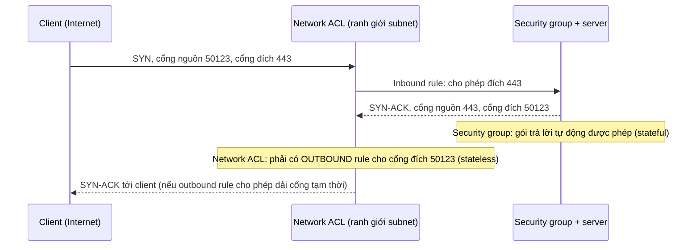
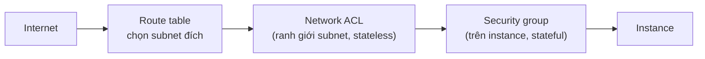

---
tags:
  - Must
  - Firewall
  - Concept
  - Troubleshooting
---

# Security group và network ACL khác nhau ở đâu, và vì sao quy tắc "đúng" vẫn có thể làm kết nối treo? (SG và NACL, mức khái niệm)

## Metadata

```yaml
Chapter: sg-vs-nacl-concept
Phase: 05 — security
Importance: Must
Status: draft
Prerequisites:
  - Phase 05 / 01-firewall-stateful-vs-stateless
  - Phase 05 / 02-acl
Used Later:
  - Phase 06 / 03-security-group-and-nacl
Estimated Reading: 40 phút
Estimated Practice: 50 phút
```

## 1. Story

<!-- Mức bắt buộc (Must): Đủ -->
<!-- DRAFT: người học cần viết lại bằng lời mình -->

Nhóm `shopnet` muốn siết thêm một lớp bảo vệ cho subnet của các web server, nên tạo một network ACL riêng. Họ copy tinh thần của security group đang chạy tốt: **inbound cho phép cổng 443 từ mọi nơi, outbound chỉ cho phép cổng 443**. Security group vẫn nguyên, không đổi gì. Sau khi gắn ACL mới vào subnet, người dùng bắt đầu **treo kết nối**: trình duyệt quay mãi rồi hết thời gian. Health check vẫn xanh trong vài giây rồi đổi đỏ. Security group "đúng", ACL "có vẻ đúng", mà kết nối không đi được.

Lý do: security group **nhớ** kết nối nên gói trả lời tự động được phép, còn network ACL **không nhớ**, nên gói trả lời (đi ra từ cổng 443 của server tới một **cổng tạm thời** ngẫu nhiên của client) bị chặn vì chiều outbound chỉ cho phép *đích* là cổng 443. Đây là hiểu lầm kinh điển khi chuyển từ security group sang network ACL. Chapter này giải thích sự khác biệt, theo mức khái niệm, để bạn thiết kế và chẩn đoán đúng.

## 2. Objectives

<!-- Mức bắt buộc (Must): Đủ -->
<!-- DRAFT: người học cần viết lại bằng lời mình -->

Sau chapter này bạn có thể:

- Giải thích bộ lọc có trạng thái (stateful) khác không trạng thái (stateless) ở chỗ nào, và hệ quả với chiều trả lời.
- Giải thích cổng tạm thời (ephemeral port) là gì và vì sao quy tắc stateless phải mở dải này.
- So sánh security group và network ACL của AWS theo năm tiêu chí: tầng áp dụng, loại quy tắc, cách duyệt quy tắc, xử lý chiều trả lời, mặc định.
- Viết một bộ quy tắc network ACL đúng cho một dịch vụ HTTPS (cả hai chiều) và chỉ ra chỗ thường sai.
- Chẩn đoán "ACCEPT chiều này nhưng REJECT chiều kia" và lỗi hai máy cùng security group không nói chuyện được với nhau.

## 3. Prerequisites

<!-- Mức bắt buộc (Must): Đủ -->
<!-- DRAFT: người học cần viết lại bằng lời mình -->

> Xem lại: [firewall-stateful-vs-stateless](01-firewall-stateful-vs-stateless.md)
> Xem lại: [acl](02-acl.md)

Hai chapter trên (khái niệm firewall và ACL) hiện chưa viết; chapter này **giới thiệu tối thiểu** những gì cần dùng (mục 6), và sẽ được rút gọn và liên kết lại khi chúng có. Bạn cũng cần nhớ bắt tay TCP và trạng thái kết nối (`04/01`), cổng (`04/04`, tạm thời giới thiệu ở mục 6), và ICMP có thể bị chặn riêng (`03/04`).

## 4. Why it exists

<!-- Mức bắt buộc (Must): Đủ -->
<!-- DRAFT: người học cần viết lại bằng lời mình -->

Mạng cần quy tắc "ai được nói chuyện với ai, qua cổng nào". Có hai cách xây bộ lọc:

- **Bộ lọc có trạng thái (stateful)** theo dõi các kết nối đang diễn ra. Khi bạn cho phép *chiều khởi tạo*, nó tự cho phép *chiều trả lời* của chính kết nối đó. Quy tắc đơn giản, ít sai, nhưng thiết bị phải tốn bộ nhớ để nhớ kết nối.
- **Bộ lọc không trạng thái (stateless)** xét **từng gói riêng lẻ** theo quy tắc, không nhớ gì. Nhanh và đơn giản về cơ chế, nhưng bạn phải **tự viết quy tắc cho cả hai chiều**.

AWS cung cấp cả hai ở hai vị trí khác nhau: **security group** (có trạng thái, gắn vào tài nguyên) và **network ACL** (không trạng thái, gắn vào subnet). Có hai lớp giúp phòng thủ nhiều tầng: nếu quên gắn đúng security group cho một instance, ACL của subnet vẫn còn là lớp chặn thô.

Nếu hiểu sai:

- Viết quy tắc network ACL như viết security group → chiều trả lời bị chặn, kết nối treo (Story).
- Tưởng security group có quy tắc từ chối → thực tế chỉ có quy tắc cho phép.
- Tưởng network ACL lọc cả lưu lượng giữa các máy trong cùng subnet → thực tế không.

## 5. Mental model

<!-- Mức bắt buộc (Must): Đủ -->
<!-- DRAFT: người học cần viết lại bằng lời mình -->

Hình dung hai kiểu bảo vệ ở một tòa nhà:

- **Bảo vệ cổng tòa nhà (network ACL):** đứng ở ranh giới khu, kiểm tra giấy tờ của **mọi người ra và vào**, và **không nhớ** ai đã đi vào. Người đã được vào, khi đi ra vẫn bị kiểm tra như người lạ: phải có quy tắc cho lúc ra.
- **Lễ tân từng phòng (security group):** nhớ "người này vào theo lời mời của tôi" nên khi họ rời phòng thì không hỏi lại.

**Tóm tắt một câu:** security group nhớ kết nối nên chỉ cần mở chiều khởi tạo; network ACL không nhớ nên phải mở cả chiều đi và chiều trả lời, kể cả dải cổng tạm thời.

## 6. How it works

<!-- Mức bắt buộc (Must): Đủ -->
<!-- DRAFT: người học cần viết lại bằng lời mình -->

Các từ cần biết:

- **Stateful (có trạng thái — bộ lọc nhớ các kết nối đang diễn ra nên tự cho phép gói trả lời của kết nối đã được phép).**
- **Stateless (không trạng thái — bộ lọc xét từng gói riêng lẻ, không nhớ gói trước).**
- **Ephemeral port (cổng tạm thời — cổng ngẫu nhiên mà client chọn làm cổng nguồn cho một kết nối; server trả lời về đúng cổng này).**
- **Connection tracking (theo dõi kết nối — cơ chế bộ lọc stateful dùng để nhớ từng kết nối).**
- **Implicit deny (từ chối ngầm — gói không khớp quy tắc nào bị từ chối).**
- **Security group (nhóm bảo mật của AWS — bộ lọc stateful gắn vào network interface/tài nguyên, chỉ có quy tắc cho phép).**
- **Network ACL (danh sách kiểm soát truy cập mạng của AWS — bộ lọc stateless gắn vào subnet, có cả quy tắc cho phép lẫn từ chối).**
- **Defense in depth (phòng thủ nhiều lớp — dùng nhiều lớp bảo vệ độc lập để một lớp sai không làm hở cả hệ thống).**

**Cổng tạm thời.** Khi client mở kết nối tới `server:443`, **cổng đích** là 443 (cố định, ai cũng biết), còn **cổng nguồn** là một số ngẫu nhiên do hệ điều hành của client chọn (cổng tạm thời). Gói trả lời đi theo chiều ngược: **cổng nguồn 443, cổng đích là cổng tạm thời đó**. Vì client có thể chọn bất kỳ cổng nào trong một dải, quy tắc stateless cho chiều trả lời phải mở cả **dải** cổng tạm thời.



**Đọc sơ đồ:** gói đầu tiên đi qua ACL (inbound, đích 443) rồi đến security group; cả hai cho phép. Gói trả lời đi ngược: security group **không cần** quy tắc outbound riêng vì nhớ kết nối, nhưng network ACL **xét lại** gói này như một gói mới ở chiều outbound, với cổng đích là cổng tạm thời (ở ví dụ là 50123). Nếu outbound chỉ cho phép cổng đích 443 (Story), gói bị loại bỏ, client không bao giờ nhận SYN-ACK và kết nối treo ở `SYN-SENT` (`04/01`).

**Dải cổng tạm thời phụ thuộc client.** Theo tài liệu AWS: nhiều nhân Linux (kể cả Amazon Linux) dùng 32768–61000; Windows Server 2008 trở lên dùng 49152–65535; yêu cầu xuất phát từ Elastic Load Balancing, NAT gateway và AWS Lambda dùng 1024–65535. Vì khó biết trước client là ai, thực tế người ta thường mở **1024–65535** cho chiều trả lời, và đặt các quy tắc từ chối cổng độc hại **trước** các quy tắc cho phép dải rộng.

**So sánh security group và network ACL** (theo tài liệu AWS):

| Tiêu chí | Security group | Network ACL |
|---|---|---|
| Mức áp dụng | Instance (network interface) | Subnet |
| Phạm vi | Mọi tài nguyên gắn với nhóm đó | Mọi tài nguyên trong các subnet gắn với ACL |
| Loại quy tắc | **Chỉ cho phép** (không có từ chối) | Cho phép và từ chối |
| Duyệt quy tắc | Xét **tất cả** quy tắc rồi mới quyết định | Duyệt theo số **tăng dần**, dừng ở quy tắc đầu tiên khớp |
| Chiều trả lời | **Tự động** được phép (stateful) | **Phải** được phép tường minh (stateless) |

**Mặc định:**

- Security group mới: **không có** quy tắc inbound (không cho gì vào), có một quy tắc outbound cho phép **tất cả**.
- Network ACL **mặc định** của VPC: cho phép tất cả inbound và outbound. Network ACL **tự tạo** (custom): có quy tắc `*` từ chối mọi thứ không khớp, nên **chặn hết cho đến khi bạn thêm quy tắc cho phép**; và với mỗi quy tắc bạn thêm cần có quy tắc cho chiều trả lời.
- Quy tắc ACL đánh số từ 1 đến 32766, nên bắt đầu theo bước nhảy (10 hoặc 100) để còn chỗ chèn; IPv4 và IPv6 được xét **riêng**.



**Đọc sơ đồ:** lưu lượng vào phải qua **hai cổng** theo thứ tự: network ACL ở ranh giới subnet, rồi security group ở instance; **cả hai** phải cho phép. Network ACL chỉ xét lưu lượng **đi vào hoặc ra khỏi subnet**, không xét lưu lượng giữa hai instance **trong cùng subnet**; trong trường hợp đó chỉ còn security group.

**Tham chiếu một security group làm nguồn.** Quy tắc có thể dùng ID của một security group khác (hoặc chính nó) làm nguồn: nó cho phép lưu lượng từ các instance gắn với nhóm đó (dùng địa chỉ private của chúng); không có quy tắc nào của nhóm kia được copy sang. Hai hệ quả:

- Hai instance **cùng security group không tự nói chuyện được với nhau**: phải thêm một quy tắc rõ ràng (ví dụ nguồn là chính nhóm đó) để cho phép.
- Nếu lưu lượng giữa hai instance bị định tuyến qua một thiết bị trung gian (middlebox) thì tham chiếu security group **không đủ**; phải dùng địa chỉ private hoặc CIDR của subnet làm nguồn.

**Khuyến nghị thiết kế (theo AWS):** dùng security group làm cơ chế **chính** (linh hoạt hơn nhờ stateful và khả năng tham chiếu nhóm), và dùng network ACL như lớp thứ hai: chặn một nhóm lưu lượng cụ thể hoặc làm hàng rào thô ở mức subnet, hữu ích khi một instance lỡ được tạo mà thiếu security group đúng.

> Chi tiết cấu hình thực tế ở `06/03`; theo dõi ACCEPT/REJECT ở `06/11`; firewall tổng quát ở `05/01`, `05/02`.

<!-- verified: 2026-10-05 https://docs.aws.amazon.com/vpc/latest/userguide/infrastructure-security.html -->
<!-- verified: 2026-10-05 https://docs.aws.amazon.com/vpc/latest/userguide/security-group-rules.html -->
<!-- verified: 2026-10-05 https://docs.aws.amazon.com/vpc/latest/userguide/custom-network-acl.html -->
<!-- verified: 2026-10-05 https://docs.aws.amazon.com/vpc/latest/userguide/default-network-acl.html -->
<!-- verified: 2026-10-05 https://docs.aws.amazon.com/vpc/latest/userguide/vpc-network-acls.html -->

## 7. Key settings

<!-- Mức bắt buộc (Must): Đủ -->
<!-- DRAFT: người học cần viết lại bằng lời mình -->

**Một bộ quy tắc network ACL đúng cho dịch vụ HTTPS** (mô tả khái niệm, giả sử máy khách trên Internet; rút gọn từ ví dụ của AWS):

| Chiều | Số | Giao thức | Cổng | Nguồn / Đích | Hành động | Ý nghĩa |
|---|---|---|---|---|---|---|
| Inbound | 100 | TCP | 443 | `0.0.0.0/0` | ALLOW | Yêu cầu HTTPS tới server |
| Inbound | 140 | TCP | 1024–65535 | `0.0.0.0/0` | ALLOW | Trả lời cho các kết nối do **subnet khởi tạo** (ví dụ gọi API ra ngoài) |
| Outbound | 100 | TCP | 1024–65535 | `0.0.0.0/0` | ALLOW | **Trả lời** cho yêu cầu HTTPS (cổng đích là cổng tạm thời của client) |
| Outbound | 110 | TCP | 443 | `0.0.0.0/0` | ALLOW | Server tự khởi tạo kết nối HTTPS ra ngoài |
| cả hai | `*` | Tất cả | Tất cả | `0.0.0.0/0` | DENY | Mọi thứ còn lại bị từ chối (không sửa/xóa được) |

Điểm mấu chốt là hai dòng "trả lời" (inbound 140 và outbound 100): thiếu chúng là Story.

**Khi viết quy tắc:**

| Việc | Cách làm |
|---|---|
| Chiều trả lời với ACL | Luôn thêm quy tắc cho dải cổng tạm thời |
| Đánh số | Bước nhảy 10/100 để chèn sau này |
| Từ chối cụ thể trong dải rộng | Đặt quy tắc DENY **trước** (số nhỏ hơn) quy tắc ALLOW rộng |
| IPv6 | Quy tắc riêng, không dùng chung với IPv4 |
| Security group cho SSH/RDP | Chỉ nguồn cụ thể, **không** `0.0.0.0/0` |
| Chia sẻ giữa instance cùng nhóm | Quy tắc tham chiếu chính nhóm đó |

## 8. AWS mapping

<!-- Mức bắt buộc (Must): Đủ nếu có liên quan AWS -->
<!-- DRAFT: người học cần viết lại bằng lời mình -->

Toàn bộ chapter này là mức khái niệm gắn với AWS; các tài nguyên liên quan:

| Khái niệm | Tài nguyên AWS |
|---|---|
| Bộ lọc stateful ở instance | Security group (gắn vào network interface/tài nguyên) |
| Bộ lọc stateless ở subnet | Network ACL (gắn vào subnet) |
| Công cụ gỡ lỗi khả năng liên lạc | Reachability Analyzer, VPC Flow Logs (xem `06/11`) |

Chi tiết cần nhớ (theo tài liệu AWS):

- Mỗi subnet **phải** gắn với đúng **một** network ACL tại một thời điểm; một ACL có thể gắn với nhiều subnet. Subnet không gắn ACL tường minh sẽ dùng ACL mặc định.
- Security group và network ACL **không lọc** lưu lượng tới/từ một số dịch vụ hạ tầng của AWS (như Amazon DNS, DHCP, metadata của EC2, Amazon Time Sync Service); chặn DNS của Route 53 Resolver cần dịch vụ khác (DNS Firewall).
- Nếu network ACL của subnet backend có quy tắc **DENY** cho mọi lưu lượng từ `0.0.0.0/0` hoặc từ CIDR của subnet, load balancer **không** thực hiện được health check lên instance.
- Cả security group lẫn network ACL **không tính phí thêm**.
- Tài liệu AWS có thể thay đổi; kiểm tra lại trước khi dựa vào chi tiết.

## 9. Hands-on lab

<!-- Mức bắt buộc (Must): Đủ + expected-output.txt -->
<!-- DRAFT: người học cần viết lại bằng lời mình -->

Chi tiết ở `labs/phase-05-security/chapter-03-sg-vs-nacl-concept/README.md`. Lab này **mô phỏng** ý tưởng stateful/stateless bằng `iptables` trong container (không dùng AWS, không tốn chi phí). Hành vi của `iptables` tương tự nhưng **không giống hệt** security group/network ACL.

**1. Predict:** trong một container có server cổng 8080 và client trên cùng máy (qua loopback):

- Nếu chỉ cho phép gói **đến cổng 8080** (mặc định chặn mọi thứ vào), kết nối có thành công không?
- Nếu thêm quy tắc "gói thuộc kết nối đã được phép thì cho qua" (stateful), kết nối có thành công không?
- Nếu thay vì stateful, ta mở dải cổng tạm thời `1024:65535` (stateless), kết nối có thành công không?

**2. Run:**

```powershell
docker run --rm -it --cap-add NET_ADMIN alpine sh
```

```sh
apk add --no-cache iptables
(nc -l -p 8080 >/dev/null &)
iptables -P INPUT DROP
iptables -A INPUT -i lo -p tcp --dport 8080 -j ACCEPT
echo "--- 1. chỉ cho phép đích 8080 (stateless thiếu chiều trả lời)"
echo hi | nc -w 3 127.0.0.1 8080; echo "mã thoát: $?"
iptables -I INPUT 1 -m conntrack --ctstate ESTABLISHED,RELATED -j ACCEPT
echo "--- 2. thêm quy tắc stateful"
echo hi | nc -w 3 127.0.0.1 8080; echo "mã thoát: $?"
iptables -D INPUT -m conntrack --ctstate ESTABLISHED,RELATED -j ACCEPT
iptables -A INPUT -i lo -p tcp --dport 1024:65535 -j ACCEPT
echo "--- 3. bỏ stateful, mở dải cổng tạm thời (stateless đúng)"
echo hi | nc -w 3 127.0.0.1 8080; echo "mã thoát: $?"
```

**3. Verify:** ghi lại mã thoát ba lần và giải thích.

Output thật: `[CHƯA CHẠY]`.

## 10. Break it

<!-- Mức bắt buộc (Must): Đủ (≥ 1 Break it) -->
<!-- DRAFT: người học cần viết lại bằng lời mình -->

Bài ở mục 9 chính là Break it: nó tái hiện Story trên máy bạn.

**Dự đoán:**

- **Bước 1** (chỉ cho phép đích 8080, mặc định chặn): kết nối **treo rồi thất bại** (hết 3 giây, mã thoát khác 0). Gói SYN tới cổng 8080 được phép, nhưng gói SYN-ACK trả về có **cổng đích là cổng tạm thời** nên bị loại bỏ. Đây là "chiều đúng nhưng chiều trả lời bị chặn", y hệt network ACL thiếu quy tắc outbound cho cổng tạm thời.
- **Bước 2** (thêm quy tắc stateful): **thành công** (mã thoát 0): gói trả lời thuộc kết nối đã được phép nên tự qua, y hệt security group.
- **Bước 3** (bỏ quy tắc stateful, mở `1024:65535`): **thành công**: mở dải cổng tạm thời cũng sửa được, y hệt cách sửa network ACL; nhưng bạn phải tự mở và mở khá rộng.

**Ý nghĩa:** hai cách sửa cho cùng một kết quả: nhớ kết nối (stateful) hay mở dải cổng (stateless). Cách thứ hai buộc bạn cho phép rộng hơn, đó là lý do network ACL thường dùng làm lớp thô còn security group là lớp chính.

Nếu `apk add`/`iptables`/`conntrack` không chạy được trong môi trường của bạn, ghi lại lý do và làm bài tập 2 (mục 15) bằng giấy.

**Khôi phục:** `exit`; container `--rm` tự xóa (quy tắc `iptables` biến mất cùng container).

Kết quả thật: `[CHƯA CHẠY]`.

## 11. Troubleshooting

<!-- Mức bắt buộc (Must): Đủ -->
<!-- DRAFT: người học cần viết lại bằng lời mình -->

Triệu chứng chính: **kết nối treo/timeout dù security group "đúng".** Nghi network ACL ở chiều trả lời.

| Bước | Kiểm tra | Công cụ |
|---|---|---|
| 1 | Là timeout (không có trả lời) hay refused (RST)? | Thông báo lỗi; `04/01` |
| 2 | Phía server có thấy SYN đến không? Có gửi SYN-ACK đi không? | `tcpdump` ở server (`00/03`) |
| 3 | Network ACL của subnet server: inbound cho cổng dịch vụ, **outbound cho dải cổng tạm thời** | Bảng quy tắc ACL, Reachability Analyzer |
| 4 | Network ACL của subnet **client**: inbound cho dải cổng tạm thời (chiều trả lời về) | Bảng quy tắc ACL |
| 5 | Thứ tự số quy tắc: có DENY nào số nhỏ hơn che ALLOW không? | Đọc bảng theo số tăng dần |
| 6 | Security group: có quy tắc inbound cho nguồn đó không? | Bảng quy tắc SG |

| Triệu chứng khác | Giả thuyết đầu tiên |
|---|---|
| Log luồng ghi ACCEPT chiều này nhưng REJECT chiều kia | Network ACL thiếu quy tắc cho chiều trả lời (cổng tạm thời) `[CHƯA KIỂM CHỨNG]` (cách đọc Flow Logs ở `06/11`) |
| Hai instance cùng security group không liên lạc được | Chưa có quy tắc cho phép giữa các thành viên (ví dụ nguồn là chính nhóm) |
| Quy tắc tham chiếu SG nguồn không hiệu quả khi đi qua thiết bị trung gian | Dùng CIDR/IP private làm nguồn thay vì SG |
| Health check của load balancer thất bại sau khi thêm ACL | Có DENY quá rộng; kiểm tra cổng health check và cổng tạm thời |
| Lỗi chỉ xảy ra với IPv6 | Quy tắc IPv4 không áp dụng cho IPv6; thêm quy tắc IPv6 |

Ghi kết quả thật của mục 10: `[CHƯA CHẠY]`.

## 12. Security & cost

<!-- Mức bắt buộc (Must): Đủ -->
<!-- DRAFT: người học cần viết lại bằng lời mình -->

- **Phòng thủ nhiều lớp:** dùng security group làm lớp chính, network ACL làm lớp thô/hàng rào; một lớp sai không nên làm hở cả hệ thống.
- **Nguyên tắc ít quyền nhất:** chỉ mở đúng cổng và nguồn cần dùng; không mở dải cổng lớn nếu không cần.
- **SSH (22) / RDP (3389):** chỉ mở cho dải địa chỉ cụ thể, **không** `0.0.0.0/0` (đúng theo khuyến nghị trong tài liệu AWS).
- **Mở `1024–65535` cho chiều trả lời là cần thiết với ACL**, nhưng nên kèm quy tắc DENY cho các cổng độc hại đặt **trước** dải rộng.
- **Thay đổi quy tắc mạng có thể gây gián đoạn tức thì:** kiểm tra bằng công cụ phân tích khả năng liên lạc trước khi áp dụng trên môi trường thật.
- **Không dán** bảng quy tắc thật (ID, CIDR nội bộ) vào tài liệu công khai.
- **Chi phí:** theo tài liệu AWS, security group và network ACL **không tính phí thêm**; lab local cũng không phát sinh. Công cụ như Reachability Analyzer hay Flow Logs có thể có chi phí riêng; kiểm tra trang giá chính thức, không ghi số trong sách.

## 13. Misconceptions

<!-- Mức bắt buộc (Must): Đủ -->
<!-- DRAFT: người học cần viết lại bằng lời mình -->

| Hiểu nhầm | Sự thật |
|---|---|
| "Security group và network ACL là một" | Khác nhau ở mức áp dụng, loại quy tắc, cách duyệt và việc có nhớ kết nối hay không |
| "Security group có quy tắc từ chối" | Chỉ có quy tắc cho phép; không khớp quy tắc nào thì bị từ chối ngầm |
| "Mở cổng 443 inbound ở ACL là đủ" | Còn phải mở chiều trả lời (cổng tạm thời) ở outbound |
| "Thứ tự số quy tắc ACL không quan trọng" | ACL duyệt từ số nhỏ đến lớn và dừng ở quy tắc đầu tiên khớp |
| "Security group duyệt từ trên xuống như ACL" | SG xét tất cả quy tắc rồi mới quyết định |
| "Network ACL mặc định chặn mọi thứ" | ACL mặc định của VPC cho phép tất cả; ACL tự tạo mới chặn hết cho đến khi thêm quy tắc |
| "ACL lọc cả lưu lượng giữa các máy trong cùng subnet" | ACL chỉ xét lưu lượng ra/vào subnet |
| "Hai instance cùng security group tự nói chuyện được" | Phải có quy tắc cho phép tường minh |
| "Tham chiếu SG sao chép quy tắc" | Không; chỉ cho phép lưu lượng từ các instance thuộc nhóm đó (qua IP private) |

## 14. Interview questions

<!-- Mức bắt buộc (Must): Đủ -->
<!-- DRAFT: người học cần viết lại bằng lời mình -->

### Q1 (Junior) — Security group khác network ACL thế nào?

**Gợi ý ý chính:**
- Gắn ở đâu? Loại quy tắc gì?
- Chiều trả lời được xử lý ra sao?

??? success "Đáp án mẫu (tự trả lời trước khi mở)"
    Security group gắn ở instance, chỉ có quy tắc cho phép, có trạng thái (gói trả lời tự được phép) và xét mọi quy tắc. Network ACL gắn ở subnet, có cả cho phép và từ chối, không trạng thái (phải cho phép chiều trả lời) và duyệt theo số tăng dần, dừng ở quy tắc đầu tiên khớp.

### Q2 (Middle) — Vì sao network ACL cần mở dải cổng 1024–65535?

**Gợi ý ý chính:**
- Gói trả lời của một kết nối có cổng đích là gì?
- Ai chọn cổng đó?

??? success "Đáp án mẫu (tự trả lời trước khi mở)"
    Gói trả lời có cổng đích là cổng tạm thời mà client đã chọn làm cổng nguồn; vì client có thể chọn bất kỳ cổng nào trong dải (khác nhau theo hệ điều hành) và ACL không nhớ kết nối, quy tắc cho chiều trả lời phải mở cả dải, thường là 1024–65535.

### Q3 (Middle) — Người dùng bị timeout sau khi thêm network ACL, security group không đổi. Bạn kiểm tra gì?

**Gợi ý ý chính:**
- Chiều nào của gói tin có thể bị chặn?
- Bằng chứng nào trên server cho thấy điều đó?

??? success "Đáp án mẫu (tự trả lời trước khi mở)"
    Nghi ACL thiếu quy tắc cho chiều trả lời (cổng tạm thời). Bắt gói ở server: nếu thấy SYN đến nhưng SYN-ACK không tới được client, xem outbound của ACL ở subnet server và inbound của ACL ở subnet client; dùng Reachability Analyzer/Flow Logs để xác nhận.

### Q4 (Middle) — Hai instance cùng security group nhưng không nói chuyện được. Vì sao?

**Gợi ý ý chính:**
- Mặc định security group cho phép gì giữa các thành viên?
- Cần thêm gì?

??? success "Đáp án mẫu (tự trả lời trước khi mở)"
    Mặc định không có quy tắc inbound nào cho phép lưu lượng giữa các thành viên cùng nhóm; cần thêm quy tắc inbound với nguồn là chính security group đó (hoặc CIDR phù hợp), và nếu lưu lượng đi qua thiết bị trung gian thì phải dùng IP/CIDR làm nguồn thay vì tham chiếu nhóm.

## 15. Exercises

<!-- Mức bắt buộc (Must): Đủ -->
<!-- DRAFT: người học cần viết lại bằng lời mình -->

1. **Thiết kế ba tầng.** `shopnet` có ALB → web/app → database (cổng database do bạn chọn). *Deliverable:* bảng security group cho từng tầng (inbound và outbound), dùng tham chiếu SG làm nguồn thay vì CIDR khi có thể, kèm giải thích vì sao.
2. **Viết ACL bằng tay.** Cho subnet web dùng HTTPS từ Internet và gọi một API HTTPS ra ngoài. *Deliverable:* bảng quy tắc inbound và outbound (số, cổng, nguồn/đích, hành động) giống mục 7, đánh dấu các dòng "chiều trả lời".
3. **Phân tích Story.** *Deliverable:* đoạn 4–6 câu giải thích vì sao ACL trong Story gây timeout và bảng sửa quy tắc.
4. **So sánh duyệt quy tắc.** Cho ACL gồm DENY 90 cổng 443 từ `203.0.113.0/24` và ALLOW 100 cổng 443 từ `0.0.0.0/0`. *Deliverable:* kết quả cho gói từ `203.0.113.5` và từ một địa chỉ khác, và giải thích vì sao đổi số hai quy tắc cho kết quả khác.

## 16. Cheat sheet

<!-- Mức bắt buộc (Must): Đủ -->
<!-- DRAFT: người học cần viết lại bằng lời mình -->

| Tiêu chí | Security group | Network ACL |
|---|---|---|
| Mức | Instance | Subnet |
| Quy tắc | Chỉ cho phép | Cho phép + từ chối |
| Duyệt | Xét tất cả | Số tăng dần, dừng ở khớp đầu tiên |
| Chiều trả lời | Tự động (stateful) | Phải mở tường minh (stateless) |
| Mặc định mới | Không inbound, mọi outbound | ACL mặc định cho tất cả; ACL tự tạo chặn tất cả |
| Phí | Không thêm | Không thêm |

**Cổng tạm thời:** Linux ~32768–61000, Windows 2008+ 49152–65535, ELB/NAT/Lambda 1024–65535; thực tế mở 1024–65535 cho chiều trả lời.
**Nhớ:** SG làm chính; ACL làm lớp thô; hai instance cùng SG cần quy tắc tường minh; SG tham chiếu không xuyên qua middlebox.

## 17. Glossary terms

<!-- Mức bắt buộc (Must): Đủ -->
<!-- DRAFT: người học cần viết lại bằng lời mình -->

- Stateful / có trạng thái / ステートフル
- Stateless / không trạng thái / ステートレス
- Ephemeral port / cổng tạm thời / エフェメラルポート
- Connection tracking / theo dõi kết nối / コネクショントラッキング
- Implicit deny / từ chối ngầm / 暗黙の拒否
- Security group / nhóm bảo mật / セキュリティグループ
- Network ACL / danh sách kiểm soát truy cập mạng / ネットワークACL
- Defense in depth / phòng thủ nhiều lớp / 多層防御

## 18. Further reading

<!-- Mức bắt buộc (Must): Đủ -->
<!-- DRAFT: người học cần viết lại bằng lời mình -->

Kiểm tra ngày 2026-10-05:

- Amazon VPC — Infrastructure security (so sánh security group và network ACL): https://docs.aws.amazon.com/vpc/latest/userguide/infrastructure-security.html
- Amazon VPC — Security group rules: https://docs.aws.amazon.com/vpc/latest/userguide/security-group-rules.html
- Amazon VPC — Network ACLs: https://docs.aws.amazon.com/vpc/latest/userguide/vpc-network-acls.html
- Amazon VPC — Custom network ACLs (cổng tạm thời): https://docs.aws.amazon.com/vpc/latest/userguide/custom-network-acl.html
- Amazon VPC — Default network ACL: https://docs.aws.amazon.com/vpc/latest/userguide/default-network-acl.html
