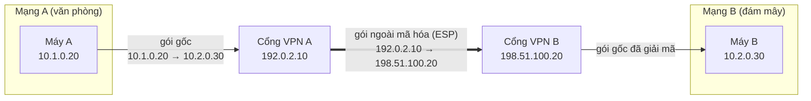
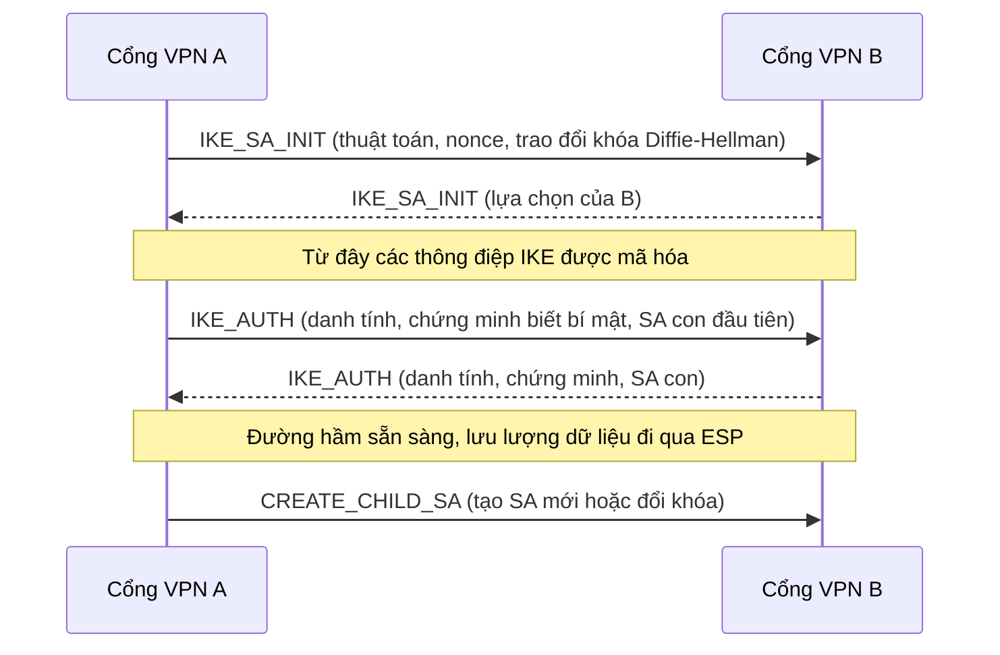

---
tags:
  - Should
  - VPN
  - Concept
  - Troubleshooting
---

# Làm sao nối hai mạng riêng qua Internet mà không ai đọc được dữ liệu? (VPN IPsec site-to-site)

## Metadata

```yaml
Chapter: vpn-ipsec-site-to-site
Phase: 05 — security
Importance: Should
Status: draft
Prerequisites:
  - Phase 01 / 06-private-public-ip-rfc1918
  - Phase 02 / 05-nat-pat
  - Phase 04 / 06-tls-certificates
Used Later:
  - Phase 06 / 10-site-to-site-vpn-direct-connect
Estimated Reading: 35 phút
Estimated Practice: 30 phút
```

## 1. Story

<!-- Mức bắt buộc (Must): Đủ -->
<!-- DRAFT: người học cần viết lại bằng lời mình -->

`shopnet` nối mạng văn phòng với mạng trên đám mây bằng một VPN. Cả hai bên đều **dùng `10.0.0.0/16`** ("cho đơn giản"). Console báo cả hai tunnel ở trạng thái **UP**, nhưng từ văn phòng không truy cập được bất kỳ máy nào bên đám mây: các gói tới `10.0.5.20` (máy bên đám mây) lại đi vào **mạng văn phòng**, nơi cũng có dải `10.0.5.x`. Khi họ đổi sang hai dải khác nhau, ping thông; nhưng SSH vẫn chạy trong khi `scp` file lớn thì **treo** giữa chừng.

Hai lỗi, hai bài học: tunnel "UP" chỉ nói rằng hai thiết bị đã thương lượng xong khóa, chứ **chưa** nói rằng định tuyến và địa chỉ hợp lý (CIDR chồng lấn, `01/06`); và đường hầm làm gói tin **lớn hơn** nên kích thước tối đa giảm xuống, liên quan tới path MTU (`03/04`). Chapter này giải thích VPN IPsec site-to-site hoạt động thế nào và các điểm hay hỏng.

## 2. Objectives

<!-- Mức bắt buộc (Must): Đủ -->
<!-- DRAFT: người học cần viết lại bằng lời mình -->

Sau chapter này bạn có thể:

- Giải thích mục đích của VPN site-to-site và IPsec cung cấp những dịch vụ bảo mật nào.
- Mô tả chế độ tunnel (đóng gói cả gói IP bên trong một gói IP ngoài) và vai trò của ESP.
- Mô tả vai trò của IKE: xác thực hai bên và thương lượng các Security Association; các cổng UDP 500 và 4500.
- Giải thích vì sao có NAT ở giữa cần NAT traversal.
- Chẩn đoán ba nhóm lỗi: tunnel không lên, tunnel lên nhưng không có lưu lượng (định tuyến/CIDR/firewall), và gói lớn treo (MTU).
- Nêu các khái niệm tương ứng trên AWS và hai giới hạn quan trọng (CIDR không chồng lấn, không hỗ trợ Path MTU Discovery).

## 3. Prerequisites

<!-- Mức bắt buộc (Must): Đủ -->
<!-- DRAFT: người học cần viết lại bằng lời mình -->

> Xem lại: [private-public-ip-rfc1918](../phase-01-foundation/06-private-public-ip-rfc1918.md)
> Xem lại: [nat-pat](../phase-02-routing/05-nat-pat.md)
> Xem lại: [tls-certificates](../phase-04-transport-app/06-tls-certificates.md)

Bạn cần nhớ: dải private và lỗi CIDR chồng lấn (`01/06`), NAT thay đổi địa chỉ nên ảnh hưởng tới đóng gói (`02/05`), chứng chỉ và xác thực hai bên (`04/06`), và ICMP "cần phân mảnh" liên quan path MTU (`03/04`).

## 4. Why it exists

<!-- Mức bắt buộc (Must): Đủ -->
<!-- DRAFT: người học cần viết lại bằng lời mình -->

Hai mạng riêng ở hai nơi (văn phòng và đám mây) muốn liên lạc như một mạng, nhưng giữa chúng là Internet công cộng, nơi gói tin có thể bị đọc, sửa hoặc giả mạo. TLS (`04/06`) bảo vệ **một ứng dụng**; ở đây cần bảo vệ **mọi lưu lượng giữa hai mạng**, bất kể ứng dụng nào. **VPN (Virtual Private Network, mạng riêng ảo)** tạo một đường hầm được mã hóa xuyên qua Internet; **IPsec** là bộ giao thức làm việc đó ở tầng IP.

Theo RFC 4301, IPsec cung cấp: kiểm soát truy cập, toàn vẹn không kết nối, xác thực nguồn gốc dữ liệu, phát hiện và từ chối gói phát lại, và bảo mật nội dung (mã hóa). Vì ở tầng IP, nó bảo vệ mọi giao thức chạy trên IP.

Nếu không hiểu:

- Chỉ nhìn trạng thái tunnel "UP" mà bỏ qua định tuyến và địa chỉ (Story).
- Chọn CIDR chồng lấn giữa hai mạng rồi không nối được.
- Không lường trước việc đường hầm làm giảm kích thước gói tối đa nên gói lớn bị mất.
- Coi VPN là bảo vệ tuyệt đối trong khi mạng ở hai đầu vẫn có thể bị xâm nhập.

## 5. Mental model

<!-- Mức bắt buộc (Must): Đủ -->
<!-- DRAFT: người học cần viết lại bằng lời mình -->

Hình dung **một ống kín xuyên qua con đường công cộng**. Hai bên dựng ống ở hai đầu; thư thật (gói IP gốc) được **cho vào một phong bì niêm phong** rồi **bỏ vào phong bì ngoài** có địa chỉ của hai cổng (thiết bị VPN). Người đi đường chỉ thấy phong bì ngoài; chỉ cổng ở đầu kia mới mở được phong bì trong và chuyển thư vào mạng bên trong. Trước khi dựng ống, hai cổng phải **chứng minh với nhau** mình là ai và thương lượng khóa (đó là IKE).

**Tóm tắt một câu:** VPN IPsec site-to-site bọc cả gói IP gốc vào một gói IP khác đã mã hóa giữa hai thiết bị VPN, sau khi hai thiết bị xác thực nhau và thỏa thuận khóa.

## 6. How it works

<!-- Mức bắt buộc (Must): Đủ -->
<!-- DRAFT: người học cần viết lại bằng lời mình -->

Các từ cần biết:

- **VPN (mạng riêng ảo — kết nối được mã hóa nối hai mạng riêng qua một mạng công cộng như Internet).**
- **IPsec (bộ giao thức bảo mật tầng IP — mã hóa, xác thực và bảo vệ toàn vẹn cho gói IP).**
- **Tunnel (đường hầm — gói tin gốc được đóng gói bên trong một gói khác để đi qua mạng trung gian).**
- **IKE (trao đổi khóa Internet — giao thức để hai thiết bị VPN xác thực nhau và thương lượng các thông số bảo mật).**
- **Security Association / SA (liên kết bảo mật — một "kết nối" một chiều có thông số mã hóa và khóa; hai chiều cần một cặp SA).**
- **ESP (Encapsulating Security Payload — giao thức đóng gói của IPsec cung cấp mã hóa, toàn vẹn và xác thực).**
- **NAT traversal / NAT-T (vượt NAT — đóng gói ESP trong UDP để đi qua thiết bị NAT).**
- **Customer gateway (cổng phía khách — thiết bị hoặc phần mềm VPN ở phía mạng của bạn).**
- **Virtual private gateway (cổng riêng ảo — điểm cuối VPN phía AWS, gắn vào một VPC).**

**Chế độ tunnel.** Theo RFC 4301, IPsec có hai chế độ: **transport** (bảo vệ giữa hai máy, giữ nguyên header IP) và **tunnel** (bọc cả gói IP gốc cùng header của nó trong một header IP ngoài và phần bảo mật). Site-to-site dùng **tunnel mode** giữa hai cổng bảo mật: cổng thay mặt cả mạng phía sau nó.

**ESP và AH.** ESP cung cấp toàn vẹn, xác thực nguồn và **mã hóa**; AH chỉ có toàn vẹn và xác thực. RFC 4301 lưu ý hầu hết yêu cầu bảo mật đáp ứng được chỉ với ESP.



**Đọc sơ đồ:** máy A gửi gói tới `10.2.0.30` như bình thường. Gói tới cổng VPN A, cổng này **mã hóa nguyên gói gốc** và bọc nó trong gói ngoài có địa chỉ của hai cổng (địa chỉ công khai, ở đây dùng địa chỉ tài liệu). Người nghe trên Internet chỉ thấy gói giữa hai cổng. Cổng B giải mã và chuyển gói gốc vào mạng B. Hai điều quan trọng: (1) mạng A và B phải dùng **địa chỉ khác nhau**, nếu không "10.2.0.30" có thể trỏ nhầm vào mạng nội bộ (Story); (2) cả hai bên phải có **route** đưa lưu lượng tới mạng bên kia vào cổng VPN.

**IKE: dựng đường hầm.** Theo RFC 7296 (IKEv2), IKE làm hai việc: xác thực hai bên và thương lượng SA. Có ba loại trao đổi:



**Đọc sơ đồ:** `IKE_SA_INIT` thương lượng thuật toán và dùng Diffie-Hellman để tạo khóa chung; từ đó phần còn lại được mã hóa. `IKE_AUTH` xác thực danh tính hai bên (bằng khóa chia sẻ trước hoặc chứng chỉ, `04/06`) và thiết lập SA con đầu tiên để mã hóa dữ liệu. `CREATE_CHILD_SA` dùng về sau để tạo SA mới hoặc **đổi khóa định kỳ**. Mỗi SA một chiều, nên một đường hầm hai chiều có (ít nhất) một cặp SA.

**Cổng và NAT.** IKE dùng **UDP cổng 500**. Khi có thiết bị **NAT** giữa hai cổng, gói ESP (không có cổng) thường bị NAT làm hỏng, nên ESP được bọc trong **UDP cổng 4500** (RFC 3948), cổng dùng chung với IKE để chỉ cần một ánh xạ NAT và một cổng trên firewall. Vì vậy firewall ở hai đầu phải cho phép UDP 500 và 4500 (và ESP nếu không có NAT).

**Định tuyến qua VPN.** Tunnel chỉ là đường ống; bạn vẫn phải khai báo **mạng nào đi qua đường hầm** (route tĩnh trỏ vào cổng VPN, hoặc định tuyến động học các tuyến từ phía bên kia). Thiếu route ở **một** phía thì lưu lượng một chiều hỏng (`02/01`, `02/06`).

**CIDR chồng lấn.** Hai mạng dùng cùng dải (Story) không thể nối bằng VPN thông thường: mỗi phía coi mọi địa chỉ trong dải đó là nội bộ (`01/06`). Cách chữa: đổi địa chỉ một bên hoặc dùng NAT giữa hai bên, cả hai tốn kém; tốt nhất quy hoạch dải khác nhau từ đầu (`01/05`).

**MTU.** Đóng gói thêm header ESP và header IP ngoài làm gói **lớn hơn**; vì đường truyền có kích thước tối đa, gói gốc lớn phải được chia nhỏ hoặc bị loại bỏ. Máy dựa vào ICMP "cần phân mảnh" (path MTU discovery, `03/04`) để biết hạ kích thước; nếu thông báo này không đến được, gói lớn mất im lặng: ping nhỏ và SSH (gói nhỏ) chạy, `scp` file lớn thì treo (Story).

<!-- verified: 2026-10-05 https://www.rfc-editor.org/rfc/rfc4301 -->
<!-- verified: 2026-10-05 https://www.rfc-editor.org/rfc/rfc7296 -->
<!-- verified: 2026-10-05 https://www.rfc-editor.org/rfc/rfc3948 -->

## 7. Key settings

<!-- Mức bắt buộc (Must): Đủ -->
<!-- DRAFT: người học cần viết lại bằng lời mình -->

| Thông số | Ý nghĩa | Nếu sai |
|---|---|---|
| Địa chỉ công khai của hai cổng | Điểm đầu và cuối của đường hầm | Không thương lượng được |
| Cách xác thực (khóa chia sẻ trước / chứng chỉ) | Hai cổng chứng minh danh tính | Sai khóa → tunnel không lên; khóa yếu → rủi ro bảo mật |
| Phiên bản IKE (nên dùng IKEv2) | Giao thức thương lượng | Hai bên không cùng phiên bản/thông số → không lên |
| Thuật toán mã hóa, toàn vẹn, nhóm Diffie-Hellman | Độ mạnh bảo mật và khả năng tương thích | Hai bên không có thuật toán chung → không lên; chọn yếu → rủi ro |
| Thời hạn SA và đổi khóa | Tần suất đổi khóa | Lệch thông số có thể gây đứt định kỳ |
| NAT-T | Vượt NAT | Có NAT mà không bật → ESP bị hỏng |
| Mạng đi qua đường hầm (route/traffic selector) | Dải địa chỉ nào được mã hóa và gửi qua | Thiếu/sai → "tunnel UP mà không có lưu lượng" |
| MTU/MSS của lưu lượng đi qua | Kích thước gói tối đa sau khi đóng gói | Quá lớn → gói lớn treo |

**Công cụ quan sát:** bắt gói trên cổng VPN hoặc máy ở hai đầu với bộ lọc `udp port 500 or udp port 4500` (thông điệp IKE và ESP trong UDP) và `esp` (ESP trực tiếp), xem `00/03`.

## 8. AWS mapping

<!-- Mức bắt buộc (Must): Đủ nếu có liên quan AWS -->
<!-- DRAFT: người học cần viết lại bằng lời mình -->

<!-- verified: 2026-10-05 https://docs.aws.amazon.com/vpn/latest/s2svpn/VPC_VPN.html -->

| Khái niệm | Trên AWS |
|---|---|
| VPN site-to-site | AWS Site-to-Site VPN; kết nối an toàn giữa thiết bị tại chỗ của bạn và VPC |
| Đường hầm | VPN tunnel; **mỗi VPN connection gồm hai tunnel** dùng đồng thời để có tính sẵn sàng cao |
| Thiết bị phía bạn | Customer gateway device (thiết bị vật lý hoặc phần mềm) |
| Tài nguyên mô tả thiết bị đó cho AWS | Customer gateway (tài nguyên AWS) |
| Điểm cuối phía AWS | Virtual private gateway (gắn vào **một** VPC) hoặc transit gateway (nối nhiều VPC và mạng tại chỗ) |

Theo tài liệu AWS:

- Site-to-Site VPN dùng IPsec; hỗ trợ IKEv2, NAT traversal, các tùy chọn mã hóa mạnh (AES 256-bit, SHA-2, thêm nhóm Diffie-Hellman), tùy chọn tunnel có thể cấu hình, chỉ số CloudWatch, và ASN (dùng cho định tuyến động).
- **Không hỗ trợ Path MTU Discovery.** Hệ quả trực tiếp với Story: gói lớn không được báo ngược để hạ kích thước, nên cần chủ động đặt MTU/MSS phù hợp trên thiết bị và máy khi dùng đường hầm.
- Khi nối nhiều VPC với một mạng tại chỗ chung, AWS khuyến nghị **dải CIDR không chồng lấn** (xem Story và `01/06`).
- **Chi phí:** tính theo **mỗi giờ** VPN connection được cấp và sẵn sàng, cộng chi phí truyền dữ liệu ra Internet từ EC2; kiểm tra trang giá chính thức, không ghi số trong sách.
- Phần tùy chọn tunnel cụ thể (phiên bản IKE hỗ trợ ngoài IKEv2, dải địa chỉ trong tunnel, giá trị MTU/MSS khuyến nghị, hành vi phát hiện đối tác chết và chuyển đổi tunnel) tôi chưa kiểm chứng được `[CHƯA KIỂM CHỨNG]`: đọc tài liệu hiện hành khi cấu hình. Việc AWS hỗ trợ cả định tuyến tĩnh và động (BGP) cũng cần xác nhận trong tài liệu `[CHƯA KIỂM CHỨNG]`.

Chi tiết cấu hình và so sánh với kết nối riêng (Direct Connect) ở `06/10`. Tài liệu AWS có thể thay đổi; kiểm tra lại trước khi dựa vào chi tiết.

## 9. Hands-on lab

<!-- Mức bắt buộc (Should): Rút gọn -->
<!-- DRAFT: người học cần viết lại bằng lời mình -->

Chi tiết ở `labs/phase-05-security/chapter-04-vpn-ipsec-site-to-site/README.md`. Chapter Should nên lab **rút gọn**: dựng một đường hầm IPsec thật cần hai thiết bị VPN và nằm ngoài phạm vi chapter này; thay vào đó bạn luyện hai điều hay hỏng nhất: **CIDR chồng lấn** và **MTU**.

**1. Predict:**

- Hai mạng `10.0.0.0/16` (văn phòng) và `10.0.5.0/24` (đám mây) có chồng lấn không? Còn `10.1.0.0/16` và `10.2.0.0/16`?
- Nếu MTU của một đường giảm còn 1400, gói ping cấm phân mảnh lớn nhất qua được có kích thước dữ liệu bao nhiêu (gợi ý: `MTU − 28`, `03/04`)?

**2. Run:**

```bash
python3 - <<'PY'
import ipaddress as i
pairs = [('10.0.0.0/16', '10.0.5.0/24'), ('10.1.0.0/16', '10.2.0.0/16'), ('192.168.0.0/16', '192.168.1.0/24')]
for a, b in pairs:
    print(a, b, 'chồng lấn:', i.ip_network(a).overlaps(i.ip_network(b)))
PY
```

```powershell
docker run --rm -it --cap-add NET_ADMIN alpine sh
```

```sh
apk add --no-cache iputils
GW=$(ip route show default | awk '{print $3}')
ip link set dev eth0 mtu 1400
ping -M do -s 1372 -c 1 -W 2 $GW
ping -M do -s 1373 -c 1 -W 2 $GW
```

**3. Verify:** ghi kết quả chồng lấn; ping 1372 (1400 − 28) có qua không, 1373 có báo lỗi kích thước không. Output thật: `[CHƯA CHẠY]`.

## 10. Break it

<!-- Mức bắt buộc (Should): Rút gọn -->
<!-- DRAFT: người học cần viết lại bằng lời mình -->

**Gây lỗi CIDR chồng lấn** trên bảng route của container:

```sh
ip addr add 10.0.0.1/16 dev lo
GW=$(ip route show default | awk '{print $3}')
ip route add 10.0.7.0/24 via $GW
ip route get 10.0.7.9
ip route get 10.0.8.9
```

(`10.0.0.1/16` trên `lo` đóng vai mạng văn phòng `10.0.0.0/16`; route qua `$GW` đóng vai đường hầm tới một phần của mạng đám mây `10.0.7.0/24`.)

**Dự đoán:**

- `10.0.7.9` đi qua `$GW` (route cụ thể hơn `/24` thắng `/16`, `02/02`): máy ở dải này bên đám mây truy cập được, **nhưng** mọi máy văn phòng cũng có dải `10.0.7.x` thì bị "cướp" (không truy cập được).
- `10.0.8.9` **không** đi qua `$GW` (không có route riêng): rơi vào mạng cục bộ `10.0.0.0/16` nên không bao giờ tới được máy cùng địa chỉ ở phía đám mây.

**Ý nghĩa:** khi hai mạng cùng dải, mỗi bên có một phần địa chỉ bị che hoặc bị cướp, và không có cách cấu hình đơn giản để mọi máy đều truy cập được nhau; phải đổi địa chỉ hoặc dùng NAT giữa hai bên.

Cũng quan sát bài MTU ở mục 9: ping vượt quá MTU báo lỗi ngay tại máy (vì MTU cục bộ đã biết); trên đường hầm thật, thông báo này phải đến từ thiết bị ở giữa, và nếu bị chặn thì gói lớn mất im lặng.

**Khôi phục:** `exit`; container `--rm` tự xóa.

Kết quả thật: `[CHƯA CHẠY]`.

## 11. Troubleshooting

<!-- Mức bắt buộc (Should): Rút gọn -->
<!-- DRAFT: người học cần viết lại bằng lời mình -->

Chia thành ba nhóm theo trạng thái của đường hầm:

| Nhóm | Triệu chứng | Kiểm tra theo thứ tự | Công cụ |
|---|---|---|---|
| 1 | Tunnel **không lên** | Địa chỉ công khai hai cổng đúng chưa; UDP 500/4500 có bị chặn không; khóa chia sẻ/chứng chỉ khớp không; thông số IKE (phiên bản, thuật toán, nhóm DH) hai bên có chung không; có NAT ở giữa mà chưa bật NAT-T | Nhật ký của thiết bị VPN, bắt gói `udp port 500 or udp port 4500` |
| 2 | Tunnel **UP nhưng không có lưu lượng** (Story) | CIDR hai bên có chồng lấn không; route đi qua tunnel có ở **cả hai** phía không; security group/NACL/firewall hai đầu có cho phép không; mạng được mã hóa (traffic selector) khớp hai bên không | `ip route get`, `traceroute`, so sánh bảng route, `01/05` kiểm tra chồng lấn |
| 3 | Lưu lượng chạy **nhưng gói lớn treo** | MTU/MSS sau đóng gói; ICMP "cần phân mảnh" có tới được không | `ping -M do -s <n>` / `ping -f -l <n>`, hạ MSS |

| Triệu chứng khác | Giả thuyết đầu tiên |
|---|---|
| Đứt định kỳ rồi tự lên lại | Thông số thời hạn SA/đổi khóa hai bên lệch nhau, hoặc chuyển đổi giữa hai tunnel |
| Một chiều chạy, một chiều không | Thiếu route ở một phía, hoặc định tuyến bất đối xứng (`02/06`) |
| Chỉ một số dải đi qua được | Traffic selector/route chỉ khai báo một phần dải |

Ghi kết quả thật của mục 10: `[CHƯA CHẠY]`.

## 12. Security & cost

<!-- Mức bắt buộc (Should): Đủ -->
<!-- DRAFT: người học cần viết lại bằng lời mình -->

- **Khóa chia sẻ trước là bí mật:** dùng khóa mạnh, ngẫu nhiên, không chia sẻ qua kênh không an toàn, không commit vào repo, đổi định kỳ; hoặc dùng xác thực bằng chứng chỉ (`04/06`).
- **Dùng thuật toán mạnh;** tắt các thuật toán lỗi thời, theo khuyến nghị hiện hành `[CHƯA KIỂM CHỨNG]` (kiểm tra chính sách của nền tảng bạn dùng).
- **VPN mở rộng ranh giới tin cậy:** máy bị chiếm ở một đầu có thể tấn công đầu kia qua đường hầm. Chỉ cho phép dải và cổng cần thiết (security group, ACL, firewall) ở cả hai đầu (`05/01`–`05/03`).
- **VPN không thay thế mã hóa ứng dụng (TLS):** nó bảo vệ trên đường giữa hai cổng, không bảo vệ dữ liệu bên trong mạng ở mỗi đầu.
- **Giám sát trạng thái tunnel** và cảnh báo khi một trong hai tunnel xuống (mất dự phòng mà không biết).
- Không dán IP công khai, khóa hay cấu hình thật vào tài liệu công khai.
- **Chi phí:** theo tài liệu AWS, tính theo mỗi giờ VPN connection được cấp, cộng chi phí truyền dữ liệu ra Internet; kiểm tra trang giá chính thức và tắt khi không dùng nếu là lab. Lab trong chapter này local nên không phát sinh chi phí.

## 13. Misconceptions

<!-- Mức bắt buộc (Should): Đủ -->
<!-- DRAFT: người học cần viết lại bằng lời mình -->

| Hiểu nhầm | Sự thật |
|---|---|
| "Tunnel UP nghĩa là mạng đã thông" | Chỉ là hai cổng đã thương lượng xong khóa; vẫn cần route, địa chỉ không trùng, firewall cho phép |
| "Hai mạng cùng `10.0.0.0/16` cũng nối được" | Chồng lấn làm một phần địa chỉ bị che/cướp; phải đổi địa chỉ hoặc dùng NAT |
| "VPN làm mọi gói an toàn tuyệt đối" | Chỉ bảo vệ đoạn giữa hai cổng; hai đầu vẫn cần bảo vệ |
| "VPN thay thế TLS" | Hai lớp khác nhau; nên dùng cả hai khi cần |
| "VPN chỉ có một chế độ" | IPsec có transport và tunnel; site-to-site dùng tunnel |
| "Gói lớn hay nhỏ không khác gì khi qua VPN" | Đóng gói làm gói lớn hơn; MTU giảm, có thể gây treo với gói lớn |
| "Có NAT ở giữa thì IPsec chạy bình thường" | ESP bị NAT làm hỏng; cần NAT traversal (UDP 4500) |

## 14. Interview questions

<!-- Mức bắt buộc (Should): Đủ -->
<!-- DRAFT: người học cần viết lại bằng lời mình -->

### Q1 (Junior) — VPN site-to-site dùng để làm gì và IPsec cung cấp những dịch vụ nào?

**Gợi ý ý chính:**
- Hai mạng riêng được nối qua cái gì?
- Ba bốn dịch vụ bảo mật?

??? success "Đáp án mẫu (tự trả lời trước khi mở)"
    Nối hai mạng riêng qua Internet bằng một đường hầm được mã hóa. IPsec cung cấp mã hóa (bảo mật nội dung), toàn vẹn, xác thực nguồn gốc và chống gói phát lại, ở tầng IP nên bảo vệ mọi giao thức.

### Q2 (Middle) — IKE làm gì, và dùng cổng nào?

**Gợi ý ý chính:**
- Hai việc chính của IKE?
- Vì sao có thêm cổng 4500?

??? success "Đáp án mẫu (tự trả lời trước khi mở)"
    IKE xác thực hai bên và thương lượng các Security Association (thuật toán, khóa). Dùng UDP 500; khi có NAT thì dùng UDP 4500 để đóng gói ESP trong UDP, vì NAT không xử lý được ESP trực tiếp.

### Q3 (Middle) — Tunnel báo UP nhưng không truy cập được mạng bên kia. Bạn kiểm tra gì?

**Gợi ý ý chính:**
- Định tuyến ở cả hai phía?
- Địa chỉ hai mạng có gì cần kiểm tra?

??? success "Đáp án mẫu (tự trả lời trước khi mở)"
    UP chỉ nói đã thương lượng khóa. Kiểm tra route trỏ vào đường hầm ở cả hai phía, CIDR hai mạng có chồng lấn không, security group/NACL/firewall hai đầu, và mạng được khai báo trong đường hầm (traffic selector) có khớp không.

### Q4 (Middle) — SSH qua VPN chạy được nhưng `scp` file lớn treo. Nguyên nhân thường gặp?

**Gợi ý ý chính:**
- Đóng gói làm gói thay đổi thế nào?
- Thông báo nào giúp máy hạ kích thước gói?

??? success "Đáp án mẫu (tự trả lời trước khi mở)"
    Đóng gói thêm header nên MTU thực tế nhỏ hơn; gói lớn không đi qua được và thông báo ICMP "cần phân mảnh" (path MTU discovery) không về được (ví dụ bị chặn hoặc dịch vụ không hỗ trợ), nên gói lớn mất im lặng. Cách chữa: đặt MTU/MSS nhỏ hơn trên thiết bị và máy.

## 15. Exercises

<!-- Mức bắt buộc (Should): Đủ -->
<!-- DRAFT: người học cần viết lại bằng lời mình -->

1. **Vẽ đường đi gói tin.** Với mạng A `10.1.0.0/16`, mạng B `10.2.0.0/16`, hai cổng có địa chỉ tài liệu. *Deliverable:* sơ đồ Mermaid (tự vẽ) cho một gói từ máy A đến máy B, ghi địa chỉ nguồn/đích của gói gốc và gói ngoài ở từng chặng.
2. **Kế hoạch CIDR.** Văn phòng, hai VPC (`prd`, `stg`) và một mạng đối tác cần nối vào nhau. *Deliverable:* bảng dải CIDR không chồng lấn kèm bước kiểm tra bằng Python (`01/05`).
3. **Bảng chẩn đoán ba nhóm.** *Deliverable:* bảng 8 triệu chứng → nhóm (tunnel không lên / lên nhưng không có lưu lượng / gói lớn treo) → lệnh kiểm tra đầu tiên.
4. **Giải thích Story.** *Deliverable:* đoạn 4–6 câu cho quản lý vì sao "tunnel UP" chưa đủ và cần các kiểm tra nào trước khi tuyên bố VPN hoàn tất.

## 16. Cheat sheet

<!-- Mức bắt buộc (Should): Đủ -->
<!-- DRAFT: người học cần viết lại bằng lời mình -->

| Mục | Nội dung |
|---|---|
| IPsec | Mã hóa, toàn vẹn, xác thực nguồn, chống phát lại ở tầng IP |
| Chế độ | Transport (máy–máy) / **Tunnel** (cổng–cổng, site-to-site) |
| ESP | Mã hóa + toàn vẹn + xác thực (hầu hết trường hợp chỉ cần ESP) |
| IKEv2 | `IKE_SA_INIT` → `IKE_AUTH` → `CREATE_CHILD_SA` |
| Cổng | UDP 500 (IKE); UDP 4500 (NAT-T và ESP trong UDP) |
| SA | Một chiều; hai chiều cần cặp SA |
| Lỗi hay gặp | Tunnel UP nhưng không route; CIDR chồng lấn; MTU/gói lớn treo |
| AWS | 2 tunnel/connection; VGW (một VPC) hoặc TGW; không hỗ trợ PMTUD; CIDR không chồng lấn; tính phí theo giờ + dữ liệu ra |

**Debug:** tunnel lên chưa → route hai phía → CIDR chồng lấn → firewall/SG/NACL → MTU.

## 17. Glossary terms

<!-- Mức bắt buộc (Should): Đủ -->
<!-- DRAFT: người học cần viết lại bằng lời mình -->

- VPN / mạng riêng ảo / VPN
- IPsec / bộ giao thức bảo mật tầng IP / IPsec
- Tunnel / đường hầm / トンネル
- IKE / trao đổi khóa Internet / IKE
- Security Association / liên kết bảo mật / セキュリティアソシエーション
- ESP / giao thức đóng gói bảo mật / ESP
- NAT traversal / vượt NAT / NAT越え
- Customer gateway / cổng phía khách / カスタマーゲートウェイ
- Virtual private gateway / cổng riêng ảo / 仮想プライベートゲートウェイ

## 18. Further reading

<!-- Mức bắt buộc (Should): Đủ -->
<!-- DRAFT: người học cần viết lại bằng lời mình -->

Kiểm tra ngày 2026-10-05:

- RFC 4301 — Security Architecture for the Internet Protocol: https://www.rfc-editor.org/rfc/rfc4301
- RFC 7296 — Internet Key Exchange Protocol Version 2 (IKEv2): https://www.rfc-editor.org/rfc/rfc7296
- RFC 3948 — UDP Encapsulation of IPsec ESP Packets: https://www.rfc-editor.org/rfc/rfc3948
- AWS Site-to-Site VPN — What is AWS Site-to-Site VPN: https://docs.aws.amazon.com/vpn/latest/s2svpn/VPC_VPN.html
