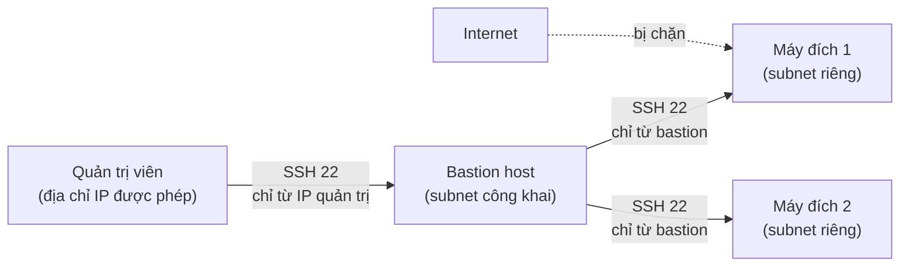
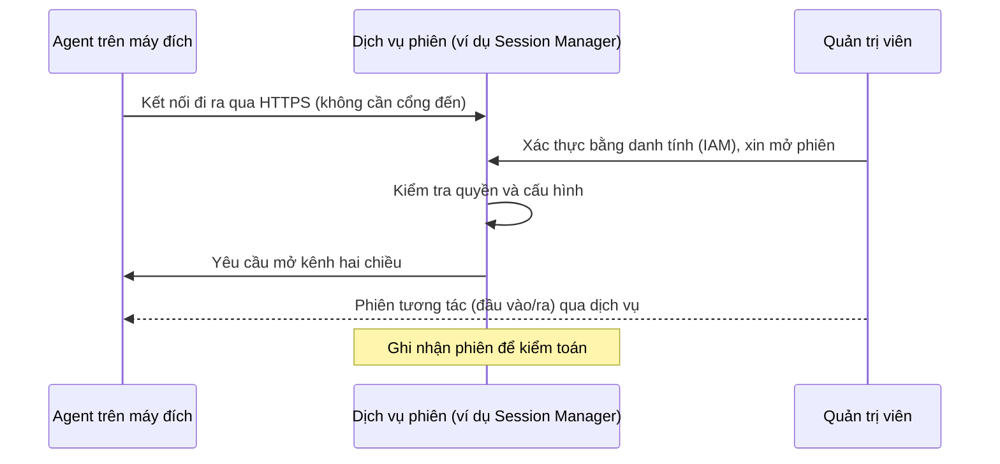

---
tags:
  - Should
  - SSH
  - AWS
  - Concept
  - Troubleshooting
---

# Làm sao quản trị máy chủ nằm sâu trong mạng riêng mà không mở cổng quản trị ra Internet? (Bastion và truy cập theo phiên)

## Metadata

```yaml
Chapter: bastion-and-session-access
Phase: 05 — security
Importance: Should
Status: draft
Prerequisites:
  - Phase 04 / 06-tls-certificates
  - Phase 05 / 01-firewall-stateful-vs-stateless
Used Later: []
Estimated Reading: 35 phút
Estimated Practice: 30 phút
```

## 1. Story

<!-- Mức bắt buộc (Should): Đủ -->
<!-- DRAFT: người học cần viết lại bằng lời mình -->

Để tiện cho đội vận hành, `shopnet` dựng một **bastion host** (máy trung gian để vào các máy trong mạng riêng) và mở cổng SSH 22 cho `0.0.0.0/0`. Cả đội dùng **chung một khóa SSH** lưu trong kho mã nguồn nội bộ. Vài tháng sau, nhật ký của bastion có hàng nghìn lần đăng nhập thất bại mỗi ngày từ khắp nơi. Một kỹ sư rời công ty, và không ai biết liệu họ còn giữ khóa không, cũng không ai trả lời được câu hỏi "tuần trước ai đã chạy lệnh nào trên máy database".

Ba vấn đề trong một câu chuyện: **bề mặt tấn công** (cổng quản trị mở cho cả thế giới), **danh tính** (khóa dùng chung không cho biết ai là ai) và **kiểm toán** (không có bản ghi các phiên). Chapter này so sánh các cách quản trị từ xa an toàn hơn: bastion được siết chặt, truy cập theo phiên không cần mở cổng đến, và các lựa chọn trên AWS.

## 2. Objectives

<!-- Mức bắt buộc (Should): Đủ -->
<!-- DRAFT: người học cần viết lại bằng lời mình -->

Sau chapter này bạn có thể:

- Giải thích SSH bảo vệ gì (mã hóa, xác thực máy chủ bằng host key, xác thực người dùng) và rủi ro khi chấp nhận host key lạ.
- Mô tả mô hình bastion/jump host và cấu hình tối thiểu để dùng nó an toàn (security group, `ProxyJump`).
- Giải thích rủi ro của agent forwarding và vì sao khóa dùng chung là sai.
- Mô tả cách truy cập theo phiên (không cần cổng đến, xác thực bằng danh tính) hoạt động, và so sánh với bastion.
- Liệt kê điều kiện để dùng Session Manager cho instance trong subnet private (NAT hoặc các VPC endpoint cần thiết).
- Chẩn đoán các lỗi hay gặp: timeout, từ chối khóa, cảnh báo host key đổi, phiên không bắt đầu được.

## 3. Prerequisites

<!-- Mức bắt buộc (Should): Đủ -->
<!-- DRAFT: người học cần viết lại bằng lời mình -->

> Xem lại: [tls-certificates](../phase-04-transport-app/06-tls-certificates.md)
> Xem lại: [firewall-stateful-vs-stateless](01-firewall-stateful-vs-stateless.md)

Bạn cần nhớ xác thực bằng khóa và chứng chỉ (`04/06`), security group chỉ có quy tắc cho phép và có thể tham chiếu một security group khác (`05/03`), và việc thu hồi quyền không cắt phiên đang chạy (`05/01`).

## 4. Why it exists

<!-- Mức bắt buộc (Should): Đủ -->
<!-- DRAFT: người học cần viết lại bằng lời mình -->

Quản trị viên cần vào máy chủ để cài đặt, sửa lỗi, đọc log. Nhưng các cổng quản trị (SSH 22, RDP 3389) là mục tiêu quét và dò mật khẩu hàng đầu. Mở chúng ra Internet cho **từng máy** nghĩa là mỗi máy là một điểm có thể bị tấn công. Có ba hướng giảm rủi ro:

1. **Bastion (jump host):** mở **một** điểm vào duy nhất, được siết chặt và theo dõi kỹ; mọi máy khác chỉ nhận kết nối quản trị **từ bastion**.
2. **Truy cập theo phiên qua dịch vụ có xác thực danh tính:** không mở cổng đến ở máy nào; máy tự **gọi ra** dịch vụ, người quản trị xác thực bằng danh tính (ví dụ IAM) rồi dịch vụ nối hai bên.
3. **VPN** (`05/04`): đưa người quản trị vào chính mạng riêng, rồi dùng cách truy cập thông thường.

Nếu không có hướng nào: hoặc mở cổng ra ngoài (rủi ro), hoặc không quản trị được máy ở mạng riêng.

## 5. Mental model

<!-- Mức bắt buộc (Should): Đủ -->
<!-- DRAFT: người học cần viết lại bằng lời mình -->

Hình dung một tòa nhà văn phòng.

- **Không có bastion:** mỗi phòng đều có cửa mở thẳng ra đường, ai cũng thử được tay nắm cửa.
- **Bastion:** chỉ có **một cửa chính có lễ tân** ghi sổ; các phòng khóa cửa và chỉ mở cho người do lễ tân dẫn vào. Lễ tân phải được bảo vệ chặt (nếu lễ tân bị lừa thì cả tòa nhà thủng).
- **Truy cập theo phiên:** các phòng **không có cửa nào hướng ra đường**; mỗi phòng tự **gọi điện ra tổng đài** (kết nối đi ra) và báo "tôi sẵn sàng". Khi bạn cần vào, bạn chứng minh danh tính với tổng đài, tổng đài nối bạn vào đường dây phòng đó. Tổng đài ghi lại cuộc gọi.

**Tóm tắt một câu:** hoặc gom mọi truy cập quản trị qua một điểm duy nhất được bảo vệ (bastion), hoặc để máy chủ gọi ra và dịch vụ trung gian xác thực, ghi nhận từng phiên.

## 6. How it works

<!-- Mức bắt buộc (Should): Đủ -->
<!-- DRAFT: người học cần viết lại bằng lời mình -->

Các từ cần biết:

- **SSH (Secure Shell — giao thức đăng nhập và truyền dữ liệu từ xa qua kênh mã hóa).**
- **Host key (khóa máy chủ — khóa công khai của máy chủ SSH, dùng để client kiểm tra mình đang nói chuyện đúng máy).**
- **Bastion host / jump host (máy trung gian — điểm vào duy nhất được bảo vệ để từ đó truy cập các máy trong mạng riêng).**
- **Port forwarding (chuyển tiếp cổng — dùng đường SSH để đưa một cổng của máy từ xa về một cổng trên máy mình).**
- **Agent forwarding (chuyển tiếp agent — cho máy từ xa dùng khóa lưu trong agent trên máy bạn).**
- **Session-based access (truy cập theo phiên — kết nối quản trị đi qua một dịch vụ trung gian đã xác thực danh tính, không cần mở cổng đến ở máy đích).**

**SSH bảo vệ gì.** Theo RFC 4251, SSH gồm ba lớp: **lớp truyền** (mã hóa và xác thực **máy chủ** bằng host key), **xác thực người dùng**, và **lớp kết nối** (nhiều kênh qua một kết nối). Điểm yếu thực tế: lần đầu kết nối tới một máy, client thường chưa có host key để so sánh và người dùng bấm "tin tưởng". RFC khuyên lưu khóa vào cơ sở dữ liệu cục bộ (`known_hosts`) và so sánh ở các lần sau; RFC cũng nêu rõ **dùng SSH mà không có sự gắn kết đáng tin giữa máy và host key của nó là "vốn dĩ không an toàn"** vì kẻ tấn công xen giữa có thể chen vào. Vì thế cảnh báo "host key đã thay đổi" cần được điều tra, không phải xóa đi ngay.

**Mô hình bastion.**



**Đọc sơ đồ:** chỉ bastion có đường vào từ ngoài, và chỉ cho **địa chỉ IP quản trị đã biết**. Các máy đích nằm trong subnet riêng và chỉ chấp nhận SSH **từ bastion** (ví dụ quy tắc inbound lấy chính security group của bastion làm nguồn, `05/03`). Quản trị viên vào máy đích bằng `ssh -J <bastion> <đích>` (**ProxyJump**: kết nối qua máy trung gian rồi tới đích; theo tài liệu OpenSSH, cấu hình áp dụng cho đích chứ không áp dụng cho máy trung gian). Có thể chuyển tiếp một cổng dịch vụ về máy mình bằng `-L` (local port forwarding).

**Rủi ro của bastion:**

- Nó là **điểm tập trung rủi ro**: bị chiếm bastion là có đường vào tất cả. Phải vá lỗi, hạn chế dịch vụ chạy trên đó, giới hạn nguồn truy cập, bật xác thực mạnh và ghi log.
- **Agent forwarding (`-A`)** cho máy từ xa dùng khóa trong agent của bạn. Theo tài liệu OpenSSH, người có quyền vượt qua quyền tệp trên máy từ xa (như quản trị viên của máy đó) **có thể dùng agent của bạn qua kết nối được chuyển tiếp**; họ không lấy được khóa nhưng làm được mọi thao tác bằng danh tính của bạn. Với bastion, nên dùng `ProxyJump` thay vì chuyển tiếp agent.
- **Khóa dùng chung** (Story): không phân biệt được ai là ai, không thu hồi riêng từng người, và một người rời đi thì phải đổi khóa của tất cả.

**Truy cập theo phiên (không cần cổng đến).** Máy đích chạy một agent chủ động **gọi ra** dịch vụ; người dùng xác thực với dịch vụ, và dịch vụ nối phiên giữa hai bên.



**Đọc sơ đồ:** kết nối **luôn do agent khởi tạo đi ra**, nên security group của máy đích không cần cho phép SSH/RDP từ ngoài vào. Quyền truy cập do chính sách danh tính quyết định (không dùng khóa SSH), thu hồi bằng cách đổi chính sách. Dịch vụ có thể ghi lại phiên.

**So sánh các cách:**

| Tiêu chí | Bastion + SSH | Session Manager (AWS) | EC2 Instance Connect Endpoint | VPN (`05/04`) |
|---|---|---|---|---|
| Cổng quản trị mở ra ngoài | Có, ở bastion | Không | Không | Không (chỉ cổng VPN) |
| Cần khóa SSH | Có | Không | Tùy cách dùng | Tùy |
| Danh tính người dùng | Khóa SSH (khó phân biệt nếu dùng chung) | IAM | IAM | Tùy VPN |
| Ghi nhận phiên | Phải tự dựng | Có (CloudTrail, S3, CloudWatch Logs) | Có (CloudTrail ghi các lần kết nối) | Tùy |
| Máy đích cần địa chỉ công khai | Không (qua bastion) | Không | Không | Không |
| Chi phí vận hành | Bastion chạy liên tục | Xem mục 8 | Xem mục 8 | VPN theo giờ |

<!-- verified: 2026-10-05 https://www.rfc-editor.org/rfc/rfc4251 -->
<!-- verified: 2026-10-05 https://man.openbsd.org/ssh -->

> Security group và tham chiếu security group ở `05/03`; VPN ở `05/04`.

## 7. Key settings

<!-- Mức bắt buộc (Should): Đủ -->
<!-- DRAFT: người học cần viết lại bằng lời mình -->

| Thông số | Cách làm tốt |
|---|---|
| Nguồn truy cập vào bastion | Chỉ địa chỉ IP/CIDR quản trị đã biết; **không** `0.0.0.0/0` |
| Quy tắc ở máy đích | SSH chỉ từ bastion (tham chiếu security group của bastion) |
| Xác thực SSH | Dùng khóa riêng cho **từng người**, bảo vệ bằng mật khẩu khóa; tắt đăng nhập bằng mật khẩu nếu có thể |
| Host key | Lưu vào `known_hosts`, điều tra khi cảnh báo đổi khóa |
| Chuyển tiếp agent | Tắt mặc định; dùng `ProxyJump` |
| Quyền theo danh tính | Quyền ít nhất, có thời hạn (ví dụ trực ca tạm thời) |
| Ghi log phiên | Bật và bảo vệ nơi lưu log |
| Giải pháp trung gian | Có kế hoạch cập nhật/vá lỗi bastion hoặc chuyển sang truy cập theo phiên |

**Công cụ `ssh`** (theo tài liệu OpenSSH): `-J <bastion>` (jump host), `-L <cổng cục bộ>:<máy>:<cổng>` (chuyển tiếp cổng cục bộ), `-i <tệp khóa>` (chọn khóa riêng), `-o ConnectTimeout=<giây>` (thời gian chờ kết nối), `-o BatchMode=yes` (không hỏi mật khẩu/câu hỏi tương tác), `-A` (chuyển tiếp agent).

## 8. AWS mapping

<!-- Mức bắt buộc (Must): Đủ nếu có liên quan AWS -->
<!-- DRAFT: người học cần viết lại bằng lời mình -->

<!-- verified: 2026-10-05 https://docs.aws.amazon.com/systems-manager/latest/userguide/session-manager.html -->
<!-- verified: 2026-10-05 https://docs.aws.amazon.com/systems-manager/latest/userguide/setup-create-vpc.html -->
<!-- verified: 2026-10-05 https://docs.aws.amazon.com/AWSEC2/latest/UserGuide/connect-with-ec2-instance-connect-endpoint.html -->

**Session Manager** (một tính năng của AWS Systems Manager). Theo tài liệu AWS:

- Cho phép quản lý node **không cần mở cổng đến, không cần duy trì bastion host, không cần quản lý khóa SSH**; kiểm soát truy cập tập trung bằng **chính sách IAM**.
- Truy cập từ console hoặc AWS CLI; hỗ trợ **chuyển tiếp cổng (port forwarding)** và nhiều hệ điều hành.
- Phiên được bảo vệ bằng TLS 1.2; có thể ghi log vào **CloudTrail** (các lời gọi API), **Amazon S3** và **CloudWatch Logs**, và thông báo qua EventBridge/SNS khi phiên bắt đầu hoặc kết thúc.
- **Lưu ý:** việc ghi log phiên **không có** với các phiên đi qua port forwarding hoặc SSH, vì SSH mã hóa toàn bộ dữ liệu bên trong và Session Manager chỉ đóng vai trò đường hầm.
- **SSM Agent** khởi tạo mọi kết nối tới dịch vụ, nên **không cần mở cổng đến** ở tường lửa của instance.

**Instance trong subnet private** (seed #8). Có hai cách để agent gọi ra được dịch vụ:

| Cách | Điều kiện (theo tài liệu AWS) |
|---|---|
| Cho phép **kết nối ra Internet** (ví dụ qua NAT) | Cho phép HTTPS (cổng 443) **ra** tới `ssm.<region>.amazonaws.com`, `ssmmessages.<region>.amazonaws.com` và `ec2messages.<region>.amazonaws.com` |
| Dùng **interface VPC endpoint** (AWS PrivateLink) | Tạo các endpoint `com.amazonaws.<region>.ssm`, `...ssmmessages`, `...ec2messages` (và `...s3` để cập nhật agent; tùy chọn `...kms`, `...logs`, `...ec2`); không cần internet gateway/NAT/virtual private gateway |

Chi tiết về endpoint:

- `ssmmessages` là endpoint **bắt buộc** khi kết nối qua kênh dữ liệu bảo mật của Session Manager; `ec2messages` dùng cho các lời gọi từ agent tới dịch vụ (từ SSM Agent 3.3.40.0, hệ thống dùng `ssmmessages` thay cho `ec2messages` khi có thể, nên nên tạo đủ cả hai khi cấu hình). <!-- lint:allow-ip: 3.3.40.0 là số phiên bản SSM Agent, không phải địa chỉ IP -->
- **Security group của endpoint** phải cho phép kết nối đến cổng **443 từ subnet private** của instance; nếu không, instance không kết nối được tới các endpoint.
- Nếu dùng **DNS tùy chỉnh**, cần thêm bộ chuyển tiếp có điều kiện cho miền `amazonaws.com` về DNS của VPC (xem `03/03`, `06/06`). Việc phải **bật Private DNS** cho interface endpoint `[CHƯA KIỂM CHỨNG]` trong tài liệu tôi đã đọc: xác nhận ở `06/04`.
- Instance còn cần quyền trong **instance profile** (IAM) để agent làm việc `[CHƯA KIỂM CHỨNG]` chi tiết chính sách cụ thể: đọc tài liệu hiện hành khi cấu hình.

**EC2 Instance Connect Endpoint (EICE).** Theo tài liệu AWS, đây là một **proxy TCP nhận biết danh tính**: cho phép kết nối an toàn tới instance **từ Internet mà không cần bastion host và không cần VPC có kết nối Internet trực tiếp**, instance chỉ cần địa chỉ IP **riêng**. Quyền kiểm soát bằng chính sách IAM; mọi lần kết nối (thành công hay thất bại) được ghi vào CloudTrail. Bạn vẫn có thể thêm quy tắc security group để chỉ cho phép lưu lượng quản trị **từ endpoint**. Dùng cho **lưu lượng quản trị**, không cho truyền dữ liệu lớn (bị giới hạn); có giới hạn thời gian của một kết nối TCP và số kết nối đồng thời. **Không tính phí thêm**, nhưng nếu endpoint ở AZ khác với instance thì có phí truyền dữ liệu giữa các AZ.

**Địa chỉ công khai và chi phí.** AWS tính phí cho **mọi địa chỉ IPv4 công khai**, kể cả địa chỉ của instance đang chạy và Elastic IP; một bastion host cần một địa chỉ công khai và chạy liên tục nên có chi phí cố định. Interface VPC endpoint tính phí theo giờ mỗi AZ và theo dữ liệu (`06/04`, kiểm tra trang giá chính thức, không ghi số trong sách `[CHƯA KIỂM CHỨNG]`).

Chi tiết ở `06/04`, `06/03`. Tài liệu AWS có thể thay đổi; kiểm tra lại trước khi dựa vào chi tiết.

## 9. Hands-on lab

<!-- Mức bắt buộc (Should): Rút gọn -->
<!-- DRAFT: người học cần viết lại bằng lời mình -->

Chi tiết ở `labs/phase-05-security/chapter-05-bastion-and-session-access/README.md`. Lab rút gọn: không dựng bastion hay dịch vụ AWS thật (tránh chi phí); luyện cấu hình `ProxyJump` và các lỗi SSH thường gặp **hoàn toàn cục bộ**.

**1. Predict:** khi cấu hình `ProxyJump` cho một máy đích, lệnh `ssh -G` (in cấu hình hiệu lực mà **không** kết nối) sẽ in những dòng nào liên quan tới jump host?

**2. Run (WSL2/Linux):**

```bash
ssh -V
ssh -G -J admin@jump.example.com admin@target.example.com | grep -iE '^(hostname|user|port|proxyjump) '
```

```bash
cd "$(mktemp -d)"
ssh-keygen -t ed25519 -f lab-key -N "" -C "lab-only-throwaway" >/dev/null
ls -l lab-key lab-key.pub
cut -c1-40 lab-key.pub
```

**3. Verify:** ghi lại các dòng cấu hình (có `proxyjump admin@jump.example.com`), quyền tệp của khóa (riêng tư chỉ chủ sở hữu đọc). **Không** commit khóa vào repo (`.gitignore` đã loại các mẫu khóa phổ biến). Output thật: `[CHƯA CHẠY]`.

## 10. Break it

<!-- Mức bắt buộc (Should): Rút gọn -->
<!-- DRAFT: người học cần viết lại bằng lời mình -->

Dùng khóa thử ở mục 9 để thấy hai kiểu thất bại khác nhau của SSH:

```bash
chmod 644 lab-key
ssh -i lab-key -o BatchMode=yes -o ConnectTimeout=3 admin@192.0.2.1; echo "mã thoát: $?"
chmod 600 lab-key
ssh -i lab-key -o BatchMode=yes -o ConnectTimeout=3 admin@192.0.2.1; echo "mã thoát: $?"
```

**Dự đoán:**

- Với quyền `644`: SSH **từ chối dùng khóa** vì quyền quá rộng, báo lỗi về khóa riêng không được bảo vệ, **chưa kể** kết nối.
- Với quyền `600`: khóa hợp lệ, nhưng `192.0.2.1` là địa chỉ tài liệu không ai trả lời, nên SSH **hết thời gian kết nối** sau khoảng 3 giây.

**Ý nghĩa:** hai lỗi trông cùng là "không SSH được" nhưng nằm ở hai nơi: lỗi **cục bộ** (khóa/quyền, xảy ra trước khi gửi gói nào) và lỗi **mạng** (hết thời gian: gói đi mà không có trả lời, như ở `04/01`: security group/route/firewall). Dựa vào thông báo để biết nên kiểm tra máy mình hay đường đi.

**Khôi phục:** xóa thư mục tạm chứa khóa thử (`rm -rf` thư mục đó) khi xong.

Kết quả thật: `[CHƯA CHẠY]`.

## 11. Troubleshooting

<!-- Mức bắt buộc (Should): Rút gọn -->
<!-- DRAFT: người học cần viết lại bằng lời mình -->

| Triệu chứng | Giả thuyết đầu tiên | Kiểm tra theo thứ tự | Công cụ |
|---|---|---|---|
| `Connection timed out` | Gói không tới hoặc không có trả lời | Security group/NACL (nguồn IP), route, bastion có chạy không (`04/01`) | `ssh -v`, `nc -zv <đích> 22` |
| `Permission denied (publickey)` | Khóa/người dùng sai | Đúng khóa (`-i`), đúng tên người dùng, khóa công khai nằm trong `authorized_keys` của máy đích | `ssh -v` xem khóa nào được thử |
| `UNPROTECTED PRIVATE KEY FILE` | Quyền tệp khóa quá rộng | Quyền tệp khóa riêng | `ls -l`, `chmod 600` |
| Cảnh báo "host key đã thay đổi" | Máy được dựng lại, hoặc bị xen giữa | Điều tra trước khi xóa dòng trong `known_hosts` | Hỏi đội hạ tầng, so sánh dấu vân tay host key |
| Qua bastion thì được, trực tiếp thì không | Đúng thiết kế | Máy đích chỉ chấp nhận SSH từ bastion | `ssh -J` |
| Session Manager không bắt đầu phiên | Agent không chạy / thiếu quyền / không có đường tới dịch vụ | SSM Agent đang chạy; instance profile có quyền; có NAT hoặc đủ endpoint `ssm`, `ssmmessages`, `ec2messages`; security group của endpoint cho phép 443 từ subnet instance; DNS | Console Systems Manager (trạng thái node), kiểm tra security group/endpoint, `dig` tên endpoint từ instance |
| EICE kết nối thất bại | Security group không cho phép từ endpoint | Quy tắc inbound ở instance và outbound ở endpoint | Kiểm tra security group của endpoint và instance |
| Không có log lệnh trong phiên | Phiên qua port forwarding/SSH không được ghi | Cách mở phiên | Xem mục 8 |

Ghi kết quả thật của mục 10: `[CHƯA CHẠY]`.

## 12. Security & cost

<!-- Mức bắt buộc (Should): Đủ -->
<!-- DRAFT: người học cần viết lại bằng lời mình -->

- **Không mở SSH/RDP cho `0.0.0.0/0`**; giới hạn IP nguồn (đúng khuyến nghị trong tài liệu AWS về security group).
- **Khóa riêng cho từng người, không dùng chung;** không commit khóa vào repo; bảo vệ khóa bằng mật khẩu; thu hồi ngay khi người rời đi.
- **Thu hồi quyền không cắt phiên đang chạy** (`05/01`): khi cần chặn ngay, phải ngắt phiên hiện có, đổi thông tin xác thực và kiểm tra log.
- **Bastion là điểm tập trung rủi ro:** vá lỗi, hạn chế dịch vụ, ghi log, giám sát; cân nhắc thay bằng truy cập theo phiên.
- **Agent forwarding** có thể bị lạm dụng bởi quản trị viên của máy từ xa; dùng `ProxyJump` thay thế.
- **Host key:** điều tra cảnh báo đổi khóa, không "bấm qua".
- **Quyền theo danh tính ít nhất và có thời hạn** (ví dụ chỉ trong ca trực), bật MFA khi có thể.
- **Log phiên** chứa lệnh và dữ liệu nhạy cảm: bảo vệ nơi lưu, mã hóa, giới hạn người đọc; nhớ rằng phiên qua SSH/port forwarding không được ghi nội dung.
- Không dán tên máy, IP, khóa, ARN thật vào tài liệu công khai.
- **Chi phí:** bastion chạy liên tục và cần một địa chỉ IPv4 công khai (AWS tính phí địa chỉ IPv4 công khai); EICE không tính phí thêm ngoài truyền dữ liệu giữa AZ; interface VPC endpoint tính theo giờ mỗi AZ và theo dữ liệu. Lab local không phát sinh. Kiểm tra trang giá chính thức; không ghi số trong sách.

## 13. Misconceptions

<!-- Mức bắt buộc (Should): Đủ -->
<!-- DRAFT: người học cần viết lại bằng lời mình -->

| Hiểu nhầm | Sự thật |
|---|---|
| "Có bastion là đủ an toàn" | Bastion là điểm tập trung rủi ro; phải siết chặt, vá lỗi và ghi log |
| "Dùng chung một khóa SSH cho tiện" | Không phân biệt được ai là ai, khó thu hồi |
| "Agent forwarding an toàn vì khóa không rời máy mình" | Người có quyền trên máy từ xa dùng được agent của bạn trong lúc kết nối |
| "Session Manager là VPN" | Là dịch vụ phiên qua danh tính (agent gọi ra), không đưa bạn vào mạng riêng |
| "Đóng cổng 22 thì không quản trị được" | Có thể dùng truy cập theo phiên hoặc endpoint nhận biết danh tính |
| "Instance trong subnet private không thể dùng Session Manager nếu không có Internet" | Có thể, nếu tạo đủ các interface VPC endpoint cần thiết |
| "Mọi phiên Session Manager đều được ghi lại lệnh" | Phiên qua port forwarding hoặc SSH không được ghi nội dung |
| "Bấm 'tin' host key lần đầu là vô hại" | Đó là chỗ kẻ xen giữa có thể chen vào nếu không có cách kiểm tra khác |

## 14. Interview questions

<!-- Mức bắt buộc (Should): Đủ -->
<!-- DRAFT: người học cần viết lại bằng lời mình -->

### Q1 (Junior) — Bastion host là gì và vì sao dùng nó?

**Gợi ý ý chính:**
- Cổng quản trị mở ở đâu và đóng ở đâu?
- Rủi ro chính của chính bastion?

??? success "Đáp án mẫu (tự trả lời trước khi mở)"
    Bastion là máy trung gian được siết chặt, là điểm vào duy nhất từ ngoài để quản trị các máy trong mạng riêng; các máy đích chỉ nhận kết nối quản trị từ bastion nên giảm bề mặt tấn công. Rủi ro: bastion bị chiếm là mất cả mạng nên phải vá lỗi, giới hạn nguồn truy cập và ghi log.

### Q2 (Middle) — Truy cập theo phiên (như Session Manager) khác bastion thế nào?

**Gợi ý ý chính:**
- Ai khởi tạo kết nối?
- Danh tính và log được xử lý ra sao?

??? success "Đáp án mẫu (tự trả lời trước khi mở)"
    Agent trên máy đích chủ động gọi ra dịch vụ, nên không cần mở cổng đến, không cần bastion hay khóa SSH. Quyền được quản lý tập trung bằng danh tính (IAM) và phiên có thể được ghi lại để kiểm toán.

### Q3 (Middle) — Instance trong subnet private không có Internet. Điều kiện để dùng Session Manager?

**Gợi ý ý chính:**
- Agent cần gọi ra tới những dịch vụ nào?
- Hai cách để đường đi đó tồn tại?

??? success "Đáp án mẫu (tự trả lời trước khi mở)"
    Agent phải gọi ra được các endpoint `ssm`, `ssmmessages`, `ec2messages` qua HTTPS 443: hoặc qua đường ra Internet (NAT) hoặc bằng interface VPC endpoint cho ba dịch vụ đó; security group của endpoint phải cho phép 443 từ subnet instance, DNS phân giải đúng tới endpoint, và instance có quyền IAM phù hợp.

### Q4 (Middle) — Một kỹ sư rời công ty. Làm thế nào thu hồi quyền truy cập an toàn?

**Gợi ý ý chính:**
- Quy tắc/khóa có đủ không?
- Còn gì ngoài việc xóa quyền?

??? success "Đáp án mẫu (tự trả lời trước khi mở)"
    Thu hồi quyền theo danh tính (hoặc khóa riêng của người đó), nhưng vì thu hồi không cắt phiên đang chạy nên phải kiểm tra và ngắt phiên hiện có, đổi thông tin xác thực mà người đó có thể biết, và rà soát log. Dùng khóa riêng từng người hoặc danh tính tập trung giúp thu hồi chính xác mà không đổi khóa của cả nhóm.

## 15. Exercises

<!-- Mức bắt buộc (Should): Đủ -->
<!-- DRAFT: người học cần viết lại bằng lời mình -->

1. **Cấu hình `ProxyJump`.** *Deliverable:* đoạn cấu hình `~/.ssh/config` (dùng tên giả `bastion.shopnet.example`, `app-01.shopnet.example`) kèm kết quả `ssh -G` chứng minh jump host được dùng.
2. **Thiết kế security group cho bastion.** *Deliverable:* bảng quy tắc inbound/outbound cho bastion và cho máy đích (dùng tham chiếu security group, `05/03`), kèm giải thích vì sao đích không mở SSH cho Internet.
3. **So sánh bốn cách.** *Deliverable:* bảng cho `shopnet` (một đội vận hành 5 người, các máy trong subnet private): bastion, Session Manager, EICE, VPN: ưu/nhược, chi phí cần kiểm tra, khuyến nghị cùng lý do.
4. **Checklist offboarding.** *Deliverable:* danh sách 6 bước thu hồi quyền một kỹ sư rời công ty, nêu rõ bước ngắt phiên đang chạy và bước đổi thông tin xác thực.

## 16. Cheat sheet

<!-- Mức bắt buộc (Must): Đủ -->
<!-- DRAFT: người học cần viết lại bằng lời mình -->

| Mục | Nội dung |
|---|---|
| Bastion | Một điểm vào duy nhất, nguồn IP quản trị đã biết; đích chỉ nhận SSH từ bastion |
| Jump host | `ssh -J <bastion> <đích>` (ProxyJump) |
| Chuyển tiếp cổng | `ssh -L <cổng cục bộ>:<máy>:<cổng> <đích>` |
| Agent forwarding | Tránh; quản trị viên máy từ xa có thể dùng agent của bạn |
| Theo phiên | Agent gọi ra; xác thực bằng IAM; không cổng đến; ghi nhận phiên |
| Subnet private + Session Manager | NAT hoặc endpoint `ssm`, `ssmmessages`, `ec2messages` (443 từ subnet) |
| EICE | Proxy TCP nhận biết danh tính; không bastion; chỉ cho quản trị |
| Host key | Điều tra cảnh báo đổi khóa |
| Lỗi SSH | Timeout = mạng; `UNPROTECTED PRIVATE KEY FILE`/`Permission denied` = cục bộ/khóa |

**Debug:** thông báo là lỗi khóa hay lỗi mạng → security group/route → bastion → agent/endpoint (SSM).

## 17. Glossary terms

<!-- Mức bắt buộc (Must): Đủ -->
<!-- DRAFT: người học cần viết lại bằng lời mình -->

- SSH / Secure Shell / SSH
- Host key / khóa máy chủ / ホストキー
- Bastion host / máy trung gian / 踏み台サーバー
- Port forwarding / chuyển tiếp cổng / ポートフォワーディング
- Agent forwarding / chuyển tiếp agent / エージェントフォワーディング
- Session-based access / truy cập theo phiên / セッションベースのアクセス

## 18. Further reading

<!-- Mức bắt buộc (Must): Đủ -->
<!-- DRAFT: người học cần viết lại bằng lời mình -->

Kiểm tra ngày 2026-10-05:

- RFC 4251 — The Secure Shell (SSH) Protocol Architecture: https://www.rfc-editor.org/rfc/rfc4251
- OpenSSH `ssh(1)`: https://man.openbsd.org/ssh
- AWS Systems Manager — Session Manager: https://docs.aws.amazon.com/systems-manager/latest/userguide/session-manager.html
- AWS Systems Manager — VPC endpoints for Systems Manager: https://docs.aws.amazon.com/systems-manager/latest/userguide/setup-create-vpc.html
- Amazon EC2 — EC2 Instance Connect Endpoint: https://docs.aws.amazon.com/AWSEC2/latest/UserGuide/connect-with-ec2-instance-connect-endpoint.html
