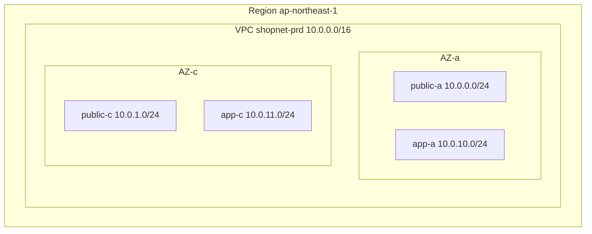

---
tags:
  - Must
  - AWS
  - VPC
  - Subnet
  - Troubleshooting
---

# VPC, subnet và Availability Zone liên hệ với nhau thế nào, và vì sao chia CIDR sai thì khó sửa?

## Metadata

```yaml
Chapter: vpc-subnet-az
Phase: 06 — aws-networking
Importance: Must
Status: draft
Prerequisites:
  - Phase 01 / 05-cidr-subnetting
  - Phase 01 / 06-private-public-ip-rfc1918
Used Later:
  - Phase 06 / 02-route-table-igw-nat-gateway
  - Phase 06 / 03-security-group-and-nacl
  - Phase 06 / 05-eni-and-ip-allocation
  - Phase 06 / 07-route53
  - Phase 06 / 13-cidr-planning-multi-env
Estimated Reading: 40 phút
Estimated Practice: 45 phút
```

## 1. Story

<!-- Mức bắt buộc (Must): Đủ -->
<!-- DRAFT: người học cần viết lại bằng lời mình -->

Đội `shopnet` dựng VPC đầu tiên cho môi trường `prd` với CIDR `10.0.0.0/24` ("cho gọn"), chia thành hai subnet `/25`. Vài tháng sau họ thêm load balancer, endpoint, ECS task và nhận ra cả VPC chỉ còn vài chục địa chỉ trống. Họ muốn mở rộng, nhưng kích thước của một khối CIDR **không thể thay đổi** sau khi tạo; họ chỉ có thể gắn thêm khối CIDR thứ hai, rồi phải tạo subnet mới và di chuyển tài nguyên. Trong khi đó, môi trường `stg` do nhóm khác dựng cũng dùng `10.0.0.0/24`; khi cần nối hai VPC với nhau, hai dải **trùng nhau** nên không nối được.

Chapter này đặt nền cho cả Phase 06: VPC là gì, subnet nằm ở đâu, một subnet "public" hay "private" thật sự khác nhau ở điểm nào, và những quyết định CIDR nào đắt đỏ nếu làm sai.

## 2. Objectives

<!-- Mức bắt buộc (Must): Đủ -->
<!-- DRAFT: người học cần viết lại bằng lời mình -->

Sau chapter này bạn có thể:

- Giải thích VPC và subnet, và mối quan hệ giữa subnet với Availability Zone.
- Tính số địa chỉ dùng được trong một subnet AWS (có 5 địa chỉ bị giữ).
- Phân biệt subnet public/private/isolated theo **bảng định tuyến**, không theo tên.
- Chọn kích thước VPC/subnet hợp lý và nêu giới hạn không thể thay đổi.
- Chẩn đoán lỗi: hết IP trong subnet, hai VPC trùng CIDR, subnet "private" lại ra được Internet.

## 3. Prerequisites

<!-- Mức bắt buộc (Must): Đủ -->
<!-- DRAFT: người học cần viết lại bằng lời mình -->

> Xem lại: [cidr-subnetting](../phase-01-foundation/05-cidr-subnetting.md), [private-public-ip-rfc1918](../phase-01-foundation/06-private-public-ip-rfc1918.md)

Cần nhớ: cách đọc CIDR và chia mạng con (`01/05`), dải private RFC 1918 và dải tài liệu RFC 5737 (`01/06`).

## 4. Why it exists

<!-- Mức bắt buộc (Must): Đủ -->
<!-- DRAFT: người học cần viết lại bằng lời mình -->

Trên đám mây, nhiều khách hàng dùng chung hạ tầng vật lý. Cần một cách để mỗi khách có **mạng riêng của mình**, tách khỏi người khác, tự chọn dải địa chỉ, tự quyết ai ra/vào. **VPC (Virtual Private Cloud — mạng riêng ảo trên AWS, một mạng tách biệt logic mà bạn kiểm soát)** là đơn vị đó. Bên trong VPC, **subnet (mạng con)** chia nhỏ dải địa chỉ và gắn từng phần vào một **Availability Zone (AZ — vùng khả dụng, một cụm trung tâm dữ liệu độc lập trong một Region)** để chịu lỗi.

Nếu hiểu sai: chọn CIDR quá nhỏ/trùng (Story), đặt mọi thứ trong một AZ (một sự cố là mất hết), nhầm "private" theo tên subnet mà không kiểm tra route (lộ ra Internet hoặc ngược lại không ra được Internet).

## 5. Mental model

<!-- Mức bắt buộc (Must): Đủ -->
<!-- DRAFT: người học cần viết lại bằng lời mình -->

Hình dung VPC là **một khu công nghiệp có tường rào riêng** (Region), subnet là **các nhà xưởng** trong khu, và mỗi nhà xưởng được xây trên **một lô đất vật lý duy nhất** (AZ): nhà xưởng không thể vắt ngang hai lô đất. Một nhà xưởng là "public" hay "private" tùy ở chỗ **có cổng nào mở thẳng ra đường lớn hay không** (route tới Internet gateway), không phải tùy tên bảng hiệu.

**Tóm tắt một câu:** VPC là mạng riêng với dải CIDR bạn chọn; subnet là một phần của dải đó nằm trọn trong một AZ; "public/private" do route quyết định.

## 6. How it works

<!-- Mức bắt buộc (Must): Đủ -->
<!-- DRAFT: người học cần viết lại bằng lời mình -->

Các từ cần biết:

- **VPC (mạng riêng ảo — mạng tách biệt logic trên AWS, thuộc một Region).**
- **Region (khu vực — nhóm trung tâm dữ liệu ở một vùng địa lý, ví dụ Tokyo `ap-northeast-1`).**
- **Availability Zone (AZ, vùng khả dụng — một hoặc nhiều trung tâm dữ liệu độc lập trong Region; lỗi ở AZ này không nên kéo theo AZ khác).**
- **Subnet (mạng con — một dải con của VPC, nằm trọn trong một AZ).**
- **Public subnet (subnet công khai — có route trực tiếp tới Internet gateway).**
- **Private subnet (subnet riêng — không có route trực tiếp tới Internet gateway).**
- **Isolated subnet (subnet cô lập — không có route nào ra ngoài VPC).**

**Quy tắc kích thước (theo tài liệu AWS):**

| Đối tượng | Quy tắc |
|---|---|
| VPC IPv4 | Một khối CIDR chính từ `/16` (65.536 địa chỉ) đến `/28` (16 địa chỉ); có thể gắn thêm khối CIDR phụ |
| Đổi kích thước | **Không** tăng/giảm được khối CIDR đã có; khối chính không gỡ được |
| Subnet IPv4 | Từ `/28` đến `/16`; các subnet trong VPC **không được chồng lấn** |
| Địa chỉ bị giữ | 5 địa chỉ mỗi subnet: 4 địa chỉ đầu và 1 địa chỉ cuối |
| Phạm vi | Mỗi subnet nằm **trọn trong một AZ**, không vắt ngang |
| Dải không được dùng cho VPC | `0.0.0.0/8`, `127.0.0.0/8`, `169.254.0.0/16`, `224.0.0.0/4` |

**Năm địa chỉ bị giữ** trong subnet `10.0.0.0/24`: `10.0.0.0` (địa chỉ mạng), `10.0.0.1` (router của VPC), `10.0.0.2` (DNS của VPC: đầu dải VPC cộng 2), `10.0.0.3` (dự phòng cho tương lai), `10.0.0.255` (quảng bá, không dùng trong VPC). Vậy subnet `/24` còn **251** địa chỉ dùng được, `/28` còn **11**.



**Đọc sơ đồ:** một VPC thuộc một Region; bên trong có subnet ở **hai AZ** để một AZ sập thì AZ còn lại tiếp tục. Mỗi AZ có một cặp public/app subnet; dải được chia có chủ đích (public dùng `10.0.0–9.x`, app dùng `10.0.10+.x`) để dễ đọc và để dành chỗ. Tên "public"/"app" chỉ là nhãn; thực tế do bảng định tuyến gắn với từng subnet quyết định (`06/02`).

**Public, private, isolated là do route (theo tài liệu AWS).** Public subnet có route trực tiếp tới Internet gateway; private subnet không có route trực tiếp tới Internet gateway và cần thiết bị NAT để ra Internet; isolated subnet không có route nào ra ngoài VPC. Mỗi subnet được gắn tự động với **main route table** của VPC cho tới khi bạn gắn bảng khác (`06/02`). Mỗi subnet cũng luôn gắn với một network ACL, mặc định cho phép mọi lưu lượng (`06/03`).

**Địa chỉ IP công khai tự gán** là thuộc tính của subnet: nếu bật, network interface mới tạo trong subnet được gắn địa chỉ IPv4 công khai (có thể ghi đè lúc tạo instance). Tài liệu AWS nêu VPC **mặc định** (default VPC) đi kèm Internet gateway, route `0.0.0.0/0`, và tự gán IP công khai; VPC tự tạo (không mặc định) **không** có những thứ đó. Vì thế các instance trong default VPC dễ vô tình ra được Internet.

**Chia CIDR có chủ đích.** Quy tắc thực tế: chọn dải VPC đủ lớn (thường `/16`) và **không trùng** với VPC khác, mạng on-premise hay dải VPN sẽ nối tới; chia subnet theo vai trò và theo AZ; chừa chỗ để thêm subnet sau (đừng dùng hết dải). Tài liệu AWS cảnh báo một số dịch vụ AWS dùng `172.17.0.0/16`, nên tránh dải này. Lập kế hoạch nhiều môi trường: `06/13`.

> Bảng định tuyến, Internet gateway, NAT: `06/02`; security group và NACL: `06/03`; ENI và cấp IP: `06/05`.

<!-- verified: 2026-10-05 https://docs.aws.amazon.com/vpc/latest/userguide/vpc-cidr-blocks.html -->
<!-- verified: 2026-10-05 https://docs.aws.amazon.com/vpc/latest/userguide/subnet-sizing.html -->
<!-- verified: 2026-10-05 https://docs.aws.amazon.com/vpc/latest/userguide/configure-subnets.html -->
<!-- verified: 2026-10-05 https://docs.aws.amazon.com/vpc/latest/userguide/VPC_Internet_Gateway.html -->

## 7. Key settings

<!-- Mức bắt buộc (Must): Đủ -->
<!-- DRAFT: người học cần viết lại bằng lời mình -->

| Thông số | Ý nghĩa | Nếu sai |
|---|---|---|
| CIDR chính của VPC | Dải địa chỉ của cả VPC | Quá nhỏ hoặc trùng mạng khác → khó sửa (Story) |
| CIDR phụ (secondary) | Mở rộng thêm dải | Có quy tắc hạn chế; không chồng lấn với route hiện có |
| CIDR từng subnet | Kích thước từng nhóm | `/28` chỉ còn 11 địa chỉ, dễ hết (ALB, endpoint, ENI cần IP) |
| AZ của subnet | Chịu lỗi | Mọi thứ ở một AZ → một sự cố là mất hết |
| Route table gắn với subnet | Public/private/isolated | Quên gắn → dùng main route table, hành vi bất ngờ (`06/02`) |
| Auto-assign public IP | Có IP công khai không | Bật nhầm → instance "private" có IP công khai (chưa chắc ra được Internet nếu thiếu route) |
| DNS hostnames / DNS support của VPC | Phân giải tên trong VPC | Tắt → dịch vụ cần tên (endpoint, `06/04`, `06/06`) lỗi |
| Tag (`Project=net-handbook`) | Truy vết và dọn dẹp | Thiếu tag → khó teardown và kiểm soát chi phí |

**Lệnh quan sát (AWS CLI, chỉ đọc):**

```bash
aws ec2 describe-vpcs --query "Vpcs[].{id:VpcId,cidr:CidrBlock,default:IsDefault}" --output table
aws ec2 describe-subnets --filters Name=vpc-id,Values=<vpc-id> \
  --query "Subnets[].{id:SubnetId,az:AvailabilityZone,cidr:CidrBlock,free:AvailableIpAddressCount}" --output table
```

Cột `AvailableIpAddressCount` cho biết **số IP còn trống** trong từng subnet (đã trừ 5 địa chỉ bị giữ); đây là chỉ số cần theo dõi để tránh Story.

## 8. AWS mapping

<!-- Mức bắt buộc (Must): Đủ -->
<!-- DRAFT: người học cần viết lại bằng lời mình -->

| Khái niệm | AWS | CloudFormation |
|---|---|---|
| VPC | VPC | `AWS::EC2::VPC` |
| CIDR phụ | VPC CIDR block association | `AWS::EC2::VPCCidrBlock` |
| Subnet | Subnet | `AWS::EC2::Subnet` |
| Gắn subnet với bảng route | Route table association | `AWS::EC2::SubnetRouteTableAssociation` |
| AZ | `AvailabilityZone` của subnet (ví dụ `ap-northeast-1a`) | thuộc tính `AvailabilityZone` |

**IAM tối thiểu cho lab:** quyền `ec2:CreateVpc`, `ec2:CreateSubnet`, `ec2:CreateTags`, `ec2:Describe*` và các quyền xóa tương ứng, giới hạn theo tag `Project=net-handbook` khi có thể. Dùng tài khoản sandbox riêng, không dùng quyền quản trị cho việc hằng ngày.

**Chi phí:** VPC và subnet **không** tính phí riêng; chi phí phát sinh từ tài nguyên đặt bên trong (NAT gateway, endpoint, instance). Kiểm tra bảng giá hiện hành, không dựa vào trí nhớ.

## 9. Hands-on lab

<!-- Mức bắt buộc (Must): Đủ -->
<!-- DRAFT: người học cần viết lại bằng lời mình -->

Chi tiết ở `labs/phase-06-aws-networking/chapter-01-vpc-subnet-az/README.md`.

- **Phần A (local, không AWS):** tính số IP dùng được trong từng subnet bằng Python (trừ 5 địa chỉ bị giữ), kiểm tra chồng lấn và lập kế hoạch CIDR.
- **Phần B (AWS sandbox, tùy chọn, không tốn phí riêng):** tạo VPC và hai subnet bằng AWS CLI với `--dry-run` trước, kiểm tra `AvailableIpAddressCount`, rồi teardown.

**1. Predict:** subnet `10.0.1.0/28` còn bao nhiêu IP dùng được? AWS báo `AvailableIpAddressCount` bằng bao nhiêu khi mới tạo? Hai subnet `10.0.1.0/24` và `10.0.1.128/25` trong cùng VPC có tạo được không?

**2. Run / 3. Verify:** xem README lab; output thật `[CHƯA CHẠY]`.

## 10. Break it

<!-- Mức bắt buộc (Must): Đủ -->
<!-- DRAFT: người học cần viết lại bằng lời mình -->

**Lỗi 1 — subnet quá nhỏ (Story).**
Dự đoán: subnet `/28` chỉ có 11 địa chỉ dùng được; tạo thêm instance/ENI quá số đó thì lỗi "không đủ địa chỉ IP". Khôi phục: tạo subnet lớn hơn và di chuyển tài nguyên (không đổi được kích thước subnet đã có).

**Lỗi 2 — chồng lấn.**
Dự đoán: tạo subnet `10.0.1.128/25` trong VPC đã có subnet `10.0.1.0/24` bị từ chối vì chồng lấn.

**Lỗi 3 — hai VPC trùng CIDR.**
Dự đoán: hai VPC cùng `10.0.0.0/16` có thể tạo riêng rẽ, nhưng khi nối (peering/TGW, `06/09`) sẽ bị từ chối hoặc không định tuyến đúng. Phát hiện sớm bằng kiểm tra chồng lấn trước khi tạo.

Kết quả thật: `[CHƯA CHẠY]`.

## 11. Troubleshooting

<!-- Mức bắt buộc (Must): Đủ -->
<!-- DRAFT: người học cần viết lại bằng lời mình -->

| Triệu chứng | Giả thuyết đầu tiên | Kiểm tra theo thứ tự | Công cụ |
|---|---|---|---|
| Không tạo được instance/ENI: "không đủ IP" | Subnet hết địa chỉ | 1) `AvailableIpAddressCount` 2) Ai chiếm IP (ENI, endpoint, LB) 3) Subnet ở AZ nào | `describe-subnets`, `describe-network-interfaces` |
| Không nối được hai VPC | CIDR trùng/chồng lấn | So CIDR hai VPC (cả CIDR phụ) | `describe-vpcs` |
| Subnet "private" ra được Internet | Route `0.0.0.0/0` → IGW (có thể do main route table) | Bảng route thực tế của subnet (`06/02`) | `describe-route-tables` |
| Subnet "public" không ra được Internet | Thiếu route IGW, thiếu IP công khai, SG/NACL chặn | Chuỗi: IGW gắn VPC → route → IP công khai → SG → NACL | Console/CLI, `06/11` |
| Dịch vụ không phân giải tên trong VPC | Tắt DNS support/hostnames | Thuộc tính VPC | `describe-vpc-attribute` |
| Một sự cố AZ làm sập cả hệ thống | Mọi tài nguyên ở một AZ | Phân bố tài nguyên theo AZ | `describe-subnets` |

Ghi kết quả thật của mục 10: `[CHƯA CHẠY]`.

## 12. Security & cost

<!-- Mức bắt buộc (Must): Đủ -->
<!-- DRAFT: người học cần viết lại bằng lời mình -->

- **Dùng private subnet cho tài nguyên không cần Internet trực tiếp** (tài liệu AWS khuyến nghị dùng private subnet; truy cập ra ngoài bằng thiết bị NAT hoặc bastion, `05/05`).
- **Default VPC dễ lộ:** có sẵn Internet gateway và tự gán IP công khai; tránh dùng cho workload thật.
- **Không dùng dải trùng** mạng on-premise/đối tác; kiểm tra trước khi nối.
- **Tag bắt buộc** để dọn dẹp và quy trách nhiệm chi phí.
- Không dán VPC ID, account ID, CIDR thật vào tài liệu công khai.
- **Chi phí:** VPC/subnet miễn phí riêng; tài nguyên bên trong tính phí. Lab ở mục 9 không tạo tài nguyên tính phí; vẫn đặt budget alert và chạy teardown.

## 13. Misconceptions

<!-- Mức bắt buộc (Must): Đủ -->
<!-- DRAFT: người học cần viết lại bằng lời mình -->

| Hiểu nhầm | Sự thật |
|---|---|
| "Subnet public là subnet có tên public" | Do route tới Internet gateway quyết định |
| "Subnet có thể vắt qua nhiều AZ" | Mỗi subnet nằm trọn trong một AZ |
| "Mở rộng VPC bằng cách đổi CIDR" | Không đổi kích thước CIDR; chỉ gắn thêm khối phụ |
| "Subnet `/24` có 256 IP dùng được" | Còn 251 vì 5 địa chỉ bị giữ |
| "Instance có IP công khai thì chắc ra được Internet" | Cần cả route tới IGW, SG/NACL cho phép |
| "VPC khác nhau tự nối được" | Cần peering/TGW/VPN và CIDR không trùng |
| "Default VPC an toàn như VPC tự dựng" | Có sẵn IGW và IP công khai tự gán |
| "VPC và subnet tốn tiền" | Miễn phí riêng; tài nguyên bên trong mới tính phí |

## 14. Interview questions

<!-- Mức bắt buộc (Must): Đủ -->
<!-- DRAFT: người học cần viết lại bằng lời mình -->

### Q1 (Junior) — VPC, subnet và AZ khác nhau thế nào?

**Gợi ý ý chính:**
- Phạm vi của từng thứ?
- Subnet vắt qua AZ được không?

??? success "Đáp án mẫu (tự trả lời trước khi mở)"
    VPC là mạng riêng ảo thuộc một Region với dải CIDR bạn chọn. Subnet là một phần của dải đó và nằm trọn trong một AZ. AZ là cụm trung tâm dữ liệu độc lập trong Region; trải tài nguyên qua nhiều AZ để chịu lỗi.

### Q2 (Junior) — Subnet public và private khác nhau ở điểm nào?

**Gợi ý ý chính:**
- Quyết định bởi gì?

??? success "Đáp án mẫu (tự trả lời trước khi mở)"
    Khác nhau ở bảng định tuyến: public subnet có route trực tiếp tới Internet gateway, private thì không (cần NAT để ra Internet). Tên subnet không quyết định gì; phải kiểm tra route table thực tế.

### Q3 (Middle) — Subnet `10.0.5.0/24` dùng được bao nhiêu IP và vì sao?

**Gợi ý ý chính:**
- 5 địa chỉ bị giữ là gì?

??? success "Đáp án mẫu (tự trả lời trước khi mở)"
    251. Một `/24` có 256 địa chỉ; AWS giữ 5: địa chỉ mạng, router của VPC (`.1`), DNS (`.2`), dự phòng (`.3`) và địa chỉ quảng bá (`.255`).

### Q4 (Middle) — Vì sao chọn CIDR cho VPC là quyết định khó đổi? Bạn chọn thế nào?

**Gợi ý ý chính:**
- Đổi kích thước được không?
- Nối mạng khác?

??? success "Đáp án mẫu (tự trả lời trước khi mở)"
    Không thể đổi kích thước khối CIDR đã tạo (chỉ gắn thêm khối phụ) và các VPC/mạng trùng CIDR không nối được. Chọn dải đủ lớn (thường `/16`), không trùng VPC/on-premise/đối tác dự định nối, thuộc RFC 1918 (tránh `172.17.0.0/16` vì một số dịch vụ AWS dùng), chia subnet theo vai trò và AZ, và chừa chỗ để mở rộng.

## 15. Exercises

<!-- Mức bắt buộc (Must): Đủ -->
<!-- DRAFT: người học cần viết lại bằng lời mình -->

1. **Kế hoạch CIDR.** *Deliverable:* bảng cho `shopnet-prd` (`10.0.0.0/16`) gồm 6 subnet (public, app, data × 2 AZ) với CIDR, AZ, số IP dùng được, và lý do chọn kích thước.
2. **Tính IP.** *Deliverable:* bảng số IP dùng được của `/28`, `/26`, `/24`, `/20` sau khi trừ 5 địa chỉ bị giữ.
3. **Phân tích Story.** *Deliverable:* kế hoạch di chuyển từ `10.0.0.0/24` sang thiết kế đủ chỗ (gắn CIDR phụ, subnet mới, thứ tự di chuyển) và rủi ro.
4. **Phát hiện trùng.** Cho 4 CIDR của các VPC/mạng khác nhau. *Deliverable:* cặp nào chồng lấn (dùng Python ở lab) và đề xuất đánh số lại.

## 16. Cheat sheet

<!-- Mức bắt buộc (Must): Đủ -->
<!-- DRAFT: người học cần viết lại bằng lời mình -->

| Mục | Nội dung |
|---|---|
| VPC IPv4 | `/16`–`/28`; không đổi kích thước; thêm CIDR phụ được |
| Subnet | `/16`–`/28`; một AZ; không chồng lấn |
| IP bị giữ | 5 mỗi subnet (`.0`, `.1` router, `.2` DNS, `.3`, cuối) |
| Public/private | Quyết định bằng route tới IGW |
| Default VPC | Có IGW + tự gán IP công khai |
| Tránh | `172.17.0.0/16`; trùng CIDR với mạng sẽ nối |
| Lệnh | `describe-vpcs`, `describe-subnets` (`AvailableIpAddressCount`) |

**Debug:** hết IP → `AvailableIpAddressCount`; không nối được VPC → CIDR trùng; "private" ra Internet → route table; không phân giải tên → thuộc tính DNS của VPC.

## 17. Glossary terms

<!-- Mức bắt buộc (Must): Đủ -->
<!-- DRAFT: người học cần viết lại bằng lời mình -->

- VPC / mạng riêng ảo / VPC
- Region / khu vực / リージョン
- Availability Zone / vùng khả dụng / アベイラビリティゾーン
- Subnet / mạng con / サブネット
- Public subnet / subnet công khai / パブリックサブネット
- Private subnet / subnet riêng / プライベートサブネット
- Isolated subnet / subnet cô lập / 分離サブネット

## 18. Further reading

<!-- Mức bắt buộc (Must): Đủ -->
<!-- DRAFT: người học cần viết lại bằng lời mình -->

Kiểm tra ngày 2026-10-05:

- VPC CIDR blocks: https://docs.aws.amazon.com/vpc/latest/userguide/vpc-cidr-blocks.html
- Subnet CIDR blocks: https://docs.aws.amazon.com/vpc/latest/userguide/subnet-sizing.html
- Subnets for your VPC: https://docs.aws.amazon.com/vpc/latest/userguide/configure-subnets.html
- Internet gateway: https://docs.aws.amazon.com/vpc/latest/userguide/VPC_Internet_Gateway.html
