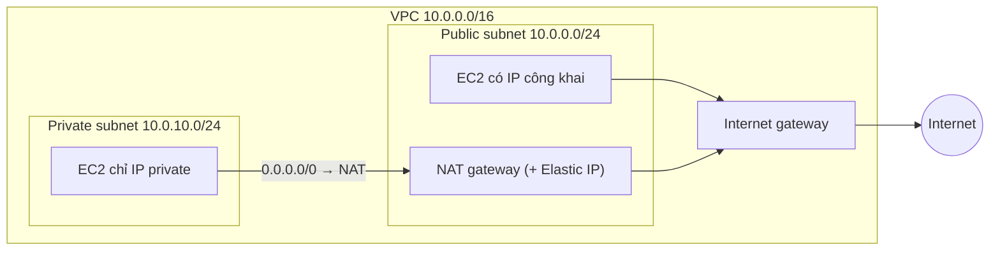

---
tags:
  - Must
  - AWS
  - Routing
  - NAT
  - Troubleshooting
---

# Route table, Internet gateway và NAT gateway phối hợp thế nào để subnet ra được Internet?

## Metadata

```yaml
Chapter: route-table-igw-nat-gateway
Phase: 06 — aws-networking
Importance: Must
Status: draft
Prerequisites:
  - Phase 02 / 03-default-route-gateway
  - Phase 02 / 05-nat-pat
  - Phase 06 / 01-vpc-subnet-az
Used Later:
  - Phase 06 / 04-vpc-endpoints-gateway-interface-gwlb
  - Phase 06 / 09-vpc-peering-transit-gateway
  - Phase 06 / 12-network-iac-cloudformation
  - Phase 08 / 04-interview-aws-networking
Estimated Reading: 40 phút
Estimated Practice: 45 phút
```

## 1. Story

<!-- Mức bắt buộc (Must): Đủ -->
<!-- DRAFT: người học cần viết lại bằng lời mình -->

Đội `shopnet` có một VPC với hai subnet `public` và `app`. Một kỹ sư mới thêm subnet `batch` cho job nội bộ và **quên gắn route table** cho nó. Subnet mới tự động dùng **main route table** của VPC. Trước đó, có người đã thêm route `0.0.0.0/0 → Internet gateway` vào chính main route table "cho tiện thử nghiệm". Kết quả: subnet `batch` vô tình **trở thành public**; các instance có IP công khai trong đó ra/vào được Internet mà không ai định thế.

Sự cố ngược lại cũng hay gặp: subnet `app` dùng NAT gateway ở một AZ; AZ đó gặp sự cố và toàn bộ subnet ở AZ khác (dùng chung NAT) mất kết nối ra ngoài. Cả hai đều xuất phát từ việc không hiểu rõ **route table quyết định gì** và **NAT gateway nằm ở đâu**.

## 2. Objectives

<!-- Mức bắt buộc (Must): Đủ -->
<!-- DRAFT: người học cần viết lại bằng lời mình -->

Sau chapter này bạn có thể:

- Đọc một route table của VPC và dự đoán gói tin đi đâu (local, IGW, NAT, peering...).
- Giải thích vai trò của Internet gateway và NAT gateway, và khác nhau giữa chúng.
- Dựng kiến trúc public/private đúng: NAT gateway nằm trong public subnet, route đúng, mỗi AZ có NAT riêng.
- Giải thích bẫy main route table và cách tránh.
- Chẩn đoán "instance không ra được Internet" theo một chuỗi kiểm tra cố định.

## 3. Prerequisites

<!-- Mức bắt buộc (Must): Đủ -->
<!-- DRAFT: người học cần viết lại bằng lời mình -->

> Xem lại: [default-route-gateway](../phase-02-routing/03-default-route-gateway.md), [nat-pat](../phase-02-routing/05-nat-pat.md), [vpc-subnet-az](01-vpc-subnet-az.md)

Cần nhớ: longest prefix match và default route (`02/02`, `02/03`); NAT/PAT (`02/05`); VPC, subnet, public/private (`06/01`).

## 4. Why it exists

<!-- Mức bắt buộc (Must): Đủ -->
<!-- DRAFT: người học cần viết lại bằng lời mình -->

Instance trong VPC chỉ có địa chỉ private. Muốn gửi gói tin ra Internet (hoặc tới VPC/on-premise khác), cần ba thứ: (1) **bảng định tuyến (route table)** nói "đích này đi qua đâu"; (2) một **cửa ra** (Internet gateway) để rời VPC; (3) với instance chỉ có IP private, một **thiết bị dịch địa chỉ (NAT)** để gói tin ra ngoài với địa chỉ công khai mà không cho Internet chủ động gọi vào.

Nếu hiểu sai: subnet vô tình public (Story), subnet private không ra được Internet, NAT đặt nhầm subnet, một NAT cho nhiều AZ gây điểm hỏng đơn lẻ, hóa đơn NAT bất ngờ.

## 5. Mental model

<!-- Mức bắt buộc (Must): Đủ -->
<!-- DRAFT: người học cần viết lại bằng lời mình -->

Hình dung **khu nhà xưởng** của `06/01`. **Route table** là **bảng chỉ đường gắn ở cổng mỗi xưởng**: "gửi hàng đi địa chỉ nào thì ra cổng nào". **Internet gateway** là **cổng lớn ra đường quốc lộ**; xưởng nào có biển chỉ về cổng này và có địa chỉ công khai thì liên lạc hai chiều với bên ngoài. **NAT gateway** là **bưu cục chuyển phát ở cổng chính**: xưởng "kín" (private) gửi thư qua bưu cục, bưu cục đóng dấu địa chỉ công khai của nó rồi gửi đi; thư trả lời về bưu cục và được chuyển lại; nhưng người ngoài không tự gửi thư đến xưởng kín được.

**Tóm tắt một câu:** route table quyết định đường đi; Internet gateway là cửa hai chiều cho IP công khai; NAT gateway cho subnet private đi ra một chiều qua địa chỉ công khai của nó.

## 6. How it works

<!-- Mức bắt buộc (Must): Đủ -->
<!-- DRAFT: người học cần viết lại bằng lời mình -->

Các từ cần biết:

- **Route table (bảng định tuyến — danh sách "đích nào thì gửi qua đường nào").**
- **Local route (route nội bộ — route tự có, đưa gói tin đi trong VPC).**
- **Main route table (bảng route mặc định — bảng mà subnet dùng nếu chưa được gắn bảng riêng).**
- **Internet gateway (IGW — cổng Internet của VPC, cho phép liên lạc hai chiều với Internet qua địa chỉ công khai).**
- **NAT gateway (cổng NAT — dịch vụ để instance ở private subnet kết nối ra ngoài nhưng không nhận kết nối chủ động từ ngoài vào).**
- **Elastic IP (địa chỉ IP công khai cố định gắn vào tài nguyên của bạn).**

**Cách chọn route.** Theo tài liệu AWS, route table có các route gồm *đích* (CIDR hoặc prefix list) và *đích đến tiếp theo* (target: IGW, NAT gateway, peering, VPN...). Gói tin đi theo route **cụ thể nhất** khớp đích (longest prefix match, `02/02`). Khi có route trùng đích, thứ tự ưu tiên: prefix dài nhất trước; rồi route tĩnh (IGW, NAT gateway, peering, TGW, gateway endpoint...); rồi route prefix list; rồi route lan truyền (propagated) từ Direct Connect/VPN. Route `local` cho dải CIDR của VPC luôn có sẵn.



**Đọc sơ đồ:** instance ở public subnet đi thẳng qua IGW (route `0.0.0.0/0 → IGW`). Instance ở private subnet có route `0.0.0.0/0 → NAT gateway`; NAT gateway **nằm trong public subnet** và dùng IGW để ra Internet. Mỗi thành phần tồn tại vì một lý do: IGW là cửa; NAT che địa chỉ private và chỉ cho kết nối khởi tạo từ trong ra; route table gắn các mảnh lại với nhau.

**Internet gateway.** Theo tài liệu AWS, IGW có tính sẵn sàng cao và co giãn theo chiều ngang, không gây giới hạn băng thông, không tính phí riêng (có phí truyền dữ liệu). Với IPv4, IGW thực hiện NAT một-một giữa địa chỉ private của instance và địa chỉ công khai/Elastic IP của nó. Để ra Internet qua IGW, instance cần: IGW gắn vào VPC, route tới IGW, **địa chỉ IPv4 công khai (hoặc IPv6)**, và security group/NACL cho phép (`06/03`). Subnet có route tới IGW là public; instance trong private subnet **dù có IP công khai** vẫn không liên lạc được với Internet vì thiếu route tới IGW.

**NAT gateway.** Theo tài liệu AWS:

- Loại **public** (mặc định): đặt trong **public subnet**, bắt buộc gắn một Elastic IP khi tạo; route từ NAT tới IGW. Loại **private**: dùng để nối tới VPC khác hoặc on-premise, không gắn Elastic IP.
- Kết nối chỉ được **khởi tạo từ bên trong** VPC.
- Mỗi NAT gateway được tạo trong **một AZ** và dự phòng trong AZ đó. Nếu nhiều AZ dùng chung một NAT gateway và AZ chứa nó gặp sự cố, các AZ còn lại **mất kết nối Internet**; để chịu lỗi, tạo NAT gateway ở **mỗi AZ** và route để mỗi subnet dùng NAT cùng AZ. (Tài liệu AWS còn có loại NAT gateway "regional" tự mở rộng nhiều AZ; xem tài liệu hiện hành khi thiết kế.)
- Hỗ trợ TCP, UDP, ICMP; băng thông 5 Gbps, tự co giãn tới 100 Gbps.
- Mỗi địa chỉ IPv4 hỗ trợ tối đa **55.000 kết nối đồng thời** tới mỗi đích duy nhất (đích duy nhất = IP đích + cổng đích + giao thức); có thể tăng bằng cách gắn thêm địa chỉ. Đây chính là giới hạn "cạn cổng tạm" ở `04/04` khi nhiều máy gọi cùng một đích.
- **Không** gắn security group vào NAT gateway (gắn vào instance); có thể dùng NACL cho subnet chứa nó; NAT gateway dùng cổng 1024–65535.
- Lưu ý: không định tuyến tới NAT gateway qua VPC peering; không định tuyến tới NAT gateway từ Site-to-Site VPN/Direct Connect qua virtual private gateway (dùng transit gateway nếu cần).

**Main route table và bẫy Story.** Theo tài liệu AWS, mọi subnet mới được **tự động** gắn với main route table cho tới khi bạn gắn bảng khác. Vì vậy **không bao giờ thêm route tới IGW vào main route table**: mọi subnet quên gắn bảng sẽ thành public. Cách tốt: để main route table chỉ có route `local`, tạo route table riêng cho từng loại subnet (public/private/isolated), và gắn tường minh.

**Bảng route mẫu:**

| Route table | Destination | Target | Ý nghĩa |
|---|---|---|---|
| `rt-public` | `10.0.0.0/16` | local | Nội bộ VPC |
| `rt-public` | `0.0.0.0/0` | IGW | Ra Internet hai chiều |
| `rt-private-a` | `10.0.0.0/16` | local | Nội bộ VPC |
| `rt-private-a` | `0.0.0.0/0` | NAT gateway ở AZ-a | Ra Internet một chiều |
| `rt-isolated` | `10.0.0.0/16` | local | Chỉ nội bộ |

> Phân tích "instance không ra được Internet": dùng `06/11` (Flow Logs, Reachability Analyzer). Endpoint thay NAT cho dịch vụ AWS: `06/04`.

<!-- verified: 2026-10-05 https://docs.aws.amazon.com/vpc/latest/userguide/route-tables-priority.html -->
<!-- verified: 2026-10-05 https://docs.aws.amazon.com/vpc/latest/userguide/vpc-nat-gateway.html -->
<!-- verified: 2026-10-05 https://docs.aws.amazon.com/vpc/latest/userguide/nat-gateway-basics.html -->
<!-- verified: 2026-10-05 https://docs.aws.amazon.com/vpc/latest/userguide/VPC_Internet_Gateway.html -->
<!-- verified: 2026-10-05 https://docs.aws.amazon.com/vpc/latest/userguide/configure-subnets.html -->

## 7. Key settings

<!-- Mức bắt buộc (Must): Đủ -->
<!-- DRAFT: người học cần viết lại bằng lời mình -->

| Thông số | Ý nghĩa | Nếu sai |
|---|---|---|
| Route `0.0.0.0/0` của từng route table | Đường ra mặc định | Trỏ IGW cho subnet private → thành public; thiếu → không ra được |
| Main route table | Bảng mặc định cho subnet chưa gắn | Có route IGW → subnet quên gắn bị public (Story) |
| Gắn route table với subnet | Subnet dùng bảng nào | Quên gắn → dùng main |
| Vị trí NAT gateway | Phải ở public subnet | Đặt ở private subnet → không ra Internet |
| Elastic IP cho NAT | IP công khai khi ra ngoài | Quên → không tạo được NAT public |
| NAT theo AZ | Chịu lỗi AZ | Một NAT cho mọi AZ → điểm hỏng đơn lẻ, và truyền dữ liệu giữa AZ |
| Địa chỉ IP công khai của instance (khi dùng IGW trực tiếp) | Cần để ra qua IGW | Thiếu → không ra được |
| Route cụ thể hơn (peering, VPN, endpoint) | Ghi đè default | Route sai chiếm đường (xem longest prefix) |

**Lệnh quan sát (chỉ đọc):**

```bash
aws ec2 describe-route-tables --filters Name=vpc-id,Values=<vpc-id> \
  --query "RouteTables[].{id:RouteTableId,main:Associations[?Main==\`true\`]|[0].Main,assoc:Associations[].SubnetId,routes:Routes[].[DestinationCidrBlock,GatewayId,NatGatewayId]}"
aws ec2 describe-nat-gateways --filter Name=vpc-id,Values=<vpc-id> \
  --query "NatGateways[].{id:NatGatewayId,subnet:SubnetId,state:State}"
```

Để tìm subnet **không** gắn bảng riêng (đang dùng main), tìm subnet không xuất hiện trong `assoc` của bảng nào.

## 8. AWS mapping

<!-- Mức bắt buộc (Must): Đủ -->
<!-- DRAFT: người học cần viết lại bằng lời mình -->

| Khái niệm | AWS | CloudFormation |
|---|---|---|
| Route table | Route table | `AWS::EC2::RouteTable` |
| Một route | Route | `AWS::EC2::Route` |
| Gắn route table với subnet | Association | `AWS::EC2::SubnetRouteTableAssociation` |
| Internet gateway | Internet gateway | `AWS::EC2::InternetGateway` + `AWS::EC2::VPCGatewayAttachment` |
| NAT gateway | NAT gateway | `AWS::EC2::NatGateway` |
| IP cố định cho NAT | Elastic IP | `AWS::EC2::EIP` |

**IAM tối thiểu cho lab:** `ec2:CreateRouteTable`, `ec2:CreateRoute`, `ec2:AssociateRouteTable`, `ec2:CreateInternetGateway`, `ec2:AttachInternetGateway`, `ec2:Describe*` và quyền xóa tương ứng; thêm `ec2:CreateNatGateway`, `ec2:AllocateAddress`, `ec2:ReleaseAddress` chỉ khi thực hành phần NAT.

**Chi phí (cảnh báo trước khi chạy):** **NAT gateway tính phí theo giờ và theo GB** xử lý, và Elastic IP/địa chỉ IPv4 công khai cũng có thể tính phí; Internet gateway không tính phí riêng nhưng có phí truyền dữ liệu ra. Kiểm tra bảng giá hiện hành của AWS (trang NAT gateway pricing, VPC pricing); không dựa vào con số trong sách. Một NAT gateway bị bỏ quên là nguồn tốn tiền kinh điển, nên teardown ngay sau lab.

## 9. Hands-on lab

<!-- Mức bắt buộc (Must): Đủ -->
<!-- DRAFT: người học cần viết lại bằng lời mình -->

Chi tiết ở `labs/phase-06-aws-networking/chapter-02-route-table-igw-nat-gateway/README.md`.

- **Phần A (local):** mô phỏng chọn route (longest prefix + ưu tiên static) bằng Python cho các route table ở mục 6.
- **Phần B (AWS sandbox, không tính phí):** tạo VPC, IGW, hai route table, hai subnet; chứng minh bẫy main route table bằng cách đọc route; teardown.
- **Phần C (tùy chọn, TÍNH PHÍ):** NAT gateway — chỉ đọc hướng dẫn, chạy khi bạn chấp nhận chi phí và đã kiểm tra giá hiện hành; teardown ngay.

**1. Predict:** gói tới `10.0.5.9`, `172.16.0.5`, `198.51.100.8` đi theo route nào ở `rt-private-a`? Subnet vừa tạo, chưa gắn bảng, dùng bảng nào, và nếu bảng đó có `0.0.0.0/0 → IGW` thì subnet đó là public hay private?

**2. Run / 3. Verify:** xem README lab; output thật `[CHƯA CHẠY]`.

## 10. Break it

<!-- Mức bắt buộc (Must): Đủ -->
<!-- DRAFT: người học cần viết lại bằng lời mình -->

**Lỗi 1 — route IGW trong main route table (Story).**
Dự đoán: thêm `0.0.0.0/0 → IGW` vào main route table, rồi tạo subnet mới không gắn bảng; `describe-route-tables` cho thấy subnet đó dùng main và do đó có route tới IGW, tức là public. Khôi phục: xóa route khỏi main, gắn bảng riêng cho subnet.

**Lỗi 2 — NAT trong private subnet.**
Dự đoán: NAT gateway tạo trong subnet không có route tới IGW không đưa được gói ra Internet (instance private vẫn timeout). Khôi phục: tạo NAT ở public subnet.

**Lỗi 3 — thiếu IP công khai.**
Dự đoán: instance trong public subnet nhưng không có IP công khai không ra được Internet qua IGW, dù route đúng.

**Lỗi 4 — một NAT cho hai AZ.**
Dự đoán (khái niệm): AZ chứa NAT gặp sự cố → subnet ở AZ khác mất Internet. Không thử nghiệm bằng cách gây sự cố AZ; chỉ phân tích trên sơ đồ.

Kết quả thật: `[CHƯA CHẠY]`.

## 11. Troubleshooting

<!-- Mức bắt buộc (Must): Đủ -->
<!-- DRAFT: người học cần viết lại bằng lời mình -->

Chuỗi kiểm tra "instance không ra được Internet" (theo thứ tự, mỗi bước loại một nghi vấn):

| # | Kiểm tra | Nếu sai thì |
|---|---|---|
| 1 | Subnet của instance gắn route table nào (riêng hay main)? | Gắn đúng bảng |
| 2 | Bảng đó có `0.0.0.0/0` và target đúng (IGW cho public, NAT cho private)? | Thêm/sửa route |
| 3 | IGW đã **gắn** vào VPC chưa? | Gắn IGW |
| 4 | (Public) Instance có IP công khai/Elastic IP? | Gắn IP |
| 5 | (Private) NAT gateway ở **public** subnet, trạng thái `available`, có Elastic IP, subnet của NAT có route tới IGW? | Sửa vị trí/route NAT |
| 6 | Security group của instance cho phép **chiều ra** (mặc định thường cho phép tất cả)? | Sửa SG (`06/03`) |
| 7 | NACL của subnet (instance và NAT) cho phép cả chiều đi lẫn chiều trả lời (cổng tạm 1024–65535)? | Sửa NACL (`05/03`, `06/03`) |
| 8 | DNS phân giải được tên không (`dig`, `03/02`)? | Kiểm tra DNS của VPC (`06/06`) |

| Triệu chứng | Giả thuyết đầu tiên | Công cụ |
|---|---|---|
| Subnet "private" lại ra được Internet | Main route table có route IGW | `describe-route-tables` |
| Một AZ mất Internet khi AZ khác sự cố | Dùng chung NAT khác AZ | `describe-nat-gateways`, route từng bảng |
| Lỗi chỉ với một đích, nhiều kết nối | Cạn cổng NAT tới một đích (55.000 kết nối/đích/IP) | Metric NAT gateway, thêm IP |
| Ping tới Internet được, TCP không | NACL/SG chặn, hoặc MTU (`03/04`) | Flow Logs, `06/11` |

Ghi kết quả thật của mục 10: `[CHƯA CHẠY]`.

## 12. Security & cost

<!-- Mức bắt buộc (Must): Đủ -->
<!-- DRAFT: người học cần viết lại bằng lời mình -->

- **Giữ main route table "sạch"** (chỉ `local`); route ra Internet đặt ở bảng riêng.
- **NAT gateway chặn kết nối vào từ Internet nhưng không phải firewall**: egress mở rộng cho phép dữ liệu rò ra. Với dữ liệu nhạy cảm, hạn chế egress (NACL, SG, VPC endpoint thay NAT: `06/04`, hoặc thiết bị kiểm tra).
- **Không gắn IP công khai bừa bãi** cho instance trong subnet app/data.
- **Chi phí:** NAT gateway tính theo giờ và theo GB, nhân với số AZ; lưu lượng chéo AZ có phí truyền dữ liệu; nhiều lưu lượng tới dịch vụ AWS qua NAT có thể giảm bằng gateway endpoint (S3, DynamoDB) hoặc interface endpoint (`06/04`). Kiểm tra giá hiện hành.
- Không dán route table thật, ID tài nguyên thật vào tài liệu công khai.

## 13. Misconceptions

<!-- Mức bắt buộc (Must): Đủ -->
<!-- DRAFT: người học cần viết lại bằng lời mình -->

| Hiểu nhầm | Sự thật |
|---|---|
| "Subnet private là subnet có tên private" | Là subnet không có route trực tiếp tới IGW |
| "Gắn IGW vào VPC là subnet ra được Internet" | Cần route tới IGW + IP công khai + SG/NACL cho phép |
| "NAT gateway đặt ở private subnet" | Phải ở public subnet (public NAT) để dùng IGW |
| "Một NAT gateway đủ cho mọi AZ" | Dùng được nhưng là điểm hỏng đơn lẻ; AWS khuyến nghị một NAT mỗi AZ |
| "NAT gateway có security group" | Không; dùng SG ở instance và NACL ở subnet |
| "NAT gateway chặn mọi thứ vào" | Chặn kết nối **khởi tạo từ ngoài**; không thay thế firewall egress |
| "Main route table chỉ là chi tiết" | Subnet mới tự dùng nó; thêm route IGW vào đó làm subnet thành public |
| "Instance private có IP công khai thì ra được Internet" | Không có route tới IGW thì không |

## 14. Interview questions

<!-- Mức bắt buộc (Must): Đủ -->
<!-- DRAFT: người học cần viết lại bằng lời mình -->

### Q1 (Junior) — Internet gateway và NAT gateway khác nhau thế nào?

**Gợi ý ý chính:**
- Hướng kết nối?
- Cần IP công khai không?

??? success "Đáp án mẫu (tự trả lời trước khi mở)"
    IGW cho liên lạc hai chiều giữa VPC và Internet cho tài nguyên có IP công khai (và thực hiện NAT một-một). NAT gateway cho instance chỉ có IP private kết nối **ra** ngoài, không nhận kết nối khởi tạo từ ngoài; nó nằm ở public subnet và dùng IGW để ra Internet.

### Q2 (Middle) — Làm sao biết một subnet là public hay private?

**Gợi ý ý chính:**
- Nhìn ở đâu?
- Subnet chưa gắn bảng thì sao?

??? success "Đáp án mẫu (tự trả lời trước khi mở)"
    Xem route table mà subnet thực sự dùng: có route `0.0.0.0/0` (hoặc dải công khai) tới IGW thì public. Subnet chưa gắn bảng riêng dùng main route table, nên phải kiểm tra bảng đó chứ không dựa vào tên.

### Q3 (Middle) — Instance trong private subnet không ra được Internet dù đã có NAT gateway. Bạn kiểm tra gì?

**Gợi ý ý chính:**
- Route, vị trí NAT, SG/NACL

??? success "Đáp án mẫu (tự trả lời trước khi mở)"
    Theo thứ tự: route table của subnet có `0.0.0.0/0 → NAT` chưa; NAT gateway ở **public** subnet, trạng thái `available`, có Elastic IP; subnet của NAT có route tới IGW và IGW đã gắn; SG instance cho phép chiều ra; NACL cho cả chiều đi và chiều trả lời (cổng 1024–65535); DNS phân giải được không.

### Q4 (Middle) — Thiết kế NAT cho VPC hai AZ chịu lỗi. Có đánh đổi gì?

**Gợi ý ý chính:**
- Mấy NAT, route thế nào?
- Chi phí?

??? success "Đáp án mẫu (tự trả lời trước khi mở)"
    Một NAT gateway ở mỗi AZ (trong public subnet của AZ đó), và mỗi private subnet có route table riêng trỏ tới NAT cùng AZ. Nếu một AZ sập, AZ còn lại vẫn ra được Internet. Đánh đổi: chi phí theo giờ nhân số AZ, nên cân nhắc endpoint thay NAT cho lưu lượng tới dịch vụ AWS (`06/04`).

## 15. Exercises

<!-- Mức bắt buộc (Must): Đủ -->
<!-- DRAFT: người học cần viết lại bằng lời mình -->

1. **Đọc route table.** *Deliverable:* với bảng `rt-private-a` ở mục 6, bảng 6 địa chỉ đích (`10.0.5.9`, `10.0.10.4`, `198.51.100.8`, `172.31.0.5`, ...) và route/target được chọn, nêu quy tắc chọn.
2. **Thiết kế route table cho `shopnet-prd`.** *Deliverable:* danh sách route table (public, private-a, private-c, isolated), route từng bảng, subnet gắn với bảng nào.
3. **Phân tích Story.** *Deliverable:* kế hoạch 5 bước phát hiện subnet đang vô tình public (lệnh CLI) và cách sửa/ngăn tái diễn.
4. **Chuỗi kiểm tra.** *Deliverable:* sơ đồ quyết định cho "instance không ra được Internet" dùng đúng 8 bước ở mục 11, thêm công cụ cho mỗi bước.

## 16. Cheat sheet

<!-- Mức bắt buộc (Must): Đủ -->
<!-- DRAFT: người học cần viết lại bằng lời mình -->

| Mục | Nội dung |
|---|---|
| Chọn route | Prefix dài nhất → route tĩnh → prefix list → route lan truyền |
| Public subnet | Route tới IGW |
| Private subnet | Không route tới IGW; ra ngoài qua NAT |
| NAT public | Đặt ở **public subnet**, cần Elastic IP |
| NAT chịu lỗi | Một NAT mỗi AZ, route cùng AZ |
| Giới hạn NAT | 55.000 kết nối/đích/IP; 5 Gbps tự co giãn |
| Main route table | Giữ chỉ `local` |
| Lệnh | `describe-route-tables`, `describe-nat-gateways` |

**Debug:** route table → IGW gắn → IP công khai → NAT vị trí/trạng thái → SG → NACL → DNS.

## 17. Glossary terms

<!-- Mức bắt buộc (Must): Đủ -->
<!-- DRAFT: người học cần viết lại bằng lời mình -->

- Route table / bảng định tuyến / ルートテーブル
- Local route / route nội bộ / ローカルルート
- Main route table / bảng route mặc định / メインルートテーブル
- Internet gateway / cổng Internet / インターネットゲートウェイ
- NAT gateway / cổng NAT / NATゲートウェイ
- Elastic IP / IP công khai cố định / Elastic IP

## 18. Further reading

<!-- Mức bắt buộc (Must): Đủ -->
<!-- DRAFT: người học cần viết lại bằng lời mình -->

Kiểm tra ngày 2026-10-05:

- Route table priority: https://docs.aws.amazon.com/vpc/latest/userguide/route-tables-priority.html
- Configure route tables: https://docs.aws.amazon.com/vpc/latest/userguide/VPC_Route_Tables.html
- Internet gateway: https://docs.aws.amazon.com/vpc/latest/userguide/VPC_Internet_Gateway.html
- NAT gateways: https://docs.aws.amazon.com/vpc/latest/userguide/vpc-nat-gateway.html
- NAT gateway basics: https://docs.aws.amazon.com/vpc/latest/userguide/nat-gateway-basics.html
