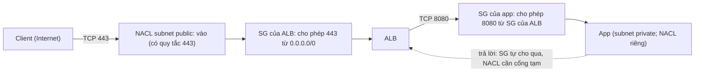

---
tags:
  - Must
  - AWS
  - SecurityGroup
  - NACL
  - Troubleshooting
---

# Security group và network ACL trên AWS hoạt động ra sao, và vì sao "đã mở cổng" vẫn không thông?

## Metadata

```yaml
Chapter: security-group-and-nacl
Phase: 06 — aws-networking
Importance: Must
Status: draft
Prerequisites:
  - Phase 05 / 03-sg-vs-nacl-concept
  - Phase 06 / 01-vpc-subnet-az
Used Later:
  - Phase 06 / 04-vpc-endpoints-gateway-interface-gwlb
  - Phase 06 / 08-elb-alb-nlb-gwlb
  - Phase 06 / 11-flow-logs-reachability-analyzer
  - Phase 06 / 12-network-iac-cloudformation
  - Phase 08 / 04-interview-aws-networking
Estimated Reading: 40 phút
Estimated Practice: 45 phút
```

## 1. Story

<!-- Mức bắt buộc (Must): Đủ -->
<!-- DRAFT: người học cần viết lại bằng lời mình -->

Đội `shopnet` có hai server ứng dụng `app-a` và `app-b`, cùng gắn một security group `sg-app`. Họ cần `app-a` gọi sang `app-b` qua cổng 8080 và nghĩ: "cùng một security group thì chắc nói chuyện được với nhau". Kết nối **treo (timeout)**. Mở rộng thêm, họ thêm một network ACL cho subnet và chỉ cho phép cổng 443 vào; sau đó nhiều dịch vụ gọi ra ngoài **bị treo dù security group đã mở hết chiều ra**.

Hai sự cố có nguyên nhân khác nhau nhưng cùng gốc: hiểu nhầm cách hai lớp lọc của AWS tính "cho phép". Security group chỉ **cho phép theo quy tắc bạn viết**, và "cùng nhóm" không tự có nghĩa là "được nói chuyện". Network ACL **không nhớ kết nối**, nên chiều trả lời phải được cho phép riêng.

## 2. Objectives

<!-- Mức bắt buộc (Must): Đủ -->
<!-- DRAFT: người học cần viết lại bằng lời mình -->

Sau chapter này bạn có thể:

- Viết quy tắc security group đúng (chiều, giao thức, cổng, nguồn/đích, tham chiếu security group).
- Giải thích security group là stateful và network ACL là stateless, và hệ quả cho chiều trả lời.
- Dự đoán gói tin bị chặn ở lớp nào khi có cả SG và NACL.
- Giải thích connection tracking (kết nối được theo dõi hay không) và hệ quả khi đổi quy tắc.
- Chẩn đoán lỗi: hai instance cùng SG không nói chuyện, NACL quên cổng tạm, health check của LB fail.

## 3. Prerequisites

<!-- Mức bắt buộc (Must): Đủ -->
<!-- DRAFT: người học cần viết lại bằng lời mình -->

> Xem lại: [sg-vs-nacl-concept](../phase-05-security/03-sg-vs-nacl-concept.md), [vpc-subnet-az](01-vpc-subnet-az.md)

Cần nhớ: stateful vs stateless, quy tắc "khớp đầu tiên" của ACL, cổng tạm (`05/01`, `05/02`, `05/03`, `04/04`); VPC và subnet (`06/01`). Chapter này không dạy lại khái niệm, chỉ nêu cách AWS hiện thực.

## 4. Why it exists

<!-- Mức bắt buộc (Must): Đủ -->
<!-- DRAFT: người học cần viết lại bằng lời mình -->

Trong VPC, mặc định không có hàng rào giữa các tài nguyên ngoài những gì bạn cấu hình. AWS cung cấp **hai lớp lọc** có mục đích khác nhau (`05/03`): **security group** gắn vào từng tài nguyên (network interface) để quyết định ai được nói chuyện với ứng dụng nào, theo cách tối thiểu và linh hoạt; **network ACL** gắn vào subnet như một lớp phụ, hữu ích để **chặn tường minh** (deny) và áp luật cho cả subnet.

Nếu hiểu sai cách AWS hiện thực: mở thừa (tiện tay mở `0.0.0.0/0`), mở thiếu (quên chiều trả lời ở NACL), tin rằng "cùng SG tự nói chuyện được", hoặc đổi quy tắc mà tưởng đã cắt hết kết nối cũ.

## 5. Mental model

<!-- Mức bắt buộc (Must): Đủ -->
<!-- DRAFT: người học cần viết lại bằng lời mình -->

Hình dung **tòa nhà văn phòng**. **Security group là bảo vệ ở cửa từng phòng**: có danh sách "những ai được vào phòng này"; ai đã được vào thì lúc ra bảo vệ nhớ mặt nên không cần kiểm tra lại (stateful). Bảo vệ **không có quyền cấm**, chỉ có danh sách cho phép. **Network ACL là cổng kiểm soát ở đầu hành lang** (cả subnet): có quy tắc đánh số, kiểm lần lượt từ nhỏ đến lớn, **không nhớ ai**; người đi vào và người đi ra đều bị kiểm riêng; có cả lệnh cấm.

**Tóm tắt một câu:** SG chỉ có "cho phép", nhớ kết nối, gắn vào tài nguyên; NACL có "cho phép/từ chối", không nhớ kết nối, gắn vào subnet; gói tin phải qua cả hai.

## 6. How it works

<!-- Mức bắt buộc (Must): Đủ -->
<!-- DRAFT: người học cần viết lại bằng lời mình -->

Các từ cần biết:

- **Security group (nhóm bảo mật — bộ quy tắc "cho phép" gắn vào network interface, có trạng thái).**
- **Network ACL (NACL — danh sách kiểm soát truy cập ở mức subnet, không trạng thái, có cả cho phép và từ chối).**
- **Connection tracking (theo dõi kết nối — SG ghi nhớ thông tin kết nối để cho phép gói trả lời).**
- **Security group referencing (tham chiếu nhóm bảo mật — dùng ID của một SG làm nguồn/đích thay vì dải IP).**
- **Managed prefix list (danh sách tiền tố quản lý — tập CIDR có tên mà nhiều quy tắc dùng chung).**

**Quy tắc cơ bản của security group (theo tài liệu AWS):**

- Chỉ có quy tắc **cho phép**, không có quy tắc từ chối.
- SG mới tạo **không có quy tắc vào** (không cho gì vào) và có một quy tắc ra cho phép mọi lưu lượng ra; nếu bỏ hết quy tắc ra thì không có gì ra được.
- Gắn nhiều SG vào một tài nguyên: các quy tắc được **gộp lại** (hợp).
- Thêm/sửa/xóa quy tắc áp dụng ngay cho mọi tài nguyên dùng SG đó (nhưng xem connection tracking bên dưới).
- Một quy tắc gồm: giao thức (6 TCP, 17 UDP, 1 ICMP...), dải cổng, và **nguồn/đích** là một địa chỉ (`/32`), một CIDR, một **prefix list**, hoặc **ID của một SG khác**.
- SG **không chặn** được lưu lượng DNS tới/từ Route 53 Resolver (địa chỉ VPC+2); muốn lọc DNS dùng Route 53 Resolver DNS Firewall.

**Tham chiếu SG: cách "đúng" để cho tầng này vào tầng kia.** Thay vì ghi dải IP của web server, ghi quy tắc "cho phép TCP 8080 từ `sg-app`". Khi đó mọi instance gắn `sg-app` được phép gọi, qua **địa chỉ private** của chúng, kể cả khi instance thêm/bớt. Tài liệu AWS nêu các điều kiện: tham chiếu trong quy tắc **vào** được nếu hai SG cùng VPC, hoặc có peering, hoặc có transit gateway giữa hai VPC; trong quy tắc **ra** được nếu cùng VPC hoặc có peering. Quy tắc của SG được tham chiếu **không** được thêm vào SG tham chiếu nó. Ví dụ ba tầng: SG của LB mở 80/443 từ Internet; SG của web chỉ cho phép từ SG của LB; SG của database chỉ cho phép từ SG của web.

**Vì sao Story 1 treo?** Một SG **mới tạo** không có quy tắc vào nào, kể cả từ chính các thành viên của nó. Hai instance cùng `sg-app` chỉ nói chuyện được nếu SG đó có quy tắc vào **tham chiếu chính SG đó** (hoặc CIDR bao gồm hai bên). Nói cách khác, "cùng nhóm" **không** là quyền; chỉ quy tắc mới là quyền. (SG mặc định của VPC có sẵn quy tắc tham chiếu chính nó, nhưng đừng dựa vào SG mặc định cho workload.)

**Connection tracking (theo dõi kết nối) và hệ quả.** Theo tài liệu AWS, SG dùng connection tracking nên **stateful**: gói trả lời của một kết nối đã được phép tự động được đi qua, bất kể quy tắc ở chiều ngược. Điểm tinh tế:

- Một luồng chỉ **không bị theo dõi** khi có quy tắc cho phép toàn bộ TCP/UDP từ/tới `0.0.0.0/0` (hoặc `::/0`) **và** quy tắc ở chiều ngược cho phép toàn bộ lưu lượng trả lời mọi cổng; khi đó gói trả lời được cho phép nhờ chính quy tắc đó. ICMP luôn được theo dõi.
- Các kết nối qua NAT gateway, NLB, interface endpoint (PrivateLink), egress-only IGW... luôn được theo dõi.
- **Đổi quy tắc không cắt ngay kết nối đang được theo dõi:** SG tiếp tục cho gói đi qua cho tới khi kết nối hết hạn idle. Muốn cắt ngay, dùng NACL (chặn bằng NACL cắt cả kết nối cũ). Với luồng **không** được theo dõi thì xóa/sửa quy tắc cắt ngay.
- Mỗi instance có giới hạn số kết nối được theo dõi; vượt quá thì gói bị bỏ (có chỉ số `conntrack_allowance_exceeded`). Có thể cấu hình **idle timeout theo dõi kết nối** ở network interface (TCP established, UDP, UDP stream); mặc định khác nhau theo thế hệ instance (Nitro v6 ngắn hơn), nên với kết nối sống lâu hãy dùng TCP keepalive ngắn hơn 5 phút. Liên hệ `04/02`.

**Network ACL (theo tài liệu AWS):** mỗi subnet **luôn** gắn một NACL (mặc định cho phép mọi lưu lượng); NACL tùy chỉnh mới tạo **chặn tất cả** cho tới khi bạn thêm quy tắc. Quy tắc có **số thứ tự**, được xét từ số nhỏ đến lớn và **dừng ở quy tắc khớp đầu tiên**; quy tắc `*` cuối cùng từ chối mọi thứ không khớp và không sửa được. **Mỗi chiều có bộ quy tắc riêng** và IPv4/IPv6 được xét riêng. Vì NACL **stateless**, với mỗi quy tắc cho phép phải có quy tắc cho phép **chiều trả lời**, gồm **cổng tạm** của bên khởi tạo kết nối.

**Chọn dải cổng tạm cho NACL (theo tài liệu AWS):** bên khởi tạo chọn cổng tạm, dải phụ thuộc hệ điều hành: nhiều nhân Linux (kể cả Amazon Linux) dùng 32768–61000; yêu cầu xuất phát từ Elastic Load Balancing dùng 1024–65535; Windows Server 2008 trở lên dùng 49152–65535; NAT gateway và Lambda dùng 1024–65535. Cách thực tế an toàn: mở 1024–65535 cho chiều trả lời, rồi thêm quy tắc **từ chối** các cổng độc hại ở số nhỏ hơn.



**Đọc sơ đồ:** gói tin đi vào đi qua **NACL của subnet** trước, rồi **SG của tài nguyên**; ở chiều ra đảo ngược. SG của app chỉ nhận từ SG của ALB, nên kẻ khác trong VPC không gọi thẳng được. Đường nét đứt: chiều trả lời, SG tự cho qua nhờ theo dõi kết nối, còn NACL (stateless) cần quy tắc cổng tạm riêng; thiếu nó là nguyên nhân Story 2.

**Hai lớp, hai nhiệm vụ.** Theo tài liệu AWS, trong hầu hết trường hợp SG đủ dùng; NACL là lớp bổ sung. Dùng NACL khi cần **từ chối tường minh** (chặn một IP/dải), cắt ngay kết nối đang theo dõi, hoặc áp luật bắt buộc cho cả subnet. Lưu ý riêng: nếu NACL của subnet backend từ chối mọi lưu lượng từ `0.0.0.0/0` hoặc từ CIDR của subnet, load balancer **không** thực hiện được health check lên instance (`06/08`).

**Hạn chế đáng nhớ.** Khi lưu lượng giữa hai instance ở hai subnet được định tuyến qua một thiết bị trung gian (middlebox), SG của mỗi bên phải tham chiếu **địa chỉ private của bên kia hoặc CIDR của subnet bên kia**; tham chiếu SG của bên kia không đủ trong trường hợp đó.

> Nguyên lý stateful/stateless, first-match, cổng tạm: `05/01`, `05/02`, `05/03`, `04/04`. Gỡ lỗi bằng Flow Logs và Reachability Analyzer: `06/11`.

<!-- verified: 2026-10-05 https://docs.aws.amazon.com/vpc/latest/userguide/security-group-rules.html -->
<!-- verified: 2026-10-05 https://docs.aws.amazon.com/AWSEC2/latest/UserGuide/security-group-connection-tracking.html -->
<!-- verified: 2026-10-05 https://docs.aws.amazon.com/vpc/latest/userguide/custom-network-acl.html -->

## 7. Key settings

<!-- Mức bắt buộc (Must): Đủ -->
<!-- DRAFT: người học cần viết lại bằng lời mình -->

| Thông số | Ý nghĩa | Nếu sai |
|---|---|---|
| Quy tắc vào của SG (cổng, nguồn) | Ai được gọi tài nguyên | `0.0.0.0/0` bừa bãi → lộ; thiếu → timeout |
| Quy tắc ra của SG | Tài nguyên được gọi đi đâu | Bỏ quy tắc ra mặc định mà quên mở đích → ra ngoài không được |
| Tham chiếu SG thay cho IP | Tầng này cho tầng kia | Dùng IP cứng → hỏng khi scale; nhầm trường hợp middlebox |
| SG tự tham chiếu | Thành viên cùng nhóm nói chuyện | Thiếu → Story 1 |
| Số SG gắn vào một tài nguyên | Gộp quy tắc | Quá nhiều → khó đọc; có giới hạn (xem trang quota) |
| NACL: số thứ tự quy tắc | Thứ tự xét | Deny đặt sau allow rộng → không bao giờ hiệu lực (`05/02`) |
| NACL: quy tắc chiều trả lời + cổng tạm | Cho gói trả lời | Thiếu → kết nối treo (Story 2) |
| NACL gắn subnet nào | Phạm vi áp dụng | Gắn nhầm → chặn cả subnet |
| Idle timeout theo dõi kết nối của ENI | Quên kết nối nhàn rỗi | Quá ngắn → ngắt kết nối sống lâu; quá dài → tốn bảng theo dõi |

Số lượng giới hạn (số quy tắc mỗi SG, số SG mỗi network interface, số quy tắc mỗi NACL): **không ghi con số trong sách**; kiểm tra trang quota hiện hành: `https://docs.aws.amazon.com/vpc/latest/userguide/amazon-vpc-limits.html`.

**Lệnh quan sát (chỉ đọc):**

```bash
aws ec2 describe-security-groups --group-ids <sg-id> \
  --query "SecurityGroups[].{ingress:IpPermissions,egress:IpPermissionsEgress}"
aws ec2 describe-network-acls --filters Name=association.subnet-id,Values=<subnet-id> \
  --query "NetworkAcls[].Entries[].[RuleNumber,Egress,Protocol,RuleAction,CidrBlock,PortRange]" --output table
```

## 8. AWS mapping

<!-- Mức bắt buộc (Must): Đủ -->
<!-- DRAFT: người học cần viết lại bằng lời mình -->

| Khái niệm | AWS | CloudFormation |
|---|---|---|
| Security group | Security group | `AWS::EC2::SecurityGroup` |
| Quy tắc vào (resource riêng) | Ingress rule | `AWS::EC2::SecurityGroupIngress` |
| Quy tắc ra (resource riêng) | Egress rule | `AWS::EC2::SecurityGroupEgress` |
| Network ACL | Network ACL | `AWS::EC2::NetworkAcl` |
| Quy tắc NACL | NACL entry | `AWS::EC2::NetworkAclEntry` |
| Gắn NACL vào subnet | Association | `AWS::EC2::SubnetNetworkAclAssociation` |
| Danh sách CIDR dùng chung | Managed prefix list | `AWS::EC2::PrefixList` |

Việc tách quy tắc thành resource `SecurityGroupIngress`/`Egress` riêng là cách tránh **phụ thuộc vòng** khi hai SG tham chiếu lẫn nhau, và là một ý của `06/12`.

**IAM tối thiểu cho lab:** `ec2:CreateSecurityGroup`, `ec2:AuthorizeSecurityGroupIngress/Egress`, `ec2:RevokeSecurityGroup*`, `ec2:CreateNetworkAcl`, `ec2:CreateNetworkAclEntry`, `ec2:ReplaceNetworkAclAssociation`, `ec2:Describe*` và quyền xóa tương ứng. Lưu ý (theo tài liệu AWS): quyền IAM của các hành động Authorize/Revoke **không kiểm tra** SG được tham chiếu, chỉ kiểm tra nó tồn tại, nên không dùng IAM để giới hạn SG nào được tham chiếu.

**Chi phí:** SG và NACL **không tính phí thêm**; chi phí nằm ở tài nguyên chúng bảo vệ. Kiểm tra bảng giá hiện hành.

## 9. Hands-on lab

<!-- Mức bắt buộc (Must): Đủ -->
<!-- DRAFT: người học cần viết lại bằng lời mình -->

Chi tiết ở `labs/phase-06-aws-networking/chapter-03-security-group-and-nacl/README.md`.

- **Phần A (local):** mô phỏng đánh giá gói tin qua NACL (khớp đầu tiên, stateless) và SG (allow-only, theo dõi kết nối) bằng Python để thấy kết quả chiều đi/chiều về.
- **Phần B (AWS sandbox, không phí):** tạo VPC tối giản, hai SG; chứng minh "cùng SG không tự nói chuyện" bằng đọc quy tắc và Reachability Analyzer chỉ khi bạn chấp nhận (có thể tính phí theo lần phân tích, kiểm tra giá); rồi teardown. Không tạo instance trong lab này.

**1. Predict:** gói `tcp 8080` từ `app-a` tới `app-b` (cùng `sg-app` không có quy tắc tự tham chiếu) được hay bị chặn? Thêm quy tắc tự tham chiếu thì sao? Với NACL chỉ cho phép vào 443, chiều trả lời cổng tạm của một kết nối ra ngoài có qua được không?

**2. Run / 3. Verify:** xem README lab; output thật `[CHƯA CHẠY]`.

## 10. Break it

<!-- Mức bắt buộc (Must): Đủ -->
<!-- DRAFT: người học cần viết lại bằng lời mình -->

**Lỗi 1 — cùng SG không nói chuyện (Story 1).**
Dự đoán: SG mới không có quy tắc vào; hai instance cùng SG gọi nhau bị timeout. Khôi phục: thêm quy tắc vào cho phép TCP 8080 với nguồn là chính SG đó.

**Lỗi 2 — NACL quên cổng tạm (Story 2).**
Dự đoán: NACL cho phép gói đi tới cổng 443 nhưng không cho phép chiều trả lời tới cổng tạm → kết nối treo dù SG đúng. Phát hiện bằng Flow Logs: chiều vào `ACCEPT`, chiều ra `REJECT` (`06/11`). Khôi phục: thêm quy tắc chiều trả lời cho dải cổng tạm.

**Lỗi 3 — đổi SG không cắt kết nối cũ.**
Dự đoán: xóa quy tắc cho phép SSH hẹp từ một IP không làm đứt ngay phiên SSH đang mở (kết nối được theo dõi). Thêm NACL chặn thì cắt ngay.

**Lỗi 4 — deny đặt sau allow rộng (NACL).**
Dự đoán: allow `0.0.0.0/0` ở số 100 và deny một IP ở số 110 → deny không bao giờ hiệu lực (`05/02`).

Kết quả thật: `[CHƯA CHẠY]`.

## 11. Troubleshooting

<!-- Mức bắt buộc (Must): Đủ -->
<!-- DRAFT: người học cần viết lại bằng lời mình -->

Chuỗi kiểm tra khi "A gọi B qua TCP/PORT bị treo":

| # | Kiểm tra | Cách xem |
|---|---|---|
| 1 | B có thật sự nghe ở đúng địa chỉ/cổng (không chỉ loopback)? (`04/04`) | `ss -tlnp` trên B |
| 2 | SG của B có quy tắc **vào** cho nguồn A (IP/CIDR/SG)? | `describe-security-groups` |
| 3 | SG của A có quy tắc **ra** tới B? (nếu đã sửa quy tắc ra mặc định) | như trên |
| 4 | NACL subnet B cho **vào** TCP/PORT từ A; NACL subnet A cho **ra** tới B | `describe-network-acls` |
| 5 | NACL cho **chiều trả lời** (cổng tạm 1024–65535 hoặc dải phù hợp OS) ở cả hai subnet | như trên |
| 6 | Route giữa hai subnet có (cùng VPC: có `local`; khác VPC: peering/TGW + route) | `06/02`, `06/09` |
| 7 | Đã bị middlebox/firewall khác? SG tham chiếu có sai trường hợp middlebox? | Sơ đồ mạng |
| 8 | Kết nối cũ đang theo dõi giữ trạng thái khiến thay đổi chưa có hiệu lực? | Mở kết nối mới; Flow Logs |

| Triệu chứng | Giả thuyết đầu tiên | Công cụ |
|---|---|---|
| Hai instance cùng SG không gọi nhau | Thiếu quy tắc tự tham chiếu | `describe-security-groups` |
| Kết nối ra ngoài treo sau khi thêm NACL | Thiếu chiều trả lời/cổng tạm ở NACL | Flow Logs (`ACCEPT` vào, `REJECT` ra), `06/11` |
| Health check của LB fail sau khi sửa NACL | NACL deny `0.0.0.0/0` hoặc CIDR subnet | `describe-network-acls` |
| Đổi quy tắc SG nhưng kết nối cũ vẫn sống | Kết nối đang được theo dõi | Mở kết nối mới; dùng NACL nếu cần cắt ngay |
| Mất gói ngẫu nhiên khi tải cao | Vượt giới hạn kết nối theo dõi của instance | Chỉ số `conntrack_allowance_exceeded` |
| Không lọc được DNS bằng SG/NACL | DNS tới Route 53 Resolver không bị SG/NACL lọc | Route 53 Resolver DNS Firewall (`06/06`) |

Ghi kết quả thật của mục 10: `[CHƯA CHẠY]`.

## 12. Security & cost

<!-- Mức bắt buộc (Must): Đủ -->
<!-- DRAFT: người học cần viết lại bằng lời mình -->

- **Nguyên tắc tối thiểu:** mở đúng cổng, đúng nguồn; ưu tiên **tham chiếu SG** thay vì `0.0.0.0/0` cho lưu lượng nội bộ.
- **Không mở quản trị (SSH/RDP/DB) cho `0.0.0.0/0`**; dùng Session Manager hoặc bastion (`05/05`).
- **Đặt tên và mô tả quy tắc** (có trường description) để rà soát sau này.
- **Đừng dựa vào SG mặc định** của VPC cho workload; tạo SG theo vai trò.
- **NACL làm lớp bổ sung có kiểm soát**: ghi rõ số thứ tự, chừa khoảng trống giữa các số để chèn sau; tránh ghi đè thành "deny all" khi chưa hiểu hệ quả (health check, cổng tạm, `06/08`).
- Đổi quy tắc SG không cắt kết nối đang theo dõi: khi xử lý sự cố bảo mật, đừng giả định kết nối cũ đã bị cắt.
- Không dán ID SG/NACL/account/IP thật vào tài liệu công khai.
- **Chi phí:** SG/NACL không tính phí thêm; Reachability Analyzer và Flow Logs có thể phát sinh phí; kiểm tra giá hiện hành.

## 13. Misconceptions

<!-- Mức bắt buộc (Must): Đủ -->
<!-- DRAFT: người học cần viết lại bằng lời mình -->

| Hiểu nhầm | Sự thật |
|---|---|
| "Cùng security group thì nói chuyện được" | Cần quy tắc vào tham chiếu chính SG đó (hoặc CIDR bao gồm) |
| "Security group có thể deny" | Chỉ có allow; muốn deny dùng NACL |
| "NACL nhớ kết nối như SG" | Stateless: phải cho chiều trả lời, gồm cổng tạm |
| "Sửa SG là cắt ngay mọi kết nối" | Kết nối đã theo dõi vẫn sống tới khi hết hạn; NACL mới cắt ngay |
| "SG lọc được cả DNS của VPC" | SG/NACL không lọc DNS tới Route 53 Resolver (VPC+2) |
| "NACL tùy chỉnh mới tạo cho phép mặc định" | NACL mới chặn tất cả; NACL mặc định mới cho phép tất cả |
| "Chỉ cần một lớp là đủ nên bỏ NACL" | Thường SG đủ, nhưng NACL cần cho deny tường minh và cắt ngay |
| "Tham chiếu SG luôn dùng được" | Điều kiện: cùng VPC, hoặc peering/TGW; và middlebox cần tham chiếu IP/CIDR |

## 14. Interview questions

<!-- Mức bắt buộc (Must): Đủ -->
<!-- DRAFT: người học cần viết lại bằng lời mình -->

### Q1 (Junior) — Security group và network ACL khác nhau thế nào trên AWS?

**Gợi ý ý chính:**
- Gắn vào đâu?
- Stateful?
- Allow/deny?

??? success "Đáp án mẫu (tự trả lời trước khi mở)"
    SG gắn vào network interface/tài nguyên, stateful (nhớ kết nối nên tự cho chiều trả lời), chỉ có quy tắc allow. NACL gắn vào subnet, stateless (phải cho chiều trả lời, gồm cổng tạm), có cả allow và deny, quy tắc đánh số và khớp đầu tiên thắng.

### Q2 (Middle) — Hai instance cùng security group nhưng gọi nhau bị timeout. Vì sao?

**Gợi ý ý chính:**
- SG mới có quy tắc vào nào?

??? success "Đáp án mẫu (tự trả lời trước khi mở)"
    SG mới tạo không có quy tắc vào, và "cùng nhóm" không tự là quyền. Cần quy tắc vào cho cổng/giao thức đó với nguồn là chính SG (tham chiếu SG) hoặc CIDR bao gồm hai bên.

### Q3 (Middle) — Vì sao sau khi thêm NACL, kết nối ra ngoài bị treo dù SG cho phép?

**Gợi ý ý chính:**
- Stateless và chiều trả lời
- Cổng tạm

??? success "Đáp án mẫu (tự trả lời trước khi mở)"
    NACL không theo dõi kết nối: gói trả lời cần quy tắc cho phép riêng, tới cổng tạm của bên khởi tạo (Linux thường 32768–61000, Windows mới 49152–65535, NAT gateway/ELB/Lambda 1024–65535). Thiếu quy tắc này, gói trả lời bị chặn nên kết nối treo. Flow Logs sẽ cho thấy chiều vào ACCEPT, chiều ra REJECT.

### Q4 (Middle) — Bạn xóa quy tắc SSH khỏi security group nhưng phiên SSH đang mở vẫn sống. Giải thích và cách cắt ngay?

**Gợi ý ý chính:**
- Connection tracking
- NACL

??? success "Đáp án mẫu (tự trả lời trước khi mở)"
    Kết nối đã được SG theo dõi (tracked) tiếp tục được cho qua tới khi hết thời hạn nhàn rỗi, bất kể quy tắc mới. Chỉ luồng không được theo dõi (quy tắc mở toàn bộ cả hai chiều) mới bị cắt ngay. Muốn cắt ngay phải dùng NACL chặn (stateless, tác động cả kết nối cũ).

### Q5 (Middle) — Thiết kế security group cho kiến trúc ALB → web → database.

**Gợi ý ý chính:**
- Tham chiếu SG

??? success "Đáp án mẫu (tự trả lời trước khi mở)"
    SG của ALB cho phép 80/443 từ Internet; SG của web chỉ cho phép cổng ứng dụng từ SG của ALB; SG của database chỉ cho phép cổng database từ SG của web. Không mở database cho Internet; dùng tham chiếu SG để không phụ thuộc IP khi scale.

## 15. Exercises

<!-- Mức bắt buộc (Must): Đủ -->
<!-- DRAFT: người học cần viết lại bằng lời mình -->

1. **Viết bộ SG ba tầng.** *Deliverable:* bảng quy tắc vào/ra cho SG của ALB, web, database của `shopnet-prd` (giao thức, cổng, nguồn/đích) và giải thích vì sao không dùng IP cứng.
2. **Thiết kế NACL.** Subnet public cho phép HTTPS từ Internet và SSH từ `192.0.2.0/24`. *Deliverable:* bảng quy tắc NACL vào + ra (có số thứ tự, chiều trả lời và cổng tạm) và chỉ rõ quy tắc nào dễ bị quên.
3. **Phân tích Story.** *Deliverable:* kế hoạch 6 bước (lệnh/công cụ mỗi bước) chứng minh nguyên nhân của hai sự cố và cách sửa.
4. **Sơ đồ quyết định.** *Deliverable:* sơ đồ cho "A gọi B bị treo" dùng 8 bước ở mục 11, thêm kết quả mong đợi mỗi bước.

## 16. Cheat sheet

<!-- Mức bắt buộc (Must): Đủ -->
<!-- DRAFT: người học cần viết lại bằng lời mình -->

| Mục | Security group | Network ACL |
|---|---|---|
| Gắn vào | Network interface | Subnet |
| Trạng thái | Stateful (theo dõi kết nối) | Stateless |
| Quy tắc | Chỉ allow; hợp các SG gắn | Allow và deny; số nhỏ xét trước; khớp đầu tiên |
| Mặc định mới | Không vào, cho ra tất cả | NACL mặc định cho tất cả; NACL tùy chỉnh chặn tất cả |
| Chiều trả lời | Tự cho | Phải có quy tắc + cổng tạm |
| Đổi quy tắc | Không cắt kết nối đang theo dõi | Cắt cả kết nối cũ |
| Không lọc | DNS tới VPC+2 | DNS tới VPC+2 |

**Debug:** B nghe đúng chưa → SG vào B → SG ra A → NACL hai chiều + cổng tạm → route → middlebox → kết nối cũ.

## 17. Glossary terms

<!-- Mức bắt buộc (Must): Đủ -->
<!-- DRAFT: người học cần viết lại bằng lời mình -->

- Security group / nhóm bảo mật / セキュリティグループ
- Network ACL / danh sách kiểm soát truy cập mạng / ネットワークACL
- Connection tracking / theo dõi kết nối / コネクショントラッキング
- Security group referencing / tham chiếu nhóm bảo mật / セキュリティグループの参照
- Managed prefix list / danh sách tiền tố quản lý / マネージドプレフィックスリスト

## 18. Further reading

<!-- Mức bắt buộc (Must): Đủ -->
<!-- DRAFT: người học cần viết lại bằng lời mình -->

Kiểm tra ngày 2026-10-05:

- Security group rules: https://docs.aws.amazon.com/vpc/latest/userguide/security-group-rules.html
- Security group connection tracking: https://docs.aws.amazon.com/AWSEC2/latest/UserGuide/security-group-connection-tracking.html
- Custom network ACLs: https://docs.aws.amazon.com/vpc/latest/userguide/custom-network-acl.html
- Amazon VPC quotas: https://docs.aws.amazon.com/vpc/latest/userguide/amazon-vpc-limits.html
