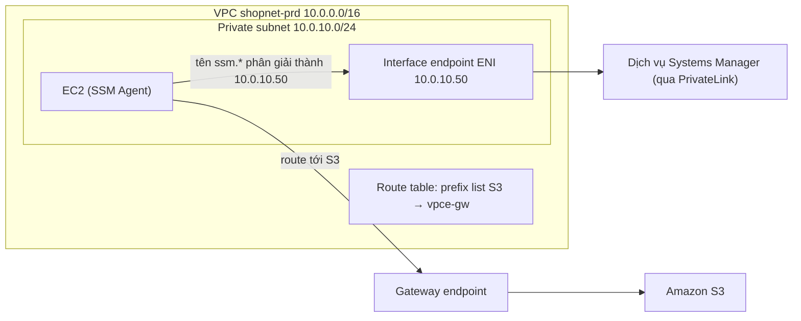

---
tags:
  - Must
  - AWS
  - VPCEndpoint
  - PrivateLink
  - Troubleshooting
---

# VPC endpoint (Gateway, Interface, GWLB) khác nhau thế nào, và khi nào thay được NAT gateway?

## Metadata

```yaml
Chapter: vpc-endpoints-gateway-interface-gwlb
Phase: 06 — aws-networking
Importance: Must
Status: draft
Prerequisites:
  - Phase 03 / 02-dns-resolution
  - Phase 06 / 02-route-table-igw-nat-gateway
  - Phase 06 / 03-security-group-and-nacl
Used Later:
  - Phase 08 / 02-case-studies
  - Phase 08 / 04-interview-aws-networking
Estimated Reading: 45 phút
Estimated Practice: 50 phút
```

## 1. Story

<!-- Mức bắt buộc (Must): Đủ -->
<!-- DRAFT: người học cần viết lại bằng lời mình -->

Đội `shopnet` có một EC2 trong **private subnet không có NAT gateway** (để tiết kiệm và giảm bề mặt tấn công). Họ muốn quản trị máy qua Session Manager / Fleet Manager, nhưng máy **không xuất hiện** trong danh sách quản lý. Agent trên máy cần gọi tới các dịch vụ Systems Manager, mà các dịch vụ đó có địa chỉ công khai; không có đường ra Internet thì gọi không được. Họ tạo một interface endpoint `ssm`, nhưng máy vẫn không lên: **thiếu hai endpoint còn lại**, và security group của endpoint **chưa cho phép HTTPS từ subnet của máy**.

Một sự cố khác: sau khi tạo endpoint, ứng dụng bỗng báo "địa chỉ đã bị chiếm" vì ENI của endpoint tự lấy đúng IP mà đội định gán cho một server khác. Cả hai đều xoay quanh một khái niệm: VPC endpoint là cách đi tới dịch vụ **bằng đường riêng trong VPC**, thay vì ra Internet.

## 2. Objectives

<!-- Mức bắt buộc (Must): Đủ -->
<!-- DRAFT: người học cần viết lại bằng lời mình -->

Sau chapter này bạn có thể:

- Phân biệt ba nhóm endpoint: Gateway (S3/DynamoDB), Interface (PrivateLink) và Gateway Load Balancer endpoint.
- Giải thích endpoint hoạt động thế nào ở mức mạng (route table so với ENI + DNS).
- Chọn Gateway hay Interface endpoint cho một nhu cầu, kèm lý do chi phí và giới hạn.
- Cấu hình đủ để một instance ở private subnet không NAT dùng Session Manager (đủ endpoint, SG, DNS).
- Chẩn đoán lỗi: endpoint đã tạo mà vẫn không thông (SG, DNS, route, policy).

## 3. Prerequisites

<!-- Mức bắt buộc (Must): Đủ -->
<!-- DRAFT: người học cần viết lại bằng lời mình -->

> Xem lại: [dns-resolution](../phase-03-core-services/02-dns-resolution.md), [route-table-igw-nat-gateway](02-route-table-igw-nat-gateway.md), [security-group-and-nacl](03-security-group-and-nacl.md)

Cần nhớ: cách tên được phân giải thành IP và cách tên công khai/riêng khác nhau (`03/02`, `03/03`); route table và NAT (`06/02`); SG và NACL (`06/03`).

## 4. Why it exists

<!-- Mức bắt buộc (Must): Đủ -->
<!-- DRAFT: người học cần viết lại bằng lời mình -->

Nhiều dịch vụ AWS (S3, DynamoDB, Systems Manager, ECR, CloudWatch...) có địa chỉ **công khai**. Một instance ở private subnet muốn gọi chúng phải đi qua NAT gateway ra Internet công cộng, tốn tiền, mở đường ra ngoài và phụ thuộc NAT. **VPC endpoint (điểm cuối VPC — đường riêng từ VPC tới một dịch vụ, không qua Internet gateway hay NAT)** cho phép gọi dịch vụ đó bằng địa chỉ **riêng**, trong mạng AWS, và có thể gắn **chính sách (endpoint policy)** để giới hạn ai làm gì.

Nếu hiểu sai: dùng NAT cho lưu lượng khổng lồ tới S3 (tốn tiền không cần thiết), chọn sai loại endpoint (S3 gateway không dùng được từ on-premise), thiếu endpoint cần thiết (Story), quên SG/DNS của endpoint, hoặc tạo Interface endpoint ở mọi AZ mà không tính chi phí theo giờ.

## 5. Mental model

<!-- Mức bắt buộc (Must): Đủ -->
<!-- DRAFT: người học cần viết lại bằng lời mình -->

Hình dung khu nhà xưởng của `06/01` và `06/02`. Để gửi hàng tới kho S3 bên ngoài, trước đây xưởng đi ra cổng lớn qua bưu cục NAT. **Gateway endpoint** giống **một lối đi riêng có biển chỉ đường** gắn vào bảng chỉ đường của xưởng: "hàng gửi tới S3 thì đi lối này" (ghi trong route table), không tốn phí. **Interface endpoint** giống **một quầy tiếp nhận riêng đặt ngay trong xưởng** (một network interface có địa chỉ riêng): bạn gọi tên dịch vụ, tên đó được dẫn về quầy này (nhờ DNS), quầy chuyển hàng tới dịch vụ; quầy tính phí theo giờ. **Gateway Load Balancer endpoint** giống **trạm kiểm tra bắt buộc**: route đưa hàng qua một đội thiết bị (firewall) trước khi đi tiếp.

**Tóm tắt một câu:** Gateway endpoint điều hướng bằng route (chỉ S3/DynamoDB, miễn phí); Interface endpoint là ENI + DNS riêng (nhiều dịch vụ, tính phí, dùng được từ on-premise); GWLB endpoint điều hướng lưu lượng qua thiết bị kiểm tra.

## 6. How it works

<!-- Mức bắt buộc (Must): Đủ -->
<!-- DRAFT: người học cần viết lại bằng lời mình -->

Các từ cần biết:

- **VPC endpoint (điểm cuối VPC — đường riêng từ VPC tới một dịch vụ).**
- **Gateway endpoint (endpoint cổng — dùng route table để tới S3 hoặc DynamoDB, không dùng PrivateLink, không phí).**
- **Interface endpoint (endpoint giao diện — một hoặc nhiều ENI trong subnet của bạn làm điểm vào tới một dịch vụ qua PrivateLink).**
- **AWS PrivateLink (công nghệ cho phép truy cập dịch vụ ở VPC khác bằng địa chỉ riêng, như thể dịch vụ nằm trong VPC của bạn).**
- **Gateway Load Balancer endpoint (endpoint cho GWLB — gửi lưu lượng tới đội thiết bị ảo bằng IP riêng, định tuyến bằng route table).**
- **Endpoint policy (chính sách endpoint — chính sách IAM gắn vào endpoint, giới hạn ai dùng endpoint để làm gì).**
- **Private DNS (DNS riêng cho endpoint — tên công khai của dịch vụ được phân giải thành địa chỉ riêng của endpoint trong VPC).**
- **ENI (network interface — card mạng ảo có IP riêng, xem `06/05`).**

**So sánh (theo tài liệu AWS):**

| Tiêu chí | Gateway endpoint | Interface endpoint | GWLB endpoint |
|---|---|---|---|
| Dịch vụ | Chỉ **S3** và **DynamoDB** | Nhiều dịch vụ AWS, dịch vụ của đối tác/tài khoản khác (PrivateLink) | Đội thiết bị ảo sau Gateway Load Balancer |
| Cơ chế | **Route** trong route table (đích là prefix list của dịch vụ) | **ENI** trong subnet (mỗi subnet một ENI, IP riêng) + DNS | **Route** tới endpoint, GWLB phân phối cho thiết bị |
| Chi phí | Không phí thêm | Tính phí theo giờ và theo dữ liệu xử lý | Có phí (xem bảng giá) |
| Từ on-premise / peering khác Region / TGW | **Không** dùng được | Dùng được (qua VPN/DX, peering, TGW) | Theo thiết kế |
| Giữ lưu lượng trong mạng AWS | Có | Có | Có |
| Điều khiển truy cập | Endpoint policy; bucket policy; SG/NACL của nguồn | Endpoint policy; **SG của endpoint** | SG/route; chính sách thiết bị |



**Đọc sơ đồ:** với **Interface endpoint**, thứ làm thay đổi đường đi là **DNS**: khi bật Private DNS, tên công khai của dịch vụ (ví dụ `ssm.<region>.amazonaws.com`) được phân giải thành **IP riêng của ENI endpoint** trong subnet của bạn; gói tin tới ENI đó và đi tiếp tới dịch vụ qua PrivateLink. Với **Gateway endpoint**, thứ làm thay đổi đường đi là **route table**: một route trỏ đích (prefix list của S3) về endpoint. Hai cơ chế khác nhau nên cách gỡ lỗi khác nhau: gateway thì xem route; interface thì xem DNS và SG.

**Interface endpoint chi tiết (theo tài liệu AWS):**

- Với mỗi **subnet** bạn chọn, AWS tạo **một ENI** trong subnet và gán **một IP riêng lấy từ dải của subnet**; mỗi AZ chỉ chọn được **một** subnet. Bạn có thể chỉ định IP (không dùng được 4 địa chỉ đầu và địa chỉ cuối đã bị giữ).
- ENI này là **requester-managed** (do dịch vụ quản lý): bạn xem được nhưng không sửa được.
- Phải tạo **security group cho ENI endpoint** cho phép lưu lượng từ tài nguyên trong VPC tới nó (ví dụ cho phép HTTPS vào để SDK/CLI gọi được); mặc định endpoint dùng SG mặc định của VPC.
- **Private DNS** cần bật **DNS hostnames và DNS resolution** của VPC; AWS khuyến nghị giữ mặc định để các yêu cầu dùng tên công khai (ví dụ qua SDK) phân giải vào endpoint.
- Endpoint **không trả lời ping**; dùng `nc` hoặc `nmap` để thử cổng.
- Endpoint policy mặc định cho phép mọi hành động của mọi principal qua endpoint (đừng để mặc định cho dữ liệu nhạy cảm).
- **Tính phí theo giờ và xử lý dữ liệu**, và vì **mỗi AZ một ENI** nên chi phí nhân theo số AZ (`story-seeds` #13).

**Gateway endpoint cho S3 (theo tài liệu AWS):**

- Chỉ hoạt động trong **Region** nơi tạo; tạo cùng Region với bucket.
- Không có phí thêm; **không** dùng được từ mạng on-premise, từ VPC được peering khác Region, hoặc qua transit gateway; các trường hợp đó dùng interface endpoint.
- Thêm route vào các route table bạn chọn (đích là prefix list của S3); SG/NACL phải cho phép lưu lượng tới S3 (SG có thể tham chiếu prefix list; **NACL không tham chiếu được prefix list**, cần lấy dải IP từ prefix list).
- Tạo hoặc sửa endpoint **làm đổi route và cắt các kết nối TCP đang mở** tới S3; địa chỉ nguồn S3 thấy chuyển từ IP công khai sang IP riêng. Đừng làm khi có tác vụ quan trọng đang chạy.
- Có thể dùng cả **gateway lẫn interface endpoint cho S3** và cấu hình **private DNS chỉ cho inbound Resolver endpoint**: lưu lượng từ on-premise đi qua interface endpoint, lưu lượng từ VPC dùng gateway (miễn phí). Nếu bật private DNS thông thường cho interface endpoint của S3 thì **cả lưu lượng trong VPC cũng đi qua interface endpoint và bị tính phí**.
- Không dùng điều kiện `aws:SourceIp` trong policy cho yêu cầu qua endpoint; dùng `aws:VpcSourceIp` hoặc `aws:SourceVpce`/`aws:SourceVpc`.

**Gateway Load Balancer endpoint:** dùng khi cần đưa lưu lượng qua thiết bị kiểm tra (firewall ảo, IDS) một cách trong suốt: route tới GWLB endpoint, GWLB chia cho đội thiết bị, rồi trả lại. Chapter này chỉ giới thiệu khái niệm; chi tiết ở `06/08`.

**Session Manager / Fleet Manager ở private subnet không NAT (theo tài liệu Systems Manager).** SSM Agent tự khởi tạo mọi kết nối ra dịch vụ (nên không cần mở cổng **vào** instance). Với VPC endpoint, cần tạo interface endpoint cho **`ssm`**, **`ec2messages`** và **`ssmmessages`** (cần cho Run Command và Session Manager); thêm tùy chọn `ec2` (VSS snapshot), `s3` (cập nhật agent, tải/ghi tệp), `kms`, `logs` nếu dùng. **Security group của endpoint phải cho phép cổng 443 vào từ subnet của instance** (nếu không, instance không kết nối được). Instance cũng cần **instance profile** có quyền Systems Manager. Nếu dùng DNS tự quản, thêm conditional forwarder cho `amazonaws.com` tới DNS của VPC. Thiếu một trong ba endpoint cốt lõi, SG sai, hoặc DNS riêng tắt, máy sẽ không xuất hiện trong Fleet Manager (Story).

**Chọn loại nào.** S3/DynamoDB từ trong VPC → ưu tiên **Gateway** (miễn phí); cần truy cập từ on-premise/peering Region khác/TGW, hoặc dịch vụ khác → **Interface**; cần kiểm tra lưu lượng → **GWLB endpoint**. Interface endpoint dùng chung cho nhiều subnet/AZ cần tính chi phí theo AZ.

> DNS của VPC (DNS support/hostnames): `06/06`; Route 53 private hosted zone: `06/07`; ENI và giữ chỗ IP: `06/05`.

<!-- verified: 2026-10-05 https://docs.aws.amazon.com/vpc/latest/privatelink/concepts.html -->
<!-- verified: 2026-10-05 https://docs.aws.amazon.com/vpc/latest/privatelink/vpc-endpoints-s3.html -->
<!-- verified: 2026-10-05 https://docs.aws.amazon.com/vpc/latest/privatelink/create-interface-endpoint.html -->
<!-- verified: 2026-10-05 https://docs.aws.amazon.com/systems-manager/latest/userguide/setup-create-vpc.html -->

## 7. Key settings

<!-- Mức bắt buộc (Must): Đủ -->
<!-- DRAFT: người học cần viết lại bằng lời mình -->

| Thông số | Ý nghĩa | Nếu sai |
|---|---|---|
| Loại endpoint | Gateway/Interface/GWLB | Chọn sai → không dùng được từ on-premise, hoặc tốn phí |
| Route tables gắn với Gateway endpoint | Subnet nào dùng endpoint | Quên gắn → lưu lượng S3 vẫn ra NAT/Internet |
| Subnet cho Interface endpoint (mỗi AZ một) | Điểm vào ở mỗi AZ | Thiếu AZ → client ở AZ đó đi chéo AZ hoặc lỗi |
| SG của endpoint (443 vào từ nguồn) | Ai gọi được endpoint | Sai → timeout dù endpoint `available` |
| Private DNS (cần DNS support + hostnames) | Tên công khai → IP riêng | Tắt → client gọi IP công khai, hỏng khi không có NAT |
| Endpoint policy | Ai dùng endpoint để làm gì | Mặc định mở hết; quá chặt → dịch vụ khác cần S3 bị chặn |
| IP của ENI endpoint (tự cấp hay chỉ định) | Địa chỉ riêng của endpoint | Tự cấp có thể trùng IP đã định gán cho server khác (Story) |
| Private DNS cho S3 interface endpoint | Hướng lưu lượng VPC | Bật thường → VPC cũng trả phí interface |

**Lệnh quan sát (chỉ đọc):**

```bash
aws ec2 describe-vpc-endpoints --filters Name=vpc-id,Values=<vpc-id> \
  --query "VpcEndpoints[].{id:VpcEndpointId,type:VpcEndpointType,service:ServiceName,state:State,privDns:PrivateDnsEnabled}" --output table
aws ec2 describe-network-interfaces --filters Name=requester-managed,Values=true \
  --query "NetworkInterfaces[].{id:NetworkInterfaceId,subnet:SubnetId,ip:PrivateIpAddress,desc:Description}" --output table
```

Từ instance (ví dụ trong WSL/Linux):

```bash
dig +short ssm.ap-northeast-1.amazonaws.com        # bật Private DNS → trả IP riêng của ENI endpoint
nc -zv ssm.ap-northeast-1.amazonaws.com 443         # Interface endpoint không trả lời ping, dùng nc
```

## 8. AWS mapping

<!-- Mức bắt buộc (Must): Đủ -->
<!-- DRAFT: người học cần viết lại bằng lời mình -->

| Khái niệm | AWS | CloudFormation |
|---|---|---|
| VPC endpoint (cả ba loại) | VPC endpoint | `AWS::EC2::VPCEndpoint` (`VpcEndpointType: Gateway \| Interface \| GatewayLoadBalancer`) |
| Dịch vụ endpoint của bạn (PrivateLink) | Endpoint service | `AWS::EC2::VPCEndpointService` |
| ENI giữ chỗ IP trước | Network interface | `AWS::EC2::NetworkInterface` (xem `06/05`) |
| SG của endpoint | Security group | `AWS::EC2::SecurityGroup` (`06/03`) |

**IAM tối thiểu cho lab:** `ec2:CreateVpcEndpoint`, `ec2:ModifyVpcEndpoint`, `ec2:DescribeVpcEndpoints`, `ec2:DeleteVpcEndpoints`, cùng quyền SG/route tương ứng. Interface endpoint cho Systems Manager còn cần quyền ở instance profile (managed policy dành cho SSM); cấu hình đó nằm ngoài phạm vi lab này.

**Chi phí (cảnh báo trước khi chạy):** **Gateway endpoint không tính phí thêm. Interface endpoint tính phí theo giờ (mỗi endpoint, mỗi AZ) và theo GB xử lý**; GWLB endpoint cũng tính phí. Ba endpoint cho Session Manager nhân với số AZ tạo ra chi phí cố định hằng giờ đáng kể so với một NAT gateway tùy lưu lượng; **kiểm tra bảng giá hiện hành** (trang PrivateLink pricing), không dựa vào trí nhớ.

## 9. Hands-on lab

<!-- Mức bắt buộc (Must): Đủ -->
<!-- DRAFT: người học cần viết lại bằng lời mình -->

Chi tiết ở `labs/phase-06-aws-networking/chapter-04-vpc-endpoints-gateway-interface-gwlb/README.md`.

- **Phần A (local):** lập kế hoạch IP cho ENI endpoint và kiểm tra va chạm với IP định gán trước (Python).
- **Phần B (AWS sandbox, không phí):** tạo Gateway endpoint cho S3, đọc route được thêm vào route table, teardown.
- **Phần C (TÍNH PHÍ, tùy chọn):** Interface endpoint cho một dịch vụ, chỉ đọc hướng dẫn và chạy khi đã kiểm tra giá; teardown ngay.

**1. Predict:** sau khi tạo Gateway endpoint S3 và gắn route table, bảng đó có thêm route nào (đích, target)? Một Interface endpoint ở subnet `10.0.10.0/24` nhận IP nào nếu bạn không chỉ định?

**2. Run / 3. Verify:** xem README lab; output thật `[CHƯA CHẠY]`.

## 10. Break it

<!-- Mức bắt buộc (Must): Đủ -->
<!-- DRAFT: người học cần viết lại bằng lời mình -->

**Lỗi 1 — endpoint chưa gắn route table (gateway).**
Dự đoán: tạo Gateway endpoint nhưng không chọn route table thì route không xuất hiện, lưu lượng S3 vẫn đi đường cũ. Khôi phục: gắn route table qua `modify-vpc-endpoint --add-route-table-ids`.

**Lỗi 2 — SG của endpoint không cho 443 (interface).**
Dự đoán: DNS phân giải đúng IP riêng nhưng `nc -zv <tên> 443` timeout vì SG của endpoint không có quy tắc vào 443 từ nguồn. Khôi phục: thêm quy tắc vào.

**Lỗi 3 — thiếu endpoint thứ ba (Session Manager).**
Dự đoán: chỉ có `ssm` mà thiếu `ssmmessages`/`ec2messages` thì máy không lên Fleet Manager. Phát hiện bằng đối chiếu danh sách endpoint cần thiết.

**Lỗi 4 — va chạm IP (Story).**
Dự đoán: ENI endpoint tự cấp IP đầu tiên còn trống trong subnet; nếu bạn dự định gán IP đó cho một server tạo sau, server sẽ không dùng được. Khôi phục: giữ chỗ IP bằng ENI trước (`06/05`) hoặc chỉ định IP cho endpoint.

**Lỗi 5 (khái niệm) — hai interface endpoint cùng dịch vụ cùng bật Private DNS.** Giả thuyết trong `spec/story-seeds.md`: hai endpoint cùng dịch vụ trong cùng VPC không thể cùng bật Private DNS (vì cả hai cùng muốn chiếm tên công khai). `[CHƯA KIỂM CHỨNG]`: cần xác minh bằng lab (cần Interface endpoint, tính phí) trước khi dựa vào.

Kết quả thật: `[CHƯA CHẠY]`.

## 11. Troubleshooting

<!-- Mức bắt buộc (Must): Đủ -->
<!-- DRAFT: người học cần viết lại bằng lời mình -->

Chuỗi kiểm tra "đã tạo endpoint mà vẫn không dùng được":

| # | Kiểm tra | Nếu sai |
|---|---|---|
| 1 | Endpoint ở trạng thái `available`? | Chờ/sửa tạo |
| 2 | **Gateway:** route table của subnet nguồn có route tới prefix list của dịch vụ? | Gắn route table |
| 3 | **Interface:** subnet endpoint có ở **AZ** nguồn sử dụng? | Thêm subnet theo AZ |
| 4 | **Interface:** tên dịch vụ có phân giải thành **IP riêng** của endpoint? (Private DNS + DNS support/hostnames) | Bật Private DNS/thuộc tính VPC |
| 5 | **Interface:** SG của **endpoint** cho phép 443 vào từ nguồn? | Sửa SG endpoint |
| 6 | SG/NACL của **nguồn** cho phép đi ra tới endpoint/dịch vụ (và NACL chiều trả lời)? | Sửa SG/NACL (`06/03`) |
| 7 | Endpoint policy và bucket/service policy có cho phép? | Sửa policy |
| 8 | (Session Manager) đủ `ssm`, `ec2messages`, `ssmmessages`, instance profile, SSM Agent chạy? | Bổ sung |
| 9 | DNS tự quản? Có conditional forwarder cho `amazonaws.com`? | Thêm forwarder |

| Triệu chứng | Giả thuyết đầu tiên | Công cụ |
|---|---|---|
| Máy không lên Fleet Manager | Thiếu endpoint/SG 443/Private DNS/instance profile | `describe-vpc-endpoints`, `dig`, `nc` |
| `nc` timeout tới endpoint | SG của endpoint | `describe-security-groups` |
| Phân giải ra IP công khai | Private DNS tắt hoặc DNS tự quản | `dig`, thuộc tính VPC (`06/06`) |
| S3 từ on-premise không dùng được gateway endpoint | Gateway không mở rộng ra ngoài VPC | Dùng interface endpoint |
| Hóa đơn tăng sau khi tạo endpoint | Interface endpoint theo giờ × AZ; hoặc bật private DNS S3 không đúng cách | Cost Explorer, cấu hình |
| ENI endpoint lấy IP định gán cho server khác | IP tự cấp | `describe-network-interfaces`; giữ chỗ (`06/05`) |

Ghi kết quả thật của mục 10: `[CHƯA CHẠY]`.

## 12. Security & cost

<!-- Mức bắt buộc (Must): Đủ -->
<!-- DRAFT: người học cần viết lại bằng lời mình -->

- **Endpoint policy tối thiểu:** mặc định là full access; với S3 hãy giới hạn theo bucket/tài khoản; nhớ rằng nhiều dịch vụ AWS cần đọc một số bucket hệ thống nên chặn quá tay có thể làm hỏng agent.
- **Bucket policy** dùng `aws:SourceVpce`/`aws:SourceVpc` để chỉ cho phép truy cập từ endpoint/VPC; lưu ý policy chặn kiểu này cũng chặn truy cập từ console.
- **SG của endpoint chỉ mở 443 từ nguồn cần thiết**, không `0.0.0.0/0`.
- **Không mở cổng vào instance** cho quản trị khi đã có Session Manager qua endpoint (`05/05`).
- **Chi phí:** Gateway miễn phí; Interface theo giờ × AZ + theo GB; chọn Gateway khi đủ dùng (`story-seeds` #13). Kiểm tra giá hiện hành.
- Không dán ID endpoint/VPC/account hay IP thật vào tài liệu công khai.

## 13. Misconceptions

<!-- Mức bắt buộc (Must): Đủ -->
<!-- DRAFT: người học cần viết lại bằng lời mình -->

| Hiểu nhầm | Sự thật |
|---|---|
| "Mọi endpoint đều là ENI" | Gateway endpoint chỉ là route; Interface endpoint mới là ENI |
| "Gateway endpoint dùng được cho mọi dịch vụ" | Chỉ S3 và DynamoDB |
| "Gateway endpoint dùng được từ on-premise" | Không; cần interface endpoint |
| "Tạo endpoint là xong" | Cần route (gateway) hoặc SG + DNS (interface) |
| "Interface endpoint miễn phí như gateway" | Tính phí theo giờ (mỗi AZ) và theo GB |
| "Session Manager chỉ cần endpoint ssm" | Cần thêm ssmmessages và ec2messages (và SG 443, instance profile) |
| "Endpoint thay hoàn toàn NAT" | Chỉ cho dịch vụ có endpoint; ra Internet nói chung vẫn cần NAT |
| "Ping được endpoint thì thông" | Interface endpoint không trả lời ping; dùng `nc` |

## 14. Interview questions

<!-- Mức bắt buộc (Must): Đủ -->
<!-- DRAFT: người học cần viết lại bằng lời mình -->

### Q1 (Junior) — Gateway endpoint và Interface endpoint khác nhau thế nào?

**Gợi ý ý chính:**
- Cơ chế (route hay ENI)?
- Dịch vụ, chi phí?

??? success "Đáp án mẫu (tự trả lời trước khi mở)"
    Gateway endpoint điều hướng bằng route table, chỉ cho S3/DynamoDB, miễn phí, không dùng được từ on-premise/peering khác Region/TGW. Interface endpoint là một hoặc nhiều ENI trong subnet với IP riêng và DNS riêng, hỗ trợ nhiều dịch vụ, tính phí theo giờ và theo GB, dùng được từ on-premise.

### Q2 (Middle) — Máy ở private subnet không NAT không lên Fleet Manager. Bạn kiểm tra gì?

**Gợi ý ý chính:**
- Endpoint cần có
- SG/DNS

??? success "Đáp án mẫu (tự trả lời trước khi mở)"
    Cần interface endpoint cho `ssm`, `ec2messages`, `ssmmessages`; SG của endpoint cho phép 443 vào từ subnet instance; Private DNS bật (cần DNS support + hostnames) để tên công khai phân giải ra IP riêng; instance profile có quyền SSM; SSM Agent chạy; NACL cho phép. Kiểm tra bằng `dig` và `nc`.

### Q3 (Middle) — Làm sao giảm chi phí NAT cho lưu lượng tới S3?

**Gợi ý ý chính:**
- Loại endpoint nào miễn phí?

??? success "Đáp án mẫu (tự trả lời trước khi mở)"
    Tạo Gateway endpoint cho S3 và gắn vào route table của các subnet private: lưu lượng tới S3 đi qua endpoint thay vì NAT, không tốn phí endpoint. Nếu cần cả on-premise, thêm interface endpoint với private DNS chỉ cho inbound Resolver endpoint để lưu lượng VPC vẫn dùng gateway.

### Q4 (Middle) — Vì sao ENI của Interface endpoint có thể gây xung đột IP và cách tránh?

**Gợi ý ý chính:**
- IP tự cấp
- Giữ chỗ

??? success "Đáp án mẫu (tự trả lời trước khi mở)"
    Endpoint tạo ENI và tự lấy IP còn trống trong subnet, có thể trùng IP bạn định gán cho server sau. Tránh bằng cách chỉ định IP cho endpoint, hoặc tạo ENI giữ chỗ cho IP định sẵn trước rồi mới tạo endpoint (`06/05`).

## 15. Exercises

<!-- Mức bắt buộc (Must): Đủ -->
<!-- DRAFT: người học cần viết lại bằng lời mình -->

1. **Chọn endpoint.** *Deliverable:* bảng 6 nhu cầu (S3 từ VPC, S3 từ on-premise, DynamoDB, Systems Manager, ECR, firewall kiểm tra) chọn loại endpoint và lý do (chi phí, giới hạn).
2. **Thiết kế Session Manager không NAT.** *Deliverable:* danh sách endpoint, SG (quy tắc vào/ra), thuộc tính VPC, instance profile cho `shopnet-prd` hai AZ, và cách kiểm tra từng thứ.
3. **Phân tích Story.** *Deliverable:* kế hoạch 6 bước tìm vì sao máy không lên Fleet Manager và đề xuất sửa; kế hoạch tránh xung đột IP của ENI endpoint.
4. **So sánh chi phí khái niệm.** *Deliverable:* bảng yếu tố chi phí (đơn vị tính, không con số) của NAT gateway, Gateway endpoint, Interface endpoint nhiều AZ; nêu khi nào mỗi cái hợp lý.

## 16. Cheat sheet

<!-- Mức bắt buộc (Must): Đủ -->
<!-- DRAFT: người học cần viết lại bằng lời mình -->

| Mục | Gateway | Interface | GWLB |
|---|---|---|---|
| Cơ chế | Route (prefix list) | ENI + DNS (PrivateLink) | Route tới GWLB endpoint |
| Dịch vụ | S3, DynamoDB | Nhiều dịch vụ | Thiết bị ảo |
| Chi phí | Không phí thêm | Theo giờ × AZ + GB | Có phí |
| On-premise/TGW | Không | Có | Theo thiết kế |
| Gỡ lỗi | Route table | DNS + SG endpoint | Route, thiết bị |

Session Manager không NAT: `ssm` + `ec2messages` + `ssmmessages`, SG endpoint 443, Private DNS, instance profile.

**Debug:** endpoint `available` → route (gateway) / AZ + DNS + SG endpoint (interface) → SG/NACL nguồn → policy → agent/instance profile.

## 17. Glossary terms

<!-- Mức bắt buộc (Must): Đủ -->
<!-- DRAFT: người học cần viết lại bằng lời mình -->

- VPC endpoint / điểm cuối VPC / VPCエンドポイント
- Gateway endpoint / endpoint cổng / ゲートウェイエンドポイント
- Interface endpoint / endpoint giao diện / インターフェイスエンドポイント
- PrivateLink / PrivateLink / AWS PrivateLink
- Gateway Load Balancer endpoint / endpoint cho GWLB / ゲートウェイロードバランサーエンドポイント
- Endpoint policy / chính sách endpoint / エンドポイントポリシー
- Private DNS / DNS riêng cho endpoint / プライベートDNS
- ENI / card mạng ảo / ENI

## 18. Further reading

<!-- Mức bắt buộc (Must): Đủ -->
<!-- DRAFT: người học cần viết lại bằng lời mình -->

Kiểm tra ngày 2026-10-05:

- AWS PrivateLink concepts: https://docs.aws.amazon.com/vpc/latest/privatelink/concepts.html
- Gateway endpoints for Amazon S3: https://docs.aws.amazon.com/vpc/latest/privatelink/vpc-endpoints-s3.html
- Access an AWS service using an interface VPC endpoint: https://docs.aws.amazon.com/vpc/latest/privatelink/create-interface-endpoint.html
- VPC endpoints for Systems Manager: https://docs.aws.amazon.com/systems-manager/latest/userguide/setup-create-vpc.html
