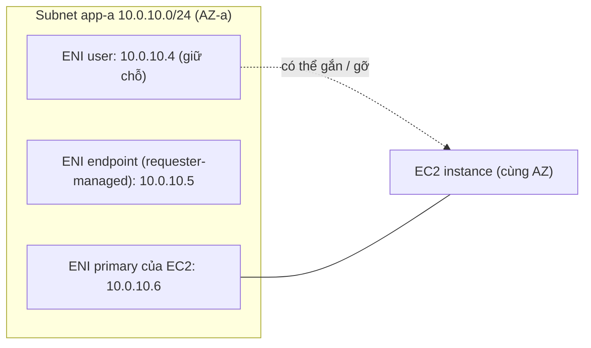

---
tags:
  - Must
  - AWS
  - ENI
  - IPAllocation
  - Troubleshooting
---

# ENI là gì và IP riêng trong subnet được cấp, giữ chỗ và chiếm dụng ra sao?

## Metadata

```yaml
Chapter: eni-and-ip-allocation
Phase: 06 — aws-networking
Importance: Must
Status: draft
Prerequisites:
  - Phase 03 / 01-dhcp
  - Phase 06 / 01-vpc-subnet-az
Used Later:
  - Phase 06 / 06-dhcp-options-and-vpc-dns
  - Phase 07 / 03-ecs-awsvpc-networking
Estimated Reading: 35 phút
Estimated Practice: 40 phút
```

## 1. Story

<!-- Mức bắt buộc (Must): Đủ -->
<!-- DRAFT: người học cần viết lại bằng lời mình -->

Đội `shopnet` có kế hoạch IP cho subnet `app-a` (`10.0.10.0/24`): `10.0.10.4` dành cho server cơ sở dữ liệu tạm thời, `10.0.10.5` cho một appliance. Cả hai server sẽ được tạo **vào tuần sau**. Trong tuần này, đội thêm interface endpoint và một dịch vụ dùng ECS `awsvpc`; mỗi cái tạo thêm network interface và **tự lấy IP còn trống**, trong đó có `10.0.10.4`. Tuần sau khi tạo server, hệ thống báo IP **đã được dùng**. Kế hoạch IP trên giấy không giữ chỗ gì cả; chỉ network interface đang tồn tại mới "giữ" địa chỉ.

Chapter này làm rõ **ENI (network interface — card mạng ảo)** là gì, IP gắn vào nó thế nào, và cách **giữ chỗ IP** bằng cách tạo ENI trước.

## 2. Objectives

<!-- Mức bắt buộc (Must): Đủ -->
<!-- DRAFT: người học cần viết lại bằng lời mình -->

Sau chapter này bạn có thể:

- Liệt kê thuộc tính của một ENI (IP riêng chính/phụ, Elastic IP, SG, MAC, cờ source/dest check).
- Giải thích địa chỉ riêng, địa chỉ công khai, Elastic IP đi theo ENI hay instance ra sao.
- Phân biệt ENI do bạn tạo và ENI do dịch vụ quản lý (requester-managed).
- Giữ chỗ IP trước bằng ENI và chọn IP cụ thể khi tạo ENI.
- Chẩn đoán lỗi: hết IP, IP bị chiếm, mất IP công khai sau khi stop instance, instance làm NAT/firewall không chuyển được gói.

## 3. Prerequisites

<!-- Mức bắt buộc (Must): Đủ -->
<!-- DRAFT: người học cần viết lại bằng lời mình -->

> Xem lại: [dhcp](../phase-03-core-services/01-dhcp.md), [vpc-subnet-az](01-vpc-subnet-az.md)

Cần nhớ: cấp địa chỉ động và địa chỉ tĩnh (`03/01`); 5 địa chỉ bị giữ trong subnet, `AvailableIpAddressCount` (`06/01`).

## 4. Why it exists

<!-- Mức bắt buộc (Must): Đủ -->
<!-- DRAFT: người học cần viết lại bằng lời mình -->

Trong mạng thật, địa chỉ IP gắn vào **card mạng** của máy, không gắn vào "máy" nói chung. AWS tái hiện điều đó: **ENI (Elastic Network Interface — card mạng ảo)** là đơn vị mang địa chỉ, nhóm bảo mật, địa chỉ MAC. Tách ENI khỏi instance cho phép **chuyển** ENI từ máy này sang máy khác (kèm địa chỉ và SG), giữ địa chỉ cố định khi thay máy, hoặc gắn nhiều ENI cho một máy (mạng quản trị và mạng dịch vụ).

Nếu hiểu sai: lên kế hoạch IP mà không giữ chỗ (Story), tưởng IP công khai là vĩnh viễn, không hiểu vì sao dịch vụ AWS tạo ENI "lạ" trong subnet, hoặc quên tắt source/dest check ở instance làm NAT.

## 5. Mental model

<!-- Mức bắt buộc (Must): Đủ -->
<!-- DRAFT: người học cần viết lại bằng lời mình -->

Hình dung **ổ cắm mạng** trong tòa nhà: mỗi ổ cắm (ENI) có **số ổ** (IP riêng) in sẵn, có **công tắc bảo vệ** (security group) và có thể có **số điện thoại ngoài** (IP công khai/Elastic IP). Bạn có thể **rút ổ cắm ra khỏi một máy cắm sang máy khác**; số ổ đi theo ổ. Người ta chỉ coi một số ổ là "có chủ" khi **ổ đó đã được lắp** (ENI tồn tại); ghi tên vào sổ kế hoạch không giữ được số ổ.

**Tóm tắt một câu:** ENI mang IP, SG và MAC; chỉ ENI đang tồn tại mới giữ IP trong subnet, nên muốn giữ chỗ phải tạo ENI trước.

## 6. How it works

<!-- Mức bắt buộc (Must): Đủ -->
<!-- DRAFT: người học cần viết lại bằng lời mình -->

Các từ cần biết:

- **ENI (card mạng ảo — thành phần logic trong VPC đại diện cho một card mạng; mang IP, SG, MAC).**
- **Primary private IPv4 (IP riêng chính — IP đầu tiên của ENI, lấy từ dải subnet).**
- **Secondary private IPv4 (IP riêng phụ — IP thêm vào ENI, có thể chuyển sang ENI khác).**
- **Requester-managed ENI (ENI do dịch vụ quản lý — ENI do dịch vụ AWS tạo thay bạn, bạn xem nhưng không sửa).**
- **Source/destination check (kiểm tra nguồn/đích — instance chỉ nhận gói mà nó là nguồn hoặc đích).**
- **Primary network interface (card mạng chính — ENI mặc định của instance, không gỡ được).**

**Thuộc tính của ENI (theo tài liệu AWS):** một IP riêng IPv4 chính từ dải subnet; IP riêng phụ; một Elastic IP cho **mỗi** IP riêng IPv4; một IP IPv4 công khai (tùy chọn); IPv6; **security group**; **địa chỉ MAC**; **cờ source/dest check**; mô tả. Các thuộc tính này **đi theo ENI** khi nó được gỡ khỏi instance này và gắn vào instance khác.

**Quy tắc quan trọng:**

- ENI thuộc **một subnet** (một AZ) và chỉ gắn được vào instance **cùng AZ**.
- Mỗi instance có ENI chính, **không gỡ được**; số ENI tối đa tùy loại instance.
- **IP riêng phụ** có thể chuyển giữa các instance; IP riêng chính thì không.
- **IP công khai** (không phải Elastic IP) được thả khi instance stop/hibernate/terminate và cấp mới khi start lại (trừ khi có ENI phụ hoặc IP phụ gắn Elastic IP). Elastic IP thì cố định tới khi bạn giải phóng.
- ENI mới tạo kế thừa thuộc tính "tự gán IP công khai" của subnet tại thời điểm tạo; đổi thuộc tính subnet sau đó không đổi ENI cũ.
- Có thể đặt hành vi khi instance bị terminate: tự xóa ENI hay giữ lại.
- **Source/dest check bật mặc định**; **phải tắt** nếu instance chạy NAT, định tuyến hay firewall (nó nhận/gửi gói không phải của chính nó).

**ENI do dịch vụ quản lý (requester-managed).** Theo tài liệu AWS, đây là ENI mà dịch vụ AWS tạo trong VPC của bạn để dùng tài nguyên của dịch vụ đó (ví dụ NAT gateway, interface VPC endpoint, một số dịch vụ cơ sở dữ liệu). Bạn **xem** được và gắn tag, nhưng **không** sửa thuộc tính, gắn/gỡ, gán/bỏ IP hay dùng khi tạo instance. Khi xóa tài nguyên dịch vụ, dịch vụ gỡ và xóa ENI. Nhận diện qua mô tả, trường `Requester-managed`, `Requester ID`.



**Đọc sơ đồ:** trong một subnet, mỗi IP đang dùng thuộc một ENI. ENI `10.0.10.4` do bạn tạo trước để **giữ chỗ**; có thể gắn vào instance sau (cùng AZ). ENI của endpoint là ENI do dịch vụ quản lý, tự lấy IP còn trống. ENI chính của EC2 gắn liền instance. Thấy rõ vì sao "ghi kế hoạch" không giữ chỗ: chỉ những ô có ENI mới bị chiếm.

**Cấp IP trong subnet.** Khi tạo ENI/instance không chỉ định IP, AWS **chọn một IP còn trống** từ dải subnet (thứ tự chọn không phải thứ để dựa vào). Khi chỉ định IP, IP đó phải thuộc subnet, không nằm trong 5 địa chỉ bị giữ (`06/01`) và chưa bị ENI khác dùng. Nhiều dịch vụ (interface endpoint, ECS `awsvpc`, Lambda trong VPC, NAT gateway, ELB) mỗi cái tạo ENI trong subnet, nên subnet nhỏ hết IP nhanh hơn dự kiến (`06/01`, `06/08`, `07/03`).

**Giữ chỗ IP:** tạo trước một ENI với IP mong muốn (ví dụ `10.0.10.4`); ENI đó chiếm IP, dịch vụ khác không lấy được. Khi sẵn sàng, gắn ENI vào instance (hoặc dùng ENI đó khi tạo instance). Cách này cũng giúp giữ IP **ổn định** khi thay instance (thay máy, chuyển ENI).

> Cấp IP động bằng DHCP bên trong VPC: `06/06`; ECS `awsvpc` mỗi task một ENI: `07/03`; interface endpoint và va chạm IP: `06/04`.

<!-- verified: 2026-10-05 https://docs.aws.amazon.com/AWSEC2/latest/UserGuide/using-eni.html -->
<!-- verified: 2026-10-05 https://docs.aws.amazon.com/AWSEC2/latest/UserGuide/requester-managed-eni.html -->
<!-- verified: 2026-10-05 https://docs.aws.amazon.com/AWSEC2/latest/UserGuide/managing-network-interface-ip-addresses.html -->

## 7. Key settings

<!-- Mức bắt buộc (Must): Đủ -->
<!-- DRAFT: người học cần viết lại bằng lời mình -->

| Thông số | Ý nghĩa | Nếu sai |
|---|---|---|
| IP riêng chỉ định khi tạo ENI | Giữ chỗ IP | Không chỉ định → tự cấp, có thể trùng kế hoạch (Story) |
| SG của ENI | Lọc lưu lượng vào/ra ENI | ENI gắn SG mặc định nếu không chỉ định |
| Source/dest check | Có nhận gói không phải của mình | Bật cho instance NAT/firewall → gói bị bỏ |
| Hành vi khi terminate (xóa ENI hay giữ) | Giữ ENI giữ chỗ | Tự xóa → IP trả về subnet |
| Tự gán IP công khai (thuộc tính subnet/ENI) | Có IP công khai ngẫu nhiên không | Bật nhầm → instance private có IP công khai |
| Elastic IP gắn vào IP riêng nào | IP công khai cố định | Quên giải phóng → tốn phí |
| Subnet của ENI | AZ và dải IP | Khác AZ với instance → không gắn được |
| Số ENI/IP tối đa mỗi instance | Giới hạn theo loại instance | Vượt → không gắn thêm được |

**Lệnh quan sát (chỉ đọc):**

```bash
aws ec2 describe-network-interfaces --filters Name=subnet-id,Values=<subnet-id> \
  --query "NetworkInterfaces[].{id:NetworkInterfaceId,ip:PrivateIpAddress,managed:RequesterManaged,type:InterfaceType,desc:Description,attached:Attachment.InstanceId}" --output table
aws ec2 describe-network-interfaces --filters Name=requester-managed,Values=true \
  --query "NetworkInterfaces[].[Description,InterfaceType,PrivateIpAddress]" --output table
```

## 8. AWS mapping

<!-- Mức bắt buộc (Must): Đủ -->
<!-- DRAFT: người học cần viết lại bằng lời mình -->

| Khái niệm | AWS | CloudFormation |
|---|---|---|
| ENI | Network interface | `AWS::EC2::NetworkInterface` (`PrivateIpAddress`, `GroupSet`, `SubnetId`) |
| Gắn ENI vào instance | Attachment | `AWS::EC2::NetworkInterfaceAttachment` |
| Elastic IP | Elastic IP | `AWS::EC2::EIP`, `AWS::EC2::EIPAssociation` |
| ENI trong thuộc tính instance | `NetworkInterfaces` của `AWS::EC2::Instance` | — |

**IAM tối thiểu cho lab:** `ec2:CreateNetworkInterface`, `ec2:DeleteNetworkInterface`, `ec2:DescribeNetworkInterfaces`, `ec2:CreateTags`, cùng quyền với subnet/SG liên quan.

**Chi phí:** ENI do bạn tạo không tính phí riêng; **địa chỉ IPv4 công khai (kể cả Elastic IP) có thể tính phí**: kiểm tra bảng giá hiện hành. Lab trong chapter này chỉ dùng IP riêng.

## 9. Hands-on lab

<!-- Mức bắt buộc (Must): Đủ -->
<!-- DRAFT: người học cần viết lại bằng lời mình -->

Chi tiết ở `labs/phase-06-aws-networking/chapter-05-eni-and-ip-allocation/README.md`.

- **Phần A (local):** mô phỏng cấp IP tự động và giữ chỗ để thấy va chạm.
- **Phần B (AWS sandbox, không phí):** tạo VPC, subnet; tạo ENI giữ chỗ `10.0.10.4`; thử tạo ENI thứ hai với cùng IP (bị từ chối); thử chỉ định IP trong dải bị giữ (bị từ chối); teardown.

**1. Predict:** ENI thứ hai xin `10.0.10.4` có được không? Xin `10.0.10.3`? ENI không chỉ định IP nhận IP nào?

**2. Run / 3. Verify:** xem README lab; output thật `[CHƯA CHẠY]`.

## 10. Break it

<!-- Mức bắt buộc (Must): Đủ -->
<!-- DRAFT: người học cần viết lại bằng lời mình -->

**Lỗi 1 — IP bị chiếm (Story).**
Dự đoán: hai ENI không thể cùng IP trong một subnet; xin lại IP đã giữ bị từ chối ("địa chỉ đã được dùng"). Khôi phục: chọn IP khác hoặc xóa ENI giữ chỗ nếu không cần.

**Lỗi 2 — xin IP bị giữ.**
Dự đoán: `10.0.10.3` (một trong 4 địa chỉ đầu) và địa chỉ cuối bị từ chối vì AWS giữ.

**Lỗi 3 — IP công khai mất sau khi stop.**
Dự đoán (khái niệm): IP công khai thường (không phải Elastic IP) bị thả khi stop và cấp mới khi start; Elastic IP giữ nguyên. Không tạo instance trong lab này (có thể tính phí); chỉ phân tích tài liệu.

**Lỗi 4 — source/dest check ở instance NAT.**
Dự đoán (khái niệm): bật check ở instance làm NAT thì gói chuyển tiếp bị bỏ. Chỉ phân tích, không thử.

Kết quả thật: `[CHƯA CHẠY]`.

## 11. Troubleshooting

<!-- Mức bắt buộc (Must): Đủ -->
<!-- DRAFT: người học cần viết lại bằng lời mình -->

| Triệu chứng | Giả thuyết đầu tiên | Kiểm tra theo thứ tự | Công cụ |
|---|---|---|---|
| "IP đã được dùng" khi tạo ENI/instance | ENI khác (có thể requester-managed) đã lấy IP | 1) Liệt kê ENI trong subnet 2) Tìm ENI giữ IP 3) Đổi IP hoặc di chuyển | `describe-network-interfaces` |
| Hết IP trong subnet | Nhiều ENI (endpoint, ECS, Lambda, NAT, LB) | `AvailableIpAddressCount`; đếm ENI theo loại | `describe-subnets`, `describe-network-interfaces` |
| Không gắn được ENI vào instance | Khác AZ hoặc vượt giới hạn | So AZ subnet ENI và instance; số ENI tối đa | `describe-network-interfaces`, `describe-instances` |
| Instance mất IP công khai sau stop/start | IP công khai thường bị thả | Dùng Elastic IP nếu cần cố định | `describe-addresses` |
| Instance NAT/firewall không chuyển được gói | Source/dest check bật | Tắt cờ ở ENI | `describe-network-interface-attribute` |
| Không xóa được ENI lạ | ENI do dịch vụ quản lý | Xem `RequesterManaged`; xóa tài nguyên dịch vụ gốc | `describe-network-interfaces` |
| Quên ENI giữ chỗ → rác | ENI không gắn vẫn chiếm IP | Liệt kê ENI `available` (chưa gắn) | `describe-network-interfaces` |

Ghi kết quả thật của mục 10: `[CHƯA CHẠY]`.

## 12. Security & cost

<!-- Mức bắt buộc (Must): Đủ -->
<!-- DRAFT: người học cần viết lại bằng lời mình -->

- **SG theo ENI:** mỗi ENI có SG riêng; ENI phụ dễ bị gắn SG mặc định rộng; kiểm tra khi thêm ENI.
- **Source/dest check:** chỉ tắt cho instance thực sự làm NAT/định tuyến/firewall; tắt bừa cho phép instance chuyển lưu lượng không mong muốn.
- **Không gắn IP công khai bừa bãi** cho ENI ở subnet app/data (`06/01`).
- **Xóa ENI giữ chỗ** không còn dùng để tránh rác và để trả IP.
- **Chi phí:** ENI không phí riêng; IPv4 công khai/Elastic IP có thể tính phí (kể cả không gắn): kiểm tra giá hiện hành, giải phóng Elastic IP không dùng.
- Không dán ID ENI, IP, account thật vào tài liệu công khai.

## 13. Misconceptions

<!-- Mức bắt buộc (Must): Đủ -->
<!-- DRAFT: người học cần viết lại bằng lời mình -->

| Hiểu nhầm | Sự thật |
|---|---|
| "Ghi kế hoạch IP là giữ chỗ" | Chỉ ENI đang tồn tại mới chiếm IP |
| "IP gắn vào instance" | Gắn vào ENI; ENI gắn vào instance |
| "IP công khai thường là vĩnh viễn" | Bị thả khi stop/terminate; Elastic IP mới cố định |
| "Chuyển IP riêng chính sang máy khác được" | Chỉ IP phụ chuyển được; ENI chuyển cả IP chính |
| "ENI lạ trong subnet là rác" | Có thể là ENI do dịch vụ quản lý (endpoint, NAT, RDS...) |
| "Mỗi instance chỉ có một ENI" | Có thể nhiều ENI (số tối đa tùy loại) |
| "Source/dest check luôn nên bật" | Phải tắt cho NAT/định tuyến/firewall |
| "ENI gắn được vào instance ở AZ bất kỳ" | Chỉ cùng AZ |

## 14. Interview questions

<!-- Mức bắt buộc (Must): Đủ -->
<!-- DRAFT: người học cần viết lại bằng lời mình -->

### Q1 (Junior) — ENI là gì và mang những thuộc tính nào?

**Gợi ý ý chính:**
- IP, SG, MAC?
- Chuyển được không?

??? success "Đáp án mẫu (tự trả lời trước khi mở)"
    ENI là card mạng ảo trong VPC. Nó mang IP riêng chính và phụ, Elastic IP/IP công khai, security group, địa chỉ MAC, cờ source/dest check. Các thuộc tính này đi theo ENI khi gỡ khỏi instance này và gắn vào instance khác (cùng AZ).

### Q2 (Middle) — Làm sao giữ chỗ một IP trong subnet để dùng sau?

**Gợi ý ý chính:**
- Cái gì mới chiếm IP?

??? success "Đáp án mẫu (tự trả lời trước khi mở)"
    Tạo trước một ENI với IP riêng mong muốn trong subnet; ENI đó chiếm IP nên các dịch vụ khác (endpoint, ECS, Lambda...) không lấy được. Sau đó gắn ENI vào instance hoặc dùng khi tạo instance. Ghi kế hoạch IP trên giấy không giữ chỗ gì.

### Q3 (Middle) — Trong subnet có ENI lạ mà bạn không tạo. Đó là gì và xử lý ra sao?

**Gợi ý ý chính:**
- Requester-managed

??? success "Đáp án mẫu (tự trả lời trước khi mở)"
    Thường là ENI do dịch vụ AWS quản lý (interface endpoint, NAT gateway, RDS, Lambda trong VPC...). Xem mô tả và trường Requester-managed; bạn không sửa/gắn/xóa được, muốn bỏ thì xóa tài nguyên dịch vụ tương ứng, dịch vụ sẽ xóa ENI.

### Q4 (Middle) — Vì sao instance làm NAT cần tắt source/dest check?

**Gợi ý ý chính:**
- Gói mà nó chuyển tiếp?

??? success "Đáp án mẫu (tự trả lời trước khi mở)"
    Khi bật, ENI chỉ nhận gói mà instance là nguồn hoặc đích. Instance làm NAT/router/firewall chuyển tiếp gói của máy khác nên cả nguồn lẫn đích đều không phải nó; phải tắt check để gói không bị bỏ.

## 15. Exercises

<!-- Mức bắt buộc (Must): Đủ -->
<!-- DRAFT: người học cần viết lại bằng lời mình -->

1. **Kế hoạch giữ chỗ.** *Deliverable:* với subnet `10.0.10.0/24`, danh sách IP cần giữ chỗ trước (ví dụ database, appliance, endpoint có IP cố định) kèm lệnh tạo ENI giữ chỗ, và nêu những IP không thể dùng.
2. **Phân tích Story.** *Deliverable:* kế hoạch 5 bước tìm ra ENI nào chiếm `10.0.10.4` và cách xử lý (lệnh mỗi bước).
3. **Đếm IP.** *Deliverable:* ước lượng số IP một subnet `/24` cần cho: 2 NAT, 1 ALB (nhiều IP), 3 interface endpoint, 20 task ECS `awsvpc`; nêu giả định và so với IP dùng được (251).
4. **Phân loại ENI.** Cho danh sách 6 ENI với mô tả. *Deliverable:* ENI nào do bạn tạo, nào requester-managed và dấu hiệu nhận biết.

## 16. Cheat sheet

<!-- Mức bắt buộc (Must): Đủ -->
<!-- DRAFT: người học cần viết lại bằng lời mình -->

| Mục | Nội dung |
|---|---|
| ENI mang | IP chính/phụ, Elastic IP, SG, MAC, source/dest check |
| Giữ chỗ IP | Tạo ENI trước với IP chỉ định |
| IP chính | Không chuyển; IP phụ chuyển được |
| IP công khai thường | Thả khi stop; Elastic IP cố định |
| Requester-managed | Xem được, không sửa; xóa qua tài nguyên dịch vụ |
| NAT/firewall | Tắt source/dest check |
| Lệnh | `describe-network-interfaces` (lọc subnet, requester-managed) |

**Debug:** IP đã dùng → liệt kê ENI trong subnet (cả requester-managed) → AZ/giới hạn khi gắn → IP công khai (thường vs Elastic) → source/dest check.

## 17. Glossary terms

<!-- Mức bắt buộc (Must): Đủ -->
<!-- DRAFT: người học cần viết lại bằng lời mình -->

- ENI / card mạng ảo / ENI
- Primary private IPv4 / IP riêng chính / プライマリプライベートIPv4
- Secondary private IPv4 / IP riêng phụ / セカンダリプライベートIPv4
- Requester-managed ENI / ENI do dịch vụ quản lý / リクエスタ管理ENI
- Source-destination check / kiểm tra nguồn/đích / 送信元/送信先チェック

## 18. Further reading

<!-- Mức bắt buộc (Must): Đủ -->
<!-- DRAFT: người học cần viết lại bằng lời mình -->

Kiểm tra ngày 2026-10-05:

- Elastic network interfaces: https://docs.aws.amazon.com/AWSEC2/latest/UserGuide/using-eni.html
- Requester-managed network interfaces: https://docs.aws.amazon.com/AWSEC2/latest/UserGuide/requester-managed-eni.html
- Manage the IP addresses for your network interface: https://docs.aws.amazon.com/AWSEC2/latest/UserGuide/managing-network-interface-ip-addresses.html
