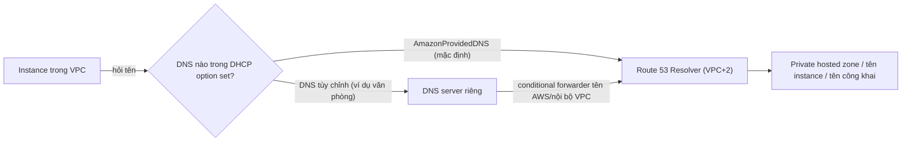

---
tags:
  - Should
  - AWS
  - DHCP
  - DNS
  - Troubleshooting
---

# DHCP option set và DNS của VPC quyết định máy trong VPC phân giải tên thế nào?

## Metadata

```yaml
Chapter: dhcp-options-and-vpc-dns
Phase: 06 — aws-networking
Importance: Should
Status: draft
Prerequisites:
  - Phase 03 / 01-dhcp
  - Phase 03 / 02-dns-resolution
  - Phase 06 / 05-eni-and-ip-allocation
Used Later: []
Estimated Reading: 25 phút
Estimated Practice: 25 phút
```

## 1. Story

<!-- Mức bắt buộc (Should): Đủ -->
<!-- DRAFT: người học cần viết lại bằng lời mình -->

Đội `shopnet` nối VPC với mạng văn phòng bằng VPN và muốn instance phân giải được tên nội bộ của văn phòng, nên tạo **DHCP option set** trỏ DNS tới máy chủ DNS văn phòng và gắn vào VPC. Ngay sau đó, các instance **không còn phân giải được** tên của dịch vụ AWS (ví dụ endpoint, S3, tên instance nội bộ của VPC), vì DNS văn phòng không biết những tên này. Ở một sự cố khác, một VPC có `enableDnsHostnames` tắt khiến private hosted zone và tên của interface endpoint không hoạt động như mong đợi.

Hai chuyện cùng một gốc: máy trong VPC nhận **địa chỉ DNS** qua DHCP, và VPC có các **thuộc tính DNS** cho phép/không cho phép máy chủ DNS của AWS hoạt động. Chapter này nối khái niệm DHCP (`03/01`) và DNS (`03/02`) vào bối cảnh AWS.

## 2. Objectives

<!-- Mức bắt buộc (Should): Đủ -->
<!-- DRAFT: người học cần viết lại bằng lời mình -->

Sau chapter này bạn có thể:

- Giải thích Amazon DNS (Route 53 Resolver) nằm ở đâu và làm gì.
- Giải thích hai thuộc tính DNS của VPC và khi nào bắt buộc cả hai bật.
- Giải thích DHCP option set gồm gì và vì sao không sửa được sau khi tạo.
- Dự đoán hậu quả khi đổi DNS server của VPC sang máy chủ tùy chỉnh.
- Chẩn đoán "không phân giải được tên" trong VPC theo thứ tự kiểm tra.

## 3. Prerequisites

<!-- Mức bắt buộc (Should): Đủ -->
<!-- DRAFT: người học cần viết lại bằng lời mình -->

> Xem lại: [dhcp](../phase-03-core-services/01-dhcp.md), [dns-resolution](../phase-03-core-services/02-dns-resolution.md), [eni-and-ip-allocation](05-eni-and-ip-allocation.md)

Cần nhớ: DHCP phát IP, gateway, DNS (`03/01`); bộ phân giải đệ quy, thứ tự tìm tên (`03/02`); ENI mang IP (`06/05`).

## 4. Why it exists

<!-- Mức bắt buộc (Should): Đủ -->
<!-- DRAFT: người học cần viết lại bằng lời mình -->

Máy trong VPC cần biết DNS server nào để hỏi và cần một server làm được việc đó mà bạn không phải tự dựng. AWS cung cấp sẵn một bộ phân giải trong mỗi VPC và phát địa chỉ của nó qua DHCP; khi cần, bạn thay bằng DNS riêng (ví dụ DNS văn phòng) thông qua **DHCP option set**.

Nếu hiểu sai: đổi DNS server mà quên chuyển tiếp tên AWS về bộ phân giải của VPC (Story), tắt thuộc tính DNS làm hỏng private hosted zone/endpoint, hoặc tưởng sửa được option set sau khi tạo.

## 5. Mental model

<!-- Mức bắt buộc (Should): Đủ -->
<!-- DRAFT: người học cần viết lại bằng lời mình -->

Hình dung **danh bạ điện thoại của tòa nhà**: lễ tân (DHCP) đưa cho mỗi người mới đến một tờ giấy ghi **số tổng đài tra cứu** (DNS server). Mặc định tổng đài là của tòa nhà (Amazon DNS) và biết mọi số nội bộ. Nếu bạn đổi tờ giấy sang tổng đài của công ty khác, nhân viên chỉ hỏi được số mà tổng đài đó biết, trừ khi tổng đài mới được dặn chuyển câu hỏi nội bộ về tổng đài của tòa nhà.

**Tóm tắt một câu:** DHCP option set quyết định DNS server mà máy trong VPC dùng; mặc định là Amazon DNS (địa chỉ VPC cộng 2), và hai thuộc tính DNS của VPC quyết định nó có hoạt động đầy đủ không.

## 6. How it works

<!-- Mức bắt buộc (Should): Đủ -->
<!-- DRAFT: người học cần viết lại bằng lời mình -->

Các từ cần biết:

- **Route 53 Resolver / Amazon DNS (bộ phân giải DNS có sẵn trong mỗi VPC, còn gọi AmazonProvidedDNS; tài liệu AWS hiện gọi là Route 53 VPC Resolver).**
- **DHCP option set (bộ tùy chọn DHCP — cấu hình DNS server, domain, NTP... mà VPC phát cho máy).**
- **enableDnsSupport (thuộc tính VPC — cho phép phân giải bằng Amazon DNS).**
- **enableDnsHostnames (thuộc tính VPC — cho phép gán tên DNS công khai cho instance có IP công khai).**
- **Conditional forwarder (chuyển tiếp có điều kiện — DNS server tùy chỉnh chuyển câu hỏi về một miền cho server khác).**

**Amazon DNS (theo tài liệu AWS):** nằm ở **`169.254.169.253`** (IPv4), `fd00:ec2::253` (IPv6) và ở **địa chỉ đầu của dải CIDR chính của VPC cộng 2** (ví dụ `10.0.0.2` với VPC `10.0.0.0/16`). Nó phân giải tên riêng của instance, bản ghi trong private hosted zone (`06/07`) và tên công khai. Nó chỉ hỗ trợ truy vấn đệ quy; **SG và NACL không lọc được** lưu lượng DNS tới nó (`06/03`); dùng DNS Firewall nếu cần lọc. Có giới hạn **1024 gói/giây mỗi ENI** cho tất cả dịch vụ dùng địa chỉ link-local (DNS, metadata, NTP...), không tăng được.

**Hai thuộc tính DNS của VPC (theo tài liệu AWS):**

| Thuộc tính | Mặc định | Ý nghĩa |
|---|---|---|
| `enableDnsSupport` | `true` | VPC hỗ trợ phân giải qua Amazon DNS |
| `enableDnsHostnames` | `false` (trừ default VPC) | Instance có IP công khai nhận tên DNS công khai |

Nếu ít nhất một thuộc tính là `false`, bộ phân giải **không** phân giải được tên riêng do Amazon cấp. Nếu dùng **private hosted zone của Route 53** hoặc **private DNS của interface endpoint**, **cả hai thuộc tính phải là `true`** (`06/04`, `06/07`).

**DHCP option set (theo tài liệu AWS):** mỗi Region có option set mặc định; mỗi VPC dùng một option set tại một thời điểm. Mặc định chứa **DNS server = AmazonProvidedDNS**, domain name, thời gian lease IPv6. Bộ tùy chỉnh có thể đặt DNS server (tối đa 4 server IPv4; hoặc 3 server cộng AmazonProvidedDNS), domain name, NTP server, NetBIOS. Điểm quan trọng:

- Option set **không sửa được sau khi tạo**: muốn đổi, tạo bộ mới rồi gắn vào VPC.
- Gắn bộ mới: instance đang chạy và instance mới đều dùng tùy chọn mới, **không cần khởi động lại**; instance nhận thay đổi **trong vòng vài giờ** tùy chu kỳ gia hạn lease DHCP (có thể gia hạn thủ công trong hệ điều hành).
- Không gắn bộ nào vào VPC thì tắt phân giải tên của VPC (với instance Nitro AWS vẫn đặt `169.254.169.253` làm DNS mặc định; với Xen không có DNS server và instance không ra Internet được).
- Nếu VPC có IGW, **phải** để DNS là AmazonProvidedDNS hoặc DNS riêng; thiếu cả hai thì instance mất DNS nên mất Internet.
- Chỉ dùng domain name bạn kiểm soát; hệ điều hành xử lý nhiều domain khác nhau (Linux có thể nhận nhiều, Windows coi là một), nên chỉ đặt **một** domain nếu có instance Windows.
- Không trộn AmazonProvidedDNS với DNS riêng ngoài dạng tối đa 3 server cộng AmazonProvidedDNS; tài liệu cảnh báo trộn có thể gây hành vi không mong muốn.



**Đọc sơ đồ:** instance hỏi DNS server mà DHCP option set chỉ định. Mặc định đó là Amazon DNS, biết cả tên nội bộ VPC lẫn private hosted zone. Nếu thay bằng DNS riêng, DNS riêng đó **phải chuyển tiếp** các miền AWS/nội bộ VPC về Amazon DNS (conditional forwarder, ví dụ miền `amazonaws.com`); nếu không, tên AWS thôi phân giải (Story).

**Hybrid DNS nên làm thế nào.** Thay vì đổi DHCP option set sang DNS văn phòng, cách thường dùng là giữ Amazon DNS làm mặc định và dùng **Route 53 Resolver endpoint** (inbound/outbound) cùng quy tắc chuyển tiếp để nối tên giữa VPC và văn phòng (`06/07`, `06/10`). Cách này tránh làm mất tên AWS.

> Private hosted zone, split-horizon, Route 53: `06/07`. Interface endpoint cần Private DNS: `06/04`. Lọc DNS: `06/03`.

<!-- verified: 2026-10-05 https://docs.aws.amazon.com/vpc/latest/userguide/AmazonDNS-concepts.html -->
<!-- verified: 2026-10-05 https://docs.aws.amazon.com/vpc/latest/userguide/DHCPOptionSetConcepts.html -->
<!-- verified: 2026-10-05 https://docs.aws.amazon.com/vpc/latest/userguide/DHCPOptionSet.html -->

## 7. Key settings

<!-- Mức bắt buộc (Should): Đủ -->
<!-- DRAFT: người học cần viết lại bằng lời mình -->

| Thông số | Ý nghĩa | Nếu sai |
|---|---|---|
| `enableDnsSupport` | Bật phân giải qua Amazon DNS | Tắt → mất tên riêng, endpoint, PHZ |
| `enableDnsHostnames` | Tên DNS công khai cho instance | Tắt → PHZ và endpoint private DNS không đúng |
| DNS server trong option set | Máy hỏi ai | Chỉ DNS văn phòng → mất tên AWS |
| Domain name trong option set | Hậu tố tìm kiếm | Nhiều domain trên Windows → hành vi lạ |
| NTP server | Nguồn thời gian | Mặc định dùng Amazon Time Sync |
| Conditional forwarder (DNS riêng) | Tên AWS về Amazon DNS | Thiếu → tên AWS không phân giải |
| Gắn option set với VPC | Áp dụng cho cả VPC | Không gắn → tắt phân giải (xem trên) |

**Lệnh quan sát (chỉ đọc):**

```bash
aws ec2 describe-vpc-attribute --vpc-id <vpc-id> --attribute enableDnsSupport
aws ec2 describe-vpc-attribute --vpc-id <vpc-id> --attribute enableDnsHostnames
aws ec2 describe-dhcp-options --query "DhcpOptions[].{id:DhcpOptionsId,cfg:DhcpConfigurations}"
```

Trong instance (Linux): `cat /etc/resolv.conf` cho thấy DNS server hiện dùng; `dig example.com` kiểm tra phân giải (`03/02`).

## 8. AWS mapping

<!-- Mức bắt buộc (Must): Tùy chọn cho chapter Should -->
<!-- DRAFT: người học cần viết lại bằng lời mình -->

| Khái niệm | AWS | CloudFormation |
|---|---|---|
| Thuộc tính DNS của VPC | Thuộc tính VPC | `EnableDnsSupport`, `EnableDnsHostnames` của `AWS::EC2::VPC` |
| DHCP option set | DHCP options | `AWS::EC2::DHCPOptions` |
| Gắn option set vào VPC | Association | `AWS::EC2::VPCDHCPOptionsAssociation` |
| Bộ phân giải | Route 53 Resolver | endpoint: `AWS::Route53Resolver::ResolverEndpoint` |

**Chi phí:** DHCP option set và thuộc tính DNS không tính phí; Route 53 Resolver endpoint có phí theo giờ và theo truy vấn (kiểm tra giá hiện hành).

## 9. Hands-on lab

<!-- Mức bắt buộc (Should): Rút gọn -->
<!-- DRAFT: người học cần viết lại bằng lời mình -->

Chi tiết ở `labs/phase-06-aws-networking/chapter-06-dhcp-options-and-vpc-dns/README.md`. Lab rút gọn: chỉ đọc và tạo tài nguyên **không phí**; không đổi DHCP option set của VPC đang dùng thật.

**1. Predict:** VPC mới tạo bằng CLI có `enableDnsHostnames` bằng gì? Có sửa được một DHCP option set đã tạo không?

**2. Run / 3. Verify:** xem README lab; output thật `[CHƯA CHẠY]`.

## 10. Break it

<!-- Mức bắt buộc (Should): Rút gọn -->
<!-- DRAFT: người học cần viết lại bằng lời mình -->

**Lỗi — thuộc tính DNS tắt.**
Dự đoán: VPC tự tạo có `enableDnsHostnames = false`; bật `true` bằng `modify-vpc-attribute` thì đọc lại thấy `true`. (Trên VPC trống, không tác động dịch vụ.)

**Lỗi (khái niệm) — DHCP option set trỏ DNS riêng không chuyển tiếp.**
Dự đoán: instance sẽ không phân giải được tên AWS vì DNS riêng không biết miền đó. Chỉ phân tích; không gắn option set lên VPC đang dùng thật.

Kết quả thật: `[CHƯA CHẠY]`.

## 11. Troubleshooting

<!-- Mức bắt buộc (Should): Rút gọn -->
<!-- DRAFT: người học cần viết lại bằng lời mình -->

| Triệu chứng | Giả thuyết đầu tiên | Kiểm tra | Công cụ |
|---|---|---|---|
| Không phân giải được tên AWS (endpoint, S3) | DNS server tùy chỉnh không chuyển tiếp | Option set; `/etc/resolv.conf`; conditional forwarder | `dig`, `describe-dhcp-options` |
| PHZ/endpoint private DNS không hoạt động | Một trong hai thuộc tính DNS tắt | `describe-vpc-attribute` | CLI |
| Instance mất DNS và Internet | Option set không có DNS server hoặc không gắn bộ nào (Xen) | Option set của VPC | CLI |
| Đổi option set nhưng máy chưa đổi | Chưa gia hạn lease | Chờ vài giờ hoặc gia hạn thủ công | `resolv.conf` |
| DNS chập chờn khi tải cao | Giới hạn 1024 gói/giây/ENI cho dịch vụ link-local | Giảm truy vấn, cache cục bộ | Chỉ số/log |
| Không lọc được DNS bằng SG/NACL | SG/NACL không lọc Amazon DNS | DNS Firewall | — |

Ghi kết quả thật của mục 10: `[CHƯA CHẠY]`.

## 12. Security & cost

<!-- Mức bắt buộc (Should): Đủ -->
<!-- DRAFT: người học cần viết lại bằng lời mình -->

- **DNS là lớp kiểm soát quan trọng:** dùng Route 53 Resolver DNS Firewall để chặn miền độc hại; SG/NACL không lọc được.
- **Chỉ dùng domain bạn kiểm soát** trong option set để tránh bị dẫn tên sai.
- **Cẩn thận khi đổi DNS của cả VPC:** ảnh hưởng mọi instance; dùng Resolver endpoint cho hybrid thay vì thay mặc định.
- Không dán tên miền nội bộ thật, IP DNS thật vào tài liệu công khai.
- **Chi phí:** option set và thuộc tính miễn phí; Resolver endpoint tính phí theo giờ/truy vấn (kiểm tra giá hiện hành).

## 13. Misconceptions

<!-- Mức bắt buộc (Should): Đủ -->
<!-- DRAFT: người học cần viết lại bằng lời mình -->

| Hiểu nhầm | Sự thật |
|---|---|
| "DNS của VPC là bên ngoài" | Amazon DNS nằm ở VPC+2 và `169.254.169.253` |
| "Sửa được DHCP option set" | Không; tạo mới rồi gắn lại |
| "Đổi option set cần khởi động lại instance" | Không; nhận thay đổi khi gia hạn lease |
| "SG/NACL chặn được DNS tới VPC+2" | Không |
| "Chỉ cần một thuộc tính DNS bật" | PHZ và private DNS của endpoint cần cả hai |
| "Trỏ DNS sang văn phòng là thêm tên văn phòng" | Thay thế; mất tên AWS nếu không chuyển tiếp |

## 14. Interview questions

<!-- Mức bắt buộc (Should): Đủ -->
<!-- DRAFT: người học cần viết lại bằng lời mình -->

### Q1 (Junior) — DNS server mặc định trong VPC là gì và ở đâu?

**Gợi ý ý chính:**
- Địa chỉ nào?

??? success "Đáp án mẫu (tự trả lời trước khi mở)"
    Route 53 Resolver (Amazon DNS) tại `169.254.169.253` và tại địa chỉ đầu dải CIDR chính của VPC cộng 2 (ví dụ `10.0.0.2`). Máy nhận địa chỉ này qua DHCP option set mặc định (AmazonProvidedDNS).

### Q2 (Middle) — Sau khi đổi DNS của VPC sang DNS văn phòng, tên AWS không phân giải được. Vì sao và sửa thế nào?

**Gợi ý ý chính:**
- DNS riêng có biết tên AWS không?

??? success "Đáp án mẫu (tự trả lời trước khi mở)"
    DNS văn phòng không biết các miền AWS/nội bộ VPC. Sửa: thêm conditional forwarder trên DNS văn phòng chuyển các miền đó về Amazon DNS của VPC, hoặc tốt hơn giữ Amazon DNS làm mặc định và dùng Route 53 Resolver endpoint cùng quy tắc chuyển tiếp cho hybrid DNS.

### Q3 (Middle) — Hai thuộc tính DNS của VPC làm gì và khi nào bắt buộc cả hai?

**Gợi ý ý chính:**
- PHZ, endpoint

??? success "Đáp án mẫu (tự trả lời trước khi mở)"
    `enableDnsSupport` cho phép phân giải qua Amazon DNS; `enableDnsHostnames` cho phép tên DNS công khai cho instance có IP công khai. Dùng private hosted zone hoặc Private DNS của interface endpoint thì cả hai phải `true`.

## 15. Exercises

<!-- Mức bắt buộc (Should): Đủ -->
<!-- DRAFT: người học cần viết lại bằng lời mình -->

1. **Kế hoạch hybrid DNS.** *Deliverable:* sơ đồ và danh sách cấu hình (không đổi mặc định) để instance phân giải tên văn phòng và văn phòng phân giải tên VPC.
2. **Phân tích Story.** *Deliverable:* 5 bước tìm vì sao tên AWS không phân giải và cách sửa, kèm lệnh.
3. **Bảng thuộc tính.** *Deliverable:* bảng 4 tình huống (PHZ, endpoint private DNS, tên công khai của instance, chỉ dùng DNS riêng) và thuộc tính cần bật.

## 16. Cheat sheet

<!-- Mức bắt buộc (Should): Đủ -->
<!-- DRAFT: người học cần viết lại bằng lời mình -->

| Mục | Nội dung |
|---|---|
| Amazon DNS | `169.254.169.253`, VPC+2; 1024 gói/giây/ENI |
| Thuộc tính | `enableDnsSupport` (true mặc định), `enableDnsHostnames` (false trừ default VPC) |
| PHZ/endpoint private DNS | Cần cả hai thuộc tính `true` |
| Option set | Không sửa được; tạo mới + gắn; áp dụng khi lease gia hạn |
| DNS riêng | Phải chuyển tiếp tên AWS; hoặc dùng Resolver endpoint |
| Lệnh | `describe-vpc-attribute`, `describe-dhcp-options`, `dig` |

**Debug:** `resolv.conf` (DNS nào) → thuộc tính VPC → option set → forwarder → giới hạn gói/giây.

## 17. Glossary terms

<!-- Mức bắt buộc (Should): Đủ -->
<!-- DRAFT: người học cần viết lại bằng lời mình -->

- Route 53 Resolver / bộ phân giải Route 53 / Route 53 Resolver
- DHCP option set / bộ tùy chọn DHCP / DHCPオプションセット
- Conditional forwarder / chuyển tiếp có điều kiện / 条件付きフォワーダー

## 18. Further reading

<!-- Mức bắt buộc (Should): Đủ -->
<!-- DRAFT: người học cần viết lại bằng lời mình -->

Kiểm tra ngày 2026-10-05:

- Amazon DNS (Route 53 Resolver) và thuộc tính DNS: https://docs.aws.amazon.com/vpc/latest/userguide/AmazonDNS-concepts.html
- DHCP option set concepts: https://docs.aws.amazon.com/vpc/latest/userguide/DHCPOptionSetConcepts.html
- Work with DHCP option sets: https://docs.aws.amazon.com/vpc/latest/userguide/DHCPOptionSet.html
- View and update DNS attributes: https://docs.aws.amazon.com/vpc/latest/userguide/vpc-dns-updating.html
