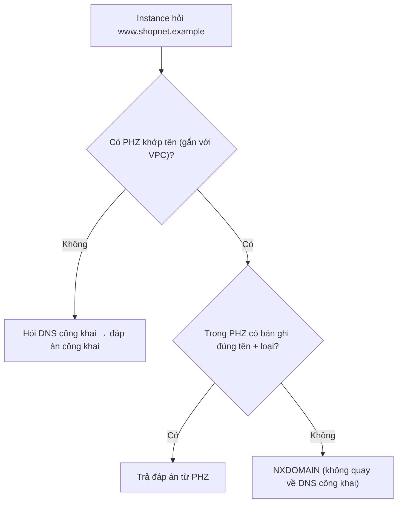

---
tags:
  - Must
  - AWS
  - Route53
  - DNS
  - Troubleshooting
---

# Route 53 trả lời truy vấn DNS thế nào, và vì sao private hosted zone có thể làm "mất" website công khai trong VPC?

## Metadata

```yaml
Chapter: route53
Phase: 06 — aws-networking
Importance: Must
Status: draft
Prerequisites:
  - Phase 03 / 03-dns-records-ttl-private-dns
  - Phase 06 / 01-vpc-subnet-az
Used Later: []
Estimated Reading: 40 phút
Estimated Practice: 40 phút
```

## 1. Story

<!-- Mức bắt buộc (Must): Đủ -->
<!-- DRAFT: người học cần viết lại bằng lời mình -->

Đội `shopnet` dùng domain `shopnet.example` cho website công khai (`www.shopnet.example`) do một public hosted zone phục vụ. Họ tạo thêm một **private hosted zone cùng tên `shopnet.example`** để các server nội bộ gọi nhau bằng tên như `db.shopnet.example`, rồi gắn nó vào VPC. Vài phút sau, các server trong VPC **không truy cập được `www.shopnet.example`** (báo "không tìm thấy tên"), dù người dùng ngoài Internet vẫn vào bình thường. Trong private hosted zone chỉ có bản ghi `db`, **không có `www`**.

Đó là hành vi có chủ đích của split-horizon DNS: khi một private hosted zone khớp với tên được hỏi, bộ phân giải trong VPC **chỉ tìm trong zone đó** và nếu không thấy bản ghi thì trả **NXDOMAIN**, không quay sang DNS công khai. Chapter này giải thích cách Route 53 trả lời, các loại hosted zone, bản ghi alias, chính sách định tuyến và health check.

## 2. Objectives

<!-- Mức bắt buộc (Must): Đủ -->
<!-- DRAFT: người học cần viết lại bằng lời mình -->

Sau chapter này bạn có thể:

- Phân biệt public hosted zone và private hosted zone, và biết VPC nào "nhìn thấy" zone nào.
- Giải thích thứ tự khớp tên khi các zone chồng lấn và vì sao có NXDOMAIN bất ngờ.
- Chọn alias hay CNAME và nêu lý do (zone apex, phí truy vấn, TTL).
- Chọn chính sách định tuyến (simple, weighted, failover, latency...) cho một nhu cầu.
- Giải thích Route 53 VPC Resolver endpoint (inbound/outbound) và quy tắc chuyển tiếp cho hybrid DNS.
- Chẩn đoán "không phân giải được tên" bằng chuỗi kiểm tra cố định.

## 3. Prerequisites

<!-- Mức bắt buộc (Must): Đủ -->
<!-- DRAFT: người học cần viết lại bằng lời mình -->

> Xem lại: [dns-records-ttl-private-dns](../phase-03-core-services/03-dns-records-ttl-private-dns.md), [vpc-subnet-az](01-vpc-subnet-az.md), [dhcp-options-and-vpc-dns](06-dhcp-options-and-vpc-dns.md)

Cần nhớ: loại bản ghi, TTL, split-horizon (`03/03`); VPC và subnet (`06/01`); Amazon DNS ở VPC+2 và hai thuộc tính DNS (`06/06`).

## 4. Why it exists

<!-- Mức bắt buộc (Must): Đủ -->
<!-- DRAFT: người học cần viết lại bằng lời mình -->

Cần một dịch vụ DNS **có sẵn, tin cậy** để (1) công bố tên công khai của hệ thống ra Internet, (2) cho các thành phần trong VPC gọi nhau bằng **tên ổn định** thay vì IP, và (3) điều hướng lưu lượng thông minh (chia theo trọng số, theo vùng, chuyển sang bản dự phòng khi sự cố). **Amazon Route 53** là dịch vụ DNS của AWS đảm nhiệm cả ba.

Nếu hiểu sai: private zone cùng tên với public zone làm mất tên công khai trong VPC (Story), dùng CNAME ở zone apex (không được), TTL quá dài làm failover chậm, hoặc health check không với tới tài nguyên riêng tư.

## 5. Mental model

<!-- Mức bắt buộc (Must): Đủ -->
<!-- DRAFT: người học cần viết lại bằng lời mình -->

Hình dung **hai cuốn danh bạ**: một cuốn **công khai** (ai trên đời cũng tra được) và một cuốn **nội bộ** (chỉ nhân viên trong tòa nhà tra được). Khi nhân viên trong tòa nhà tra tên `shopnet.example`, lễ tân thấy có cuốn nội bộ cùng tên nên **chỉ tra cuốn nội bộ**; nếu cuốn nội bộ không có tên đó, lễ tân trả lời "không có người này" chứ không mở cuốn công khai ra tra tiếp. Bản ghi **alias** giống ghi "xem địa chỉ hiện tại của tòa nhà X": luôn đúng kể cả khi X đổi chỗ.

**Tóm tắt một câu:** Route 53 có zone công khai (cho Internet) và zone riêng (cho VPC được gắn); zone riêng khớp tên thì che zone công khai; alias trỏ thẳng tới tài nguyên AWS; chính sách định tuyến và health check điều hướng đáp án.

## 6. How it works

<!-- Mức bắt buộc (Must): Đủ -->
<!-- DRAFT: người học cần viết lại bằng lời mình -->

Các từ cần biết:

- **Hosted zone (vùng được lưu trữ — container chứa bản ghi DNS cho một miền).**
- **Public hosted zone (zone công khai — bản ghi định tuyến lưu lượng từ Internet).**
- **Private hosted zone (PHZ, zone riêng — bản ghi định tuyến lưu lượng trong các VPC được gắn).**
- **Alias record (bản ghi alias — bản ghi mở rộng của Route 53 trỏ tới tài nguyên AWS hoặc bản ghi khác, dùng được ở zone apex).**
- **Zone apex (đỉnh miền — chính tên miền gốc, ví dụ `shopnet.example`).**
- **Routing policy (chính sách định tuyến — cách Route 53 chọn đáp án cho một truy vấn).**
- **Health check (kiểm tra sức khỏe — Route 53 theo dõi một endpoint để quyết định có trả đáp án đó không).**
- **Resolver endpoint (inbound/outbound — điểm vào/ra của Route 53 VPC Resolver cho DNS lai giữa VPC và mạng khác).**

**Route 53 VPC Resolver.** Theo tài liệu AWS, bộ phân giải có sẵn trong mọi VPC (trước đây tên Route 53 Resolver, nay gọi Route 53 VPC Resolver) trả lời **đệ quy** cho tên riêng của instance, bản ghi trong private hosted zone, và tên công khai (tra đệ quy lên Internet). VPC kết nối tới nó ở địa chỉ VPC+2 (`06/06`).

**Private hosted zone.**

- Tạo PHZ rồi **gắn VPC**; có thể gắn thêm VPC sau (kể cả khác tài khoản). Phải đặt `enableDnsHostnames` và `enableDnsSupport` là `true` (`06/06`).
- Chỉ trả lời được từ **instance trong VPC đã gắn** hoặc qua **inbound endpoint** (hybrid). Truy vấn từ ngoài các VPC đó được phân giải đệ quy trên Internet.
- Có thể dùng chính sách simple, failover, multivalue, weighted, latency, geolocation, geoproximity; health check chỉ gắn được với một số loại (failover, multivalue, weighted, latency, geolocation, geoproximity).

**Khớp tên khi zone chồng lấn (theo tài liệu AWS).** Trong VPC có gắn PHZ, bộ phân giải xét tên được hỏi (ví dụ `seattle.accounting.example.com`):

1. Tìm PHZ có tên **trùng khớp** hoặc là **tên cha**; nếu có nhiều PHZ khớp, chọn **cụ thể nhất**.
2. Nếu **không có** PHZ khớp: chuyển tới DNS công khai như bình thường.
3. Nếu **có** PHZ khớp: tìm bản ghi đúng tên và loại **trong zone đó**. **Không có thì trả NXDOMAIN, không chuyển lên DNS công khai.**

Đây chính là nguyên nhân của Story. Hệ quả: nếu tạo PHZ cùng tên với tên miền công khai, bạn phải **sao chép các bản ghi công khai mà VPC cần** (ví dụ `www`) vào PHZ (split-view DNS). Quy tắc chuyển tiếp của Resolver cho **cùng tên miền** thì **được ưu tiên hơn** PHZ.



**Đọc sơ đồ:** quyết định đầu tiên là "có PHZ khớp không". Nếu có, mọi truy vấn cho tên đó (và tên con) **chỉ** dựa trên PHZ. Sơ đồ cho thấy vì sao thêm một PHZ cùng tên với zone công khai là hành động có tác dụng phụ lớn: nó chuyển nhánh của cả miền sang nhánh "chỉ tìm trong PHZ".

**Alias và CNAME (theo tài liệu AWS).**

| Tiêu chí | Alias | CNAME |
|---|---|---|
| Trỏ tới | Một số tài nguyên AWS (ELB, CloudFront, S3 website, interface endpoint...) hoặc bản ghi cùng zone | Bất kỳ tên DNS nào |
| Ở zone apex (`shopnet.example`) | **Được** | **Không** |
| Phí truy vấn | Không tính cho alias tới tài nguyên AWS | Có tính phí; CNAME tới bản ghi trong Route 53 tính như hai truy vấn |
| TTL | Không đặt được khi trỏ tới tài nguyên AWS (dùng mặc định của tài nguyên); trỏ tới bản ghi cùng zone dùng TTL của bản ghi đó | Tự đặt |
| Tự theo dõi thay đổi IP tài nguyên | Có | Không (phụ thuộc tên đích) |

Với load balancer (`04/07`, `06/08`) nên dùng **alias** vì IP của LB thay đổi.

**Chính sách định tuyến (theo tài liệu AWS):** *simple* (một tài nguyên), *weighted* (chia theo tỉ lệ), *latency* (vùng có độ trễ tốt nhất), *failover* (chủ động/dự phòng), *geolocation* (theo vị trí người dùng), *geoproximity* (theo vị trí tài nguyên), *multivalue answer* (tối đa 8 đáp án khỏe ngẫu nhiên), *IP-based* (theo dải IP người hỏi, không dùng được trong PHZ).

**Health check và failover.** Route 53 có thể theo dõi một endpoint, các health check khác hoặc một CloudWatch alarm; failover chuyển từ tài nguyên không khỏe sang tài nguyên khỏe. Tốc độ chuyển phụ thuộc cả **TTL** của bản ghi (client cache đáp án cũ, `03/03`). Health check chạy từ bên ngoài VPC nên với tài nguyên riêng tư cần cách khác (ví dụ CloudWatch alarm) `[CHƯA KIỂM CHỨNG]` chi tiết cấu hình.

**Hybrid DNS với Resolver endpoint (theo tài liệu AWS).** *Inbound endpoint*: cho phép DNS từ mạng on-premise hoặc VPC khác hỏi vào VPC (phân giải được PHZ). *Outbound endpoint*: cho phép VPC hỏi ra DNS on-premise hoặc VPC khác. *Resolver rule*: mỗi quy tắc gắn một tên miền với nơi chuyển tiếp; quy tắc áp dụng trực tiếp cho VPC và có thể chia sẻ giữa các tài khoản. Đây là cách làm hybrid DNS mà không đổi DNS mặc định của VPC (`06/06`).

**Thiết kế đặt tên gợi ý:** dùng domain bạn **kiểm soát**; dùng tên riêng như `internal.shopnet.example` cho PHZ thay vì cùng tên với zone công khai nếu không cần split-view; nếu cần split-view, ghi rõ danh sách bản ghi công khai phải sao chép.

> Private DNS của interface endpoint: `06/04` và `06/06`; load balancer alias: `06/08`; VPN/hybrid: `06/10`.

<!-- verified: 2026-10-05 https://docs.aws.amazon.com/Route53/latest/DeveloperGuide/hosted-zones-private.html -->
<!-- verified: 2026-10-05 https://docs.aws.amazon.com/Route53/latest/DeveloperGuide/hosted-zone-private-considerations.html -->
<!-- verified: 2026-10-05 https://docs.aws.amazon.com/Route53/latest/DeveloperGuide/resource-record-sets-choosing-alias-non-alias.html -->
<!-- verified: 2026-10-05 https://docs.aws.amazon.com/Route53/latest/DeveloperGuide/routing-policy.html -->
<!-- verified: 2026-10-05 https://docs.aws.amazon.com/Route53/latest/DeveloperGuide/resolver.html -->

## 7. Key settings

<!-- Mức bắt buộc (Must): Đủ -->
<!-- DRAFT: người học cần viết lại bằng lời mình -->

| Thông số | Ý nghĩa | Nếu sai |
|---|---|---|
| Loại zone (public/private) | Ai nhìn thấy | Nhầm → tên hiện ra sai nơi |
| VPC gắn với PHZ | VPC nào dùng PHZ | Quên gắn → VPC không thấy tên riêng |
| Tên PHZ so với zone công khai | Chồng lấn → che zone công khai | Cùng tên mà thiếu bản ghi → NXDOMAIN (Story) |
| `enableDnsHostnames` + `enableDnsSupport` | Cho PHZ hoạt động | Một cái tắt → PHZ không phân giải |
| Alias hay CNAME | Cách trỏ tên | CNAME ở apex không tạo được; alias không đặt TTL |
| TTL | Thời gian cache | Dài → failover/đổi IP chậm; ngắn → nhiều truy vấn |
| Routing policy | Cách chọn đáp án | Sai chính sách → tải/độ trễ không như mong |
| Health check + `evaluate target health` | Loại đáp án không khỏe | Thiếu → vẫn trả IP chết |
| Resolver rule (miền → nơi chuyển tiếp) | Hybrid DNS | Trùng PHZ → rule thắng PHZ |
| Resolver endpoint (số AZ/ENI) | Điểm vào/ra DNS lai | Một AZ → điểm hỏng đơn lẻ `[CHƯA KIỂM CHỨNG]` yêu cầu tối thiểu |

**Lệnh quan sát (chỉ đọc):**

```bash
aws route53 list-hosted-zones --query "HostedZones[].{id:Id,name:Name,private:Config.PrivateZone}" --output table
aws route53 list-resource-record-sets --hosted-zone-id <zone-id> \
  --query "ResourceRecordSets[].{name:Name,type:Type,ttl:TTL,alias:AliasTarget.DNSName}" --output table
```

Từ instance trong VPC (Linux): `dig www.shopnet.example` (xem status `NOERROR` hay `NXDOMAIN`), `dig +short db.shopnet.example`.

## 8. AWS mapping

<!-- Mức bắt buộc (Must): Đủ -->
<!-- DRAFT: người học cần viết lại bằng lời mình -->

| Khái niệm | AWS | CloudFormation |
|---|---|---|
| Hosted zone (public/private) | Route 53 hosted zone | `AWS::Route53::HostedZone` (`VPCs` để tạo private) |
| Bản ghi | Record set | `AWS::Route53::RecordSet` hoặc `RecordSetGroup` |
| Health check | Health check | `AWS::Route53::HealthCheck` |
| Resolver endpoint | Resolver endpoint | `AWS::Route53Resolver::ResolverEndpoint` |
| Resolver rule | Resolver rule | `AWS::Route53Resolver::ResolverRule` + `ResolverRuleAssociation` |

**IAM tối thiểu cho lab:** `route53:CreateHostedZone`, `route53:ChangeResourceRecordSets`, `route53:ListHostedZones`, `route53:ListResourceRecordSets`, `route53:DeleteHostedZone`; tạo PHZ cần thêm quyền EC2 (`ec2:DescribeVpcs`, v.v.) theo tài liệu AWS.

**Chi phí (cảnh báo trước khi chạy):** hosted zone có phí **theo tháng mỗi zone** (tính cả khi chỉ tạo thử), bản ghi/truy vấn tính theo mức dùng, health check và Resolver endpoint tính phí. **Kiểm tra bảng giá hiện hành** (Route 53 pricing); không ghi số trong sách.

## 9. Hands-on lab

<!-- Mức bắt buộc (Must): Đủ -->
<!-- DRAFT: người học cần viết lại bằng lời mình -->

Chi tiết ở `labs/phase-06-aws-networking/chapter-07-route53/README.md`.

- **Phần A (local):** mô phỏng quy tắc khớp tên PHZ để thấy NXDOMAIN (Python).
- **Phần B (AWS sandbox, CÓ PHÍ nhỏ theo tháng cho hosted zone):** tạo VPC trống và private hosted zone `lab.shopnet.example` gắn vào VPC; thêm bản ghi; đọc lại; teardown ngay. **Không** tạo public hosted zone, **không** tạo Resolver endpoint trong lab này.

**1. Predict:** truy vấn `www.lab.shopnet.example` khi PHZ chỉ có `db`: kết quả gì? Truy vấn `example.org` (không PHZ khớp)?

**2. Run / 3. Verify:** xem README lab; output thật `[CHƯA CHẠY]`.

## 10. Break it

<!-- Mức bắt buộc (Must): Đủ -->
<!-- DRAFT: người học cần viết lại bằng lời mình -->

**Lỗi 1 — PHZ che zone công khai (Story).**
Dự đoán: PHZ `shopnet.example` chỉ có `db` → truy vấn `www.shopnet.example` từ trong VPC trả `NXDOMAIN`. Khôi phục: thêm bản ghi `www` vào PHZ (split-view) hoặc dùng tên PHZ riêng như `internal.shopnet.example`.

**Lỗi 2 — CNAME ở zone apex.**
Dự đoán: tạo CNAME cho `shopnet.example` (apex) bị từ chối; alias thì được. (Cần public zone nên chỉ phân tích bằng tài liệu, không tạo trong lab.)

**Lỗi 3 — thuộc tính DNS tắt.**
Dự đoán: PHZ không phân giải được từ instance nếu `enableDnsSupport`/`enableDnsHostnames` tắt (`06/06`).

**Lỗi 4 — TTL dài khi failover.**
Dự đoán (khái niệm): bản ghi TTL dài làm client giữ IP cũ sau khi failover; phân tích bằng sơ đồ thời gian, không thử.

Kết quả thật: `[CHƯA CHẠY]`.

## 11. Troubleshooting

<!-- Mức bắt buộc (Must): Đủ -->
<!-- DRAFT: người học cần viết lại bằng lời mình -->

Chuỗi kiểm tra "không phân giải được tên trong VPC":

| # | Kiểm tra | Cách xem |
|---|---|---|
| 1 | Instance dùng DNS nào? (`resolv.conf`, DHCP option set `06/06`) | `cat /etc/resolv.conf` |
| 2 | `enableDnsSupport`/`enableDnsHostnames` của VPC đều `true`? | `describe-vpc-attribute` |
| 3 | Có PHZ **khớp tên** gắn với VPC này không (cả PHZ cha)? | `list-hosted-zones-by-vpc` |
| 4 | Trong PHZ có bản ghi đúng **tên + loại** (A/AAAA)? Nếu không → NXDOMAIN | `list-resource-record-sets` |
| 5 | Có Resolver rule cùng tên miền chiếm quyền trước PHZ? | Console/CLI Resolver |
| 6 | TTL/cache: client còn giữ đáp án cũ? | `dig` xem TTL còn lại |
| 7 | (Hybrid) Inbound/outbound endpoint, SG, đường VPN/DX thông chưa? | `06/10`, `06/03` |

| Triệu chứng | Giả thuyết đầu tiên | Công cụ |
|---|---|---|
| `NXDOMAIN` cho tên công khai từ trong VPC | PHZ cùng tên che zone công khai | `dig`, `list-resource-record-sets` |
| Tên riêng chỉ phân giải ở VPC này, không ở VPC khác | PHZ chưa gắn VPC kia | `list-hosted-zones-by-vpc` |
| Đổi IP rồi vẫn gọi IP cũ | TTL/cache | `dig`, TTL bản ghi |
| Tên on-premise không phân giải từ VPC | Thiếu outbound endpoint/rule hoặc SG chặn | Resolver rules, `dig` |
| Failover không chuyển | Thiếu health check/`evaluate target health` hoặc TTL dài | Cấu hình bản ghi, health check |
| CNAME ở apex không tạo được | Giới hạn DNS | Dùng alias |

Ghi kết quả thật của mục 10: `[CHƯA CHẠY]`.

## 12. Security & cost

<!-- Mức bắt buộc (Must): Đủ -->
<!-- DRAFT: người học cần viết lại bằng lời mình -->

- **PHZ không phải kiểm soát truy cập:** tên riêng chỉ ẩn khỏi Internet; vẫn cần SG/NACL (`06/03`) bảo vệ dịch vụ.
- **Dùng domain bạn sở hữu:** tránh DNS cho domain bạn không kiểm soát (nguy cơ chiếm tên, "dangling DNS": bản ghi trỏ tới tài nguyên đã xóa dễ bị chiếm).
- **Giới hạn quyền sửa bản ghi** bằng IAM; thay đổi DNS có thể chuyển hướng toàn bộ lưu lượng.
- **Route 53 VPC Resolver DNS Firewall** để chặn miền độc hại (SG/NACL không lọc được DNS, `06/03`).
- **Chi phí:** hosted zone tính phí theo tháng ngay cả khi chỉ tạo thử; endpoint/health check có phí; alias tới tài nguyên AWS không tính phí truy vấn. Kiểm tra giá hiện hành, xóa zone thử ngay.
- Không dán domain, zone ID, IP thật vào tài liệu công khai.

## 13. Misconceptions

<!-- Mức bắt buộc (Must): Đủ -->
<!-- DRAFT: người học cần viết lại bằng lời mình -->

| Hiểu nhầm | Sự thật |
|---|---|
| "PHZ bổ sung thêm bản ghi cho zone công khai cùng tên" | Nó **che** zone công khai trong VPC; thiếu bản ghi → NXDOMAIN |
| "PHZ phân giải được từ mọi nơi" | Chỉ từ VPC đã gắn hoặc qua inbound endpoint |
| "Alias và CNAME giống nhau" | Alias dùng được ở apex, không tính phí truy vấn tới tài nguyên AWS, tự theo IP |
| "CNAME ở apex được" | Không được |
| "Failover tức thời" | Còn phụ thuộc TTL và cache client |
| "Health check Route 53 kiểm tra được tài nguyên riêng tư trong VPC" | Health checker ở ngoài VPC; tài nguyên riêng tư cần cách khác (CloudWatch alarm) |
| "Resolver rule thua PHZ" | Với cùng tên miền, rule thắng PHZ |
| "SG chặn được DNS tới Route 53" | SG/NACL không lọc Amazon DNS |

## 14. Interview questions

<!-- Mức bắt buộc (Must): Đủ -->
<!-- DRAFT: người học cần viết lại bằng lời mình -->

### Q1 (Junior) — Public hosted zone và private hosted zone khác nhau thế nào?

**Gợi ý ý chính:**
- Ai tra được?

??? success "Đáp án mẫu (tự trả lời trước khi mở)"
    Public hosted zone định tuyến lưu lượng từ Internet; private hosted zone chỉ trả lời cho các VPC được gắn (và hybrid qua inbound endpoint). Truy vấn PHZ từ ngoài được phân giải đệ quy trên Internet như tên công khai.

### Q2 (Middle) — Sau khi tạo private hosted zone cùng tên với domain công khai, tên công khai không còn phân giải trong VPC. Vì sao và sửa thế nào?

**Gợi ý ý chính:**
- Khi có PHZ khớp, tìm ở đâu?

??? success "Đáp án mẫu (tự trả lời trước khi mở)"
    Khi có PHZ khớp tên, bộ phân giải chỉ tìm trong PHZ; không có bản ghi đúng tên và loại thì trả NXDOMAIN, không quay lại DNS công khai. Sửa: sao chép các bản ghi công khai cần dùng vào PHZ (split-view DNS), hoặc dùng tên PHZ riêng khác với zone công khai.

### Q3 (Middle) — Vì sao dùng alias thay vì CNAME cho load balancer?

**Gợi ý ý chính:**
- Apex, IP thay đổi, phí

??? success "Đáp án mẫu (tự trả lời trước khi mở)"
    Alias dùng được ở zone apex (CNAME thì không), tự theo dõi thay đổi IP của load balancer, và Route 53 không tính phí truy vấn alias tới tài nguyên AWS; CNAME có phí và tính như hai truy vấn.

### Q4 (Middle) — Thiết kế DNS hybrid giữa VPC và mạng văn phòng.

**Gợi ý ý chính:**
- Inbound, outbound, rule

??? success "Đáp án mẫu (tự trả lời trước khi mở)"
    Giữ Amazon DNS làm mặc định; tạo outbound endpoint và Resolver rule chuyển tiếp miền văn phòng về DNS văn phòng; tạo inbound endpoint để DNS văn phòng chuyển tiếp miền AWS (PHZ) vào VPC; đường VPN/Direct Connect và SG phải cho phép DNS (UDP/TCP 53). Lưu ý rule thắng PHZ khi cùng tên miền.

## 15. Exercises

<!-- Mức bắt buộc (Must): Đủ -->
<!-- DRAFT: người học cần viết lại bằng lời mình -->

1. **Thiết kế zone.** *Deliverable:* bảng zone (public/private), tên, VPC gắn, bản ghi chính cho `shopnet.example` kèm lý do chọn tên PHZ.
2. **Phân tích Story.** *Deliverable:* kế hoạch 5 bước (lệnh/công cụ mỗi bước) chứng minh nguyên nhân NXDOMAIN và hai cách sửa.
3. **Alias hay CNAME.** *Deliverable:* bảng 5 tình huống (apex tới ALB, `www` tới ALB, tới dịch vụ ngoài AWS, tới CloudFront, nội bộ) chọn loại bản ghi và lý do.
4. **Chọn routing policy.** *Deliverable:* chính sách phù hợp cho 4 yêu cầu (canary 10%, active-passive hai Region, độ trễ thấp toàn cầu, trả nhiều đáp án khỏe) và điều kiện kèm theo (health check, TTL).

## 16. Cheat sheet

<!-- Mức bắt buộc (Must): Đủ -->
<!-- DRAFT: người học cần viết lại bằng lời mình -->

| Mục | Nội dung |
|---|---|
| PHZ | Gắn VPC; cần cả hai thuộc tính DNS `true`; che zone công khai cùng tên |
| Khớp tên | Zone cụ thể nhất; có zone khớp mà thiếu bản ghi → NXDOMAIN |
| Rule vs PHZ | Resolver rule cùng tên thắng PHZ |
| Alias | Apex OK; không phí truy vấn tới tài nguyên AWS; không đặt TTL |
| CNAME | Không ở apex; có phí |
| Policy | simple, weighted, latency, failover, geo, geoproximity, multivalue, IP-based (không có trong PHZ) |
| Hybrid | inbound (vào VPC), outbound (ra ngoài), rule |
| Lệnh | `list-hosted-zones`, `list-resource-record-sets`, `dig` |

**Debug:** `resolv.conf` → thuộc tính VPC → PHZ khớp/gắn VPC → bản ghi đúng loại → rule → TTL/cache → endpoint/SG/VPN.

## 17. Glossary terms

<!-- Mức bắt buộc (Must): Đủ -->
<!-- DRAFT: người học cần viết lại bằng lời mình -->

- Hosted zone / vùng được lưu trữ / ホストゾーン
- Public hosted zone / zone công khai / パブリックホストゾーン
- Private hosted zone / zone riêng / プライベートホストゾーン
- Alias record / bản ghi alias / エイリアスレコード
- Zone apex / đỉnh miền / ゾーンエイペックス
- Routing policy / chính sách định tuyến / ルーティングポリシー
- Health check / kiểm tra sức khỏe / ヘルスチェック
- Resolver endpoint / endpoint của Resolver / Resolverエンドポイント

## 18. Further reading

<!-- Mức bắt buộc (Must): Đủ -->
<!-- DRAFT: người học cần viết lại bằng lời mình -->

Kiểm tra ngày 2026-10-05:

- Working with private hosted zones: https://docs.aws.amazon.com/Route53/latest/DeveloperGuide/hosted-zones-private.html
- Considerations for private hosted zones: https://docs.aws.amazon.com/Route53/latest/DeveloperGuide/hosted-zone-private-considerations.html
- Alias and non-alias records: https://docs.aws.amazon.com/Route53/latest/DeveloperGuide/resource-record-sets-choosing-alias-non-alias.html
- Choosing a routing policy: https://docs.aws.amazon.com/Route53/latest/DeveloperGuide/routing-policy.html
- Route 53 VPC Resolver: https://docs.aws.amazon.com/Route53/latest/DeveloperGuide/resolver.html
