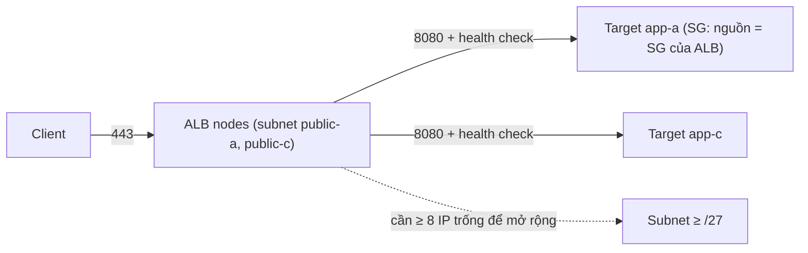

---
tags:
  - Must
  - AWS
  - ELB
  - ALB
  - NLB
  - Troubleshooting
---

# ALB, NLB và GWLB trên AWS đặt ở đâu, cần bao nhiêu IP, và vì sao health check hay fail?

## Metadata

```yaml
Chapter: elb-alb-nlb-gwlb
Phase: 06 — aws-networking
Importance: Must
Status: draft
Prerequisites:
  - Phase 04 / 07-load-balancing-l4-vs-l7
  - Phase 06 / 03-security-group-and-nacl
Used Later:
  - Phase 08 / 04-interview-aws-networking
  - Phase 08 / 05-design-exercises
Estimated Reading: 40 phút
Estimated Practice: 40 phút
```

## 1. Story

<!-- Mức bắt buộc (Must): Đủ -->
<!-- DRAFT: người học cần viết lại bằng lời mình -->

Đội `shopnet` đặt một Application Load Balancer cho `www` vào hai subnet `public-a` và `public-c` mà họ đã chia `/28` ("cho tiết kiệm IP"). Vài tháng sau, vào đợt khuyến mãi, lưu lượng tăng, ALB cần mở rộng nhưng hai subnet **không còn địa chỉ trống**: ALB báo trạng thái `active_impaired`, người dùng thỉnh thoảng nhận **5xx hoặc timeout** dù các server phía sau hoàn toàn bình thường.

Trong cùng đợt, họ sửa network ACL của subnet app để "chặn mọi thứ trừ cổng ứng dụng" và thấy mọi target báo **unhealthy**: NACL chặn luôn gói health check và gói trả lời. Hai sự cố đều thuộc cùng một chủ đề: load balancer của AWS là **tập hợp các nút (node) có địa chỉ IP trong subnet của bạn**, nên nó phụ thuộc vào kích thước subnet, security group, NACL và cách health check hoạt động.

## 2. Objectives

<!-- Mức bắt buộc (Must): Đủ -->
<!-- DRAFT: người học cần viết lại bằng lời mình -->

Sau chapter này bạn có thể:

- Chọn ALB, NLB hay GWLB cho một nhu cầu và nêu lý do (đã học `04/07`, không học lại).
- Giải thích load balancer dùng IP trong subnet thế nào và yêu cầu kích thước subnet.
- Cấu hình security group cho load balancer và target đúng chiều (listener, health check).
- Đọc cấu hình health check và đoán vì sao target báo unhealthy.
- Chẩn đoán 502/503/504, `active_impaired`, kết nối đứt bất ngờ.

## 3. Prerequisites

<!-- Mức bắt buộc (Must): Đủ -->
<!-- DRAFT: người học cần viết lại bằng lời mình -->

> Xem lại: [load-balancing-l4-vs-l7](../phase-04-transport-app/07-load-balancing-l4-vs-l7.md), [security-group-and-nacl](03-security-group-and-nacl.md)

Cần nhớ: khác nhau L4/L7, `X-Forwarded-For`, health check, idle timeout (`04/07`, `04/02`); SG theo tham chiếu, NACL cổng tạm (`06/03`); 5 IP bị giữ và ENI do dịch vụ quản lý (`06/01`, `06/05`).

## 4. Why it exists

<!-- Mức bắt buộc (Must): Đủ -->
<!-- DRAFT: người học cần viết lại bằng lời mình -->

AWS cung cấp **Elastic Load Balancing (ELB)** gồm nhiều loại để khớp các tầng khác nhau (`04/07`): **ALB** (L7, HTTP/HTTPS), **NLB** (L4, TCP/UDP/TLS/QUIC), **GWLB** (L3, đưa lưu lượng qua thiết bị ảo). Chúng được **quản lý hoàn toàn**: AWS tự mở rộng số nút theo tải. Đổi lại, mỗi nút cần địa chỉ IP trong subnet của bạn và tương tác với security group, NACL, route table như mọi tài nguyên khác.

Nếu hiểu sai: subnet nhỏ làm ALB không mở rộng được (Story), chọn nhầm loại, SG/NACL chặn health check, hoặc cấu hình health check/timeout lệch với ứng dụng.

## 5. Mental model

<!-- Mức bắt buộc (Must): Đủ -->
<!-- DRAFT: người học cần viết lại bằng lời mình -->

Hình dung load balancer là **một chuỗi quầy lễ tân** đặt ở **mỗi AZ bạn bật**. Mỗi quầy cần **một chỗ ngồi** (IP trong subnet) và khi đông khách AWS **thêm quầy**, cần **thêm chỗ ngồi** trống. Hết chỗ → không thêm quầy được → khách chờ lâu hoặc bị từ chối. Mỗi quầy còn **gọi điện kiểm tra** từng nhân viên phía sau (health check): nếu bạn khóa đường điện thoại (NACL/SG), quầy tưởng cả nhân viên đã nghỉ.

**Tóm tắt một câu:** ALB/NLB là các nút có IP trong subnet bạn bật ở mỗi AZ; cần subnet đủ chỗ để mở rộng, SG/NACL cho phép cả lưu lượng thật lẫn health check theo cả hai chiều.

## 6. How it works

<!-- Mức bắt buộc (Must): Đủ -->
<!-- DRAFT: người học cần viết lại bằng lời mình -->

Các từ cần biết:

- **Load balancer node (nút cân bằng tải — thành phần chạy thực tế của LB, mỗi AZ bật có ít nhất một nút với IP trong subnet).**
- **Listener (bộ lắng nghe — chờ kết nối theo giao thức và cổng, áp quy tắc chuyển tới target group).**
- **Target group (nhóm đích — tập target và cấu hình health check).**
- **Scheme (kiểu — internet-facing có IP công khai, internal chỉ IP riêng).**
- **Fail open (mở khi lỗi hết — nếu mọi target đều unhealthy thì LB gửi tới tất cả thay vì từ chối).**
- **GENEVE (giao thức đóng gói mà GWLB dùng trao đổi lưu lượng với thiết bị ảo, cổng 6081).**

**Ba loại, tóm tắt theo tài liệu AWS:**

| Loại | Tầng | Giao thức listener | Điểm đáng nhớ |
|---|---|---|---|
| ALB | L7 | HTTP, HTTPS | Quy tắc listener (host/đường dẫn), WebSocket, HTTP/2; cross-zone luôn bật ở mức LB |
| NLB | L4 | TCP, UDP, TLS, QUIC | Mỗi AZ một IP; giữ IP client tùy cấu hình; cross-zone mặc định tắt |
| GWLB | L3 | Mọi gói IP, mọi cổng | Đưa lưu lượng qua thiết bị ảo (firewall, IDS) bằng GENEVE cổng 6081; điều hướng bằng route tới GWLB endpoint |

**Subnet và địa chỉ IP (theo tài liệu AWS, ALB).**

- Phải bật **ít nhất hai AZ**, mỗi subnet thuộc một AZ khác nhau; mỗi AZ bật có một nút.
- Để mở rộng được, mỗi subnet nên có CIDR **ít nhất `/27`** và **ít nhất 8 IP trống**. Những IP này để LB mở rộng/thay nút và tạo kết nối tới target. Thiếu IP, ALB có thể gặp khó khi thay nút và rơi vào trạng thái lỗi.
- Nếu subnet hết IP khi LB đang mở rộng, ALB **chạy với dung lượng không đủ**: nút cũ vẫn phục vụ nhưng nỗ lực mở rộng bị kẹt có thể gây **5xx hoặc timeout** khi mở kết nối mới. Trạng thái LB khi đó là **`active_impaired`** (đang định tuyến nhưng thiếu tài nguyên để mở rộng).
- AWS tạo các **ENI giữ chỗ** (mô tả "ENI reserved by ELB for subnet") để LB bảo trì được ngay cả khi subnet sắp hết IP (`06/05`).
- LB **internet-facing phải gắn public subnet** (có route tới IGW, `06/02`).
- Tên DNS của LB trả về **một IP mỗi AZ bật**; dùng alias Route 53 trỏ tên của bạn tới LB (`06/07`).

**Security group cho LB và target (theo tài liệu AWS).** SG của LB phải cho phép lưu lượng **hai chiều trên cả cổng listener lẫn cổng health check**; thêm listener hay đổi cổng health check thì phải xem lại SG. Mô hình chuẩn (`06/03`): SG của LB mở 80/443 từ client; SG của target chỉ cho phép cổng ứng dụng và cổng health check **từ SG của LB** (tham chiếu SG).

**NACL (theo tài liệu AWS).** NACL của subnet target phải cho phép **vào** trên cổng health check và **ra** trên cổng tạm 1024–65535; NACL của subnet chứa nút LB phải cho phép **vào** trên cổng tạm và **ra** trên cổng health check và cổng tạm. Nếu NACL của subnet backend **từ chối** mọi lưu lượng từ `0.0.0.0/0` hoặc CIDR subnet thì LB **không** health check được (Story).

**Health check của ALB (theo tài liệu AWS).** Mỗi nút kiểm tra từng target độc lập theo cấu hình của target group:

| Thiết lập | Ý nghĩa | Mặc định (kiểm tra tài liệu hiện hành) |
|---|---|---|
| Giao thức | HTTP hoặc HTTPS (GET) | HTTP |
| Cổng | Cổng kiểm tra | Cổng target nhận lưu lượng |
| Đường dẫn | URI kiểm tra | `/` |
| Timeout | Bao lâu không trả lời = thất bại | 5 giây (target instance/IP) |
| Chu kỳ | Khoảng cách giữa các lần | 30 giây (target instance/IP) |
| Ngưỡng khỏe | Số lần thành công liên tiếp để coi là khỏe | 5 |
| Ngưỡng hỏng | Số lần thất bại liên tiếp để coi là hỏng | 2 |
| Mã thành công | Mã HTTP coi là khỏe | 200 (dải 200–499 cấu hình được) |

Điểm đáng nhớ: ngay sau khi đăng ký, target phải **qua một lần health check** mới nhận lưu lượng; **mọi target unhealthy cùng lúc → LB mở hết (fail open)** và gửi tới tất cả; health check không hỗ trợ WebSocket; ứng dụng phải trả lời được yêu cầu health check (ví dụ cấu hình virtual host cho header `Host` chứa IP riêng của target). Từ đó suy ra **thời gian phát hiện target hỏng** ≈ chu kỳ × ngưỡng hỏng (với mặc định khoảng 60 giây) và **thời gian đưa target trở lại** ≈ chu kỳ × ngưỡng khỏe (khoảng 150 giây).



**Đọc sơ đồ:** nút ALB nằm trong subnet public của mỗi AZ và nói chuyện với target qua IP riêng; SG của target chỉ tin SG của ALB. Đường nét đứt nhấn mạnh phụ thuộc vào dung lượng IP của subnet. Mỗi mũi tên là chỗ một quy tắc SG/NACL có thể làm hỏng: client → ALB (SG ALB, NACL subnet ALB), ALB → target (SG target, NACL subnet target), và health check (cùng đường đó, cổng có thể khác).

**Lỗi 5xx do ALB (theo tài liệu AWS).**

| Mã | Nguyên nhân thường gặp |
|---|---|
| **502** | Nhận TCP RST khi mở kết nối tới target; nhận phản hồi bất thường (ICMP unreachable) khi mở kết nối; target đóng kết nối (RST/FIN) trong khi LB còn yêu cầu đang chờ (**kiểm tra keep-alive của target ngắn hơn idle timeout của LB**); phản hồi hỏng/header không hợp lệ; target bị gỡ khi hết thời gian deregistration delay; lỗi SSL handshake tới target |
| **503** | Target group không có target đăng ký, hoặc mọi target ở trạng thái `unused` |
| **504** | Không mở được kết nối tới target trong thời gian chờ kết nối (10 giây); đã kết nối nhưng target không trả lời trước **idle timeout**; NACL không cho target trả lời về nút LB trên cổng tạm 1024–65535; lỗi SSL handshake timeout |
| **460** | Client đóng kết nối trước idle timeout của LB |

Idle timeout mặc định của ALB là **60 giây** (có thể đổi); `client_keep_alive` mặc định 3600 giây. Quy tắc cho 502: keep-alive timeout của ứng dụng/target **phải lớn hơn** idle timeout của ALB, nếu không target đóng kết nối trước khi LB biết (`04/02`).

**NLB (liên hệ `04/02`, `04/07`).** NLB theo dõi kết nối TCP với idle timeout mặc định **350 giây** (đổi trong 60–6000), TLS 350 giây không đổi, UDP 120 giây không đổi. Với target group NLB kiểu `ip`, **preserve client IP mặc định tắt** cho TCP/TLS; khi giữ IP client thì SG của target phải cho phép IP client chứ không chỉ IP LB. Giữ IP client tắt thì có giới hạn khoảng **55.000 kết nối mỗi phút cho mỗi cặp (IP NLB, target)** trước khi tăng nguy cơ lỗi cấp phát cổng (theo tài liệu AWS về target group NLB).

**GWLB.** Hoạt động ở L3, nghe mọi gói, chuyển tới target group là các thiết bị ảo, giữ **flow stickiness** (mặc định theo 5-tuple) để một luồng luôn qua cùng một thiết bị; thiết bị và GWLB trao đổi lưu lượng bằng **GENEVE trên cổng 6081**. Triển khai qua **GWLB endpoint** (`06/04`): bạn cấu hình route để endpoint là next-hop; endpoint và server ứng dụng phải ở **subnet khác nhau**.

> Chọn L4/L7, XFF, health check ở mức khái niệm: `04/07`; TLS/chứng chỉ ở LB: `04/06`; IaC cho LB và SG: `06/12`.

<!-- verified: 2026-10-05 https://docs.aws.amazon.com/elasticloadbalancing/latest/application/application-load-balancers.html -->
<!-- verified: 2026-10-05 https://docs.aws.amazon.com/elasticloadbalancing/latest/application/load-balancer-troubleshooting.html -->
<!-- verified: 2026-10-05 https://docs.aws.amazon.com/elasticloadbalancing/latest/application/target-group-health-checks.html -->
<!-- verified: 2026-10-05 https://docs.aws.amazon.com/elasticloadbalancing/latest/network/network-load-balancers.html -->
<!-- verified: 2026-10-05 https://docs.aws.amazon.com/elasticloadbalancing/latest/network/load-balancer-target-groups.html -->
<!-- verified: 2026-10-05 https://docs.aws.amazon.com/elasticloadbalancing/latest/gateway/introduction.html -->

## 7. Key settings

<!-- Mức bắt buộc (Must): Đủ -->
<!-- DRAFT: người học cần viết lại bằng lời mình -->

| Thông số | Ý nghĩa | Nếu sai |
|---|---|---|
| Loại LB | ALB/NLB/GWLB | Sai loại → thiếu tính năng hoặc tốn kém (`04/07`) |
| Scheme + subnet | Công khai hay nội bộ, nằm ở đâu | Internet-facing gắn private subnet → không truy cập được |
| Kích thước subnet và IP trống | Chỗ để mở rộng | `/28` hoặc ít hơn 8 IP trống → `active_impaired`, 5xx (Story) |
| SG của LB | Cổng listener + health check, hai chiều | Thiếu chiều/cổng → client hoặc health check thất bại |
| SG của target | Chỉ nhận từ SG của LB | Mở `0.0.0.0/0` → bỏ qua LB |
| NACL subnet LB/target | Cổng tạm hai chiều | Thiếu → health check fail, 504 |
| Health check (đường dẫn, cổng, mã, ngưỡng) | Khi nào target khỏe | Sai → loại nhầm/giữ nhầm (`04/07`) |
| Idle timeout vs keep-alive của target | Ai đóng kết nối trước | Target đóng trước → 502 |
| Deregistration delay | Chờ kết nối kết thúc khi gỡ target | Quá ngắn → cắt giữa chừng, 502 |
| Cross-zone | Chia tải qua AZ | Tắt + số target lệch AZ → tải không đều |
| Preserve client IP (NLB) | Target thấy IP nào | Mất IP client / SG sai |
| Access logs | Ghi lại yêu cầu | Tắt → khó điều tra 5xx |

**Lệnh quan sát (chỉ đọc):**

```bash
aws elbv2 describe-load-balancers --query "LoadBalancers[].{name:LoadBalancerName,type:Type,scheme:Scheme,state:State.Code,azs:AvailabilityZones[].SubnetId}" --output table
aws elbv2 describe-target-health --target-group-arn <tg-arn> \
  --query "TargetHealthDescriptions[].{target:Target.Id,state:TargetHealth.State,reason:TargetHealth.Reason}" --output table
aws ec2 describe-subnets --subnet-ids <subnet-id> --query "Subnets[].AvailableIpAddressCount"
```

## 8. AWS mapping

<!-- Mức bắt buộc (Must): Đủ -->
<!-- DRAFT: người học cần viết lại bằng lời mình -->

| Khái niệm | AWS | CloudFormation |
|---|---|---|
| Load balancer (ALB/NLB/GWLB) | ELBv2 | `AWS::ElasticLoadBalancingV2::LoadBalancer` (`Type: application \| network \| gateway`) |
| Listener | Listener | `AWS::ElasticLoadBalancingV2::Listener` |
| Quy tắc ALB | Listener rule | `AWS::ElasticLoadBalancingV2::ListenerRule` |
| Nhóm đích + health check | Target group | `AWS::ElasticLoadBalancingV2::TargetGroup` |
| Chứng chỉ TLS | ACM | `AWS::CertificateManager::Certificate` (`04/06`) |
| Tên DNS của bạn → LB | Route 53 alias | `AWS::Route53::RecordSet` (`06/07`) |
| GWLB endpoint | VPC endpoint | `AWS::EC2::VPCEndpoint` (`GatewayLoadBalancer`, `06/04`) |

**IAM tối thiểu cho lab:** `elasticloadbalancing:CreateLoadBalancer`, `CreateTargetGroup`, `DescribeLoadBalancers`, `DescribeTargetHealth`, `DeleteLoadBalancer`, `DeleteTargetGroup`, kèm `ec2:Describe*`; tạo LB còn cần quyền tạo service-linked role nếu chưa có.

**Chi phí (cảnh báo trước khi chạy):** **ALB, NLB, GWLB tính phí theo giờ và theo đơn vị dung lượng (LCU/NLCU...)**; ALB internet-facing còn dùng địa chỉ IPv4 công khai (có thể tính phí). Một LB bỏ quên là nguồn tốn tiền kinh điển. **Kiểm tra bảng giá hiện hành** (Elastic Load Balancing pricing), không dựa vào trí nhớ.

## 9. Hands-on lab

<!-- Mức bắt buộc (Must): Đủ -->
<!-- DRAFT: người học cần viết lại bằng lời mình -->

Chi tiết ở `labs/phase-06-aws-networking/chapter-08-elb-alb-nlb-gwlb/README.md`.

- **Phần A (local):** tính kích thước subnet tối thiểu cho ALB và ước tính thời gian phát hiện target hỏng/khỏe từ cấu hình health check.
- **Phần B (AWS sandbox, TÍNH PHÍ theo giờ, tùy chọn):** tạo một ALB **internal** không có target trong hai subnet `/27`, quan sát trạng thái, ENI giữ chỗ và `AvailableIpAddressCount`; teardown **ngay**.

**1. Predict:** ALB mới tạo trong subnet `/27` làm `AvailableIpAddressCount` giảm bao nhiêu và có ENI nào xuất hiện? Với mặc định, mất bao lâu để phát hiện target hỏng?

**2. Run / 3. Verify:** xem README lab; output thật `[CHƯA CHẠY]`.

## 10. Break it

<!-- Mức bắt buộc (Must): Đủ -->
<!-- DRAFT: người học cần viết lại bằng lời mình -->

**Lỗi 1 — subnet nhỏ (Story).**
Dự đoán: subnet `/28` chỉ còn 11 IP dùng được; tạo ALB và thêm tải làm ALB thiếu IP để mở rộng. Khi tạo ALB trong subnet nhỏ hơn khuyến nghị có thể bị từ chối hoặc chấp nhận nhưng sau đó `active_impaired` `[CHƯA KIỂM CHỨNG]` hành vi chính xác ở bước tạo.

**Lỗi 2 — NACL chặn health check.**
Dự đoán: NACL của subnet target từ chối cổng tạm chiều ra → target `unhealthy` (reason `Target.Timeout`), và nếu mọi target cùng lỗi thì ALB fail open. Phát hiện bằng `describe-target-health`. Chỉ phân tích hoặc thử trên VPC lab có instance (có thể tính phí); không áp lên hệ thống thật.

**Lỗi 3 — keep-alive target ngắn hơn idle timeout.**
Dự đoán (khái niệm): target đóng kết nối sau 5 giây rảnh trong khi ALB giữ 60 giây → ALB gửi qua kết nối đã đóng → 502 gián đoạn. Sửa: tăng keep-alive của ứng dụng lớn hơn 60 giây.

**Lỗi 4 — gỡ target nhưng deregistration quá ngắn.**
Dự đoán (khái niệm): kết nối đang xử lý bị cắt, client thấy 502.

Kết quả thật: `[CHƯA CHẠY]`.

## 11. Troubleshooting

<!-- Mức bắt buộc (Must): Đủ -->
<!-- DRAFT: người học cần viết lại bằng lời mình -->

Chuỗi kiểm tra "target unhealthy / 5xx":

| # | Kiểm tra | Cách xem |
|---|---|---|
| 1 | Reason code của target (`Target.Timeout`, `Target.ResponseCodeMismatch`, `Target.FailedHealthChecks`, `Target.NotInUse`...) | `describe-target-health` |
| 2 | Ứng dụng nghe đúng địa chỉ/cổng (không chỉ loopback)? (`04/04`) | `ss -tlnp` trên target |
| 3 | Gọi thử đường dẫn health check từ trong VPC bằng IP riêng của target | `curl http://<ip>:<port>/health` |
| 4 | SG của target cho phép nguồn = SG của LB trên cổng health check và cổng ứng dụng? | `describe-security-groups` |
| 5 | SG của LB cho phép hai chiều listener + health check? | như trên |
| 6 | NACL hai subnet (LB và target) cho cổng tạm 1024–65535 hai chiều và cổng health check? | `describe-network-acls` |
| 7 | Mã thành công khớp (mặc định 200)? Ứng dụng cần virtual host cho header `Host`? | Cấu hình target group, log ứng dụng |
| 8 | Subnet LB còn ≥ 8 IP trống, `/27` trở lên? Trạng thái LB `active_impaired`? | `describe-subnets`, `describe-load-balancers` |
| 9 | Keep-alive của target > idle timeout của LB? | Cấu hình ứng dụng/LB |

| Triệu chứng | Giả thuyết đầu tiên | Công cụ |
|---|---|---|
| `active_impaired`, 5xx/timeout khi tải tăng | Subnet LB hết IP | `AvailableIpAddressCount` |
| Mọi target unhealthy sau khi sửa NACL | NACL chặn cổng tạm/health check | `describe-network-acls` |
| 502 gián đoạn | Keep-alive target < idle timeout, hoặc deploy gỡ target | Log ALB, cấu hình |
| 503 | Không target khỏe/đăng ký | `describe-target-health` |
| 504 | Target chậm, SG/NACL, timeout | Log, metric |
| Truy cập LB từ Internet không được | LB internet-facing gắn private subnet, hoặc SG/NACL | `describe-load-balancers`, route (`06/02`) |
| Server không thấy IP client (ALB) | Dùng XFF (`04/07`) | Log ứng dụng |

Ghi kết quả thật của mục 10: `[CHƯA CHẠY]`.

## 12. Security & cost

<!-- Mức bắt buộc (Must): Đủ -->
<!-- DRAFT: người học cần viết lại bằng lời mình -->

- **Chỉ cho target nhận từ SG của LB**, không mở thẳng cho Internet; tránh bỏ qua WAF/TLS ở LB.
- **LB hướng Internet** là bề mặt tấn công: chỉ mở listener cần thiết, dùng HTTPS với chứng chỉ hợp lệ (`04/06`), cân nhắc AWS WAF cho ALB.
- **Bật access logs** (ghi vào S3) cho môi trường thật để điều tra; bảo vệ bucket log.
- **`X-Forwarded-For` chỉ đáng tin khi do hạ tầng của bạn thêm** (`04/07`, `04/08`).
- **Chi phí:** LB tính phí theo giờ và dung lượng; LB không dùng vẫn tốn tiền; chọn đúng loại, xóa LB thử. IPv4 công khai của LB internet-facing có thể có phí.
- Không dán DNS name, ARN, ID thật của LB vào tài liệu công khai.

## 13. Misconceptions

<!-- Mức bắt buộc (Must): Đủ -->
<!-- DRAFT: người học cần viết lại bằng lời mình -->

| Hiểu nhầm | Sự thật |
|---|---|
| "Load balancer là một thiết bị, không dùng IP của tôi" | Mỗi AZ bật có nút với IP trong subnet bạn |
| "Subnet `/28` đủ cho ALB" | Khuyến nghị ít nhất `/27` và ≥ 8 IP trống; thiếu → `active_impaired` |
| "ALB tự lo hết SG/NACL" | SG/NACL của bạn vẫn quyết định client và health check có tới được không |
| "Target unhealthy nghĩa là ứng dụng hỏng" | Thường là SG/NACL, cổng, đường dẫn, mã trả về |
| "Mọi target unhealthy thì không có gì được phục vụ" | LB fail open: gửi tới tất cả target |
| "502/504 là lỗi của ứng dụng" | Có thể do keep-alive/idle timeout, SG/NACL hoặc deregistration |
| "NLB và ALB có cùng idle timeout" | Khác nhau và khác loại giao thức (350/120 giây ở NLB, 60 giây mặc định ở ALB) |
| "Cứ internet-facing là được" | Phải gắn public subnet (route tới IGW) |

## 14. Interview questions

<!-- Mức bắt buộc (Must): Đủ -->
<!-- DRAFT: người học cần viết lại bằng lời mình -->

### Q1 (Junior) — Khi nào chọn ALB, NLB, GWLB?

**Gợi ý ý chính:**
- Tầng và giao thức
- Mục đích

??? success "Đáp án mẫu (tự trả lời trước khi mở)"
    ALB cho HTTP/HTTPS với định tuyến theo host/đường dẫn, WebSocket, HTTP/2, kết thúc TLS. NLB cho TCP/UDP/TLS/QUIC cần hiệu năng cao, IP ổn định theo AZ hoặc TLS passthrough. GWLB để đưa lưu lượng qua thiết bị ảo (firewall, IDS) một cách trong suốt.

### Q2 (Middle) — ALB báo `active_impaired` và có 5xx khi tải tăng. Nguyên nhân?

**Gợi ý ý chính:**
- IP trống trong subnet

??? success "Đáp án mẫu (tự trả lời trước khi mở)"
    ALB cần IP trống trong subnet của mỗi AZ để mở rộng (khuyến nghị CIDR ít nhất `/27` và ít nhất 8 IP trống). Hết IP thì ALB không mở rộng được, chạy thiếu dung lượng và có thể gây 5xx/timeout. Sửa: thêm subnet lớn hơn/trống IP hơn, giải phóng IP, và theo dõi `AvailableIpAddressCount`.

### Q3 (Middle) — Target báo unhealthy sau khi siết NACL. Giải thích và sửa.

**Gợi ý ý chính:**
- Cổng tạm, hai chiều

??? success "Đáp án mẫu (tự trả lời trước khi mở)"
    NACL là stateless: subnet target cần cho vào trên cổng health check và cho ra trên cổng tạm 1024–65535; subnet LB cần cho vào cổng tạm và ra cổng health check/cổng tạm. NACL từ chối `0.0.0.0/0` hoặc CIDR subnet làm LB không health check được. Sửa quy tắc NACL, kiểm tra bằng `describe-target-health`.

### Q4 (Middle) — Vì sao ALB thỉnh thoảng trả 502 dù ứng dụng khỏe?

**Gợi ý ý chính:**
- Ai đóng kết nối trước?

??? success "Đáp án mẫu (tự trả lời trước khi mở)"
    Thường do keep-alive của target ngắn hơn idle timeout của ALB: target đóng kết nối rảnh trong khi ALB còn dùng nó, ALB nhận RST/FIN khi có yêu cầu đang chờ và trả 502. Cũng có thể do gỡ target khi deregistration delay hết hạn. Sửa: keep-alive của ứng dụng lớn hơn idle timeout của ALB, deregistration delay đủ dài.

## 15. Exercises

<!-- Mức bắt buộc (Must): Đủ -->
<!-- DRAFT: người học cần viết lại bằng lời mình -->

1. **Thiết kế SG cho ALB.** *Deliverable:* bảng quy tắc vào/ra cho SG của ALB, web và database của `shopnet-prd` (cổng listener, health check) dùng tham chiếu SG.
2. **Ước tính IP.** *Deliverable:* ước tính số IP một subnet cần cho ALB (tối thiểu 8 trống), 2 endpoint, 3 NAT/ENI khác và đề xuất kích thước subnet (`/27` hay `/26`), kèm giả định.
3. **Tính thời gian health check.** Chu kỳ 30 giây, ngưỡng hỏng 2, ngưỡng khỏe 5. *Deliverable:* thời gian phát hiện hỏng và thời gian phục hồi tối đa; nêu cách giảm.
4. **Phân tích Story.** *Deliverable:* kế hoạch 6 bước tìm vì sao ALB `active_impaired` và vì sao target unhealthy sau khi sửa NACL, kèm lệnh.

## 16. Cheat sheet

<!-- Mức bắt buộc (Must): Đủ -->
<!-- DRAFT: người học cần viết lại bằng lời mình -->

| Mục | Nội dung |
|---|---|
| ALB subnet | ≥ 2 AZ; mỗi subnet ≥ `/27` và ≥ 8 IP trống |
| Thiếu IP | `active_impaired`, 5xx/timeout |
| SG | LB: hai chiều listener + health check; target: nguồn = SG LB |
| NACL | Cổng tạm 1024–65535 hai chiều + cổng health check |
| Health check ALB | Mặc định: HTTP, `/`, 30s, timeout 5s, hỏng 2, khỏe 5, mã 200 |
| Fail open | Mọi target unhealthy → gửi tới tất cả |
| 502/503/504 | Phản hồi hỏng/đóng đột ngột / không target khỏe / quá chậm |
| Idle | ALB 60s mặc định; NLB TCP 350s, TLS 350s, UDP 120s |

**Debug:** reason code → ứng dụng nghe → SG target/LB → NACL → health check cấu hình → IP subnet/trạng thái LB → keep-alive vs idle timeout.

## 17. Glossary terms

<!-- Mức bắt buộc (Must): Đủ -->
<!-- DRAFT: người học cần viết lại bằng lời mình -->

- Load balancer node / nút cân bằng tải / ロードバランサーノード
- Listener / bộ lắng nghe / リスナー
- Target group / nhóm đích / ターゲットグループ
- Scheme / kiểu / スキーム
- Fail open / mở khi lỗi hết / フェイルオープン
- GENEVE / GENEVE / GENEVE

## 18. Further reading

<!-- Mức bắt buộc (Must): Đủ -->
<!-- DRAFT: người học cần viết lại bằng lời mình -->

Kiểm tra ngày 2026-10-05:

- Application Load Balancers: https://docs.aws.amazon.com/elasticloadbalancing/latest/application/application-load-balancers.html
- Troubleshoot ALB: https://docs.aws.amazon.com/elasticloadbalancing/latest/application/load-balancer-troubleshooting.html
- ALB health checks: https://docs.aws.amazon.com/elasticloadbalancing/latest/application/target-group-health-checks.html
- Network Load Balancers: https://docs.aws.amazon.com/elasticloadbalancing/latest/network/network-load-balancers.html
- NLB target groups: https://docs.aws.amazon.com/elasticloadbalancing/latest/network/load-balancer-target-groups.html
- Gateway Load Balancer: https://docs.aws.amazon.com/elasticloadbalancing/latest/gateway/introduction.html
