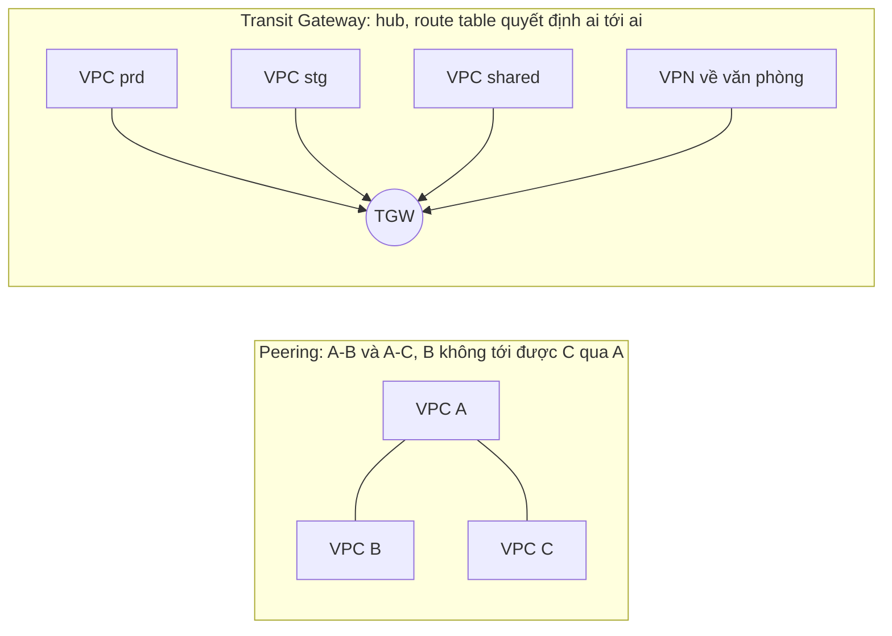

---
tags:
  - Should
  - AWS
  - VPCPeering
  - TransitGateway
  - Troubleshooting
---

# VPC peering và Transit Gateway nối nhiều VPC khác nhau thế nào, và vì sao peering không "bắc cầu" được?

## Metadata

```yaml
Chapter: vpc-peering-transit-gateway
Phase: 06 — aws-networking
Importance: Should
Status: draft
Prerequisites:
  - Phase 06 / 02-route-table-igw-nat-gateway
Used Later:
  - Phase 06 / 10-site-to-site-vpn-direct-connect
Estimated Reading: 30 phút
Estimated Practice: 25 phút
```

## 1. Story

<!-- Mức bắt buộc (Should): Đủ -->
<!-- DRAFT: người học cần viết lại bằng lời mình -->

Đội `shopnet` có ba VPC: `shared` (dịch vụ chung, có NAT gateway và VPN về văn phòng), `prd` và `stg`. Họ tạo peering `prd ↔ shared` và `stg ↔ shared`, rồi nghĩ rằng `prd` ra Internet được qua NAT của `shared`, `prd` gọi được `stg` qua `shared`, và `prd` dùng được VPN của `shared` về văn phòng. **Cả ba đều không chạy**: peering chỉ nối đúng **hai VPC với nhau**, không cho đi vòng qua VPC thứ ba. Thêm nữa, có một cặp VPC không tạo được peering vì **CIDR trùng**.

Chapter này giải thích VPC peering làm gì và **không** làm gì, và khi nào nên chuyển sang Transit Gateway (TGW), một trung tâm định tuyến nối nhiều VPC và mạng on-premise.

## 2. Objectives

<!-- Mức bắt buộc (Should): Đủ -->
<!-- DRAFT: người học cần viết lại bằng lời mình -->

Sau chapter này bạn có thể:

- Giải thích các bước để một peering thật sự chạy (yêu cầu, chấp nhận, route hai phía, SG/NACL).
- Nêu các giới hạn chính của peering: không chồng CIDR, không bắc cầu, không dùng chung IGW/NAT/VPN/DX/gateway endpoint.
- Giải thích Transit Gateway gồm những gì (attachment, route table, association, propagation).
- Chọn peering hay TGW cho một tình huống.
- Chẩn đoán lỗi: peering `active` mà không thông, một chiều, CIDR trùng.

## 3. Prerequisites

<!-- Mức bắt buộc (Should): Đủ -->
<!-- DRAFT: người học cần viết lại bằng lời mình -->

> Xem lại: [route-table-igw-nat-gateway](02-route-table-igw-nat-gateway.md)

Cần nhớ: route table, longest prefix match, route tĩnh và route lan truyền (`06/02`); CIDR không được trùng (`06/01`).

## 4. Why it exists

<!-- Mức bắt buộc (Should): Đủ -->
<!-- DRAFT: người học cần viết lại bằng lời mình -->

VPC mặc định **cô lập** với nhau. Khi hệ thống chia thành nhiều VPC (theo môi trường, tài khoản, đội), cần cách cho chúng nói chuyện bằng địa chỉ riêng mà không ra Internet. **VPC peering** là cách đơn giản nhất cho hai VPC; khi số VPC tăng và cần trung chuyển, **Transit Gateway** thay thế mạng lưới peering chằng chịt bằng một hub.

Nếu hiểu sai: kỳ vọng "bắc cầu" mà peering không hỗ trợ (Story), quên route một chiều, đặt CIDR trùng khiến không nối được, hoặc dùng TGW cho hai VPC đơn giản và tốn phí không cần thiết.

## 5. Mental model

<!-- Mức bắt buộc (Should): Đủ -->
<!-- DRAFT: người học cần viết lại bằng lời mình -->

Hình dung các VPC là **các khu công nghiệp** riêng. **Peering** là **một con đường riêng nối thẳng hai khu**: đi được giữa đúng hai khu đó, **không** được đi tiếp sang khu thứ ba qua đường này, và cũng không được mượn cổng ra quốc lộ hay đường hầm về trụ sở của khu bên kia. **Transit Gateway** là **một vòng xuyến trung tâm**: mọi khu nối vào vòng xuyến, và bảng chỉ đường của vòng xuyến quyết định khu nào được đi tới khu nào.

**Tóm tắt một câu:** peering nối hai VPC trực tiếp và không bắc cầu; Transit Gateway là hub định tuyến nối nhiều VPC/VPN/Direct Connect với route table riêng.

## 6. How it works

<!-- Mức bắt buộc (Should): Đủ -->
<!-- DRAFT: người học cần viết lại bằng lời mình -->

Các từ cần biết:

- **VPC peering connection (kết nối peering — liên kết riêng giữa hai VPC để định tuyến bằng địa chỉ riêng).**
- **Requester / Accepter (bên yêu cầu / bên chấp nhận — hai đầu của một peering).**
- **Transitive routing (định tuyến bắc cầu — A đi tới C qua B).**
- **Transit gateway (TGW — hub định tuyến cấp Region nối VPC và mạng on-premise).**
- **Attachment (điểm gắn — thứ được nối vào TGW: VPC, VPN, Direct Connect gateway, peering TGW...).**
- **Association / Propagation (gắn bảng / lan truyền route — một attachment gắn với đúng một TGW route table; nó có thể tự lan truyền route vào bảng).**

**VPC peering (theo tài liệu AWS).**

- Là kết nối **một-một giữa hai VPC**; có thể cùng hoặc khác tài khoản, cùng hoặc khác Region. Không phải gateway hay VPN, không có điểm hỏng đơn lẻ hay nghẽn băng thông.
- Quy trình: bên yêu cầu gửi yêu cầu → bên chấp nhận chấp nhận (nếu không làm gì, yêu cầu **hết hạn sau 7 ngày**) → **mỗi bên phải tự thêm route** trong route table trỏ dải CIDR của VPC kia vào peering → cập nhật **SG/NACL** nếu cần (cùng Region có thể tham chiếu SG của VPC kia, `06/03`).
- **Không được chồng CIDR**: không tạo được peering giữa hai VPC có CIDR IPv4/IPv6 trùng hoặc chồng lấn, kể cả khi bạn chỉ định dùng khối không chồng (một VPC có nhiều CIDR thì bất kỳ khối nào chồng cũng chặn).
- **Không bắc cầu**: A↔B và A↔C không cho B tới C qua A. Muốn nối B với C phải có peering B↔C riêng.
- **Không đi nhờ cổng của VPC kia (edge-to-edge)**: tài nguyên ở B không dùng được IGW, NAT, VPN, Direct Connect hay gateway endpoint (S3) của A.
- Chỉ một peering giữa hai VPC tại một thời điểm; có hạn mức số peering mỗi VPC (xem trang quota, không ghi số trong sách).
- Không truy vấn được Amazon DNS của VPC kia; để phân giải tên DNS công khai của instance thành IP riêng qua peering cần bật **DNS resolution** cho peering.
- MTU jumbo 9001 byte trong cùng Region, 8500 byte giữa Region.
- Chi phí: **không phí tạo peering**; truyền dữ liệu **trong cùng AZ miễn phí**, truyền chéo AZ hoặc Region tính phí (kiểm tra bảng giá hiện hành).

**Transit Gateway (theo tài liệu AWS).**

- Hub định tuyến nối **nhiều VPC và mạng on-premise**; các attachment gồm VPC, VPN, Direct Connect gateway, peering với TGW khác, Connect, Client VPN...
- Mỗi **attachment gắn với đúng một TGW route table**; mỗi bảng gắn với 0..n attachment. Bảng mặc định dùng nếu không chọn bảng khác.
- **Lan truyền route:** VPC, VPN, Direct Connect gateway có thể tự lan truyền route vào TGW route table; với VPC bạn phải **tạo route tĩnh trong route table của VPC** trỏ về TGW; với peering attachment phải tạo route tĩnh trong TGW route table.
- MTU 8500 byte giữa VPC/DX/peering; 1500 byte với VPN.
- Chi phí: **tính phí theo giờ mỗi attachment và theo lượng dữ liệu xử lý** (kiểm tra bảng giá hiện hành).



**Đọc sơ đồ:** bên trái, mỗi đường là một peering riêng; muốn B tới C phải thêm đường B–C, số peering tăng theo số cặp. Bên phải, mọi VPC chỉ nối vào TGW; muốn cho `prd` đi `shared` nhưng không đi `stg`, dùng **route table của TGW** (association/propagation) để cô lập, không phải thêm đường.

**Chọn peering hay TGW.** Peering cho **số ít VPC, cần băng thông cao, chi phí thấp**, không cần bắc cầu. TGW khi **nhiều VPC**, cần **trung chuyển/chia sẻ VPN hoặc Direct Connect**, cần **cô lập có kiểm soát** bằng nhiều route table. TGW tốn phí theo attachment và dữ liệu nên đừng dùng cho hai VPC đơn giản. Kế hoạch CIDR để không trùng: `06/13`.

> VPN/Direct Connect: `06/10`. Lập kế hoạch CIDR nhiều môi trường: `06/13`. Flow Logs/Reachability Analyzer để gỡ lỗi: `06/11`.

<!-- verified: 2026-10-05 https://docs.aws.amazon.com/vpc/latest/peering/what-is-vpc-peering.html -->
<!-- verified: 2026-10-05 https://docs.aws.amazon.com/vpc/latest/peering/vpc-peering-basics.html -->
<!-- verified: 2026-10-05 https://docs.aws.amazon.com/vpc/latest/tgw/what-is-transit-gateway.html -->

## 7. Key settings

<!-- Mức bắt buộc (Should): Đủ -->
<!-- DRAFT: người học cần viết lại bằng lời mình -->

| Thông số | Ý nghĩa | Nếu sai |
|---|---|---|
| CIDR hai VPC | Không được chồng | Chồng → không tạo được peering |
| Route ở **cả hai** VPC | Đường đi hai chiều | Một chiều → gói đi được nhưng không có đường về |
| SG/NACL cho dải/SG của VPC kia | Cho phép lưu lượng | Quên → timeout dù route đúng |
| DNS resolution của peering | Tên → IP riêng | Tắt → tên công khai phân giải ra IP công khai |
| Chấp nhận trong 7 ngày | Kích hoạt peering | Hết hạn → làm lại yêu cầu |
| TGW attachment (subnet theo AZ) | Điểm nối của VPC | Thiếu AZ → lưu lượng AZ đó không qua TGW `[CHƯA KIỂM CHỨNG]` chi tiết |
| TGW route table + association/propagation | Ai tới ai | Cùng bảng mặc định → mọi VPC thấy nhau |
| Route trong VPC trỏ TGW | Đưa lưu lượng vào TGW | Quên → không vào được TGW |

**Lệnh quan sát (chỉ đọc):**

```bash
aws ec2 describe-vpc-peering-connections \
  --query "VpcPeeringConnections[].{id:VpcPeeringConnectionId,status:Status.Code,req:RequesterVpcInfo.CidrBlock,acc:AccepterVpcInfo.CidrBlock}" --output table
aws ec2 describe-route-tables --filters Name=route.vpc-peering-connection-id,Values=<pcx-id> \
  --query "RouteTables[].{rt:RouteTableId,routes:Routes[?VpcPeeringConnectionId=='<pcx-id>'].DestinationCidrBlock}"
```

## 8. AWS mapping

<!-- Mức bắt buộc (Must): Tùy chọn cho chapter Should -->
<!-- DRAFT: người học cần viết lại bằng lời mình -->

| Khái niệm | AWS | CloudFormation |
|---|---|---|
| Peering | VPC peering connection | `AWS::EC2::VPCPeeringConnection` |
| Route tới peering | Route | `AWS::EC2::Route` (`VpcPeeringConnectionId`) |
| Transit gateway | Transit gateway | `AWS::EC2::TransitGateway` |
| Attachment VPC | TGW VPC attachment | `AWS::EC2::TransitGatewayAttachment` |
| Bảng route TGW | TGW route table | `AWS::EC2::TransitGatewayRouteTable` |
| Association/propagation | Association/propagation | `AWS::EC2::TransitGatewayRouteTableAssociation`, `...Propagation` |

**IAM tối thiểu cho lab:** `ec2:CreateVpcPeeringConnection`, `ec2:AcceptVpcPeeringConnection`, `ec2:DeleteVpcPeeringConnection`, `ec2:CreateRoute`, `ec2:Describe*`. TGW không thực hành trong lab này.

**Chi phí (cảnh báo):** peering không phí tạo; dữ liệu chéo AZ/Region tính phí. **TGW tính phí theo giờ mỗi attachment và theo GB xử lý**: không thực hành TGW trong lab; kiểm tra bảng giá hiện hành trước khi dùng thật.

## 9. Hands-on lab

<!-- Mức bắt buộc (Should): Rút gọn -->
<!-- DRAFT: người học cần viết lại bằng lời mình -->

Chi tiết ở `labs/phase-06-aws-networking/chapter-09-vpc-peering-transit-gateway/README.md`.

- **Phần A (local):** kiểm tra chồng CIDR và mô phỏng "không bắc cầu".
- **Phần B (AWS sandbox, không phí tạo):** tạo hai VPC không chồng CIDR, peering cùng tài khoản và cùng Region, thêm route một phía rồi hai phía, đọc route table; teardown. Không tạo instance (không chạy gói thật).

**1. Predict:** peering giữa `10.0.0.0/16` và `10.0.0.0/24` tạo được không? Peering A↔B, A↔C: B có tới C qua A không?

**2. Run / 3. Verify:** xem README lab; output thật `[CHƯA CHẠY]`.

## 10. Break it

<!-- Mức bắt buộc (Should): Rút gọn -->
<!-- DRAFT: người học cần viết lại bằng lời mình -->

**Lỗi 1 — CIDR trùng.** Dự đoán: yêu cầu peering giữa hai VPC chồng CIDR bị từ chối.

**Lỗi 2 — route một phía.** Dự đoán: chỉ thêm route ở VPC A thì gói từ A tới B có đường đi nhưng B không có route về A nên không có trả lời (khái niệm; kiểm tra bằng đọc route table, không cần instance).

**Lỗi 3 — bắc cầu.** Dự đoán: route trong B trỏ tới dải của C qua peering A↔B không làm B tới được C (không bắc cầu); chỉ phân tích bằng tài liệu.

Kết quả thật: `[CHƯA CHẠY]`.

## 11. Troubleshooting

<!-- Mức bắt buộc (Should): Rút gọn -->
<!-- DRAFT: người học cần viết lại bằng lời mình -->

| Triệu chứng | Giả thuyết đầu tiên | Kiểm tra theo thứ tự | Công cụ |
|---|---|---|---|
| Peering `active` nhưng không thông | Thiếu route hoặc SG/NACL | 1) Route ở **cả hai** VPC 2) SG/NACL cho dải/SG VPC kia 3) CIDR có chồng không | `describe-route-tables`, Reachability Analyzer (`06/11`) |
| Chỉ một chiều | Route một phía | Thêm route phía còn lại | `describe-route-tables` |
| Không tạo được peering | CIDR trùng/chồng | So CIDR (cả CIDR phụ) | `describe-vpcs` |
| VPC B không ra Internet qua NAT của A | Edge-to-edge không hỗ trợ | NAT riêng cho B hoặc TGW + thiết kế | Tài liệu |
| Tên DNS ra IP công khai thay vì riêng | Chưa bật DNS resolution peering | Bật tùy chọn | Console/CLI |
| Yêu cầu peering biến mất | `pending-acceptance` hết hạn 7 ngày | Gửi lại | `describe-vpc-peering-connections` |
| TGW: VPC này không tới được VPC kia | Association/propagation hoặc thiếu route VPC → TGW | TGW route table, route table VPC | Console/CLI |

Ghi kết quả thật của mục 10: `[CHƯA CHẠY]`.

## 12. Security & cost

<!-- Mức bắt buộc (Should): Đủ -->
<!-- DRAFT: người học cần viết lại bằng lời mình -->

- **Peering mở đường mạng giữa hai VPC:** giới hạn bằng SG (tham chiếu SG VPC kia cùng Region) và route cụ thể (chỉ subnet cần), không route cả CIDR nếu không cần.
- **Cô lập `prd`/`stg`:** TGW dùng nhiều route table để chặn `stg` tới `prd`; peering thì chỉ tạo cặp cần thiết.
- **Chi phí:** peering dữ liệu chéo AZ/Region tính phí; TGW tính phí attachment-giờ và GB; kiểm tra giá hiện hành, không dựa vào trí nhớ.
- Không dán VPC ID, account ID, CIDR thật vào tài liệu công khai.

## 13. Misconceptions

<!-- Mức bắt buộc (Should): Đủ -->
<!-- DRAFT: người học cần viết lại bằng lời mình -->

| Hiểu nhầm | Sự thật |
|---|---|
| "Peering active là thông" | Cần route hai phía và SG/NACL |
| "Peering bắc cầu được" | Không; cần peering riêng hoặc TGW |
| "VPC kia dùng được NAT/IGW/VPN của tôi qua peering" | Không (edge-to-edge) |
| "CIDR trùng vẫn peering được" | Không |
| "TGW luôn tốt hơn peering" | TGW tốn phí attachment/GB; peering rẻ hơn cho vài VPC |
| "Peering tính phí tạo" | Không; chỉ dữ liệu chéo AZ/Region |
| "Gateway endpoint S3 dùng chung qua peering" | Không |
| "Peering cần thiết bị VPN" | Không phải gateway/VPN, không phần cứng riêng |

## 14. Interview questions

<!-- Mức bắt buộc (Should): Đủ -->
<!-- DRAFT: người học cần viết lại bằng lời mình -->

### Q1 (Junior) — Peering `active` nhưng hai instance không ping được nhau. Bạn kiểm tra gì?

**Gợi ý ý chính:**
- Route hai phía
- SG/NACL

??? success "Đáp án mẫu (tự trả lời trước khi mở)"
    Route ở cả hai VPC trỏ CIDR VPC kia vào peering; SG/NACL cho phép lưu lượng từ dải/SG của VPC kia (ICMP nếu ping); CIDR không chồng; đúng subnet/route table của instance.

### Q2 (Middle) — Vì sao VPC B không dùng được NAT/VPN của VPC A dù đã peering?

**Gợi ý ý chính:**
- Transitive, edge-to-edge

??? success "Đáp án mẫu (tự trả lời trước khi mở)"
    Peering không hỗ trợ định tuyến bắc cầu và không cho đi nhờ IGW, NAT, VPN, Direct Connect hay gateway endpoint của VPC kia. Cần NAT riêng cho B hoặc dùng Transit Gateway với thiết kế phù hợp.

### Q3 (Middle) — Khi nào dùng Transit Gateway thay vì peering?

**Gợi ý ý chính:**
- Số VPC, trung chuyển, chi phí

??? success "Đáp án mẫu (tự trả lời trước khi mở)"
    Khi có nhiều VPC (số peering tăng theo số cặp), cần trung chuyển hoặc chia sẻ VPN/Direct Connect, hoặc cần cô lập có kiểm soát bằng nhiều route table. Với hai VPC đơn giản peering rẻ hơn vì TGW tính phí theo attachment-giờ và GB.

## 15. Exercises

<!-- Mức bắt buộc (Should): Đủ -->
<!-- DRAFT: người học cần viết lại bằng lời mình -->

1. **Thiết kế kết nối.** *Deliverable:* với `prd`, `stg`, `shared` và văn phòng, chọn peering/TGW cho từng cặp, kèm bảng route cần có và lý do.
2. **Phân tích Story.** *Deliverable:* kế hoạch 5 bước giải thích vì sao ba kỳ vọng không chạy và đề xuất thiết kế đúng.
3. **Kiểm tra CIDR.** Cho 4 CIDR VPC. *Deliverable:* cặp nào peering được (dùng Python ở lab) và đề xuất đánh số lại.

## 16. Cheat sheet

<!-- Mức bắt buộc (Should): Đủ -->
<!-- DRAFT: người học cần viết lại bằng lời mình -->

| Mục | Peering | Transit Gateway |
|---|---|---|
| Phạm vi | Hai VPC, một-một | Hub nhiều VPC/VPN/DX |
| CIDR | Không chồng | Cần không chồng giữa các VPC cùng định tuyến |
| Bắc cầu | Không | Có (theo route table) |
| Đi nhờ IGW/NAT/VPN | Không | Theo thiết kế |
| Route | Mỗi VPC tự thêm | Route VPC → TGW + TGW route table |
| Chi phí | Dữ liệu chéo AZ/Region | Attachment-giờ + GB |

**Debug:** trạng thái `active` → route hai phía → SG/NACL → CIDR chồng → DNS resolution → (TGW) association/propagation.

## 17. Glossary terms

<!-- Mức bắt buộc (Should): Đủ -->
<!-- DRAFT: người học cần viết lại bằng lời mình -->

- VPC peering connection / kết nối peering / VPCピアリング接続
- Transitive routing / định tuyến bắc cầu / 推移的ルーティング
- Transit gateway / cổng trung chuyển / トランジットゲートウェイ
- Attachment / điểm gắn / アタッチメント

## 18. Further reading

<!-- Mức bắt buộc (Should): Đủ -->
<!-- DRAFT: người học cần viết lại bằng lời mình -->

Kiểm tra ngày 2026-10-05:

- What is VPC peering: https://docs.aws.amazon.com/vpc/latest/peering/what-is-vpc-peering.html
- How VPC peering connections work: https://docs.aws.amazon.com/vpc/latest/peering/vpc-peering-basics.html
- What is AWS Transit Gateway: https://docs.aws.amazon.com/vpc/latest/tgw/what-is-transit-gateway.html
