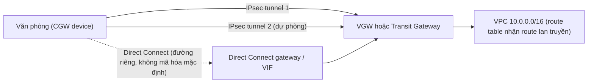

---
tags:
  - Should
  - AWS
  - VPN
  - DirectConnect
  - Hybrid
  - Troubleshooting
---

# Site-to-Site VPN và Direct Connect nối VPC với mạng văn phòng thế nào, và route nào thắng?

## Metadata

```yaml
Chapter: site-to-site-vpn-direct-connect
Phase: 06 — aws-networking
Importance: Should
Status: draft
Prerequisites:
  - Phase 05 / 04-vpn-ipsec-site-to-site
  - Phase 06 / 09-vpc-peering-transit-gateway
Used Later: []
Estimated Reading: 30 phút
Estimated Practice: 25 phút
```

## 1. Story

<!-- Mức bắt buộc (Should): Đủ -->
<!-- DRAFT: người học cần viết lại bằng lời mình -->

Đội `shopnet` nối VPC `shared` (`10.0.0.0/16`) với mạng văn phòng bằng Site-to-Site VPN. Tunnel báo `UP` nhưng văn phòng **không gọi được** server trong VPC. Nguyên nhân: văn phòng dùng dải `10.0.5.0/24`, **chồng lên** `10.0.0.0/16` của VPC (`05/04`), và route nội bộ `local` luôn thắng route lan truyền từ VPN dù route VPN cụ thể hơn. Sau khi đổi dải văn phòng, tunnel chính trục trặc và lưu lượng không chuyển sang tunnel thứ hai vì thiết bị phía văn phòng dùng **static route** và không phát hiện tunnel chết nhanh.

Chapter này đặt khái niệm VPN/IPsec (`05/04`) vào AWS: các thành phần, hai tunnel, static và BGP, thứ tự ưu tiên route, và Direct Connect (đường riêng) so với VPN (qua Internet).

## 2. Objectives

<!-- Mức bắt buộc (Should): Đủ -->
<!-- DRAFT: người học cần viết lại bằng lời mình -->

Sau chapter này bạn có thể:

- Liệt kê thành phần của một Site-to-Site VPN trên AWS (customer gateway, virtual private gateway/transit gateway, hai tunnel).
- So sánh static routing và BGP, và vì sao khuyến nghị BGP.
- Dự đoán route nào thắng khi VPN, Direct Connect và route tĩnh trùng nhau.
- So sánh VPN và Direct Connect (đường đi, mã hóa, thời gian, chi phí khái niệm).
- Chẩn đoán lỗi: tunnel up mà không thông (CIDR chồng, route, SG/NACL), failover chậm.

## 3. Prerequisites

<!-- Mức bắt buộc (Should): Đủ -->
<!-- DRAFT: người học cần viết lại bằng lời mình -->

> Xem lại: [vpn-ipsec-site-to-site](../phase-05-security/04-vpn-ipsec-site-to-site.md), [vpc-peering-transit-gateway](09-vpc-peering-transit-gateway.md)

Cần nhớ: IPsec, tunnel, IKE, SA, NAT-T, CIDR chồng, MTU (`05/04`); route table, route tĩnh/lan truyền (`06/02`); Transit Gateway (`06/09`).

## 4. Why it exists

<!-- Mức bắt buộc (Should): Đủ -->
<!-- DRAFT: người học cần viết lại bằng lời mình -->

Hệ thống thật thường cần nối VPC với **mạng văn phòng/trung tâm dữ liệu**. **Site-to-Site VPN** làm việc đó nhanh (vài phút), qua Internet, có mã hóa IPsec. **Direct Connect** là **đường cáp riêng** từ mạng của bạn tới một địa điểm Direct Connect, không đi qua nhà cung cấp Internet, độ trễ ổn định hơn nhưng cần thời gian lắp đặt và chi phí cố định.

Nếu hiểu sai: CIDR chồng (Story), route sai, kỳ vọng Direct Connect mặc định có mã hóa, không dự phòng, hoặc chọn nhầm static routing khiến failover chậm.

## 5. Mental model

<!-- Mức bắt buộc (Should): Đủ -->
<!-- DRAFT: người học cần viết lại bằng lời mình -->

Hình dung hai tòa nhà cần chuyển hàng cho nhau. **VPN** là **gửi hàng qua đường quốc lộ công cộng trong thùng niêm phong**: nhanh để thiết lập, nhưng đi chung đường với mọi người nên tốc độ/độ trễ phụ thuộc quốc lộ. **Direct Connect** là **xây riêng một đường ray giữa hai tòa nhà**: ổn định, nhưng phải thi công, và hàng đi trên đường ray riêng **không tự niêm phong** nếu bạn không thêm khóa. Mỗi VPN có **hai tuyến dự phòng** (hai tunnel).

**Tóm tắt một câu:** VPN qua Internet có mã hóa, nhanh dựng, hai tunnel; Direct Connect là đường riêng không qua Internet, ổn định, mặc định không mã hóa; route tĩnh và BGP quyết định ai thắng khi trùng.

## 6. How it works

<!-- Mức bắt buộc (Should): Đủ -->
<!-- DRAFT: người học cần viết lại bằng lời mình -->

Các từ cần biết:

- **Customer gateway device (thiết bị phía khách — thiết bị/phần mềm VPN ở mạng của bạn).**
- **Customer gateway (CGW — tài nguyên AWS đại diện cho thiết bị đó, chứa IP công khai và thông tin BGP).**
- **Virtual private gateway (VGW — điểm cuối VPN phía AWS, gắn vào một VPC).**
- **BGP (Border Gateway Protocol — giao thức định tuyến động, hai bên tự quảng bá route cho nhau).**
- **ASN (Autonomous System Number — số hiệu hệ thống tự trị dùng trong BGP).**
- **Direct Connect (đường kết nối riêng — cáp từ mạng của bạn tới một địa điểm Direct Connect của AWS).**
- **Virtual interface (VIF — kênh logic trên Direct Connect: private, public hoặc transit).**
- **ECMP (Equal Cost Multipath — dùng nhiều đường cùng giá để chia tải).**

**Site-to-Site VPN (theo tài liệu AWS).**

- Gồm ba thành phần: **VGW hoặc transit gateway** (phía AWS), **customer gateway device** và **customer gateway** (phía bạn). Mỗi kết nối VPN cung cấp **hai tunnel** giữa phía AWS và customer gateway.
- Mặc định **thiết bị của bạn phải khởi tạo tunnel** (gửi lưu lượng, bắt đầu IKE); có thể cấu hình để AWS khởi tạo.
- VGW chỉ hỗ trợ IPv4; muốn IPv6 dùng transit gateway hoặc Cloud WAN. VGW có ASN phía Amazon (mặc định `64512` nếu không chỉ định, không đổi được sau khi tạo).
- **Một VGW** chọn **một tunnel** làm đường ra chính trên tất cả kết nối VPN của gateway; **ECMP** (dùng nhiều tunnel) chỉ hỗ trợ khi VPN gắn vào **transit gateway**, không hỗ trợ với VGW. Vì vậy AWS khuyến nghị cấu hình **cả hai tunnel** và cho phép định tuyến bất đối xứng.

**Static và dynamic (BGP) (theo tài liệu AWS).** Thiết bị hỗ trợ BGP → chọn dynamic: thiết bị tự quảng bá route tới VGW, bạn không khai báo route tĩnh. Thiết bị không hỗ trợ BGP → chọn static và khai báo các tiền tố mạng của bạn. **AWS khuyến nghị dùng thiết bị hỗ trợ BGP** vì BGP có kiểm tra liveness mạnh giúp **chuyển sang tunnel thứ hai** khi tunnel đầu chết; thiết bị không BGP vẫn có thể tự kiểm tra sức khỏe để hỗ trợ failover.

**Thứ tự ưu tiên route (theo tài liệu AWS).**

1. **Longest prefix match** trong route table của VPC.
2. Route **`local`** của VPC được ưu tiên nhất **ngay cả khi** route lan truyền từ VPN/Direct Connect cụ thể hơn (nên dải on-premise chồng CIDR VPC là không dùng được, Story).
3. Cùng prefix: route tĩnh (IGW, VGW, ENI, instance, peering, NAT gateway, TGW, gateway endpoint) thắng route lan truyền.
4. Trong VGW, cùng prefix: **BGP từ Direct Connect** > **route tĩnh thủ công của VPN** > **BGP từ VPN**; với nhiều VPN BGP cùng prefix thì AS PATH ngắn hơn thắng, rồi MED thấp hơn thắng.
5. **Sức khỏe tunnel** được ưu tiên trước các thuộc tính định tuyến khác.

AWS khuyến nghị **quảng bá các route BGP cụ thể** để tác động quyết định định tuyến; và chỉ tiền tố mà VGW biết (qua BGP hoặc route tĩnh) mới nhận được lưu lượng từ VPC.

**Direct Connect (theo tài liệu AWS).**

- **Connection** là cáp Ethernet quang từ router của bạn tới router Direct Connect ở một địa điểm; mạng của bạn phải **đặt cùng địa điểm**, hoặc **qua đối tác APN**, hoặc **qua nhà cung cấp dịch vụ độc lập**.
- Tạo **virtual interface**: **private** (truy cập VPC bằng IP riêng; có thể nối **Direct Connect gateway** để tới nhiều VGW qua nhiều Region/tài khoản), **public** (dịch vụ công cộng như S3) và **transit** (tới transit gateway qua Direct Connect gateway).
- Thiết bị của bạn phải hỗ trợ **BGP và xác thực MD5**; 802.1Q VLAN; BFD tùy chọn.
- Đi qua **không qua nhà cung cấp Internet**, nhưng **không tự mã hóa**: nếu cần mã hóa phải thêm giải pháp (ví dụ MACsec hoặc IPsec chạy trên Direct Connect) `[CHƯA KIỂM CHỨNG]` chi tiết các tùy chọn.
- Chi phí gồm **phí theo giờ của cổng** và **truyền dữ liệu ra** (kiểm tra bảng giá hiện hành).

| Tiêu chí | Site-to-Site VPN | Direct Connect |
|---|---|---|
| Đường đi | Qua Internet, IPsec | Cáp riêng tới địa điểm Direct Connect |
| Mã hóa | Có (IPsec) | Không mặc định |
| Thời gian dựng | Nhanh | Cần lắp đặt/đối tác |
| Độ ổn định băng thông/độ trễ | Phụ thuộc Internet | Ổn định hơn |
| Routing | Static hoặc BGP | BGP |
| Hợp với | Dự phòng, môi trường vừa, khởi đầu | Lưu lượng lớn/ổn định, yêu cầu độ trễ |



**Đọc sơ đồ:** VPN có hai tunnel tới cùng điểm cuối phía AWS để chịu lỗi; Direct Connect là đường riêng thứ hai (nét đứt). Cả hai kết thúc ở VGW/TGW rồi vào route table của VPC qua **route lan truyền**; khi trùng prefix, **BGP từ Direct Connect thắng VPN**, nên thường dùng Direct Connect làm đường chính và VPN làm dự phòng.

> Cổng, NAT, VPN ở mức khái niệm: `05/04`. Hub TGW: `06/09`. DNS lai: `06/07`. Gỡ lỗi: `06/11`.

<!-- verified: 2026-10-05 https://docs.aws.amazon.com/vpn/latest/s2svpn/how_it_works.html -->
<!-- verified: 2026-10-05 https://docs.aws.amazon.com/vpn/latest/s2svpn/vpn-static-dynamic.html -->
<!-- verified: 2026-10-05 https://docs.aws.amazon.com/vpn/latest/s2svpn/vpn-route-priority.html -->
<!-- verified: 2026-10-05 https://docs.aws.amazon.com/directconnect/latest/UserGuide/Welcome.html -->

## 7. Key settings

<!-- Mức bắt buộc (Should): Đủ -->
<!-- DRAFT: người học cần viết lại bằng lời mình -->

| Thông số | Ý nghĩa | Nếu sai |
|---|---|---|
| CIDR hai phía | Không chồng | Chồng → không dùng được (route `local` thắng) |
| Static hay BGP | Cách học route | Static + failover kém → chậm chuyển tunnel |
| Cấu hình cả hai tunnel | Dự phòng | Chỉ một tunnel → mất kết nối khi AWS bảo trì/đổi tunnel |
| Route lan truyền hay route tĩnh trong route table | Đưa lưu lượng vào VGW | Quên → không có đường |
| Customer gateway (IP công khai, ASN) | Đại diện thiết bị | IP/ASN sai → tunnel không lên |
| VGW hay TGW | VGW chỉ IPv4, không ECMP | Cần IPv6/ECMP → dùng TGW |
| Ai khởi tạo tunnel | Thiết bị bạn mặc định | Không có lưu lượng → tunnel không lên |
| MTU/MSS | Hao đóng gói (`05/04`, `03/04`) | Gói lớn mất |
| SG/NACL cho dải on-premise | Cho phép lưu lượng | Quên → timeout dù tunnel `UP` |
| Direct Connect VIF + BGP | Đường riêng | BGP/VLAN sai → VIF down |

**Lệnh quan sát (chỉ đọc):**

```bash
aws ec2 describe-vpn-connections \
  --query "VpnConnections[].{id:VpnConnectionId,state:State,routing:Options.StaticRoutesOnly,tunnels:VgwTelemetry[].[OutsideIpAddress,Status]}"
aws ec2 describe-route-tables --route-table-ids <rt-id> \
  --query "RouteTables[].Routes[].[DestinationCidrBlock,GatewayId,Origin]" --output table
```

Cột `Origin` phân biệt `CreateRoute` (tĩnh) với `EnableVgwRoutePropagation` (lan truyền).

## 8. AWS mapping

<!-- Mức bắt buộc (Must): Tùy chọn cho chapter Should -->
<!-- DRAFT: người học cần viết lại bằng lời mình -->

| Khái niệm | AWS | CloudFormation |
|---|---|---|
| Customer gateway | Customer gateway | `AWS::EC2::CustomerGateway` |
| Virtual private gateway | VGW | `AWS::EC2::VPNGateway` + `AWS::EC2::VPCGatewayAttachment` |
| Kết nối VPN | VPN connection | `AWS::EC2::VPNConnection` |
| Route lan truyền | Route propagation | `AWS::EC2::VPNGatewayRoutePropagation` |
| Route tĩnh VPN | VPN static route | `AWS::EC2::VPNConnectionRoute` |
| VPN trên TGW | TGW VPN attachment | `AWS::EC2::VPNConnection` với `TransitGatewayId` |
| Direct Connect | Connection / VIF / gateway | Không có đủ trong CloudFormation `[CHƯA KIỂM CHỨNG]`; xem tài liệu hiện hành |

**IAM tối thiểu cho lab:** `ec2:CreateCustomerGateway`, `ec2:CreateVpnGateway`, `ec2:AttachVpnGateway`, `ec2:Describe*` và quyền xóa tương ứng; **không** `ec2:CreateVpnConnection` trong lab này.

**Chi phí (cảnh báo trước khi chạy):** **VPN connection tính phí theo giờ** (và truyền dữ liệu); **Direct Connect tính phí cổng theo giờ và dữ liệu ra**; VPN gắn vào TGW còn tính phí attachment và dữ liệu xử lý. **Kiểm tra bảng giá hiện hành**; không tạo VPN connection hay Direct Connect trong lab.

## 9. Hands-on lab

<!-- Mức bắt buộc (Should): Rút gọn -->
<!-- DRAFT: người học cần viết lại bằng lời mình -->

Chi tiết ở `labs/phase-06-aws-networking/chapter-10-site-to-site-vpn-direct-connect/README.md`.

- **Phần A (local):** mô phỏng chọn route (local thắng route lan truyền chồng CIDR; Direct Connect BGP > static VPN > BGP VPN).
- **Phần B (AWS sandbox, không tạo VPN connection):** tạo customer gateway (IP tài liệu `203.0.113.x`) và virtual private gateway; bật route propagation; đọc; teardown. Kiểm tra giá hiện hành của hai tài nguyên này trước khi chạy `[CHƯA KIỂM CHỨNG]`.

**1. Predict:** route `10.0.5.0/24` lan truyền từ VPN có thắng route `local` `10.0.0.0/16` không? Cùng prefix, route nào thắng giữa BGP Direct Connect, static VPN, BGP VPN?

**2. Run / 3. Verify:** xem README lab; output thật `[CHƯA CHẠY]`.

## 10. Break it

<!-- Mức bắt buộc (Should): Rút gọn -->
<!-- DRAFT: người học cần viết lại bằng lời mình -->

**Lỗi 1 — CIDR chồng (Story).** Dự đoán: route VPN cho `10.0.5.0/24` nằm trong `10.0.0.0/16` của VPC không được dùng vì `local` luôn thắng.

**Lỗi 2 — thiếu route trong route table.** Dự đoán: VGW đã gắn nhưng không bật propagation và không thêm route tĩnh thì VPC không có đường tới dải on-premise.

**Lỗi 3 — chỉ cấu hình một tunnel (khái niệm).** Dự đoán: khi AWS bảo trì/đổi tunnel, kết nối mất nếu thiết bị chỉ dùng tunnel kia; phân tích, không thử.

Kết quả thật: `[CHƯA CHẠY]`.

## 11. Troubleshooting

<!-- Mức bắt buộc (Should): Rút gọn -->
<!-- DRAFT: người học cần viết lại bằng lời mình -->

| Triệu chứng | Giả thuyết đầu tiên | Kiểm tra theo thứ tự | Công cụ |
|---|---|---|---|
| Tunnel `UP` nhưng không thông | CIDR chồng, thiếu route, SG/NACL | 1) CIDR hai phía 2) Route table có route tới VGW/TGW 3) SG/NACL cho dải on-premise 4) Route trên thiết bị phía bạn | `describe-route-tables`, Flow Logs (`06/11`) |
| Tunnel `DOWN` | IKE/IPsec lệch, thiết bị không khởi tạo | 1) CGW IP/ASN 2) Thông số IKE/IPsec 3) Có lưu lượng khởi tạo không (hoặc để AWS khởi tạo) | `describe-vpn-connections` (telemetry), log thiết bị |
| Failover chậm | Static routing, thiết bị không phát hiện tunnel chết | Chuyển BGP; bật health check thiết bị | Cấu hình, telemetry |
| Chỉ dùng một tunnel | VGW chọn một tunnel; không ECMP | Dùng TGW + ECMP nếu cần chia tải | Tài liệu |
| Gói lớn mất | MTU/MSS do đóng gói | `ping -M do -s` (`03/04`), giảm MTU/MSS | `ping` |
| Route sai thắng | Ưu tiên route (static > propagated; DX BGP > VPN) | Đọc `Origin` của route | `describe-route-tables` |
| Direct Connect VIF down | Layer 2/BGP/VLAN | Kiểm tra từng tầng | Tài liệu DX |

Ghi kết quả thật của mục 10: `[CHƯA CHẠY]`.

## 12. Security & cost

<!-- Mức bắt buộc (Should): Đủ -->
<!-- DRAFT: người học cần viết lại bằng lời mình -->

- **VPN mã hóa IPsec, Direct Connect không mặc định:** dữ liệu nhạy cảm qua Direct Connect cần thêm mã hóa.
- **Giới hạn route:** chỉ quảng bá/chấp nhận tiền tố cần thiết; route quá rộng mở đường cho lưu lượng không mong muốn.
- **SG/NACL vẫn áp dụng** cho lưu lượng từ on-premise (`06/03`).
- **PSK/khóa:** không dán vào repo hay chat; lưu ở nơi an toàn.
- **Chi phí:** VPN theo giờ; Direct Connect cổng theo giờ + dữ liệu; TGW attachment + GB. Kiểm tra giá hiện hành, xóa tài nguyên thử.
- Không dán IP công khai thật của thiết bị, CIDR văn phòng thật vào tài liệu công khai.

## 13. Misconceptions

<!-- Mức bắt buộc (Should): Đủ -->
<!-- DRAFT: người học cần viết lại bằng lời mình -->

| Hiểu nhầm | Sự thật |
|---|---|
| "Tunnel UP là thông" | Cần route, SG/NACL và CIDR không chồng |
| "Route VPN cụ thể hơn thì thắng route local" | Route `local` luôn thắng route lan truyền chồng |
| "VPN dùng cả hai tunnel cùng lúc" | VGW chọn một tunnel; ECMP chỉ với TGW |
| "Direct Connect tự mã hóa" | Không mặc định |
| "Static route đủ như BGP" | BGP có liveness check tốt hơn cho failover |
| "VPN luôn rẻ hơn Direct Connect" | Phụ thuộc lưu lượng và thời gian; Direct Connect có chi phí cố định |
| "Direct Connect không cần BGP" | Thiết bị phải hỗ trợ BGP và MD5 |
| "Một tunnel là đủ" | Nên cấu hình cả hai để chịu lỗi |

## 14. Interview questions

<!-- Mức bắt buộc (Should): Đủ -->
<!-- DRAFT: người học cần viết lại bằng lời mình -->

### Q1 (Junior) — Một Site-to-Site VPN trên AWS gồm những gì?

**Gợi ý ý chính:**
- Hai phía, hai tunnel

??? success "Đáp án mẫu (tự trả lời trước khi mở)"
    Customer gateway device và customer gateway ở phía bạn, virtual private gateway hoặc transit gateway ở phía AWS, và hai tunnel IPsec giữa hai phía để dự phòng.

### Q2 (Middle) — Tunnel `UP` nhưng văn phòng không gọi được VPC. Bạn kiểm tra gì?

**Gợi ý ý chính:**
- CIDR, route, SG/NACL

??? success "Đáp án mẫu (tự trả lời trước khi mở)"
    CIDR hai phía có chồng không (route `local` thắng); route table của VPC có route tới VGW/TGW (lan truyền hoặc tĩnh); SG/NACL cho dải on-premise; route trên thiết bị phía văn phòng; MTU/MSS. Dùng Flow Logs/Reachability Analyzer.

### Q3 (Middle) — Vì sao khuyến nghị BGP thay vì static route cho VPN?

**Gợi ý ý chính:**
- Failover

??? success "Đáp án mẫu (tự trả lời trước khi mở)"
    BGP có kiểm tra liveness mạnh giúp chuyển sang tunnel thứ hai khi tunnel đầu chết và tự trao đổi route. Static route đòi bạn khai báo tiền tố và thiết bị phải tự kiểm tra sức khỏe để failover.

### Q4 (Middle) — So sánh VPN và Direct Connect và khi nào dùng cả hai.

**Gợi ý ý chính:**
- Đường đi, mã hóa, thời gian, độ ổn định

??? success "Đáp án mẫu (tự trả lời trước khi mở)"
    VPN qua Internet, có mã hóa IPsec, dựng nhanh, hiệu năng phụ thuộc Internet. Direct Connect là đường riêng ổn định hơn, không qua Internet, mặc định không mã hóa, cần thời gian lắp đặt. Dùng Direct Connect làm đường chính và VPN làm dự phòng; khi trùng prefix, BGP từ Direct Connect được ưu tiên hơn VPN.

## 15. Exercises

<!-- Mức bắt buộc (Should): Đủ -->
<!-- DRAFT: người học cần viết lại bằng lời mình -->

1. **Thiết kế hybrid.** *Deliverable:* sơ đồ nối `shopnet-prd` (`10.0.0.0/16`) với văn phòng (`192.168.10.0/24`) bằng VPN BGP hai tunnel, kèm bảng route ở hai phía.
2. **Phân tích Story.** *Deliverable:* kế hoạch 5 bước tìm vì sao tunnel `UP` mà không thông và cách sửa CIDR; kế hoạch cải thiện failover.
3. **Ưu tiên route.** Cho 4 route cùng prefix (DX BGP, VPN BGP, VPN static, static tới peering). *Deliverable:* thứ tự ưu tiên và lý do dựa trên tài liệu.

## 16. Cheat sheet

<!-- Mức bắt buộc (Should): Đủ -->
<!-- DRAFT: người học cần viết lại bằng lời mình -->

| Mục | Nội dung |
|---|---|
| VPN gồm | CGW device + CGW + VGW/TGW; hai tunnel |
| Routing | BGP khuyến nghị; static nếu thiết bị không BGP |
| ECMP | Chỉ VPN trên TGW |
| Route `local` | Thắng route lan truyền chồng |
| Cùng prefix | DX BGP > VPN static > VPN BGP; tĩnh thắng lan truyền |
| Direct Connect | Cáp riêng, VIF (private/public/transit), BGP+MD5, không mã hóa mặc định |
| Lệnh | `describe-vpn-connections`, `describe-route-tables` |

**Debug:** trạng thái tunnel → CIDR chồng → route (lan truyền/tĩnh) → SG/NACL → thiết bị phía bạn → MTU.

## 17. Glossary terms

<!-- Mức bắt buộc (Should): Đủ -->
<!-- DRAFT: người học cần viết lại bằng lời mình -->

- Customer gateway device / thiết bị phía khách / カスタマーゲートウェイデバイス
- BGP / giao thức định tuyến biên / BGP
- ASN / số hiệu hệ thống tự trị / AS番号
- Direct Connect / đường kết nối riêng / Direct Connect
- Virtual interface / giao diện ảo / 仮想インターフェイス
- ECMP / định tuyến nhiều đường cùng giá / ECMP

## 18. Further reading

<!-- Mức bắt buộc (Should): Đủ -->
<!-- DRAFT: người học cần viết lại bằng lời mình -->

Kiểm tra ngày 2026-10-05:

- How Site-to-Site VPN works: https://docs.aws.amazon.com/vpn/latest/s2svpn/how_it_works.html
- Static and dynamic routing: https://docs.aws.amazon.com/vpn/latest/s2svpn/vpn-static-dynamic.html
- Route priority: https://docs.aws.amazon.com/vpn/latest/s2svpn/vpn-route-priority.html
- What is Direct Connect: https://docs.aws.amazon.com/directconnect/latest/UserGuide/Welcome.html
