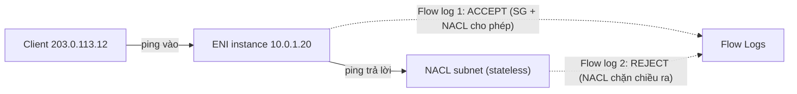

---
tags:
  - Must
  - AWS
  - FlowLogs
  - ReachabilityAnalyzer
  - Troubleshooting
---

# VPC Flow Logs và Reachability Analyzer giúp tìm "gói tin chết ở đâu" thế nào?

## Metadata

```yaml
Chapter: flow-logs-reachability-analyzer
Phase: 06 — aws-networking
Importance: Must
Status: draft
Prerequisites:
  - Phase 03 / 04-icmp-ping-traceroute
  - Phase 06 / 03-security-group-and-nacl
Used Later:
  - Phase 08 / 04-interview-aws-networking
Estimated Reading: 35 phút
Estimated Practice: 40 phút
```

## 1. Story

<!-- Mức bắt buộc (Must): Đủ -->
<!-- DRAFT: người học cần viết lại bằng lời mình -->

Sau khi siết network ACL cho subnet app, dịch vụ `shopnet-api` bắt đầu **timeout** khi gọi ra ngoài. Đội kiểm tra SG (đúng), route (đúng), ứng dụng (chạy). Mất cả buổi vẫn không biết chặn ở đâu. Cuối cùng một kỹ sư bật **VPC Flow Logs** cho ENI của server và thấy, với cùng một kết nối: một dòng **ACCEPT** cho gói đi và một dòng **REJECT** cho gói trả lời. Đó là dấu hiệu kinh điển của **NACL stateless** thiếu quy tắc chiều trả lời (`06/03`). Một công cụ khác, **Reachability Analyzer**, cho kết luận tương tự mà **không cần gửi gói tin nào**: nó phân tích cấu hình và chỉ ra thành phần chặn đường.

Chapter này dạy hai công cụ gỡ lỗi mạng chủ lực của AWS, khi nào dùng cái nào, cách đọc kết quả và các giới hạn (không phải mọi lưu lượng đều được ghi lại).

## 2. Objectives

<!-- Mức bắt buộc (Must): Đủ -->
<!-- DRAFT: người học cần viết lại bằng lời mình -->

Sau chapter này bạn có thể:

- Giải thích Flow Logs ghi lại gì (bản ghi theo luồng 5-tuple), ở đâu bật được, ghi tới đâu.
- Đọc một dòng Flow Log (các trường mặc định, `ACCEPT`/`REJECT`, `log-status`).
- Suy ra SG hay NACL chặn từ cặp bản ghi ACCEPT/REJECT.
- Dùng Reachability Analyzer để kiểm tra đường đi giữa hai tài nguyên và hiểu nó phân tích tĩnh, không gửi gói.
- Nêu các loại lưu lượng Flow Logs **không** ghi, và độ trễ của dữ liệu.
- Chọn Flow Logs, Reachability Analyzer hay bắt gói (`00/03`) cho từng tình huống.

## 3. Prerequisites

<!-- Mức bắt buộc (Must): Đủ -->
<!-- DRAFT: người học cần viết lại bằng lời mình -->

> Xem lại: [icmp-ping-traceroute](../phase-03-core-services/04-icmp-ping-traceroute.md), [security-group-and-nacl](03-security-group-and-nacl.md)

Cần nhớ: ping/traceroute và chẩn đoán theo tầng (`03/04`); SG stateful, NACL stateless, cổng tạm (`06/03`); bắt gói (`00/03`).

## 4. Why it exists

<!-- Mức bắt buộc (Must): Đủ -->
<!-- DRAFT: người học cần viết lại bằng lời mình -->

Trong mạng ảo bạn không có switch để cắm máy bắt gói, và `ping`/`traceroute` chỉ cho biết "thông hay không", không cho biết **ai chặn**. AWS cung cấp hai công cụ bù đắp: **Flow Logs** ghi lại **luồng thực tế** đã đi qua card mạng (và bị chấp nhận hay từ chối), còn **Reachability Analyzer** phân tích **cấu hình** để trả lời "với cấu hình hiện tại, A tới B được không và vì sao".

Nếu hiểu sai: bật Flow Logs rồi mong thấy mọi thứ (DNS, metadata, DHCP không được ghi), đọc `REJECT` mà không phân biệt SG/NACL, tin Reachability Analyzer cho kết luận về lỗi nằm ở hệ điều hành hay ứng dụng, hoặc tốn tiền log mà không dùng.

## 5. Mental model

<!-- Mức bắt buộc (Must): Đủ -->
<!-- DRAFT: người học cần viết lại bằng lời mình -->

Hình dung **camera an ninh và bản đồ**. **Flow Logs là camera** gắn ở cửa từng phòng (card mạng): ghi lại **ai đã đi qua** và **bảo vệ cho vào hay đuổi ra**, nhưng ghi theo từng khoảng thời gian (không phải thời gian thực) và có vài cửa phụ không gắn camera. **Reachability Analyzer là người đọc bản vẽ**: không cho ai đi thử, chỉ xem sơ đồ cửa, hành lang, khóa để nói "đi từ phòng A tới B được hay không, bị chặn ở cửa nào". Camera cho biết **chuyện đã xảy ra**; bản vẽ cho biết **chuyện sẽ xảy ra theo thiết kế**.

**Tóm tắt một câu:** Flow Logs ghi luồng thật (ACCEPT/REJECT) trễ vài phút; Reachability Analyzer phân tích cấu hình tĩnh và chỉ thành phần chặn.

## 6. How it works

<!-- Mức bắt buộc (Must): Đủ -->
<!-- DRAFT: người học cần viết lại bằng lời mình -->

Các từ cần biết:

- **VPC Flow Logs (nhật ký luồng VPC — bản ghi lưu lượng IP đi tới/đi khỏi network interface).**
- **Flow log record (bản ghi luồng — một dòng mô tả một luồng 5-tuple trong một khoảng gộp).**
- **Aggregation interval (khoảng gộp — thời gian một luồng được gom thành một bản ghi).**
- **Reachability Analyzer (công cụ phân tích khả năng liên lạc — phân tích cấu hình mạng, không gửi gói tin).**
- **Network Insights path / analysis (đường kiểm tra / lần phân tích — định nghĩa nguồn, đích, giao thức, cổng và kết quả).**

**Flow Logs (theo tài liệu AWS).**

- Ghi thông tin lưu lượng IP **tới/đi khỏi network interface** trong VPC. Có thể bật cho **VPC, subnet hoặc một ENI**, và xuất tới **CloudWatch Logs, S3 hoặc Amazon Data Firehose**.
- Thu thập **ngoài đường đi của lưu lượng** nên **không ảnh hưởng thông lượng hay độ trễ**.
- Mỗi bản ghi mô tả một **luồng 5-tuple trên mỗi ENI** trong một **khoảng gộp** (mặc định tối đa 10 phút, tùy chọn 1 phút; với ENI gắn instance Nitro luôn ≤ 1 phút). Sau đó còn cần thời gian xử lý: thông thường khoảng 5 phút tới CloudWatch Logs và khoảng 10 phút tới S3 (best effort). Vì thế **không dùng làm công cụ thời gian thực**.
- Sau khi tạo **không sửa được cấu hình hay định dạng**; muốn đổi phải xóa và tạo mới.

**Bản ghi mặc định (phiên bản 2)** gồm các trường theo thứ tự:

`version account-id interface-id srcaddr dstaddr srcport dstport protocol packets bytes start end action log-status`

Ví dụ (đã làm giả dữ liệu): `2 ACCOUNT-ID eni-aaaa1111 203.0.113.12 10.0.1.20 49152 443 6 20 4249 1750000000 1750000060 ACCEPT OK` nghĩa là TCP (protocol 6) từ `203.0.113.12:49152` tới `10.0.1.20:443`, 20 gói, 4249 byte, được chấp nhận.

- `action`: **ACCEPT** (được chấp nhận) hoặc **REJECT** (bị từ chối, ví dụ không được SG hoặc NACL cho phép, hoặc gói tới sau khi kết nối đã đóng).
- `log-status`: `OK` (bình thường), `NODATA` (không có lưu lượng trong khoảng), `SKIPDATA` (một số bản ghi bị bỏ do giới hạn dung lượng hoặc lỗi nội bộ).
- Dùng **định dạng tùy chỉnh** để thêm trường: `vpc-id`, `subnet-id`, `instance-id`, `tcp-flags` (SYN=2, SYN-ACK=18, FIN=1, RST=4; có thể cộng gộp), `pkt-srcaddr`/`pkt-dstaddr` (địa chỉ gốc ở mức gói, để phân biệt qua NAT/thiết bị trung gian), `flow-direction` (ingress/egress), `traffic-path`...

**Đọc SG hay NACL qua Flow Logs (theo tài liệu AWS).** SG là stateful nên gói trả lời của luồng được phép tự động được cho qua; NACL stateless nên gói trả lời chịu quy tắc NACL. Ví dụ ping từ máy nhà tới instance:

- SG cho phép ICMP vào (kể cả không cho ra), NACL cho phép ICMP vào nhưng **không** cho ra: Flow Logs hiển thị **ACCEPT** cho gói ping gốc và **REJECT** cho gói ping trả lời, vì NACL chặn gói trả lời.
- Nếu NACL cho phép chiều ra: hai dòng **ACCEPT**.
- Nếu **SG** từ chối ICMP vào: một dòng **REJECT** duy nhất (gói không tới được instance).

Quy tắc suy luận: **cặp ACCEPT (vào) + REJECT (ra) cho cùng một luồng → nghi NACL** (`story-seeds` #14, đã khớp với ví dụ trong tài liệu AWS); **chỉ REJECT ở chiều vào → nghi SG hoặc NACL chiều vào**.



**Đọc sơ đồ:** cùng một ping tạo hai bản ghi ở hai chiều. Chiều vào được chấp nhận; chiều ra bị NACL từ chối vì NACL không nhớ rằng đó là gói trả lời. Hai dòng đối nghịch này chính là dấu vân tay để phân biệt với trường hợp SG chặn (chỉ một dòng REJECT, vì gói không bao giờ tới instance).

**Flow Logs KHÔNG ghi (theo tài liệu AWS):** lưu lượng instance gửi tới **Amazon DNS server** (nếu dùng DNS riêng thì ghi), kích hoạt giấy phép Windows, **`169.254.169.254`** (metadata), **`169.254.169.123`** (Amazon Time Sync), **DHCP**, lưu lượng nguồn của traffic mirroring, lưu lượng tới địa chỉ dành riêng của router VPC mặc định, lưu lượng giữa ENI của endpoint và ENI của NLB, và **ARP**. Vì thế không thể dùng Flow Logs để chẩn đoán DNS tới VPC+2 hay DHCP (`06/06`).

**Lưu ý qua thiết bị trung gian.** Qua NAT gateway hay TGW, ENI trung gian (do dịch vụ quản lý) xuất hiện với `instance-id` là `-`; dùng `pkt-srcaddr`/`pkt-dstaddr` để thấy địa chỉ gốc, vì `srcaddr`/`dstaddr` có thể là IP của ENI trung gian.

**Reachability Analyzer (theo tài liệu AWS).** Là công cụ **phân tích cấu hình** giữa **nguồn** và **đích** trong VPC. Nếu đích tới được, nó trả **chi tiết từng chặng (hop-by-hop)** của đường ảo; nếu không, nó **chỉ ra thành phần chặn**, ví dụ lỗi cấu hình ở security group, network ACL, route table hay load balancer. Dùng để: gỡ lỗi do cấu hình sai, xác nhận cấu hình khớp ý định, tự động kiểm tra ý định kết nối khi cấu hình thay đổi. **Tính phí theo mỗi lần phân tích** (xem trang giá). Vì là phân tích **tĩnh**, nó **không gửi gói tin**, không biết tình trạng hệ điều hành, firewall trong máy hay ứng dụng `[CHƯA KIỂM CHỨNG]` danh sách chính xác những gì nó không xét.

**Chọn công cụ nào?**

| Tình huống | Dùng |
|---|---|
| "Cấu hình này có cho A tới B không?" trước/sau khi đổi | Reachability Analyzer |
| "Chuyện gì thực sự đã xảy ra với kết nối lúc 10:05?" | Flow Logs |
| Phân biệt SG hay NACL chặn trên lưu lượng thật | Flow Logs (cặp ACCEPT/REJECT) |
| Ứng dụng trả lời sai, TLS lỗi, nội dung gói | Bắt gói (`00/03`), log ứng dụng |
| DNS/metadata/DHCP | Không có trong Flow Logs; kiểm tra `06/06`, `dig` |

> Chẩn đoán theo tầng: `08/01`; SG/NACL: `06/03`; ALB health check: `06/08`.

<!-- verified: 2026-10-05 https://docs.aws.amazon.com/vpc/latest/userguide/flow-logs.html -->
<!-- verified: 2026-10-05 https://docs.aws.amazon.com/vpc/latest/userguide/flow-log-records.html -->
<!-- verified: 2026-10-05 https://docs.aws.amazon.com/vpc/latest/userguide/flow-logs-records-examples.html -->
<!-- verified: 2026-10-05 https://docs.aws.amazon.com/vpc/latest/userguide/flow-logs-limitations.html -->
<!-- verified: 2026-10-05 https://docs.aws.amazon.com/vpc/latest/reachability/what-is-reachability-analyzer.html -->

## 7. Key settings

<!-- Mức bắt buộc (Must): Đủ -->
<!-- DRAFT: người học cần viết lại bằng lời mình -->

| Thông số | Ý nghĩa | Nếu sai |
|---|---|---|
| Phạm vi bật (VPC/subnet/ENI) | Ghi cái gì | Quá rộng → tốn phí; quá hẹp → thiếu dữ liệu |
| Loại lưu lượng (ACCEPT/REJECT/ALL) | Ghi gì | Chỉ ACCEPT → không thấy chiều bị chặn |
| Đích (CloudWatch Logs/S3/Firehose) | Nơi lưu | Quyền IAM/bucket policy sai → không có log |
| Khoảng gộp tối đa (10 hoặc 1 phút) | Độ chi tiết thời gian | 10 phút → khó khớp với sự cố |
| Định dạng (mặc định hay tùy chỉnh) | Trường có sẵn | Mặc định thiếu `pkt-srcaddr`, `tcp-flags`... → khó phân tích qua NAT |
| IAM role/bucket policy | Quyền ghi | Lỗi `Access error` hoặc `LogDestinationNotFound` |
| Thời hạn lưu log | Lưu bao lâu | Không đặt → tốn tiền |
| Path/analysis của Reachability Analyzer | Nguồn/đích/giao thức/cổng | Sai cổng/giao thức → kết quả không phản ánh ý định |

**Lệnh quan sát (chỉ đọc):**

```bash
aws ec2 describe-flow-logs --query "FlowLogs[].{id:FlowLogId,res:ResourceId,status:FlowLogStatus,dest:LogDestinationType,filter:TrafficType,err:DeliverLogsErrorMessage}" --output table
```

Truy vấn mẫu CloudWatch Logs Insights (dạng văn bản, giả sử ENI `eni-aaaa1111`): lọc `action = "REJECT"` và thống kê theo `dstport`, rồi gom theo `srcaddr`.

## 8. AWS mapping

<!-- Mức bắt buộc (Must): Đủ -->
<!-- DRAFT: người học cần viết lại bằng lời mình -->

| Khái niệm | AWS | CloudFormation |
|---|---|---|
| Flow Logs | Flow log | `AWS::EC2::FlowLog` |
| Đích CloudWatch Logs | Log group + IAM role | `AWS::Logs::LogGroup`, `AWS::IAM::Role` |
| Đích S3 | Bucket + policy | `AWS::S3::Bucket`, `AWS::S3::BucketPolicy` |
| Reachability Analyzer | Network Insights path/analysis | `AWS::EC2::NetworkInsightsPath`, `AWS::EC2::NetworkInsightsAnalysis` |

**IAM tối thiểu cho lab:** `ec2:CreateFlowLogs`, `ec2:DescribeFlowLogs`, `ec2:DeleteFlowLogs`, `ec2:CreateNetworkInsightsPath`, `ec2:StartNetworkInsightsAnalysis`, `ec2:DescribeNetworkInsights*`, `ec2:DeleteNetworkInsights*`, cùng quyền ghi đích (log group/bucket). Role phát hành Flow Logs phải có quan hệ tin cậy với dịch vụ Flow Logs.

**Chi phí (cảnh báo trước khi chạy):** Flow Logs tính phí **thu thập và lưu trữ vended logs** (theo trang giá CloudWatch/S3); **Reachability Analyzer tính phí theo mỗi lần phân tích**. Kiểm tra bảng giá hiện hành; đặt thời hạn lưu log; xóa flow log thử.

## 9. Hands-on lab

<!-- Mức bắt buộc (Must): Đủ -->
<!-- DRAFT: người học cần viết lại bằng lời mình -->

Chi tiết ở `labs/phase-06-aws-networking/chapter-11-flow-logs-reachability-analyzer/README.md`.

- **Phần A (local, không AWS):** đọc và phân loại một tệp Flow Logs mẫu (dữ liệu giả) bằng Python: tìm cặp ACCEPT/REJECT nghi NACL.
- **Phần B (AWS sandbox, TÍNH PHÍ nhỏ theo lần phân tích, tùy chọn):** Reachability Analyzer giữa hai ENI cùng VPC, trước và sau khi thêm quy tắc SG; teardown.

**1. Predict:** trong tệp mẫu, luồng nào nghi NACL, luồng nào nghi SG? Với SG không có quy tắc vào, Reachability Analyzer báo gì?

**2. Run / 3. Verify:** xem README lab; output thật `[CHƯA CHẠY]`.

## 10. Break it

<!-- Mức bắt buộc (Must): Đủ -->
<!-- DRAFT: người học cần viết lại bằng lời mình -->

**Lỗi 1 — NACL thiếu chiều trả lời.**
Dự đoán: Flow Logs có `ACCEPT` ở chiều vào và `REJECT` ở chiều ra cho cùng cổng; Reachability Analyzer chỉ ra NACL là thành phần chặn (nếu cấu hình mô phỏng đủ). Khôi phục: thêm quy tắc chiều trả lời cổng tạm (`06/03`).

**Lỗi 2 — SG chặn chiều vào.**
Dự đoán: chỉ có `REJECT` ở chiều vào; không có bản ghi ACCEPT cho chiều ra tương ứng vì gói không tới instance.

**Lỗi 3 — chẩn đoán DNS bằng Flow Logs.**
Dự đoán: không thấy bản ghi nào cho truy vấn tới VPC+2 dù DNS lỗi; công cụ sai chỗ (`06/06`).

**Lỗi 4 — chờ Flow Logs thời gian thực.**
Dự đoán: bản ghi tới sau vài phút tới hơn 10 phút; không phù hợp để xem ngay.

Kết quả thật: `[CHƯA CHẠY]`.

## 11. Troubleshooting

<!-- Mức bắt buộc (Must): Đủ -->
<!-- DRAFT: người học cần viết lại bằng lời mình -->

| Triệu chứng | Giả thuyết đầu tiên | Kiểm tra theo thứ tự | Công cụ |
|---|---|---|---|
| Flow log `Active` nhưng không có dữ liệu | Chưa có lưu lượng, hoặc mới tạo (≥ 10 phút), hoặc lỗi quyền đích | 1) Chờ và tạo lưu lượng 2) `describe-flow-logs` xem `DeliverLogsErrorMessage` 3) IAM role/bucket policy | `describe-flow-logs` |
| `Access error` / `LogDestinationNotFoundException` | Quyền IAM hoặc bucket policy | Role tin cậy dịch vụ Flow Logs; ARN đúng | IAM, bucket policy |
| Cặp ACCEPT vào + REJECT ra | NACL thiếu chiều trả lời | Quy tắc NACL chiều ra/cổng tạm (`06/03`) | Flow Logs |
| Chỉ REJECT chiều vào | SG hoặc NACL chiều vào | SG nguồn/cổng; NACL | Flow Logs, Reachability Analyzer |
| Nhiều `SKIPDATA` | Vượt dung lượng nội bộ | Giảm phạm vi, tăng tinh chỉnh | Truy vấn `log-status` |
| Không thấy lưu lượng DNS/metadata/DHCP | Không được ghi | Dùng công cụ khác (`dig`, `06/06`) | — |
| Không phân biệt IP gốc qua NAT/TGW | Thiếu `pkt-srcaddr` | Định dạng tùy chỉnh có `pkt-*` | Tạo flow log mới |
| Reachability Analyzer báo reachable nhưng ứng dụng vẫn lỗi | Lỗi ở hệ điều hành/ứng dụng, không phải cấu hình mạng | `ss -tlnp` (`04/04`), log ứng dụng, bắt gói | `ss`, `tcpdump` |
| Hóa đơn log tăng | Phạm vi VPC rộng, lưu không giới hạn | Thu hẹp, đặt retention | Cost Explorer |

Ghi kết quả thật của mục 10: `[CHƯA CHẠY]`.

## 12. Security & cost

<!-- Mức bắt buộc (Must): Đủ -->
<!-- DRAFT: người học cần viết lại bằng lời mình -->

- **Flow Logs chứa metadata nhạy cảm** (IP nguồn/đích, cổng, thời điểm): bảo vệ bucket/log group, giới hạn quyền đọc, đặt retention.
- **Không dán log thật** (IP, ENI ID, account ID) vào tài liệu công khai; luôn làm giả như ví dụ ở chapter.
- **Bật Flow Logs ở scope hợp lý:** ENI/subnet cần điều tra; VPC rộng khi có yêu cầu tuân thủ, kèm kế hoạch chi phí.
- **Quyền IAM tối thiểu** cho role phát hành log; dùng bucket policy chặt.
- **Chi phí:** vended logs tính phí thu thập và lưu trữ; Reachability Analyzer tính theo lần phân tích. Kiểm tra giá hiện hành.
- Reachability Analyzer cho thấy cấu trúc mạng của bạn: hạn chế quyền chạy/đọc phân tích.

## 13. Misconceptions

<!-- Mức bắt buộc (Must): Đủ -->
<!-- DRAFT: người học cần viết lại bằng lời mình -->

| Hiểu nhầm | Sự thật |
|---|---|
| "Flow Logs ghi mọi gói tin" | Ghi luồng 5-tuple gộp; không ghi DNS tới VPC+2, DHCP, metadata, Time Sync, ARP... |
| "Flow Logs là thời gian thực" | Có khoảng gộp và trễ vài phút tới hơn 10 phút |
| "REJECT luôn do security group" | Có thể do SG, NACL, hoặc gói tới sau khi kết nối đã đóng |
| "Flow Logs làm chậm mạng" | Thu thập ngoài đường đi, không ảnh hưởng thông lượng/độ trễ |
| "Reachability Analyzer gửi gói thử" | Phân tích cấu hình tĩnh, không gửi gói |
| "Reachable nghĩa là ứng dụng chạy" | Không biết trạng thái hệ điều hành/ứng dụng |
| "Sửa được flow log sau khi tạo" | Phải xóa và tạo mới |
| "Flow Logs thay bắt gói" | Chỉ metadata; không có nội dung gói |

## 14. Interview questions

<!-- Mức bắt buộc (Must): Đủ -->
<!-- DRAFT: người học cần viết lại bằng lời mình -->

### Q1 (Junior) — VPC Flow Logs là gì và ghi những gì?

**Gợi ý ý chính:**
- Đơn vị bản ghi
- Ghi ở đâu

??? success "Đáp án mẫu (tự trả lời trước khi mở)"
    Nhật ký lưu lượng IP tới/đi khỏi network interface, mỗi bản ghi là một luồng 5-tuple trong một khoảng gộp, kèm số gói, byte và action ACCEPT/REJECT. Có thể bật cho VPC, subnet hoặc ENI và gửi tới CloudWatch Logs, S3 hoặc Firehose. Không ghi nội dung gói.

### Q2 (Middle) — Làm sao biết NACL hay SG đang chặn bằng Flow Logs?

**Gợi ý ý chính:**
- Hai chiều của cùng một luồng

??? success "Đáp án mẫu (tự trả lời trước khi mở)"
    SG stateful nên gói trả lời của luồng đã được phép luôn được cho qua; NACL stateless nên gói trả lời phải có quy tắc riêng. Nếu thấy ACCEPT ở chiều vào và REJECT ở chiều ra cho cùng luồng thì nghi NACL thiếu chiều trả lời. Nếu chỉ có REJECT ở chiều vào thì nghi SG hoặc NACL chiều vào (gói không tới được instance).

### Q3 (Middle) — Reachability Analyzer khác Flow Logs thế nào, khi nào dùng cái nào?

**Gợi ý ý chính:**
- Tĩnh hay thực tế?

??? success "Đáp án mẫu (tự trả lời trước khi mở)"
    Reachability Analyzer phân tích cấu hình tĩnh và cho đường đi từng chặng hoặc chỉ ra thành phần chặn, không gửi gói; dùng trước/sau khi đổi cấu hình hoặc để xác minh ý định. Flow Logs ghi lưu lượng thực tế (có độ trễ); dùng để xem chuyện gì đã xảy ra và phân biệt SG/NACL qua cặp ACCEPT/REJECT. Lỗi ở ứng dụng hay hệ điều hành thì dùng log ứng dụng và bắt gói.

### Q4 (Middle) — Vì sao Flow Logs không cho thấy truy vấn DNS lỗi của instance?

**Gợi ý ý chính:**
- Loại lưu lượng không được ghi

??? success "Đáp án mẫu (tự trả lời trước khi mở)"
    Lưu lượng instance gửi tới Amazon DNS server (VPC+2) không được Flow Logs ghi (cũng như DHCP, metadata, Time Sync). Phải kiểm tra bằng `dig`, thuộc tính DNS của VPC, DHCP option set (`06/06`), hoặc bật log truy vấn của Route 53 Resolver.

## 15. Exercises

<!-- Mức bắt buộc (Must): Đủ -->
<!-- DRAFT: người học cần viết lại bằng lời mình -->

1. **Đọc Flow Logs.** *Deliverable:* với 8 dòng log mẫu (dữ liệu giả), bảng giải thích từng dòng (hướng, luồng, hành động, nghi SG/NACL) và kết luận.
2. **Thiết kế điều tra.** *Deliverable:* kế hoạch 6 bước (lệnh/công cụ mỗi bước) chứng minh vì sao `shopnet-api` timeout sau khi siết NACL, dùng Flow Logs và Reachability Analyzer.
3. **Chọn công cụ.** *Deliverable:* bảng 6 tình huống (đổi route, nghi SG, DNS lỗi, health check ALB fail, ứng dụng trả 500, VPN không thông) chọn công cụ và lý do.
4. **Định dạng log.** *Deliverable:* danh sách trường tùy chỉnh bạn thêm vào Flow Logs để điều tra lưu lượng qua NAT gateway và vì sao.

## 16. Cheat sheet

<!-- Mức bắt buộc (Must): Đủ -->
<!-- DRAFT: người học cần viết lại bằng lời mình -->

| Mục | Nội dung |
|---|---|
| Flow Logs | Luồng 5-tuple/ENI; khoảng gộp 10 phút mặc định (Nitro ≤ 1 phút); trễ ~5–10 phút+ |
| Bản ghi mặc định | `version account-id interface-id srcaddr dstaddr srcport dstport protocol packets bytes start end action log-status` |
| ACCEPT vào + REJECT ra | Nghi NACL thiếu chiều trả lời |
| Chỉ REJECT chiều vào | SG hoặc NACL chiều vào |
| Không ghi | DNS tới VPC+2, DHCP, metadata, Time Sync, ARP, license Windows... |
| Reachability Analyzer | Tĩnh, hop-by-hop, chỉ thành phần chặn, tính phí mỗi lần |
| Sau khi tạo | Không sửa flow log; xóa và tạo mới |

**Debug:** `describe-flow-logs` có lỗi giao log không → cặp ACCEPT/REJECT → Reachability Analyzer → `pkt-*` qua NAT → bắt gói/ứng dụng nếu cấu hình đúng mà vẫn lỗi.

## 17. Glossary terms

<!-- Mức bắt buộc (Must): Đủ -->
<!-- DRAFT: người học cần viết lại bằng lời mình -->

- VPC Flow Logs / nhật ký luồng VPC / VPCフローログ
- Flow log record / bản ghi luồng / フローログレコード
- Aggregation interval / khoảng gộp / 集計間隔
- Reachability Analyzer / công cụ phân tích khả năng liên lạc / Reachability Analyzer

## 18. Further reading

<!-- Mức bắt buộc (Must): Đủ -->
<!-- DRAFT: người học cần viết lại bằng lời mình -->

Kiểm tra ngày 2026-10-05:

- VPC Flow Logs: https://docs.aws.amazon.com/vpc/latest/userguide/flow-logs.html
- Flow log records: https://docs.aws.amazon.com/vpc/latest/userguide/flow-log-records.html
- Flow log record examples: https://docs.aws.amazon.com/vpc/latest/userguide/flow-logs-records-examples.html
- Flow log limitations: https://docs.aws.amazon.com/vpc/latest/userguide/flow-logs-limitations.html
- What is Reachability Analyzer: https://docs.aws.amazon.com/vpc/latest/reachability/what-is-reachability-analyzer.html
