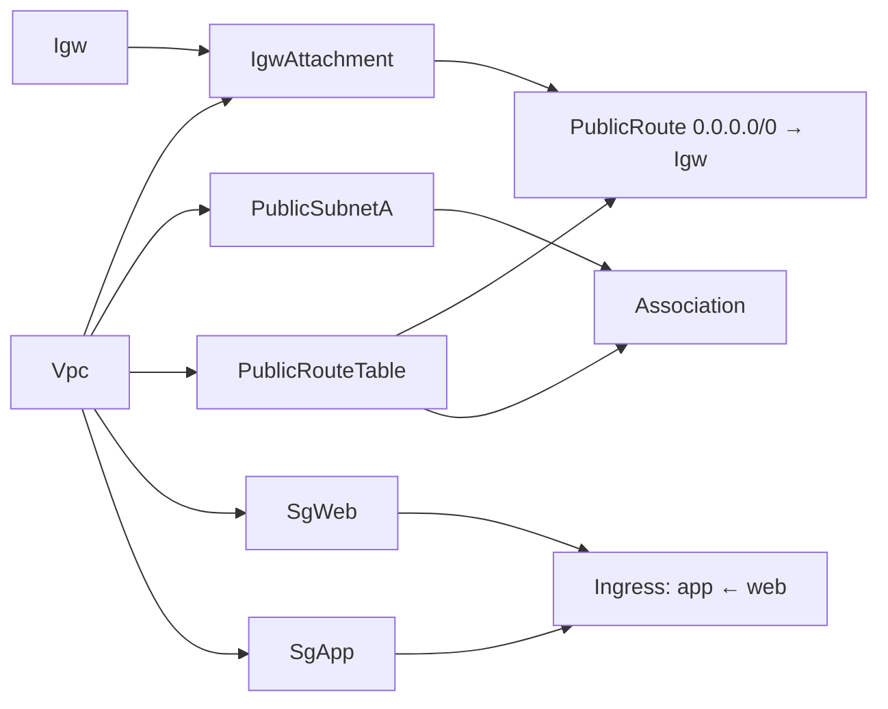

---
tags:
  - Must
  - AWS
  - CloudFormation
  - IaC
  - Troubleshooting
---

# Viết hạ tầng mạng bằng CloudFormation thế nào để đúng thứ tự, không vòng phụ thuộc và xem trước được thay đổi?

## Metadata

```yaml
Chapter: network-iac-cloudformation
Phase: 06 — aws-networking
Importance: Must
Status: draft
Prerequisites:
  - Phase 06 / 02-route-table-igw-nat-gateway
  - Phase 06 / 03-security-group-and-nacl
Used Later: []
Estimated Reading: 40 phút
Estimated Practice: 40 phút
```

## 1. Story

<!-- Mức bắt buộc (Must): Đủ -->
<!-- DRAFT: người học cần viết lại bằng lời mình -->

Đội `shopnet` dựng mạng bằng tay trên console cho `stg`, rồi phải **dựng lại y hệt cho `prd`**. Hai môi trường lệch nhau ở vài chỗ không ai nhớ: một route table thiếu route, một security group mở thừa. Họ chuyển sang CloudFormation. Lần đầu tạo stack thì gặp **lỗi vòng phụ thuộc**: `sg-web` cho phép từ `sg-app` và `sg-app` cho phép từ `sg-web`, mỗi cái tham chiếu cái kia trong thuộc tính inline nên CloudFormation không biết tạo cái nào trước. Một lần khác, khi sửa một security group, thay đổi **thay thế (replace)** tài nguyên và làm đứt kết nối vì không ai xem trước.

Chapter này dạy cách mô tả mạng AWS bằng mã (IaC: Infrastructure as Code): CloudFormation tự dựng đồ thị phụ thuộc thế nào, khi nào cần `DependsOn`, cách tránh vòng phụ thuộc giữa security group, và cách xem trước bằng **change set**.

## 2. Objectives

<!-- Mức bắt buộc (Must): Đủ -->
<!-- DRAFT: người học cần viết lại bằng lời mình -->

Sau chapter này bạn có thể:

- Mô tả một mạng VPC cơ bản (VPC, subnet, IGW, route table, route, NAT tùy chọn, SG) bằng một template CloudFormation đọc được.
- Giải thích CloudFormation tạo thứ tự thế nào (`!Ref`/`!GetAtt` tạo phụ thuộc ngầm; `DependsOn` khi nào).
- Tránh vòng phụ thuộc giữa các security group bằng resource `SecurityGroupIngress` riêng.
- Dùng change set để xem trước thay đổi (thêm/sửa/thay thế/xóa) trước khi áp dụng.
- Kiểm tra template trước khi triển khai (`validate-template`) và đặt tag/tham số để dùng cho nhiều môi trường.

## 3. Prerequisites

<!-- Mức bắt buộc (Must): Đủ -->
<!-- DRAFT: người học cần viết lại bằng lời mình -->

> Xem lại: [route-table-igw-nat-gateway](02-route-table-igw-nat-gateway.md), [security-group-and-nacl](03-security-group-and-nacl.md)

Cần nhớ: các thành phần mạng và quan hệ phụ thuộc giữa chúng (`06/01`–`06/03`): IGW phải gắn VPC trước khi route tới nó dùng được; NAT phải ở public subnet; SG tham chiếu SG.

## 4. Why it exists

<!-- Mức bắt buộc (Must): Đủ -->
<!-- DRAFT: người học cần viết lại bằng lời mình -->

Dựng mạng bằng tay: chậm, dễ sai, khó lặp lại giữa `stg` và `prd`, khó rà soát, không có lịch sử. **IaC** mô tả hạ tầng bằng tệp văn bản để **lặp lại**, **xem xét (review)**, **lưu phiên bản (Git)** và **xem trước thay đổi**. CloudFormation là dịch vụ IaC của AWS: bạn khai báo tài nguyên mong muốn, nó tự tính thứ tự tạo/sửa/xóa.

Nếu hiểu sai: vòng phụ thuộc (Story), thiếu `DependsOn` khiến route tới IGW tạo trước khi IGW gắn VPC, sửa thuộc tính gây thay thế tài nguyên ngoài ý muốn, hardcode CIDR/AZ làm template không dùng lại được.

## 5. Mental model

<!-- Mức bắt buộc (Must): Đủ -->
<!-- DRAFT: người học cần viết lại bằng lời mình -->

Hình dung **bản vẽ thi công**. Bạn không chỉ từng bước xây; bạn vẽ "tòa nhà sau khi xong trông thế nào" và **nhà thầu (CloudFormation) tự suy ra** tầng nào xây trước: móng trước, tường sau vì tường **dựa vào** móng. Mỗi lần bạn ghi "tường dựa vào móng" (`!Ref Mong`), nhà thầu hiểu thứ tự. Nếu hai bức tường **dựa vào nhau** (vòng), nhà thầu bó tay. Trước khi đập một bức tường cũ, bạn xin **biên bản thay đổi (change set)** để xem sẽ đập gì, thay gì.

**Tóm tắt một câu:** bạn khai báo trạng thái mong muốn; CloudFormation dựng đồ thị phụ thuộc từ `!Ref`/`!GetAtt`, tạo song song những gì độc lập, và change set cho xem trước trước khi áp dụng.

## 6. How it works

<!-- Mức bắt buộc (Must): Đủ -->
<!-- DRAFT: người học cần viết lại bằng lời mình -->

Các từ cần biết:

- **IaC (hạ tầng như mã — mô tả hạ tầng bằng tệp để lặp lại và kiểm soát phiên bản).**
- **Template (mẫu — tệp YAML/JSON mô tả tài nguyên).**
- **Stack (ngăn xếp — tập tài nguyên được tạo/sửa/xóa cùng nhau từ một template).**
- **Logical ID (tên logic — tên tài nguyên trong template) / Physical ID (tên vật lý — ID thực do AWS cấp).**
- **`!Ref` / `!GetAtt` (hàm tham chiếu tài nguyên hoặc thuộc tính của nó; tạo phụ thuộc ngầm).**
- **`DependsOn` (thuộc tính khai báo phụ thuộc tường minh).**
- **Change set (bộ thay đổi — bản xem trước những gì sẽ đổi khi cập nhật stack).**
- **Circular dependency (phụ thuộc vòng — A cần B mà B cần A).**

**Cách CloudFormation suy ra thứ tự (theo tài liệu AWS).**

- Trong `Resources`, mỗi tài nguyên có **logical ID** (chữ-số, duy nhất trong template) và **Type** (`AWS::EC2::VPC`...). Khi tạo, AWS cấp **physical ID** (ví dụ `vpc-...`).
- `!Ref` và `!GetAtt` (và `!Sub` có tham chiếu) tạo **phụ thuộc ngầm**: nếu A dùng `!Ref B` thì **B được tạo trước A, A được xóa trước B, B được cập nhật trước A**.
- CloudFormation tạo/sửa/xóa **song song** tới mức có thể; tài nguyên độc lập chạy cùng lúc.
- **`DependsOn`** dùng để khai báo thứ tự mà `!Ref` không biểu diễn được, ghi đè song song mặc định. Trường hợp quan trọng cho mạng: các tài nguyên cần **IGW hoặc VPN gateway** (instance có IP công khai, Elastic IP, ELB, RDS, Auto Scaling, **route tới IGW**) phải **phụ thuộc `VPCGatewayAttachment`**; nếu template khai báo VPC, IGW và attachment thì route tới IGW nên `DependsOn: IgwAttachment`. Tương tự, route propagation của VPN gateway phụ thuộc attachment.

**Vòng phụ thuộc giữa security group và cách tránh (theo tài liệu AWS).** Nếu `sg-web` và `sg-app` tham chiếu nhau bằng thuộc tính **inline** `SecurityGroupIngress`, mỗi cái cần cái kia tồn tại trước → vòng. Cách xử lý: **tách các quy tắc thành resource `AWS::EC2::SecurityGroupIngress` (hoặc `...Egress`) riêng**, mỗi cái tham chiếu `GroupId` và `SourceSecurityGroupId`; khi đó hai SG được tạo trước (không quy tắc), rồi quy tắc tạo sau. **Không trộn** thuộc tính inline `SecurityGroupIngress` với resource `SecurityGroupIngress` riêng trên cùng SG trong cùng template: tài liệu cảnh báo có thể gây xung đột và hành vi khó đoán (`story-seeds` #10 và #11).

**Change set (theo tài liệu AWS).** Khi cập nhật stack, bạn **tạo change set** từ template/tham số mới: CloudFormation **so sánh** với stack hiện tại và cho bạn xem thêm/sửa/xóa tài nguyên nào, kèm so sánh thuộc tính trước/sau, **mà chưa đổi gì**; chỉ khi **thực thi (execute)** nó mới áp dụng. Có thể tạo nhiều change set để so sánh phương án. Lưu ý: change set **không bảo đảm** cập nhật sẽ thành công, nhưng kiểm tra trước nhiều nguyên nhân hỏng phổ biến (lỗi cú pháp thuộc tính, trùng tên, hạn mức...); lỗi do điều kiện lúc chạy vẫn có thể xảy ra. Sau khi thực thi, các change set khác của stack bị xóa. Với `aws cloudformation deploy` có tùy chọn `--no-execute-changeset` để chỉ tạo change set. **Cảnh báo quan trọng khi đọc change set:** cột/chỉ báo **thay thế (Replacement)**: nếu thay đổi một thuộc tính bắt buộc **thay thế** tài nguyên (xóa cái cũ, tạo cái mới), ID đổi và kết nối đang chạy bị gián đoạn: **đọc kỹ trước khi thực thi**.



**Đọc sơ đồ:** mũi tên là "phải có trước". `Vpc` và `Igw` độc lập nên tạo song song; `IgwAttachment` cần cả hai; `PublicRoute` cần bảng route **và** `IgwAttachment` (đây là chỗ `DependsOn`). `SgWeb` và `SgApp` chỉ cần `Vpc` nên tạo song song, còn quy tắc ingress tách riêng chỉ chạy sau cả hai, nên không còn vòng.

**Tham số hóa để dùng cho nhiều môi trường.** Dùng `Parameters` (ví dụ `Env`, `VpcCidr`), `Conditions` (bật/tắt NAT, vì NAT tính phí theo giờ), `!Select`/`!GetAZs` thay cho tên AZ cố định, và hàm **`!Cidr`** để chia subnet từ CIDR VPC thay vì gõ tay. Đặt **tag** (`Project=net-handbook`, `Env`) trên mọi tài nguyên để truy vết và dọn dẹp (`CLAUDE.md` mục 3).

**Xóa stack.** Xóa theo thứ tự ngược của phụ thuộc. Chỉ chạy `delete-stack` khi bạn chủ động quyết định (lệnh phá hủy, `CLAUDE.md` mục 3); kiểm tra tài nguyên còn sót sau đó.

**Ý lab đã nêu ở roadmap (cần chứng minh bằng lab, `[CHƯA KIỂM CHỨNG]`):** thời gian CloudFormation bắt đầu tài nguyên sau khi tài nguyên chậm nhất mà nó phụ thuộc hoàn tất không được ghi vào sách vì chưa đo.

> Quy tắc SG: `06/03`. IGW/NAT/route: `06/02`. Endpoint, ENI giữ chỗ trước khi tạo endpoint: `06/04`, `06/05`.

<!-- verified: 2026-10-05 https://docs.aws.amazon.com/AWSCloudFormation/latest/UserGuide/resources-section-structure.html -->
<!-- verified: 2026-10-05 https://docs.aws.amazon.com/AWSCloudFormation/latest/TemplateReference/aws-attribute-dependson.html -->
<!-- verified: 2026-10-05 https://docs.aws.amazon.com/AWSCloudFormation/latest/TemplateReference/aws-properties-ec2-security-group-ingress.html -->
<!-- verified: 2026-10-05 https://docs.aws.amazon.com/AWSCloudFormation/latest/UserGuide/using-cfn-updating-stacks-changesets.html -->

## 7. Key settings

<!-- Mức bắt buộc (Must): Đủ -->
<!-- DRAFT: người học cần viết lại bằng lời mình -->

| Thông số | Ý nghĩa | Nếu sai |
|---|---|---|
| `!Ref`/`!GetAtt` giữa tài nguyên | Phụ thuộc ngầm | Hardcode ID → mất phụ thuộc, hỏng khi tạo mới |
| `DependsOn` cho route → IGW attachment | Đúng thứ tự mạng | Thiếu → route tạo trước attachment, lỗi |
| SG rule: resource `SecurityGroupIngress` riêng | Tránh vòng | Inline tham chiếu nhau → circular dependency |
| Trộn inline và resource riêng trên một SG | Xung đột | Hành vi khó đoán (tài liệu cảnh báo) |
| `Conditions` (ví dụ `EnableNat`) | Bật/tắt tài nguyên tính phí | NAT luôn bật → tốn phí lab |
| `!Cidr`, `!Select`, `!GetAZs` | Không hardcode CIDR/AZ | Hardcode → template khó dùng lại |
| Tag (`Project`, `Env`) | Truy vết/dọn dẹp | Thiếu → khó teardown |
| Change set trước khi cập nhật | Xem trước | Bỏ qua → thay thế tài nguyên ngoài ý muốn |
| `DeletionPolicy`/stack policy | Bảo vệ tài nguyên quan trọng | Thiếu → xóa nhầm khi xóa stack `[CHƯA KIỂM CHỨNG]` chi tiết |
| `validate-template` | Kiểm tra cú pháp | Bỏ qua → lỗi muộn |

**Lệnh quan sát (chỉ đọc, hoặc không gây thay đổi tài nguyên):**

```bash
aws cloudformation validate-template --template-body file://network.yaml
aws cloudformation describe-stacks --stack-name <stack> --query "Stacks[].{status:StackStatus,reason:StackStatusReason}"
aws cloudformation describe-stack-events --stack-name <stack> \
  --query "StackEvents[?ResourceStatus=='CREATE_FAILED'].[LogicalResourceId,ResourceStatusReason]" --output table
aws cloudformation describe-change-set --stack-name <stack> --change-set-name <cs> \
  --query "Changes[].ResourceChange.{action:Action,id:LogicalResourceId,type:ResourceType,replace:Replacement}" --output table
```

## 8. AWS mapping

<!-- Mức bắt buộc (Must): Đủ -->
<!-- DRAFT: người học cần viết lại bằng lời mình -->

Chapter này **là** phần ánh xạ sang CloudFormation cho các chapter trước. Bảng tổng hợp:

| Thành phần | Kiểu CloudFormation | Chapter |
|---|---|---|
| VPC | `AWS::EC2::VPC` | `06/01` |
| Subnet | `AWS::EC2::Subnet` | `06/01` |
| Internet gateway + attachment | `AWS::EC2::InternetGateway`, `AWS::EC2::VPCGatewayAttachment` | `06/02` |
| Route table, route, association | `AWS::EC2::RouteTable`, `AWS::EC2::Route`, `AWS::EC2::SubnetRouteTableAssociation` | `06/02` |
| NAT gateway + Elastic IP | `AWS::EC2::NatGateway`, `AWS::EC2::EIP` | `06/02` |
| Security group + quy tắc | `AWS::EC2::SecurityGroup`, `AWS::EC2::SecurityGroupIngress`/`Egress` | `06/03` |
| NACL | `AWS::EC2::NetworkAcl`, `AWS::EC2::NetworkAclEntry` | `06/03` |
| Endpoint | `AWS::EC2::VPCEndpoint` | `06/04` |
| ENI giữ chỗ IP | `AWS::EC2::NetworkInterface` | `06/05` |
| Route 53 | `AWS::Route53::HostedZone`, `AWS::Route53::RecordSet` | `06/07` |
| Load balancer | `AWS::ElasticLoadBalancingV2::*` | `06/08` |

Template ví dụ dùng cho lab nằm ở `labs/phase-06-aws-networking/chapter-12-network-iac-cloudformation/cfn/network.yaml` (tham số hóa `Env`, `VpcCidr`, `EnableNat`; NAT mặc định **tắt**).

**IAM tối thiểu cho lab:** `cloudformation:ValidateTemplate`, `cloudformation:CreateChangeSet`, `cloudformation:DescribeChangeSet`, `cloudformation:DeleteChangeSet`, `cloudformation:DescribeStacks`; để thực thi thật cần thêm `cloudformation:ExecuteChangeSet` và quyền `ec2:*` tương ứng (hoặc dùng một service role giới hạn). Không chạy `ExecuteChangeSet` nếu chưa đồng ý.

**Chi phí:** CloudFormation không tính phí cho tài nguyên AWS chuẩn; chi phí nằm ở tài nguyên được tạo. Template mặc định **không tạo NAT gateway** (tính phí theo giờ và theo GB); bật `EnableNat=true` chỉ khi đã kiểm tra giá hiện hành và sẽ xóa ngay.

## 9. Hands-on lab

<!-- Mức bắt buộc (Must): Đủ -->
<!-- DRAFT: người học cần viết lại bằng lời mình -->

Chi tiết ở `labs/phase-06-aws-networking/chapter-12-network-iac-cloudformation/README.md`.

- **Phần A (local):** vẽ đồ thị phụ thuộc từ template bằng Python (đọc `Ref`/`GetAtt`/`DependsOn`) và phát hiện vòng.
- **Phần B (AWS, không tạo tài nguyên):** `validate-template`, tạo **change set kiểu CREATE** (stack ở trạng thái `REVIEW_IN_PROGRESS`, chưa tạo tài nguyên), đọc change set, rồi **xóa change set và stack**; không `execute`.
- **Phần C (tùy chọn, có thao tác thật, sandbox):** thực thi change set với `EnableNat=false` (VPC, subnet, IGW, route, SG: không tính phí riêng), cập nhật bằng change set để thấy `Replacement`, rồi teardown. Chỉ làm khi đã đồng ý và có budget alert.

**1. Predict:** thứ tự tạo của `PublicRoute` so với `IgwAttachment`? Nếu inline hai SG tham chiếu nhau thì lỗi gì? Đổi `CidrBlock` của một Subnet cho change set thấy hành động gì?

**2. Run / 3. Verify:** xem README lab; output thật `[CHƯA CHẠY]`.

## 10. Break it

<!-- Mức bắt buộc (Must): Đủ -->
<!-- DRAFT: người học cần viết lại bằng lời mình -->

**Lỗi 1 — vòng phụ thuộc giữa SG.**
Dự đoán: hai SG inline `SecurityGroupIngress` tham chiếu nhau bằng `!Ref` → `validate-template` có thể vẫn qua nhưng tạo stack/change set báo **circular dependency**; sửa bằng tách thành resource `SecurityGroupIngress` riêng (`06/03`). `[CHƯA CHẠY]` — thông báo chính xác ghi lại khi chạy.

**Lỗi 2 — route tới IGW thiếu `DependsOn`.**
Dự đoán: bỏ `DependsOn: IgwAttachment` ở `PublicRoute` có thể làm route tạo khi IGW chưa gắn VPC và thất bại hoặc chập chờn (tài liệu AWS nêu route tới IGW cần phụ thuộc attachment). Thử trong sandbox rồi khôi phục.

**Lỗi 3 — thay đổi gây thay thế.**
Dự đoán: đổi `CidrBlock` của Subnet làm change set cho `Replacement: True` (xóa và tạo lại subnet, ID đổi); tài nguyên phụ thuộc cũng bị cập nhật. Không thực thi nếu có tài nguyên dùng subnet đó.

**Lỗi 4 — hardcode AZ/CIDR.**
Dự đoán (khái niệm): template ghi cứng `ap-northeast-1a` và `10.0.0.0/24` không dùng lại được ở môi trường khác (đụng CIDR, AZ không tồn tại).

Kết quả thật: `[CHƯA CHẠY]`.

## 11. Troubleshooting

<!-- Mức bắt buộc (Must): Đủ -->
<!-- DRAFT: người học cần viết lại bằng lời mình -->

| Triệu chứng | Giả thuyết đầu tiên | Kiểm tra theo thứ tự | Công cụ |
|---|---|---|---|
| `Circular dependency between resources` | Hai tài nguyên tham chiếu nhau (thường SG) | 1) Tìm cặp `!Ref` hai chiều 2) Tách SG rule ra resource riêng | Đọc template, Phần A lab |
| `CREATE_FAILED` ở route/EIP/instance công khai | Thiếu phụ thuộc VPC-gateway attachment | Thêm `DependsOn` tới `VPCGatewayAttachment` | `describe-stack-events` |
| Cập nhật làm đứt kết nối | Thay đổi gây `Replacement` | Xem change set trước, cột Replacement | `describe-change-set` |
| `UPDATE_ROLLBACK_*` | Cập nhật lỗi giữa chừng | Đọc event lỗi đầu tiên, sửa nguyên nhân | `describe-stack-events` |
| Hóa đơn tăng ngoài dự kiến | NAT/endpoint bật theo điều kiện/tham số | Tham số `EnableNat`, tài nguyên stack | `describe-stack-resources` |
| Xóa stack lỗi (`DELETE_FAILED`) | Tài nguyên còn phụ thuộc bên ngoài (ENI, SG đang dùng) | Tìm tài nguyên giữ; xóa phụ thuộc ngoài | `describe-stack-events`, `describe-network-interfaces` |
| Trộn SG inline + resource riêng gây lệch | Xung đột hai cách khai báo | Chọn một cách; xem change set | change set |

Ghi kết quả thật của mục 10: `[CHƯA CHẠY]`.

## 12. Security & cost

<!-- Mức bắt buộc (Must): Đủ -->
<!-- DRAFT: người học cần viết lại bằng lời mình -->

- **Template là thứ được review:** SG/NACL/route trong mã dễ rà soát hơn console; dùng pull request, lint và quét bí mật.
- **Không đưa bí mật vào template/tham số:** dùng dynamic reference tới Secrets Manager/SSM thay vì ghi mật khẩu (`CLAUDE.md` mục 4).
- **Quyền thực thi:** dùng service role/giới hạn IAM; không dùng quyền quản trị cho việc deploy hằng ngày.
- **Xem change set trước khi execute**, đặc biệt `Replacement`/`Delete`.
- **Ngăn xóa nhầm** tài nguyên quan trọng (stack termination protection, `DeletionPolicy`) `[CHƯA KIỂM CHỨNG]` chi tiết.
- **Chi phí:** NAT gateway, endpoint, LB trong template tính phí; dùng `Conditions` để tắt mặc định ở môi trường thử; kiểm tra giá hiện hành.
- Không dán template thật có ID/account/CIDR nội bộ vào repo công khai; chỉ dùng dữ liệu giả.

## 13. Misconceptions

<!-- Mức bắt buộc (Must): Đủ -->
<!-- DRAFT: người học cần viết lại bằng lời mình -->

| Hiểu nhầm | Sự thật |
|---|---|
| "Template chạy từ trên xuống" | CloudFormation tự suy ra thứ tự từ phụ thuộc và tạo song song |
| "`DependsOn` luôn cần" | Phụ thuộc ngầm từ `!Ref`/`!GetAtt` đa số đủ; `DependsOn` cho thứ tự không biểu diễn được |
| "SG inline luôn tiện hơn" | Hai SG tham chiếu nhau bằng inline gây vòng; dùng resource riêng |
| "Có thể trộn inline và resource rule trên một SG" | Tài liệu cảnh báo không nên |
| "Change set đảm bảo cập nhật thành công" | Không đảm bảo; kiểm tra nhiều lỗi nhưng lỗi runtime vẫn có |
| "Cập nhật stack luôn an toàn" | Một số thay đổi thay thế tài nguyên; đọc `Replacement` |
| "Xóa stack luôn sạch" | Có thể kẹt do tài nguyên phụ thuộc bên ngoài |
| "IaC thay thế hiểu mạng" | Mã sai vẫn là mạng sai; vẫn cần hiểu `06/01`–`06/11` |

## 14. Interview questions

<!-- Mức bắt buộc (Must): Đủ -->
<!-- DRAFT: người học cần viết lại bằng lời mình -->

### Q1 (Junior) — CloudFormation quyết định thứ tự tạo tài nguyên thế nào?

**Gợi ý ý chính:**
- Phụ thuộc ngầm
- Song song

??? success "Đáp án mẫu (tự trả lời trước khi mở)"
    Từ `!Ref`/`!GetAtt`: nếu A tham chiếu B thì B tạo trước A, xóa sau A. Tài nguyên độc lập được tạo song song. `DependsOn` bổ sung thứ tự khi `!Ref` không biểu diễn được, ví dụ route tới IGW phụ thuộc VPC-gateway attachment.

### Q2 (Middle) — Hai security group tham chiếu nhau gây lỗi gì trong CloudFormation và sửa sao?

**Gợi ý ý chính:**
- Inline vs resource riêng

??? success "Đáp án mẫu (tự trả lời trước khi mở)"
    Lỗi phụ thuộc vòng: mỗi SG cần cái kia tồn tại trước. Sửa bằng cách tạo hai SG không quy tắc rồi khai báo các quy tắc bằng resource `AWS::EC2::SecurityGroupIngress`/`Egress` riêng, tham chiếu `GroupId` và `SourceSecurityGroupId`. Không trộn với thuộc tính inline trên cùng SG.

### Q3 (Middle) — Vì sao dùng change set trước khi cập nhật stack mạng?

**Gợi ý ý chính:**
- Replacement

??? success "Đáp án mẫu (tự trả lời trước khi mở)"
    Change set cho xem trước thay đổi mà chưa áp dụng, gồm tài nguyên nào thêm/sửa/xóa và thuộc tính trước/sau, đặc biệt các thay đổi gây thay thế (xóa và tạo lại, đổi ID, gián đoạn kết nối). Nó không bảo đảm thành công nhưng bắt được nhiều lỗi phổ biến và cho phép dừng trước khi gây sự cố.

### Q4 (Middle) — Thiết kế template mạng dùng được cho cả `stg` và `prd`.

**Gợi ý ý chính:**
- Tham số, điều kiện, tag

??? success "Đáp án mẫu (tự trả lời trước khi mở)"
    Tham số `Env` và `VpcCidr` (khác nhau mỗi môi trường, không trùng), `Conditions` bật/tắt tài nguyên tính phí như NAT, `!Select`/`!GetAZs`/`!Cidr` thay cho tên AZ/CIDR cố định, tag `Project`/`Env` cho mọi tài nguyên, và quy tắc SG dạng resource riêng với tham chiếu SG. Triển khai qua change set và review.

## 15. Exercises

<!-- Mức bắt buộc (Must): Đủ -->
<!-- DRAFT: người học cần viết lại bằng lời mình -->

1. **Đọc template.** *Deliverable:* với `network.yaml`, bảng liệt kê từng tài nguyên, phụ thuộc ngầm và phụ thuộc tường minh, và thứ tự tạo có thể song song.
2. **Sửa vòng phụ thuộc.** Cho đoạn hai SG inline tham chiếu nhau. *Deliverable:* template đã tách rule và giải thích vì sao hết vòng.
3. **Đọc change set.** Cho đầu ra giả của change set (một Subnet `Modify` có `Replacement: True`). *Deliverable:* đánh giá rủi ro và kế hoạch an toàn.
4. **Mở rộng template.** *Deliverable:* thêm VPC endpoint S3 (gateway) và NACL tối thiểu cho subnet app; nêu thứ tự phụ thuộc và nơi cần `DependsOn` nếu có.

## 16. Cheat sheet

<!-- Mức bắt buộc (Must): Đủ -->
<!-- DRAFT: người học cần viết lại bằng lời mình -->

| Mục | Nội dung |
|---|---|
| Thứ tự | Từ `!Ref`/`!GetAtt`; độc lập → song song |
| `DependsOn` | Route/EIP/instance công khai/ELB phụ thuộc `VPCGatewayAttachment` |
| Vòng SG | Tách rule thành `AWS::EC2::SecurityGroupIngress`/`Egress`; không trộn inline |
| Change set | Tạo → xem (Replacement!) → execute; không bảo đảm thành công |
| Tham số | `Env`, `VpcCidr`, `EnableNat`; `!Cidr`, `!GetAZs` |
| Lệnh | `validate-template`, `create-change-set`, `describe-change-set`, `describe-stack-events` |
| An toàn | `execute-change-set`, `delete-stack` chỉ khi đồng ý đúng lệnh |

**Debug:** `describe-stack-events` (`CREATE_FAILED` đầu tiên) → vòng phụ thuộc → thiếu `DependsOn` → change set Replacement → tài nguyên giữ khi xóa.

## 17. Glossary terms

<!-- Mức bắt buộc (Must): Đủ -->
<!-- DRAFT: người học cần viết lại bằng lời mình -->

- IaC / hạ tầng như mã / Infrastructure as Code
- Template / mẫu / テンプレート
- Stack / ngăn xếp / スタック
- Change set / bộ thay đổi / 変更セット
- Circular dependency / phụ thuộc vòng / 循環依存
- DependsOn / DependsOn / DependsOn

## 18. Further reading

<!-- Mức bắt buộc (Must): Đủ -->
<!-- DRAFT: người học cần viết lại bằng lời mình -->

Kiểm tra ngày 2026-10-05:

- Resources section: https://docs.aws.amazon.com/AWSCloudFormation/latest/UserGuide/resources-section-structure.html
- DependsOn attribute: https://docs.aws.amazon.com/AWSCloudFormation/latest/TemplateReference/aws-attribute-dependson.html
- SecurityGroupIngress: https://docs.aws.amazon.com/AWSCloudFormation/latest/TemplateReference/aws-properties-ec2-security-group-ingress.html
- Change sets: https://docs.aws.amazon.com/AWSCloudFormation/latest/UserGuide/using-cfn-updating-stacks-changesets.html
