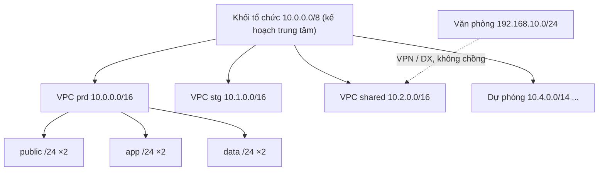

---
tags:
  - Must
  - AWS
  - CIDR
  - Planning
  - Troubleshooting
---

# Lập kế hoạch CIDR cho nhiều môi trường và nhiều tài khoản thế nào để sau này nối mạng không bị vướng?

<!-- lint:allow-ip-file — chapter này cố ý nêu ví dụ sai (172.32.x.x) và dải AWS hạn chế (198.19.0.0/16) để minh họa -->

## Metadata

```yaml
Chapter: cidr-planning-multi-env
Phase: 06 — aws-networking
Importance: Must
Status: draft
Prerequisites:
  - Phase 01 / 06-private-public-ip-rfc1918
  - Phase 06 / 01-vpc-subnet-az
Used Later:
  - Phase 08 / 05-design-exercises
Estimated Reading: 35 phút
Estimated Practice: 40 phút
```

## 1. Story

<!-- Mức bắt buộc (Must): Đủ -->
<!-- DRAFT: người học cần viết lại bằng lời mình -->

Đội `shopnet` có `stg` do đội A dựng (`10.0.0.0/16`), `prd` do đội B dựng (`10.0.0.0/16` vì "VPC mặc định gợi ý vậy"), và một VPC `shared` do đội C dựng với `172.32.0.0/16` (`01/06`: không phải dải private). Một năm sau, công ty muốn nối cả ba bằng Transit Gateway và nối thêm văn phòng `10.0.5.0/24`. Kết quả: **`stg` và `prd` trùng CIDR hoàn toàn**, **`shared` đụng dải công khai thật**, **văn phòng nằm lọt trong `10.0.0.0/16`**. Sửa CIDR của một VPC đang chạy nghĩa là **dựng lại và di chuyển mọi thứ** (`06/01`).

Chapter này là bài học "làm một lần cho đúng": một **sơ đồ đánh số** có chủ đích cho nhiều môi trường/tài khoản/Region, các ràng buộc riêng của AWS, cách dành chỗ cho dịch vụ ăn IP (endpoint, LB, ECS) và công cụ quản lý (IPAM).

## 2. Objectives

<!-- Mức bắt buộc (Must): Đủ -->
<!-- DRAFT: người học cần viết lại bằng lời mình -->

Sau chapter này bạn có thể:

- Thiết kế bảng cấp phát CIDR cho nhiều VPC (môi trường × tài khoản × Region) không chồng lấn và còn dư để mở rộng.
- Nêu các ràng buộc CIDR của AWS (kích thước, dải cấm, hạn chế khi thêm CIDR phụ, `172.17.0.0/16`).
- Dự trù IP cho từng subnet theo dịch vụ (ALB, endpoint, NAT, ECS...) và đặt kích thước hợp lý.
- Giải thích vì sao CIDR trùng làm hỏng peering/TGW/VPN/Direct Connect.
- Giới thiệu IPAM và chọn cách phát hiện trùng trước khi tạo VPC.

## 3. Prerequisites

<!-- Mức bắt buộc (Must): Đủ -->
<!-- DRAFT: người học cần viết lại bằng lời mình -->

> Xem lại: [private-public-ip-rfc1918](../phase-01-foundation/06-private-public-ip-rfc1918.md), [vpc-subnet-az](01-vpc-subnet-az.md)

Cần nhớ: ba dải private RFC 1918, `172.32.x.x` không phải private, dải tài liệu RFC 5737 (`01/06`); quy tắc kích thước VPC/subnet, 5 IP bị giữ, CIDR không đổi kích thước (`06/01`); ENI chiếm IP (`06/05`); chồng CIDR chặn peering/VPN (`06/09`, `06/10`).

## 4. Why it exists

<!-- Mức bắt buộc (Must): Đủ -->
<!-- DRAFT: người học cần viết lại bằng lời mình -->

CIDR của VPC là **quyết định rất khó đảo ngược** (không đổi kích thước được, chỉ thêm khối phụ) và nó **ràng buộc mọi kết nối sau này**: peering, TGW, VPN, Direct Connect đều đòi dải **không chồng**. Vì vậy cần một **kế hoạch đánh số toàn tổ chức** làm trước khi tạo VPC đầu tiên, giống kế hoạch đánh số nhà trong một thành phố.

Nếu hiểu sai: mỗi đội tự chọn dải (Story), chọn VPC quá nhỏ, dùng dải công khai làm private, hoặc quên dành chỗ cho văn phòng/đối tác và cho dịch vụ ăn nhiều IP.

## 5. Mental model

<!-- Mức bắt buộc (Must): Đủ -->
<!-- DRAFT: người học cần viết lại bằng lời mình -->

Hình dung **quy hoạch số nhà cho cả thành phố**. Mỗi khu (môi trường/tài khoản/Region) được giao **một dải số cố định lớn hơn nhu cầu hiện tại**; trong khu, mỗi phố (subnet) lấy một đoạn con. Nếu hai khu **trùng số nhà**, bưu tá (router) không biết giao về đâu khi nối hai khu bằng một con đường. Người quy hoạch **giữ lại nhiều dải trống** cho khu mới.

**Tóm tắt một câu:** đánh số một lần cho cả tổ chức, mỗi VPC một dải riêng không trùng và còn dư, dành chỗ cho dịch vụ ăn IP, và kiểm tra trùng bằng công cụ trước khi tạo.

## 6. How it works

<!-- Mức bắt buộc (Must): Đủ -->
<!-- DRAFT: người học cần viết lại bằng lời mình -->

Các từ cần biết:

- **IP address plan (kế hoạch địa chỉ — bảng cấp phát dải cho toàn tổ chức).**
- **Overlapping CIDR (CIDR chồng lấn — hai dải có địa chỉ chung).**
- **Secondary CIDR (CIDR phụ — khối thêm vào VPC sau khi tạo).**
- **IPAM (IP Address Manager — dịch vụ của AWS để lập kế hoạch, theo dõi và cấp phát IP cho VPC).**
- **Network Address Usage (NAU — chỉ số đo mức dùng địa chỉ của VPC để theo dõi kích thước).**

**Ràng buộc của AWS (theo tài liệu AWS).**

- VPC IPv4: từ `/16` tới `/28`; **không đổi kích thước** khối đã có, chỉ thêm khối phụ; khối chính không gỡ được; khối phụ **không chồng** khối hiện có của VPC.
- Không dùng làm VPC: `0.0.0.0/8`, `127.0.0.0/8`, `169.254.0.0/16`, `224.0.0.0/4`.
- AWS **khuyến nghị dải RFC 1918** cho VPC; có thể dùng dải công khai (không phải RFC 1918) nhưng AWS không hỗ trợ truy cập Internet trực tiếp từ CIDR của VPC và không bao giờ quảng bá dải subnet ra Internet.
- **Hạn chế khi thêm CIDR phụ giữa các họ dải** (ví dụ VPC có `10.0.0.0/8` thì không thêm `172.16.0.0/12` hay `192.168.0.0/16`; cũng không thêm `198.19.0.0/16`; có điều kiện riêng với `10.0.0.0/15`): vì vậy nên **chọn một họ dải ngay từ đầu** và đặt đủ CIDR chính.
- **Tránh `172.17.0.0/16`**: một số dịch vụ AWS (ví dụ Cloud9, SageMaker) dùng dải này nên có thể xung đột.
- Với **Direct Connect gateway** nối nhiều VPC: các VPC liên kết **không được có CIDR chồng lấn**; **peering** cũng không cho phép chồng (`06/09`); VPN/Direct Connect đòi dải không trùng với mạng on-premise (`06/10`).
- Route `local` luôn thắng route lan truyền chồng (`06/10`).

**Dự trù IP theo dịch vụ.** Một VPC "trống" nhanh hết IP vì nhiều dịch vụ tạo ENI trong subnet (`06/05`): mỗi interface endpoint (mỗi AZ một ENI, `06/04`), ALB/NLB (mỗi AZ có nút và cần ≥ 8 IP trống để mở rộng, subnet ≥ `/27`, `06/08`), NAT gateway (một ENI), ECS `awsvpc` (mỗi task một ENI, `07/03`), Lambda trong VPC... Cộng thêm 5 IP bị giữ mỗi subnet. Quy tắc thực tế: **subnet app/data đặt rộng (thường `/24` hoặc lớn hơn)**, subnet LB ít nhất `/27` và còn ≥ 8 IP trống, subnet có endpoint nên dư.

**Sơ đồ đánh số gợi ý cho `shopnet` (dữ liệu giả, một khối `10.0.0.0/8` chia cho tổ chức).**

| Dải (/16) | Dùng cho | Ghi chú |
|---|---|---|
| `10.0.0.0/16` | `shopnet-prd` (ap-northeast-1) | VPC production |
| `10.1.0.0/16` | `shopnet-stg` (ap-northeast-1) | VPC staging |
| `10.2.0.0/16` | `shopnet-shared` (NAT, công cụ, VPN về văn phòng) | Hub dùng chung |
| `10.3.0.0/16` | `shopnet-dev` | Chưa dùng, giữ chỗ |
| `10.4.0.0/14` | Dự phòng (Region/tài khoản mới) | Giữ chỗ lớn |
| `10.16.0.0/12` | Dải riêng cho Region thứ hai | Giữ chỗ cho tương lai |
| `192.168.10.0/24` | Văn phòng (ví dụ) | Khác họ `10/8`, không chồng |

Trong một VPC `/16` (ví dụ `10.0.0.0/16`), chia `/24` theo vai trò và AZ có chừa khoảng trống:

| Chỉ số /24 | Dùng cho |
|---|---|
| `0`, `1` | Public (AZ-a, AZ-c) |
| `10`, `11` | App (AZ-a, AZ-c) |
| `20`, `21` | Data (AZ-a, AZ-c) |
| `30`, `31` | Endpoint (interface endpoint, mỗi AZ) |
| `100+` | Dự phòng/mở rộng |

(Khớp với template ở `06/12` dùng `!Cidr` với chỉ số 0, 1, 10, 11.)



**Đọc sơ đồ:** một khối lớn do **một nơi duy nhất** quản lý (bảng kế hoạch, hoặc IPAM), chia thành các `/16` cho từng VPC; mỗi `/16` chia tiếp theo vai trò. Văn phòng dùng dải khác họ để chắc chắn không chồng. Nhìn vào sơ đồ là thấy: thêm môi trường hay Region mới chỉ là lấy một dải trong phần dự phòng, không phải đụng tới VPC đang chạy.

**IPAM (theo tài liệu AWS).** Amazon VPC IP Address Manager giúp **lập kế hoạch, theo dõi và giám sát** địa chỉ IP: tổ chức không gian địa chỉ theo miền định tuyến/bảo mật, theo dõi mức dùng, xem lịch sử cấp phát trong tổ chức, **tự động cấp CIDR cho VPC theo quy tắc**, và hỗ trợ xử lý sự cố kết nối. Dùng khi có nhiều tài khoản/Region và cần chống trùng có hệ thống; bảng tính trong Git đủ cho tổ chức nhỏ nếu có quy trình review. Chi phí IPAM tùy bậc dịch vụ (kiểm tra giá hiện hành).

**Kiểm tra trước khi tạo.** Quy trình tối thiểu: (1) tra bảng kế hoạch, (2) kiểm tra không chồng với mọi VPC/on-premise hiện có (cả CIDR phụ), (3) tạo VPC với CIDR đã cấp phát, (4) ghi lại vào bảng kế hoạch. Tự động hóa bước 2 bằng script hoặc IPAM.

**IPv6 (nhắc ngắn).** IPv6 do Amazon cấp không chồng lấn vì duy nhất toàn cầu; có thể dùng thêm IPv6 để giảm áp lực IPv4 nhưng không thay thế kế hoạch IPv4 khi vẫn có luồng IPv4 `[CHƯA KIỂM CHỨNG]` chi tiết hỗ trợ từng dịch vụ.

> Quy tắc kích thước và 5 IP bị giữ: `06/01`; IP bị chiếm bởi ENI: `06/05`; trùng làm hỏng peering/VPN: `06/09`, `06/10`; template tham số hóa CIDR: `06/12`.

<!-- verified: 2026-10-05 https://docs.aws.amazon.com/vpc/latest/userguide/vpc-cidr-blocks.html -->
<!-- verified: 2026-10-05 https://docs.aws.amazon.com/vpc/latest/userguide/vpc-ip-addressing.html -->
<!-- verified: 2026-10-05 https://docs.aws.amazon.com/vpc/latest/ipam/what-it-is-ipam.html -->

## 7. Key settings

<!-- Mức bắt buộc (Must): Đủ -->
<!-- DRAFT: người học cần viết lại bằng lời mình -->

| Thông số | Ý nghĩa | Nếu sai |
|---|---|---|
| Họ dải (10/8, 172.16/12, 192.168/16) | Đồng nhất toàn tổ chức | Trộn họ → bị hạn chế khi thêm CIDR phụ |
| Kích thước VPC (thường /16) | Dư chỗ mở rộng | Nhỏ → hết IP (`06/01`) |
| Dải chia cho từng môi trường | Không chồng | Chồng → không nối được |
| Dải cho văn phòng/đối tác | Dành sẵn | Chồng với VPC → VPN/DX không dùng được |
| Kích thước subnet theo vai trò | Đủ IP cho ENI | LB `/28`, hết IP → `active_impaired` (`06/08`) |
| Dải dự phòng | Mở rộng sau | Dùng hết → phải đánh số lại |
| Tránh `172.17.0.0/16` | Không xung đột dịch vụ AWS | Xung đột khó chẩn đoán |
| Bảng kế hoạch / IPAM | Nguồn sự thật | Mỗi đội một bảng → trùng |
| Kiểm tra chồng trước khi tạo | Chặn lỗi sớm | Phát hiện muộn → phải dựng lại |

**Lệnh quan sát (chỉ đọc):**

```bash
aws ec2 describe-vpcs --query "Vpcs[].{id:VpcId,cidr:CidrBlock,cidrs:CidrBlockAssociationSet[].CidrBlock,name:Tags[?Key=='Name']|[0].Value}" --output json
aws ec2 describe-subnets --query "Subnets[].{id:SubnetId,vpc:VpcId,cidr:CidrBlock,free:AvailableIpAddressCount}" --output table
```

Gom kết quả từ mọi tài khoản/Region vào bảng kế hoạch rồi chạy kiểm tra chồng (Python ở lab).

## 8. AWS mapping

<!-- Mức bắt buộc (Must): Đủ -->
<!-- DRAFT: người học cần viết lại bằng lời mình -->

| Khái niệm | AWS | CloudFormation |
|---|---|---|
| VPC với CIDR cấp phát | VPC | `AWS::EC2::VPC` (`CidrBlock`) |
| CIDR phụ | VPC CIDR block association | `AWS::EC2::VPCCidrBlock` |
| Cấp CIDR từ IPAM | IPAM pool + allocation | `AWS::EC2::IPAM`, `AWS::EC2::IPAMPool`, `Ipv4IpamPoolId` của VPC |
| Chia subnet từ CIDR | Subnet | `AWS::EC2::Subnet` (`!Cidr`, `06/12`) |

**IAM tối thiểu cho lab:** chỉ đọc: `ec2:DescribeVpcs`, `ec2:DescribeSubnets`. Dùng IPAM cần quyền IPAM và (nếu đa tài khoản) tích hợp AWS Organizations.

**Chi phí:** VPC/subnet không tính phí riêng; IPAM tính phí tùy bậc dịch vụ (kiểm tra giá hiện hành). Lab ở chapter này **không tạo tài nguyên AWS**.

## 9. Hands-on lab

<!-- Mức bắt buộc (Must): Đủ -->
<!-- DRAFT: người học cần viết lại bằng lời mình -->

Chi tiết ở `labs/phase-06-aws-networking/chapter-13-cidr-planning-multi-env/README.md`. Lab **hoàn toàn local và chỉ đọc**: Python kiểm tra bảng kế hoạch (chồng lấn, nằm trong dải private, dư chỗ, kích thước subnet) và (tùy chọn) đối chiếu với `describe-vpcs`.

**1. Predict:** bảng kế hoạch của Story (`10.0.0.0/16`, `10.0.0.0/16`, `172.32.0.0/16`, `10.0.5.0/24`) có những lỗi nào? Bảng sửa ở mục 6 có lỗi không?

**2. Run / 3. Verify:** xem README lab; output thật `[CHƯA CHẠY]`.

## 10. Break it

<!-- Mức bắt buộc (Must): Đủ -->
<!-- DRAFT: người học cần viết lại bằng lời mình -->

**Lỗi 1 — hai VPC trùng CIDR (Story).** Dự đoán: script báo chồng lấn; thực tế peering/TGW sẽ bị từ chối (`06/09`).

**Lỗi 2 — dải công khai làm private (Story, `01/06`).** Dự đoán: script báo `172.32.0.0/16` không thuộc RFC 1918; thực tế rủi ro đụng địa chỉ công khai thật.

**Lỗi 3 — văn phòng lọt trong dải VPC.** Dự đoán: `10.0.5.0/24` thuộc `10.0.0.0/16`; VPN tunnel `UP` nhưng route `local` thắng (`06/10`).

**Lỗi 4 — hết chỗ cho LB.** Dự đoán: subnet `/28` không đủ chỗ cho ALB (≥ `/27` và ≥ 8 IP trống), script cảnh báo (`06/08`).

Kết quả thật: `[CHƯA CHẠY]`.

## 11. Troubleshooting

<!-- Mức bắt buộc (Must): Đủ -->
<!-- DRAFT: người học cần viết lại bằng lời mình -->

| Triệu chứng | Giả thuyết đầu tiên | Kiểm tra theo thứ tự | Công cụ |
|---|---|---|---|
| Không tạo được peering/TGW attachment hợp lệ | CIDR chồng | So CIDR của mọi VPC (cả CIDR phụ) | `describe-vpcs`, script lab |
| VPN `UP` mà văn phòng không gọi được VPC | Dải văn phòng nằm trong dải VPC | So CIDR hai phía; `local` thắng (`06/10`) | script lab, route table |
| Không thêm được CIDR phụ vào VPC | Hạn chế họ dải hoặc chồng route hiện có | Đọc điều kiện hạn chế; xem route table | `describe-vpcs`, tài liệu |
| Hết IP trong subnet | Dịch vụ tạo nhiều ENI | `AvailableIpAddressCount`; đếm ENI theo loại (`06/05`) | `describe-subnets` |
| Xung đột lạ với dịch vụ AWS | Dùng `172.17.0.0/16` | Đổi dải VPC mới | Tài liệu dịch vụ |
| Địa chỉ công khai thật không truy cập được từ VPC | VPC dùng dải công khai/không RFC 1918 (`01/06`) | Đối chiếu dải; thiết kế lại | `describe-vpcs` |
| Hai đội tạo VPC trùng | Không có nguồn sự thật | Bảng kế hoạch/IPAM bắt buộc trước khi tạo | IPAM, review |

Ghi kết quả thật của mục 10: `[CHƯA CHẠY]`.

## 12. Security & cost

<!-- Mức bắt buộc (Must): Đủ -->
<!-- DRAFT: người học cần viết lại bằng lời mình -->

- **CIDR không trùng là điều kiện bảo mật gián tiếp:** trùng buộc phải dùng NAT/thiết kế vòng, làm khó phân đoạn và kiểm soát.
- **Dải đánh số là thông tin kiến trúc:** không dán bảng kế hoạch thật (dải, tên môi trường, văn phòng) vào repo công khai; trong sách chỉ dùng dữ liệu giả như trên (`CLAUDE.md` mục 4).
- **Phân đoạn theo dải:** môi trường khác nhau dùng dải khác nhau giúp viết quy tắc SG/NACL/route tóm tắt dễ hơn.
- **Chi phí:** thiết kế sai dẫn tới dựng lại hạ tầng (chi phí lớn nhất); IPAM tính phí theo bậc dịch vụ; VPC/subnet không tính phí riêng.

## 13. Misconceptions

<!-- Mức bắt buộc (Must): Đủ -->
<!-- DRAFT: người học cần viết lại bằng lời mình -->

| Hiểu nhầm | Sự thật |
|---|---|
| "Mỗi VPC cứ dùng `10.0.0.0/16` là xong" | Trùng nhau thì không nối được |
| "Có thể mở rộng VPC bằng cách đổi kích thước CIDR" | Không đổi kích thước; chỉ thêm khối phụ (có hạn chế) |
| "`172.x.x.x` luôn là private" | Chỉ `172.16`–`172.31` (`01/06`) |
| "Dải công khai làm private cũng được" | Dễ đụng địa chỉ thật; AWS vẫn không hỗ trợ truy cập Internet trực tiếp từ dải đó |
| "Subnet `/28` tiết kiệm IP là tốt" | Hết IP nhanh vì ENI và 5 IP bị giữ; LB cần ≥ `/27` |
| "Chỉ cần tránh trùng giữa các VPC" | Còn on-premise, đối tác, VPN client, và dải dịch vụ AWS (`172.17.0.0/16`) |
| "IPAM là bắt buộc" | Là công cụ hỗ trợ; bảng kế hoạch có review cũng dùng được ở quy mô nhỏ |
| "Trộn nhiều họ dải trong một VPC thoải mái" | Có hạn chế khi thêm CIDR phụ giữa các họ |

## 14. Interview questions

<!-- Mức bắt buộc (Must): Đủ -->
<!-- DRAFT: người học cần viết lại bằng lời mình -->

### Q1 (Junior) — Vì sao phải lập kế hoạch CIDR trước khi tạo VPC?

**Gợi ý ý chính:**
- Đổi được không?
- Nối mạng sau này?

??? success "Đáp án mẫu (tự trả lời trước khi mở)"
    CIDR của VPC không đổi kích thước được (chỉ thêm khối phụ) và các kết nối như peering, TGW, VPN, Direct Connect đòi dải không chồng. Không có kế hoạch toàn tổ chức thì các VPC dễ trùng nhau, khiến phải dựng lại hạ tầng khi cần nối.

### Q2 (Middle) — Thiết kế bảng CIDR cho ba môi trường, một VPC dùng chung và văn phòng.

**Gợi ý ý chính:**
- Dải mỗi VPC, dự phòng, khác họ cho văn phòng

??? success "Đáp án mẫu (tự trả lời trước khi mở)"
    Chọn một họ RFC 1918 (ví dụ `10.0.0.0/8`), cấp mỗi VPC một `/16` riêng (`prd`, `stg`, `shared`...), giữ khối lớn dự phòng cho Region/tài khoản mới, đặt văn phòng ở dải không chồng (khác họ hoặc dải riêng nằm ngoài các `/16` đã cấp), chia mỗi `/16` thành `/24` theo vai trò và AZ có chừa chỗ, và lưu vào một bảng kế hoạch (hoặc IPAM) duy nhất.

### Q3 (Middle) — VPN báo UP nhưng văn phòng không truy cập được VPC. Một nguyên nhân liên quan CIDR là gì?

**Gợi ý ý chính:**
- Dải văn phòng và VPC

??? success "Đáp án mẫu (tự trả lời trước khi mở)"
    Dải văn phòng nằm trong hoặc chồng với CIDR của VPC: route `local` luôn thắng route lan truyền VPN nên gói tới dải đó bị giữ trong VPC thay vì đi về văn phòng. Cần đổi dải ở một phía để không chồng.

### Q4 (Middle) — Subnet cho ALB và interface endpoint nên thế nào?

**Gợi ý ý chính:**
- Kích thước và IP trống

??? success "Đáp án mẫu (tự trả lời trước khi mở)"
    Subnet cho ALB ít nhất `/27` và ít nhất 8 IP trống mỗi AZ để mở rộng; interface endpoint tạo một ENI mỗi AZ nên subnet cần dư IP. Dự trù thêm cho NAT, ECS `awsvpc`, Lambda trong VPC; ưu tiên `/24` cho subnet app/data và theo dõi `AvailableIpAddressCount`.

## 15. Exercises

<!-- Mức bắt buộc (Must): Đủ -->
<!-- DRAFT: người học cần viết lại bằng lời mình -->

1. **Bảng kế hoạch.** *Deliverable:* bảng CIDR cho `shopnet` gồm 3 môi trường, 2 Region, 1 VPC shared và 2 văn phòng, kèm vùng dự phòng và lý do kích thước.
2. **Sửa Story.** *Deliverable:* kế hoạch di chuyển từ ba VPC lỗi sang bảng đúng (thứ tự, cách tạo VPC mới, cách chuyển tài nguyên, rủi ro).
3. **Dự trù IP.** *Deliverable:* ước tính số IP một subnet `/24` cần cho: 2 NAT, 1 ALB, 4 interface endpoint, 40 task ECS `awsvpc`; so với 251 IP dùng được và đề xuất kích thước.
4. **Quy trình tránh trùng.** *Deliverable:* quy trình 5 bước (tra bảng, kiểm tra chồng, review, tạo VPC, ghi lại) kèm công cụ tự động hóa bước kiểm tra.

## 16. Cheat sheet

<!-- Mức bắt buộc (Must): Đủ -->
<!-- DRAFT: người học cần viết lại bằng lời mình -->

| Mục | Nội dung |
|---|---|
| VPC IPv4 | `/16`–`/28`; không đổi kích thước; thêm khối phụ có hạn chế |
| Dải khuyến nghị | RFC 1918; tránh `172.17.0.0/16`; không dùng `172.32+` như private |
| Không dùng | `0.0.0.0/8`, `127.0.0.0/8`, `169.254.0.0/16`, `224.0.0.0/4` |
| Cấp phát | Mỗi VPC một `/16` riêng + dự phòng lớn; `/24` theo vai trò/AZ |
| LB | ≥ `/27` và ≥ 8 IP trống mỗi AZ |
| Chồng CIDR | Chặn peering, lỗi TGW/DX gateway, VPN không dùng được |
| Công cụ | Bảng kế hoạch + review; IPAM khi nhiều tài khoản/Region |
| Lệnh | `describe-vpcs`, `describe-subnets` |

**Debug:** chồng CIDR (script) → họ dải/route khi thêm CIDR phụ → `AvailableIpAddressCount` → dải đặc biệt (`172.17.0.0/16`) → bảng kế hoạch.

## 17. Glossary terms

<!-- Mức bắt buộc (Must): Đủ -->
<!-- DRAFT: người học cần viết lại bằng lời mình -->

- IP address plan / kế hoạch địa chỉ / IPアドレス計画
- Overlapping CIDR / CIDR chồng lấn / CIDRの重複
- Secondary CIDR / CIDR phụ / セカンダリCIDR
- IPAM / quản lý địa chỉ IP / IPAM
- Network Address Usage / mức dùng địa chỉ mạng / ネットワークアドレス使用量

## 18. Further reading

<!-- Mức bắt buộc (Must): Đủ -->
<!-- DRAFT: người học cần viết lại bằng lời mình -->

Kiểm tra ngày 2026-10-05:

- VPC CIDR blocks: https://docs.aws.amazon.com/vpc/latest/userguide/vpc-cidr-blocks.html
- IP addressing for your VPCs and subnets: https://docs.aws.amazon.com/vpc/latest/userguide/vpc-ip-addressing.html
- What is IPAM: https://docs.aws.amazon.com/vpc/latest/ipam/what-it-is-ipam.html
