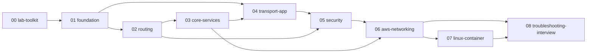

# Network Fundamentals Handbook (Infra / DevOps / Cloud)

## Project Specification

Version: 1.0 (đã duyệt 2026-10-02)

# PART 4 — Roadmap và Knowledge Architecture

> Roadmap này đã được duyệt ở v1.0; mọi thay đổi ghi vào `spec/CHANGELOG.md`. Ký hiệu Importance: **M**=Must, **S**=Should, **N**=Nice (định nghĩa ở Part 2 §7).
> Chapter được gọi bằng **slug** `PP/NN-<slug>` (Phase/số thứ tự); Title dạng câu hỏi chỉ được đặt khi viết nội dung (Part 2 §2.1).
> Nhãn "CCNA / Ngoài CCNA" ở cột ghi chú chỉ là **dự kiến**; trạng thái thật (Mapped / Concept-only / Skipped) nằm ở `spec/ccna-coverage-map.md` sau khi có blueprint chính thức.

---

# 1. Nguyên tắc xây roadmap

1. **Theo dependency, không theo sách giáo khoa:** chapter chỉ phụ thuộc vào chapter **đứng trước nó** (cùng Phase hoặc Phase trước). Tham chiếu "về sau" chỉ ghi ở `Used Later`, không bao giờ là Prerequisite.
2. **Packet journey xuyên suốt:** Phase 01 mở đầu bằng `01/01-packet-journey`; mọi Phase sau đều quy chiếu về hành trình đó.
3. **Concept ↔ AWS tách đôi:** Phase 01–05 trung lập vendor, Phase 06 áp dụng vào AWS.
4. **20/80:** chỉ giữ chapter phục vụ công việc Infra/DevOps/Cloud; nội dung ngoài phạm vi (CLAUDE.md §2.8) không có chapter.
5. **Không bắt buộc viết tuần tự:** thứ tự viết theo vertical slice (mục 5), thứ tự học đọc theo dependency.

---

# 2. Tổng quan Phase

Phase 00 phục vụ mọi Phase (công cụ lab). Phase 06 là nơi các khái niệm Phase 01–05 hội tụ vào AWS. Phase 08 tổng hợp: methodology troubleshooting, case study, phỏng vấn. Phase 07 và 08 có thể viết trước hoặc song song với một phần Phase 06 (xem mục 5).

| Phase | Slug | Số chapter | M / S / N |
|---|---|---|---|
| 00 | lab-toolkit | 3 | 2 / 1 / 0 |
| 01 | foundation | 7 | 5 / 2 / 0 |
| 02 | routing | 7 | 4 / 2 / 1 |
| 03 | core-services | 6 | 4 / 2 / 0 |
| 04 | transport-app | 8 | 6 / 2 / 0 |
| 05 | security | 5 | 3 / 2 / 0 |
| 06 | aws-networking | 13 | 10 / 3 / 0 |
| 07 | linux-container | 5 | 1 / 2 / 2 |
| 08 | troubleshooting-interview | 5 (+ file gap-log) | 2 / 3 / 0 |
| **Tổng** | | **59** | **37 / 19 / 3** |

---

# 3. Chi tiết từng Phase

Cột `Prerequisites` dùng slug `PP/NN`. Cột `Ghi chú` ghi nhãn dự kiến CCNA/Ngoài CCNA và các lưu ý.

## Phase 00 — `lab-toolkit` (công cụ làm lab, đặt đầu vì mọi chapter đều cần)

| Chapter | Imp. | Prerequisites | Ghi chú |
|---|---|---|---|
| `00/01-lab-environment` | M | — | WSL2, Docker, quy ước lab; ngoài CCNA |
| `00/02-linux-network-tools` | M | 00/01 | `ip`, `ss`, `curl`, `dig`, `traceroute`, `nc`; ngoài CCNA |
| `00/03-packet-capture` | S | 00/02 | `tcpdump`, Wireshark; ngoài CCNA |

## Phase 01 — `foundation`

| Chapter | Imp. | Prerequisites | Ghi chú |
|---|---|---|---|
| `01/01-packet-journey` | M | — | Mở đầu cả sách |
| `01/02-osi-vs-tcpip` | M | 01/01 | CCNA |
| `01/03-ethernet-mac-arp` | S | 01/02 | CCNA |
| `01/04-ipv4-addressing` | M | 01/02 | CCNA |
| `01/05-cidr-subnetting` | M | 01/04 | CCNA; chapter then chốt của Phase |
| `01/06-private-public-ip-rfc1918` | M | 01/04, 01/05 | CCNA; seed #7 (172.32) |
| `01/07-ipv6-basics` | S | 01/04 | CCNA |

## Phase 02 — `routing`

| Chapter | Imp. | Prerequisites | Ghi chú |
|---|---|---|---|
| `02/01-routing-table-basics` | M | 00/02, 01/03, 01/05 | CCNA |
| `02/02-longest-prefix-match` | M | 02/01 | CCNA |
| `02/03-default-route-gateway` | M | 02/02 | CCNA |
| `02/04-static-route` | S | 02/02, 02/03 | CCNA |
| `02/05-nat-pat` | M | 01/06, 02/03 | CCNA; **cố ý lặp** với 06/02 |
| `02/06-asymmetric-routing` | S | 02/02, 02/05 | Ngoài CCNA |
| `02/07-dynamic-routing-ospf-bgp-concepts` | N | 02/04 | CCNA (khái niệm); chỉ concept-level |

## Phase 03 — `core-services`

| Chapter | Imp. | Prerequisites | Ghi chú |
|---|---|---|---|
| `03/01-dhcp` | M | 01/03, 02/03 | CCNA; **cố ý lặp** với 06/06 |
| `03/02-dns-resolution` | M | 01/04, 02/03 | CCNA (một phần); UDP/TCP chỉ nhắc, chi tiết ở 04 |
| `03/03-dns-records-ttl-private-dns` | M | 03/02 | CCNA (một phần); **cố ý lặp** với 06/07 |
| `03/04-icmp-ping-traceroute` | M | 00/02, 01/04, 02/01 | CCNA |
| `03/05-ntp` | S | 01/04 | CCNA |
| `03/06-syslog-logging` | S | 01/04 | CCNA |

## Phase 04 — `transport-app` (ngoài CCNA nhưng DevOps cần)

| Chapter | Imp. | Prerequisites | Ghi chú |
|---|---|---|---|
| `04/01-tcp-handshake-states` | M | 00/03, 01/02 | Dùng Mermaid `sequenceDiagram`, `stateDiagram` |
| `04/02-tcp-timeouts-retransmission-keepalive` | M | 04/01 | |
| `04/03-udp` | S | 01/02 | |
| `04/04-ports-sockets` | M | 04/01, 04/03 | |
| `04/05-http` | M | 04/01 | |
| `04/06-tls-certificates` | M | 03/02, 04/05 | |
| `04/07-load-balancing-l4-vs-l7` | M | 02/05, 04/04, 04/05 | **cố ý lặp** với 06/08 |
| `04/08-reverse-proxy` | S | 04/05, 04/07 | |

## Phase 05 — `security`

| Chapter | Imp. | Prerequisites | Ghi chú |
|---|---|---|---|
| `05/01-firewall-stateful-vs-stateless` | M | 04/01, 04/04 | CCNA (một phần); **cố ý lặp** với 06/03 |
| `05/02-acl` | M | 01/05, 05/01 | CCNA; chỉ khái niệm, không cú pháp IOS |
| `05/03-sg-vs-nacl-concept` | M | 05/01, 05/02 | Seed #4, #5 |
| `05/04-vpn-ipsec-site-to-site` | S | 01/06, 02/05, 04/06 | CCNA (khái niệm); **cố ý lặp** với 06/10 |
| `05/05-bastion-and-session-access` | S | 04/06, 05/01 | Ngoài CCNA |

## Phase 06 — `aws-networking`

| Chapter | Imp. | Prerequisites | Ghi chú |
|---|---|---|---|
| `06/01-vpc-subnet-az` | M | 01/05, 01/06 | |
| `06/02-route-table-igw-nat-gateway` | M | 02/03, 02/05, 06/01 | Seed #12 |
| `06/03-security-group-and-nacl` | M | 05/03, 06/01 | Seed #4, #5 |
| `06/04-vpc-endpoints-gateway-interface-gwlb` | M | 03/02, 06/02, 06/03 | Seed #1, #2, #6, #8, #13 |
| `06/05-eni-and-ip-allocation` | M | 03/01, 06/01 | Seed #1 |
| `06/06-dhcp-options-and-vpc-dns` | S | 03/01, 03/02, 06/05 | |
| `06/07-route53` | M | 03/03, 06/01 | |
| `06/08-elb-alb-nlb-gwlb` | M | 04/07, 06/03 | Seed #3 |
| `06/09-vpc-peering-transit-gateway` | S | 06/02 | |
| `06/10-site-to-site-vpn-direct-connect` | S | 05/04, 06/09 | |
| `06/11-flow-logs-reachability-analyzer` | M | 03/04, 06/03 | Seed #14 |
| `06/12-network-iac-cloudformation` | M | 06/02, 06/03 | Seed #9, #10, #11 |
| `06/13-cidr-planning-multi-env` | M | 01/06, 06/01 | Seed #3, #7 |

## Phase 07 — `linux-container`

| Chapter | Imp. | Prerequisites | Ghi chú |
|---|---|---|---|
| `07/01-network-namespaces` | S | 00/02, 02/01 | Cần WSL2/Linux |
| `07/02-docker-networking` | M | 02/05, 07/01 | |
| `07/03-ecs-awsvpc-networking` | S | 06/05, 07/02 | |
| `07/04-kubernetes-networking-basics` | N | 07/02 | Chỉ concept |
| `07/05-service-discovery-dns-in-containers` | N | 03/02, 07/02 | Chỉ concept |

## Phase 08 — `troubleshooting-interview`

| Chapter | Imp. | Prerequisites | Ghi chú |
|---|---|---|---|
| `08/00-resolved-gap-log.md` (file, không phải chapter) | — | — | Ghi các khoảng trống đã giải quyết |
| `08/01-troubleshooting-methodology-layered` | M | 01/02, 03/04, 04/01 | Nguồn của `troubleshooting-playbook.md`; seed #14 |
| `08/02-case-studies` | M | 06/04, 08/01 | Seed #8 |
| `08/03-interview-concepts` | S | 08/01 | |
| `08/04-interview-aws-networking` | S | 06/02, 06/03, 06/04, 06/08, 06/11 | Chọn các chapter AWS cốt lõi để ôn |
| `08/05-design-exercises` | S | 06/08, 06/13, 08/01 | |

---

# 4. Khái niệm cố ý xuất hiện hai lần

Hai chapter cùng khái niệm là **hai góc nhìn khác nhau**, không phải trùng lặp. Mỗi chapter AWS mở đầu bằng `> Xem lại: [chapter khái niệm]` và chỉ nói phần riêng của AWS. Mỗi chapter khái niệm có `Used Later` trỏ sang chapter AWS.

| Khái niệm | Chapter khái niệm | Chapter AWS |
|---|---|---|
| NAT | 02/05 | 06/02 |
| Routing | 02/01–02/04 | 06/02 |
| DHCP | 03/01 | 06/06 |
| DNS | 03/02, 03/03 | 06/06, 06/07 |
| Load balancer | 04/07 | 06/08 |
| Firewall / ACL | 05/01–05/03 | 06/03 |
| VPN | 05/04 | 06/10 |

---

# 5. Thứ tự viết (vertical slice)

Người học cần dùng được kiến thức cho công việc hạ tầng AWS trong vài tuần, nên viết theo lát cắt dọc thay vì tuần tự từ Phase 01. Thời gian chỉ là ước lượng và điều chỉnh theo tiến độ.

| Giai đoạn | Việc | Chapter |
|---|---|---|
| 0 | Bước 0 + Bước 1 (spec) + MkDocs chạy được + `tools/lint_chapters.py` + scaffold chapter `TODO` | — |
| 1 (≈ tuần 1) | Nền IP | `01/01` → `01/04` → `01/05` (+ `00/01`, `00/02`) |
| 2 (≈ tuần 2) | Định tuyến và dịch vụ lõi | `02/01` → `02/05` → `03/01` → `03/02` |
| 3 (≈ tuần 3) | Vận chuyển và bảo mật | `04/01` → `04/06` → `05/03` |
| 4 (≈ tuần 4) | AWS và playbook bản đầu | `06/01` → `06/02` → `06/04` → `troubleshooting-playbook.md` |
| 5+ | Lấp phần còn lại theo Importance giảm dần | — |

Sau mỗi chapter hoàn thành: cập nhật `ccna-coverage-map.md`, `glossary.md`, `cross-reference-index.md`, `troubleshooting-playbook.md` (nếu có).

> Cần lưu ý: lát cắt giai đoạn 2 và 3 nhảy qua một số chapter nằm trong Prerequisites (ví dụ `01/03`, `00/03`, `02/02`, `02/03`). Khi viết theo vertical slice, các chapter đó được viết ở dạng tối thiểu trước hoặc mục `Prerequisites` ghi rõ phần nào còn `TODO`. Người học nên đọc theo dependency, không theo thứ tự viết.

---

# 6. Story seeds và Troubleshooting mapping

- Ý tưởng Story và Break it nằm ở `spec/story-seeds.md`; mỗi seed gắn vào chapter đích (cột Ghi chú ở mục 3). Mọi seed là `[CHƯA KIỂM CHỨNG]` cho tới khi có `verified` hoặc kết quả lab.
- `book/troubleshooting-playbook.md` được xây dần từ mục 11 của từng chapter và hoàn thiện ở `08/01`.
- `spec/ccna-coverage-map.md` được lập theo `spec/ccna-coverage-map-process.md` khi có blueprint chính thức trong `spec/sources/`.

---

Đây là **Part 4** của Specification (v1.0).
