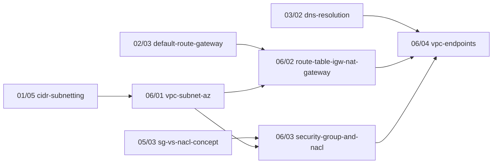
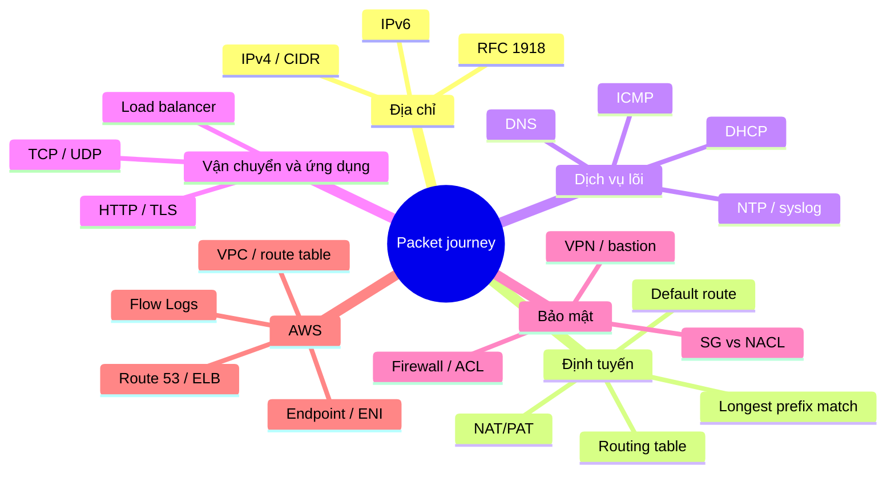

# Network Fundamentals Handbook (Infra / DevOps / Cloud)

## Project Specification

Version: 1.0 (đã duyệt 2026-10-02)

# PART 5 — Knowledge Graph và các bảng Mapping

> Handbook không chỉ để đọc từ đầu đến cuối mà còn để **tra cứu, troubleshoot, ôn phỏng vấn, lập lộ trình học**. Part 5 định nghĩa dữ liệu để làm được điều đó: metadata, đồ thị phụ thuộc, các bảng mapping, taxonomy tag và tiêu chí hoàn thành toàn sách.
> Các bảng ví dụ ở đây là **khung ban đầu**; nội dung đầy đủ được xây dần trong `book/` theo từng chapter. Dòng nào dựa trên seed chưa kiểm chứng đều giữ nhãn `[CHƯA KIỂM CHỨNG]`.

---

# 1. Mục tiêu

Mỗi chapter phải biết:

- mình phụ thuộc chapter nào (`Prerequisites`);
- chapter nào sẽ dùng mình (`Used Later`);
- mình giải quyết triệu chứng/câu hỏi/tình huống nào (các bảng mapping ở dưới).

---

# 2. Metadata của chapter

Định dạng chuẩn nằm ở **Part 2 §2.2** (front matter `tags` + khối `## Metadata`). Không lặp lại ở đây. Quy tắc dữ liệu:

- `Prerequisites` và `Used Later` dùng **slug** `PP/NN-<slug>` giống Part 4.
- `Used Later` chỉ chứa chapter đứng sau; `Prerequisites` chỉ chứa chapter đứng trước (Part 4 §1).
- `Estimated Reading` / `Estimated Practice` là ước lượng của tác giả, ghi dạng "NN phút"; không có chuẩn cứng.
- **Không** có trường `Difficulty` và `Interview Frequency %` (khác repo Java): `Importance` (Must/Should/Nice) là thước đo duy nhất; tần suất phỏng vấn không kiểm chứng được nên không ghi.
- Cột `Prerequisites` ở Part 4 là **nguồn gốc**; metadata từng chapter phải khớp. `tools/lint_chapters.py` kiểm tra khớp (khi công cụ tồn tại).

---

# 3. Dependency Graph

Nguồn dữ liệu: bảng Prerequisites ở Part 4 §3. Quy tắc:

- Đồ thị là **DAG**: không có vòng. Có vòng thì phải tách chapter hoặc đổi chiều phụ thuộc.
- Hỏi "tôi muốn học X mà còn thiếu gì" được trả lời bằng cách đi ngược theo `Prerequisites` đến chapter không có tiền đề.
- Chapter `Must` không nên phụ thuộc chapter `Should/Nice`; nếu có, phải nêu lý do trong ghi chú Part 4 hoặc nâng Importance.

Ví dụ đường đi (từ Part 4): muốn hiểu VPC endpoint, đi ngược:

Đồ thị cho thấy `06/04` là điểm hội tụ của IP/subnet, routing, DNS và security group: thiếu một trong bốn thì không chẩn đoán được lỗi endpoint.

---

# 4. Knowledge Graph (đồ thị chủ đề)

Toàn bộ handbook xoay quanh **packet journey** (`01/01`) và các lớp mà gói tin đi qua. Mỗi nhánh dưới đây là một cụm chủ đề, mỗi chủ đề trỏ về chapter chính:

Đây là đồ thị **chủ đề**; đồ thị **phụ thuộc** nằm ở §3. Hai đồ thị phải nhất quán nhưng không trùng nhau.

---

# 5. Competency Matrix (ma trận năng lực)

Chỉ đo **ở mức Phase** để dễ bảo trì (mức chapter nằm ở Importance). Thang: `0` không đề cập, `1` biết khái niệm, `2` làm được có hướng dẫn, `3` làm và chẩn đoán độc lập.

| Phase | Địa chỉ & subnet | Routing | Dịch vụ lõi | Transport/App | Bảo mật | AWS networking | Troubleshooting | Phỏng vấn |
|---|---|---|---|---|---|---|---|---|
| 00 lab-toolkit | 1 | 1 | 1 | 1 | 0 | 0 | 2 | 0 |
| 01 foundation | 3 | 1 | 0 | 1 | 0 | 0 | 1 | 1 |
| 02 routing | 2 | 3 | 1 | 1 | 1 | 1 | 2 | 1 |
| 03 core-services | 1 | 1 | 3 | 1 | 0 | 1 | 2 | 1 |
| 04 transport-app | 0 | 0 | 1 | 3 | 1 | 0 | 3 | 1 |
| 05 security | 1 | 1 | 0 | 1 | 3 | 1 | 2 | 1 |
| 06 aws-networking | 2 | 3 | 2 | 2 | 3 | 3 | 3 | 2 |
| 07 linux-container | 1 | 2 | 1 | 1 | 1 | 1 | 2 | 1 |
| 08 troubleshooting-interview | 1 | 1 | 1 | 1 | 1 | 2 | 3 | 3 |

Ma trận này là **đề xuất ban đầu**; điều chỉnh sau khi chapter thật được viết.

---

# 6. Troubleshooting Mapping (Debug Mapping)

Đây là sản phẩm quan trọng nhất cho công việc thật. Bảng đầy đủ nằm ở `book/troubleshooting-playbook.md` (định dạng ở Part 3 §6). Dưới đây là **khung ban đầu** để định hướng chapter; chi tiết kiểm tra sẽ viết ở mục 11 của từng chapter và tổng hợp ở `08/01`.

| Triệu chứng | Tầng nghi ngờ | Chapter liên quan | Ghi chú |
|---|---|---|---|
| Không ping được IP đích | L3 | 01/04, 02/01, 02/03, 03/04 | IP/mask → gateway → route → ICMP có bị chặn không |
| Ping IP được nhưng không phân giải được tên | DNS | 03/02, 03/03, 06/06, 06/07 | Kiểm tra resolver, TTL, private DNS |
| Kết nối TCP bị treo (timeout) | L3/L4, firewall | 04/01, 05/03, 06/03, 06/11 | SG stateful vs NACL stateless; seed #5, #14 `[CHƯA KIỂM CHỨNG]` |
| `Connection refused` | L4/ứng dụng | 04/04 | Dịch vụ không lắng nghe cổng đó |
| Máy ở private subnet không ra được Internet | Route/NAT | 02/05, 06/02 | Route `0.0.0.0/0`, NAT, chiều về |
| Lỗi chứng chỉ TLS | L7/TLS | 04/06 | Hạn, chuỗi chứng chỉ, tên miền |
| Instance không nhận được IP | DHCP | 03/01, 06/06 | |
| Chỉ chạy được một chiều | Routing bất đối xứng / firewall stateful | 02/06, 05/01, 06/11 | |
| ALB trả 5xx/timeout bất thường | L7/hạ tầng | 04/07, 06/08 | Đủ IP trống trong subnet? seed #3 `[CHƯA KIỂM CHỨNG]` |
| Private subnet không dùng được SSM/Fleet Manager | Endpoint/DNS/SG | 06/04, 08/02 | Seed #8 `[CHƯA KIỂM CHỨNG]` |
| Nối hai mạng không được vì trùng CIDR | Địa chỉ | 01/06, 06/13 | Seed #7 |

---

# 7. Interview Mapping

Một câu hỏi phỏng vấn thường chạm nhiều chapter; bảng này giúp ôn theo câu hỏi. Danh sách câu hỏi thô (nếu có) nằm ở `spec/raw-interview-questions.md` và được phân phối vào mục 14 của từng chapter (cách trình bày ở Part 2 §3.2).

| Câu hỏi (dạng chủ đề) | Chapter cần ôn |
|---|---|
| Điều gì xảy ra khi gõ một URL vào trình duyệt? | 01/01, 03/02, 04/01, 04/05, 04/06, 02/05 |
| Khác biệt Security Group và NACL? | 05/01, 05/03, 06/03 |
| Subnet public và private khác nhau ở đâu trên AWS? | 01/05, 02/05, 06/01, 06/02 |
| NAT hoạt động thế nào, chiều về đi ra sao? | 02/05, 06/02 |
| L4 và L7 load balancer khác nhau thế nào? | 04/07, 06/08 |
| Chẩn đoán "không kết nối được" như thế nào? | 08/01, 03/04, 04/01, 06/11 |

Danh sách này là khung ban đầu; câu hỏi thật được thêm khi viết mục 14.

---

# 8. Production Mapping

Tình huống production trên AWS và các chapter cần dùng để xử lý. Mọi dòng dựa trên seed ở `spec/story-seeds.md` vẫn là `[CHƯA KIỂM CHỨNG]` cho tới khi có lab hoặc tài liệu.

| Tình huống | Chapter liên quan |
|---|---|
| Quên route table cho subnet mới nên vô tình thành public | 06/01, 06/02 (seed #12) |
| Hai ENI cùng SG không nói chuyện được với nhau | 05/03, 06/03 (seed #4) |
| Interface endpoint chiếm IP định gán cho server | 06/04, 06/05, 06/12 (seed #1) |
| CloudFormation báo circular dependency giữa các SG | 06/12 (seed #10) |
| Chi phí tăng bất thường do NAT/Interface endpoint | 06/02, 06/04 (seed #13); không ghi số tiền |
| Kế hoạch CIDR cho nhiều môi trường dễ đụng độ | 01/06, 06/13 (seed #7) |

---

# 9. Learning Path (lộ trình học)

Đi theo thứ tự dependency (Part 4). Bốn lộ trình đề xuất:

| Lộ trình | Mục tiêu | Chặng chính |
|---|---|---|
| **Cloud nhanh** (≈ 4 tuần, khớp vertical slice Part 4 §5) | Làm việc được với VPC | 01/01 → 01/04 → 01/05 → 02/01 → 02/05 → 03/01 → 03/02 → 04/01 → 04/06 → 05/03 → 06/01 → 06/02 → 06/04 |
| **DevOps đầy đủ** | Vận hành + container | Cloud nhanh + 00/*, 04/*, 06/*, 07/02, 07/03 |
| **Architect** | Thiết kế mạng nhiều môi trường | 06/09 → 06/10 → 06/12 → 06/13 → 08/05 |
| **Ôn phỏng vấn** | Trả lời câu hỏi mạng/AWS | 08/01 → 08/03 → 08/04, rồi chapter liên quan theo §7 |

Thời gian chỉ là ước lượng, điều chỉnh theo người học.

---

# 10. Chapter Tags

Tag nằm trong front matter (Part 2 §2.2) để MkDocs lọc theo tag. Bộ tag chuẩn (mở rộng khi cần, ghi vào đây):

| Nhóm | Tag mẫu |
|---|---|
| Lớp / chủ đề | `IP`, `Subnet`, `Routing`, `NAT`, `DHCP`, `DNS`, `ICMP`, `TCP`, `UDP`, `HTTP`, `TLS`, `LoadBalancer`, `Firewall`, `ACL`, `VPN` |
| Nền tảng | `AWS`, `Linux`, `Docker`, `Kubernetes`, `CloudFormation` |
| Mục đích | `Lab`, `Troubleshooting`, `Interview`, `Concept` |
| Importance | `Must`, `Should`, `Nice` |

Quy tắc: tag viết đúng như bảng (PascalCase, không dấu, không khoảng trắng); không tạo tag trùng nghĩa; mỗi chapter có tag Importance.

---

# 11. Glossary, Cross-Reference Index, Troubleshooting Playbook

Ba file bổ sung là phần dữ liệu tra cứu của sách. Định dạng cột ở **Part 3 §6**. Quy tắc cập nhật sau mỗi chapter hoàn thành:

| File | Khi nào cập nhật |
|---|---|
| `book/glossary.md` | Mỗi thuật ngữ mới (mục 17 của chapter phải khớp) |
| `book/cross-reference-index.md` | Khi chapter có mục 8 AWS mapping hoặc chapter khái niệm có bản AWS tương ứng |
| `book/troubleshooting-playbook.md` | Khi chapter có mục 11 Troubleshooting |

---

# 12. Quan hệ giữa các cơ chế Mapping (tránh trùng lặp)

Mỗi loại dữ liệu có **một nguồn chuẩn**; nơi khác chỉ trích dẫn:

| Dữ liệu | Nguồn chuẩn |
|---|---|
| Phụ thuộc giữa chapter | Part 4 §3 (và metadata khớp với nó) |
| Triệu chứng → kiểm tra | `book/troubleshooting-playbook.md` (§6 ở đây chỉ là khung) |
| Khái niệm ↔ AWS | `book/cross-reference-index.md` (Part 4 §4 là danh sách ban đầu) |
| Objective CCNA ↔ chapter | `spec/ccna-coverage-map.md` |
| Thuật ngữ | `book/glossary.md` |
| Ý tưởng Story / Break it | `spec/story-seeds.md` |

Khi hai nơi mâu thuẫn, sửa nơi không phải nguồn chuẩn.

---

# 13. Tiêu chí hoàn thành toàn sách

Cuốn sách đạt "hoàn thành" khi:

- [ ] Mọi chapter `Must` có `Status: done` theo Part 2 §8.
- [ ] `ccna-coverage-map.md` không còn objective nào chưa phân loại.
- [ ] `glossary.md`, `cross-reference-index.md`, `troubleshooting-playbook.md` phủ mọi chapter đã `done`.
- [ ] Mọi sự thật AWS có `verified` + ngày hoặc đã được đánh dấu rõ `[CHƯA KIỂM CHỨNG]` trong danh sách việc cần làm.
- [ ] `tools/lint_chapters.py` sạch, gồm quét thông tin nhạy cảm.
- [ ] Không còn dữ liệu thật trong repo (CLAUDE.md §4).

---

Đây là **Part 5** của Specification (v1.0).
